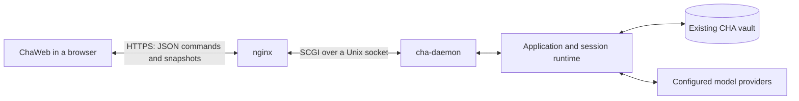

# ChaWeb design

Status: proposed implementation with the stage 1 UI design accepted. This
document specifies new work; it does not describe an already available browser
application or API.

## 1. Purpose and stages

ChaWeb is a small, standalone browser application for chatting in CHA. It uses
existing forums, characters, personas, providers, and stored sessions from the
daemon's configured vault. Configuration remains in CHA.

The application should have the simplicity of a small chat client such as
MiniChat, with navigation and conversation behavior designed for CHA.

| Stage | Deliverable |
| --- | --- |
| 1: UI without voice support | Forum selection, session creation and history, text conversations, character addressing, replies updated by snapshot polling, Stop, and recovery after connection loss. |
| 2: UI with voice support | Microphone input and speech playback using existing CHA configuration, added to the same conversation UI and API. |

Stage 1 accepts text from iPhone keyboard dictation through the normal editor.
Stage 2 adds application-managed voice input and playback; keyboard dictation
needs no CHA voice API or settings.

New conversations remain local drafts until the first Send. Character
addressing uses CHA's existing text commands, Jev, and saved forum defaults.
ChaWeb changes no CHA configuration. Session renaming, a target selector,
settings screens, general forum or character editing, provider management,
vault selection, backups, transcript editing, regeneration, attachments, and
offline operation are outside stage 1. Existing conversations can contain
content produced by these features; ChaWeb must still display that content
correctly.

Stage 2 must not require replacement of the text API or session model. It will
need additional media endpoints and browser controls. Do not implement unused
media endpoints, audio queues, or microphone controls in stage 1.

## 2. Architecture



nginx serves the static ChaWeb build and its API on the same origin. Each user
has a separate HTTPS listening port in nginx. That port's server block routes
ChaWeb API requests to the user's fixed Unix socket. systemd continues to own
the Unix socket and activate the daemon on demand.

This stage is for private use on a trusted network. ChaWeb has no API-key login:
the listening port selects the user. Anyone who can reach a user's port can
use that user's conversations. The existing OpenAI listener keeps its bearer
API-key routing separately.

`cha-daemon` adds a CHA-specific adapter under `/api/cha/v1/`. It translates
requests into existing `app::Application` operations and returns JSON or an
empty success response. The browser polls complete session snapshots while
generation is active. The existing OpenAI adapter remains under `/v1/` with its
current response behavior.

The daemon remains the authority for session identities, transcripts,
participants, generation state, titles, and persistence. The browser owns
navigation, unsent drafts, rendering, and connection recovery. It sends the
first input with a session-creation request and later input to the returned
session ID. It does not send a reconstructed conversation or extract session
identifiers from message text.

A browser request, a stored chat session, and a provider request are different
lifetimes. Accepted input and its stored session survive completion or loss of
a ChaWeb HTTP request. The existing runtime and provider workers continue
processing after the input acknowledgement is sent.

### Existing code to reuse

| Existing area | Use in ChaWeb |
| --- | --- |
| `src/app/application.*` | Bootstrap, create/list/open sessions, input, Stop, snapshots, and deletion after rejected first input. |
| `src/runtime/` | Serialized session commands, owning snapshots, generation lifecycle, and retirement. |
| `src/runtime/protocol.cpp` | Existing JSON serializers for bootstrap, snapshots, session listings, creation results, and errors. |
| `src/session/` and `src/storage/` | Character behavior, transcript storage, automatic naming, and startup recovery. |
| `src/daemon/scgi.*` | Existing SCGI framing, socket I/O, and shutdown cancellation; capture `CONTENT_TYPE` for ChaWeb POST validation. |
| `webapp/src/components/Markdown.tsx` and character appearance code | Existing sanitized message rendering and speaker presentation. |
| `webapp/src/api/`, `webapp/src/state/bootstrap.ts`, and `resources/dto.yaml` | Existing DTOs, generated types, snapshot/list guards, and bootstrap validation. |
| `webapp/src/useLiveSession.ts` | Reference for navigation epochs, draft preservation, and recovery; reuse only transport-independent parts. |

Keep the HTTP adapter above the application layer. Do not put nginx, SCGI, or
port-to-user routing in controllers or storage. Expose only the chat
operations; the full native bridge also permits settings and vault operations.

Keep the serial accept loop from the headless design: one SCGI request runs to
completion before the next is accepted. ChaWeb uses finite responses,
so it does not need connection workers or a persistent output subscription.
The existing runtime thread and provider workers remain unchanged.

## 3. Browser application

### Screens and navigation

iPhone browser use is the primary design target. Use two
full-screen views that replace each other. Keep this navigation model on larger
screens too; there is no sidebar or navigation drawer.

The conversation view contains the transcript and composer. It has no top
header, forum name, or session title. The transcript uses all space above the
composer within the browser's visible area. Long messages wrap; code blocks
scroll within their own area.

The forums/sessions view contains:

- A full-width native combobox at the top with the available forums. Its value
  is the selected forum's name. Changing it loads that forum's session list.
- A list below it with the selected forum's stored sessions, ordered by most
  recent activity. Each row shows its title and date/time. Mark the current
  session with a check when it belongs to the selected forum. The whole row
  is a touch target; tapping it opens that conversation.
- A New Session button at the bottom, kept reachable while the list scrolls.
  It opens the local draft for the selected forum.

There is no Done button or extra Forums/Sessions heading. Tapping a session
opens it immediately, including when returning to the current session. Forum
selection alone does not open or create a session. Use this view to inspect
forum names and session titles; they do not occupy space above the chat.

The icon-only Sessions button below the prompt editor opens the forums/sessions
view on the conversation's forum. Preserve the conversation, draft, and editor
size mode while browsing the list. For an unsent new conversation, New Session
in its forum returns to that forum's existing local draft.

Do not add title labels or legends above panels, or explanatory copy that
repeats obvious control behavior. Use text for controls, actionable state,
validation, and errors. Use compact icons with accessible names and touch areas
of about 44 by 44 CSS pixels. A small visible icon must still be easy to tap.

Use hash routes such as `/#/forums/{forum_id}/sessions/{session_id}` for stored
sessions. They support bookmarks and browser Back and Forward without server
routing for every URL. The forums/sessions view is local view state and needs
no additional route. A new conversation is also local view state: clear the
stored-session hash when opening it and set a stored-session route after
creation succeeds. Back and Forward do not restore a distinct new-conversation
route, and drafts do not survive reloads.

At startup, restore a valid route. Otherwise show forum selection and its
session list. Do not create a conversation just because the page loaded. The
built-in Entrance forum and process-local Welcome conversation are hidden in
ChaWeb. Validate the complete bootstrap, then filter navigation using its
`entrance_forum_id`; do not use its initial-session fields to open Welcome.

### Creating and continuing sessions

New Session opens an empty conversation with a local draft for the selected
forum. Keep that forum's identity from bootstrap without adding a chat header
or an empty-state title. This action makes no session-creation request and does
not start snapshot polling. Leaving the draft needs no server cleanup.

The first Send calls `POST /forums/{forum_id}/sessions` with the draft's `text`.
On `201`, associate the draft with the returned `id`, set the stored-session
route if it is still the current view, and fetch the first snapshot. Later
messages use `POST S/input`. CHA's existing naming process
supplies the title after the first accepted input. On `422`, keep the local
draft; no stored session remains from that request.

Refresh the session list on navigation, after creation and accepted input,
when a snapshot changes the title or shows completion of a turn, and on return
to the foreground. The list is inexpensive enough to load in full in stage 1;
neither paging nor a search index is required. Do not present
`SessionListing.live` as proof that a session is generating.

Changing session stops polling the previous view without stopping generation.
CHA can finish that conversation in the background and store its result.
Returning to it selects the session again and loads its current state. The
existing runtime session limit still applies.

### Transcript and composer

Render each stored entry with its own participant identity and display name.
Preserve entry order, timestamps, Markdown, and complete/streaming/cancelled/
failed status. Multiple character replies remain separate entries. Old entries
retain their stored authorship even if the current roster has changed.

Use the existing character appearance vocabulary and Markdown sanitizer.
Token counts, search indicators, special covered-history styling, and a
jump-to-latest button are not required. Keep any that come with a suitable
reused transcript component without extra work. Render covered history as
part of the transcript even without special styling. Reasoning text remains
in snapshot JSON but is not displayed.

The composer has a full-width multiline text editor and a separate compact
control row underneath. The icon-only Sessions button sits at the left; the
Send icon sits at the right and becomes Stop when cancellation is available.
Keep both controls outside the text field so they do not reduce its width or
cover its text. Show actionable state or notices without adding permanent
explanatory labels.

The editor has two sizes: compact, roughly two lines, and expanded, roughly
half the usable visible area. Start compact. Put an icon-only native
`button type="button"` between the transcript and editor to toggle the sizes,
with the accessible name Expand editor or Shrink editor for its current action.
Support taps, clicks, and the button's native Enter/Space activation. There is
no drag handle or custom keyboard resizing. Long drafts scroll inside the
editor instead of making it grow automatically.

Keep the chosen size mode in browser memory across Send, snapshot updates, and
session navigation. Calculate its height from the current visible area, allowing
space for the controls and some transcript even when the keyboard is open;
remember the mode, not a pixel height. Toggling must preserve the draft,
selection, and transcript reading position. Tapping the toggle while editing
must keep the keyboard open and the caret intact. When already following the
end, keep the latest output visible.

On desktop, keep CHA's existing convention: Enter sends and Ctrl+Enter inserts
a newline. On phones and tablets using a touch interface, Enter inserts a
newline; use the visible Send button to submit. Use the primary coarse-pointer
media query for this behavior, rather than touch support alone on a laptop.
Never send during IME composition. Keep keyboard focus predictable after
sending and navigation.

Every message uses the existing raw input path, including `@Name`, `/mcast`,
and `@-` for first and later messages. Preserve the saved forum default and
existing Jev behavior: classification can choose recipients for ordinary
input, while an explicit mention fixes the recipient. The browser must not
add a second set of input parsing rules.

For a local new conversation, enable Send after bootstrap has supplied a valid
forum. For a stored session, wait for the first valid snapshot before enabling
Send. Disable it while creation, input, or Stop is pending, while the session
is busy, or while a request outcome or the current session state is unknown.
Keep the draft editable. Stop is disabled for a local new conversation
and while its first Send is pending. Enable it after the `201` response supplies
the session ID. This response can take about ten seconds while Jev and naming
complete. For an existing session, Stop remains available while input is pending
and during generation. It can wait behind the input handler, including Jev and
automatic naming; show Stop requested until the daemon can process it. A late
acknowledgement must not clear a draft the user has since edited.

The browser does not check prompt length before Send. The server enforces its
configured `prompt_limit` in UTF-8 bytes. If the message is too long, show the
returned error and keep the draft.

Keep drafts by forum/session identity in memory across in-app navigation and
network recovery, with one local new-conversation draft per forum. New Session
returns to that draft if it exists. Draft persistence across page reloads is
outside stage 1; stored conversation history always comes from CHA.

Follow new output only while the user is near the end of the transcript. When
the user scrolls up, preserve the reading position; the user can scroll down
to resume following output. Use the same rule for replacement snapshots during
recovery.

### iPhone keyboard and dictation

Use the Visual Viewport API for the app layout. Safari's software keyboard can
shrink the visual viewport without shrinking the layout viewport, so layout
viewport height alone is insufficient. Apply these rules to both full-screen
views:

- Set the viewport meta tag to
  `width=device-width, initial-scale=1, viewport-fit=cover`.
- Set the app container height from `window.visualViewport.height` and align
  its top with `window.visualViewport.offsetTop` relative to the layout
  viewport. Synchronize on initial load and on the visual viewport's `resize`
  and `scroll` events.
- Prevent scrolling on `html` and `body`. Use a column flex layout inside the
  app, with internal scrolling for the transcript, session list, and editor.
  Let the transcript or list shrink with `min-height: 0`. Keep the composer
  and its control row in the flex layout, above the keyboard.
- Use `box-sizing: border-box` for the measured app container and safe-area
  padding, including `env(safe-area-inset-bottom)` for the home indicator and
  the top/side insets as needed. Include padding within the measured height.
  Safe-area insets describe screen obstructions, not keyboard height.

See the [Visual Viewport reference](https://developer.mozilla.org/en-US/docs/Web/API/VisualViewport)
and [WebKit's safe-area guidance](https://webkit.org/blog/7929/designing-websites-for-iphone-x/).
Recalculate the expanded editor's height within this available space. Use at
least 16 CSS pixels for editor text. Verify keyboard opening and dismissal,
Safari browser controls changing size, and phone rotation on an actual iPhone.
Opening an existing session does not automatically focus the editor or open
the keyboard. Entering the session list dismisses the keyboard while preserving
the draft.

Use a standard `textarea` compatible with iPhone keyboard Dictation. The user
taps the editor, taps the keyboard's microphone, dictates, reviews or edits the
text, and taps Send. Dictation is enabled in the iPhone's keyboard settings.
ChaWeb receives ordinary text and uses the existing input API. It does not
record or upload audio, call the Web Speech API, or expose its own microphone
button in stage 1. CHA's speech-provider settings are not involved.

Incoming snapshots must not remount the editor, move its caret, or overwrite
typed or dictated text. Test dictation while another reply is being polled;
dictation must never send a message automatically.

### Opening the application

The user opens or bookmarks the HTTPS address with their assigned port, such
as `https://cha.example.test:8443/`. On load, request bootstrap from the same
origin, then restore a valid session route or show the forums/sessions view.
There is no API key field, Connect/Disconnect control, credential storage, or
third connection screen. Bootstrap failures use the ordinary read-recovery
behavior.

All API URLs are relative to the page's origin, including its port. To use
another user's daemon, open that user's assigned address. There is no in-app
user selector or server URL setting.

### Browser use in stage 1

The intended stage 1 workflow is one active browser view per user. There is no
server-side tab reservation or exclusive view slot. Snapshot requests do not
consume `SessionOutput`, so a second tab does not produce a subscription conflict.

Simultaneous tabs are not kept synchronized while idle, and their requests can
change the runtime's selected session. Do not add multi-tab coordination in
this stage. Each request identifies its forum and session; each page ignores
responses from its old navigation state and refreshes when it regains focus.

## 4. HTTP API

### Conventions

Base path: `/api/cha/v1`.

- JSON request and response bodies use UTF-8. All three ChaWeb POST endpoints,
  including Stop, require `Content-Type: application/json`. Before parsing JSON
  or performing an application operation, reject a missing or unsupported
  content type with `415`. Match the media type case-insensitively, allowing
  surrounding whitespace and parameters such as `charset=utf-8`; do not use
  a prefix or substring match. With an accepted content type, malformed JSON
  returns `400`. GET requests need no content type.
- Requests use the page's origin. The application adds no API key or bearer
  authorization header; browser-managed HTTP authentication can be sent.
  nginx selects the daemon from its configured listening port, not request data.
- Forum and session IDs are opaque, URL-safe identifiers. Validate them as
  identifiers, and verify the session belongs to the forum. Never interpret
  an ID as a filesystem path.
- nginx adds `Cache-Control: no-store` to all ChaWeb API responses, including
  errors. The browser sends API requests only to its own origin; the API
  provides no CORS support.
- Keep response bodies specific to the operation. Do not add a generic RPC
  envelope, arbitrary method dispatch, or a general job API.
- Reject unknown request fields so misspelled commands do not appear to work.
  Clients tolerate additional response fields and validate the fields they use.

The content-type requirement prevents other websites from submitting a simple
cross-origin POST that starts a turn. A `text/plain` request can reach a private
server even when its response cannot be read. A cross-origin request with
`application/json` requires a successful CORS preflight. Keep `OPTIONS` an
unsupported method returning `404`, without CORS permission headers. Same-origin
ChaWeb requests need no preflight. See the [CORS request rules](https://developer.mozilla.org/en-US/docs/Web/HTTP/Guides/CORS).
This rule applies to ChaWeb; the OpenAI adapter keeps its current behavior.

### Endpoint summary

In this table, `S` means `/forums/{forum_id}/sessions/{session_id}` under the
base path. Endpoint names below are proposed wire contracts.

| Method and path | Request | Successful response |
| --- | --- | --- |
| `GET /bootstrap` | None | `200`: existing `Bootstrap` JSON directly. |
| `GET /forums/{forum_id}/sessions` | None | `200`: existing `SessionListing[]` JSON. |
| `POST /forums/{forum_id}/sessions` | Existing `InputRequest`: `{ "text": "..." }` | `201`: existing `CreateSessionResult`, `{ "id", "label" }`. Creates an unnamed session and accepts its first input; generation may continue after the response. |
| `GET S` | None | `200`: existing `SessionSnapshot` JSON. Selects or opens the stored session as needed. |
| `POST S/input` | Existing `InputRequest`: `{ "text": "..." }` | `204`, no body: input accepted. Generation normally continues after this response. |
| `POST S/stop` | `{}` | `204`, no body: Stop succeeded. Final state arrives through snapshots. |

The same snapshot endpoint supplies both initial history and later updates.
Selecting or opening a stored session does not create a new durable
conversation. There is no separate subscription or event endpoint.

Every request for a named session follows the same sequence: validate the
request, call `open_session()`, then perform the operation. This covers
snapshots, input, and Stop. Opening selects the session, reusing its live
controller or loading its stored transcript. An unknown
forum/session returns `404` from opening. If opening or the operation fails,
return the error without repeating it or creating a replacement session.

Stage 1 provides no configuration writes or session-renaming endpoint. Any
unsupported method and path pair returns `404`.

### Bootstrap

Call `application.bootstrap()`, check that the application is running, and
return its `presentation` directly with the existing `to_json(Bootstrap)`.
Do not return the native bridge envelope or its epoch and configuration
capabilities.

Keep the existing forums, characters, personas, recent sessions, initial IDs,
`entrance_forum_id`, `vault_name`, and `vaults`. The vault names belong to the
user assigned to that port and need no separate filtering. Character summaries
may also contain voice IDs and speed settings; these contain no credentials
or native media URLs. ChaWeb ignores metadata for controls it does not provide.

Reuse `validateBootstrap()` before hiding Entrance and its sessions in the UI;
that validator requires Entrance to be present in the complete object. Keep the
validated data intact and filter only the displayed navigation. The browser
uses this bootstrap for forum, character, and persona information.

Unused or obsolete voice settings must not prevent text bootstrap or chat;
log warnings where needed.

### Creating a session with its first input

`POST /forums/{forum_id}/sessions` requires `text`. Validate the forum, request
shape, and input size before creating anything. Then call
`create_session()` with an empty label, `open_session()`, and `submit()` with
`RawCommand{text}`. Use the same acceptance check as ordinary input:
`CommandResult.session.input_consumed`. Return `201` as soon as input is accepted,
including a self-note, with the existing `CreateSessionResult` JSON. Its `id` is
the new session ID; the forum is already known from the request. The next
snapshot supplies the current notice. Do not add a wait for a character reply
or a final title; existing Jev classification can wait for naming as part of
input acceptance.

If CHA definitively rejects the first input, delete the newly created session
before returning `422 invalid_argument`. Use normal `delete_session()`, not
conditional unused-session deletion: raw input can retain the session before
rejecting it. If an earlier operation definitively fails without submitting
input, also delete the new session before returning that operation's error.
Treat an already absent session as cleaned up. If cleanup fails, log the error
and return `500`; do not promise that no session remains.

These operations are not one transaction. Keep existing startup recovery for
crashes and interrupted cleanup. A timeout or unexpected failure can leave the
input outcome unknown; retain the session and use the failure/recovery rules
below. Accepted input also keeps its session if later generation fails. This
adapts the OpenAI adapter's create/submit/delete-on-rejection pattern without
changing that adapter. ChaWeb needs no discard endpoint or navigation cleanup.

### Input

Submit every message's `text` through the existing raw input path. CHA resolves
mentions, multicast, self-notes, Jev classification, persona, and provider
settings. Do not duplicate that grammar in the browser.

Raw input keeps its existing classification, cancellation, persistence, and
delayed-reply behavior. Stage 1 needs no changes to runtime commands or snapshots.

Return `204` with no body when the application accepted the input, including
a self-note that creates no character reply. Determine this from
`CommandResult.session.input_consumed`, not from `clear_input`. Existing parser
errors can set `clear_input` without accepting a turn. For rejected input,
return `422 invalid_argument` with the safe notice and preserve the draft.

After `204`, fetch a snapshot for the current notice and conversation state.
The snapshot holds the latest notice; later activity may replace or clear it.
It is not a record of every command acknowledgement.

After the common `open_session()` step, `POST S/input` calls `submit()` with the
existing command deadline. The browser needs no separate open request.

The serial request handler waits for acceptance, including classification when
configured, then returns. It does not wait for the character's complete reply.
Provider failures after acceptance appear as error entries and failed status
in later snapshots. While this handler waits, other HTTP requests, including
Stop and snapshot polls, wait in the socket backlog.

### Stop

Stop addresses the session in the URL, independently of the viewed session.
It calls `open_session()`, then `stop()`, like the other session operations.
A retired session is loaded and selected first; an idle session needs no further
cancellation, so Stop is safe to repeat. Opening an unknown session returns
`404`. Return `204` with no body after `stop()` succeeds, including when the
session is already idle. The browser fetches a snapshot and keeps displaying
stopping state until that snapshot says generation is inactive.

Stop cannot interrupt a preceding input handler in the serial accept loop.
Jev currently has a five-second deadline, but classification completion can
also wait for automatic naming, whose deadline is ten seconds. The general
command deadline is thirty seconds. These are current implementation bounds,
not a promise that Stop responds within one polling interval. Stop is processed
after the preceding request finishes; by then a short reply may already be
complete. This delay is an accepted stage 1 tradeoff.

### Failure and retry rules

Daemon JSON errors reuse `ErrorResponse` from `resources/dto.yaml` and the
existing C++ `Error` serializer. Rejected input uses `invalid_argument` with
status `422` and CHA's safe notice. No schema, enum, or generated-type change
is needed; the body keeps the existing shape:

```json
{
  "error": {
    "code": "invalid_argument",
    "message": "A safe, actionable description."
  }
}
```

The ChaWeb adapter uses six error statuses: `400` for invalid requests and
oversized prompts, `404` for unknown routes or resources, `415` for unsupported
content types, `422` for rejected input, `503` while the daemon is stopping,
and `500` for other application failures. Keep existing error codes and safe
messages in the body. A command timeout returned as `500` still has an unknown
input outcome; it is not evidence that a write failed without side effects.

| Status | Browser behavior |
| --- | --- |
| `404` | Refresh the forum and session lists; keep the draft. |
| `422` | Show CHA's safe notice and keep the draft. |
| Any other error | Show the safe error message and keep the draft. |

For `415`, use the existing `invalid_argument` error code with a safe message
that the request must use `application/json`. It follows the ordinary error
display behavior above and needs no new error-code enum value.

The existing SCGI 16 MiB body-limit response stays `413`; it is outside the
adapter's status mapping. nginx can also return `413`, `502`, or `504`, with
non-JSON bodies. Check status and response content type before parsing. Use a
generic failure message when no safe JSON message is available; never render
an HTML proxy error as conversation content or expose raw exception text. The
table defines error presentation; the read-retry and uncertain-write rules
still apply.

Automatically retry safe reads with backoff. Do not replay creation with first
input or later input requests after a network error or timeout. A lost response
does not prove the operation failed.

For an uncertain input result in a known session, keep the draft and fetch its
snapshot. Show: "Send status unknown. Check the conversation before sending
again." Do not infer an exact acknowledgement from matching message text.
If the command timed out, it may still be pending even when the first recovery
snapshot has no new entry. The UI must not silently turn recovery into Resend.
For an uncertain first Send, keep the local draft, show the same unknown-outcome
message, and refresh the forum's session list. Let the user select and inspect
the created session if it is present. It may already contain the input and a
reply. An initially absent session does not prove failure; do not silently
create another one or replay the first input. The browser has no session ID for
snapshot polling or Stop until creation succeeds or the user identifies a
session from the list.

Stage 1 does not promise exactly-once execution across connection loss or
daemon restart. Avoiding automatic write retries is the initial policy; there
is no durable request ledger or background outbox. Stop may be repeated because
its effect is safe to repeat.

## 5. Snapshot polling

### Snapshot contents and loading

`GET S` returns the existing `to_json(SessionSnapshot)` output directly. The
snapshot already includes `forum.id` and `session_id`, so it needs no outer
identity wrapper. Reuse `SessionSnapshot` and `isSessionSnapshot()` in the browser.

Keep `generation.reasoning_text`, entry `has_cached_audio`, `recent_pending`,
`discardable`, and optional voice metadata in the existing JSON. ChaWeb ignores
these fields in stage 1; it does not add voice or cleanup behavior from them.
The serializer adds no credential fields or native media URLs. Preserve stable
entry IDs for future speech playback.

For each snapshot request:

1. Validate the full forum/session identity.
2. Call `open_session()` to make that session selected. This loads a retired
   session or reuses the live controller; it does not reconstruct a live session
   on each poll. Selecting again also cancels pending idle retirement when the
   user returns to a session that was generating in the background.
3. Call `snapshot()`. The runtime executes the snapshot command in order with
   mutations and returns an owning value. Return its error if it fails.
4. Serialize with the existing `to_json(SessionSnapshot)`, finish the response,
   and close the connection.

Selecting on each read preserves runtime selection without another navigation
endpoint. A selected session cannot retire from idleness, and the serial loop
runs no other request between opening and taking the snapshot. No additional
open or operation retry is needed inside the handler.

ChaWeb does not call `subscribe()`, `take_output()`, or `acknowledge_output()`.
The session runtime processes provider events and persists results even when
no output consumer is attached. Closing a request or leaving a page does not
call `close_session()` or Stop.

### Poll schedule

Local new conversations have no snapshot to fetch; start only after obtaining
a session ID.

- While the page is visible, fetch on session selection, creation/input/
  Stop acknowledgements, and return to the foreground. Coalesce refresh triggers;
  if a read is already running, perform the refresh with the next read.
- Permit only one snapshot request at a time. Schedule each routine poll one
  second after the previous read finishes, without accumulating queued polls.
- Continue routine polling only while the conversation view and page are
  visible and the latest snapshot has `generation.active`. Stop when it is false.
- Stop the previous polling task on navigation, and pause
  scheduling while the page is hidden. Fetch current state on return. Backend
  work continues while the browser is absent.

Send commands immediately. Pending commands do not suspend polling, and an
already running snapshot read finishes normally.

Replies appear in steps of roughly one second plus request latency. A reply
that finishes between reads can appear all at once. An accepted input is still
shown as pending locally until the next authoritative snapshot contains it;
do not insert an invented durable entry into the transcript.

Each valid snapshot replaces the current conversation state. Keep message
components keyed by entry ID and preserve the draft, editor size mode, focus,
selection, and reading position. Keep the editor mounted while applying
snapshots so that keyboard dictation is not interrupted. Do not concatenate
snapshots or merge entries by matching displayed text. Refresh the session list
when the snapshot changes the title or shows completion of generation.

Do not poll for automatic naming alone. Jev classification waits for naming
before accepting input, but self-notes bypass classification and can start
naming without a character reply. After a short reply or a self-note, a
temporary title can remain visible until the next refresh. Naming's ten-second
deadline bounds backend work, not how long the browser displays the old title.
Navigation, return to the foreground, and the next accepted input refresh the
session list and the selected snapshot through the ordinary refresh rules.

Full transcripts are the initial contract. Enable JSON compression in nginx.
Compression reduces transferred bytes but does not remove snapshot construction,
JSON parsing, or rendering costs. Measure long sessions before adding a `since`
parameter, revisions, partial responses, or paging.

### Request failures and recovery

For JSON responses, use ordinary `fetch()` parsing and the shared guards before
applying data. A `204` has no body to parse; trigger the snapshot refresh instead.
Tag requests with the local navigation generation. For snapshots,
check `forum.id` and `session_id` against the requested identity; for lists and
creation results, keep the forum from the originating request. Ignore stale
snapshots after navigation. Apply mutation acknowledgements only to their
originating draft/session. A late creation response can associate that draft
with its session ID, but must not change a different view's route or draft.

If a read fails, keep the last transcript and editable draft, show Reconnecting,
and retry with delays of 1, 2, 4, then at most 10 seconds. On recovery, refresh
bootstrap to update forum information, then request the current snapshot.
An ordinary restart using the same vault preserves forum
and stored session IDs, so the browser can reopen the selected conversation.
Use a finite browser request timeout; 60 seconds is the initial stage 1 value.
For `404`, stop polling the failed session and apply the behavior in
section 4. Invalid response data or persistent read failure shows an error
rather than retrying indefinitely.

The next successful snapshot contains current state without event replay,
sequence repair, or subscription recovery. Failed reads do not imply that
generation stopped. Disable Send while the current state is unknown; preserve
the editable draft and allow an explicit Stop request for the named session.

A failed write still has the uncertain-outcome rules in section 4. A timeout or
closed connection is not permission to resubmit input. Do not use matching
transcript text to claim an exact acknowledgement.

## 6. Serial daemon requests

Keep the existing accept/read/handle/write/close loop. Route `/api/cha/v1/` to
the new JSON adapter and `/v1/` to the existing OpenAI adapter. The handlers use
public application methods and owning protocol values; controllers and SQLite
remain behind the application boundary.

At the start of each request, capture `application.context_epoch()` once, as
the OpenAI adapter does. Pass that value to all application operations in the
request, including creation, submission, and rejection cleanup. Keep existing
application admission checks. The epoch stays internal to the daemon; it does
not come from the browser. This daemon exposes no vault maintenance operation
that changes the epoch while the process runs.

The serial loop does not serialize the duration of model generation. The input
handler returns when input has been accepted, and existing runtime/provider
workers continue the turn. The next HTTP request can then read progress or
request Stop. Several previously selected sessions can continue generating
under the existing runtime session limit.

### Bounds and shutdown

Retain the existing SCGI header limits, global 16 MiB body limit, and application
deadlines. nginx enforces the 256 KiB request-body limit for the ChaWeb API.
After JSON decoding, the adapter still checks the application's input-byte
limit. No per-route daemon body limits are needed.

nginx is the daemon's only SCGI peer and buffers both ChaWeb requests and
responses. Reuse the existing socket reads and writes, including shutdown
cancellation, without adding daemon I/O deadlines. Preserve the existing
OpenAI streaming response behavior.

Use the existing application open and command deadlines. If a ChaWeb caller
disappears after a mutation was admitted, let the application settle it under
its normal rules. Discarding a reply is not rollback, and a lost acknowledgement
does not by itself require stopping the daemon.

Preserve the existing shutdown sequence: stop accepting, use the existing stop
flag to cancel socket waits, and leave the current handler. Application calls
retain their existing deadlines. Then request application shutdown and wait
for the existing grace period. Keep the forced-exit fallback. There are no new
connection workers or subscription cleanup to join before destruction.

### OpenAI compatibility

The OpenAI adapter and its wire behavior remain unchanged, including its
disconnect-cancels-turn behavior. Both adapters are called by the same serial
loop. ChaWeb does not consume a session's output subscription, so no new
cross-adapter admission mechanism is required.

A long OpenAI turn occupies the handler until it ends and delays every queued
ChaWeb request, including Stop. Those requests can exceed browser or nginx
timeouts. Concurrent use of the two clients for one user is outside stage 1;
report ordinary request failures and apply the existing no-write-replay policy.
Do not add an exclusive browser slot or a new adapter-conflict response.

## 7. nginx, SCGI, and deployment

### Routing by listening port

Assign one nginx listening port to each user. Use one server block per user,
with a fixed `scgi_pass unix:/run/cha/<user>.sock` for `/api/cha/v1/`. All server
blocks serve the same static ChaWeb build. For example:

| Browser address | Daemon socket |
| --- | --- |
| `https://cha.example.test:8443/` | `/run/cha/alice.sock` |
| `https://cha.example.test:8444/` | `/run/cha/bob.sock` |

The listening port determines the daemon. A request body, URL parameter, or
header cannot select another socket on that port. Each daemon uses its own
configured vault. No user or port field is added to the API or SCGI protocol.

These listeners are for the trusted private network. Port selection provides
routing, not authentication or access isolation between people on that network.
Keep the existing OpenAI listener, bearer-key map, and `/v1/` route unchanged
in their separate configuration; the new ChaWeb listeners expose only the
static application and `/api/cha/v1/`.

Use the same origin for static files and the API, including the assigned port.
Use the default `fetch` credentials mode, `same-origin`, and reject redirects
for API requests. This permits browser-managed Basic authentication if the
operator later enables it in nginx, without adding a ChaWeb login screen.
The application adds no bearer header. Do not add permissive CORS headers or
approve cross-origin preflights.

Preserve the existing exclusive vault lease: a separate native CHA process
cannot open the same database while the daemon owns it. Configuration editing
uses the established deployment workflow, with the daemon stopped when that
workflow requires exclusive access. ChaWeb does not add a second database
owner or a remote settings editor.

This example defines Alice's listener at the origin root. Replace the private
address, hostname, static directory, and TLS configuration with deployment
values. Add a corresponding server block for Bob with port `8444` and socket
`/run/cha/bob.sock`. nginx selects the server block using the listening address
and port; see [nginx request processing](https://nginx.org/en/docs/http/request_processing.html).
The existing local listener remains useful for SSH tunnels and development.

```nginx
# http context; repeat this server block with each user's port and socket.
server {
    listen 192.168.1.10:8443 ssl;
    server_name cha.example.test;
    # Configure ssl_certificate and ssl_certificate_key for this deployment.

    root /srv/cha/chaweb;

    location = / {
        add_header Cache-Control "no-cache";
        try_files /index.html =404;
    }

    location = /index.html {
        add_header Cache-Control "no-cache";
    }

    location /assets/ {
        add_header Cache-Control "public, max-age=31536000, immutable";
        try_files $uri =404;
    }

    location /api/cha/v1/ {
        add_header Cache-Control "no-store" always;
        client_max_body_size      256k;
        include                   scgi_params;
        scgi_pass                 unix:/run/cha/alice.sock;
        scgi_pass_request_headers off;
        scgi_request_buffering    on;
        scgi_buffering            on;
        scgi_cache                off;
        scgi_ignore_client_abort  off;
        scgi_read_timeout         75s;
        scgi_send_timeout         30s;
        gzip                      on;
        gzip_types                application/json;
        gzip_vary                 on;
    }

    location / {
        try_files $uri =404;
    }
}
```

nginx supports Unix-socket SCGI upstreams. Keep request and response buffering
enabled for ChaWeb's complete JSON exchanges. The read timeout bounds the wait
for a daemon response, including time spent behind another request. Keep
buffering disabled on the existing OpenAI route for its streamed replies.
See the [nginx SCGI module](https://nginx.org/en/docs/http/ngx_http_scgi_module.html).

Enable gzip for `application/json` explicitly; nginx's default gzip content type
is `text/html`. `gzip_vary on` supplies the corresponding response variation
header. If an outer proxy adds `Via`, also configure `gzip_proxied` for that
deployment, since it can otherwise suppress compression. See the
[nginx gzip module](https://nginx.org/en/docs/http/ngx_http_gzip_module.html).

Keep private API responses uncached in nginx and any outer proxy. Set
`add_header Cache-Control "no-store" always` in the ChaWeb API location so
successes and errors receive the header. Keep this policy out of the shared
`write_cgi()` helper. See the [nginx header directive](https://nginx.org/en/docs/http/ngx_http_headers_module.html#add_header).
Verify that the deployed path compresses snapshots and returns current data on
each poll. Buffered responses need no application keepalives.

### SCGI request and response support

Keep one SCGI request per Unix connection. Add `content_type` to `ScgiRequest`
alongside method, document URI, and body, and populate it from `CONTENT_TYPE`.
The standard nginx `scgi_params` include already supplies this parameter even
with `scgi_pass_request_headers off`; no new nginx parameter is needed. See
the [nginx parameter file](https://github.com/nginx/nginx/blob/master/conf/scgi_params).
Permit a missing value in SCGI parsing; the ChaWeb POST handler enforces the
requirement. GET and OpenAI requests keep their existing content-type behavior.

Stage 1 does not need query-string parameters or arbitrary request headers.
Ignore unrelated SCGI environment variables. Validate duplicated recognized
fields, including `CONTENT_TYPE`, netstring framing, content length, and the
existing global body limit.
Add proper CGI status phrases for `201`, `204`, `415`, `422`, and `503`.
Retain existing statuses used by SCGI and OpenAI. Cache headers are set in
nginx; no extension to `write_cgi()` for extra headers is needed.

Do not send HTTP chunk framing from the daemon. It writes CGI headers and body
bytes; a `204` contains no body. nginx handles the browser-facing HTTP transport.
Closing the SCGI connection ends that response, not the stored chat session.

### Packaging and development

Use the existing React/TypeScript/Vite toolchain and pinned dependencies. Put
the browser source, unit tests, and HTML entry under `webapp/src/chaweb/`. Add
`webapp/vite.chaweb.config.ts` with that directory as its root and output in
`webapp/dist-chaweb/`. The existing TypeScript include and Vitest test pattern
already cover these sources and tests; keep their configurations unchanged.
Share suitable source modules inside the existing frontend project; do not
create a package monorepo just for reuse.

The ChaWeb build must not inject `__cha-bootstrap.js`, load bootstrap through a
native host, depend on host globals, or use native resource URLs. Add a narrow
`ChaWebClient` interface and HTTP implementation for the operations in this
document. Avoid filling the large native `ChaClient` with dummy settings
methods merely to satisfy its type.

Add a small browser app shell. Reuse rendering and small controls where their
dependencies fit. If the current `ChatScreen` pulls in voice/settings/native
behavior, extract the directly shared transcript/composer presentation or build
a small ChaWeb-specific composer. Do not make the existing native `App` a maze
of feature flags.

Use `resources/dto.yaml` as the single schema source. Reuse `Bootstrap`,
`SessionSnapshot`, `SessionListing`, `CreateSessionResult`, `InputRequest`, and
`ErrorResponse`, including its existing `invalid_argument` code for rejected
input. Stage 1 needs no schema, error-enum, generated-type, or runtime snapshot
changes. Keep HTTP paths and behavior in this document.

Reuse the checked-in browser types and `validateBootstrap()`,
`isSessionSnapshot()`, `isSessionListingArray()`, and `isSessionLabelResult()`
for the existing `{ id, label }` creation result. Check JSON responses against
the reused guards. No separate schema or serializer layer is needed.

Extend Linux packaging to build and ship the static assets with `cha-daemon`.
Install them under `$CHA_DEPLOY_PATH/chaweb` with directories traversable and
files readable by nginx; keep configuration and vault data outside this root.
The deployment machine needs nginx and systemd, not a Node.js server. Node is
used on the build/development machine.

Preserve the installer's existing policy of keeping operator-owned nginx and
systemd files. Supply the per-user ChaWeb server block in the template and
clearly report the required port/socket configuration for existing installations.
Do not silently overwrite existing OpenAI API-key maps, TLS setup, or listeners.
Validate with `nginx -t` before reloading.

Deploy matching daemon and frontend versions together. Use a non-cached entry
document and content-hashed assets. A tab kept open across an incompatible
upgrade may show ordinary response errors until the user reloads it. Do not add
a service worker in stage 1.

For frontend development, run a separate Vite configuration with an API proxy
to the chosen user's local nginx port. Browser requests stay relative to the
frontend origin. The proxy forwards JSON requests unchanged, without an API
key. Extend `tests/integration/daemon_integration_test.py` for ChaWeb API and
static-file checks, using one daemon, one isolated vault, and the harness's
single nginx Unix-socket HTTP listener for the new cases. Run them through
`make itest-daemon`. Test browser state with Vitest, fake fetch, and fake timers.
Check the real browser flow and second user's port manually during deployment;
stage 1 adds no Playwright suite or separate integration target.

## 8. Stage 2: adding voice

Stage 1 makes these decisions now:

- Session, character, and transcript entry IDs remain stable API values.
- Text commands and snapshots have short request/response contracts that can
  be kept when media endpoints are added.
- Clients accept additional response fields, so stage 2 can add voice capability
  information when it is needed.
- The same port-to-daemon routing serves JSON and future audio requests.
- Stored session state and accepted generation survive a browser disconnect.
- The composer and transcript permit microphone/playback controls to be added
  without importing native-only transport code. Future composer controls belong
  in the row below the editor, preserving its full text width.

## 9. Implementation order

1. **Contract and daemon routing.** Reuse the existing DTOs and error codes;
   route the six endpoints through the existing serial loop,
   capture SCGI `CONTENT_TYPE`, and enforce JSON content types on ChaWeb POSTs
   before application operations. Reuse existing SCGI I/O and shutdown
   cancellation. Preserve the OpenAI adapter.
2. **Text API.** Reuse existing serializers for bootstrap, lists, and snapshots.
   Implement creation with first input and cleanup on rejection, later input,
   and Stop. Use `open_session()` followed by the operation for every named
   session request. Reuse the raw input path and capture the internal application
   epoch once per request. Return empty `204` responses for accepted input and Stop.
   Verify that input returns without waiting for character generation to finish.
3. **Browser build and navigation.** Load bootstrap on startup; add the
   full-screen conversation and forums/sessions views, the native forum combobox
   and session list, the Visual Viewport layout, stored-session hash routes, and
   the HTTP client using the existing frontend dependencies.
4. **Conversation behavior.** Add local new-conversation drafts, creation on first
   Send, rendering, the full-width editor with a compact/expanded toggle and
   icon controls below it, one-second polling while generation is active, draft
   and dictation protection, Stop for stored sessions, scrolling, and recovery
   from failed reads and uncertain writes.
5. **Deployment and end-to-end validation.** Package assets, add per-user nginx
   listeners with fixed daemon sockets, extend the existing nginx/SCGI tests
   for the API and static files, and check the browser flow on an iPhone.
   Verify preserved OpenAI-only behavior.

Stage 1 is complete only when the full browser-to-nginx-to-daemon path works.
A frontend backed solely by mocks or a direct development HTTP server is not
the deliverable.

## 10. Validation and acceptance

Use focused tests for boundaries that can lose, misattribute, or duplicate
conversation state. Reuse existing runtime/provider fixtures; browser tests
should not need paid provider calls.

| Area | Required checks |
| --- | --- |
| SCGI | Split and malformed frames; capture `CONTENT_TYPE`, allow it to be absent, and reject duplicates; existing global body limit; correct CGI responses, including bodyless `204` and the `415` status phrase; existing read/write cancellation on shutdown. |
| Serial handling | Input returns after acceptance; generation continues between requests; Stop waits behind pending classification/naming, then reaches the runtime; existing application deadlines and shutdown still work. |
| Session lifecycle | Every named-session request opens before its operation; live controllers are reused and retired sessions are loaded; Stop follows the same rule; unknown sessions return `404` from opening; snapshot failures return without an internal retry; no ChaWeb output subscription is attached. |
| API | Forum/session mismatch rejected; unsupported method/path pairs, including `OPTIONS`, return `404` without CORS permission headers; all three POST endpoints reject missing or unsupported content types with `415` before application operations, accept `application/json` with optional charset parameters, and reject malformed JSON with `400`; oversized prompts rejected; no configuration writes; accepted self-notes and rejected parser commands distinguished correctly; later accepted input and successful Stop return `204`, rejected input returns `422` with a notice. |
| Shared DTOs | Existing bootstrap, snapshot, list, and create JSON passes the reused guards; bootstrap is returned directly; unused snapshot fields remain present without enabling UI features; rejected input uses `422 invalid_argument`; no schema, enum, generated-type, runtime snapshot, or native-client changes are required. |
| First Send | Validate before creation; accepted input returns `201` with a usable session ID without waiting for generation to finish; definitive rejection is cleaned up before `422`; cleanup failure returns `500`; timeout or unknown outcome does not delete or replay; a later generation failure keeps the session. |
| Polling | Refresh after navigation/actions/focus on a visible conversation; one outstanding snapshot request; the next routine read starts one second after completion; routine polling continues while generation is active and the conversation view and page are visible, including during pending commands; naming alone does not keep polling active; later ordinary refreshes update titles; slow or failed requests do not accumulate polls. |
| Persistence and recovery | Refresh and reopen an existing session; leave during generation and return; reconnect after a daemon restart using the same forum/session IDs; no automatic creation/input replay after an uncertain acknowledgement; an uncertain first Send is recovered through the session list. |
| Browser | New Session is local view state, clears the previous session hash, and makes no creation/cleanup request; Send works from bootstrap before a session exists; `201` sets the stored-session route only if the draft is still the current view; edited drafts survive acknowledgements and snapshot replacement; Stop is disabled until creation returns `201`; `204` triggers a snapshot refresh without JSON parsing; oversized input preserves its draft; covered history remains visible; scrolling, stored-session Back/Forward, narrow screens, and Markdown sanitization still work. |
| UI layout | Two full-screen views, with no sidebar or drawer; no forum/session header above the conversation; native forum combobox above that forum's session list; current-session check; no Done button; New Session remains reachable at the bottom; Sessions and Send/Stop are icons in a separate row below the full-width editor. |
| Editor sizing | A native button toggles compact and expanded sizes with touch, mouse, and Enter/Space; its accessible name describes the action; text stays clear of controls; draft, selection, and reading position survive toggling; tapping while editing keeps the keyboard open; the size mode survives Send, snapshots, and navigation, while its height adapts to the visible area. |
| Viewport layout | App height and top track visual viewport height and offset on initial load, resize, and scroll; the body stays unscrollable; transcript, list, and editor scroll internally; safe-area padding fits within the measured height; on an actual iPhone, controls remain visible through keyboard opening/dismissal, rotation, and Safari browser controls changing size. |
| Composer keys and dictation | Desktop Enter sends and Ctrl+Enter inserts a newline; touch Enter inserts a newline and the Send icon submits; IME composition and dictation never send automatically; iPhone keyboard dictation enters editable draft text and survives polling without losing focus or caret position; no application microphone or audio endpoint is needed. |
| Deployment | Automated checks use one daemon and one nginx Unix-socket HTTP listener for ChaWeb; `/` and generated assets return `200` with correct MIME types; nginx adds `no-store` to API successes and errors; nginx's 256 KiB body limit, gateway errors, and JSON compression work. Manual deployment checks confirm each user's port serves the frontend and its assigned daemon; startup needs no key entry, credential storage, or native host; daemon/frontend versions match. |
| Compatibility | Existing OpenAI listener and API-key routing remain unchanged, with `/v1/` absent from the new ChaWeb listeners; existing OpenAI tests pass unchanged; a long OpenAI request queues ChaWeb requests; queued or timed-out writes are never automatically replayed. |

Add an nginx/SCGI integration regression that posts otherwise valid creation
JSON as `text/plain` and verifies `415`, no new session, and no provider call.
Use focused adapter tests for the content-type gate on all three POST routes,
including missing types, case/charset handling, and rejection of lookalike media
types. Browser requests send JSON and retain default same-origin credentials.

The acceptance scenario is:

1. Open ChaWeb at a user's assigned nginx port and see that user's configured
   forums without entering a key. During deployment, open a second user's port
   once and verify that it reaches the second daemon and vault. Validate the
   existing bootstrap JSON and hide Entrance, Welcome, and vault controls while
   keeping their metadata unchanged.
   Choose a forum in the combobox and see its sessions below with titles and
   dates. Verify that no sidebar, drawer, or Done button is present.
2. Choose New Session and verify that no session is stored or polled and any
   previous stored-session hash is cleared. Send text with Stop disabled; after
   `201`, set the stored-session route, enable Stop using the returned session
   ID, and fetch the first snapshot.
3. Use ordinary text, `@Name`, `/mcast`, and `@-` for first and later messages.
   Preserve CHA's existing forum default, Jev, and explicit-addressing behavior,
   and show separate character entries. Verify that later accepted input returns
   an empty `204` and triggers a snapshot refresh without JSON parsing.
4. Stop a long reply and observe its authoritative cancelled/idle state on the
   next read. In an existing session, also request Stop while the input handler
   is waiting for Jev or naming. Verify the documented delay without claiming
   immediate cancellation. A successful Stop returns an empty `204`; the next
   snapshot supplies its current state and notice.
5. Open a different session while generation runs; return and see its stored
   progress or completed result. Refresh and continue the same conversation.
   Use the Sessions icon and session rows to navigate; verify that drafts and
   the chosen editor size mode survive. Mark the current session in its forum's
   list, and open existing conversations without raising the keyboard.
   Stop a retired session through the common open-first sequence; verify that
   Stop on an unknown session returns `404`.
6. Simulate a failed snapshot request and lost responses for first and later
   Sends. Restore a known session from snapshots and recover an uncertain
   creation through the session list without automatically submitting again.
   Restart the daemon with the same vault and compatible API; recover the
   selected conversation in the open browser view using its existing IDs.
7. Open and leave a local new conversation without sending; the stored list
   must not change. Submit rejected first input and verify `422`, preservation
   of the draft, and removal of the new session.
   Submit rejected later input and verify `422` with its notice and the draft
   preserved. Submit a self-note and verify that the accepted session remains.
   Send an oversized message and verify that the server returns an error while
   the browser keeps the draft, with no client-side prompt-length check.
8. Verify that routine polling stops when generation is inactive, even if
   automatic naming continues. Exercise a short reply and a self-note; a
   temporary title is allowed until a later ordinary refresh fetches the new
   list and selected snapshot. Pending commands must not suspend polling or
   cancel a running read. Reads stay at most one at a time, with the next routine
   read one second after the previous one finishes; returning from a hidden page
   fetches current state.
9. Perform all of this through the packaged nginx and Unix-socket SCGI setup,
   with no settings UI or application voice controls. On an iPhone, verify that
   the conversation has no top header and uses the space above the composer.
   Toggle the full-width editor between compact and expanded sizes; Sessions
   and Send/Stop stay below its text. Verify that tapping the toggle preserves
   the open keyboard and caret. Check that the app follows the visual viewport
   through keyboard opening/dismissal, rotation, and Safari browser controls
   changing size, with safe areas respected and no body scrolling. Dictate with
   the iPhone keyboard microphone while snapshots arrive, edit the result, and
   send explicitly. Also verify desktop keyboard behavior, native keyboard
   activation of the size toggle, and multiline entry with Enter on touch devices.
