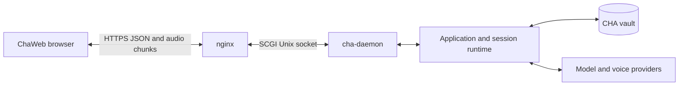

# ChaWeb

ChaWeb is the implemented browser interface for `cha-daemon`. It supports text
conversations, OpenAI or xAI dictation, streamed FishAudio playback, and a small
set of R2 vault actions. The daemon serves only `/api/cha/v1/`; the former
OpenAI-compatible `/v1/` API was removed.

## Architecture

nginx serves the static browser build and forwards API requests to a fixed
per-user Unix socket. systemd activates the daemon on Linux;
`scripts/run_daemon.py` supplies socket activation on macOS. Each assigned
HTTPS port selects a daemon and its configuration directory. There is no
browser login, API key, user selector, or vault selector. Anyone who can reach
that port can use its conversations and enabled vault operations; deployment
is for a trusted private network.

The daemon owns sessions, transcripts, recipients, generation, and persistence.
The browser owns navigation, unsent drafts, playback positions, and recovery.
Accepted generation continues after an HTTP request completes or the browser
disconnects. Browser polling reads complete snapshots rather than SSE events.
The shared C++ application and runtime also serve the native desktop interface;
that application has no HTTP listener.

## Conversation workflow

The session list shows user forums and their stored sessions, excluding
Entrance and Welcome. New conversations are local drafts until the first Send.
The daemon creates a stored session and submits the first input together;
rejected first input is cleaned up when possible. Session titles come from the
existing naming request. A new-session response can wait for recipient detection
and naming; it does not wait for the full character answer.

Open a session to view its transcript, submit text, or stop generation.
Characters use configured styles, and Markdown is sanitized before rendering.
Copy controls copy plain conversation text without message timestamps. Session
deletion requires confirmation, stops its generation, removes its stored
history, and discards its unsent draft. General settings, entity editing,
transcript editing, regeneration, attachments, and offline operation are not
browser features.

Input follows CHA's shared parser:

- `@Name` fixes one recipient; names and IDs follow the native matching rules.
- `/mcast` selects several characters or all members.
- `@-` saves a Self-note without a model reply.
- Ordinary input uses Jev when configured, otherwise the active target.
  Jev can choose one character, all characters, or Self. An accepted decision
  changes the active session target; single-character choices also update the
  forum's saved default. Explicit recipients bypass classification. Undefined
  decisions and failures use the captured target, with a notice on failure.

The browser does not duplicate recipient parsing or send reconstructed model
history. It sends raw text and reads the authoritative snapshot. Web search
and page reading run in the answering model's existing tool loop when configured
in the vault; there is no browser search-settings screen.

On desktop, Enter sends and Ctrl+Enter inserts a newline. On a coarse-pointer
touch interface, Enter inserts a newline and the Send button submits. IME
composition never submits. The editor supports compact and expanded sizes,
keeps its draft and selection through polling, and uses the visual viewport
and safe-area insets to remain above the phone keyboard. Opening a stored
session does not automatically open the keyboard. Keyboard dictation remains
ordinary text input and requires no CHA voice settings.

## Voice input and playback

Voice configuration is read from the daemon's vault. Runtime responses do not
expose API keys. Browser microphone input requires a secure context and a
supported capture API. OpenAI uses WebRTC with SDP exchanged through the
daemon; xAI uses an AudioWorklet for mono 16 kHz PCM16, sent in bounded JSON
batches to a native WebSocket session. xAI start, audio, stop, and cancel requests
share a stable dictation session ID. Browser disconnection and timeout cleanup
release the corresponding native resources.

The microphone adds editable transcription to the draft. Manual Send finishes
dictation before submitting. The configured hands-free send phrase, initially
“over to you”, is removed from the draft before sending. Voice mode stays enabled
for the next message. Capture pauses during generation, audio loading, playback,
and a 400 ms echo tail, then reconnects. Typed text can still be submitted during
playback when generation and command admission permit it.

A completed character reply has an audio control when synthesis or cached audio
is available. An uncached reply starts a background FishAudio download; a cached
reply reuses the stored clip. The manager admits three concurrent workers and
shares repeated requests for the same entry. Failed downloads can be retried.
Stopping playback keeps a position in browser memory; completion resets it.
Navigating or reloading does not preserve those positions as durable state.

Growing MP3 playback reads chunks using `X-CHA-Audio-Offset`. The shared
`textToSpeech.ts` player uses MediaSource where supported, Safari's
ManagedMediaSource when available, or MP3 wrapped in MP4 when raw MP3 is not
supported. Unsupported streaming formats and resumed clips wait for the
complete audio. Reused Safari audio elements are reset before new playback.

**Auto audio response** skips replies already completed when enabled. It queues
and plays later completed replies once in transcript order, even when downloads
finish in another order. Enabling it also enables configured microphone input;
disabling it stops automatic playback and future submissions. Navigation,
clearing cached audio, and permanent audio errors disable automatic playback.
Accepted downloads are independent of the visible screen.

New automatic MP3 clips receive 2.5 seconds of silence before speech so the
output device can start. This prefix is generated for playback, not stored in
the cached clip. Manual and resumed playback have no prefix, and saved positions
exclude it. **Clear audio recordings** cancels the session's pending downloads
and removes stored clips without changing text.

Saved-session clips survive daemon restarts. Pending downloads and their failure
state do not resume after restart. R2 uploads retain configuration and
conversations but exclude cached audio; a downloaded vault needs fresh speech
generation. Vault replacement and configuration maintenance cancel stale jobs.

## Vault actions

The session list has **Upload**, **Download**, and **Parent merge**. They are
disabled while another relevant operation is pending or the active vault lacks
R2 credentials. Parent merge also requires a configured `parent`. General vault
selection and editing remain in the native application.

Upload first checks the remote ETag. A matching version uploads immediately;
an unrecorded, missing, or changed version requires overwrite confirmation.
The upload request carries the check's ETag and context epoch to reject stale
or concurrent replacement. CHA uploads a temporary database copy without
cached audio, then its portable companion TOML. Local audio stays intact.

Download requires confirmation, stages and validates the database and companion
definition, keeps `.bac` backups, and reloads the active vault. Parent merge
first downloads the locally registered inactive parent's pair using the active
vault's R2 credentials, then merges its configuration into the active vault.
It does not copy source conversations or switch vaults. A protected parent
prompts for its password. A successful parent download is not rolled back if
a later merge fails. After Download or Parent merge, the browser refreshes
bootstrap and session lists. See [the maintainer guide](MaintainerGuide.md) for
configuration, leases, validation, and recovery rules.

## API contract

All paths below are relative to `/api/cha/v1`. Bodies must be JSON objects with
`Content-Type: application/json`; the adapter validates required fields and
rejects unknown fields. IDs are separate path segments, not embedded labels.
POST and audio DELETE bodies share the SCGI 256 KiB body bound; prompt text
has the application's 32 KiB limit. Unknown paths or methods return `404`.

| Method and path | Body or result |
| --- | --- |
| `GET /bootstrap` | Forums, personas, characters, recent sessions, vault name, `vault_parent`, and capabilities including `can_transfer_r2`. |
| `GET /forums/{forum}/sessions` | Stored session list. |
| `POST /forums/{forum}/sessions` | `{"text":"…"}`; `201` with `id` and `label` after creation and first input acceptance. |
| `GET /forums/{forum}/sessions/{session}` | Complete session snapshot. |
| `DELETE /forums/{forum}/sessions/{session}` | Stops and deletes the session; `204`. |
| `POST .../{session}/input` | `{"text":"…"}`; `204` on acceptance, `422` on rejection. |
| `POST .../{session}/stop` | `{}`; `204`. |
| `GET /voice-output` | Output runtime settings without credentials, or `null`. |
| `GET /voice-input` | Dictation runtime settings without credentials, or `null`. |
| `POST /voice-input/connect` | `{"sdp":"…","languages":[]}`; OpenAI SDP answer. |
| `POST /voice-input/xai/start` | `{"session_id":"…","languages":[]}`. |
| `POST /voice-input/xai/audio` | `{"session_id":"…","pcm_base64":"…"}`; xAI transcript updates. |
| `POST /voice-input/xai/stop` | `{"session_id":"…","remaining_ms":1000}`; finish dictation. |
| `POST /voice-input/xai/cancel` | `{"session_id":"…"}`; release dictation resources. |
| `GET .../{session}/audio` | Cached IDs and download states. |
| `POST .../{session}/audio` | `{"vault_name":"…","entry_ids":[1,2]}`; batch acceptance. |
| `DELETE .../{session}/audio` | `{"vault_name":"…"}`; cancel jobs and clear clips, `204`. |
| `POST .../{session}/entries/{entry}/audio` | `{"vault_name":"…"}`; start or reuse one download. |
| `GET .../{session}/entries/{entry}/audio` | Full cached clip, or next chunk when `X-CHA-Audio-Offset` is present. |
| `POST /vault/upload-check` | `{}`; `etag`, `status` (`match`, `mismatch`, `missing`), and `context_epoch`. |
| `POST /vault/upload` | `{"etag":null,"context_epoch":1}` using the check's actual values; transferred `byte_count`. |
| `POST /vault/download` | `{}`; transferred `byte_count`. |
| `POST /vault/merge-parent` | `{}` or `{"password":"…"}`; resulting `context_epoch`. |

Audio chunk responses contain at most 64 KiB and
`X-CHA-Audio-Complete: 0` or `1`. `204` means no new bytes yet, and `502` means
generation failed. Readers poll until completion; a single SCGI response does
not remain open for the provider's full audio stream.

Errors use `{"error":{"code":"…","message":"…"}}`. Typical statuses are
`400` for invalid input, `401` for a required or rejected parent password,
`404` for missing resources, `409` for stale vault context,
`413` for an oversized body, `415` for an invalid content type, `422` for rejected
chat input, `502` for failed synthesis, and `503` for unavailable application
or worker admission. R2 HTTP failures, including a conditional upload conflict,
are reported as `400` with a transfer error. The error code identifies the
specific failure.

## Request lifetimes and recovery

The daemon accepts and handles SCGI requests serially; model generation and
audio synthesis continue on their own workers. Each operation captures the
application context epoch and uses the existing application admission boundary.
Upload is the exception where the browser returns the upload-check epoch.
Download and merge can replace the application context while the daemon runs.

The browser polls the selected active conversation at one-second intervals.
Snapshots are authoritative; read failures do not mean generation stopped.
Navigation and attempt checks prevent late responses from replacing the newly
selected conversation. Drafts remain editable through read recovery and are
kept per conversation in browser memory.

An uncertain create or input result is not automatically resubmitted. A closed
connection can occur after acceptance, so retrying blindly can duplicate a
message. The UI reconciles by refreshing lists and snapshots and preserving the
unsent text. It does not use matching transcript text as proof of acknowledgment.
A failed Stop is likewise reconciled with current state. Hidden pages suspend
ordinary polling and refresh when visible again.

## Source and validation

- `src/daemon/chaweb_adapter.cpp`: route parsing, validation, application calls,
  dictation scope, and JSON/audio response encoding.
- `src/daemon/scgi.*`: bounded SCGI framing, socket I/O, and shutdown.
- `webapp/src/chaweb/client.ts`: browser requests and response validation.
- `useChaweb.ts`: navigation, drafts, snapshot polling, command recovery.
- `useReadAloud.ts`, `useVoiceInput.ts`, and `vaultActions.tsx`: speech and vault
  workflows; shared playback and capture live under `webapp/src/`.
- `tests/daemon/unit_chaweb_adapter.cpp`, `webapp/src/chaweb/*.test.*`, and
  `tests/integration/daemon_integration_test.py`: contract and behavior coverage.

Build with `npm run build:chaweb` in `webapp/`; this runs type checking and
writes the separate browser build. Run `npm test -- src/chaweb
src/textToSpeech.test.ts` there for browser and shared playback tests. Native
packaging serves its own frontend bundle; ChaWeb must be deployed with the
matching daemon. See [headless operation](headless.md) and the
[deployment guide](MaintainerGuide.md#16-chaweb-deployment-on-linux) for nginx,
socket units, permissions, and macOS runner setup.
