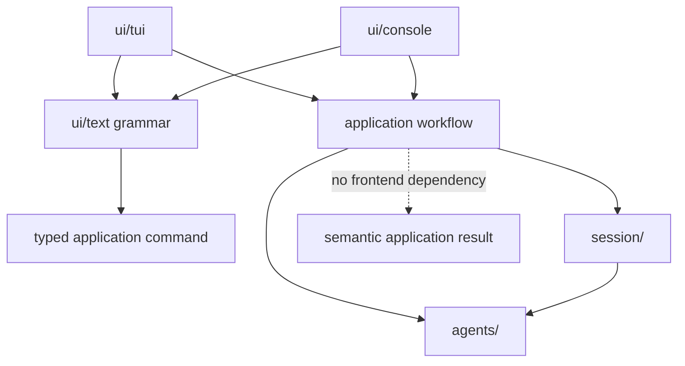

# Default entrance and in-chat navigation: design

Status: proposed design based on agreed product requirements, 2026-08-04.

This document defines the replacement for terminal startup selection. The TUI
and console applications no longer ask the user to choose a persona, forum, or
session before chat begins. They construct a built-in help environment, enter
it immediately, and expose persona and session navigation as shared slash
commands.

The design deliberately gives every entity one public name. Existing storage
keys may remain inside the implementation where they are useful for safe paths
and durable references, but they are not part of the user model: they do not
appear in commands, listings, prompts, banners, or errors.

## 1. Motivation

The current terminal frontends make the first interaction administrative.

- The TUI presents persona, forum, and session selectors before constructing a
  chat.
- The console requires the same selection through command-line options.
- A user who does not yet know the workspace must understand its structure
  before they can ask the application how it works.
- Changing persona or session requires leaving the current process and starting
  another one.

The new workflow starts with a useful conversation instead. A built-in
`Assistant` has authoritative application documentation in its system prompt,
so a first-time user can ask what the application does and how to reach their
own personas, forums, and sessions. Navigation then happens without terminating
the chat application.

The default conversation is intentionally disposable. It is an entrance to the
application rather than an automatically accumulated permanent history.

## 2. Goals

The implementation must:

1. Start both terminal frontends immediately as `Guest` in `Entrance` /
   `Welcome`.
2. Construct `Guest`, `Assistant`, and `Entrance` as built-in application
   values, without requiring workspace entity directories for them.
3. Give `Assistant` version-matched application documentation and a stable
   startup snapshot of workspace personas, characters, and forums in its
   effective system prompt.
4. Provide one application-level provider configuration that `Assistant` uses
   directly and every workspace character inherits.
5. Store `Welcome` in a run-scoped ephemeral SQLite database that is new on
   every process start.
6. Keep the current run's `Welcome` transcript when the user switches away and
   later returns during that same process.
7. Let the user change persona, inspect workspace entities and forum
   membership, create a session, and open a session through shared slash
   commands.
8. Name the complete command set without a completion request.
9. Use one public name for every persona, forum, character, and session.
10. Allow whitespace in names through double-quoted command arguments.
11. Keep ordinary non-default sessions durable and compatible with the existing
    SQLite journal and controller behavior.
12. Serialize public session-name creation across processes.
13. Keep navigation and workspace discovery outside `SessionController`, which
    must continue to represent exactly one live chat.
14. Preserve the TUI's redraw model and the console's append-only transcript
    model when the current session changes.
15. Keep non-interactive workspace validation available without a provider.

## 3. Non-goals

This change does not:

- persist `Welcome` between process runs;
- add persona, forum, session, or character editing commands;
- add a rename command;
- allow multiple simultaneously active terminal sessions in one process;
- make `SessionController` thread-safe;
- change agent addressing, multicast, off-record spans, transcript persistence,
  or cancellation semantics inside one session;
- expose filesystem paths or storage keys as an alternative command syntax;
- make workspace files for `Guest`, `Assistant`, or `Entrance` customizable;
- redesign the web frontend. The initial scope is the TUI and console
  applications named in this document.

## 4. Public entity model

### 4.1 One public name

A user-visible entity has one field called `name`.

- `/personas` prints persona names, and `/iam` accepts those same names.
- `/forums` prints forum names, and `/open`, `/create`, `/sessions`, and
  `/members` accept those same names.
- `/members` prints character names using the same public names used for
  addressing and other character presentation.
- `/sessions` prints session names, and `/open` accepts those same names.
- Transcript labels, status messages, ready banners, and errors use the same
  names.

The application must not print a directory name or database stem alongside a
name. In particular, output such as `reader (Reader)`, `lobby / The Lobby`, or a
timestamp session key followed by a label violates this design.

Existing workspace directory names and SQLite filename stems may remain as
private storage keys. They are useful for path safety and for preserving stored
references, but application commands resolve public names to those keys behind
the boundary. Code at the application-command boundary should use names and
resolved entity values, not ask the frontend to carry both a key and a display
name.

### 4.2 Name comparison and uniqueness

Names retain authored casing but resolve using ASCII case folding, consistent
with existing persona and character-name lookup. `Reader`, `reader`, and
`READER` therefore identify the same public name.

Name-only commands require unambiguous namespaces:

- persona names are unique application-wide;
- forum names are unique application-wide;
- character names remain unique under the existing character rules;
- session names are unique within one forum;
- the same session name may occur in two different forums.

Names must be non-empty, valid UTF-8, free of control characters and line
breaks, and must not begin or end with whitespace. Internal whitespace is
allowed. Command-leading `/` and addressing-leading `@` remain invalid for
participant names.

Workspace loading already checks persona-name uniqueness. It must additionally
check public forum-name uniqueness. Session-name uniqueness is checked when a
forum's session catalog is accessed, because workspace construction
intentionally does not open every session database.

The implementation must not silently choose one of two sessions with the same
folded name. Ambiguity is reported at two different points, and the two
behaviors are deliberately different:

- listing annotates. `/sessions` still prints the whole forum and marks each
  colliding row as ambiguous. Failing the entire listing would hide every
  healthy session in that forum, and the listing is the user's only tool for
  discovering the problem;
- resolution fails. `/open` on an ambiguous name returns the Section 8.3
  ambiguity diagnostic and changes nothing.

Section 12.3 makes this state unreachable through the application: creation
rejects a folded collision under a catalog lease. It therefore arises only from
a database copied into a sessions directory by hand, and needs exactly the
defensive behavior above and nothing more. No existing database is renamed
automatically by this change.

### 4.3 Built-in names and reserved names

The four built-in public names are exact and intentional:

| Kind | Name | Lifetime |
| --- | --- | --- |
| Persona | `Guest` | Process/application definition |
| Character | `Assistant` | Process/application definition |
| Forum | `Entrance` | Process/application definition |
| Session | `Welcome` | One process run |

`Assistant` already collides with the participant names reserved by the
workspace validators. `Guest` does not, and must be added to that reserved list
so no workspace entity can claim it. Built-in construction must deliberately
permit both values without making either generally available to workspace
definitions.

The safe rule is:

- the trusted built-in factories may construct `Guest` and `Assistant`;
- `Guest` joins the reserved participant names; `you` stays reserved, because
  nothing is gained by releasing it;
- workspace-defined personas and characters may not claim either built-in name;
- the effective application catalog validates workspace entities against the
  built-ins, so no custom entity can shadow them;
- other protocol-reserved participant names such as `system`, `error`,
  `human`, `persona`, and `agent` remain reserved without exception.

An implementation may represent built-ins with private storage keys, but those
keys are not public identities and must never escape in output.

## 5. Built-in environment

### 5.1 Persona `Guest`

`Guest` is created in memory before any session controller is assembled. It is
part of the effective persona roster for every terminal session, including
workspace-defined forums. This is necessary because the current persona remains
selected when the user switches sessions.

The effective roster for a process is:

1. built-in `Guest`;
2. every validated workspace persona, ordered by public name.

The application constructs exactly one immutable effective-persona catalog at
startup. That application-lifetime singleton owns the roster and exposes one
shared immutable roster instance to prompt assembly and every controller opened
during the run. Controllers do not copy the roster and session construction
does not reload it. This gives every controller the same author-resolution table
and the same participant section in agent prompts. Workspace changes become
visible on the next application start rather than changing identity midway
through a conversation.

The workspace `personas/` container may be empty after this change. `Guest`
guarantees that the effective roster is non-empty; filesystem validation should
require each discovered custom persona to be valid without requiring at least
one custom persona to exist. Keeping an empty `personas/` directory as part of
the workspace shape is acceptable, but no placeholder persona file is needed.

`Guest` may have a short built-in persona description identifying it as the
current application user. It has no workspace `persona.toml` or `PERSONA.md`.

The name is chosen to stay honest in durable storage. The selected persona
survives `/open`, so a user who never runs `/iam` will author entries in
ordinary workspace sessions under the built-in identity, and that authorship is
permanent. `Guest` states exactly what happened — no persona was chosen — and
remains correct when a later reader or another agent quotes the entry in the
third person. A first-person name such as `You` or `Me` would read as an
unresolvable reference in a shared transcript, and `User` would collide with
provider role vocabulary in the participant roster.

### 5.2 Character `Assistant`

`Assistant` is a normal completion-backed agent after construction: it runs
through `AgentRegistry`, participates in `ForumCharacters`, receives transcript
history, streams deltas, supports cancellation, and writes through the normal
session journal. Only its definition source is special.

Its effective system prompt is assembled from:

1. built-in role instructions explaining that it is the application guide;
2. an authoritative application-documentation bundle tied to the running
   build;
3. a workspace inventory snapshot captured at application startup;
4. built-in `Entrance` forum instructions;
5. the effective persona roster, including `Guest` and workspace personas;
6. the generated forum context used by ordinary agents.

Prompt assembly should reuse the same roster and forum-context helpers as
workspace agents. The built-in path must not accidentally omit the identity and
shared-history instructions ordinary agents receive.

The documentation bundle is an application asset, not a workspace entity
prompt. A build-time generated string or packaged read-only resource is
appropriate. It must have one canonical source so the embedded prompt and user
documentation do not drift independently. Changing documentation requires a
new build before `Assistant` claims to describe that change.

The workspace inventory is constructed after workspace validation and remains
immutable for the lifetime of the application. It contains:

- every workspace persona's public name and short description;
- every workspace character's public name, short description, and tags;
- every workspace forum's public name, short description, member character
  names, and default character name.

It deliberately excludes sessions. Sessions can be created by this process or
another process after startup, so `/sessions <forum>` remains the authoritative
way to inspect them. The built-ins do not need duplicate inventory rows:
`Guest`, `Assistant`, and `Entrance` are already described by the surrounding
system prompt.

Persona, character, and forum entries are ordered by folded public name.
Character names inside each forum use the same ordering, with the default
character identified explicitly rather than implied by position. This makes the
serialized prompt deterministic for one validated workspace.

Short descriptions are explicit definition metadata rather than summaries
generated by a model or excerpts guessed from behavioral prompts. The workspace
schemas gain an optional, single-line `description` string in:

- `personas/<key>/persona.toml`;
- definition-level `characters/<key>/character.toml`;
- `forums/<key>/config.toml`.

The character description is definition-only, like its public name and tags;
forum defaults and member overrides cannot replace it. If a description is
absent, the inventory includes the entity's name without inventing a summary.
Descriptions retain authored UTF-8, must be non-empty when present, cannot
contain control characters or line breaks, and cannot begin or end with
whitespace.

The inventory is serialized as a clearly delimited reference-data section. It
contains public names and description metadata only—never private storage keys,
provider settings, credentials, database paths, or full persona, character, and
forum prompts. The Assistant instructions explicitly say to treat inventory
values as descriptions of workspace content rather than as behavioral
instructions.

Capturing the inventory once keeps it consistent with the effective persona
roster and the validated workspace used throughout the run. Files edited after
startup are reflected on the next application start. Commands such as
`/forums`, `/personas`, `/sessions`, and `/members` still provide direct
application output when the user wants an authoritative list rather than an
Assistant paraphrase.

### 5.3 Application provider configuration

Identity and prompt content are built in; deployment-specific connection
settings are not. `app.toml` gains an application-level provider table:

```toml
[provider]
host = "api.openai.com"
port = 443
https = true
mode = "net"
model = "gpt-5.6-terra"
reasoning_effort = "none"
stream = true
api_key_env = "OPENAI_API_KEY"
```

The table is not Assistant-specific. It is the lowest layer of the existing
character configuration chain, so every workspace character inherits it unless
it overrides a field. `load_config` already composes ordered patches —
definition, forum defaults, member override — and this adds an `application`
layer beneath all three. Two properties follow from the existing design rather
than from new rules:

- identity cannot leak downward. `display_name` is read only from the
  definition layer, and per-layer key restrictions already reject fields a
  lower layer may not set. The application layer accepts connection fields
  only: no `id`, `display_name`, `tags`, or prompt variables;
- the effective-config requirement for `host` and `port` is satisfied
  application-wide, so a character definition collapses to its `display_name`
  plus whatever it genuinely overrides.

Secrets remain in environment variables rather than in the configuration file.
Configuration diagnostics must name `app.toml` when the offending value came
from this layer, rather than attributing it to the character definition.

`Assistant` uses this configuration directly with no overriding layer; the
application supplies its name and built-in prompt.

Because the table is workspace configuration rather than a terminal concept,
the web frontend's characters inherit it on the same terms. Nothing else in
this document reaches the web frontend: it does not construct `Assistant` and
its startup path is unchanged.

Failure to initialize the Assistant backend is a startup failure with the same
diagnostic quality as failure to initialize a workspace agent. Because both
terminal applications now open a real chat immediately, they require a usable
provider at startup. This is an accepted constraint: the application has no
useful offline mode. The one exception is `--check` (Section 11.1), which
validates workspace structure and must run before any provider is
initialized.

### 5.4 Forum `Entrance`

`Entrance` is constructed in memory with exactly one member, `Assistant`, which
is also its default agent. It has no directory under `forums/` and is not
returned by the workspace forum loader.

The application-level forum catalog is the union of:

- built-in `Entrance`;
- every validated workspace forum.

Workspace forums cannot claim the public name `Entrance` under ASCII case
folding.

Although `/forums` omits `Entrance`, it remains a valid explicit command name.
The following operations are valid:

```text
/open Entrance Welcome
/sessions Entrance
/create Entrance "Saved Help Conversation"
```

Only `Welcome` is ephemeral. Other sessions created in `Entrance` are ordinary
persistent Assistant sessions. Because `Entrance` has no entity directory, its
persistent session catalog lives under the workspace's existing application-data
directory:

```text
<workspace root>/var/system/entrance/sessions/
```

The base is the workspace root — the same root the frontends already pass to
`Workspace`, not the process working directory — so a workspace stays
self-contained and relocatable, and `var/` already holds application-owned data
such as logs. The path is fixed and not configurable: `system/entrance` is a
constant chosen by the application, so no workspace file can redirect it. That
directory contains session data only; it does not make the built-in forum
workspace-configurable. All path construction remains behind a catalog object,
which validates each component exactly as a workspace forum catalog does.

## 6. Ephemeral `Welcome` session

### 6.1 Storage lifecycle

At process startup, the application creates a unique private temporary
directory and initializes one SQLite database with the metadata for `Entrance`
and `Welcome`. The path is not inside any stored session catalog.

The normal database schema and `SessionJournal` are used. This is not an
in-memory transcript substitute: the live controller keeps the same durable
turn boundaries, rollback behavior, interrupted-turn handling, and persistence
failure semantics as any other controller. The difference is the lifetime and
discoverability of its database.

The temporary path is unique per process, so simultaneous TUI and console
processes do not delete, reset, or lock each other's Welcome conversation. A
normal `SessionLease` is still acquired because production controllers require
one and because doing so preserves the controller's ownership invariant.

The temporary directory remains alive until all controllers using it have been
destroyed. Normal shutdown removes it. Failure to remove an already-closed
temporary directory is logged as cleanup failure but cannot cause the next run
to restore it: every run chooses a new path. A crash may leave an unreachable
temporary directory, which can be cleaned using the platform's normal temporary
file policy.

### 6.2 Switching away and returning

Freshness is per process start, not per `/open` command.

- The initial open creates an empty Welcome transcript.
- Switching to another session shuts down the Welcome controller but retains
  the temporary database.
- `/open Entrance Welcome` in the same process reopens that database and
  restores the current run's Welcome transcript.
- Process exit destroys the temporary storage.
- The next process starts with a different empty Welcome database.

`Welcome` is reserved only within `Entrance`. `/create Entrance Welcome` is
rejected. A workspace forum may have an ordinary session named `Welcome`
because `(forum name, session name)` is the complete public session identity.

### 6.3 Listing behavior

`Welcome` never appears in `/sessions Entrance` because it is not part of the
Entrance stored-session catalog. The list may contain other persistent
Entrance sessions.

No label-based filtering is used. A normal stored session happens to be named
`Welcome` only where that name is permitted; the built-in is excluded by its
explicit built-in identity and storage source, not by deleting arbitrary list
rows whose text happens to match.

## 7. Application-level session coordinator

### 7.1 Why a new owner is required

`SessionController` owns one live chat. It intentionally does not know how to
discover forums, list sessions, construct another controller, or select the
persona used by a frontend. Those responsibilities must not be added to it.

Today the TUI and console each retain a reference to one controller and one
fixed author value for their complete lifetime. Supporting `/iam`, `/open`, and
`/create` requires a longer-lived application object above a controller.

The shared coordinator owns:

- the immutable process configuration;
- the validated workspace;
- the immutable workspace inventory supplied to Assistant;
- the effective persona catalog;
- the built-in forum and Assistant definition;
- the Welcome temporary-storage owner;
- the current public persona name and resolved author key;
- the current `OpenedSession`;
- the current public forum and session names;
- the operations that list, prepare, and commit navigation changes.

The coordinator is owner-thread-only, just like `SessionController`. TUI and
console continue to invoke it from their existing foreground event-loop thread.

### 7.2 Suggested result model

Application commands need a transport-neutral semantic result rather than
writing to curses or standard streams. A result should be able to express:

- whether the current persona changed;
- whether the current session changed;
- whether submitted command input was consumed;
- a one-line notice;
- a titled list of names;
- the new session descriptor and controller access after a switch;
- an error that leaves the previous state intact.

The exact type name is not important, but it is distinct from `SessionChange`.
`SessionChange` reports mutations inside one controller; an application result
reports mutations to the object that owns controllers.

### 7.3 Persona changes

`/iam <name>` resolves against the effective persona catalog. On success it
changes the author used for future submissions and reports the public name.

It does not:

- rewrite prior transcript entries;
- restart the current controller;
- change the default agent;
- add a transcript entry;
- alter another process.

The selected persona remains active across `/open` and `/create`. `Guest` is
always available even though it is omitted from `/personas`.

### 7.4 Session changes

A session change replaces the whole controller. Nothing inside
`SessionController` is reset, reused, or transferred: the old object is
destroyed and a new one is constructed. This is what keeps the controller
meaning exactly one live chat, and it is the reason the coordinator has to own
the transition.

`/open` and `/create` both end with the same commit operation. A successful
commit:

1. clears accepted command input;
2. shuts down the old idle controller;
3. installs the prepared `OpenedSession`;
4. resets frontend state associated with the old transcript;
5. retains the selected persona;
6. reports the new forum and session names.

Target resolution, catalog validation, lease acquisition, database restore, and
new-controller construction occur before the current session is replaced. An
ordinary failure in any of those steps leaves the current session usable and
returns an application error. For `/open`, that is the complete failure
contract. `/create` has the additional publication rule below because creation
can durably succeed before opening its controller does.

Building before tearing down means both controllers exist during a commit: two
transcripts, two registries, two worker pools, and two session leases on
different databases. That is the intended cost of validating before replacing.
It is bounded to the commit itself and must not be mistaken for a leak.

**Step 2 calls `shutdown()` explicitly.** It must not be left to the
destructor, which runs `shutdown()` inside a catch-all and discards whatever it
raises. Dropping the owning pointer would therefore swallow a terminal
persistence failure and silently contradict the rule below. The commit calls
`shutdown()`, lets it propagate, and only then destroys the controller;
`shutdown()` is idempotent, so the destructor's later call does nothing. The
console's existing session teardown already follows this pattern.

Shutdown is the asymmetric half of the transition. Once it has cancelled the
registry batch, stopped the registry, and joined the worker pool, there is no
old controller left to return to. A catastrophic failure at that point remains
a process-level failure; it must not be reported as if a strong rollback were
possible after ownership teardown has begun.

Nothing in flight can cross the boundary, because the commit runs only while
the old controller is idle (Section 7.5). Transcript, agent registry, backends,
worker pool, entry and request counters, default agent, and off-record state
all belong to the new session alone, restored from its own database. Switching
to a different forum genuinely re-initializes that forum's providers.

What survives does so by living in the coordinator rather than the controller:
the current persona and its resolved author key, the effective persona roster
of Section 12.4, the workspace and forum catalog, and the Welcome
temporary-storage owner. The roster is handed to each new controller as the
same shared immutable instance rather than copied or re-read per session. The
Welcome storage owner outliving the Welcome controller is precisely what lets a
user switch away and return to that run's transcript.

Opening the already-current session is a successful no-op with a notice. It
does not clear or reconstruct the controller.

`/create` is not a weaker catalog operation. It creates a persistent session,
opens its controller, and switches to it. If the name already exists, it fails
and suggests `/open`. The storage layer may continue to assign a private safe
database filename, but the assigned key is never printed.

Database publication is the point of no return for `/create`. If target
controller construction fails after publication—for example while initializing
a provider—the new empty session remains stored, its prepared session lease is
released, and the old current session remains active. The application reports:

```text
Session 'Name' was created in forum 'Forum' but could not be opened: <reason>
```

The user can correct the cause and run `/open` for that name. A repeated
`/create` correctly reports that the name already exists. The application does
not delete a published database as rollback: it has already become observable
to other processes, and deleting it would turn an open failure into a race and
a destructive side effect.

### 7.5 Active generation

Seven of the eight new application commands are accepted only while the current
controller is idle:

```text
/iam
/open
/create
/forums
/sessions
/members
/personas
```

When a response is active, they return the standard generation-in-progress
notice and perform no partial work. In particular, `/open` does not implicitly
cancel a turn and `/create` does not publish a database that cannot yet become
current. `/stop` remains the explicit cancellation operation.

`/help` is exempt. It reads no controller, workspace, or catalog state and
mutates nothing, so it is answered from a built-in table at any time. A user
who is waiting on a long response is exactly the user most likely to want to
know what `/stop` is called.

The console must not silently defer an application-navigation command submitted
during generation and execute it later. Rejecting it immediately keeps console
and TUI semantics aligned and prevents a delayed session switch from surprising
interactive users.

## 8. Command language

### 8.1 Commands

The shared text layer adds:

| Command | Arity | Result |
| --- | ---: | --- |
| `/iam <persona>` | 1 | Change the current persona. |
| `/open <forum> <session>` | 2 | Open an existing session and switch to it. |
| `/create <forum> <session>` | 2 | Create a persistent session, open it, and switch to it. |
| `/forums` | 0 | List workspace forum names, excluding `Entrance`. |
| `/sessions <forum>` | 1 | List stored session names in the named forum, excluding built-in `Welcome`. |
| `/members <forum>` | 1 | List the public character names belonging to the named forum. |
| `/personas` | 0 | List workspace persona names, excluding `Guest`. |
| `/help` | 0 | List every command with its arity and one-line description. |

The existing commands retain their current meanings. The unknown-command
diagnostic is updated to include the new command names.

`/help` covers the complete command set, not only the commands added here. It
is the discovery path that does not cost a completion request: `Assistant` can
describe the commands, but it is a language model reached over the network, and
a user who has just switched to a workspace forum no longer has it in the
conversation at all. `/help` renders through the same list presentation as
`/forums`, `/members`, and `/personas`, so it never enters a session
transcript.

### 8.2 Quoted-name lexer

Application commands use a small name lexer; they do not use shell parsing.

- ASCII whitespace separates unquoted arguments.
- A double quote begins a quoted argument and the matching double quote ends
  it.
- Whitespace inside a quoted argument is part of the name.
- `\"` represents a double quote inside a quoted name.
- `\\` represents a backslash inside a quoted name.
- No environment expansion, command substitution, globbing, or single-quote
  syntax exists.
- An unmatched quote, unsupported escape, empty quoted name, missing argument,
  or extra argument is a syntax error.
- A name containing whitespace must be quoted. A single-word name may be quoted
  or unquoted.

Examples:

```text
/iam Guest
/iam "Technical Writer"
/open Entrance Welcome
/open "The Stoics Forum" "Morning Discussion"
/create "The Stoics Forum" "Questions about control"
/sessions "The Stoics Forum"
/members "The Stoics Forum"
```

The lexer applies only to commands whose grammar is a fixed sequence of entity
names. Free-form commands such as `/mcast` retain their existing parser and do
not acquire shell-like semantics.

### 8.3 Resolution and diagnostics

The parser produces names. It never resolves a workspace object. Resolution
happens in the application coordinator against the catalog captured for the
run.

Diagnostics use public names only:

```text
Unknown persona 'Writer'
Unknown forum 'The Hallway'
Session 'Morning' does not exist in forum 'The Stoics Forum'
Session 'Morning' already exists in forum 'The Stoics Forum'; use /open
Session name 'Morning' is ambiguous in forum 'The Stoics Forum'
```

No diagnostic should recommend a private key as an alternative.

## 9. Listing semantics

Listings are presentation-neutral application results and are never persisted
as transcript entries.

### 9.1 `/forums`

- Lists workspace-defined forum names in folded-name order.
- Omits built-in `Entrance`.
- Does not initialize or open any listed forum's agent providers.
- Reports an explicit empty-list message when there are no workspace forums.

### 9.2 `/sessions <forum>`

- Resolves both built-in and workspace forum names.
- Lists stored session names in folded-name order.
- For `Entrance`, lists persistent Assistant sessions from its system data
  catalog and omits ephemeral `Welcome`.
- Includes an error indication for a corrupt stored session without exposing
  its database filename as the public identity.
- Marks each row whose folded name collides with another row as ambiguous, and
  still prints the rest of the forum. Per Section 4.2, the listing reports the
  problem and `/open` refuses to guess.
- Reports an explicit empty-list message when no stored sessions exist.

### 9.3 `/personas`

- Lists workspace-defined persona names in folded-name order.
- Omits built-in `Guest`.
- Uses the effective roster captured at process startup.
- Reports an explicit empty-list message when `Guest` is the only persona.

### 9.4 `/members <forum>`

- Resolves both built-in and workspace forum names.
- Lists every forum member by public character name in folded-name order.
- Lists `Assistant` as the sole member of `Entrance`.
- Never prints member directory names or character storage keys.
- Uses the immutable workspace snapshot and does not initialize a provider.
- Is never persisted as a transcript entry.

The exclusion rules are based on built-in provenance, not text filtering. A
session named `Welcome` in a different forum remains visible, for example.

## 10. TUI behavior

### 10.1 Startup

The TUI no longer constructs or displays `StartupSelector`. After loading
configuration and workspace metadata, it constructs the application
coordinator, opens the fresh Welcome session, configures chat mode, and renders
the empty transcript.

Cancelling a startup selector is no longer a possible failure. Startup can
still fail for invalid workspace configuration, invalid Assistant connection
configuration, inability to create the temporary database, or provider
initialization failure.

### 10.2 Mutable current session

The TUI run loop must obtain the current controller through the application
owner rather than retaining a reference that can never change. A session switch
resets every value tied to the old transcript:

- transcript render-planner watermark;
- transcript pad contents;
- viewport offset and follow state;
- generation/status projection;
- input target derived from the old forum's default agent;
- any current application overlay.

The accepted `/open` or `/create` command clears the editor. A failed command
leaves the editor and current view available according to normal command-error
policy.

### 10.3 Application output

One-line results such as `Now speaking as Reader` or `Opened The Stoics Forum /
Morning Discussion` may use the status notice area.

Potentially long lists do not fit that area and must not be inserted into the
stored session transcript. The TUI should present a transient scrollable
application overlay with a title, one name per row, and the normal terminal
sanitization and resize behavior. Dismissing the overlay returns to the unchanged
chat transcript.

## 11. Console behavior

### 11.1 Command-line contract

An ordinary console chat no longer accepts selection arguments. The following
options are removed:

```text
--persona
--forum
--session
--new
```

The command-line listing modes are superseded by `/forums` and `/sessions` and
are removed from the interactive application's startup contract.

`--check` is retained and becomes argument-free. It is not a selection surface:
it validates the structural correctness of the whole workspace — personas,
character definitions, and every forum's members, default agent, and prompt
files — reports the result, and exits. It never opens a session, never
constructs the built-in environment, and never initializes a completion
provider, so it remains the way to validate a workspace in a script or a build
without provider credentials or network access. It returns exit code 0 when the
workspace is valid and 1 when it is not; a usage error remains exit code 2.

It does check that the `[provider]` table is present and well-formed, since a
missing or malformed table is a workspace defect that would otherwise surface
only as a startup failure on someone else's machine. It checks the table's
shape, not reachability: no socket is opened and no credential is required.

Dropping its `--forum` argument widens what it checks. Validating one named
forum was the narrower operation, and per-forum validation is no longer
reachable from the command line by design.

Frontend options that do not select an entity, such as `--color`, remain.

```text
chacon [--color=auto|always|never]
chacon --check
```

### 11.2 Startup and prompt

The console creates Welcome before reading stdin. Interactive startup reports:

```text
Entrance / Welcome ready
```

No private session key is printed. The prompt continues to name the current
default agent, so it initially names `Assistant` and changes when a new forum's
default agent changes.

### 11.3 Switching an append-only stream

Console stdout remains an append-only transcript stream. Bytes from the old
session cannot be erased after a switch.

On successful `/open` or `/create`:

1. the old controller's final transcript suffix is emitted and flushed;
2. a sanitized session-change notice is written to the console notice channel;
3. the old `TranscriptEmitter` watermark is discarded;
4. a new emitter is initialized for the new controller;
5. restored history from the new session is emitted using normal restored-entry
   rules;
6. the prompt is rearmed with the new default agent.

Application listings and navigation notices go to the existing notice stream,
not into either session database. This preserves stdout's transcript contract
and stderr's command/status contract.

Queued input following a successful idle switch is processed against the new
session in FIFO order. A navigation command observed while a response is
already active is rejected immediately as specified in Section 7.5 rather than
being retained for later execution.

## 12. Workspace and session-catalog changes

### 12.1 Name-based resolution

Workspace-facing application APIs need name-based operations that return fully
resolved values. Typical operations are:

- resolve a persona name to its private author key;
- resolve a forum name to its workspace forum value;
- list public forum names;
- resolve a session name within a resolved forum;
- create a session with a unique public name;
- open a resolved session.

The UI must not list objects, retain their hidden keys, and then call a second
ID-based API. Resolution belongs alongside validation so every frontend gets
the same ambiguity and not-found behavior.

Existing key-based core APIs may remain for trusted internal and web callers.
They are not part of the terminal command contract.

### 12.2 Session metadata

The existing SQLite session label becomes the public session name. New terminal
creation requires a non-empty explicit name rather than generating a user-visible
timestamp when the supplied label is empty.

The catalog may still generate a collision-free safe database stem. That stem
is validated against the database metadata exactly as today and remains the
durable storage identity. Public lookup reads metadata, compares the session
name under ASCII folding, and returns the resolved stored session.

Creating a name is atomic with respect to other creators in the same forum. It
must not rely only on a list-then-create check, because two processes could both
observe the name as absent. Section 12.3 specifies the lease that serializes it.

### 12.3 Forum-catalog mutation lease

The catalog lease reuses the mechanism `SessionLease` already implements rather
than introducing a second locking scheme: an exclusive kernel lock
(`flock(LOCK_EX)`, `LockFileEx`) held on a companion file for as long as a
descriptor stays open. Because the lock lives in the kernel and not in the
file's existence, a process that crashes mid-creation releases it immediately.
There is no stale-lock state to detect, no timeout heuristic, and nothing to
clean up on the next run.

It is a distinct lease from `SessionLease`, with a different lifetime and a
different scope:

| | Session lease | Catalog lease |
| --- | --- | --- |
| Scope | One session database | One sessions directory |
| Held for | Pre-publication preparation through the lifetime of an open controller | One create operation |
| Conflict means | The session is in use elsewhere | Another process is creating |

**Lock file.** `<sessions directory>/catalog.cha-lock`, created with mode 0600
alongside the databases and never deleted — unlinking it would race with a
concurrent holder. It stays invisible to listings without a special case,
because the catalog already ignores directory entries that are not `.sqlite3`
files. The built-in `Entrance` catalog under `var/system/entrance/sessions/`
takes the same rule unchanged.

**Acquisition.** Immediate failure is correct for `SessionLease`, where a
conflict means a genuinely occupied session, but wrong here: the catalog lease
is held for milliseconds, so two users creating sessions at the same moment
would see a spurious error. Acquisition retries with a short backoff for a
bounded interval — roughly two seconds — and then returns a recoverable
`/create` error. It must never wait unbounded: the coordinator runs on the
frontend's event-loop thread, and a blocked create would freeze the UI.

**Sequence under the lock.** Create the sessions directory, acquire, then:

1. rescan the stored session list;
2. compare the requested name against every readable label under ASCII folding;
3. reject a collision with the Section 8.3 diagnostic and publish nothing;
4. generate the private storage stem;
5. acquire the target session lease for that stem before its database exists;
6. publish the database;
7. release the catalog lease while retaining the target session lease.

Catalog-lease release is by scope exit, including on exception. The existing
session lease uses a companion path and therefore does not require the database
to exist before acquisition. If a candidate stem cannot be published, its
prepared session lease is released before the stem-generation loop tries the
next candidate. Successful creation returns the stored session descriptor and
the already-held target lease together; controller construction consumes that
lease rather than resolving and acquiring it a second time.

Acquiring the target lease before publication is load-bearing. `/open` takes no
catalog lease, so a database published without its creator already holding the
session lease could be opened by another process in the gap between publication
and controller construction. That would let `/create` create a session but fail
its required switch because another process stole the lease. With this sequence,
a concurrent opener sees either no database or a complete database whose lease
is already owned by its creator.

**Corrupt rows do not block creation.** A session whose metadata cannot be read
has no knowable public name, so it cannot be shown to collide, and it is
already unopenable. Creation skips it. The alternative would let one damaged
file permanently prevent creation in a forum.

**Lock ordering.** Creation briefly nests one target session lease inside the
catalog lease, always in the order catalog then target. The target is a newly
chosen, unpublished database path, so no ordinary opener can already hold its
lease. No operation acquires a catalog lease while holding a lease for a target
it expects the catalog operation to open. A terminal application may of course
still hold its unrelated current session lease while preparing a replacement;
the catalog path never waits for that lease, so it cannot complete a cycle.

**Outside the lease.** Listing and opening take no catalog lease: publication
is atomic, so a concurrent reader observes a session either fully present or
absent. Once present, the creator already owns its session lease, so another
process cannot take ownership before the required switch. `/create Entrance
Welcome` is rejected before acquisition, as a built-in-name check in the
Entrance session source rather than a catalog concern.

### 12.4 Effective persona roster

Current workspace session construction reloads workspace personas internally
and moves a roster value into each controller. That ownership model changes.

The Chat application constructs one immutable effective-persona catalog at
startup, including `Guest`, and keeps it alive until every controller is
destroyed. The catalog owns a shared immutable `PersonaRoster`; session factories
accept that shared reference, agent prompt assembly reads through it, and every
`SessionController` retains the same reference for author resolution. No
controller owns a roster copy, and no session-open path calls
`Workspace::load_personas()` again.

In concrete ownership terms, a value such as
`std::shared_ptr<const PersonaRoster>` is passed through the application and
session factories and stored by each controller. The exact pointer type may be
wrapped by the effective-persona catalog API, but object identity and immutable
application lifetime are part of the contract rather than merely equivalent
contents.

### 12.5 Entrance storage

The system Entrance catalog implements the same public session operations as a
workspace forum catalog but uses the application-data sessions directory and a
built-in agent-definition factory. The coordinator should not branch on paths
throughout command handling; it resolves a forum source and delegates to that
source's catalog/open factory.

`Welcome` is represented by a separate ephemeral source. This cleanly explains
why it can be opened by name but never appears among stored Entrance sessions.

## 13. Layering and proposed components

The reusable application workflow belongs above `session/` and below the two
terminal frontends. A dedicated `application/` layer is preferable to putting
workspace navigation into `ui/tui/`, `ui/console/`, or `SessionController`.

One possible decomposition is:

| Component | Responsibility |
| --- | --- |
| Built-in definitions | Construct Guest, Assistant, Entrance, and the documentation prompt. |
| Workspace inventory | Snapshot public persona, character, and forum metadata for Assistant. |
| Effective persona catalog | Own the one shared immutable roster, combine Guest with workspace personas, and resolve public names. |
| Forum catalog facade | Combine Entrance with workspace forums and resolve public names. |
| Session source | List, create, and open stored or ephemeral sessions by public name. |
| Catalog lease | Serialize public-name creation within one sessions directory. |
| Chat application | Own current persona, current OpenedSession, and switch transactions. |
| Application command dispatcher | Turn parsed application commands into Chat application operations. |
| Application result | Carry notices, lists, and context changes without frontend output dependencies. |

The dependency direction is:



`apps/tui_main.cpp` and `apps/console_main.cpp` remain composition roots. They
load configuration, create the frontend-specific event source/notifier, build
the shared Chat application, and hand it to the frontend loop. No code in
`application/` writes to a terminal or parses process arguments.

## 14. Failure and safety semantics

- Unknown and ambiguous names are recoverable command errors.
- A busy stored session is a recoverable `/open` error and leaves the current
  session unchanged.
- A corrupt session is listed with an error and cannot be opened.
- `/create` never overwrites an existing database or public session name.
- `/open` never creates a missing session.
- `/create` never reuses a matching existing session; it directs the user to
  `/open`.
- A failed target open does not shut down the current controller.
- A `/create` failure before publication stores nothing; a controller-open
  failure after publication retains the new session and reports that it was
  created but not opened.
- A teardown failure during a commit propagates; it is never discarded by the
  controller destructor's catch-all.
- A failed persona lookup does not change the current author.
- Built-in construction failure is a startup failure, not a fallback to a
  selector.
- Provider initialization failure is a startup failure for both terminal
  applications; `--check` runs before it and stays usable without a provider.
- A contended catalog lease is a recoverable `/create` error after a bounded
  retry, never an unbounded wait.
- A crashed creator releases its catalog lease through the operating system;
  no lock file is left to repair.
- Temporary Welcome cleanup never deletes a stored catalog directory.
- No recursive deletion is used to reset a workspace forum.
- Paths derived from private storage keys remain confined and validated by the
  relevant catalog.

## 15. Compatibility consequences

This is an intentional breaking change for terminal interaction.

- Existing scripts that launch `chacon` with selection flags must change to
  send `/open` or `/create` as input after startup.
- Console listing scripts must change because listings become chat commands and
  use names rather than tab-separated keys and labels.
- `chacon --check` keeps working and validates more than before: the whole
  workspace rather than one named forum.
- `app.toml` gains a required `[provider]` table. Character configurations may
  then drop connection fields they no longer need to repeat.
- Persona, character-definition, and forum configuration accept an optional
  public `description` used in Assistant's workspace inventory.
- Existing session labels become public session names.
- Existing duplicate session labels cannot be resolved until the catalog is
  repaired; the application does not guess or mutate them silently.
- Existing forum directory names and persona directory names remain valid
  private storage keys. Users now type their configured public names.
- A workspace may have no custom personas; built-in `Guest` keeps the effective
  roster non-empty.
- Stored transcript participant keys remain valid. The change does not rewrite
  transcript history merely to hide those keys from new UI output.
- The TUI startup-selector source and tests become obsolete after both startup
  and navigation behavior are covered elsewhere.

The web frontend may continue to use stable internal keys in its URL protocol
until a separate web design changes that contract. Terminal name-only behavior
must not silently redefine existing HTTP URLs.

## 16. Verification strategy

### 16.1 Name and command tests

- Parse unquoted one-word names.
- Parse quoted names containing spaces.
- Parse escaped quotes and backslashes.
- Reject unmatched quotes, invalid escapes, empty quoted names, missing
  arguments, and extra arguments.
- Resolve names case-insensitively while preserving display casing.
- Reject duplicate persona and forum names.
- Reject duplicate session names within one forum.
- Allow the same session name in two forums.
- List a forum containing two folded-equal session names: every healthy row is
  printed and the colliding rows are marked ambiguous.
- `/open` on that ambiguous name fails and changes nothing.
- `/members` resolves a forum by public name, returns public character names in
  folded-name order, and never exposes member storage keys.
- `/members Entrance` returns exactly `Assistant`.
- `/help` lists every command and is answered during generation.
- Prove that no listing or diagnostic exposes a private key.

### 16.2 Built-in tests

- Construct Guest without persona workspace files.
- Construct Assistant without character workspace files.
- Permit the exact built-in reserved names while rejecting custom collisions.
- Verify Entrance has exactly one member and that Assistant is its default.
- Verify Assistant's system prompt contains the documentation bundle, effective
  persona roster, and forum context.
- Verify Assistant's system prompt contains every startup workspace persona,
  character, and forum with its available description metadata.
- Verify the inventory uses public names, includes forum membership and default
  character names, and contains no private keys, provider settings, database
  paths, full prompts, or session inventory.
- Verify an absent description produces a name-only inventory entry rather
  than a generated description.
- Verify inventory ordering is deterministic and based on public names.
- Verify workspace files changed after startup do not mutate the inventory for
  that run and are reflected after application reconstruction.
- Verify `Guest` is rejected as a workspace persona and character name.

### 16.3 Provider configuration tests

- A character with no connection fields inherits `[provider]` and loads.
- Each layer overrides the one beneath it: application, definition, forum
  defaults, member override.
- The application layer rejects `id`, `display_name`, `tags`, and prompt
  variables.
- A configuration error introduced by `[provider]` names `app.toml`, not the
  character definition.
- A workspace with no `[provider]` table fails startup with a clear
  diagnostic.

### 16.4 Catalog lease tests

- Two concurrent creators of the same name in one forum produce exactly one
  session and one recoverable error.
- Two concurrent creators of different names in one forum both succeed.
- The lock file never appears in a session listing.
- A creator killed while holding the lease does not block the next creator.
- A contended lease fails after the bounded retry instead of waiting
  indefinitely.
- A corrupt database in the directory does not prevent creation.
- Creation owns the target session lease before database publication and
  retains it through controller construction; opening holds no catalog lease.
- A concurrent `/open` cannot acquire a newly published session before the
  `/create` caller switches to it.

### 16.5 Welcome lifecycle tests

- Each application construction gets a distinct temporary database.
- Welcome starts with an empty transcript.
- Switching away and reopening Welcome in one application restores that run's
  transcript.
- A second application does not see the first application's Welcome transcript.
- Welcome never appears in the Entrance stored-session listing.
- Process cleanup removes only the run-scoped directory.
- Persistent Entrance sessions survive application reconstruction.

### 16.6 Coordinator tests

- Startup selects Guest and Entrance / Welcome.
- `/iam` changes future authors and survives session switches.
- `/open` switches to an existing session.
- `/create` creates, opens, and switches in one successful operation.
- Failed open/create/persona resolution preserves current state.
- A `/create` failure before database publication stores nothing.
- A `/create` whose controller construction fails after publication retains the
  stored session, releases its lease, reports the partial success, and permits a
  later `/open`.
- A commit releases the old session's lease: the previous database can be
  opened by another process afterwards.
- A teardown failure raised during a commit reaches the caller rather than
  being swallowed.
- The new controller receives the same persona roster instance as the old one,
  not a re-read of the workspace.
- Opening the current session is a no-op.
- The seven stateful or catalog-reading application commands are rejected
  during generation, while `/help` remains available.
- `/members` leaves the current persona, session, controller, and transcript
  unchanged.
- Built-ins are omitted from lists but remain directly addressable.
- `/create Entrance Welcome` is rejected.

### 16.7 TUI tests

- Startup enters chat without selector input.
- A session switch resets render planning and viewport state.
- Lists render in the application overlay and never enter the transcript.
- Resize and dismissal work while an overlay is visible.
- A failed switch leaves the existing transcript and editor usable.

### 16.8 Console tests

- No selection flags are required for interactive or piped startup.
- Removed selection and listing flags return usage errors.
- Ready output contains names and no private session key.
- Session switching flushes the old transcript and resets emitter watermark.
- Restored target history is emitted once.
- Application lists and notices use the notice stream.
- A navigation command received during generation is rejected rather than
  delayed.
- Subsequent FIFO input after an idle switch runs in the new session.

### 16.9 Integration tests

- Ask Assistant a question in fresh Welcome through both terminal frontends.
- Create a quoted multi-word session, submit a prompt, restart, and open it by
  the same name.
- Confirm that restarting clears Welcome but not the created session.
- Switch persona by a quoted multi-word name and verify stored transcript
  authorship.
- Run TUI and console concurrently and confirm their Welcome databases are
  independent.

## 17. Implementation order

The work should proceed in independently testable phases.

1. **Public-name and inventory infrastructure.** Add description metadata,
   forum and session name uniqueness, the catalog mutation lease, name-based
   resolution, the immutable workspace inventory, and the quoted-name lexer
   without changing startup.
2. **Application provider configuration.** Add the `[provider]` layer beneath
   the existing character configuration chain, so built-in and workspace agents
   share one connection source before either depends on it.
3. **Built-in values.** Add Guest, Assistant prompt assembly, Entrance, and
   collision validation.
4. **Ephemeral Welcome.** Add the run-scoped database owner and Entrance session
   sources, with lifecycle tests.
5. **Application coordinator.** Add current-persona ownership, application
   commands including `/help`, strong pre-switch validation, and semantic
   results.
6. **TUI integration.** Remove startup selection, make the current controller
   replaceable, reset rendering on switch, and add list presentation.
7. **Console integration.** Simplify arguments to `--color` and `--check`, make
   the controller and emitter replaceable, preserve stream semantics, and update
   process tests.
8. **Cleanup and documentation.** Remove obsolete startup-selector and console
   selection code, update README files and examples, and run the complete test
   suite and sanitizer configurations.

Phases 6 and 7 are interchangeable. Once the coordinator exists, the two
frontends depend on it and not on each other, so either may be integrated
first; they are numbered only because a list has to have an order.

Each phase must leave ordinary stored-session behavior working. In particular,
the application coordinator should be introduced before either frontend grows
its own independent implementation of `/open` and `/create`.

## 18. Final behavioral contract

With a valid workspace and a usable `[provider]` configuration, both terminal
applications start here without asking a selection question:

```text
persona: Guest
forum: Entrance
session: Welcome
agent: Assistant
```

The user can then type:

```text
/help
/forums
/sessions "The Stoics Forum"
/members "The Stoics Forum"
/personas
/iam Reader
/open "The Stoics Forum" "Morning Discussion"
/create "The Stoics Forum" "Questions about control"
```

`/help` names the command set without a completion request; the listing
commands discover user-defined entities and forum membership; `/iam` changes
authorship; and the last two commands replace the current chat on success. The
user never needs to know a persona ID, forum directory, character directory,
session database stem, or any other second identity for the name they see.
