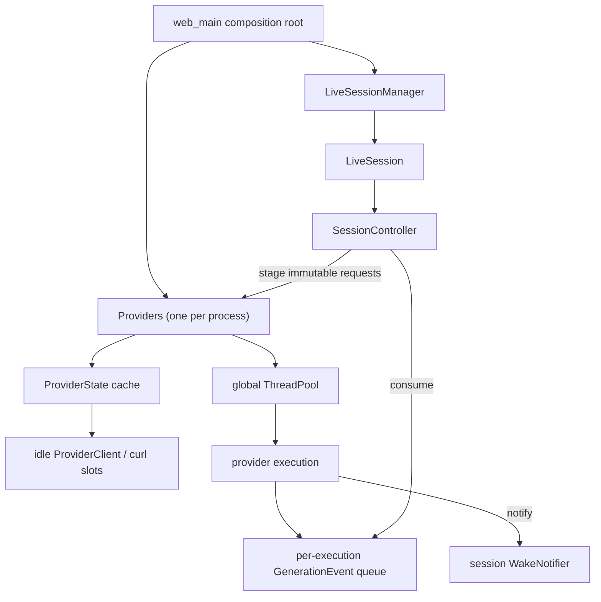
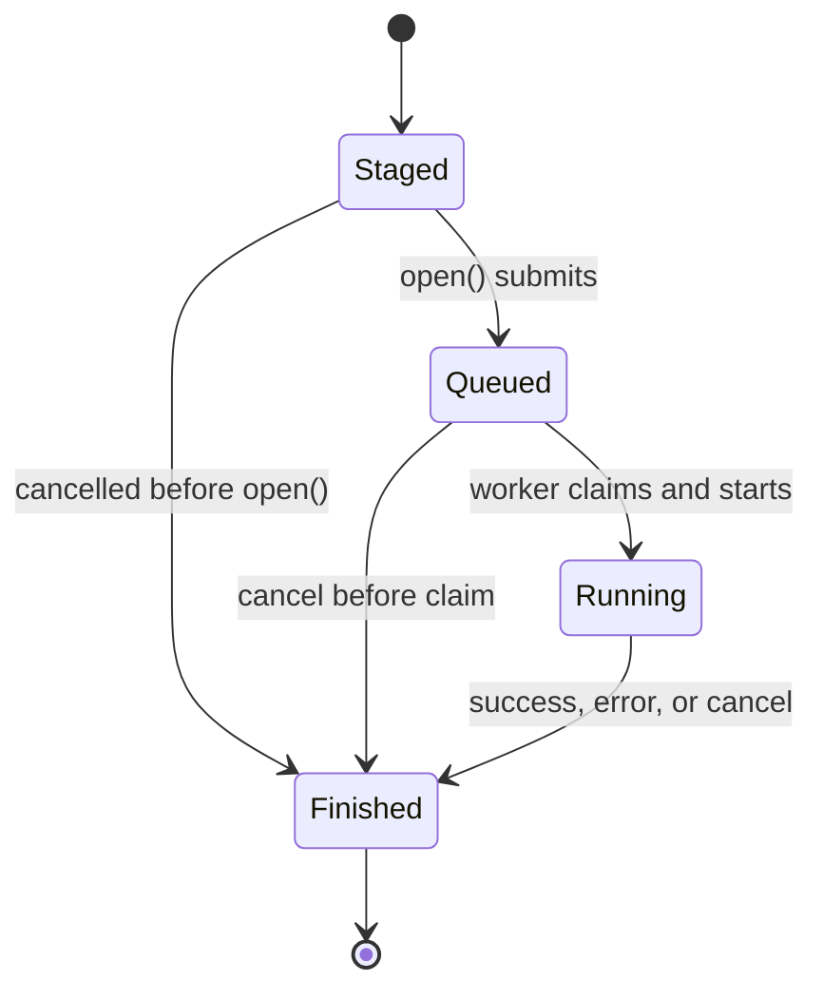

# Design: process-wide provider execution

## Status

This document describes the planned provider-execution redesign. It is not an
implementation description of the current code.

The design deliberately stays small. Its purpose is to move network execution
out of active sessions, reuse provider connections across sessions, and retain
the conversation behavior that already works. It is not intended to become a
general scheduling framework or a separate provider service.

## Summary

CHA will have one process-owned `Providers` instance. Every active session will
borrow it and submit generation requests to it. `Providers` will own:

- one fixed worker pool shared by all sessions;
- the cache of initialized provider state;
- reusable `ProviderClient` instances and their curl easy handles;
- provider-task dispatch and process-level execution shutdown.

An active session will continue to own:

- conversation and transcript state;
- character selection and prompt construction;
- a handle for its current generation batch;
- foreground ordering, persistence, and presentation of generated output;
- cancellation of its own work.

A normal prompt is a batch containing one request. `/mcast` is a batch
containing several requests. The provider layer may run requests concurrently,
but the session layer keeps the existing deterministic order in which multicast
answers become visible.

`Providers` is a singleton by ownership, not a global service locator. It is
constructed once in the process composition root and passed explicitly to the
objects that need it.

## Motivation

Today provider execution is nested under each active session:

```text
LiveSession
  SessionController
    ThreadPool
    GenerationExecutor
      ProviderClient per character
        CurlEasyHandle
    GenerationBatch
```

This makes threads and network connections session resources even though they
do not contain conversation state. The consequences are:

- every open session reserves its own worker threads;
- provider connections cannot be reused by another session;
- the number of threads grows with the number of sessions and characters;
- curl and scheduling lifetimes are coupled to conversation lifetimes;
- future process-wide concurrency control would require coordinating several
  independent pools.

The provider configuration cleanup is a prerequisite for this design. A
character configuration is now the only place that selects a provider. Forum,
session, command, and other overrides must not affect provider selection.

## Goals

1. Keep exactly one provider-execution component per CHA process.
2. Share a bounded number of worker threads across all active sessions.
3. Reuse initialized provider state and curl handles across sessions.
4. Support a normal request and concurrent `/mcast` requests with the same API.
5. Keep transcripts, prompts, queues, and presentation state isolated between
   sessions and requests.
6. Preserve cancellation, streaming, persistence, and deterministic multicast
   presentation.
7. Make provider configuration reloads safe for already-running work.
8. Make shutdown order explicit and ensure no provider task calls destroyed
   session objects.

## Non-goals

This change does not introduce:

- a separate or remotely accessible provider service;
- dynamic worker-pool resizing;
- one worker pool per provider;
- provider-specific rate limiting or priority scheduling;
- a new retry policy;
- curl multi;
- persistent connection caches across process restarts;
- request deduplication or shared generated output;
- provider selection outside character configuration;
- a replacement for the current transcript or persistence model.

## Current behavior to preserve

The redesign changes ownership, not user-visible generation semantics.

- `SessionController` creates one immutable model-history view before a batch.
- Every request in `/mcast` sees that same pre-multicast history.
- No target execution can reach a provider until the session has committed the
  durable state that receives its output.
- Each execution has its own event queue and cancellation state.
- Provider work may happen concurrently.
- Multicast outputs are consumed and persisted in target order.
- Failure of one multicast target does not corrupt another target's output.
- Session shutdown cancels and waits for its active generation before destroying
  the notifier and controller.

## Target ownership



The process composition root constructs `Providers` before the live-session
manager. Consequently, normal reverse destruction destroys all live sessions
before it destroys `Providers`.

`SessionController` borrows `Providers&`. It will no longer own a `ThreadPool`
or a `GenerationExecutor`. A session still owns its `GenerationBatch`, because
the batch is the session's handle for observing, ordering, canceling, and
waiting for its own requests.

## Provider selection

Provider selection remains part of the resolved character definition. The
resolved value must contain both a stable provider identifier and the exact
connection configuration used by that character:

```cpp
struct ProviderSelection {
  std::string id;
  ModelBackendConfig config;
};
```

`CharacterDefinition` should contain `ProviderSelection` instead of an
unidentified `ModelBackendConfig`. `LoadedCharacterConfig` must carry the same
resolved selection into the runtime definition.

The identifier is useful for cache sharing and diagnostics, but it is not
sufficient to identify reusable state. The cache key is:

```text
(provider id, exact resolved ModelBackendConfig)
```

Using the full pair matters during workspace reload. An identifier can retain
the same name while its endpoint, model, protocol, or another setting changes.
Old in-flight requests must keep using the old resolved configuration, while
new requests use the replacement. In every other situation the pair is
redundant, because a provider config file is the only source of a resolved
`ModelBackendConfig`: no character, forum, or session layer overrides one of its
fields.

Exact comparison needs a defaulted `operator==` on `ModelBackendConfig`. That
struct holds `api_key`, so the cache key contains a secret: it may be compared
but never logged or included in diagnostics.

No provider selector is accepted from a forum, an active session, or a command.
In particular, `Providers` does not add a runtime equivalent of `/provider`.

## Request boundaries

Provider work is asynchronous, so everything a task reads must either be owned
by the task or have a lifetime guaranteed through task completion. The API must
not accept a raw `TranscriptView&` or a pointer into mutable session state.

The existing immutable `SharedModelHistory` and `GenerationRequest` are the
right boundary for transcript data. A provider request can combine that data
with a shared immutable character definition:

```cpp
struct ProviderRequest {
  std::shared_ptr<const CharacterDefinition> definition;
  GenerationRequest generation;
};
```

The shared character definition avoids copying a potentially large system
prompt on every submission. It is a snapshot: later workspace changes do not
change an already-submitted request.

Each request includes the data already required for generation, including its
request identifier, target character, author, prompt, shared history, prompt
cache key, and timestamp. The provider cache never stores any of those values.

## Public interface

The intended interface is small:

```cpp
class Providers {
 public:
  explicit Providers(std::size_t worker_count,
                     ProviderClientFactory client_factory = {});
  ~Providers();

  Providers(const Providers&) = delete;
  Providers& operator=(const Providers&) = delete;

  ProviderRuntimeInfo describe(const ProviderSelection& selection);

  GenerationBatch stage_batch(
      std::vector<ProviderRequest> requests,
      WakeNotifier& notifier);

  void shutdown() noexcept;
};
```

Names may be adjusted during implementation, but the responsibilities should
not grow. In particular, this component does not know about active sessions,
forums, transcript mutation, foreground characters, or message persistence.

`describe()` initializes the selection's provider state if it is not cached
yet, then returns provider-level runtime information: the model, the
API/protocol, and streaming capability. It can block on the network and it can
throw, exactly as constructing a `ProviderClient` does today. Character metadata
is combined with that information by the session-facing layer when a
`ModelBackendInfo` is needed.

`SessionController` calls `describe()` once per forum character while it
constructs, because it builds its `characters_` view from that runtime
information before any prompt exists. Session open therefore keeps today's
behavior: it blocks on provider initialization and fails when a provider
configuration is invalid or undiscoverable. The benefit of the shared cache is
that a second session on the same providers finds every state already
initialized and blocks on nothing.

`stage_batch()` has failure-atomic behavior: either it returns a batch handle
for every requested execution, or no execution is created and no worker is
occupied. It resolves the provider state for each request (normally a cache hit,
because `describe()` already initialized it) and constructs one execution per
request. It submits nothing to the worker pool.

The batch handle retains the operations the controller needs:

```cpp
foreground_run()
open()
try_receive_foreground()
advance()
cancel()
wait()
```

`open()` is the point at which executions are submitted to the global worker
pool. Until then the batch holds inert executions that no worker can see. This
replaces the previous shared start gate; see
[Execution state and cancellation](#execution-state-and-cancellation).

The exact type may remain the current `GenerationBatch` during migration.

## Separation inside `ProviderClient`

The current `ProviderClient` combines two kinds of state:

1. provider transport state: endpoint, protocol, API key, selected model, and
   one curl easy handle;
2. character/request state: metadata, system prompt, model history, and current
   output destination.

Only the first category is cacheable across sessions. `ProviderClient` will be
changed into a provider-only connection. Character metadata and the system
prompt are supplied to request preparation for each call and are not retained
after the call finishes.

A provider client owns exactly one curl easy handle. A handle is leased to at
most one running request at a time. No locking scheme may make simultaneous
requests share a curl easy handle.

## Provider-state cache

`Providers` maintains a small collection of `ProviderState` objects. A state
contains:

- its immutable `ProviderSelection` snapshot;
- resolved model/API/streaming information;
- resolved credentials needed to create clients;
- idle provider clients, each owning one curl easy handle;
- the synchronization needed to initialize and lease clients.

The number of configured providers is small. A locked linear collection with
exact configuration equality is preferable to custom hashing and a more
general cache framework.

### Initialization

The first use of a selection initializes its state. API-key resolution and
optional model discovery occur once for that state. Additional clients are
created from the resolved state and do not repeat a `/models` request.

In practice the first use is `describe()` on the session-open path, so a
session's providers are already initialized before its first prompt. `Providers`
does not rely on that: `stage_batch()` initializes any state it does not find
cached, so initialization is correct regardless of which call reaches a
selection first.

Concurrent first users of the same selection wait for the same initialization
result. If initialization fails, the incomplete entry is removed rather than
left as a permanently poisoned cache value. All current waiters receive the
failure, and a future call can retry initialization. This matters for
`describe()`, because a provider that is down when one session opens must not
stay permanently broken for the next one.

Because initialization happens inside `describe()` and `stage_batch()`, both
report configuration and discovery failures by throwing, before any execution
exists. Failure atomicity is preserved: a batch that cannot resolve every
provider state creates no executions at all.

### Client leasing

For each executing task:

1. read the `ProviderState` the execution already holds a shared reference to;
2. lease an idle `ProviderClient`, or create one when none is idle;
3. prepare and perform the request using only that client;
4. reset request-specific curl options and return a healthy client to the idle
   list;
5. discard the client if its transport state cannot safely be reused.

An execution holds its `ProviderState` from staging onward, but leases a client
only while it runs. Nothing is leased by an execution that is queued, cancelled
before it starts, or waiting behind other work.

Concurrent requests to one provider therefore cause multiple curl handles to
exist. Once concurrency falls, those clients remain idle for later sessions.
The number of idle clients per provider cannot exceed the global worker count,
so no eviction policy is needed initially.

When a configuration changes under the same provider identifier, a new state
is selected. In-flight tasks retain a shared reference to their old state. That
old state and its clients are destroyed automatically after the last task and
lease release them.

### What is never cached

The provider cache must not retain:

- transcript or model-history views;
- user prompts or generated text;
- system prompts beyond the lifetime of an immutable character definition;
- output queues or wake notifiers;
- session, forum, or controller pointers;
- cancellation state belonging to completed executions.

## Global worker pool

`Providers` owns one fixed `ThreadPool`. The core constructor takes its size so
tests can use a deterministic value. Production initially passes
`WebSettings::session_limit`, whose current default is eight. This introduces no
new user-facing setting and allows one normal request per admitted session to
make progress when all sessions are busy.

`/mcast` can use otherwise available workers. If there are more multicast
children and normal requests than workers, excess work waits in FIFO order.
The guarantee is bounded concurrency, not simultaneous start of every multicast
target.

This deliberately retires an existing invariant. Today `SessionController` sizes
its private pool to the number of forum characters, so a multicast always starts
every target at once. With a shared pool of eight, a forum wider than the pool
starts eight targets and queues the rest, and a session competing with seven
busy sessions can start one at a time. Presentation order is unaffected, because
the controller already displays targets in their original order regardless of
completion order; only the time to the last answer changes.

Sizing the pool from `session_limit` is a starting value, not a derivation:
`session_limit` bounds admitted sessions, while this bounds concurrent provider
requests. It is chosen because it needs no new user-facing setting and
guarantees that every admitted session can always make progress on one normal
request. An independently configurable worker count is a deferred decision, to
be revisited if multicast latency in a wide forum turns out to matter in
practice.

The first implementation does not add priorities, per-session quotas, or
provider-specific pools. FIFO scheduling is adequate for CHA. These can be
reconsidered only if observed behavior demonstrates a real problem.

## Execution state and cancellation

Moving to a global pool changes two things about how work starts and stops.

### Submission replaces the start gate

Today every execution is submitted to the pool immediately and then blocks in a
shared start gate until the controller has committed the durable session state
that will receive its output. That is safe while the pool is session-private,
because only that session's own workers wait. On a shared pool it is not: the
controller writes a durable transcript entry between staging and opening, so a
multicast would park up to eight global workers in an unbounded wait while one
session finishes a database write. Every other session would stall behind it.

The start gate is therefore removed. Submission itself becomes the start signal:

- `stage_batch()` constructs every execution and verifies the pool is still
  accepting work. It submits nothing, so no worker is occupied and no provider
  can be reached. If any step fails, no execution exists and the caller sees the
  failure as an exception, exactly as before.
- `open()` submits every execution to the pool. The controller calls it only
  after the durable state is committed, so the first moment a worker can run an
  execution is already the first moment its output has somewhere to go.
- If the controller fails between the two calls, it cancels the batch instead of
  opening it. Nothing was ever submitted, so cancellation completes immediately.

This removes the `StartGate` type, its condition variable, and the possibility
of a worker blocking on anything other than its own provider I/O.

One failure mode moves. Pool submission can now fail after the durable commit
rather than during staging. `open()` therefore cannot throw: an execution that
cannot be submitted is completed in place with a failure event, which the
controller consumes and presents through the path it already uses for provider
errors. In practice submission fails only when the pool has stopped, which
happens during shutdown.

### Execution state machine

Each execution has a small atomic state machine, so that canceling a session
never waits for that session's queued closure to reach the front of the process
queue behind unrelated long-running requests:



Cancellation behaves as follows:

- A `Staged` execution was never submitted. Cancelling it completes it in place.
- A `Queued` execution is atomically completed by the canceling thread. Its
  terminal state is published immediately, so `wait()` returns without waiting
  for a worker.
- A `Running` execution observes the existing atomic cancellation flag. Curl's
  progress callback aborts network transfer in the same way it does today.
- Completion and terminal-event publication happen once, regardless of races
  between cancellation and worker execution.

This makes session teardown depend on that session's running I/O, not on the
position of its unstarted work in the process queue.

### The abandoned-closure rule

The previous point has a consequence that must be stated explicitly, because
getting it wrong is a use-after-free rather than a missed wakeup.

A `Queued` execution that is cancelled is `Finished` before its closure is
dequeued. `wait()` returns, the session tears down, and the controller, the
notifier, and the session owner are destroyed. The closure is still sitting in
the global pool queue, and some worker will eventually run it.

Therefore: **a closure that observes `Finished` must return without touching
anything it borrows.** It must not call the notifier, must not touch its
`ProviderState` or lease a client, must not publish an event, and must not run
the normal completion path — the terminal event was already published by the
canceling thread. The only state it may touch is its own execution object, whose
lifetime the closure's `shared_ptr` guarantees.

This also rules out the current arrangement in which an execution holds a bare
`ModelBackend&`. An execution owns a `shared_ptr<ProviderState>` and leases a
client only after it has committed to running, so an abandoned closure holds no
reference to anything a destroyed session owned.

## Output delivery and wakeups

Every execution retains its own `ConcurrentQueue<GenerationEvent>`. There is no
global output queue. Per-execution queues prevent interleaving events from
different requests and avoid relying on request identifiers for isolation.

A worker pushes events to its execution queue and calls the borrowed
`WakeNotifier`. `OwnerWakeSignal` can continue implementing this interface.

The notifier is borrowed, so its lifetime needs care. Session teardown cancels
and waits for the whole batch before destroying the notifier, which covers every
execution that actually reaches a worker. It does not cover an execution that
was cancelled while `Queued`, because that one finishes without waiting for its
closure to be dequeued. Such a closure may run after the notifier is gone, and
it is precisely the case the abandoned-closure rule above forbids from calling
`wake()`. Note that today's terminal path wakes the notifier unconditionally
after marking an execution finished; that unconditional wake must not survive
into the abandoned-closure path.

Request identifiers can remain session-local because queues and execution state
are not shared between sessions. Logs should include both the session/request
context and provider identifier when available, but request IDs do not become a
process-wide addressing mechanism.

## Normal generation

For a normal user prompt:

1. `SessionController` resolves the active character definition.
2. It snapshots the model history and builds one `ProviderRequest`.
3. It calls `Providers::stage_batch()` with a one-element vector, which
   constructs the execution without submitting it.
4. After the session mutation is committed, it calls `open()`, which submits the
   execution to the global pool.
5. A global worker claims it, leases a matching provider client, and performs
   the request.
6. The controller consumes events from the request queue, persists the answer,
   and completes the batch as it does today.

The common path has no special single-provider mode. It is simply a batch of
one.

## Multicast generation

For `/mcast`:

1. The controller creates one immutable pre-multicast history snapshot.
2. It builds a `ProviderRequest` for every target character using that snapshot.
3. `Providers::stage_batch()` resolves all required provider states and
   constructs every execution, or fails without constructing any.
4. `open()` submits all of them at once. Workers execute targets concurrently up
   to global pool capacity, and any excess waits in the pool queue. Targets may
   use the same provider state or different states.
5. Each target writes only to its own event queue.
6. The controller activates, drains, displays, and persists target answers in
   the original target order.
7. Cancellation applies to every unfinished child. Failure of one child remains
   isolated from the others.

Tasks from other sessions may run between multicast tasks. That changes only
timing; it must not change history snapshots, output ownership, or presentation
order.

## Workspace reload

Provider configuration follows snapshot semantics:

- A submitted request holds its resolved character and provider selection.
- File changes do not mutate a running request.
- Newly loaded character definitions use the new resolved configuration.
- An unchanged `(id, config)` pair reuses cached state and curl handles.
- The same identifier with a changed config creates a new state.
- Old state is reclaimed when no task uses it.

The existing reload path closes and reopens affected live sessions. No explicit
provider-cache flush is required. Exact resolved configuration matching gives
the desired behavior without coordinating the cache with workspace generations.

## Process shutdown

Shutdown order must be explicit:

1. Stop accepting new HTTP work.
2. Ask `LiveSessionManager` to shut down all sessions.
3. Each controller cancels and waits for its active batch.
4. Join session owner threads, destroying their controllers and notifiers.
5. Call `Providers::shutdown()`.
6. `Providers` rejects new staging and `describe()`, stops and joins its worker
   pool, and destroys cached provider states and their clients.
7. Shut down logging.

By step 5 every batch has already been cancelled, waited for, and destroyed by
its owning session, so `Providers` has no outstanding execution to chase. It
keeps no registry of executions: ownership flows through the session's batch,
and adding a parallel weak registry would be machinery for a state that steps
2-4 already make impossible. `shutdown()` may assert that the pool queue drained
rather than track what was in it.

Abandoned closures are the one thing that can still be in the pool queue at step
6, and they are harmless: `ThreadPool::stop()` drains already-accepted tasks, and
each such closure observes `Finished` and returns immediately.

`Providers::shutdown()` is idempotent. Its destructor calls it as a fallback,
but the composition root should call it explicitly so ordering is obvious.
`stage_batch()` and `describe()` after shutdown throw without creating anything.

Curl global initialization stays where it is: a function-local static
constructed on first use and destroyed after `main` returns. That already orders
correctly, because `Providers` is scoped inside `main` and destroys every cached
easy handle in step 6, before the static's cleanup runs. There is no explicit
curl-global step to perform, and moving one into `Providers` would only add a
lifetime to manage.

## Error handling

The ownership change should preserve existing user-visible errors and streaming
behavior.

- Invalid or undiscoverable provider configuration throws from `describe()` at
  session open, or from `stage_batch()` if a state is first reached there.
  Neither creates an execution.
- A transport/protocol failure becomes an error event for only that execution.
- A batch that cannot resolve every provider state creates no executions and
  reports the failure to the caller.
- An execution that cannot be submitted during `open()` is completed in place
  with a failure event rather than throwing, because the session state it
  belongs to is already durable by then.
- Exceptions cannot escape worker functions.
- Exactly one terminal result is observable for each execution.
- A client that may contain unsafe curl state after failure is discarded.
- Secrets, authorization headers, prompts, and response bodies are not emitted
  in cache or scheduler logs.

## Diagnostics

Existing logs should gain enough context to diagnose shared execution without
turning `Providers` into an observability subsystem. Useful fields are:

- provider identifier;
- provider-state cache hit, miss, and initialization failure;
- client lease reused versus newly created;
- request and session identifiers already present in the call path;
- queued, running, canceled, and completed transitions;
- elapsed queue and provider time.

Configuration values containing credentials and all prompt/transcript content
remain excluded.

## Expected code changes

### New files

- `src/agents/providers.h`
- `src/agents/providers.cpp`
- `tests/agents/unit_providers.cpp`

### Main modifications

- `character_config.*`: retain the provider ID with the resolved backend config,
  and give `ModelBackendConfig` a defaulted `operator==` for cache-key equality.
- `character.*`: store `ProviderSelection` in `CharacterDefinition`.
- `provider_client.*`: remove retained character/request state and make a client
  an exclusively leased provider connection.
- `model_backend.h`: separate provider runtime information from character-facing
  `ModelBackendInfo` if needed.
- `generation_batch.*`: remove `StartGate`; make `open()` the submission point
  on the global pool; replace the borrowed `ModelBackend&` with a
  `shared_ptr<ProviderState>` and an in-task client lease; add the execution
  state machine, immediate completion of cancelled staged and queued executions,
  and the abandoned-closure early return.
- `session_controller.*`: borrow `Providers&`; remove its worker pool and
  `GenerationExecutor`; retain session batch consumption and ordering.
- `session_open.*`, `workspace_runtime.*`, and `web_main.cpp`: pass the one
  process-owned `Providers` instance through the construction path and enforce
  shutdown order.
- build files: compile the new component and remove obsolete sources.

`GenerationExecutor` becomes redundant after `SessionController` stages work
directly through `Providers`. It can be used as a temporary migration adapter,
then its source and unit tests should be removed rather than maintained as an
extra forwarding abstraction.

## Implementation sequence

The work should be split into small, continuously testable changes.

### 1. Carry provider identity

- Introduce `ProviderSelection`.
- Carry it from character configuration into `CharacterDefinition`.
- Keep the current session-local executor behavior.
- Update configuration and character tests.

### 2. Make clients reusable

- Separate provider transport state from character/request inputs.
- Make exclusive client leasing possible without changing ownership yet.
- Preserve protocol request-body and streaming tests.

### 3. Add `Providers`

- Add the global pool, provider-state initialization, `describe()`, and the
  client cache.
- Replace the start gate with submission on `open()`, and add the execution
  state machine, cancellation transitions, and the abandoned-closure rule.
- Test this component independently through an injected client factory.

### 4. Move sessions onto the shared component

- Inject `Providers&` into `SessionController`.
- Build `characters_` from `describe()` per forum character at construction.
- Remove the session-owned pool and executor.
- Keep `GenerationBatch` and all foreground/persistence logic in the session.
- Add tests using two controllers against one provider component.

### 5. Complete process lifetime changes

- Construct one instance in `web_main`.
- Implement explicit shutdown order and reload coverage.
- Remove `GenerationExecutor` and obsolete tests/build entries.
- Update documentation that describes ownership.

Each step should compile and pass its focused unit tests before the next step.
The final step should run the full test suite.

## Test plan

### Providers unit tests

- repeated requests with the same `(id, config)` reuse one provider state;
- the same ID with different resolved configs creates distinct states;
- concurrent same-provider requests never use one client/curl handle together;
- a second client avoids repeating model discovery;
- initialization failure is shared by current waiters but can be retried later,
  including a failed `describe()` followed by a successful one;
- `stage_batch()` occupies no worker until `open()` is called;
- a staged batch that is cancelled instead of opened finishes immediately and
  reaches no provider;
- a queued execution cancels and finishes without waiting to be dequeued;
- a closure dequeued after its execution finished touches no borrowed state:
  with the notifier and provider state already destroyed, running it is safe and
  publishes nothing;
- running cancellation reaches the client and publishes one terminal result;
- a batch that cannot resolve one provider state creates no executions;
- submission failure during `open()` produces a failure event, not an exception;
- shutdown rejects new work, cancels outstanding work, and joins workers;
- healthy clients are reused and broken clients are discarded.

### Batch and session tests

- normal generation behavior is unchanged;
- a session opened against an unreachable provider fails at open, as today;
- a second session on the same providers opens without re-running discovery;
- `/mcast` children share one history snapshot;
- `/mcast` executes concurrently when capacity exists, and serializes the excess
  in target order when the forum is wider than the pool;
- a slow durable commit in one session does not delay another session's request;
- outputs are consumed in target order even when completion order differs;
- one target failure does not mix or discard another target's output;
- session shutdown waits for its running request and not unrelated queued work;
- destroying a session leaves no notifier callbacks behind;
- two sessions share provider state while retaining separate queues and output;
- the global number of concurrent clients never exceeds worker-pool capacity.

### Reload and process tests

- unchanged configuration reuses provider state across a workspace reload;
- changed configuration under the same ID is used only by new requests;
- in-flight requests complete on their original configuration snapshot;
- process shutdown destroys sessions before curl clients and worker threads;
- every cached easy handle is destroyed before curl's global cleanup runs.

Existing `ProviderClient` protocol, body construction, authentication,
streaming, and curl-cancellation tests remain transport-level regression tests.

## Acceptance criteria

The redesign is complete when all of these invariants hold:

1. No active session or `SessionController` owns a worker pool,
   `ProviderClient`, or curl easy handle.
2. Exactly one explicitly owned `Providers` instance serves all live sessions.
3. Every curl easy handle is used by at most one request at a time.
4. Every execution has an isolated output channel.
5. Canceling a session's queued request does not wait behind unrelated work.
6. `/mcast` retains one history snapshot and deterministic presentation order.
7. Configuration reloads provide snapshot isolation to in-flight requests.
8. Provider caches contain no transcript, prompt, output, or session state.
9. Provider configuration secrets are never logged.
10. Existing protocols, streaming, error reporting, and running-request
    cancellation continue to work.
11. No worker ever blocks on session state: a worker waits only on its own
    provider I/O.
12. A pool closure that runs after its session was destroyed touches nothing
    that session owned.

## Deferred decisions

The following are intentionally deferred until real usage demonstrates a need:

- fairness stronger than FIFO between sessions;
- an idle-client eviction policy;
- an independently configurable global worker count;
- provider concurrency limits or rate limiting;
- request priorities;
- proactive provider warm-up.

The structures above do not prevent those changes, but they should not be built
as part of this redesign.
