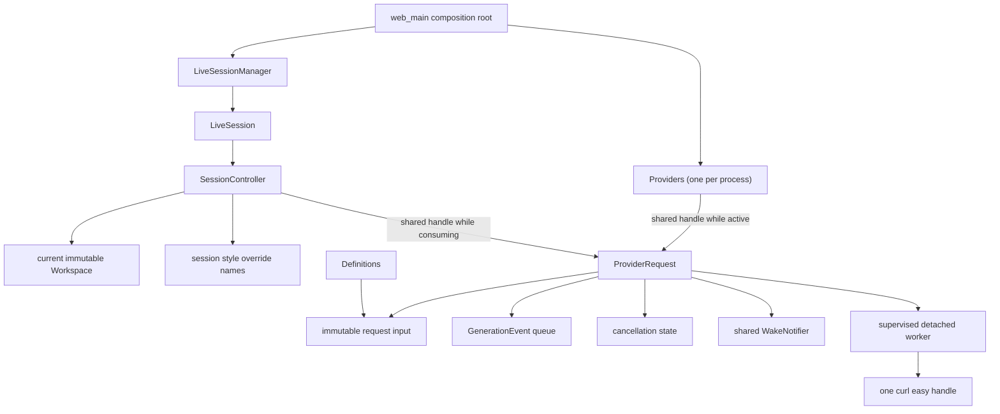

# Design: request-owned provider execution

## Status

This document describes the implemented provider-execution architecture. It
replaces the previous global-worker-pool proposal.

The design deliberately favors direct ownership over scheduling machinery.
CHA is a small personal application. One provider request is one independent
asynchronous operation, and the code should represent it that way.

## Summary

CHA will have one process-owned `Providers` instance. Its primary operation is
`make_request()`. The call creates and immediately starts a `ProviderRequest`,
then returns a shared handle to it.

Every active request owns all of its execution state:

- an immutable snapshot of its character and generation input;
- a shared snapshot of the transcript history;
- one supervised detached worker thread;
- one curl easy handle, created and destroyed by that worker;
- one private queue of `GenerationEvent` values;
- its cancellation and terminal state;
- a shared wake signal for the session owner.

`Providers` keeps a shared pointer to each request while its worker is active.
The session keeps another shared pointer while it consumes the request's
events. When the worker has released its transport resources, `Providers`
removes its pointer. When the session has consumed or abandoned the request, it
removes its pointer. The request is destroyed after both sides are finished
with it.

There is no generation worker pool, task queue, start gate, client lease, or
process-wide concurrency limit. Every runnable request starts one thread
immediately. A normal prompt creates one request. `/mcast` creates one
independent request per target.

`Providers` does not cache provider information. The model, protocol, endpoint,
and other provider settings are already present in the immutable configuration
snapshot owned by each request. Each request worker resolves its own credential
and creates its own curl handle. The model is required in provider
configuration; CHA never discovers one.

`Providers` is a singleton by process ownership, not a global service locator.
It is constructed in the composition root and passed explicitly to session
construction.

## Why this division is simpler

The asynchronous unit in the application is a provider request. Its thread,
curl handle, cancellation flag, and output queue all have the same lifetime and
belong together.

Putting those resources behind a session executor or a global scheduler splits
one operation across several owners. It then requires additional machinery to
answer questions that a self-contained request answers directly:

- whether a task has been submitted or claimed;
- whether a queued closure can still touch a destroyed session;
- which client is leased to which execution;
- whether a session must wait for unrelated work ahead of it;
- how staged work is prevented from occupying a worker;
- how a shared pool is drained without retaining session dependencies.

The request-owned design removes those questions. A request has no session
pointer and borrows no mutable session state. Once constructed, it can finish
or be cancelled even if the session that created it has already been
destroyed.

## Goals

1. Make provider execution independent of session lifetime.
2. Keep the provider API centered on one operation, `make_request()`.
3. Allocate threads and curl handles only for active provider requests.
4. Keep every request's input, output, cancellation, and transport isolated.
5. Let normal and multicast generation use the same request type.
6. Preserve streaming and deterministic multicast presentation.
7. Let session teardown cancel and release provider work without waiting.
8. Resolve credentials independently in each request without shared provider
   state.
9. Keep workspace reloads safe for requests already in progress.
10. Make process shutdown supervise all detached request workers.

## Non-goals

This change does not introduce:

- a generation thread pool;
- a global provider task queue;
- a process-wide request limit;
- fairness, priorities, or rate limiting;
- reusable curl easy handles or connection leasing;
- curl multi;
- batch dispatch atomicity;
- provider model discovery or `/models` requests;
- session-open provider reachability checks;
- a new retry policy;
- request deduplication or shared generated output;
- a separate provider service;
- a provider-information or credential cache.

If observed usage later demonstrates that unbounded active-request concurrency
or new curl handles are a real problem, those problems can be addressed then.
They should not shape this implementation preemptively.

## Target ownership



The session owns conversation behavior. It does not own provider-execution
resources. Specifically, the session continues to own:

- transcript and journal state;
- stable workspace IDs, persona selection, and style override names;
- prompt construction and request ordering;
- the ordered vector of request handles for the current generation;
- persistence and presentation of streamed output;
- the decision to cancel its requests.

The ordered vector may be wrapped in a small session-local type, but that type
is not an executor. It owns no thread, curl handle, queue, provider client, or
waitable task.

## Request input boundary

No worker may retain the current `TranscriptView`. It is a call-scoped,
non-owning view whose spans and strings may be invalidated by the next
transcript mutation.

Before any request thread is launched, the session synchronously creates one
owning immutable model-history snapshot. A multicast creates this snapshot
once and shares it among all target requests:

```cpp
using SharedModelHistory = std::shared_ptr<const ModelHistory>;
```

The snapshot operation copies every transcript value needed for model-context
projection, including the open-entry and off-record state. No worker reads the
live transcript.

The complete request input is an owning value. Its intended shape is:

```cpp
struct ProviderSelection {
  std::string id;
  ModelBackendConfig config;
};

struct ProviderRequestInput {
  std::shared_ptr<const CharacterDefinition> character;
  GenerationRequest generation;
};
```

The exact names may change during implementation. The important properties
are:

- `character` snapshots identity, the system prompt, and its exact
  `ProviderSelection`;
- `generation` is the existing request boundary: its `history` owns the
  pre-request conversation projection and its `run` owns the forum/session
  identity, request ID, author, target, prompt, cache key, and timestamp.

`CharacterDefinition` should retain its provider identifier together with its
resolved backend configuration. A bare provider ID is useful to callers and
logs, but the request must retain the resolved configuration snapshot so that
a reload cannot change work already in progress.

## Per-character runtime information

Provider information and character information have different ownership and
cardinality. Several characters may select the same provider while retaining
different identities, names, descriptions, and configured appearances.
`Providers` therefore does not supply per-character metadata; the current
`Workspace` does. When generation starts, `Workspace::character_definition()`
returns one owned `CharacterDefinition` containing:

- the character metadata, including its configured appearance;
- the character and system prompts used for generation;
- its exact `ProviderSelection`, whose configuration supplies the model, API,
  and streaming flag.

The request keeps that value alive independently. `SessionController` retains
no character roster. Handle resolution and `/characters` data come directly
from the current `Workspace`. `style_overrides_` stores only selected style
names and is applied when metadata is copied for a request or presentation;
resetting an override exposes the configured Workspace appearance again.

`/characters` and `/info` use the ordered per-character runtime records. If two
characters share one provider selection, they still produce two records with
their own character metadata; the configured model, API, and streaming values
are repeated. No provider lookup or network operation is needed.

## Public interface

The provider execution interface should remain small:

```cpp
using ProviderClientFactory =
    std::function<std::unique_ptr<ModelBackend>(
        std::shared_ptr<const CharacterDefinition>)>;

// Launches the closure on one detached thread, or throws without launching it.
// Production uses std::thread; tests inject a deterministic failure.
using ProviderThreadLauncher =
    std::function<void(std::function<void()>)>;

class ProviderRequest {
 public:
  const RunSpec& run() const noexcept;

  ChannelReadStatus try_receive(GenerationEvent& event);
  void cancel() noexcept;
};

class Providers {
 public:
  Providers(ProviderClientFactory client_factory = {},
            ProviderThreadLauncher thread_launcher = {});
  ~Providers();

  Providers(const Providers&) = delete;
  Providers& operator=(const Providers&) = delete;

  std::shared_ptr<ProviderRequest> make_request(
      ProviderRequestInput input,
      std::shared_ptr<WakeNotifier> notifier);

  void shutdown() noexcept;
};
```

`ProviderClientFactory` is the narrow transport test seam. The request worker
passes it the same shared immutable `CharacterDefinition` held in
`ProviderRequestInput`. Each invocation creates a new request-local
`ModelBackend`; the production result is a `ProviderClient` with one curl easy
handle. The client retains the shared definition while it runs, using its
`ProviderSelection` for transport configuration and its `system_prompt` during
payload preparation. This is immutable request input, not borrowed session
state.

`ModelBackend::prepare(const GenerationRequest&)` remains unchanged. The
worker's relevant calls are equivalent to:

```cpp
auto backend = client_factory_(input.character);
RequestPayload payload = backend->prepare(input.generation);
```

The definition supplied at construction is what lets `ProviderClient::prepare()`
call `project_model_context(input, system_prompt)` without adding the prompt to
`GenerationRequest` or introducing a second backend request type.

`ProviderThreadLauncher` exists only to make thread-start failure deterministic
in unit tests. Its default launches the closure exactly once on a detached
`std::thread`; an injected launcher must either do the same or throw before
launching it.

`Providers::make_request()`, `Providers::shutdown()`, `ProviderRequest::cancel()`,
and `ProviderRequest::try_receive()` are thread-safe. Several session-owner
threads may create and consume independent requests while other request workers
finish. `shutdown()` may race with a final `make_request()`; closed admission is
handled as a failed request, not as a thrown operational error.

`make_request()` is the only operation that starts provider work. It copies or
takes ownership of everything the worker needs, registers the request, starts
its thread immediately, and returns its handle. With a valid input it does not
throw for an operational failure. Closed admission, credential failure,
transport construction, and thread-launch failure all produce a returned
request with exactly one failure terminal. Allocation failure remains
process-fatal under the application's existing policy.

Character-facing runtime information comes from the session's immutable
character definitions and their validated provider configurations. In
particular, the model is always known without a provider call. `Providers`
needs no discovery or runtime-description operation.

The injected client factory exists for focused tests. It should not grow into a
general execution framework.

## `ProviderRequest`

### Owned state

A request owns:

- its `ProviderRequestInput`;
- its event queue;
- its atomic cancellation flag;
- enough terminal state to guarantee exactly one terminal event;
- its shared wake notifier;
- its request-local resolved credential while the transport needs it;
- request-local response decoding and error state;
- its curl easy handle while its worker is using it.

A request never contains:

- a `SessionController`, `LiveSession`, forum, or journal pointer;
- a borrowed transcript or character reference;
- a borrowed notifier reference;
- another request's events or cancellation state.

### Immediate start

`make_request()` does not stage work. It registers the new request and launches
its worker before returning. There is no scheduler and no state in which a
runnable request waits in a process queue.

The worker first checks cancellation, resolves any credential information still
needed, constructs one curl easy handle, prepares the request, and performs the
HTTP operation. It publishes streaming deltas to its queue and closes the queue
with exactly one completed, cancelled, or failed terminal event.

If thread creation itself fails, `make_request()` returns the request already
closed with a failure event. This is the exceptional case in which a request
cannot have a worker. Other multicast requests are unaffected.

The controller constructs and validates every `ProviderRequestInput` before it
starts a durable turn. A missing character, history snapshot, target, or
provider selection is therefore a pre-commit programmer error. Once the turn
has been committed, `make_request()` converts every non-fatal outcome into a
terminal event, including the unexpected case of an invalid input reaching the
provider boundary. Ordinary credential, thread-start, transport, and protocol
failures are request terminal events.

### Output queue and wakeups

Every request has one `ConcurrentQueue<GenerationEvent>`. There is no process
output queue and no session-owned provider queue. Request identifiers remain
useful for persistence and diagnostics, but they are not used to separate
interleaved output because output is already isolated by ownership.

After adding an event, the request calls its shared `WakeNotifier`. The request
owns a `shared_ptr`, not a reference. If the session has already disappeared,
the signal object simply lives until the request releases it; waking it touches
no destroyed session state.

The queue remains readable after provider execution finishes. This is why the
session's shared request handle may outlive the handle in `Providers`.

### Cancellation

`cancel()` only sets the request's atomic cancellation flag and wakes anything
inside the request that needs to recheck it. It is idempotent and non-blocking.

- A worker that has not started provider work reports cancellation without
  creating a network request.
- A worker resolving its credential stops as soon as that operation can safely
  observe cancellation.
- A running curl transfer observes the flag through its progress callback.
- Cancellation never publishes a second terminal event after completion won
  the race.

There is no queued-request cancellation state. Once `make_request()` succeeds,
the worker belongs only to that request and can always make progress toward its
own terminal state.

### Supervised detached worker

The request logically owns one worker, but it must not store a joinable
`std::thread` that can be destroyed by that same worker. Doing so would allow
the last shared pointer to run the request destructor on the worker thread and
attempt to join itself.

Instead, the launched thread is detached and captures shared request state plus
a shared internal provider-registry state. The registry gives the detached
worker process-level supervision:

1. `make_request()` inserts a strong request pointer into the active registry
   before launching the thread.
2. The worker catches every exception and publishes exactly one terminal event.
3. The worker destroys its curl handle and releases all transport callbacks.
4. Under one registry lock, it removes the request, snapshots the resulting
   active count, and marks one diagnostic tail in progress.
5. It logs the unregister transition, clears the diagnostic-tail count under
   the registry lock, notifies shutdown waiters, and returns.
   The detached closure retains the request through that final return, so
   registry removal cannot destroy state still in use by the diagnostic tail.

The worker captures the shared internal registry state, not a raw `Providers*`.
Consequently, the small registry object remains alive long enough for the
worker's final completion action even while the outer `Providers` object is
shutting down.

The active-registry removal point means provider I/O is quiescent: the curl
handle is already destroyed and no more events will be published. The separate
diagnostic-tail count keeps process shutdown waiting through the final log.
After clearing that count, the worker only notifies the shared registry and
drops its closure pointers; it touches no session object.

This is a supervised detached thread, not an abandoned thread. Process shutdown
waits for every active registry entry to reach this quiescent point.

An empty active registry and zero diagnostic tails do not mean that every
detached thread function has literally returned. A small tail may still notify
the registry and release the closure's captured shared pointers. That tail is
deliberately constrained:

- `ProviderRequest` has no thread handle, unregister callback, or `Providers`
  pointer in its destructor;
- its destructor does not log, take a provider or registry lock, or invoke the
  notifier;
- the internal registry is self-contained shared state whose destructor does
  not refer back to the outer `Providers` object;
- after clearing its diagnostic-tail count, the worker performs no application
  action other than notifying the registry, releasing the closure's request
  and registry pointers, and returning.

Consequently, `Providers::shutdown()` may destroy its outer members after the
registry is empty and the diagnostic-tail count reaches zero while a worker is
in this harmless release-only tail. Shared ownership keeps each captured
object alive, and no tail can contend for a lock held by shutdown or use
logging after provider shutdown returns.

## Required model, credential validation, and request-local resolution

Every provider configuration must contain a non-empty model. Workspace loading
rejects a provider that omits it. When a referenced provider names a non-empty
`api_key_env`, workspace loading also requires that environment variable to
exist and contain a non-empty value. The validation error identifies the
provider configuration and variable name but never includes the value. CHA does
not call a models endpoint and has no automatic-model state, discovery
synchronization, discovery failure, or discovery retry behavior.

Workspace loading performs this static validation and builds the immutable
character definitions. Session opening re-validates its re-parsed forum
definitions locally so a settings save can take effect. It performs no provider
network work or reachability check, and retains no credential value in session
state.

Every request worker resolves its own credential directly from the request's
`ModelBackendConfig` by reading the variable named by `api_key_env`. The
resolved value remains request-local and is
destroyed with that request's transport. An invalid, revoked, or rejected
credential fails only the affected request. A missing environment value at
this point is retained as a defensive failed-request path, but production
workspace validation prevents it during normal operation. There is no provider
state, cache mutex, initialization condition variable, waiter queue, or failure
shared between requests.

Production calls `load_dotenv()` once in `web_main`, before workspace loading,
request workers, and server threads. Production does not call
`set_environment_variable()` or `unset_environment_variable()` after startup.
Under that invariant, workspace validation and concurrent request-worker calls
to `getenv()` only read the environment and do not race with environment
mutation. Tests that temporarily change an environment variable must set it
before workspace loading or request launch and restore it only after any
request worker has reached transport quiescence.

### Intentional session-open behavior change

This is a deliberate user-visible change, not only an ownership refactor.
Today constructing a session creates `ProviderClient` objects, may call a
models endpoint when no model is configured, and resolves `api_key_env`; either
operation can fail the session open.

After this redesign:

- a missing model is rejected while loading workspace provider configuration;
- a referenced, non-empty `api_key_env` that is unset or empty is rejected
  while loading the workspace, before any session or durable generation turn;
- session open performs no provider HTTP request;
- session open re-validates any locally re-parsed character definitions,
  including the presence of configured `api_key_env` values; a validation
  failure keeps the workspace's startup definitions and reports a notice;
- invalid, revoked, or provider-rejected credentials remain request failures;
- `/characters` and `/info` use the session's immutable per-character runtime
  records, while style reset uses the immutable character definition; all
  configured values are available before any request.

The presence of a configured credential variable is therefore validated both
when publishing a workspace and when session opening successfully re-parses
local character settings. Session opening may read the environment for that
validation, but it never retains the credential value. Reading the actual
credential into request-local transport state, provider authentication, and
provider reachability remain request-time concerns.

## Concurrency model

Every runnable provider request immediately creates one operating-system
thread. There is no process-wide concurrency bound.

This makes resource use proportional to active inference rather than to open
sessions or configured characters. It also gives every multicast target and
every session an independent path to its provider; unrelated slow requests
cannot hold a shared worker needed by another session.

The maximum concurrency is therefore the sum of active normal and multicast
requests across admitted sessions. A very wide multicast can create many
threads and curl handles. This is an explicit tradeoff. CHA does not add a
pool, semaphore, task queue, or rejection limit until actual use shows that one
is needed.

Thread creation and curl-handle creation add per-request overhead, and destroying
the handle gives up connection reuse between requests. For slow inference calls
that cost is expected to be small compared with the reduction in idle resources
and scheduling machinery. This assumption should be measured before adding a
reuse mechanism.

## Session interaction

### Durable state before immediate start

Because `make_request()` starts provider work immediately, the controller calls
it only after it has committed the durable foreground state that will receive
the generation.

Before that commit, the controller constructs and validates every owning input
for the normal request or multicast. Provider configuration has already been
validated during workspace load. A null definition or history, an invalid
target, or another programmer error is rejected at this pre-commit boundary.

There is no need to construct an inert execution before the commit. Once the
durable turn exists, `make_request()` returns a handle for every non-fatal
outcome. Closed provider admission, thread-launch failure, an unexpected
request-time credential failure, and transport construction failure produce an
already-terminal or eventually terminal failed handle; they do not throw past
the controller and strand an open journal turn.

This deliberately removes dispatch failure atomicity. Durable state is not
rolled back merely because a thread, request-time credential operation, or
provider operation failed. Such a failure is a normal failed generation and is
persisted through the same terminal-event path as a transport error.

### Normal generation

For a normal prompt:

1. The controller resolves the target character and creates an immutable
   history snapshot.
2. It builds and validates the owning request input, then commits the prompt
   turn.
3. It calls `Providers::make_request()`.
4. The returned handle becomes the only active request in the session's ordered
   request list.
5. The request worker streams events into its private queue and wakes the
   session owner.
6. The controller consumes and persists the events as it does today.
7. After consuming the terminal event, the controller releases its handle.

### Multicast generation

For `/mcast`:

1. The controller creates one immutable pre-multicast history snapshot.
2. It builds and validates an ordered request input for every target using that
   same shared snapshot.
3. It activates and durably records the first foreground target.
4. It independently calls `make_request()` for every target. Every successful
   call immediately starts one thread.
5. A target that cannot start receives its own failed request. Other targets
   continue normally; multicast dispatch is not failure-atomic.
6. Each request buffers only its own events.
7. The controller drains, presents, and persists the request handles in target
   order. Before draining a later target, it activates that target's durable
   turn as it does today.
8. After each terminal event is consumed, the session releases that request
   handle.

Later targets may finish before they become foreground. Their results remain
in their own in-memory queues. This preserves one shared history snapshot and
deterministic presentation without making the provider layer understand a
batch.

The first target may begin slightly before the last target's thread is created.
The design promises independent concurrent execution, not simultaneous thread
start.

## Stop and session destruction

`/stop` and session destruction have different responsibilities.

### `/stop`

`/stop` preserves only the state needed to close the currently durable
foreground turn:

1. It calls `cancel()` on every request in the ordered list.
2. It immediately releases every non-foreground handle. Those targets never
   acquired durable turns, so their buffered events are intentionally
   discarded and are never presented or persisted.
3. It retains the foreground handle and continues reading only that queue until
   its terminal event closes the durable turn through the normal completion,
   cancellation, or failure path.
4. It does not activate another multicast target after cancellation.
5. After the foreground terminal is persisted, it releases the final handle
   and clears the session's generation state.

The command remains non-blocking; the foreground terminal arrives through its
request queue and wake signal. `ProviderRequest` needs no public `finished()`
operation for this path.

`is_generating()` reflects session-owned visible generation state, not the process
registry. It remains true while the durable foreground request is awaiting its
terminal event and becomes false as soon as that event is persisted and the
session's handles are cleared. A new prompt may then start even if cancelled
non-foreground workers are still releasing transport resources and
unregistering from `Providers`. Their later wakeups are harmless because the
session no longer has handles for their queues.

### Session destruction

Session destruction must not wait for provider I/O.

The controller:

1. calls `cancel()` on every unfinished request;
2. synchronously closes any currently durable turn as cancelled;
3. releases all request handles;
4. destroys its transcript, journal, controller, and session objects normally.

An active request remains alive through the shared pointer in `Providers` and
the detached worker closure. Its shared wake signal may also outlive the
session, but contains no session pointer and is harmless to wake. After curl
observes cancellation and the worker reaches its terminal path, `Providers`
removes its active pointer and the request is destroyed if no consumer remains.

This lets a session release its journal and lease promptly. Provider cleanup is
a process-owned concern rather than a session teardown dependency.

## Workspace reload

Provider and character configuration use snapshot semantics:

- Every request owns the exact character and provider selection used when it
  was created.
- File changes do not mutate a running request.
- New character definitions use the newly resolved provider configuration.
- Old requests continue using their owned snapshots until they finish.
- Each request resolves credentials from the process environment; workspace
  reload does not reload `.env` or introduce mutable provider state.
- A reload candidate that references an unset or empty `api_key_env` fails
  validation and is not published.

Production workspace reload retains its existing session semantics.
`LiveSessionManager::reserve_workspace_reload()` first requests shutdown of
every live session and waits for those session owners to finish before the new
workspace is published. Session shutdown cancels and releases all request
handles, so no user-visible generation or live session survives
`/api/v1/workspace/reload`.

A cancelled worker may remain briefly in the process registry after its old
session has disappeared. It retains the old character and provider snapshots
only to finish cancellation and transport cleanup. It cannot publish into a new
session, and a session opened after reload uses only the new `Workspace`.
Provider-level snapshot tests may allow a request to run while a new
configuration snapshot is introduced, but production reload tests must
expect the old live request to be cancelled. `Providers` has no provider cache
to flush, compare, migrate, or evict during reload.

## Production construction plumbing

The process-owned `Providers` reference and shared wake signal must travel
through the complete production construction path. The intended signatures are
equivalent to:

```cpp
OpenedSession open_session(
    const SessionRepository& sessions,
    const FullSessionId& identity,
    Providers& providers,
    std::shared_ptr<WakeNotifier> notifier);
```

`open_session()` and production controllers acquire the current immutable
workspace with `getws()`. `SessionOpener` carries the same explicit arguments.
In production, its closure captures the one process-owned `SessionRepository`
and `Providers&`; `LiveSession` passes the shared `OwnerWakeSignal` it already
owns. `SessionController` borrows `Providers&`, while each created request takes
its own shared notifier pointer and immutable request input. The composition
root guarantees that `Providers` outlives every opener, controller, and
live-session owner that can call it.

## Process shutdown

The composition root constructs `Providers` before live sessions, so it
outlives every session that can call `make_request()`.

Shutdown order is:

1. Stop accepting new HTTP work.
2. Ask `LiveSessionManager` to destroy all sessions.
3. Each session cancels and releases its request handles without waiting.
4. Join all session owner threads and destroy their controllers and wake-signal
   owners. Request-held shared wake signals may remain alive.
5. Call `Providers::shutdown()`.
6. `Providers` closes admission, cancels every active request, and waits until
   the active registry is empty and every final diagnostic is complete.
7. Every request unregisters only after its curl handle, resolved credential,
   and provider callbacks are gone.
8. Shut down logging.

`Providers::shutdown()` is idempotent. Its destructor calls it as a fallback,
but the composition root calls it explicitly to make the order visible.

`make_request()` after shutdown launches no thread and returns a request already
closed with a failure terminal. Ordinary application flow prevents this by
stopping HTTP work and sessions first, but the API contract still preserves a
durable caller's handle-and-terminal invariant during a race.

Curl global initialization remains a function-local static. A request destroys
its easy handle before it leaves the active registry, and shutdown waits for
the registry to empty before `main` returns. Curl global cleanup therefore
still occurs after every request transport has been released.

## Error handling

Configuration errors and request errors have separate boundaries:

- an unset or empty configured `api_key_env` is normally a workspace-load
  error, before a request or durable turn exists;
- the controller rejects invalid request input before beginning a durable turn;
- an unexpected invalid input at `make_request()` becomes a failed handle
  rather than escaping past an already-durable caller;
- closed provider admission becomes a failed request handle;
- an unexpected request-time credential-resolution failure becomes a failed
  request event;
- thread-start failure closes that request with a failure event;
- transport and protocol failures close only that request's queue;
- cancellation closes only that request's queue;
- one multicast target's failure does not cancel or prevent another target;
- exceptions never escape a detached worker;
- exactly one terminal event is observable for every returned request.

Failures after a durable prompt has been recorded are persisted as generation
failures. The design does not attempt to roll back or atomically dispatch a
multicast.

Allocation failure remains process-fatal where the current application treats
it as unrecoverable. The design does not add elaborate recovery for an
inability to allocate the request object or its terminal event.

## Diagnostics

Useful request and provider log fields are:

- provider identifier;
- the existing session and request identifiers;
- an internal process request token used only to track the active registry;
- configured model;
- request thread started, cancelled, completed, and unregistered;
- current active-request count;
- provider and total request duration.

Logs must not include:

- API keys or authorization headers;
- complete provider configurations containing secrets;
- system prompts, transcript content, user prompts, or response bodies.

There are no queued/running scheduler transitions or client-lease events to
log because those concepts do not exist.

## Test plan

### Provider request tests

- `make_request()` starts a worker immediately;
- a request owns an immutable input snapshot and never reads a mutated
  transcript view;
- the client factory receives the request's selected shared definition, and
  preparation projects that definition's system prompt;
- each request creates a distinct curl handle;
- streaming deltas and exactly one terminal event arrive through its queue;
- two requests never share an output queue or cancellation flag;
- cancelling before network work produces a cancelled terminal event;
- running cancellation reaches curl's progress callback;
- a `ProviderThreadLauncher` that throws produces a failed request handle;
- all worker exceptions become failed terminal events;
- event publication safely wakes a shared notifier after the original session
  owner has released it;
- dropping the session handle while running does not destroy the request;
- dropping the final consumer handle after completion destroys the request;
- no curl handle or callback remains when the request unregisters.
- destruction on the worker tail takes no provider lock and performs no
  unregister, notifier call, or logging;

### Providers tests

- `Providers` retains every active request and removes it after transport
  quiescence;
- every request resolves its own credential;
- repeated requests never reuse a curl handle;
- the same provider ID with changed configuration gives new requests the new
  configuration while existing requests retain their snapshots;
- a provider without a configured model is rejected during workspace loading;
- a referenced provider with an unset or empty `api_key_env` is rejected during
  workspace loading before any request or durable turn is created;
- a referenced provider with a non-empty configured environment variable loads
  successfully without copying the secret into public runtime information;
- no request calls a model-discovery endpoint;
- there is no concurrency limit: all requested workers may start;
- `make_request()` racing with shutdown returns a failed terminal handle;
- shutdown cancels active work and waits for the active registry to empty;
- a detached worker can finish safely after its creating session is destroyed.

### Session tests

- opening a session performs no provider network request and succeeds when a
  fully configured provider is temporarily unreachable;
- a normal prompt persists its durable start before calling `make_request()`;
- normal streaming and terminal persistence are unchanged;
- `/mcast` targets share one history snapshot;
- every multicast target starts independently;
- failure to start one target does not prevent another from running;
- completion order may differ while presentation remains target-ordered;
- later target events remain isolated until that target becomes foreground;
- one target failure does not mix with or discard another target's output;
- `/stop` drains only the durable foreground request and discards every
  non-foreground queue;
- `is_generating()` clears after the foreground terminal is persisted even while old
  cancelled requests remain in the process registry;
- a new prompt can run while those old requests finish unregistering, without
  consuming their events;
- session destruction cancels and releases requests without waiting for curl;
- a request wake after session destruction touches no destroyed object;
- two sessions may select the same provider but never share request queues,
  resolved credentials, curl handles, or generated output;
- two characters sharing one provider retain distinct character metadata and
  configured appearances;
- style reset restores the selected character's configured appearance after an
  override;
- `/characters` and `/info` report one runtime entry per character even when
  several entries share the same provider selection.

### Reload and process tests

- changed configuration under the same provider ID affects only new requests;
- a provider-level request retains its original snapshots when a new selection
  is introduced;
- a reload candidate with an unset or empty configured credential variable is
  rejected and never replaces the published workspace;
- production workspace reload cancels every live session request; an old
  request may retain its snapshots only while finishing registry cleanup;
- process shutdown destroys sessions before closing provider admission;
- provider shutdown waits for every request transport to unregister;
- every curl easy handle is destroyed before curl global cleanup.

### Verification requirements

Run the registry, shutdown, cancellation, and wake-after-session-destruction
coverage under ThreadSanitizer. The final verification also runs the normal
suite, ASan/UBSan, and integration tests.

## Acceptance criteria

The redesign is complete when all of these invariants hold:

1. No session or session controller owns a generation thread, curl handle,
   provider client, or generation event queue.
2. Every runnable provider request starts one thread immediately.
3. There is no generation worker pool, process task queue, or concurrency cap.
4. Every request owns one curl easy handle while running and never shares it.
5. Every request has an isolated queue and exactly one terminal event.
6. No worker reads a live `TranscriptView` or other mutable session state.
7. A request borrows no session object; its wake signal is shared-owned.
8. `Providers` retains active requests until their transport resources are
   quiescent.
9. Session destruction cancels and releases requests without waiting.
10. `/stop` drains only the durable foreground request, discards
    non-foreground handles, and clears `is_generating()` without waiting for
    process-registry cleanup.
11. Multicast targets share one immutable history snapshot and remain
    presentation-ordered despite independent execution.
12. Failure to start or execute one multicast target does not prevent another
    target from running.
13. Every provider has a configured model, every referenced non-empty
    `api_key_env` is present and non-empty when the workspace is loaded, and no
    code performs model discovery.
14. `Providers` has no provider-information or credential cache; every request
    resolves and retains its own credential.
15. Each session retains an immutable per-character runtime baseline for
    appearance reset and configured model, API, and streaming reporting.
16. Characters sharing a provider keep distinct character metadata and obtain
    appearance only from their immutable character definitions.
17. After a durable turn begins, every non-fatal `make_request()` outcome is a
    handle with exactly one terminal event.
18. Provider APIs are thread-safe, and the process-owned instance and shared
    notifier are wired through every production session-opening layer.
19. Production workspace reload cancels all live generation; old snapshots may
    remain only in requests finishing process-registry cleanup.
20. Reloaded configuration does not mutate a request's owned snapshots.
21. Process shutdown cancels and supervises every detached worker through
    transport quiescence.
22. A worker tail after registry removal only releases self-contained request
    and registry state; their destructors never call back into `Providers`.
23. Secrets and prompt or response content are never written to request or
    registry diagnostics.

## Deferred decisions

The following are intentionally deferred until observed behavior justifies
them:

- an active-request limit;
- a provider or process semaphore;
- thread pooling;
- reusable curl handles or another connection cache;
- provider-specific concurrency and rate limits;
- priorities or fairness between sessions;
- bounded response queues and backpressure;
- proactive provider warm-up;

Adding one of these later must preserve the central ownership rule: a
`ProviderRequest` remains a self-contained operation, and no provider worker
may borrow session state.
