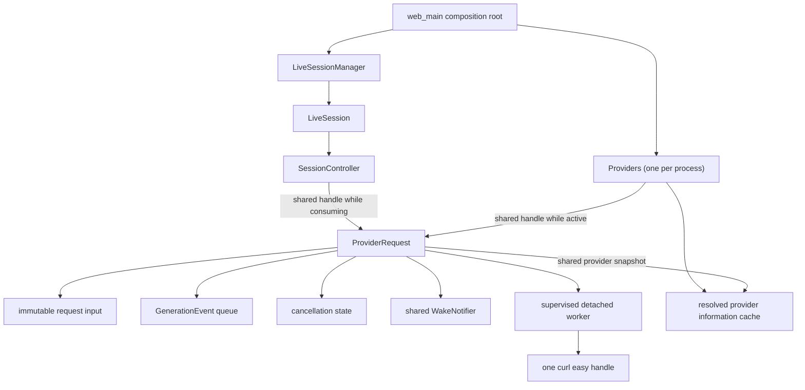

# Design: request-owned provider execution

## Status

This document describes the planned provider-execution redesign. It replaces
the previous global-worker-pool proposal; it is not a description of the
current implementation.

The design deliberately favors direct ownership over scheduling machinery.
CHA is a small personal application. One provider request is one independent
asynchronous operation, and the code should represent it that way.

## Summary

CHA will have one process-owned `Providers` instance. Its primary operation is
`make_request()`. The call creates and immediately starts a `ProviderRequest`,
then returns a shared handle to it.

Every active request owns all of its execution state:

- an immutable snapshot of its character and generation input;
- a shared snapshot of the transcript history;
- one supervised detached worker thread;
- one curl easy handle, created and destroyed by that worker;
- one private queue of `GenerationEvent` values;
- its cancellation and terminal state;
- a shared wake signal for the session owner.

`Providers` keeps a shared pointer to each request while its worker is active.
The session keeps another shared pointer while it consumes the request's
events. When the worker has released its transport resources, `Providers`
removes its pointer. When the session has consumed or abandoned the request, it
removes its pointer. The request is destroyed after both sides are finished
with it.

There is no generation worker pool, task queue, start gate, client lease, or
process-wide concurrency limit. Every runnable request starts one thread
immediately. A normal prompt creates one request. `/mcast` creates one
independent request per target.

`Providers` caches only provider information: resolved credentials, protocol
settings, and a successfully discovered model. It never caches a curl handle,
request queue, prompt, transcript, generated output, or session object.

`Providers` is a singleton by process ownership, not a global service locator.
It is constructed in the composition root and passed explicitly to session
construction.

## Why this division is simpler

The asynchronous unit in the application is a provider request. Its thread,
curl handle, cancellation flag, and output queue all have the same lifetime and
belong together.

Putting those resources behind a session executor or a global scheduler splits
one operation across several owners. It then requires additional machinery to
answer questions that a self-contained request answers directly:

- whether a task has been submitted or claimed;
- whether a queued closure can still touch a destroyed session;
- which client is leased to which execution;
- whether a session must wait for unrelated work ahead of it;
- how staged work is prevented from occupying a worker;
- how a shared pool is drained without retaining session dependencies.

The request-owned design removes those questions. A request has no session
pointer and borrows no mutable session state. Once constructed, it can finish
or be cancelled even if the session that created it has already been
destroyed.

## Goals

1. Make provider execution independent of session lifetime.
2. Keep the provider API centered on one operation, `make_request()`.
3. Allocate threads and curl handles only for active provider requests.
4. Keep every request's input, output, cancellation, and transport isolated.
5. Let normal and multicast generation use the same request type.
6. Preserve streaming and deterministic multicast presentation.
7. Let session teardown cancel and release provider work without waiting.
8. Reuse resolved provider information without introducing client leasing.
9. Keep workspace reloads safe for requests already in progress.
10. Make process shutdown supervise all detached request workers.

## Non-goals

This change does not introduce:

- a generation thread pool;
- a global provider task queue;
- a process-wide request limit;
- fairness, priorities, or rate limiting;
- reusable curl easy handles or connection leasing;
- curl multi;
- batch dispatch atomicity;
- session-open provider discovery or reachability checks;
- a new retry policy;
- request deduplication or shared generated output;
- a separate provider service;
- persistent provider caches across process restarts.

If observed usage later demonstrates that unbounded active-request concurrency
or new curl handles are a real problem, those problems can be addressed then.
They should not shape this implementation preemptively.

## Target ownership



The session owns conversation behavior. It does not own provider-execution
resources. Specifically, the session continues to own:

- transcript and journal state;
- character and persona selection;
- prompt construction and request ordering;
- the ordered vector of request handles for the current generation;
- persistence and presentation of streamed output;
- the decision to cancel its requests.

The ordered vector may be wrapped in a small session-local type, but that type
is not an executor. It owns no thread, curl handle, queue, provider client, or
waitable task.

## Request input boundary

No worker may retain the current `TranscriptView`. It is a call-scoped,
non-owning view whose spans and strings may be invalidated by the next
transcript mutation.

Before any request thread is launched, the session synchronously creates one
owning immutable model-history snapshot. A multicast creates this snapshot
once and shares it among all target requests:

```cpp
using SharedModelHistory = std::shared_ptr<const ModelHistory>;
```

The snapshot operation copies every transcript value needed for model-context
projection, including the open-entry and off-record state. No worker reads the
live transcript.

The complete request input is an owning value. Its intended shape is:

```cpp
struct ProviderSelection {
  std::string id;
  ModelBackendConfig config;
};

struct ProviderRequestInput {
  std::shared_ptr<const CharacterDefinition> character;
  SharedModelHistory history;
  RunSpec run;
};
```

The exact names may change during implementation. The important properties
are:

- `character` snapshots identity, the system prompt, and its exact
  `ProviderSelection`;
- `history` owns the pre-request conversation projection;
- `run` owns the request ID, author, target, prompt, cache key, and timestamp.

`CharacterDefinition` should retain its provider identifier together with its
resolved backend configuration. A bare provider ID is useful to callers and
logs, but the request must retain the resolved configuration snapshot so that
a reload cannot change work already in progress.

## Public interface

The provider execution interface should remain small:

```cpp
class ProviderRequest {
 public:
  const RunSpec& run() const noexcept;

  ChannelReadStatus try_receive(GenerationEvent& event);
  void cancel() noexcept;
};

class Providers {
 public:
  Providers(ProviderClientFactory client_factory = {});
  ~Providers();

  Providers(const Providers&) = delete;
  Providers& operator=(const Providers&) = delete;

  std::shared_ptr<ProviderRequest> make_request(
      ProviderRequestInput input,
      std::shared_ptr<WakeNotifier> notifier);

  ProviderRuntimeInfo cached_info(
      const ProviderSelection& selection) const;

  void shutdown() noexcept;
};
```

`make_request()` is the only operation that starts provider work. It copies or
takes ownership of everything the worker needs, registers the request, starts
its thread immediately, and returns its handle.

`cached_info()` is a non-networking observation, not another execution path.
It reports configured information and a discovered model when one is already
cached. Before discovery, an automatically selected model is reported as
unknown. Session opening never waits for this value to become known.

The injected client factory exists for focused tests. It should not grow into a
general execution framework.

## `ProviderRequest`

### Owned state

A request owns:

- its `ProviderRequestInput`;
- a shared reference to the matching cached provider information;
- its event queue;
- its atomic cancellation flag;
- enough terminal state to guarantee exactly one terminal event;
- its shared wake notifier;
- request-local response decoding and error state;
- its curl easy handle while its worker is using it.

A request never contains:

- a `SessionController`, `LiveSession`, forum, or journal pointer;
- a borrowed transcript or character reference;
- a borrowed notifier reference;
- another request's events or cancellation state.

### Immediate start

`make_request()` does not stage work. It registers the new request and launches
its worker before returning. There is no scheduler and no state in which a
runnable request waits in a process queue.

The worker first checks cancellation, resolves any provider information still
needed, constructs one curl easy handle, prepares the request, and performs the
HTTP operation. It publishes streaming deltas to its queue and closes the queue
with exactly one completed, cancelled, or failed terminal event.

If thread creation itself fails, `make_request()` returns the request already
closed with a failure event. This is the exceptional case in which a request
cannot have a worker. Other multicast requests are unaffected.

Programmer errors such as a missing history snapshot remain exceptions.
Ordinary provider, credential, discovery, thread-start, transport, and protocol
failures are request terminal events.

### Output queue and wakeups

Every request has one `ConcurrentQueue<GenerationEvent>`. There is no process
output queue and no session-owned provider queue. Request identifiers remain
useful for persistence and diagnostics, but they are not used to separate
interleaved output because output is already isolated by ownership.

After adding an event, the request calls its shared `WakeNotifier`. The request
owns a `shared_ptr`, not a reference. If the session has already disappeared,
the signal object simply lives until the request releases it; waking it touches
no destroyed session state.

The queue remains readable after provider execution finishes. This is why the
session's shared request handle may outlive the handle in `Providers`.

### Cancellation

`cancel()` only sets the request's atomic cancellation flag and wakes anything
inside the request that needs to recheck it. It is idempotent and non-blocking.

- A worker that has not started provider work reports cancellation without
  creating a network request.
- A worker resolving provider information stops as soon as that operation can
  safely observe cancellation.
- A running curl transfer observes the flag through its progress callback.
- Cancellation never publishes a second terminal event after completion won
  the race.

There is no queued-request cancellation state. Once `make_request()` succeeds,
the worker belongs only to that request and can always make progress toward its
own terminal state.

### Supervised detached worker

The request logically owns one worker, but it must not store a joinable
`std::thread` that can be destroyed by that same worker. Doing so would allow
the last shared pointer to run the request destructor on the worker thread and
attempt to join itself.

Instead, the launched thread is detached and captures shared request state plus
a shared internal provider-registry state. The registry gives the detached
worker process-level supervision:

1. `make_request()` inserts a strong request pointer into the active registry
   before launching the thread.
2. The worker catches every exception and publishes exactly one terminal event.
3. The worker destroys its curl handle and releases all transport callbacks.
4. As its final provider-facing action, it removes the request from the active
   registry and notifies shutdown waiters.
5. The detached closure retains the request through its final return, so
   registry removal cannot destroy state still in use by that closure.

The worker captures the shared internal registry state, not a raw `Providers*`.
Consequently, the small registry object remains alive long enough for the
worker's final completion action even while the outer `Providers` object is
shutting down.

The active-registry removal point means provider I/O is quiescent: the curl
handle is already destroyed, no more events will be published, and the worker
will touch no process or session object after unregistering.

This is a supervised detached thread, not an abandoned thread. Process shutdown
waits for every active registry entry to reach this quiescent point.

## Provider-information cache

`Providers` keeps a small collection of cached provider states. The cache key
is the exact provider selection:

```text
(provider id, resolved ModelBackendConfig)
```

The configuration remains part of the key because an identifier can retain the
same name while its endpoint, model, credentials, or protocol changes during a
workspace reload.

One cached state may contain only provider-level information:

- the provider ID and exact resolved configuration;
- the resolved API key or other credential material;
- the configured protocol and endpoint information;
- the configured model, or one successfully discovered model;
- the small synchronization needed for first resolution and discovery.

It never contains:

- a curl easy handle or reusable `ProviderClient`;
- a worker thread or task;
- transcript history, prompts, or generated text;
- an event queue, notifier, or cancellation flag;
- a session, controller, forum, or journal pointer.

The number of configured providers is small, so a locked linear collection is
adequate. `ModelBackendConfig` needs exact equality. Its secret fields may be
compared but must never be logged.

### Lazy resolution and discovery

Session opening performs no provider network work. It validates workspace
configuration syntax and builds character definitions, but it does not resolve
an automatic model or test provider reachability.

The first request for a provider performs any remaining credential resolution
and model discovery on its own worker. A successful result is stored in the
provider-information cache. Later requests reuse that information but create
their own curl handles.

Concurrent first requests for the same provider coordinate only provider
information initialization. At most one of them performs a particular
discovery at a time; the others wait in their own request threads. A discovery
failure is reported to the request that encountered it and is not cached as a
permanent failure. A later request may retry.

Waiting for shared discovery does not occupy any scarce application worker:
each waiting thread belongs to the request that needs the result. Discovery has
its existing bounded network timeout.

The curl handle used for discovery belongs to the discovering request. It may
be reused for that same request's generation call, but it is destroyed when
the request finishes and is never returned to `Providers`.

## Concurrency model

Every runnable provider request immediately creates one operating-system
thread. There is no process-wide concurrency bound.

This makes resource use proportional to active inference rather than to open
sessions or configured characters. It also gives every multicast target and
every session an independent path to its provider; unrelated slow requests
cannot hold a shared worker needed by another session.

The maximum concurrency is therefore the sum of active normal and multicast
requests across admitted sessions. A very wide multicast can create many
threads and curl handles. This is an explicit tradeoff. CHA does not add a
pool, semaphore, task queue, or rejection limit until actual use shows that one
is needed.

Thread creation and curl-handle creation add per-request overhead, and destroying
the handle gives up connection reuse between requests. For slow inference calls
that cost is expected to be small compared with the reduction in idle resources
and scheduling machinery. This assumption should be measured before adding a
reuse mechanism.

## Session interaction

### Durable state before immediate start

Because `make_request()` starts provider work immediately, the controller calls
it only after it has committed the durable foreground state that will receive
the generation.

There is no need to construct an inert execution before that commit. Provider
configuration has already been syntactically validated during workspace load.
Any failure that happens after the durable turn begins is represented as that
turn's generation failure.

This deliberately removes dispatch failure atomicity. Durable state is not
rolled back merely because a thread, credential, discovery call, or provider
failed to start. Such a failure is a normal failed generation and is persisted
through the same terminal-event path as a transport error.

### Normal generation

For a normal prompt:

1. The controller resolves the target character and creates an immutable
   history snapshot.
2. It builds the owning request input and commits the prompt turn.
3. It calls `Providers::make_request()`.
4. The returned handle becomes the only active request in the session's ordered
   request list.
5. The request worker streams events into its private queue and wakes the
   session owner.
6. The controller consumes and persists the events as it does today.
7. After consuming the terminal event, the controller releases its handle.

### Multicast generation

For `/mcast`:

1. The controller creates one immutable pre-multicast history snapshot.
2. It builds an ordered request input for every target using that same shared
   snapshot.
3. It activates and durably records the first foreground target.
4. It independently calls `make_request()` for every target. Every successful
   call immediately starts one thread.
5. A target that cannot start receives its own failed request. Other targets
   continue normally; multicast dispatch is not failure-atomic.
6. Each request buffers only its own events.
7. The controller drains, presents, and persists the request handles in target
   order. Before draining a later target, it activates that target's durable
   turn as it does today.
8. After each terminal event is consumed, the session releases that request
   handle.

Later targets may finish before they become foreground. Their results remain
in their own in-memory queues. This preserves one shared history snapshot and
deterministic presentation without making the provider layer understand a
batch.

The first target may begin slightly before the last target's thread is created.
The design promises independent concurrent execution, not simultaneous thread
start.

## Stop and session destruction

`/stop` and session destruction have different responsibilities.

### `/stop`

`/stop` calls `cancel()` on every unfinished request but retains the ordered
handles. The live session continues consuming terminal events so it can persist
and present cancellation through the normal path. The command remains
non-blocking; completion arrives through request queues and wakeups.

### Session destruction

Session destruction must not wait for provider I/O.

The controller:

1. calls `cancel()` on every unfinished request;
2. synchronously closes any currently durable turn as cancelled;
3. releases all request handles;
4. destroys its transcript, journal, controller, and session objects normally.

An active request remains alive through the shared pointer in `Providers` and
the detached worker closure. Its shared wake signal may also outlive the
session, but contains no session pointer and is harmless to wake. After curl
observes cancellation and the worker reaches its terminal path, `Providers`
removes its active pointer and the request is destroyed if no consumer remains.

This lets a session release its journal and lease promptly. Provider cleanup is
a process-owned concern rather than a session teardown dependency.

## Workspace reload

Provider and character configuration use snapshot semantics:

- Every request owns the exact character and provider selection used when it
  was created.
- File changes do not mutate a running request.
- New character definitions use the newly resolved provider configuration.
- An unchanged `(provider id, config)` pair reuses cached credentials and a
  discovered model.
- A changed configuration creates a distinct cached provider state.
- Old requests continue using their old state until they finish.

The cache does not need an explicit flush. Old cached information is small and
contains no curl handle or generated content. A simple later cleanup of
unreferenced obsolete states may be added if repeated reloads make it useful;
it is not required for correctness.

## Process shutdown

The composition root constructs `Providers` before live sessions, so it
outlives every session that can call `make_request()`.

Shutdown order is:

1. Stop accepting new HTTP work.
2. Ask `LiveSessionManager` to destroy all sessions.
3. Each session cancels and releases its request handles without waiting.
4. Join all session owner threads and destroy their controllers and wake-signal
   owners. Request-held shared wake signals may remain alive.
5. Call `Providers::shutdown()`.
6. `Providers` closes admission, cancels every active request, and waits until
   the active registry is empty.
7. Every request unregisters only after its curl handle and provider callbacks
   are gone, so cached provider information can then be destroyed safely.
8. Shut down logging.

`Providers::shutdown()` is idempotent. Its destructor calls it as a fallback,
but the composition root calls it explicitly to make the order visible.

`make_request()` after shutdown is rejected without launching a thread.
Ordinary application flow prevents this by stopping HTTP work and sessions
first.

Curl global initialization remains a function-local static. A request destroys
its easy handle before it leaves the active registry, and shutdown waits for
the registry to empty before `main` returns. Curl global cleanup therefore
still occurs after every request transport has been released.

## Error handling

Provider errors belong to individual requests:

- invalid request input caused by a programmer error throws before registration;
- missing credentials become a failed request event;
- model-discovery failure becomes a failed request event and is not permanently
  cached;
- thread-start failure closes that request with a failure event;
- transport and protocol failures close only that request's queue;
- cancellation closes only that request's queue;
- one multicast target's failure does not cancel or prevent another target;
- exceptions never escape a detached worker;
- exactly one terminal event is observable for every returned request.

Failures after a durable prompt has been recorded are persisted as generation
failures. The design does not attempt to roll back or atomically dispatch a
multicast.

Allocation failure remains process-fatal where the current application treats
it as unrecoverable. The design does not add elaborate recovery for an
inability to allocate the request object or its terminal event.

## Diagnostics

Useful request and provider log fields are:

- provider identifier;
- the existing session and request identifiers;
- an internal process request token used only to track the active registry;
- provider-information cache hit or miss;
- configured versus discovered model;
- request thread started, cancelled, completed, and unregistered;
- current active-request count;
- provider and total request duration.

Logs must not include:

- API keys or authorization headers;
- complete provider configurations containing secrets;
- system prompts, transcript content, user prompts, or response bodies.

There are no queued/running scheduler transitions or client-lease events to
log because those concepts do not exist.

## Expected code changes

### Provider layer

- Add the process-owned `Providers` component and `ProviderRequest` handle.
- Move generation thread, cancellation, curl lifetime, event queue, and
  terminal publication into the request implementation.
- Refactor `ProviderClient` into a per-request transport created on the request
  worker. It must not retain session state or survive for reuse.
- Add the small provider-information cache for resolved credentials and model
  discovery.
- Retain an injectable client factory for request-level tests.

### Character and request input

- Preserve the provider ID with the resolved `ModelBackendConfig` in
  `CharacterDefinition`.
- Give `ModelBackendConfig` exact equality for provider-cache lookup.
- Preserve one synchronous immutable model-history copy per normal request or
  multicast, shared among multicast targets.

### Session layer

- Inject `Providers&` into `SessionController` construction.
- Replace `GenerationExecutor` and `GenerationBatch` ownership with a small
  ordered collection of `shared_ptr<ProviderRequest>` values and a foreground
  index.
- Retain all transcript, journal, ordering, and presentation behavior in the
  controller.
- Pass a shared wake signal rather than a borrowed notifier reference.
- Separate `/stop`, which drains cancellation events, from destruction, which
  cancels and releases without waiting.

### Deletions

After migration, remove:

- `GenerationExecutor` and its tests;
- the execution and start-gate implementation in `GenerationBatch`;
- the application generation `ThreadPool` and its tests if it has no remaining
  user;
- session-owned backend/client collections;
- documentation and build entries describing session or global generation
  pools.

The HTTP server's own library thread pool is unrelated and remains unchanged.

## Implementation sequence

The implementation should stay continuously testable:

1. Carry provider identity alongside resolved character configuration.
2. Add `ProviderRequest` with owned input, queue, cancellation, a shared wake
   signal, and a request-local transport.
3. Add `Providers` active-request supervision and provider-information caching.
4. Add lazy model discovery and cached runtime information.
5. Move normal session generation to one request handle.
6. Replace multicast batch execution with an ordered vector of independent
   request handles.
7. Make session destruction cancel and release without waiting.
8. Wire one `Providers` instance through the composition root and implement
   process shutdown.
9. Remove the old executor, batch execution machinery, generation thread pool,
   and obsolete tests.
10. Run the full suite and update ownership documentation.

Temporary adapters are acceptable between steps, but they should be removed
when their migration step is complete rather than preserved as forwarding
abstractions.

## Test plan

### Provider request tests

- `make_request()` starts a worker immediately;
- a request owns an immutable input snapshot and never reads a mutated
  transcript view;
- each request creates a distinct curl handle;
- streaming deltas and exactly one terminal event arrive through its queue;
- two requests never share an output queue or cancellation flag;
- cancelling before network work produces a cancelled terminal event;
- running cancellation reaches curl's progress callback;
- thread-start failure produces a failed request handle;
- all worker exceptions become failed terminal events;
- event publication safely wakes a shared notifier after the original session
  owner has released it;
- dropping the session handle while running does not destroy the request;
- dropping the final consumer handle after completion destroys the request;
- no curl handle or callback remains when the request unregisters.

### Providers tests

- `Providers` retains every active request and removes it after transport
  quiescence;
- repeated selections reuse resolved credentials and a discovered model;
- repeated requests never reuse a curl handle;
- the same provider ID with changed configuration uses a distinct state;
- model discovery happens lazily on the first request, not on session open;
- concurrent first requests coordinate discovery;
- failed discovery can be retried by a later request;
- `cached_info()` reports an unknown automatic model before discovery and the
  resolved model afterward;
- there is no concurrency limit: all requested workers may start;
- shutdown rejects new work, cancels active work, and waits for the active
  registry to empty;
- a detached worker can finish safely after its creating session is destroyed.

### Session tests

- opening a session performs no provider network request and succeeds when the
  provider is temporarily unreachable;
- a normal prompt persists its durable start before calling `make_request()`;
- normal streaming and terminal persistence are unchanged;
- `/mcast` targets share one history snapshot;
- every multicast target starts independently;
- failure to start one target does not prevent another from running;
- completion order may differ while presentation remains target-ordered;
- later target events remain isolated until that target becomes foreground;
- one target failure does not mix with or discard another target's output;
- `/stop` cancels every request and retains handles until terminal events are
  persisted;
- session destruction cancels and releases requests without waiting for curl;
- a request wake after session destruction touches no destroyed object;
- two sessions share provider information but never request queues, curl
  handles, or generated output.

### Reload and process tests

- unchanged provider configuration reuses cached information after reload;
- changed configuration under the same provider ID affects only new requests;
- an in-flight request completes with its original character and provider
  snapshots;
- process shutdown destroys sessions before closing provider admission;
- provider shutdown waits for every request transport to unregister;
- every curl easy handle is destroyed before curl global cleanup.

## Acceptance criteria

The redesign is complete when all of these invariants hold:

1. No session or session controller owns a generation thread, curl handle,
   provider client, or generation event queue.
2. Every runnable provider request starts one thread immediately.
3. There is no generation worker pool, process task queue, or concurrency cap.
4. Every request owns one curl easy handle while running and never shares it.
5. Every request has an isolated queue and exactly one terminal event.
6. No worker reads a live `TranscriptView` or other mutable session state.
7. A request borrows no session object; its wake signal is shared-owned.
8. `Providers` retains active requests until their transport resources are
   quiescent.
9. Session destruction cancels and releases requests without waiting.
10. `/stop` retains and drains requests so cancellation remains durable and
    visible.
11. Multicast targets share one immutable history snapshot and remain
    presentation-ordered despite independent execution.
12. Failure to start or execute one multicast target does not prevent another
    target from running.
13. Session opening performs no provider network discovery.
14. The provider cache contains only provider information, never curl handles
    or request/session content.
15. Reloaded configuration does not mutate work already in progress.
16. Process shutdown cancels and supervises every detached worker through
    transport quiescence.
17. Secrets and prompt or response content are never written to scheduler or
    cache diagnostics.

## Deferred decisions

The following are intentionally deferred until observed behavior justifies
them:

- an active-request limit;
- a provider or process semaphore;
- thread pooling;
- reusable curl handles or another connection cache;
- provider-specific concurrency and rate limits;
- priorities or fairness between sessions;
- bounded response queues and backpressure;
- proactive provider warm-up;
- eviction of obsolete provider-information states.

Adding one of these later must preserve the central ownership rule: a
`ProviderRequest` remains a self-contained operation, and no provider worker
may borrow session state.
