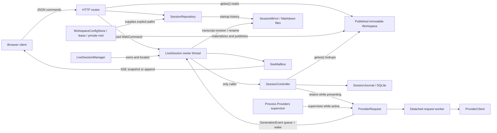

# Learning the CHA C++ codebase

This guide is a systematic route through CHA's native C++ code. Its purpose is
not merely to list files, but to build a working mental model: which objects
exist, who owns them, which thread may touch them, when data becomes durable,
and how one browser prompt turns into streamed model output.

The guide focuses on the native implementation. The browser under `webapp/`
appears mainly at the protocol boundary, plus one short presentation section
covering transcript filtering and composer behavior.

## 1. How to use this guide

Read the code in passes. Do not try to understand every implementation detail
on the first pass.

1. Read sections 2–5 to learn the vocabulary, dependency direction, startup,
   and ownership model.
2. Follow the focused reading path in sections 6–12. Keep the source open and
   find each named type or function as it appears here.
3. Trace the complete workflows in section 13 without diving into helpers.
4. Use sections 14–18 to consolidate concurrency, persistence, failure, and
   shutdown behavior.
5. Complete the exercises in section 21. If you can explain each answer in
   terms of concrete objects and transitions, you understand the architecture
   well enough to change it deliberately.

The subsystem `README.md` files are reference manuals. This document connects
them into a learning sequence:

- [Native architecture](../src/README.md)
- [Utility contracts](../src/util/README.md)
- [Chat model](../src/chat/README.md)
- [Character definitions and model context](../src/characters/README.md)
- [Provider execution](../src/providers/README.md)
- [Session layer](../src/session/README.md)
- [Workspace composition](../src/workspace/README.md)
- [Web runtime](../src/web/README.md)

When this tutorial and a subsystem reference differ, inspect the current
headers and tests. They are the executable contract.

## 2. The application in one page

CHA is a C++20 web server for conversations with OpenAI-compatible model
servers. The executable is `chaweb`. It serves a browser shell, exposes a JSON
HTTP API, and streams session changes with server-sent events (SSE).

The most useful high-level model is:

- The process-owned `WorkspaceConfigStore` holds the selected database lease,
  secures the database and sidecars, materializes committed configuration into
  one private root, and atomically publishes the immutable `Workspace`.
- The independent process-owned `SessionRepository` receives explicit database,
  materialized-workspace, and Welcome paths. It owns none of those outer
  resources and lists, creates, validates, archives, and restores sessions.
- When the external config sets `mirror`, the process-owned `SessionMirror`
  projects persistent sessions into continuously refreshed Markdown files.
- `LiveSessionManager` owns the process's live-session registry.
- One `LiveSession` is an actor with one permanent owner thread for one open
  session.
- One `SessionController` owns the live transcript, persistence journal, and
  ordered generation state for that session.
- The process-owned `Providers` supervisor starts one independent request
  worker per target. The controller exposes their events in deterministic
  foreground order.
- `ProviderClient` owns provider HTTP mechanics. The Chat Completions and
  Responses API modules own their request encoding and response decoding
  without knowing about curl or HTTP.
- `SseMailbox` transfers presentation updates from the session owner thread to
  the HTTP thread writing the browser's event stream.



There are four kinds of long-lived information:

- Process configuration — the database path, optional Markdown mirror, web
  listener, and diagnostic log settings — lives in one external TOML file.
  `chaweb` reads it before opening the database; it is never materialized into
  the workspace or stored in SQLite.

- Discovery — the roster, descriptions, and Markdown the browser lists — is
  materialized from committed database rows, read once per `Workspace`,
  validated as a whole, and shared immutably until a narrow committed mutation
  publishes a replacement or the process restarts after offline import.
- Sessions read eagerly owned configuration from the published `Workspace`;
  neither the import source nor an export directory is consulted at runtime.
- Conversation state is dynamic. A live controller owns an in-memory view and
  writes durable turn transitions into its own rows of the one workspace
  session database.

This split explains why creating a session appears immediately while an
operator's configuration edit requires stop/export/edit/import/restart.

## 3. Build graph and dependency direction

Start with [CMakeLists.txt](../CMakeLists.txt). The native build has three
important production targets:

| Target | Role |
| --- | --- |
| `cha_core` | `util`, `chat`, `characters`, `providers`, `session`, and `workspace` |
| `cha_web` | HTTP, SSE, actor runtime, routing, and protocol; links `cha_core` |
| `chaweb_app` | Small composition root in `src/web_main.cpp`; links `cha_web` |

The executable file is named `chaweb` even though the CMake target is
`chaweb_app`.

The intended dependency direction is:

```text
chaweb_app -> cha_web -> cha_core

workspace -> session -> providers -> characters -> chat
                \-----------> characters

util is used where needed without depending on the domain layers.
```

That diagram is intentionally approximate inside `cha_core`; the important
rules are simpler:

- `chat` contains presentation-neutral domain vocabulary.
- `util` contains domain-neutral mechanisms.
- `characters` owns character configuration and model-context projection.
- `providers` owns request execution, provider transport, and protocol
  decoding, but not sessions or HTTP routing.
- `session` coordinates transcripts, persistence, and generation, but not web
  routes.
- `workspace` loads the workspace and wires a session from workspace data.
- `web` adapts HTTP/SSE to the workspace and session APIs.
- Only `web_main.cpp` assembles the complete process.

If a proposed change makes `chat` include a web header, or makes `session`
depend on `httplib`, it is crossing an important boundary.

### Build and test commands

```sh
cmake --preset ninja
cmake --build --preset ninja
ctest --test-dir build/ninja -j8 --output-on-failure
```

There are also `asan-ubsan` and `tsan` CMake presets. Browser checks and the
credential-dependent provider integration test are separate from the core C++
unit suite; see the root [README](../README.md).

Run the complete browser checks from `webapp/`:

```sh
npm run check
npm run build
```

The current native build requires OpenSSL on every platform because prompt-cache
keys use its SHA-256 implementation, independently of curl's TLS backend.

## 4. Repository map

| Location | What to learn there |
| --- | --- |
| [src/web_main.cpp](../src/web_main.cpp) | Process composition and destruction order |
| [src/chat](../src/chat) | IDs, personas, character metadata, transcript vocabulary |
| [src/util](../src/util) | Queues, template expansion, logging, path/text helpers |
| [src/characters](../src/characters) | Character configuration, definitions, and model context |
| [src/providers](../src/providers) | Request workers, provider transport, and response decoding |
| [src/session](../src/session) | Controller, transcript orchestration, workspace session database, journal, lease, repository |
| [src/workspace](../src/workspace) | Configuration store, workspace loading, built-ins, and session construction |
| [src/web](../src/web) | Native protocol, routes, actor, Markdown mirror, mailbox, lifecycle, shutdown |
| [webapp/src](../webapp/src) | Browser state, transcript presentation, composer, and API client |
| [tests](../tests) | Behavioral examples grouped by the same subsystem boundaries |
| [packaging/linux/cha.toml.example](../packaging/linux/cha.toml.example) | External process-configuration example |
| [packaging/linux/import-seed](../packaging/linux/import-seed) | A configuration source tree to compare against the loaders and import filter |

Headers in this project are unusually valuable: most ownership and thread
contracts are written next to the types. Read a subsystem's public headers
before its `.cpp` files.

## 5. The four concepts that unlock the code

### 5.1 Stable identity is not display text

`ForumId`, `CharacterId`, and `SessionId` are string aliases declared in
[chat/ids.h](../src/chat/ids.h). A participant also has a stable ID and a
display name. IDs are used for storage, URLs, lookup, and model attribution;
display names are used in the interface and prompt text.

The code deliberately stores both. Renaming a display label should not silently
change the identity of old entries. When reading a field named `character_id`,
`participant_id`, or `addressed_to`, do not mentally replace it with the visible
name beside it.

### 5.2 There is one mutable owner per live session

The core session model is not generally thread-safe, and it does not need to
be. `LiveSession::owner_main()` is the sole caller of its `SessionController`.
HTTP workers enqueue commands; generation workers enqueue events; the owner
thread drains both and performs all mutations.

This is actor-style confinement implemented with ordinary C++ objects, a
thread, queues, and wakeups—not an actor framework.

### 5.3 Workers receive copies, views stay local

`TranscriptView` and `ControllerView` borrow owner-thread storage and are valid
only for immediate synchronous projection. In contrast, `ModelHistory` owns a
point-in-time copy and can be shared immutably with generation workers.

The distinction prevents two common errors:

- retaining a `std::span` into a transcript that will mutate;
- allowing a worker to observe a transcript halfway through a state change.

### 5.4 State is published as a snapshot unless append safety is proven

A controller update is either no state change, a required full snapshot, or a
text append to a precise entry/reasoning target. The append is an optimization,
not an alternate source of truth. If the actor or mailbox cannot prove that the
browser has the correct base and target, it publishes a new snapshot.

This lets the mutable controller remain authoritative while keeping token
streaming efficient.

## 6. First reading pass: domain vocabulary

Begin with [chat/ids.h](../src/chat/ids.h),
[chat/persona.h](../src/chat/persona.h), and
[chat/character.h](../src/chat/character.h).

The important split in character data is:

- `CharacterMetadata` is public, discovery-safe information: ID, display name,
  description, tags, and appearance.
- `CharacterDefinition`, declared in
  [characters/character.h](../src/characters/character.h), combines public metadata with
  private backend configuration and a completed system prompt.

Routes may expose metadata. They must not expose the full definition, which can
contain provider configuration and private prompt material.

### 6.1 The transcript is the shared conversation language

Read [chat/transcript.h](../src/chat/transcript.h) completely before
[chat/transcript.cpp](../src/chat/transcript.cpp).

`TranscriptEntry` is used by rendering, persistence, and model-context
projection. Its fields answer different questions:

| Field | Meaning |
| --- | --- |
| `id` | Monotonically increasing entry identity within the session |
| `kind` | Human, character, notice, or error semantics |
| `participant_id` / `display_name` | Who authored the entry |
| `addressed_to` / `addressed_to_name` | Target of a human prompt |
| `text` | Visible content |
| `status` | Complete, streaming, cancelled, or failed |
| `request_id` | Turn/generation correlation when applicable |

The `Transcript` class enforces several central invariants:

- Entry IDs increase strictly.
- At most one character entry is open for streaming.
- Human and notice entries are immediately complete.
- A completed or cancelled character entry has answer text.
- An error entry has failed status.
- A live streaming entry cannot be stored as a terminal record.

The factory functions (`make_human_entry`, `make_character_entry`, and so on)
make valid intent visible at call sites. Validation still exists at boundaries;
factories are not a reason to trust arbitrary loaded data.

### 6.2 Revision, history epoch, and cover state

Three transcript concepts are easy to conflate:

- `revision` changes on presentation mutations.
- `history_epoch` changes when the visible logical history is replaced or
  cleared.
- `covered_until` is an optional entry-ID boundary; earlier entries are omitted
  from model context.

`/cover` adds a transient marker and moves the boundary to the current point,
so the conversation through the immediately preceding message is omitted from
later model requests. Calling it again moves the boundary forward. `/uncover`
adds its own marker and clears the boundary, restoring the full conversation to
model context. The markers and boundary are not durable session history.
`/clear` does not delete old SQLite rows; it advances the durable history epoch
so restoration selects only the current epoch.

Checkpoint: explain why `Transcript::model_history()` returns an owning value
while `Transcript::view()` returns a borrowed span.

## 7. Second reading pass: utility mechanisms

Read utilities as mechanisms with specific shutdown contracts, not as a bag of
helpers.

### 7.1 `ConcurrentQueue<T>`

[util/concurrent_queue.h](../src/util/concurrent_queue.h) is used for generation
events. Closing the queue stops new values but preserves accepted values for
draining. `close_with()` installs one final terminal value. That terminal
guarantee is how each generation execution reports exactly one completion,
cancellation, or failure even on its exception path.

### 7.2 `WakeNotifier`

[util/wake_notifier.h](../src/util/wake_notifier.h) is the tiny seam by which a
generation worker tells the session actor, “new events may be available.” The
web implementation is `OwnerWakeSignal`. Waking does not carry state; queues
remain the source of work.

### 7.3 Configuration helpers

The other utilities support important boundaries:

- `environment.*` parses `.env`, preserves inherited values (including empty
  ones), and supports import's temporary overlay of absent values.
- `path_name.*` and `utf8_path.*` keep filesystem and URL identifiers explicit.
- `public_name.*` centralizes visible-name validation.
- `text_template.*` expands `$$(relative/file)` includes and `$${variable}`
  substitutions with containment and cycle/resource limits.
- `logging.*` owns the process logging lifetime.

Checkpoint: locate one caller of each utility and state whether it is a domain
policy or a reusable mechanism.

### 7.4 Public process modes

The public command parser accepts exactly these customer-facing forms:

```text
chaweb --config=CONFIG [--root PATH]
chaweb --config=CONFIG --import DIRECTORY
chaweb --config=CONFIG --export DIRECTORY
chaweb --config=CONFIG --upload
chaweb --config=CONFIG --download
```

Every mode requires the external unified config. The parser accepts both
`--config=CONFIG` and `--config CONFIG`; `--root` is a runtime-only
application-asset root. The four offline modes are mutually exclusive. Upload
and download use the R2 bucket URL and S3 credentials from
`CHA_R2_URL`, `CHA_R2_ACCESS_KEY_ID`, and
`CHA_R2_SECRET_ACCESS_KEY`; the configured database filename becomes the object
key.

The Linux package includes `start-cha.sh`, which supplies `--root`, starts
`chaweb` in the background, and uses `../cha.toml` by default. A nonempty
`CHA_CONFIG` overrides that default for the launcher only; the executable
itself still requires `--config`. Absolute override paths are used directly,
while relative paths resolve from the directory containing `start-cha.sh`:

```sh
CHA_CONFIG=/etc/cha/cha.toml ./start-cha.sh
```

The TOML shape is:

```toml
data = "/var/lib/cha/workspace.sqlite3"
mirror = "/home/user/cha-mirror"

[web]
host = "0.0.0.0"
port = 8086

[logging]
file = "logs/cha.log"
level = "info"
```

`mirror` is optional; omitting it disables filesystem mirroring. Relative
`data`, `mirror`, and `logging.file` values resolve from the external config's
directory. The mirror root must already exist and be a directory. Import
additionally requires that file to be outside the source workspace, preventing
the process config itself from becoming an imported metadata row. Import and
export acquire the same non-blocking database lease as runtime, so they are
deliberately offline.

A new database is created only after a source has been collected and validated
successfully. Normal runtime and export require schema v2. Schema v1 is the
unified sessions-only database; only import can add the `config` table and
advance it to v2 while preserving session rows.

`.env` is one of the durable database rows. The database, journal/WAL/SHM
sidecars, lock, private root, and exported `.env` use owner-only access (POSIX
`0600` files and `0700` private directories, with private Windows DACLs). A
unified database therefore needs secret-grade access and backup discipline.
There is no database backup command here, and copying a live WAL database
naively is unsafe.

Mirroring deliberately creates a second, plaintext representation of session
content outside SQLite. Mirrored Markdown files are written atomically with
owner-only access (`0600` on POSIX), and newly created forum directories are
private (`0700`), but CHA does not tighten the configured root or an existing
forum directory. The operator therefore chooses and secures that location.

## 8. Third reading pass: startup and the immutable workspace

Read [web_main.cpp](../src/web_main.cpp) once from top to bottom. It is the
composition root, so most lines construct or connect an owner.

Startup proceeds in this order:

1. `parse_application_command()` requires `--config`, validates top-level
   `data`, `[web]`, and `[logging]`, resolves relative paths from the external
   file's directory, and separates runtime from the two offline transfer modes.
2. `WorkspaceConfigStore::open()` acquires the database companion-file lease,
   rejects anything except valid schema v2, secures the database/sidecars, and
   enables WAL.
3. The store creates one private root with `workspace/` and `welcome/`,
   materializes every `config` row under `workspace/`, loads `.env` without
   overriding inherited values, and validates/publishes a complete `Workspace`.
4. File logging is initialized from the already parsed external settings, and
   the HTTP server later binds the configured `[web]` host and port. Neither
   setting belongs to `Workspace` or to a database row.
5. `SessionRepository` receives the store's explicit database, materialized,
   and Welcome paths, synchronizes configured forum IDs, and creates the
   process-local Welcome database. It does not own the lease or private root.
6. If `mirror` is configured, `SessionMirror` validates the existing root,
   creates any missing display-named forum directories, and writes every
   active persistent session through the existing Markdown formatter. Any
   failure here aborts startup; Entrance/Welcome is excluded.
7. The process-owned `Providers` supervisor is constructed.
8. `LiveSessionManager` is given an opener lambda that calls `open_session()`
   and installs the mirror callback on the resulting `OpenedSession`.
9. The HTTP server, asset handler, lobby routes, and session routes are
   installed.
10. The socket is bound, the server begins listening, and shutdown coordination
   waits for a process signal.
11. Shutdown stops new work and tears down live actors, then
    `Providers::shutdown()` waits for request workers before logging stops.

Step 5 depends on step 3: the repository reads the published `Workspace` to
decide which forum rows belong in the database. Local declaration order and
function scopes matter too: destructors run in reverse order, log users must be
destroyed before logging itself, and live sessions and the repository must be
destroyed before the configuration store releases its database handle, private
root, and lease.

### 8.1 What `Workspace::load()` builds

Read [workspace/workspace.h](../src/workspace/workspace.h), then the helpers and
`Workspace::load()` in
[workspace/workspace.cpp](../src/workspace/workspace.cpp).

The loader treats the workspace as one configuration unit. Production gives it
the private materialized directory as its physical root:

- It requires `characters/`, `forums/`, and `personas/` in the expected form.
- It validates character IDs and public-name uniqueness.
- It loads persona metadata and optional `PERSONA.md` prompts.
- It validates every forum's members, default character, and default persona,
  the last of which becomes the starting author for sessions in that forum.
- It validates every forum member's character, provider, and style references.
- It builds indexes and fully resolved forum-member prompt values.
- It adds the built-in Guest persona, Assistant character, and Entrance forum.

All forums are resolved when a workspace is loaded, including unused ones.
This turns an invalid member override or prompt into a deterministic load error
rather than a delayed failure when someone opens that forum.

The public methods expose information from one published workspace. Production
sessions keep their identity and runtime state, then query the current
workspace when they need forum, persona, character, provider, or style data.
Provider requests alone own the exact resolved input they are already running.
Normal readers use eagerly owned values and do not reopen materialized files
after load.

There is no copied forum-roster object. A candidate is simply a temporary
`Workspace`. Once fully loaded and durably committed, `loadws()` atomically
makes it current. Callers use one `getws()` result for the duration of an
operation, so references into that immutable snapshot remain valid even if a
narrow settings write publishes its replacement.

### 8.2 Database authority and publication

Read `getws()` and `loadws()` in
[workspace/workspace.cpp](../src/workspace/workspace.cpp). A caller holds the
returned `shared_ptr` while it reads references from the workspace.

The schema-v2 `config` table contains exactly `name` and `content`. Import
collects regular workspace `.toml` and `.md` files and optional root `.env`; it
follows no symlinks and stores no other types. Legacy root `app.toml` and
`workspace.toml` are explicitly excluded and prohibited as database config
names. The unified external config is also outside the import tree. A template
include must itself be stored, so `snippet.txt` is not available after
materialization while `snippet.md` can be. Import validates a byte-identical
private materialization before it commits the complete row set.

Normal runtime never reads the import or export directory. The only online
edits are character provider/style, forum default character, and forum default
persona. `WorkspaceConfigStore` serializes each one, edits its private tree,
loads a complete candidate, replaces all configuration rows in one SQLite
transaction, and publishes after commit. There is no generation, type, control,
or revision column. Other edits require stop, export to a missing or empty
directory, edit, import, and restart.

### 8.3 Provider selection

Every connection and model setting lives in
`system/providers/<id>/config.toml`. Each character selects exactly one of
those configs with `provider = "<id>"` in its own `character.toml`. Workspace,
forum-default, and member provider keys are ignored, so there is no provider
inheritance or override chain. The `[prompt]` scope still merges across the
character, forum-default, and member layers.

Read the provider loader in
[workspace/workspace.cpp](../src/workspace/workspace.cpp).
`WorkspaceProvider` stores the fully resolved `ModelBackendConfig` directly;
`Workspace::character_definition()` copies it into the request-owned value
passed to provider code.

### 8.4 Prompt construction

`Workspace::load()` combines:

- the character definition prompt;
- forum prompt/context;
- the forum's default persona and its `PERSONA.md` prompt;
- standard generated context;
- effective model backend settings.

`FORUM.md` has two audiences. It is the forum prompt above, and
`Workspace` also reads it verbatim and serves it through
`/api/v1/forums/{forum}` as the forum's description. Write it for readers as
well as for the characters. This differs from `CHARACTER.md`, which publishes
only its `<character_profile>` section: a forum publishes the whole file. The
raw template source is served, so `$${character.display_name}` and `$$(...)`
includes appear literally — a description belongs to the forum rather than to
any one member, so there is nothing to expand it against.

The built-in Assistant and Entrance data are assembled by `Workspace::load()`.
The generated workspace guide is combined with public workspace inventory
data. The Entrance/Welcome session is a normal session at the controller level;
its specialness is in how the application constructs and stores it.

Checkpoint: starting with `packaging/linux/import-seed/forums/stoics`, identify the files that
contribute to one member's final definition and the order in which values win.

## 9. Fourth reading pass: session storage and opening

Read these in order:

1. [chat/session_identity.h](../src/chat/session_identity.h)
2. [session/stored_session.h](../src/session/stored_session.h)
3. [session/workspace_session_database.h](../src/session/workspace_session_database.h)
4. [session/session_lease.h](../src/session/session_lease.h)
5. [session/session_storage_layout.h](../src/session/session_storage_layout.h)
6. [workspace/workspace_config_store.h](../src/workspace/workspace_config_store.h)
7. [session/session_database.h](../src/session/session_database.h)
8. [session/session_repository.h](../src/session/session_repository.h)
9. [workspace/session_open.cpp](../src/workspace/session_open.cpp)

Every persistent session lives in the SQLite file selected by the external
config's `data` setting, named `workspace.sqlite3` in these examples, beside
`workspace.sqlite3.cha-lock`. There is no per-session database file or lock.

### 9.1 Two identities: public pair and internal key

`(forum_id, session_id)` is the durable public identity. It appears in URLs,
protocol values, and `FullSessionId`. Session IDs are timestamp-derived and
unique only within a forum, so the database enforces
`UNIQUE (forum_key, session_id)` rather than uniqueness on `session_id` alone.

`session_key` is an internal SQLite integer. It never appears in a URL or a
protocol message, and every restore and journal statement is scoped by it.
Omitting `session_key` from a statement is a cross-session data isolation
defect, because request IDs and entry IDs are session-local and repeat across
sessions.

### 9.2 Observation versus authority

`StoredSession` is listing data: public identity, label, and an integer
`updated_at`. It reports what one query observed; it does not promise the
session can still be opened.

`PreparedSession` is authoritative for construction because it contains:

- validated identity and label;
- the selected database path;
- the resolved `session_key`;
- restored transcript/counter state.

`SessionRepository::prepare()` resolves the public identity to a `session_key`,
validates the database identity and that one session's contents, and restores
it inside a single read transaction. A persistent session selects the unified
database; Welcome selects its private temporary one. Preparation takes no
per-session operating-system lock: `LiveSessionManager` prevents two actors
from owning one identity inside the process, and the top-level store's database
lease excludes other processes.

### 9.3 One lease, and the cutover guard

`WorkspaceConfigStore` acquires `workspace.sqlite3.cha-lock` before opening the
database and holds it through normal runtime. Import and export acquire the same
lease for their full operation. Acquisition is non-blocking, so concurrent
runtime/import/export fails before database use. A
companion file is used rather than the database bytes because it exists before
the database is created, does not interfere with SQLite's own byte-range
locking, and stays stable while WAL sidecars come and go. An empty companion
left behind after exit is harmless; the held kernel lock, not the file, is what
means "busy".

Only import performs the permanent manual-cutover preflight, before it modifies
the target:

| `workspace.sqlite3` | Legacy `forums/*/sessions/*.sqlite3` | Import behavior |
| --- | --- | --- |
| Missing | Absent | Create v2 only after successful validation |
| Valid v1 | Absent | Upgrade to v2 and preserve every session |
| Valid v2 | Absent | Replace only the complete configuration rows |
| Missing | Present | Fail: the archived per-session migration build was never run |
| Present | Present | Fail: migration cleanup is incomplete |

For the normal schema-v1 cutover, first stop the running application and back
up both the database and metadata tree. Put the external configuration outside
that tree, point its `data` setting at the existing `workspace.sqlite3`, then
run the import and restart with the same configuration:

```console
$ chaweb --config=/srv/cha/cha.toml --import /srv/cha/workspace
$ chaweb --config=/srv/cha/cha.toml
```

The first command upgrades a valid v1 database in place, preserving its
sessions while importing the directory metadata. The second command is normal
server mode; it reads application settings from `cha.toml` and all workspace
content from SQLite. The metadata tree may remain as a backup, but runtime no
longer reads it.

`has_legacy_session_databases()` in
[session_storage_layout.cpp](../src/session/session_storage_layout.cpp) is a
permanent path-only scan for regular `.sqlite3` files directly under each
`forums/*/sessions/` and `forums/*/sessions/deleted/`. It never opens, reads,
imports, moves, or deletes one. This build contains no legacy reader: the first
message directs the operator to an archived migration-capable build, while the
second directs them to verify the unified database and finish cleanup.

### 9.4 Connections and transactions

The repository owns no SQLite connection. Every catalog or maintenance
operation opens a short-lived connection and closes it before returning, which
is why its methods stay `const` behind `shared_ptr<const SessionRepository>`.
Each live actor owns one long-lived journal connection confined to its owner
thread. No handle is ever shared between threads.

Every connection enables `foreign_keys` and a five-second `busy_timeout`, and
write-capable connections set `synchronous = FULL`. The workspace database runs
in WAL, so history readers proceed while a journal connection writes.

Every write-capable transaction begins with `BEGIN IMMEDIATE` — that is all
`SqliteTransaction` does. Reading first under a deferred `BEGIN` and upgrading
later is unsafe with several actors: another writer can invalidate the reader's
WAL snapshot, and the upgrade then fails with `SQLITE_BUSY_SNAPSHOT`, which
`busy_timeout` does not retry. Read-only paths use the separate deferred
`ReadSnapshot` helper in
[session_database.cpp](../src/session/session_database.cpp).

### 9.5 Listing, creation, and deletion

Listing a forum and building Workspace Recent are indexed queries over
`sessions` joined with `forums`, filtered to the forums the currently published
`Workspace` still configures. Nothing scans the filesystem, and a newly created
session appears immediately.

Creation validates the forum against the published `Workspace`, ensures that
forum has a row, and inserts one `sessions` row with its initial counters — all
in one transaction. A timestamp ID collision surfaces as
`SQLITE_CONSTRAINT_UNIQUE`; the retry loop confirms the conflict really is that
session's own `(forum_key, session_id)` before trying the next suffix, so any
other unique violation stays a storage error.

Deletion is archival, not a file move: one `UPDATE` sets `archived_at`, and the
turns and entries stay exactly where they are. An archived row keeps its unique
identity, so its session ID can never be reused, and it is excluded from list,
open, rename, and history queries.

When Markdown mirroring is enabled, archival intentionally leaves the last
mirrored file in place. `SessionMirror` also retains that path allocation for
the rest of the process, so a newly created session cannot take the archived
file's name during that run. The mirror is an additive readable projection,
not an archive catalog or a source from which sessions are restored.

Forum synchronization is `INSERT OR IGNORE`, never a delete. Removing a forum
from an imported configuration makes its sessions unreachable through ordinary
APIs but leaves them durable; importing configuration that restores the forum
makes them visible again.

### 9.6 Welcome uses the same machinery

Welcome is process-local and never persistent. `WorkspaceConfigStore` creates
the private root and `welcome/` child; `SessionRepository` creates one database
there with the same application ID, schema version, and schema as the unified
database, holding exactly one forum row and one session row at `session_key` 1.
That is why `SessionJournal` and every restore query take the same code path
for Welcome as for a persistent session — there is no second storage
implementation to keep in sync. The top-level store removes the whole private
root during teardown.

### 9.7 `open_session()` is the bridge

`workspace/session_open.cpp` performs a short but crucial composition:

1. acquire the current `Workspace` and find the immutable forum;
2. prepare the stored session;
3. retain the session label for the live web actor;
4. construct a workspace-backed `SessionController`, transferring the database
   path, `session_key`, restore state, configured default IDs, wake notifier,
   and a reference to the configuration store for the two forum-default writes.

The workspace layer knows both the static workspace and dynamic repository;
neither needs to know about HTTP.

Checkpoint: explain why route code calls `validate()` before starting an actor,
but the actor's `open_session()` must still call `prepare()`.

## 10. Fifth reading pass: the generation pipeline

Read the interfaces before the implementations:

1. [providers/generation_event.h](../src/providers/generation_event.h)
2. [characters/model_context.h](../src/characters/model_context.h)
3. [providers/model_backend.h](../src/providers/model_backend.h)
4. [providers/providers.h](../src/providers/providers.h)
5. [providers/chat_completions_api.h](../src/providers/chat_completions_api.h)
6. [providers/responses_api.h](../src/providers/responses_api.h)
7. [providers/provider_client.h](../src/providers/provider_client.h)

### 10.1 The backend seam

`ModelBackend` has a two-phase contract:

- `prepare(const GenerationRequest&)` projects context and creates owned request
  bytes.
- `perform(RequestPayload, delta sink, cancellation flag)` performs synchronous
  generation and returns a classified terminal result.

The split lets request preparation fail on a worker while keeping the session
controller provider-agnostic. Tests inject fake backends through the same seam.

`GenerationDelta` distinguishes reasoning from answer text.
`GenerationResult` classifies completion, cancellation, protocol error, or
transport error. Worker-facing `GenerationEvent` adds the request ID and
converts the result into deltas followed by one terminal event.

### 10.2 Context projection

[characters/model_context.cpp](../src/characters/model_context.cpp) translates a
presentation-neutral `ModelHistory` into provider message roles.

Projection omits:

- notices and errors;
- the current open streaming entry;
- entries before the optional cover boundary;
- failed prompts;
- incomplete/cancelled character history.

For the target character, its own completed output becomes `assistant` history
and directly addressed human prompts become `user`-role history. Other
participants' entries are grouped into explicit shared-history JSONL so the
model can see the multi-party conversation without being told it authored
someone else's words. The system prompt names the same JSONL heading and tells
the character to use the block as earlier forum conversation context. The new
prompt is appended last with its persona display name as the current message to
answer.

### 10.3 Provider requests and ordered generation

`Providers` is a process-owned supervisor, not a scheduler or cache. Each call
to `make_request()` creates a `ProviderRequest`, registers it, and launches one
detached worker. The request owns immutable character and history input, a
cancellation flag, an event queue, and a shared wake notifier. Its worker
creates a fresh backend and curl easy handle for that request.

Registration makes the detached work supervised: `Providers` retains the
request until its terminal event is published and its transport resources are
gone. Process shutdown closes admission, cancels active requests, and waits for
the registry and final diagnostic tails to quiesce. A session may release a
request without waiting for its provider I/O.

For multicast, the controller creates an ordered vector of independent request
handles that share one immutable history snapshot. Every request starts as soon
as it is admitted, but the controller drains only `foreground_index`. A later
request may finish first; its output remains buffered in its private queue until
the controller durably activates that target. This preserves concurrent
provider latency and deterministic transcript order without a provider-layer
batch abstraction.

Stopping cancels every request, discards non-foreground handles, and retains
only the current foreground request long enough to persist its terminal event.

### 10.4 Provider transport versus protocol semantics

`ProviderClient` owns:

- protocol selection and `/v1/chat/completions` or `/v1/responses` dispatch;
- headers/authentication, curl handles, status/content-type checks, logging,
  byte counts, and cancellation through curl's progress callback;
- test mode, which emits the prompt as answer text.

`chat_completions_api.*` and `responses_api.*` each own request encoding and
response meaning for one protocol. Read
[providers/chat_completions_api.cpp](../src/providers/chat_completions_api.cpp)
beside [providers/responses_api.cpp](../src/providers/responses_api.cpp):

- incremental SSE framing for streaming responses;
- JSON message extraction;
- reasoning-format interpretation;
- reasoning and answer delta emission;
- end marker, malformed response, and missing-answer classification.

The controller derives a stable prompt-cache key from forum, session, and
character identity. When caching is enabled, the protocol encoders send that
key as `prompt_cache_key` to the direct OpenAI host and as `session_id` to
OpenRouter. For GPT-5.6 and later Responses, long retention also requests
implicit caching with the longest currently supported minimum TTL, 30 minutes.
Other compatible hosts receive no cache-affinity field.

The protocol modules intentionally know nothing about curl, HTTP status, or
cancellation. `ProviderClient::perform()` decides the final outcome after the
transport completes and may add HTTP metadata to a decoder error.

Streaming needs state across arbitrary network chunks. One
`ChatCompletionsStreamDecoder` or `ResponsesStreamDecoder` is therefore created
per streaming request. It retains incomplete SSE framing, protocol completion,
token usage, and whether reasoning or answer text was received, then is
destroyed with that request. The common `StreamingResponseDecoder` interface
lets `ProviderClient` select the protocol without owning either protocol's
parsing state.

Checkpoint: describe what happens if a streaming response contains reasoning
but no answer, and identify which layer detects it and which layer converts it
into a transcript error.

## 11. Sixth reading pass: `SessionController`

The controller is the heart of the application. Read
[session/session_controller.h](../src/session/session_controller.h) first, then
read [session/session_controller.cpp](../src/session/session_controller.cpp) in
four groups:

1. construction, restoration, and `view()`;
2. prompt resolution and `start_generation()`;
3. command methods such as clear, hide, multicast, default character, and stop;
4. generation-event `apply()` overloads and shutdown.

### 11.1 What the controller owns

One controller owns:

- one `SessionJournal` connection, scoped to a single `session_key`;
- the owner-thread-confined `Transcript`;
- a borrowed reference to the process-owned `Providers` supervisor;
- stable forum/persona IDs used to look up the current `Workspace`;
- default-character and current-persona selection;
- next request and entry IDs;
- at most one active foreground response;
- at most one `ActiveGeneration`, containing ordered request handles.

The controller has no mutex. Its public mutation/view methods belong to the
owner thread. Thread-safe communication is isolated inside request event
queues, cancellation flags, and the wake mechanism.

`Workspace` is the forum roster and handle resolver. It centralizes exact,
normalized, and prefix matching plus ambiguity diagnostics, so prompt
submission, multicast, and default-character changes use the same rules.
`SessionController` keeps no copied roster; its style-override map stores only
style IDs and overlays the selected appearance when metadata is copied for a
request or presentation. The smaller `generation_status.h`,
`controller_view.h`, and `opened_session.h` headers are
boundary value types: they let application and web code observe or transfer
session state without gaining access to controller internals.

### 11.2 Starting a prompt

`submit_prompt()` resolves a character handle or uses the current default,
resolves the author ID against the workspace persona roster, copies current
`ModelHistory`, and delegates to `start_generation()`.

`start_generation()` is ordered carefully:

1. Allocate one request ID per target and build all owning
   `ProviderRequestInput` values from one shared history snapshot.
2. Install `ActiveGeneration` and reserve its ordered request list.
3. `activate_run()` persists the first started turn and human prompt
   transactionally.
4. Add that prompt to the transcript, install `ActiveResponse`, and require a
   presentation snapshot.
5. Call `Providers::make_request()` for every target. Each admitted request
   starts immediately and returns a handle whose queue ends in one terminal
   event.

This is the key commit boundary: provider work starts only after the foreground
prompt is durable and the controller has installed state capable of receiving
its result. Later multicast targets run immediately but are not made durable or
visible until they become foreground.

### 11.3 Response phases

`ActiveResponse::phase` moves through:

```text
waiting -> reasoning -> answering -> terminal
    \-----------------> answering -> terminal
```

Reasoning may continue after answer text has begun; the phase records the most
important visible structure, while reasoning text remains separate ephemeral
state.

- The first reasoning delta changes structure and requires a snapshot.
- Later reasoning growth can be a targeted append.
- The first answer delta creates the streaming transcript entry and requires a
  snapshot.
- Later answer growth can be a targeted append.
- Completion, cancellation, failure, target changes, and notices require a
  snapshot.

Reasoning is never written to the transcript or SQLite journal.

### 11.4 Terminal outcomes

On completion with answer text, the controller transactionally completes the
turn, marks the streaming entry complete, clears `active_`, and advances or
finishes the active generation.

Completion without answer text is treated as failure. On failure, an open
streaming response is discarded and a durable error entry replaces it.

Cancellation has two forms:

- If answer text exists, a cancelled character entry is stored with the partial
  text.
- If no answer exists, the turn is cancelled without a response entry; the
  prompt remains.

`request_stop()` only sets cancellation and returns. It does not block the actor
waiting for provider threads. Later event-loop passes drain terminal events and
finish cleanup.

### 11.5 `ControllerUpdate` is an effect description

Read [session/controller_update.h](../src/session/controller_update.h) and
[session/controller_update.cpp](../src/session/controller_update.cpp).

A command/event returns both semantic results (notice, input consumed, session
ended) and a presentation-state effect:

- `NoStateUpdate`
- `SnapshotRequired`
- `TextAppend` to an entry or reasoning request

Merging is conservative. A structural change dominates an append, and
incompatible appends become a snapshot. This type lets the session layer
describe what changed without depending on SSE.

Checkpoint: for first answer chunk, second answer chunk, completion, and
provider failure, state the transcript mutation, journal operation, and update
classification.

## 12. Seventh reading pass: web actor and protocol

Read the web layer in this order:

1. [web/protocol.h](../src/web/protocol.h)
2. [web/session_projection.cpp](../src/web/session_projection.cpp)
3. [web/command_queue.h](../src/web/command_queue.h)
4. [web/sse_mailbox.h](../src/web/sse_mailbox.h)
5. [web/live_session.h](../src/web/live_session.h)
6. [web/live_session.cpp](../src/web/live_session.cpp)
7. [web/live_session_manager.cpp](../src/web/live_session_manager.cpp)
8. [web/lobby_routes.cpp](../src/web/lobby_routes.cpp)
9. [web/session_routes.cpp](../src/web/session_routes.cpp)
10. [web/session_markdown.cpp](../src/web/session_markdown.cpp)
11. [web/session_mirror.cpp](../src/web/session_mirror.cpp)

### 12.1 Protocol values are owning DTOs

`ControllerView` borrows controller storage. `to_snapshot()` immediately copies
it into an owning `SessionSnapshot` suitable for JSON or cross-thread
publication. The protocol also defines `AppendEvent`, command results, errors,
bootstrap data, and lifecycle/shutdown values.

This projection is the seam where core state becomes web presentation. Core
types do not acquire JSON annotations just because the browser needs them.

### 12.2 Command ingress

An HTTP handler obtains a `shared_ptr<LiveSession>` from the manager and calls
`submit()`; it never calls the controller.

`CommandQueue` has two lanes:

- bounded commands with `CommandReply` objects, so load cannot grow queued
  mutations without limit;
- unbounded, lossless owner notifications for SSE disconnect cleanup.

`submit()` enqueues under the lifecycle boundary, wakes the owner if necessary,
and waits only for the caller's deadline. A timeout abandons the reply but does
not undo a command that may already be executing. That is why the HTTP error
says the outcome is unknown.

### 12.3 Text parsing is a web adapter

The browser sends `RawCommand { text }`; the author is not the browser's to
choose, so `LiveSession` supplies the session's current persona ID. The actor passes it to
`handle_text_input()` in [web/text_input.cpp](../src/web/text_input.cpp).
Parsing is divided among:

- `text_mention.*` for leading character mentions;
- `text_command.*` for slash commands;
- `text_multicast.*` for `/mcast` syntax;
- `text_input.*` for dispatch to typed controller methods.

The parser belongs in `web` because it adapts one input protocol. The
controller exposes typed actions and remains usable without slash-command
syntax. `/style` is a presentation-only command: `set_session_style()` resolves
the name in the current `Workspace` and stores only the selected style ID as
session state. The next snapshot overlays that style on Workspace character
data. It has no backend or busy guard, and its mutating forms carry a snapshot.
It is runtime-only.

### 12.4 The owner loop

`LiveSession::owner_loop()` repeatedly:

1. drains a bounded batch of commands/notifications;
2. checks for shutdown;
3. drains a bounded batch of foreground generation events;
4. applies notice state and publishes an append or snapshot;
5. refreshes the Markdown mirror if its transcript revision or label changed;
6. checks browser-disconnect/idle deadlines;
7. continues immediately if a batch was full, otherwise waits for a wake or
   deadline.

Bounding both drains prevents an endless command stream from starving model
events and prevents a hot model stream from starving commands such as `/stop`.

### 12.5 SSE mailbox

`SseMailbox` is the one cross-thread presentation channel from owner to HTTP
stream writer. It holds at most one in-flight payload and one replaceable
pending payload.

Snapshots replace stale pending state. Compatible appends can be combined only
when their sequence base and text target are exact. A pending snapshot plus a
later append is not assumed compatible; the mailbox rejects the append and the
owner projects a current snapshot instead.

The result is bounded memory under a slow browser. Intermediate presentation
updates may collapse, but the latest complete state is recoverable. A newly
connected SSE stream always begins with a snapshot.

A live session holds one browser SSE connection: the most recent one. CHA has
a single reader who may carry a conversation from desktop to laptop to tablet,
so a new connection takes the session over at once rather than waiting for the
previous device's stream to end, and the stream it displaces is closed with a
final `superseded` record. Connection
state also drives the actor's idle/orphan deadline; generation receives the
longer protection appropriate to active work.

### 12.6 Manager and routes

`LiveSessionManager` is the liveness authority and join authority. Its map is
keyed by `FullSessionId`.

- Concurrent opens of the same identity share one starting actor and result.
- A running actor is reattached rather than duplicated.
- Waiting for startup happens outside the manager mutex.
- Finished actors are removed under the mutex and joined outside it.
- A caller timing out while an actor starts does not cancel shared startup.

Lobby routes provide health, public discovery and the narrow character settings
write, plus stored-session listing, creation, download, rename, deletion, and
open. Session routes operate only on a live actor:

```text
GET  /health
GET  /api/v1/bootstrap
GET  /api/v1/characters/{character}
PATCH /api/v1/characters/{character}
GET  /api/v1/personas/{persona}
GET  /api/v1/forums/{forum}
GET  /api/v1/forums/{forum}/sessions
POST /api/v1/forums/{forum}/sessions
GET  /api/v1/forums/{forum}/sessions/{session}/download
PATCH /api/v1/forums/{forum}/sessions/{session}
DELETE /api/v1/forums/{forum}/sessions/{session}
POST /api/v1/forums/{forum}/sessions/{session}/open

GET  /s/{forum}/{session}/
GET  /s/{forum}/{session}/api/v1/session
GET  /s/{forum}/{session}/api/v1/events
POST /s/{forum}/{session}/api/v1/input
POST /s/{forum}/{session}/api/v1/actions/stop
POST /s/{forum}/{session}/api/v1/actions/default-character
```

`default-agent` remains a compatibility alias for `default-character`; new
code uses character vocabulary.

The route files should mostly validate HTTP input, map errors/statuses, look up
an actor, and serialize protocol values. Session behavior belongs below them.

Checkpoint: explain why a `LiveSessionHandle` may safely outlive the manager's
map entry after the owner thread has finished.

### 12.7 Web support modules

After the main actor path makes sense, scan the smaller adapters:

| Files | Responsibility |
| --- | --- |
| `application_config.*` | Parse the mandatory external unified config, database/mode selection, and runtime asset root |
| `asset_handler.*` | Serve the browser shell and staged static assets without owning session behavior |
| `http_server.*` | Apply server-wide request, Host/Origin, timeout, and size policy |
| `http_response.*`, `json.*`, `route_support.*` | Consistent JSON parsing, response bodies, route components, and mutation validation |
| `browser_connection_state.*` | Hand the session to the newest browser stream and calculate disconnect/idle deadlines |
| `session_markdown.*`, `session_mirror.*` | Render portable transcripts and maintain the optional filesystem projection |
| `owner_wake_signal.*` | Coalesce cross-thread wakeups for the actor loop |
| `sse_stream.*` | Serialize mailbox payloads and heartbeats into `httplib::DataSink` |
| `server_shutdown.*` | Bridge process signals to coordinated, bounded manager shutdown |

These modules keep `LiveSession` and the route files from accumulating generic
HTTP, filesystem, and signal-handling details.

### 12.8 Markdown download and continuous mirroring

The download route and filesystem mirror share
`session_markdown()`. The filename supplies the visible session title; the file
keeps that label in a hidden `<!-- CHA session: ... -->` comment instead of
rendering a duplicate heading. The first known entry time appears once as the
session start time. Each message begins on the same line as a monospace speaker
badge and middle dot, for example `` `Reader` · Review this``. Blank paragraph
gaps inside one message become Markdown hard line breaks, while a blank line
still separates messages. The formatter omits transient cover markers and
suppresses repeated multicast prompts. The HTTP route obtains an owner-thread
snapshot for a live session or restores stored history for a closed one;
`SessionMirror` writes the same bytes directly to disk.

At startup `SessionMirror` reads the published forum display names and active
sessions from `SessionRepository`. It creates one directory per persistent
forum and one `.md` file per active session. Entrance/Welcome has no entry in
the mirror's forum map, so later updates for it are silent no-ops. Paths use
display text rather than IDs. The sanitizer replaces controls and
`* " \\ / < > : | ? # ^ [ ]`, trims trailing dots/spaces, and collision
allocation produces `Name.md`, `Name (1).md`, and so on. A mutex serializes
startup-independent updates from route threads and different session-owner
threads.

New-session and closed-session rename routes call the mirror directly. An open
session receives a synchronous callback through `OpenedSession`; the callback
accepts only a call-scoped transcript span and never retains it.
`LiveSession::mirror_if_changed()` holds the last mirrored transcript revision
and label. Transcript changes remain pending while generation is active, then
completion, cancellation, or failure writes the terminal state. `/clear` also
changes the revision and writes immediately. A label change is handled even
during generation so the old file is renamed promptly; the final response
causes another write if transcript content subsequently changes. Unrelated
snapshot state, such as a default-character selection, does not rewrite the
file.

Initial synchronization is strict because a configured but unusable mirror is
a startup configuration failure. After startup, `SessionMirror::update()`
catches filesystem errors and logs a warning: a failed secondary projection
must not turn an already committed session transition into a failed chat
operation. Writes use `create_private_file()`, which rejects symlink or
non-regular targets and atomically replaces a regular file.

### 12.9 Browser transcript and composer

The browser's presentation behavior is concentrated in
[webapp/src/components/Screens.tsx](../webapp/src/components/Screens.tsx), with
layout rules in [webapp/src/styles/app.css](../webapp/src/styles/app.css).
`visibleTranscriptEntries()` suppresses the duplicate human prompts stored for
multicast, but marks the next visible response so the renderer inserts an
unlabelled horizontal divider. Readers can therefore see where one response
ends and the next response to the same prompt begins without seeing the whole
prompt again.

The horizontal line above the composer is also its resize handle. Dragging it
up or down changes the textarea's height while the transcript consumes the
remaining flexible space. Automatic growth remains the minimum, and both
automatic and manual growth stop at 80% of the chat area's height. The handle
also accepts Up/Down keys, while Home or a double-click returns to automatic
sizing.

The composer follows ordinary multiline textarea behavior: Enter adds a new
line and Ctrl+Enter submits the prompt. The send button uses the same form
submission path. There is no application-level Latin-to-Russian
transliteration mode or toggle; text comes directly from the user's configured
keyboard or input method.

## 13. End-to-end workflow traces

Use these traces as navigation exercises. Open each function in sequence.

### 13.1 Creating and opening a stored session

1. `LobbyRoutes::install()` handles session creation.
2. `SessionRepository::create()` validates the forum against the published
   `Workspace` and inserts one `sessions` row with a timestamp-derived ID and
   initial counters, in one `BEGIN IMMEDIATE` transaction.
3. If mirroring is enabled, the route immediately adds the empty session's
   display-named Markdown file.
4. The browser later posts to the open route.
5. The route first tries to reattach, then calls `validate()`, then calls
   `LiveSessionManager::open()`.
6. The manager inserts a starting actor before starting its owner thread.
7. `LiveSession::owner_main()` calls the supplied opener.
8. `open_session()` reads the current forum defaults and obtains a
   `PreparedSession` carrying the database path and `session_key`.
9. `SessionController` opens its journal connection, restores transcript state,
   and repairs any interrupted started turn.
10. The actor records its initial revision/label baseline, commits `running`,
    publishes a snapshot, and enters its loop.

The pre-route `validate()` improves error mapping but does not grant ownership.
`LiveSessionManager` is what prevents two actors from owning one identity, and
the load in `prepare()` remains authoritative for what the controller is built
from.

### 13.2 One ordinary prompt

1. `SessionRoutes` parses JSON into `RawCommand` and enqueues it.
2. `LiveSession::execute()` calls `handle_text_input()` on the owner thread.
3. Text parsing selects `SessionController::submit_prompt()`.
4. The controller resolves the current persona and target, copies
   `ModelHistory`, persists the started turn, adds the prompt, installs active
   state, and asks `Providers` to start one request.
5. The actor publishes a snapshot showing the prompt and active generation.
6. The request worker creates a fresh `ProviderClient` and calls `prepare()` to
   project/model-encode context.
7. It calls `perform()`, whose decoder emits reasoning or answer deltas.
8. The request queues each delta and wakes the owner.
9. The actor drains the event; the controller updates reasoning or transcript.
10. Structural changes become snapshots; proven text growth becomes appends.
11. The SSE writer serializes the mailbox payload to the browser.
12. The terminal event makes the controller persist completion, cancellation,
    or failure and publish final state.
13. `mirror_if_changed()` observes the accumulated transcript revision and
    writes the terminal Markdown state.

### 13.3 Multicast

1. `/mcast` syntax resolves an ordered, duplicate-free target list.
2. The controller captures one shared history for all children.
3. The controller makes the first foreground prompt durable, then starts one
   independent request per target. The first can begin slightly before the
   final request is admitted.
4. Workers perform concurrently and buffer per-request events.
5. Only request 0 mutates live state.
6. On its terminal event, request 1 becomes foreground and its prompt is then
   persisted/added; already-buffered output can be drained immediately.
7. The process repeats in requested target order.

The transcript therefore reads as a deterministic sequence of individual
turns, not interleaved token streams.

### 13.4 Stop

1. The stop route enqueues `StopCommand`.
2. The owner calls `SessionController::request_stop()`.
3. The controller sets every request's atomic cancellation flag and releases
   all non-foreground handles.
4. `ProviderClient` observes cancellation in curl's progress callback; a fake
   backend is expected to observe the same flag.
5. The command returns “Stopping generation...” without joining workers.
6. Terminal events are drained later. The active turn is persisted as cancelled
   with or without partial answer text.
7. Once the foreground terminal is handled, the controller releases its final
   request and the UI receives terminal state. Cancelled background workers may
   still be unregistering from `Providers`.

### 13.5 Changing a character's provider or style

From the browser:

1. Open Characters, select a workspace character, and follow the top-right
   chevron into Settings. Assistant has no chevron because its system config is
   not writable from the browser.
2. Choose a required provider and an optional style. No style erases only the
   style key. The sample line uses the selected style's appearance.
3. Save writes both values. The screen warns that sessions using the character
   will restart and that an answer being generated is lost.

On the server:

4. `PATCH /api/v1/characters/{id}` validates the names through the current
   `Workspace`. `WorkspaceConfigStore` edits the private materialization, loads
   a complete candidate, replaces all configuration rows transactionally,
   publishes after commit, and asks sessions in every forum containing the
   character to shut down with `reloading`.
5. The stream drops. The browser's existing recovery ladder probes, sees
   `session_not_live`, opens again, and reattaches. It reports `session-snapshot`,
   so the settings screen stays in view. The chat shows "Applying character
   settings…" and no Retry buttons.
6. The reopened session reads the newly published provider and style.

Do not add an explicit `openConversation()` for `reloading`: that dispatch
would force the main view back to Chat.

### 13.6 Clear

1. `/clear` is rejected while the controller is busy.
2. `SessionJournal::clear()` verifies no turn is started and increments the
   durable `history_epoch` in a transaction.
3. `Transcript::clear()` removes current in-memory entries, resets cover
   state, and increments its local epoch/revision.
4. A snapshot replaces browser state.
5. `mirror_if_changed()` sees the new revision and replaces the Markdown file
   with the now-empty current transcript.

Old rows remain in the database as history from an earlier epoch. Restoration
loads only the current epoch.

## 14. State machines to keep in your head

### 14.1 Turn persistence

```text
               +-> completed + response
started prompt +-> cancelled + optional partial response
               +-> failed    + error entry
```

SQLite enforces at most one started turn and one prompt per turn. Every journal
transition is transactional. On startup, a leftover started turn means the
previous process was interrupted; restore creates an `InterruptedTurn`, and the
controller repairs it to failed before normal operation.

### 14.2 Live actor lifecycle

```text
starting -> running -> stopping -> finished
    \---- open failed/not found ----> finished
```

`finished` is published only after blocking actor teardown work, controller
destruction, and journal release. Provider requests are cancelled and released
without waiting, so process-owned supervision may still be winding down their
transport. A post-finished actor join is nevertheless
bounded, and the manager may reap the old actor.

### 14.3 Presentation delivery

```text
controller mutation
    -> no update
    -> exact append -> mailbox accepts -> AppendEvent
                    -> mailbox rejects -> current SnapshotEvent
    -> structural change -------------> current SnapshotEvent
```

Treat snapshots as truth and appends as a verified compression of truth.

## 15. Concurrency and ownership map

| Object | Lifetime/owner | Thread rule |
| --- | --- | --- |
| `Workspace` | Atomically published immutable snapshot; replaced snapshots live until their readers release them | Concurrent reads; callers hold one `getws()` shared pointer per operation |
| `WorkspaceConfigStore` | Process; owns database lease/handle, private root, materialized workspace, Welcome path, and cleanup | Configuration mutex serializes the three runtime edits; publish follows commit |
| `SessionRepository` | Process, independent session-storage owner; receives explicit outer paths and owns none of them | Concurrent const operations, each on its own short-lived connection |
| `LiveSessionManager` | Process web runtime | Internal mutex protects registry/lifecycle coordination |
| `LiveSession` | Manager entry plus transient route handles | Owner thread mutates session; lifecycle methods synchronize |
| `SessionController` | One `LiveSession` | Owner thread only |
| `Transcript` / `SessionJournal` | One controller | Owner thread only; one SQLite connection per actor, never shared |
| `Providers` registry | Process | Mutex protects admission and active requests; shutdown waits for transport quiescence |
| `ProviderRequest` | Session handle plus provider registry/worker | Worker produces queued events; owner consumes; cancellation is atomic |
| `CommandQueue` | One actor | HTTP producers, actor consumer |
| `SseMailbox` | One actor/stream pair | Actor producer, HTTP SSE consumer |

The application has three relevant thread roles:

1. HTTP library threads parse requests, wait on command replies, and write SSE.
2. One owner thread per live session performs all core state transitions.
3. One detached worker per active provider request performs blocking provider
   work and may briefly outlive its creating session.

When debugging a race, first classify every access by those roles. Most state
should belong entirely to one row of this table; shared mechanisms are small and
explicit.

## 16. Persistence model

The one authoritative schema and its validators are in
[session/workspace_session_database.cpp](../src/session/workspace_session_database.cpp);
restore and journal SQL are in
[session/session_database.cpp](../src/session/session_database.cpp). Read the
schema first, then validation/restore, then `SessionJournal` methods.

Schema v2 has five `STRICT` tables:

| Table | Purpose |
| --- | --- |
| `config` | Complete durable configuration as only `(name, content)` rows |
| `forums` | Durable forum IDs referenced by session rows; published database configuration supplies names, members, prompts, and defaults |
| `sessions` | `session_key`, owning forum, public session ID, label, `updated_at`, `archived_at`, history epoch, and next ID counters |
| `turns` | Request ID, epoch, and started/completed/cancelled/failed state |
| `entries` | Typed prompt/response/error records linked to turns |

The counters and history epoch are columns on the session row rather than a
separate singleton table: they are session state, so a one-to-one table would
buy nothing.

Because one file now holds every session, each constraint that used to be
implicit — one database per session — is explicitly scoped by `session_key`:
`PRIMARY KEY (session_key, request_id)` and `(session_key, entry_id)`, the
partial unique index `one_started_turn_per_session`, and
`one_prompt_per_session_turn`. Two sessions may therefore have a started turn
at the same time, and their request and entry IDs advance independently.

Database constraints mirror transcript/controller invariants rather than
accepting any arbitrary row combination. Opening validates the database's
application ID and schema version before trusting contents, then restores
terminal entries in the current epoch and the next ID counters for that
`session_key` alone.

What is durable:

- human prompts attached to started turns;
- completed and partially cancelled character answers;
- generation error entries;
- turn state and ID counters;
- history epoch, label, `updated_at`, and `archived_at`.

What is deliberately not durable:

- reasoning text;
- live streaming status;
- cover runtime markers/boundary;
- notice presentation state;
- background multicast output before it becomes foreground.

Persistence failures are session-fatal because continuing would let in-memory
state diverge from the journal. Provider failures are ordinary turn outcomes
and become durable error entries.

Mirrored Markdown is not part of this persistence model. SQLite remains the
authority, the application never imports mirror files, and archived or
otherwise stale mirror files may remain. The mirror is a convenient
human-readable projection whose filenames are based on mutable display labels,
not durable identity.

## 17. Error boundaries

Errors are handled at the narrowest layer that can give them meaning:

- Import validates before database modification. A failed new import leaves no
  database, a failed v1 upgrade leaves valid v1, and a failed v2 replacement
  leaves the previous complete configuration. Export never changes the
  database; if writing began, its possibly incomplete destination must be
  emptied before retry.
- External application-config errors fail before runtime opens the configured
  database; the process file is never part of workspace publication.
- A configured mirror whose root is missing or unusable, or whose initial
  synchronization fails, is a startup failure. Later mirror-update failures
  are warnings because SQLite has already committed the authoritative change.
- A runtime configuration failure before commit rematerializes the old rows and
  leaves durable and published state old. The rare failure after commit reports
  restart-required; the next startup publishes the newly committed rows.
- Loaders throw contextual configuration errors; `web_main` treats startup
  failure as process failure.
- Provider response code classifies malformed model output as protocol error.
- `ProviderClient` classifies transport/HTTP failure and cancellation.
- `ProviderRequest` workers convert exceptions/results into one terminal
  generation event.
- `SessionController` turns a generation failure into a failed durable turn and
  transcript error.
- A journal failure escapes the controller and is contained as a fatal live
  session failure.
- `LiveSession` maps storage not-found on startup and contains session-local
  failures during the owner loop.
- Routes map known application outcomes to JSON error codes and HTTP statuses.
- `std::bad_alloc` is generally not disguised as successful local cleanup; key
  actor boundaries terminate instead.

Avoid broad `catch (...)` additions without identifying the state boundary they
protect. A catch that lets processing continue after a journal mutation failed
can be worse than allowing the actor to terminate.

## 18. Shutdown and destruction

Shutdown is part of the design, not cleanup after the design.

At process level, the shutdown coordinator stops HTTP acceptance, asks the
manager to stop all actors, and gives the entire process one grace deadline.
The deadline is shared, not reset for every session. If owners cannot finish in
time, the process takes the immediate-exit path rather than running destructors
that could block indefinitely.

Within a `LiveSession`, teardown:

1. marks the actor stopping and publishes a final snapshot when possible;
2. performs a bounded final SSE drain unless the shutdown reason skips it;
3. closes the mailbox;
4. resolves/rejects queued command replies;
5. calls `SessionController::shutdown()`;
6. destroys the controller, releasing request handles and its journal
   connection;
7. publishes `finished` so the manager may join and erase the actor.

Within the controller, shutdown cancels all requests, synchronously closes the
currently durable turn as cancelled, and releases its handles without waiting
for provider I/O. Each request owns a shared wake notifier, so a late wake does
not borrow a destroyed session object.

After all live sessions have stopped, the composition root calls
`Providers::shutdown()`. It closes admission, cancels a snapshot of active
requests, and waits for every request to unregister and finish its final
diagnostic after transport resources are gone. Diagnostic logging is shut down
only after that wait.

When changing member declaration order, constructor order, or scopes in
`web_main.cpp`, re-evaluate this destruction chain.

## 19. Tests as executable documentation

The tests mirror production boundaries. Use them after reading a type's header
and before reading all of its implementation.

| Area | Best starting tests |
| --- | --- |
| Transcript invariants | [tests/chat/unit_transcript.cpp](../tests/chat/unit_transcript.cpp) |
| Workspace loading and config validation | [tests/application/unit_workspace.cpp](../tests/application/unit_workspace.cpp) |
| External process config and command modes | [tests/web/unit_application_config.cpp](../tests/web/unit_application_config.cpp) |
| Context rules | [tests/agents/unit_model_context.cpp](../tests/agents/unit_model_context.cpp) |
| Provider request lifecycle | [tests/providers/unit_providers.cpp](../tests/providers/unit_providers.cpp) |
| Provider protocols | [tests/providers/unit_chat_completions_api.cpp](../tests/providers/unit_chat_completions_api.cpp), [unit_responses_api.cpp](../tests/providers/unit_responses_api.cpp) |
| Provider HTTP integration | [tests/providers/unit_provider_client.cpp](../tests/providers/unit_provider_client.cpp) |
| Controller transitions | [tests/session/unit_session_controller.cpp](../tests/session/unit_session_controller.cpp) |
| Workspace schema, validation, cutover guard | [tests/session/unit_workspace_session_database.cpp](../tests/session/unit_workspace_session_database.cpp) |
| Configuration import/export, materialization, edits, and failure atomicity | [tests/application/unit_workspace_config_store.cpp](../tests/application/unit_workspace_config_store.cpp) |
| Repository storage operations | [tests/session/unit_session_repository.cpp](../tests/session/unit_session_repository.cpp) |
| Database lease | [tests/session/unit_session_lease.cpp](../tests/session/unit_session_lease.cpp) |
| Workspace publication | [tests/application/unit_workspace.cpp](../tests/application/unit_workspace.cpp) |
| Actor behavior | [tests/web/unit_live_session.cpp](../tests/web/unit_live_session.cpp) |
| Markdown rendering and mirroring | [tests/web/unit_session_markdown.cpp](../tests/web/unit_session_markdown.cpp), [unit_session_mirror.cpp](../tests/web/unit_session_mirror.cpp) |
| Registry races/lifecycle | [tests/web/unit_live_session_manager.cpp](../tests/web/unit_live_session_manager.cpp) |
| Snapshot/append collapse | [tests/web/unit_sse_mailbox.cpp](../tests/web/unit_sse_mailbox.cpp) |
| Route protocol | [tests/web/unit_lobby_routes.cpp](../tests/web/unit_lobby_routes.cpp), [unit_session_routes.cpp](../tests/web/unit_session_routes.cpp) |
| Whole-process behavior | [tests/web/process_web_server.cpp](../tests/web/process_web_server.cpp) |
| Browser transcript and composer | [webapp/src/components/LiveChat.test.tsx](../webapp/src/components/LiveChat.test.tsx) |

Useful test support types include fake model backends, deterministic notifiers,
temporary workspace builders, controller fixtures, live-session graphs, and a
mock provider HTTP server under [tests/support](../tests/support).

The CMake executables also reveal test scope:

- `cha_tests` covers utilities and the non-web core.
- `cha_web_tests` covers deterministic web components and routes.
- `cha_web_stress_tests` exercises concurrent live-session load.
- `cha_web_process_tests` starts the real `chaweb` process on supported
  platforms.
- `itest` uses a configured live provider and is not part of ordinary offline
  unit verification.

### A productive test-reading method

For one behavior, read in this order:

1. test name and setup;
2. public call being exercised;
3. asserted state and side effects;
4. implementation of that one call;
5. nearby negative tests that reveal the invariant.

This is faster than reading a 900-line implementation sequentially with no
question in mind.

## 20. How to approach changes safely

### Adding a controller command

1. Decide whether it is a typed core action or only web text syntax.
2. Add/adjust the `SessionController` method and `ControllerUpdate` behavior.
3. Add focused controller tests, including busy-state behavior.
4. Add parser syntax in `web/text_*` if needed.
5. Dispatch it from `handle_text_input()` or a typed `WebCommand`.
6. Verify command result, notice, snapshot/append classification, and input
   clearing in web tests.

### Adding transcript data

Trace all consumers before editing the struct:

```text
factory/validation
    -> Transcript
    -> workspace session schema + read/write validation
    -> model_context projection
    -> ControllerView / SessionSnapshot
    -> protocol JSON
    -> tests and browser contract
```

Not every new field belongs in every consumer, but the decision should be
explicit.

### Adding provider response behavior

- Put curl/HTTP/cancellation in `ProviderClient`.
- Put Chat Completions encoding/decoding in `chat_completions_api.*` and
  Responses encoding/decoding in `responses_api.*`.
- Emit only generic generation deltas/results across the backend seam.
- Test response chunk boundaries independently from HTTP.
- Add a provider-client test only when transport integration matters.

### Changing session lifetime

Audit the manager map lifetime, actor raw-`this` thread capture, route
`shared_ptr` handles, owner state transitions, controller and journal
destruction, and bounded process shutdown together. These contracts are coupled
even though they live in several files.

## 21. Learning exercises

Work through these in order. Write the answer with symbol names, not only prose.

### Exercise 1: draw the object graph

Starting at `main()`, draw who owns `Workspace`, `SessionRepository`,
`LiveSessionManager`, `Providers`, routes, a `LiveSession`, its controller,
journal, active requests, request-local backends, and mailbox. Mark
`shared_ptr`, `unique_ptr`, value, and borrowed references.

### Exercise 2: follow one visible token

Set a breakpoint or add temporary tracing at:

- provider decoder delta emission;
- the delta callback in `ProviderRequest::execute()`;
- `SessionController::apply(GenerationEventDelta)`;
- `LiveSession::publish_update()`;
- `SseMailbox::publish_append()`;
- `SseStreamWriter::write()`.

Explain why the first answer token follows a snapshot path while a later token
usually follows an append path.

### Exercise 3: reconstruct after a crash

Create a session, submit a prompt, and inspect the database-related code as if
the process stopped immediately after `start_turn()`. Follow
`build_restore()`, `InterruptedTurn`, and `SessionController::initialize()` to
explain the next startup transcript.

### Exercise 4: compare single-target and multicast

Trace `submit_prompt()` and `start_multicast()` until they converge. Identify
the one history copy, request IDs, target order, each request's admission point,
and the moment each target becomes durable.

### Exercise 5: prove owner-thread confinement

Find every production call to a mutating `SessionController` method. Verify that
it originates in `LiveSession` owner code, not directly in an HTTP callback or
generation worker.

### Exercise 6: force the snapshot fallback

Read the `ControllerUpdate` and `SseMailbox` tests that combine incompatible
appends or a pending snapshot and append. Explain what browser corruption could
occur if the code sent the append anyway.

### Exercise 7: trace a public name

Choose one character in `packaging/linux/import-seed/`. Follow its directory ID, public display
name, forum membership, `CharacterMetadata`, backend definition, transcript
participant identity, model-context role, snapshot JSON, and mention
resolution.

### Exercise 8: classify failures

For malformed provider JSON, HTTP 500, a missing session row, a database lease
already held by another process, an SQLite write failure, a command timeout, and
a disconnected SSE stream, identify:

- the first layer that detects it;
- whether it is a turn, session, request, or process failure;
- whether a durable record is written;
- what the browser can observe.

## 22. A practical two-week reading plan

Use this as a suggested pace, not a process requirement.

| Day | Focus | Concrete result |
| --- | --- | --- |
| 1 | Build graph, `web_main`, root/native READMEs | Draw the process object graph |
| 2 | `chat` and transcript tests | Write transcript invariants from memory |
| 3 | `util` queue/template tests | Explain shutdown semantics of each mechanism |
| 4 | workspace model and sample workspace | Trace one effective character definition |
| 5 | repository, workspace database, lease | Explain observation vs prepared authority |
| 6 | database schema and restore | Trace complete, cancelled, failed, interrupted turns |
| 7 | model context | Hand-project a sample transcript into model messages |
| 8 | provider supervisor/requests | Diagram admission, foreground order, cancellation |
| 9 | provider response/client | Separate semantic decode from transport outcomes |
| 10 | controller | Trace prompt and every terminal outcome |
| 11 | protocol/projection/parsers | Map typed core actions to web DTOs |
| 12 | actor/manager | Explain thread confinement and lifecycle races |
| 13 | mailbox/routes/shutdown | Trace browser delivery and teardown |
| 14 | tests and exercises | Make one small change with tests and update this guide |

## 23. Glossary

**Actor:** One `LiveSession` plus its permanent owner thread and queues. It serializes all
session state changes.

**Active response:** The controller's foreground request currently allowed to affect transcript,
journal, and presentation.

**Backend:** A request-local `ModelBackend`. Production creates a fresh
`ProviderClient` per request; tests can inject fresh facades over shared
observation state.

**Active generation:** The controller's ordered request handles and one
deterministic foreground index for a prompt or multicast.

**Archived session:** A session whose row carries `archived_at`. It stays durable with all its
turns and entries, but is excluded from listing, opening, rename, and history.

**Controller view:** A short-lived borrowed view of controller state, consumed synchronously to make
an owning web snapshot.

**History epoch:** A durable generation of logical transcript history. `/clear` advances it rather
than deleting older rows.

**Lease:** Cross-process exclusive ownership of the unified database. Normal
runtime holds it through `WorkspaceConfigStore`; import and export hold the same
lease for their complete offline operation.

**Model history:** An owning immutable transcript snapshot shared with workers for context
projection.

**Session mirror:** The optional, non-authoritative display-named Markdown
projection of persistent sessions under the external config's `mirror` root.

**Notice:** Presentation state associated with command/session feedback. It is not model
history or durable transcript state.

**Prepared session:** A session validated and restored into a database path plus `session_key`,
ready to transfer into a controller.

**Session key:** The internal SQLite integer identifying one session's rows. It never appears in a
URL or protocol value; every restore and journal statement is scoped by it.

**Snapshot:** An owning complete web presentation of current controller and actor state.

**Text append:** A compact update proven to extend one exact reasoning or transcript target on a
known snapshot base.

**Turn:** A request-correlated durable state machine beginning with one human prompt and
ending completed, cancelled, or failed.

## 24. Final mental checklist

Before saying you understand a code path, answer these questions:

1. What is the stable identity, and what is only a display name?
2. Which object owns the state?
3. Which thread may mutate it?
4. Is the value borrowed, copied, shared immutably, or moved?
5. What is the durable commit point?
6. What invariant prevents partial or ambiguous state?
7. Does the browser need a snapshot, or is an exact append safe?
8. How is cancellation observed?
9. Which layer classifies a failure, and is it recoverable at that layer?
10. In what order must the objects be destroyed?

Those questions capture the design logic repeated throughout CHA. Once their
answers are automatic, the project stops looking like a collection of files and
starts looking like one coherent system.
