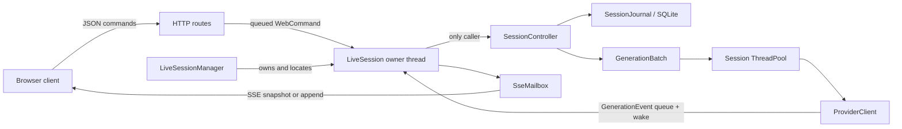

# Learning the CHA C++ codebase

This guide is a systematic route through CHA's native C++ code. Its purpose is
not merely to list files, but to build a working mental model: which objects
exist, who owns them, which thread may touch them, when data becomes durable,
and how one browser prompt turns into streamed model output.

The browser implementation under `webapp/` is outside this guide. It appears
only at the native protocol boundary, where understanding the C++ server
requires knowing what the browser sends and receives.

## 1. How to use this guide

Read the code in passes. Do not try to understand every implementation detail
on the first pass.

1. Read sections 2–5 to learn the vocabulary, dependency direction, startup,
   and ownership model.
2. Follow the focused reading path in sections 6–12. Keep the source open and
   find each named type or function as it appears here.
3. Trace the complete workflows in section 13 without diving into helpers.
4. Use sections 14–18 to consolidate concurrency, persistence, failure, and
   shutdown behavior.
5. Complete the exercises in section 21. If you can explain each answer in
   terms of concrete objects and transitions, you understand the architecture
   well enough to change it deliberately.

The subsystem `README.md` files are reference manuals. This document connects
them into a learning sequence:

- [Native architecture](../src/README.md)
- [Utility contracts](../src/util/README.md)
- [Chat model](../src/chat/README.md)
- [Agent and generation layer](../src/agents/README.md)
- [Session layer](../src/session/README.md)
- [Workspace composition](../src/workspace/README.md)
- [Web runtime](../src/web/README.md)

When this tutorial and a subsystem reference differ, inspect the current
headers and tests. They are the executable contract.

## 2. The application in one page

CHA is a C++20 web server for conversations with OpenAI-compatible model
servers. The executable is `chaweb`. It serves a browser shell, exposes a JSON
HTTP API, and streams session changes with server-sent events (SSE).

The most useful high-level model is:

- `WorkspaceDefinition` is the immutable catalog of personas, characters, forums,
  prompts, and effective provider configuration loaded at process startup.
- `SessionRepository` is the dynamic storage gateway. It lists, creates,
  validates, leases, and restores SQLite session databases.
- `LiveSessionManager` owns the process's live-session registry.
- One `LiveSession` is an actor with one permanent owner thread for one open
  session.
- One `SessionController` owns the live transcript, persistence journal,
  generation state, and worker pool for that session.
- `GenerationBatch` runs one or more character requests concurrently, but
  exposes them to the controller in deterministic foreground order.
- `ProviderClient` owns provider HTTP mechanics. `ProviderStreamDecoder` owns
  provider response decoding without knowing about curl or HTTP.
- `SseMailbox` transfers presentation updates from the session owner thread to
  the HTTP thread writing the browser's event stream.



There are two kinds of long-lived information:

- Static workspace information is read once, validated as a whole, and then
  shared immutably.
- Conversation state is dynamic. A live controller owns an in-memory view and
  writes durable turn transitions to one SQLite database.

This split explains why editing a character or forum requires a restart while
creating a session appears immediately.

## 3. Build graph and dependency direction

Start with [CMakeLists.txt](../CMakeLists.txt). The native build has three
important production targets:

| Target | Role |
| --- | --- |
| `cha_core` | `util`, `chat`, `agents`, `session`, and `workspace` |
| `cha_web` | HTTP, SSE, actor runtime, routing, and protocol; links `cha_core` |
| `chaweb_app` | Small composition root in `src/web_main.cpp`; links `cha_web` |

The executable file is named `chaweb` even though the CMake target is
`chaweb_app`.

The intended dependency direction is:

```text
chaweb_app -> cha_web -> cha_core

workspace -> session -> agents -> chat
                    \                 ^
                     +-------------- util where needed
```

That diagram is intentionally approximate inside `cha_core`; the important
rules are simpler:

- `chat` contains presentation-neutral domain vocabulary.
- `util` contains domain-neutral mechanisms.
- `agents` knows model backends and generation, but not sessions or HTTP.
- `session` coordinates transcripts, persistence, and generation, but not web
  routes.
- `workspace` loads the workspace and wires a session from workspace data.
- `web` adapts HTTP/SSE to the workspace and session APIs.
- Only `web_main.cpp` assembles the complete process.

If a proposed change makes `chat` include a web header, or makes `session`
depend on `httplib`, it is crossing an important boundary.

### Build and test commands

```sh
cmake --preset ninja
cmake --build --preset ninja
ctest --test-dir build/ninja -j8 --output-on-failure
```

There are also `asan-ubsan` and `tsan` CMake presets. Browser checks and the
credential-dependent provider integration test are separate from the core C++
unit suite; see the root [README](../README.md).

## 4. Repository map

| Location | What to learn there |
| --- | --- |
| [src/web_main.cpp](../src/web_main.cpp) | Process composition and destruction order |
| [src/chat](../src/chat) | IDs, personas, character metadata, transcript vocabulary |
| [src/util](../src/util) | Queues, worker pool, template expansion, logging, path/text helpers |
| [src/agents](../src/agents) | Character configuration, model context, provider calls, generation batches |
| [src/session](../src/session) | Controller, transcript orchestration, SQLite journal, leases, repository |
| [src/workspace](../src/workspace) | Workspace loading, built-ins, and session construction |
| [src/web](../src/web) | Native protocol, routes, actor, mailbox, lifecycle, shutdown |
| [tests](../tests) | Behavioral examples grouped by the same subsystem boundaries |
| [workspace](../workspace) | A real workspace to compare against the loaders |

Headers in this project are unusually valuable: most ownership and thread
contracts are written next to the types. Read a subsystem's public headers
before its `.cpp` files.

## 5. The four concepts that unlock the code

### 5.1 Stable identity is not display text

`ForumId`, `CharacterId`, and `SessionId` are string aliases declared in
[chat/ids.h](../src/chat/ids.h). A participant also has a stable ID and a
display name. IDs are used for storage, URLs, lookup, and model attribution;
display names are used in the interface and prompt text.

The code deliberately stores both. Renaming a display label should not silently
change the identity of old entries. When reading a field named `character_id`,
`participant_id`, or `addressed_to`, do not mentally replace it with the visible
name beside it.

### 5.2 There is one mutable owner per live session

The core session model is not generally thread-safe, and it does not need to
be. `LiveSession::owner_main()` is the sole caller of its `SessionController`.
HTTP workers enqueue commands; generation workers enqueue events; the owner
thread drains both and performs all mutations.

This is actor-style confinement implemented with ordinary C++ objects, a
thread, queues, and wakeups—not an actor framework.

### 5.3 Workers receive copies, views stay local

`TranscriptView` and `ControllerView` borrow owner-thread storage and are valid
only for immediate synchronous projection. In contrast, `ModelHistory` owns a
point-in-time copy and can be shared immutably with generation workers.

The distinction prevents two common errors:

- retaining a `std::span` into a transcript that will mutate;
- allowing a worker to observe a transcript halfway through a state change.

### 5.4 State is published as a snapshot unless append safety is proven

A controller update is either no state change, a required full snapshot, or a
text append to a precise entry/reasoning target. The append is an optimization,
not an alternate source of truth. If the actor or mailbox cannot prove that the
browser has the correct base and target, it publishes a new snapshot.

This lets the mutable controller remain authoritative while keeping token
streaming efficient.

## 6. First reading pass: domain vocabulary

Begin with [chat/ids.h](../src/chat/ids.h),
[chat/persona.h](../src/chat/persona.h), and
[chat/character.h](../src/chat/character.h).

The important split in character data is:

- `CharacterMetadata` is public, discovery-safe information: ID, display name,
  description, tags, and appearance.
- `CharacterDefinition`, declared in
  [agents/character.h](../src/agents/character.h), combines public metadata with
  private backend configuration and a completed system prompt.

Routes may expose metadata. They must not expose the full definition, which can
contain provider configuration and private prompt material.

### 6.1 The transcript is the shared conversation language

Read [chat/transcript.h](../src/chat/transcript.h) completely before
[chat/transcript.cpp](../src/chat/transcript.cpp).

`TranscriptEntry` is used by rendering, persistence, and model-context
projection. Its fields answer different questions:

| Field | Meaning |
| --- | --- |
| `id` | Monotonically increasing entry identity within the session |
| `kind` | Human, character, notice, or error semantics |
| `participant_id` / `display_name` | Who authored the entry |
| `addressed_to` / `addressed_to_name` | Target of a human prompt |
| `text` | Visible content |
| `status` | Complete, streaming, cancelled, or failed |
| `request_id` | Turn/generation correlation when applicable |

The `Transcript` class enforces several central invariants:

- Entry IDs increase strictly.
- At most one character entry is open for streaming.
- Human and notice entries are immediately complete.
- A completed or cancelled character entry has answer text.
- An error entry has failed status.
- A live streaming entry cannot be stored as a terminal record.

The factory functions (`make_human_entry`, `make_character_entry`, and so on)
make valid intent visible at call sites. Validation still exists at boundaries;
factories are not a reason to trust arbitrary loaded data.

### 6.2 Revision, history epoch, and off-record state

Three transcript concepts are easy to conflate:

- `revision` changes on presentation mutations.
- `history_epoch` changes when the visible logical history is replaced or
  cleared.
- `OffrecordSpan` is a half-open range of entry IDs omitted from model context.

The `/hide-on`, `/hide`, and `/hide-off` operations add visible transient marker
entries and change the runtime span. Those markers and span boundaries are not
durable session history. `/clear` does not delete old SQLite rows; it advances
the durable history epoch so restoration selects only the current epoch.

Checkpoint: explain why `Transcript::model_history()` returns an owning value
while `Transcript::view()` returns a borrowed span.

## 7. Second reading pass: utility mechanisms

Read utilities as mechanisms with specific shutdown contracts, not as a bag of
helpers.

### 7.1 `ConcurrentQueue<T>`

[util/concurrent_queue.h](../src/util/concurrent_queue.h) is used for generation
events. Closing the queue stops new values but preserves accepted values for
draining. `close_with()` installs one final terminal value. That terminal
guarantee is how each generation execution reports exactly one completion,
cancellation, or failure even on its exception path.

### 7.2 `ThreadPool`

[util/thread_pool.h](../src/util/thread_pool.h) and
[util/thread_pool.cpp](../src/util/thread_pool.cpp) provide a fixed worker pool.
`stop()` closes submission, drains accepted tasks, and joins the workers. It
does not invent application-level cancellation; `GenerationBatch` owns that.

Each session creates a pool with exactly one worker per backend. The executor
checks this equality because multicast must be able to fan out to the full
forum roster without one batch starving itself behind another slot.

### 7.3 `WakeNotifier`

[util/wake_notifier.h](../src/util/wake_notifier.h) is the tiny seam by which a
generation worker tells the session actor, “new events may be available.” The
web implementation is `OwnerWakeSignal`. Waking does not carry state; queues
remain the source of work.

### 7.4 Configuration helpers

The other utilities support important boundaries:

- `environment.*` loads `.env` without making secrets part of character data.
- `path_name.*` and `utf8_path.*` keep filesystem and URL identifiers explicit.
- `public_name.*` centralizes visible-name validation.
- `text_template.*` expands `$$(relative/file)` includes and `$${variable}`
  substitutions with containment and cycle/resource limits.
- `logging.*` owns the process logging lifetime.

Checkpoint: locate one caller of each utility and state whether it is a domain
policy or a reusable mechanism.

## 8. Third reading pass: startup and the immutable workspace

Read [web_main.cpp](../src/web_main.cpp) once from top to bottom. It is the
composition root, so most lines construct or connect an owner.

Startup proceeds in this order:

1. `load_application_config()` reads `app.toml` and command-line overrides.
2. `load_dotenv()` loads `workspace/.env`.
3. `load_workspace_config()` reads `workspace.toml`.
4. File logging is initialized.
5. `WorkspaceDefinition::load()` reads and validates all static workspace data.
6. `SessionRepository` is constructed from the forum session directories and
   creates the temporary Entrance/Welcome database.
7. `LiveSessionManager` is given an opener lambda that calls `open_session()`.
8. The HTTP server, asset handler, lobby routes, and session routes are
   installed.
9. Signal/shutdown coordination is installed, the socket is bound, and the
   server listens.
10. Shutdown stops new work, tears down live actors, then destroys application
    objects before shutting down logging.

The local declaration order and the explicit inner scope matter: destructors
run in reverse order, and log users must be destroyed before logging itself.

### 8.1 What `WorkspaceDefinition::load()` builds

Read [workspace/workspace_definition.h](../src/workspace/workspace_definition.h), then
the helpers and `WorkspaceDefinition::load()` in
[workspace/workspace_definition.cpp](../src/workspace/workspace_definition.cpp).

The loader treats the workspace as one configuration unit:

- It requires `characters/`, `forums/`, and `personas/` in the expected form.
- It validates character IDs and public-name uniqueness.
- It loads persona metadata and optional `PERSONA.md` prompts.
- It validates every forum's members and default character.
- It resolves every forum's effective character definitions immediately.
- It builds public indexes and private definition maps.
- It adds the built-in Guest persona, Assistant character, and Entrance forum.

All forums are resolved at startup, including unused ones. This turns an
invalid member override or prompt into a deterministic startup error rather
than a delayed failure when someone opens that forum.

The public methods expose immutable discovery information. The private
`copy_definitions_for()` boundary is used by `open_session()` to give a new
session its own movable backend definitions.

### 8.2 Configuration overlay

Character provider settings are layered from broad defaults to specific
overrides:

1. workspace-level provider configuration from `workspace.toml`;
2. the base character definition;
3. forum-wide character defaults;
4. the forum member override.

An omitted value inherits. Read
[agents/character_config.h](../src/agents/character_config.h),
[agents/character_config.cpp](../src/agents/character_config.cpp), and then
[agents/character.cpp](../src/agents/character.cpp). Keep `ProviderConfig` and
`ModelBackendConfig` distinct in your notes: the former is a partial layer; the
latter is a concrete, validated runtime configuration.

### 8.3 Prompt construction

`load_character_definitions()` combines:

- the character definition prompt;
- forum prompt/context;
- the persona roster and persona prompts;
- standard generated context;
- effective model backend settings.

The built-in Assistant is assembled in
[workspace/builtins.cpp](../src/workspace/builtins.cpp). Its workspace
guide is generated into the build and combined with public workspace inventory
data. The Entrance/Welcome session is a normal session at the controller level;
its specialness is in how the application constructs and stores it.

Checkpoint: starting with `workspace/forums/stoics`, identify the files that
contribute to one member's final definition and the order in which values win.

## 9. Fourth reading pass: session storage and opening

Read these in order:

1. [session/session_identity.h](../src/session/session_identity.h)
2. [session/stored_session.h](../src/session/stored_session.h)
3. [session/session_catalog.h](../src/session/session_catalog.h)
4. [session/session_lease.h](../src/session/session_lease.h)
5. [session/session_database.h](../src/session/session_database.h)
6. [session/session_repository.h](../src/session/session_repository.h)
7. [workspace/session_open.cpp](../src/workspace/session_open.cpp)

### 9.1 Observation versus authority

`StoredSession` is listing data. It says what was observed on disk, not that the
session can be opened or is unchanged.

`PreparedSession` is authoritative for construction because it contains:

- validated identity and label;
- the database path;
- an active `SessionLease`;
- restored transcript/counter state.

`SessionRepository::prepare()` first establishes that the database file exists,
then acquires the cross-process companion-file lease, then performs the
authoritative load and validation behind that lease. Nothing observed before
the lease is trusted for controller construction.

The lease is moved into `SessionController`. Consequently, “the controller is
alive” and “this process holds the session lease” have the same lifetime.

### 9.2 Listing and creation

`SessionRepository` owns an immutable forum-to-directory map and constructs a
`SessionCatalog` per operation. It does not cache session listings.

`SessionCatalog::list()` is tolerant: a recognizable database with invalid
metadata remains visible with an error label. Selecting/opening is strict.

Creation chooses a timestamp-based ID, acquires the candidate lease, creates a
temporary SQLite database, and publishes it without overwriting an existing
destination. Concurrency is settled per candidate; no global sessions-directory
lock is needed.

The repository also creates a private temporary database for Welcome. It uses
the same catalog/database/controller machinery and removes that private
directory when the repository is destroyed.

### 9.3 `open_session()` is the bridge

`workspace/session_open.cpp` performs a short but crucial composition:

1. find the immutable forum;
2. copy its prevalidated definitions;
3. prepare and lease the stored session;
4. create the public `SessionDescriptor`;
5. construct a `SessionController`, transferring the database path, restore
   state, lease, persona roster, definitions, and wake notifier.

The workspace layer knows both the static workspace and dynamic repository;
neither needs to know about HTTP.

Checkpoint: explain why route code calls `validate()` before starting an actor,
but the actor's `open_session()` must still call `prepare()`.

## 10. Fifth reading pass: the generation pipeline

Read the interfaces before the implementations:

1. [agents/model_backend.h](../src/agents/model_backend.h)
2. [agents/generation_event.h](../src/agents/generation_event.h)
3. [agents/model_context.h](../src/agents/model_context.h)
4. [agents/generation_batch.h](../src/agents/generation_batch.h)
5. [agents/generation_executor.h](../src/agents/generation_executor.h)
6. [agents/provider_response.h](../src/agents/provider_response.h)
7. [agents/provider_client.h](../src/agents/provider_client.h)

### 10.1 The backend seam

`ModelBackend` has a two-phase contract:

- `prepare(const GenerationRequest&)` projects context and creates owned request
  bytes.
- `perform(RequestPayload, delta sink, cancellation flag)` performs synchronous
  generation and returns a classified terminal result.

The split lets request preparation fail on a worker while keeping the session
controller provider-agnostic. Tests inject fake backends through the same seam.

`GenerationDelta` distinguishes reasoning from answer text.
`GenerationResult` classifies completion, cancellation, protocol error, or
transport error. Worker-facing `GenerationEvent` adds the request ID and
converts the result into deltas followed by one terminal event.

### 10.2 Context projection

[agents/model_context.cpp](../src/agents/model_context.cpp) translates a
presentation-neutral `ModelHistory` into provider message roles.

Projection omits:

- notices and errors;
- the current open streaming entry;
- entries inside the closed off-record span;
- failed prompts;
- incomplete/cancelled character history.

For the target character, its own completed output becomes `assistant` history
and directly addressed human prompts become `user`/persona history. Other
participants' entries are grouped into explicit shared-history JSONL so the
model can see the multi-party conversation without being told it authored
someone else's words. The new prompt is appended last with its persona display
name.

### 10.3 Executor and batch

`GenerationExecutor` owns one session-lived backend per forum character. It
validates runtime identities, resolves all batch targets before submission, and
rejects duplicates.

`GenerationBatch::stage()` creates one execution slot per target and submits
all slots behind a shared closed start gate. If any submission fails, the gate
is cancelled and no backend can begin. Only after the controller has made the
foreground turn durable does it call `open()`.

Each execution owns:

- its immutable generation request;
- one borrowed session-lived backend;
- a cancellation flag;
- a concurrent event queue;
- shared access to the batch start gate and wake notifier.

The workers may all call their backends concurrently. The controller, however,
drains only `foreground_index()`. A finished foreground execution must deliver
its terminal event before `advance_foreground()` exposes the next slot. This is
how multicast gains parallel provider latency but deterministic transcript and
persistence order.

Background output is buffered in its execution queue. It does not become
durable until that execution becomes foreground. Cancelling a batch can discard
buffered children that never became foreground; this is a deliberate simplicity
tradeoff.

### 10.4 Provider transport versus response semantics

`ProviderClient` owns:

- model discovery through `/v1/models` when no model is configured;
- request JSON and `/v1/chat/completions` HTTP behavior;
- headers/authentication, curl handles, status/content-type checks, logging,
  byte counts, and cancellation through curl's progress callback;
- test mode, which emits the prompt as answer text.

`ProviderStreamDecoder` and `decode_provider_response()` in
[agents/provider_response.cpp](../src/agents/provider_response.cpp) own only
response meaning:

- incremental SSE framing for streaming responses;
- JSON message extraction;
- reasoning-format interpretation;
- reasoning and answer delta emission;
- end marker, malformed response, and missing-answer classification.

The decoder intentionally knows nothing about curl, HTTP status, or
cancellation. `ProviderClient::perform()` decides the final outcome after the
transport completes and may add HTTP metadata to a decoder error.

Checkpoint: describe what happens if a streaming response contains reasoning
but no answer, and identify which layer detects it and which layer converts it
into a transcript error.

## 11. Sixth reading pass: `SessionController`

The controller is the heart of the application. Read
[session/session_controller.h](../src/session/session_controller.h) first, then
read [session/session_controller.cpp](../src/session/session_controller.cpp) in
four groups:

1. construction, restoration, and `view()`;
2. prompt resolution and `start_batch()`;
3. command methods such as clear, hide, multicast, default character, and stop;
4. generation-event `apply()` overloads and shutdown.

### 11.1 What the controller owns

One controller owns:

- the session lease and `SessionJournal`;
- the owner-thread-confined `Transcript`;
- a fixed `ThreadPool` and `GenerationExecutor`;
- the resolved forum character roster and shared immutable personas;
- default-character selection;
- next request and entry IDs;
- at most one active foreground response;
- at most one `GenerationBatch`.

The controller has no mutex. Its public mutation/view methods belong to the
owner thread. Thread-safe communication is isolated inside the batch/event
queues and wake mechanism.

`ForumCharacters` in
[session/forum_characters.cpp](../src/session/forum_characters.cpp) is the
controller's roster and handle resolver. It centralizes exact, normalized, and
prefix matching plus ambiguity diagnostics, so prompt submission, multicast,
and default-character changes use the same rules. The smaller
`generation_status.h`, `controller_view.h`, and `opened_session.h` headers are
boundary value types: they let application and web code observe or transfer
session state without gaining access to controller internals.

### 11.2 Starting a prompt

`submit_prompt()` resolves a character handle or uses the current default,
resolves the submitted persona ID, copies current `ModelHistory`, and delegates
to `start_batch()`.

`start_batch()` is ordered carefully:

1. Allocate one request ID per target and build all `GenerationRequest` values.
2. Stage all execution slots behind the closed gate.
3. `activate_current_run()` allocates transcript entry IDs.
4. Persist the started turn and human prompt transactionally.
5. Add the human prompt to the in-memory transcript.
6. Install `ActiveResponse` and require a presentation snapshot.
7. Open the batch gate so provider code may finally run.

This is the key commit boundary: no worker can publish model output into a
session that has not already recorded its prompt durably and installed state
capable of receiving the result.

### 11.3 Response phases

`ActiveResponse::phase` moves through:

```text
waiting -> reasoning -> answering -> terminal
    \-----------------> answering -> terminal
```

Reasoning may continue after answer text has begun; the phase records the most
important visible structure, while reasoning text remains separate ephemeral
state.

- The first reasoning delta changes structure and requires a snapshot.
- Later reasoning growth can be a targeted append.
- The first answer delta creates the streaming transcript entry and requires a
  snapshot.
- Later answer growth can be a targeted append.
- Completion, cancellation, failure, target changes, and notices require a
  snapshot.

Reasoning is never written to the transcript or SQLite journal.

### 11.4 Terminal outcomes

On completion with answer text, the controller transactionally completes the
turn, marks the streaming entry complete, clears `active_`, and advances or
finishes the batch.

Completion without answer text is treated as failure. On failure, an open
streaming response is discarded and a durable error entry replaces it.

Cancellation has two forms:

- If answer text exists, a cancelled character entry is stored with the partial
  text.
- If no answer exists, the turn is cancelled without a response entry; the
  prompt remains.

`request_stop()` only sets cancellation and returns. It does not block the actor
waiting for provider threads. Later event-loop passes drain terminal events and
finish cleanup.

### 11.5 `ControllerUpdate` is an effect description

Read [session/controller_update.h](../src/session/controller_update.h) and
[session/controller_update.cpp](../src/session/controller_update.cpp).

A command/event returns both semantic results (notice, input consumed, session
ended) and a presentation-state effect:

- `NoStateUpdate`
- `SnapshotRequired`
- `TextAppend` to an entry or reasoning request

Merging is conservative. A structural change dominates an append, and
incompatible appends become a snapshot. This type lets the session layer
describe what changed without depending on SSE.

Checkpoint: for first answer chunk, second answer chunk, completion, and
provider failure, state the transcript mutation, journal operation, and update
classification.

## 12. Seventh reading pass: web actor and protocol

Read the web layer in this order:

1. [web/protocol.h](../src/web/protocol.h)
2. [web/session_projection.cpp](../src/web/session_projection.cpp)
3. [web/command_queue.h](../src/web/command_queue.h)
4. [web/sse_mailbox.h](../src/web/sse_mailbox.h)
5. [web/live_session.h](../src/web/live_session.h)
6. [web/live_session.cpp](../src/web/live_session.cpp)
7. [web/live_session_manager.cpp](../src/web/live_session_manager.cpp)
8. [web/lobby_routes.cpp](../src/web/lobby_routes.cpp)
9. [web/session_routes.cpp](../src/web/session_routes.cpp)

### 12.1 Protocol values are owning DTOs

`ControllerView` borrows controller storage. `to_snapshot()` immediately copies
it into an owning `SessionSnapshot` suitable for JSON or cross-thread
publication. The protocol also defines `AppendEvent`, command results, errors,
bootstrap data, and lifecycle/shutdown values.

This projection is the seam where core state becomes web presentation. Core
types do not acquire JSON annotations just because the browser needs them.

### 12.2 Command ingress

An HTTP handler obtains a `shared_ptr<LiveSession>` from the manager and calls
`submit()`; it never calls the controller.

`CommandQueue` has two lanes:

- bounded commands with `CommandReply` objects, so load cannot grow queued
  mutations without limit;
- unbounded, lossless owner notifications for SSE disconnect cleanup.

`submit()` enqueues under the lifecycle boundary, wakes the owner if necessary,
and waits only for the caller's deadline. A timeout abandons the reply but does
not undo a command that may already be executing. That is why the HTTP error
says the outcome is unknown.

### 12.3 Text parsing is a web adapter

The browser sends `RawCommand { persona, text }`. The actor passes it to
`handle_text_input()` in [web/text_input.cpp](../src/web/text_input.cpp).
Parsing is divided among:

- `text_mention.*` for leading character mentions;
- `text_command.*` for slash commands;
- `text_multicast.*` for `/mcast` syntax;
- `text_input.*` for dispatch to typed controller methods.

The parser belongs in `web` because it adapts one input protocol. The
controller exposes typed actions and remains usable without slash-command
syntax.

### 12.4 The owner loop

`LiveSession::owner_loop()` repeatedly:

1. drains a bounded batch of commands/notifications;
2. checks for shutdown;
3. drains a bounded batch of foreground generation events;
4. applies notice state and publishes an append or snapshot;
5. checks browser-disconnect/idle deadlines;
6. continues immediately if a batch was full, otherwise waits for a wake or
   deadline.

Bounding both drains prevents an endless command stream from starving model
events and prevents a hot model stream from starving commands such as `/stop`.

### 12.5 SSE mailbox

`SseMailbox` is the one cross-thread presentation channel from owner to HTTP
stream writer. It holds at most one in-flight payload and one replaceable
pending payload.

Snapshots replace stale pending state. Compatible appends can be combined only
when their sequence base and text target are exact. A pending snapshot plus a
later append is not assumed compatible; the mailbox rejects the append and the
owner projects a current snapshot instead.

The result is bounded memory under a slow browser. Intermediate presentation
updates may collapse, but the latest complete state is recoverable. A newly
connected SSE stream always begins with a snapshot.

Only one browser SSE connection is accepted for a live session. Connection
state also drives the actor's idle/orphan deadline; generation receives the
longer protection appropriate to active work.

### 12.6 Manager and routes

`LiveSessionManager` is the liveness authority and join authority. Its map is
keyed by `SessionIdentity`.

- Concurrent opens of the same identity share one starting actor and result.
- A running actor is reattached rather than duplicated.
- Waiting for startup happens outside the manager mutex.
- Finished actors are removed under the mutex and joined outside it.
- A caller timing out while an actor starts does not cancel shared startup.

Lobby routes provide health, bootstrap, public character detail, session
listing/creation, and open. Session routes operate only on a live actor:

```text
GET  /health
GET  /api/v1/bootstrap
GET  /api/v1/characters/{character}
GET  /api/v1/forums/{forum}/sessions
POST /api/v1/forums/{forum}/sessions
POST /api/v1/forums/{forum}/sessions/{session}/open

GET  /s/{forum}/{session}/
GET  /s/{forum}/{session}/api/v1/session
GET  /s/{forum}/{session}/api/v1/events
POST /s/{forum}/{session}/api/v1/input
POST /s/{forum}/{session}/api/v1/actions/stop
POST /s/{forum}/{session}/api/v1/actions/default-character
```

`default-agent` remains a compatibility alias for `default-character`; new
code uses character vocabulary.

The route files should mostly validate HTTP input, map errors/statuses, look up
an actor, and serialize protocol values. Session behavior belongs below them.

Checkpoint: explain why a `LiveSessionHandle` may safely outlive the manager's
map entry after the owner thread has finished.

### 12.7 Web support modules

After the main actor path makes sense, scan the smaller adapters:

| Files | Responsibility |
| --- | --- |
| `application_config.*` | Locate the executable, read `app.toml`, and apply CLI host/port/workspace/root overrides |
| `asset_handler.*` | Serve the browser shell and staged static assets without owning session behavior |
| `http_server.*` | Apply server-wide request, Host/Origin, timeout, and size policy |
| `http_response.*`, `json.*`, `route_support.*` | Consistent JSON parsing, response bodies, route components, and mutation validation |
| `browser_connection_state.*` | Enforce one browser stream and calculate disconnect/idle deadlines |
| `owner_wake_signal.*` | Coalesce cross-thread wakeups for the actor loop |
| `sse_stream.*` | Serialize mailbox payloads and heartbeats into `httplib::DataSink` |
| `server_shutdown.*` | Bridge process signals to coordinated, bounded manager shutdown |

These modules keep `LiveSession` and the route files from accumulating generic
HTTP, filesystem, and signal-handling details.

## 13. End-to-end workflow traces

Use these traces as navigation exercises. Open each function in sequence.

### 13.1 Creating and opening a stored session

1. `LobbyRoutes::install()` handles session creation.
2. `SessionRepository::create()` selects the forum catalog.
3. `SessionCatalog::create()` chooses an ID, leases the candidate, creates the
   database, and returns `StoredSession`.
4. The browser later posts to the open route.
5. The route first tries to reattach, then validates storage, then calls
   `LiveSessionManager::open()`.
6. The manager inserts a starting actor before starting its owner thread.
7. `LiveSession::owner_main()` calls the supplied opener.
8. `open_session()` obtains definitions and a `PreparedSession`.
9. `SessionController` restores transcript state and repairs any interrupted
   started turn.
10. The actor commits `running`, publishes a snapshot, and enters its loop.

The pre-route `validate()` improves error mapping but does not grant ownership.
The lease-and-load in `prepare()` remains authoritative.

### 13.2 One ordinary prompt

1. `SessionRoutes` parses JSON into `RawCommand` and enqueues it.
2. `LiveSession::execute()` calls `handle_text_input()` on the owner thread.
3. Text parsing selects `SessionController::submit_prompt()`.
4. The controller resolves persona and target, copies `ModelHistory`, stages one
   execution, persists the started turn, adds the prompt, installs active state,
   and opens the gate.
5. The actor publishes a snapshot showing the prompt and active generation.
6. A worker calls `ProviderClient::prepare()` to project/model-encode context.
7. It calls `perform()`, whose decoder emits reasoning or answer deltas.
8. The execution queues each delta and wakes the owner.
9. The actor drains the event; the controller updates reasoning or transcript.
10. Structural changes become snapshots; proven text growth becomes appends.
11. The SSE writer serializes the mailbox payload to the browser.
12. The terminal event makes the controller persist completion, cancellation,
    or failure and publish final state.

### 13.3 Multicast

1. `/mcast` syntax resolves an ordered, duplicate-free target list.
2. The controller captures one shared history for all children.
3. All children are submitted behind one gate and opened together after the
   first durable foreground prompt.
4. Workers perform concurrently and buffer per-slot events.
5. Only slot 0 mutates live state.
6. On its terminal event, slot 1 becomes foreground and its prompt is then
   persisted/added; already-buffered output can be drained immediately.
7. The process repeats in requested target order.

The transcript therefore reads as a deterministic sequence of individual
turns, not interleaved token streams.

### 13.4 Stop

1. The stop route enqueues `StopCommand`.
2. The owner calls `SessionController::request_stop()`.
3. The batch sets every execution's atomic cancellation flag and cancels an
   unopened gate if applicable.
4. `ProviderClient` observes cancellation in curl's progress callback; a fake
   backend is expected to observe the same flag.
5. The command returns “Stopping generation...” without joining workers.
6. Terminal events are drained later. The active turn is persisted as cancelled
   with or without partial answer text.
7. Once all executions finish, the controller releases the batch and the UI
   receives terminal state.

### 13.5 Clear

1. `/clear` is rejected while the controller is busy.
2. `SessionJournal::clear()` verifies no turn is started and increments the
   durable `history_epoch` in a transaction.
3. `Transcript::clear()` removes current in-memory entries, resets off-record
   state, and increments its local epoch/revision.
4. A snapshot replaces browser state.

Old rows remain in the database as history from an earlier epoch. Restoration
loads only the current epoch.

## 14. State machines to keep in your head

### 14.1 Turn persistence

```text
               +-> completed + response
started prompt +-> cancelled + optional partial response
               +-> failed    + error entry
```

SQLite enforces at most one started turn and one prompt per turn. Every journal
transition is transactional. On startup, a leftover started turn means the
previous process was interrupted; restore creates an `InterruptedTurn`, and the
controller repairs it to failed before normal operation.

### 14.2 Live actor lifecycle

```text
starting -> running -> stopping -> finished
    \---- open failed/busy/not found ----> finished
```

`finished` is published only after blocking teardown work, controller
destruction, worker shutdown, journal release, and lease release. This makes a
post-finished join bounded by invariant and permits another actor for the same
identity to start immediately after the manager reaps the old one.

### 14.3 Presentation delivery

```text
controller mutation
    -> no update
    -> exact append -> mailbox accepts -> AppendEvent
                    -> mailbox rejects -> current SnapshotEvent
    -> structural change -------------> current SnapshotEvent
```

Treat snapshots as truth and appends as a verified compression of truth.

## 15. Concurrency and ownership map

| Object | Lifetime/owner | Thread rule |
| --- | --- | --- |
| `WorkspaceDefinition` | Process, shared immutable | Concurrent reads only |
| `SessionRepository` | Process, shared immutable mapping | Concurrent const operations; leases arbitrate sessions |
| `LiveSessionManager` | Process web runtime | Internal mutex protects registry/lifecycle coordination |
| `LiveSession` | Manager entry plus transient route handles | Owner thread mutates session; lifecycle methods synchronize |
| `SessionController` | One `LiveSession` | Owner thread only |
| `Transcript` / `SessionJournal` | One controller | Owner thread only |
| `GenerationExecutor` / backends | One controller | Backend slot used by its worker execution; controller owns lifetime |
| `GenerationBatch::Execution` | One batch slot | Worker produces events; owner consumes; atomic cancellation |
| `CommandQueue` | One actor | HTTP producers, actor consumer |
| `SseMailbox` | One actor/stream pair | Actor producer, HTTP SSE consumer |

The application has three relevant thread roles:

1. HTTP library threads parse requests, wait on command replies, and write SSE.
2. One owner thread per live session performs all core state transitions.
3. One generation worker per character/backend performs blocking provider work.

When debugging a race, first classify every access by those roles. Most state
should belong entirely to one row of this table; shared mechanisms are small and
explicit.

## 16. Persistence model

The SQLite implementation is in
[session/session_database.cpp](../src/session/session_database.cpp). Read the
schema creation first, then validation/restore, then `SessionJournal` methods.

The schema has four conceptual tables:

| Table | Purpose |
| --- | --- |
| `session` | Stable session ID, forum ID, and label |
| `state` | Current history epoch and next ID counters |
| `turns` | Request ID, epoch, and started/completed/cancelled/failed state |
| `entries` | Typed prompt/response/error records linked to turns |

Database constraints mirror transcript/controller invariants rather than
accepting any arbitrary row combination. Opening validates identity before
trusting contents, then restores terminal entries in the current epoch and next
ID counters.

What is durable:

- human prompts attached to started turns;
- completed and partially cancelled character answers;
- generation error entries;
- turn state and ID counters;
- history epoch and session metadata.

What is deliberately not durable:

- reasoning text;
- live streaming status;
- off-record runtime markers/span;
- notice presentation state;
- background multicast output before it becomes foreground.

Persistence failures are session-fatal because continuing would let in-memory
state diverge from the journal. Provider failures are ordinary turn outcomes
and become durable error entries.

## 17. Error boundaries

Errors are handled at the narrowest layer that can give them meaning:

- Loaders throw contextual configuration errors; `web_main` treats startup
  failure as process failure.
- Provider response code classifies malformed model output as protocol error.
- `ProviderClient` classifies transport/HTTP failure and cancellation.
- Execution slots convert exceptions/results into one terminal generation
  event.
- `SessionController` turns a generation failure into a failed durable turn and
  transcript error.
- A journal failure escapes the controller and is contained as a fatal live
  session failure.
- `LiveSession` maps storage busy/not-found on startup and contains session-local
  failures during the owner loop.
- Routes map known application outcomes to JSON error codes and HTTP statuses.
- `std::bad_alloc` is generally not disguised as successful local cleanup; key
  actor boundaries terminate instead.

Avoid broad `catch (...)` additions without identifying the state boundary they
protect. A catch that lets processing continue after a journal mutation failed
can be worse than allowing the actor to terminate.

## 18. Shutdown and destruction

Shutdown is part of the design, not cleanup after the design.

At process level, the shutdown coordinator stops HTTP acceptance, asks the
manager to stop all actors, and gives the entire process one grace deadline.
The deadline is shared, not reset for every session. If owners cannot finish in
time, the process takes the immediate-exit path rather than running destructors
that could block indefinitely.

Within a `LiveSession`, teardown:

1. marks the actor stopping and publishes a final snapshot when possible;
2. performs a bounded final SSE drain unless the shutdown reason skips it;
3. closes the mailbox;
4. resolves/rejects queued command replies;
5. calls `SessionController::shutdown()`;
6. destroys the controller, releasing workers, journal, and lease;
7. publishes `finished` so the manager may join and erase the actor.

Within the controller, shutdown cancels the batch, waits for execution safety,
drains terminal events, releases the batch, then stops and joins the worker
pool. The executor and notifier stay alive until workers can no longer borrow
them.

When changing member declaration order, constructor order, or scopes in
`web_main.cpp`, re-evaluate this destruction chain.

## 19. Tests as executable documentation

The tests mirror production boundaries. Use them after reading a type's header
and before reading all of its implementation.

| Area | Best starting tests |
| --- | --- |
| Transcript invariants | [tests/chat/unit_transcript.cpp](../tests/chat/unit_transcript.cpp) |
| Configuration overlays | [tests/agents/unit_config_loader.cpp](../tests/agents/unit_config_loader.cpp) |
| Context rules | [tests/agents/unit_model_context.cpp](../tests/agents/unit_model_context.cpp) |
| Batch gate/order/cancel | [tests/agents/unit_generation_batch.cpp](../tests/agents/unit_generation_batch.cpp) |
| Provider decoding | [tests/agents/unit_provider_response.cpp](../tests/agents/unit_provider_response.cpp) |
| Provider HTTP integration | [tests/agents/unit_provider_client.cpp](../tests/agents/unit_provider_client.cpp) |
| Controller transitions | [tests/session/unit_session_controller.cpp](../tests/session/unit_session_controller.cpp) |
| SQLite catalog/repository | [tests/session/unit_session_catalog.cpp](../tests/session/unit_session_catalog.cpp), [unit_session_repository.cpp](../tests/session/unit_session_repository.cpp) |
| Cross-process leases | [tests/session/unit_session_lease.cpp](../tests/session/unit_session_lease.cpp) |
| Actor behavior | [tests/web/unit_live_session.cpp](../tests/web/unit_live_session.cpp) |
| Registry races/lifecycle | [tests/web/unit_live_session_manager.cpp](../tests/web/unit_live_session_manager.cpp) |
| Snapshot/append collapse | [tests/web/unit_sse_mailbox.cpp](../tests/web/unit_sse_mailbox.cpp) |
| Route protocol | [tests/web/unit_lobby_routes.cpp](../tests/web/unit_lobby_routes.cpp), [unit_session_routes.cpp](../tests/web/unit_session_routes.cpp) |
| Whole-process behavior | [tests/web/process_web_server.cpp](../tests/web/process_web_server.cpp) |

Useful test support types include fake model backends, deterministic notifiers,
temporary workspace builders, controller fixtures, live-session graphs, and a
mock provider HTTP server under [tests/support](../tests/support).

The CMake executables also reveal test scope:

- `cha_tests` covers utilities and the non-web core.
- `cha_web_tests` covers deterministic web components and routes.
- `cha_web_stress_tests` exercises concurrent live-session load.
- `cha_web_process_tests` starts the real `chaweb` process on supported
  platforms.
- `itest` uses a configured live provider and is not part of ordinary offline
  unit verification.

### A productive test-reading method

For one behavior, read in this order:

1. test name and setup;
2. public call being exercised;
3. asserted state and side effects;
4. implementation of that one call;
5. nearby negative tests that reveal the invariant.

This is faster than reading a 900-line implementation sequentially with no
question in mind.

## 20. How to approach changes safely

### Adding a controller command

1. Decide whether it is a typed core action or only web text syntax.
2. Add/adjust the `SessionController` method and `ControllerUpdate` behavior.
3. Add focused controller tests, including busy-state behavior.
4. Add parser syntax in `web/text_*` if needed.
5. Dispatch it from `handle_text_input()` or a typed `WebCommand`.
6. Verify command result, notice, snapshot/append classification, and input
   clearing in web tests.

### Adding transcript data

Trace all consumers before editing the struct:

```text
factory/validation
    -> Transcript
    -> SessionDatabase schema + read/write validation
    -> model_context projection
    -> ControllerView / SessionSnapshot
    -> protocol JSON
    -> tests and browser contract
```

Not every new field belongs in every consumer, but the decision should be
explicit.

### Adding provider response behavior

- Put curl/HTTP/cancellation in `ProviderClient`.
- Put JSON/SSE/reasoning semantics in `provider_response.*`.
- Emit only generic generation deltas/results across the backend seam.
- Test response chunk boundaries independently from HTTP.
- Add a provider-client test only when transport integration matters.

### Changing session lifetime

Audit the manager map lifetime, actor raw-`this` thread capture, route
`shared_ptr` handles, owner state transitions, controller/lease destruction,
and bounded process shutdown together. These contracts are coupled even though
they live in several files.

## 21. Learning exercises

Work through these in order. Write the answer with symbol names, not only prose.

### Exercise 1: draw the object graph

Starting at `main()`, draw who owns `WorkspaceDefinition`, `SessionRepository`,
`LiveSessionManager`, routes, a `LiveSession`, its controller, journal, executor,
backends, batch, and mailbox. Mark `shared_ptr`, `unique_ptr`, value, and borrowed
references.

### Exercise 2: follow one visible token

Set a breakpoint or add temporary tracing at:

- provider decoder delta emission;
- `Execution::publish_delta()`;
- `SessionController::apply(GenerationEventDelta)`;
- `LiveSession::publish_update()`;
- `SseMailbox::publish_append()`;
- `SseStreamWriter::write()`.

Explain why the first answer token follows a snapshot path while a later token
usually follows an append path.

### Exercise 3: reconstruct after a crash

Create a session, submit a prompt, and inspect the database-related code as if
the process stopped immediately after `start_turn()`. Follow
`build_restore()`, `InterruptedTurn`, and `SessionController::initialize()` to
explain the next startup transcript.

### Exercise 4: compare single-target and multicast

Trace `submit_prompt()` and `start_multicast()` until they converge. Identify
the one history copy, request IDs, target order, gate opening point, and the
moment each child becomes durable.

### Exercise 5: prove owner-thread confinement

Find every production call to a mutating `SessionController` method. Verify that
it originates in `LiveSession` owner code, not directly in an HTTP callback or
generation worker.

### Exercise 6: force the snapshot fallback

Read the `ControllerUpdate` and `SseMailbox` tests that combine incompatible
appends or a pending snapshot and append. Explain what browser corruption could
occur if the code sent the append anyway.

### Exercise 7: trace a public name

Choose one character in `workspace/`. Follow its directory ID, public display
name, forum membership, `CharacterMetadata`, backend definition, transcript
participant identity, model-context role, snapshot JSON, and mention
resolution.

### Exercise 8: classify failures

For malformed provider JSON, HTTP 500, missing session database, held session
lease, SQLite write failure, command timeout, and disconnected SSE stream,
identify:

- the first layer that detects it;
- whether it is a turn, session, request, or process failure;
- whether a durable record is written;
- what the browser can observe.

## 22. A practical two-week reading plan

Use this as a suggested pace, not a process requirement.

| Day | Focus | Concrete result |
| --- | --- | --- |
| 1 | Build graph, `web_main`, root/native READMEs | Draw the process object graph |
| 2 | `chat` and transcript tests | Write transcript invariants from memory |
| 3 | `util` queue/pool/template tests | Explain shutdown semantics of each mechanism |
| 4 | workspace model and sample workspace | Trace one effective character definition |
| 5 | repository, catalog, lease | Explain observation vs prepared authority |
| 6 | database schema and restore | Trace complete, cancelled, failed, interrupted turns |
| 7 | model context | Hand-project a sample transcript into model messages |
| 8 | generation executor/batch | Diagram staging, gate, foreground order, cancellation |
| 9 | provider response/client | Separate semantic decode from transport outcomes |
| 10 | controller | Trace prompt and every terminal outcome |
| 11 | protocol/projection/parsers | Map typed core actions to web DTOs |
| 12 | actor/manager | Explain thread confinement and lifecycle races |
| 13 | mailbox/routes/shutdown | Trace browser delivery and teardown |
| 14 | tests and exercises | Make one small change with tests and update this guide |

## 23. Glossary

**Actor:** One `LiveSession` plus its permanent owner thread and queues. It serializes all
session state changes.

**Active response:** The controller's foreground request currently allowed to affect transcript,
journal, and presentation.

**Backend:** A session-lived `ModelBackend` for one character. Production uses
`ProviderClient`; tests can inject fakes.

**Batch:** One or more concurrently executing character requests with one deterministic
foreground slot.

**Controller view:** A short-lived borrowed view of controller state, consumed synchronously to make
an owning web snapshot.

**History epoch:** A durable generation of logical transcript history. `/clear` advances it rather
than deleting older rows.

**Lease:** Cross-process exclusive ownership of a session database, held for the
controller lifetime.

**Model history:** An owning immutable transcript snapshot shared with workers for context
projection.

**Notice:** Presentation state associated with command/session feedback. It is not model
history or durable transcript state.

**Prepared session:** A session validated and restored while its lease is held, ready to transfer
into a controller.

**Snapshot:** An owning complete web presentation of current controller and actor state.

**Text append:** A compact update proven to extend one exact reasoning or transcript target on a
known snapshot base.

**Turn:** A request-correlated durable state machine beginning with one human prompt and
ending completed, cancelled, or failed.

## 24. Final mental checklist

Before saying you understand a code path, answer these questions:

1. What is the stable identity, and what is only a display name?
2. Which object owns the state?
3. Which thread may mutate it?
4. Is the value borrowed, copied, shared immutably, or moved?
5. What is the durable commit point?
6. What invariant prevents partial or ambiguous state?
7. Does the browser need a snapshot, or is an exact append safe?
8. How is cancellation observed?
9. Which layer classifies a failure, and is it recoverable at that layer?
10. In what order must the objects be destroyed?

Those questions capture the design logic repeated throughout CHA. Once their
answers are automatic, the project stops looking like a collection of files and
starts looking like one coherent system.
