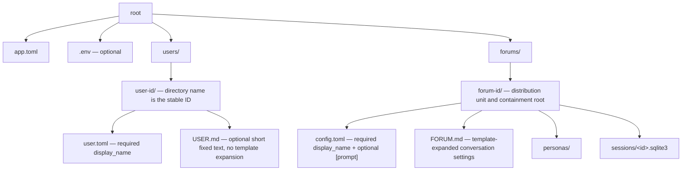
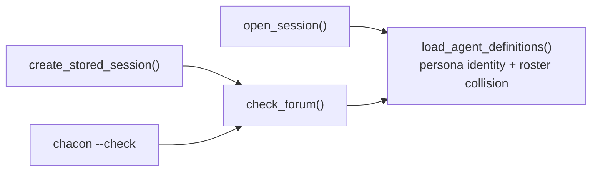
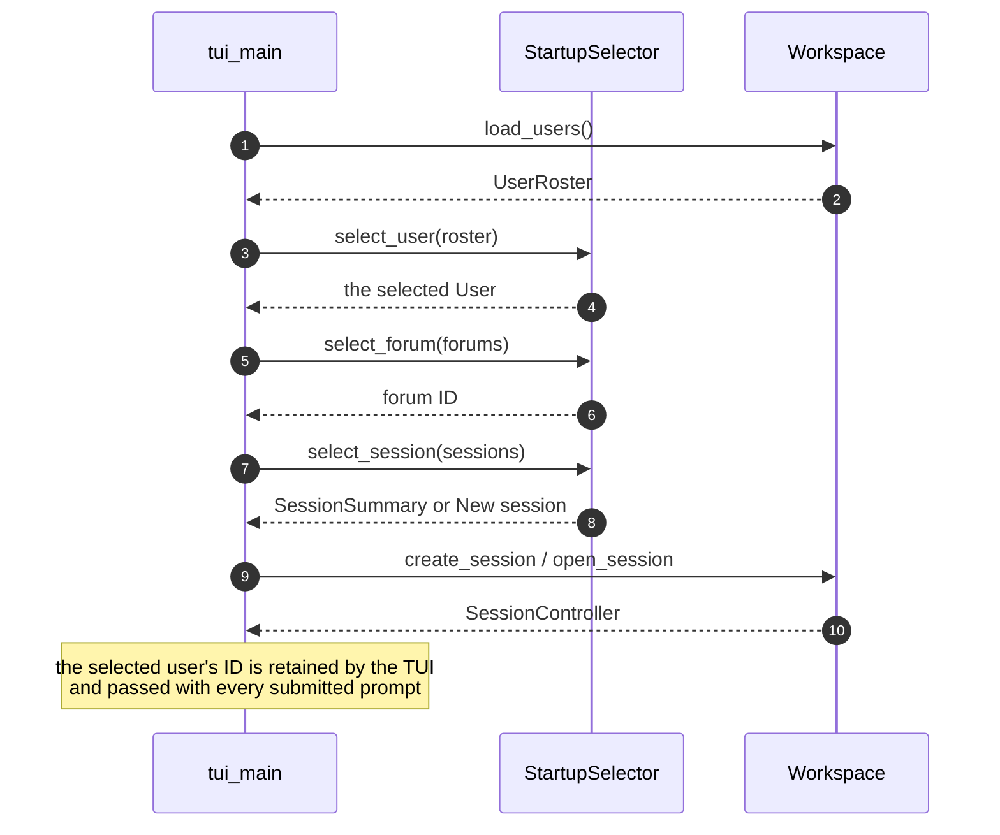

# Users in `cha`, `chacon`, and `chaweb`

This document specifies the addition of a **user** concept. It is a design, not
a changelog: it states the intended end state, the rules that follow from it,
and the file-level change surface.

## Summary

A workspace gains a `users/` directory alongside `forums/`. Each subdirectory
defines one user: a stable ID taken from the directory name, a `display_name`,
and an optional short fixed `USER.md` describing that person's character.

Two ideas carry the whole design:

1. **The roster is static.** Every user in the workspace is concatenated into
   every agent's system prompt, always. The prompt does not depend on who is
   running or who is attached.
2. **Identity rides on the prompt.** Each human message is projected with a
   `from <Name>:` prefix, so an agent knows who is speaking without the prompt
   ever changing.

Everything else follows. Transcripts record a user ID per prompt, and forums and
sessions stay shared, so one session's transcript can hold several users' turns.
On the web that happens within a single live session, one person at a time.

The forum's `USER.md` is renamed to `FORUM.md` and changes meaning: it no
longer describes the human, it describes the settings of the conversation.

## Workspace layout



Four rules, with no exceptions to any of them:

- **Every direct subdirectory of `users/` is a user.** There is no "not really a
  user directory" case to skip past.
- **The directory name is the ID**, and must satisfy the rule in the next
  section.
- **`user.toml` is required**, with a required `display_name`; unknown fields
  are rejected, as in `persona.toml`.
- **`USER.md` is optional**, and absent means empty.

```toml
# users/engineer/user.toml
display_name = "Engineer"
```

Users are listed in lexicographic ID order, matching forum presentation.

**`load_users()` raises everything.** A missing `users/` and an empty one are
the same problem to the operator, with the same fix, so they surface at the same
place with the same kind of message rather than at two different times through
two different call stacks. Nothing is ever skipped quietly: a user omitted from
the roster is invisible, silently changing every prompt in the workspace instead
of removing something anyone would notice. A misspelled `user.toml` must
therefore be an error, not a directory that stops counting as a user.

`Workspace` still refuses to construct unless `forums/` exists, and that
asymmetry is deliberate. The `forums/` check answers "is this directory a
workspace at all", and many operations depend on the answer. `users/` has
exactly one consumer, so its check belongs inside that consumer — which also
leaves `--list-forums` and the lobby's forum list working on a workspace where
no user has been defined yet.

The roster is read once when a session starts — inside `open_session()`,
`create_session()`, and `check_forum()`, on the same path that already re-reads
the forum's own files. Nothing reads it per prompt or per turn.

A live session keeps the roster it started with. Editing `users/` — or adding a
user — does not reach an already-running session; it takes effect when that
session is next opened. This matters most under `chaweb`, where a session can
stay live for hours, so the natural operator assumption — "edit `USER.md`, the
next turn sees it" — is wrong. The rule is the one `FORUM.md` and `SYSTEM.md`
already follow, and it is what makes the prompt static for a session's whole
life.

`Workspace` keeps no cached copy, preserving its documented "immutable after
construction, no lazy caches" property. Caching the roster at construction
would freeze it for the lifetime of a `chaweb` process rather than for the
lifetime of a session, and would make `USER.md` the one prompt file that needs
a restart to take effect while `FORUM.md` and `SYSTEM.md` do not.

## Names

Three name rules apply, and one shared reserved-word set backs all of them.

**User ID** — the directory name — must match a C++ identifier:

```
[A-Za-z_][A-Za-z0-9_]*
```

This is deliberately **stricter** than either existing ID rule, which are not
the same rule as each other:

| ID | Rule | Also permits |
| --- | --- | --- |
| Forum | RFC 3986 unreserved, `is_url_safe_identifier()` (`util/path_name.cpp:25`) | `-` `.` `~`, leading digit |
| Persona | `validate_persona_id()` (`agents/agent.cpp:181`) | `-`, leading digit |
| User | C++ identifier | — |

A user ID is the stable `participant_id` written into every one of that person's
transcript rows, and the identifier form keeps it unambiguous wherever it
appears. It also satisfies `require_path_component()` by construction, so no
`.` or `..` case needs separate handling.

**User display name** — free text. Spaces and punctuation are allowed, so
`Marcus's coach` and non-ASCII names are fine. Five constraints only, the first
three lifted verbatim from `validate_persona_name()`:

- non-empty, with no leading or trailing whitespace
- does not start with `@` or `/` — a user called `@sage` or `/stop` is exactly
  as confusing in a rendered transcript as a persona so named
- not a reserved word (below)
- no control characters or line breaks, since the name is written as a
  `from <Name>:` line and a `### <Name>` roster heading
- **unique across the workspace** under ASCII case-insensitive comparison — it
  is the name the model sees in the roster and in quoted history, so two users
  sharing one would be indistinguishable

**Reserved words** — compared case-folded, and rejected as both a user ID and
any display name:

```cpp
// agents/agent.h — the participant names no configured party may claim.
inline constexpr std::string_view reserved_participant_names[] = {
    "user", "system", "error", "human", "assistant", "agent", "you",
};
```

The set exists because each word already denotes a role in the projected
context or the transcript: `user` and `assistant` are wire roles, `system` and
`error` are the `notice_display_name` and `error_display_name` in
`transcript.h`, and `human`/`agent` are `EntryKind` names.

This constant replaces the `human_speaker_name` literal that
`validate_persona_name()` compares against today (`agents/agent.cpp:23`, used at
`:208`), which is deleted along with the hardcoded JSONL speaker. Persona names
are therefore checked against the whole set rather than against `User` alone —
a small broadening, and the right one: a persona called `System` would be as
ambiguous in a transcript as one called `User`.

## Size expectations

The roster is in every prompt of every forum, so it is deliberately small: a
few lines per user, on the order of a dozen users. This is a documented
expectation, not an enforced limit — a threshold only moves the failure to an
arbitrary number, and no one would ever tune it.

## The `User` value

`User` and `UserRoster` are declared in **`agents/`**, beside `AgentDefinition`
— not in `session/`. `load_agent_definitions()` takes the roster, and
`agents/README.md` forbids `agents/` from depending on `session/`, so the types
must live at or below the agent layer.

This matches the split that layer already documents: `session/` decides *which*
directories to load, `agents/` decides *how*. `Workspace` owns discovery —
scanning `users/`, reading `user.toml` and `USER.md`, enforcing the name rules —
and hands the resulting values down.

```cpp
// agents/user.h — one workspace user. `prompt` is the verbatim contents of
// USER.md; it is never template-expanded.
struct User {
    std::string id;
    std::string display_name;
    std::string prompt;
};

// Every user in the workspace, in lexicographic ID order. Display names are
// unique under ASCII case-insensitive comparison.
using UserRoster = std::vector<User>;
```

`Workspace` gains exactly one operation: **`load_users()`**, returning the
validated roster including workspace-wide name uniqueness.

There is deliberately no `users()` listing and no `load_user(id)`. Every
consumer wants the whole roster — `select_user()` displays names,
`GET /api/v1/users` returns id and display name, `--user` resolves against it,
and prompt assembly needs all of it — so an IDs-only listing would only ever be
the first half of a loop that reassembles what `load_users()` already returns.
`forums()` and `load_forum()` are split because loading a forum is expensive and
independently failable (display name, persona enumeration, non-empty check); a
user directory is two small files, so the same split here would be symmetry with
a shape whose reason does not carry over. The cost of copying it is visible in
`GET /api/v1/forums` (`ui/web/lobby_routes.cpp:73-87`), which spends fifteen
lines on a load-and-recover loop to produce a list of names.

**A naming hazard for implementers.** `user` is already an overloaded word in
this codebase, and the domain type adds a third meaning. None of these are
related:

| Name | Meaning |
| --- | --- |
| `User` (new) | A person defined by `users/<id>/`. |
| `run_user()` in `ui/tui/user.h` | The TUI's top-level chat loop. |
| `UserSession` in `ui/tui/user_session.h` | The TUI's per-session view state. |

Grepping for `user` will hit all three. Renaming the two TUI ones is
defensible but is not part of this change.

## `USER.md` is fixed text

`USER.md` is read verbatim when present, and absent means empty: no template
expansion, no includes, no containment root, and therefore no `[prompt]` scope
in `user.toml`. A user directory is trivially portable because it resolves
nothing.

The rule that keeps this consistent: **there are no `user.*` template variables
anywhere.** `FORUM.md` and `SYSTEM.md` keep exactly the reserved names they
have today (`persona.id`, `persona.display_name`, `forum.id`,
`forum.display_name`). Nothing a forum expands depends on who is present.

`FORUM.md` is otherwise unchanged from the file it replaces: expanded against
the forum containment root, with the base-then-persona `[prompt]` scope from
`personas/persona_defaults.toml` and shared includes under the forum.

## System prompt composition

The effective system prompt is four sections:

| Order | Section | Source | Expanded? |
| --- | --- | --- | --- |
| 1 | Persona character | `personas/<p>/SYSTEM.md` | yes |
| 2 | Conversation settings | `forums/<f>/FORUM.md` | yes |
| 3 | Participant roster | every `users/*/USER.md` | no |
| 4 | Forum context | generated | n/a |

The narrowing is deliberate: who you are, then where you are, then who may be
present, then the mechanical rules for reading the conversation.

Section 3 is the whole roster, in ID order, each entry headed by its display
name:

```
## Participants

### Engineer
<users/engineer/USER.md verbatim>

### Athlete
<users/athlete/USER.md verbatim>
```

Because the roster does not depend on who is running or attached, **the system
prompt is static per forum**. It never needs rebuilding mid-session, which is
what makes several users in one live session cost nothing at the agent layer,
and what lets provider-side prefix caching survive across runs and users.

Section 4 gains one sentence documenting the `from <Name>:` convention, beside
the existing explanation of the shared-history encoding. It still does not name
any current user — it cannot, because the prompt is shared by everyone.

`load_agent_definitions()` takes the roster:

```cpp
std::vector<AgentDefinition> load_agent_definitions(
    const std::vector<std::filesystem::path>& persona_directories,
    const std::filesystem::path& forum_directory,
    std::string_view forum_display_name,
    const UserRoster& users,
    std::optional<std::filesystem::path> base_config_path = std::nullopt);
```

`AgentDefinition` is otherwise unchanged: it carries no user identity. The
*system prompt* does not vary by user — but the request does, because the turn
being answered has an author. That identity rides on `RunSpec`, not on the
definition; see [The turn being answered](#the-turn-being-answered).

## Speaker prefix

Every human message sent as an ordinary `user` message — whether replayed from
history or asked on this very turn — is prefixed with its author's display name
on its own line:

```
from Engineer:
Which of these two designs would you pick?
```

The label is on a separate line so a multi-line prompt cannot fuse with it, and
it is lowercase so it reads as a header rather than the first words of a
sentence. The name is the **display name**, matching both the roster headings
and the `speaker` field of the shared-history JSONL, so the model ties all three
together.

Three rules govern it:

- **Always applied**, whether the workspace has one user or twelve. A mode
  switch would make solo and group sessions project differently for no gain.
- **Projection-time only.** The prefix is never stored in the transcript and
  never rendered. The database keeps clean text and the TUI shows
  `[Engineer] hello`, not `[Engineer] from Engineer: hello`.
- **Plain messages only.** Shared-history entries already carry a `speaker`
  field, so their `text` stays unprefixed.

### The turn being answered

The prompt being answered *right now* never reaches projection as a transcript
entry. `submit_prompt()` snapshots the history before the batch starts
(`session/session_controller.cpp:287-289`), and the live prompt travels
separately as `RunSpec::prompt_text`, appended after the projected messages
(`agents/agent.cpp:283`). Left alone, an agent would learn who authored a
prompt only on the *next* turn, when the entry replays from history — the one
turn where identity matters most would be the one turn without it.

So **`RunSpec` carries the author**:

```cpp
// agents/agent.h — one logical model run.
struct RunSpec {
    RequestId request_id{};
    PersonaInfo target;
    EntryIdentity author;   // new
    std::string prompt_text;
};
```

One value, not two loose strings — the same `EntryIdentity` that
[`make_human_entry()`](#transcript-and-persistence) takes, so the author is
never destructured between the point it is resolved and the point it is stored.
`agents/agent.h` already includes `transcript/transcript.h`, so this adds no
dependency.

`EntryIdentity` and `PersonaInfo` have the same shape and stay distinct anyway.
A run's `target` is a persona and its `author` is a user, and those are the two
things the [name collision](#name-collisions) rules exist to keep apart;
collapsing them into one type to save a declaration would erase the distinction
in exactly the place it matters most. The addressee is converted explicitly in
the named `HumanEntrySpec::addressed_to` field at the call site.

The controller must hold the author on the run in any case, independently of
the prefix. `make_human_entry()` is called from `activate_current_run()`, which
runs synchronously from `start_batch()` for the first run only; every
subsequent run of a multicast batch activates from
[a different public entry point](#one-identity-source), driven by agent
completion events. The author therefore cannot be a local — it must outlive the
submitting call. It goes on `RunSpec` rather than on `ResponseBatch` because
`CompletionInput` is `{history, run}` — the batch is not visible to the agent
layer, so an author held there could not reach the prefix at
`agents/agent.cpp:283`.

That placement does duplicate the identity across a multicast's N runs. The
duplication is real but marginal: `start_batch()` already copies the whole
`prompt_text` into every run, so each `RunSpec` is already a per-run copy of a
far larger string, and the author adds two short ones beside it. Visibility is
the reason for the choice; the cost is simply small enough not to argue with.

`prompt_text` itself stays clean. Pre-prefixing it instead would put the prefix
into every stored entry `activate_current_run()` builds from it — N of them for
a multicast — forcing the clean text to travel separately anyway: two fields
where one suffices, and a contradiction of the projection-time-only rule above.

### Both prefix sites must agree

Two places turn a human message into a `user` message, and both apply the
prefix:

| Site | Message |
| --- | --- |
| `agents/agent.cpp:263` | a replayed human entry addressed to this agent |
| `agents/agent.cpp:283` | the live prompt, from `RunSpec` |

They must produce identical bytes for the same prompt. If only the replay site
prefixed, turn N would send `[system, …history…, P]` and turn N+1 would send
`[system, …history…, P′, A, P2]` with `P′ ≠ P` — so the cached prefix would
diverge one message before the reply, losing exactly the provider-side prefix
caching that the static roster exists to preserve.

`CompletionClient::prepare()` is deliberately not a third site: in test mode it
returns `input.run.prompt_text` verbatim
(`agents/completion_client.cpp:545`), bypassing projection, so test-mode
payloads stay unprefixed and existing byte assertions hold.

### Projection is unchanged

Because identity is in the message, `project_agent_context()`'s predicate is
**unchanged**:

```cpp
(entry.kind == EntryKind::human && entry.addressed_to != agent_id)
|| (entry.kind == EntryKind::agent && entry.participant_id != agent_id)
```

Projection stays purely about addressing: no clause of the predicate mentions
an author, and no message is included or excluded because of who wrote it.
Three things in `agents/agent.cpp` change — the prefix at each of the two sites
above, and the hardcoded JSONL speaker

```cpp
constexpr std::string_view human_speaker_name = "User";   // deleted
```

becomes `entry.display_name`, so quoted human turns are attributed to
`Engineer` or `Athlete` rather than a generic `User`.

Deleting that constant orphans its second use: `validate_persona_name()` at
`agents/agent.cpp:208` compares against it to keep a persona from claiming the
generic human role. That check is **kept**, retargeted at
`reserved_participant_names` from [Names](#names).

## Transcript and persistence

**No schema change and no `user_version` bump.** The `entries` table
(`session/session_database.cpp:366`) already stores per-row identity:

```sql
participant_id TEXT NOT NULL,
display_name   TEXT NOT NULL CHECK (display_name <> ''),
```

Human entries already populate both, from the hardcoded constants in
`transcript/transcript.h:17-18`:

```cpp
inline constexpr std::string_view human_participant_id = "human";
inline constexpr std::string_view human_display_name = "You";
```

Both constants are deleted. `make_human_entry()` gains the author's
`participant_id` and `display_name`, supplied at the call site in
`SessionController` (`session/session_controller.cpp:353`). Storing the display
name per entry is the established denormalization for agents: renaming a user
later leaves historical entries under the old name, which is correct — that is
what was shown at the time.

**Pass the two identities through named fields, not as positional strings.** The signature
already carries `addressed_to` and `addressed_to_name`, and `ParticipantId` is
an alias for `std::string` (`transcript/transcript.h:15`), so adding the author
naively yields four adjacent same-typed parameters that the compiler cannot tell
apart:

```cpp
// Rejected — author and addressee are silently transposable.
make_human_entry(id, author_id, author_name, addressed_to, addressed_to_name, text, …);
```

Grouping each pair keeps each ID next to its display name. A containing spec
lets the call site designate `author` and `addressed_to` instead of relying on
the order of two same-typed identities — a bug that would otherwise show up
only on reread, long after the session:

```cpp
struct EntryIdentity {
    ParticipantId id;
    std::string display_name;
};

struct HumanEntrySpec {
    EntryId id{};
    EntryIdentity author;
    EntryIdentity addressed_to;
    std::string text;
    std::optional<RequestId> request_id;
};

TranscriptEntry make_human_entry(HumanEntrySpec spec);
```

`make_agent_entry()` has the same shape and may adopt `EntryIdentity` for its
own `participant_id`/`display_name` pair, but that is tidying, not required by
this change.

Because `participant_id = 'human'` matches no user directory, the checked-in
sessions under `workspace/forums/*/sessions/` are deleted rather than
reinterpreted.

## Name collisions

Users and personas share one `participant_id` namespace in stored entries, and
one display-name namespace in the roster and quoted history. A collision makes
a transcript ambiguous, so it is refused rather than resolved.

Since every user is in every prompt, the check is the whole roster against the
forum's personas:

| Conflict | Comparison |
| --- | --- |
| any `user.id` vs. any persona ID | exact |
| any `user.display_name` vs. any persona display name | ASCII case-insensitive, matching `ForumPersonas` |

**The check belongs in `load_agent_definitions()`**, which is the only point all
three entry paths share. Putting it in `check_forum()` instead would leave the
most important path unguarded: `Workspace::open_session()` calls `load_forum()`
and `load_definitions()` directly (`session/workspace.cpp:284` and `:291`) and never
reaches `check_forum()` — only `create_stored_session()` does
(`session/workspace.cpp:260`). A colliding forum would then open silently and
build ambiguous prompts on every reopen, which is the common case for both web
and the TUI.



The agent layer is also where the check belongs on its own merits: it already
owns `validate_persona_id()` and `validate_persona_name()`, and it holds both
the roster and the parsed persona configs at that moment.

Either conflict throws a plain `std::runtime_error` naming both sides, exactly
as an invalid persona configuration does today. **No new exception type, and no
per-front-end mapping.**

The two dedicated types this codebase has — `ForumNotFoundError` and
`SessionNotFoundError` — earn their place by a property a collision does not
share: they are client-triggerable and need a distinct response, a 404 for a
request naming something that does not exist. A collision is not reachable by
any request. It is the workspace on disk being wrong, it fails identically on
every open until a file is edited, and the operator who caused it is the only
person who will ever see it. That is the same category as `"Persona 'x' has
invalid configuration"`, which is a plain `runtime_error`.

Existing generic handling carries it: the web owner thread already ends at
`catch (...)` (`ui/web/session_registry.cpp:502-505`), which logs
`startup_failed` and fails the start cleanly. The cost is a 500 where a bespoke
type could have produced a 409 — worth one less exception class and three
mapping paths. If `chaweb` ever gains real clients, that judgement is worth
revisiting; the rule to apply then is the one above, not "important errors get
types".

`chacon --check <forum>` reports collisions **without** taking a `--user`,
because the roster is workspace state rather than a run parameter.

## Terminal front ends

Each terminal run selects one user. Because the prompt no longer depends on that
choice, the selection means exactly one thing: **the author this process stamps
on every prompt it submits.**

### One identity source

No session holds a user. Every prompt carries its author, and all three front
ends already reach the controller through one funnel: the free function
`handle_text_input()` in `ui/text/text_input.cpp`, called by the TUI
(`ui/tui/user_session.cpp:156`), the console
(`ui/console/console_session.cpp:144`), and the web adapter
(`ui/web/web_session_runtime.cpp:153`). The author is threaded through it:

```cpp
// ui/text/text_input.h
[[nodiscard]] SessionUpdate handle_text_input(
    SessionController& controller,
    std::string_view author_id,
    std::string input);
```

There is deliberately no `SessionController::handle_raw_input()`. That name
belongs to the web's `WebSessionController` interface
(`ui/web/web_session_runtime.h:43`), which gains the author and forwards it into
this same funnel.

`handle_text_input()` passes the author only to the calls that start a batch:

| `SessionController` entry point | Reached from |
| --- | --- |
| `submit_prompt(author_id, text, handle)` | an ordinary or `@`-addressed line |
| `start_multicast(author_id, text, handles)` | `/mcast` |
| `start_multicast_by_ids(author_id, text, ids)` | programmatic clients — currently uncalled, but it starts a batch, so it takes the author on the same terms |

Commands that start no batch — `/clear`, `/hide*`, `/info`, `/agents`, `/stop`,
`/exit`, `/@Name` — are untouched, since nothing they do is attributed to
anyone.

The private `resolve_author()` helper resolves `author_id` against the roster
the session opened with. Both ordinary and multicast paths call it before
copying completion history, so an unknown ID is cheap: it starts no batch and
returns `Unknown user ID '<id>'` as a `SessionUpdate::notice`, the same shape as
an unknown multicast target. The policy still has one implementation for every
front end.

Otherwise the controller takes the display name from the roster and **stores
both on every `RunSpec` of the batch** — it does not hand them down the call
stack. `make_human_entry()` runs from
`activate_current_run()`, which for every multicast run after the first is
reached from a *different public entry point*, one or more event-loop
iterations later:

```
receive_events()  →  apply(AgentCompleted&)  →  finish_batch_run()
                  →  start_next_batch_run()  →  activate_current_run()
```

By then `submit_prompt()` or `start_multicast()` has long returned and its
locals are gone, so the author must live on the batch. It rides on `RunSpec`
for the reason given in
[The turn being answered](#the-turn-being-answered): the same field also feeds
the prefix on the live prompt, so one value serves both.

A batch never spans two authors. `submit_prompt()` refuses while `busy()`, so a
second person's prompt cannot interleave with a multicast in flight, and all N
of its entries are attributed to the one author who started it.

The terminal passes its selected user's ID on every submission; `chaweb` passes
the ID from the request body. Same path, same validation, same failure.

The alternative — storing the selected user on the controller and passing it to
`open_session()` — cannot serve `chaweb`, where several people use one live
session in turn, without reopening it between authors. That design would need a
*second* mechanism for per-prompt authorship
anyway, leaving an optional held user, two ways to learn an author, and a rule
for which one wins.

Three consequences follow, and they are why this shape was chosen:

- `open_session()` and `create_session()` take **no** user parameter. They load
  the roster internally, which they must do for prompt assembly regardless.
- `SessionRegistry::from_workspace()` is therefore untouched — its factory calls
  `open_session(forum, session_id, notifier)` exactly as it does today.
- The rule "an author must be in this session's roster" is enforced in one
  place for every front end.

The TUI carries only the selected user's stable ID down to the submission point
through `run_user()` and `UserSession`; prompt text and display name stay out of
the live UI state.

### `cha` (TUI)



`StartupSelector::select_user()` reuses the existing private `select()` helper,
is handed a `UserRoster`, and displays `display_name`. It is symmetric with
`select_forum()`: cancellation is an error, and the selector never reaches into
user storage itself.

Forum and session listings are unaffected by the chosen user. Sessions are
shared, so the session list is the whole forum's, regardless of who has spoken
in each one.

### `chacon` (console)

`ConsoleOptions` gains one field, `std::string user`, set by `--user <id>`.

`--user` is a **hard error when omitted** for anything that starts a chat:
`--user is required`, exit code 2, consistent with the existing `--forum is
required`. It is not required — and is not accepted — for `--list-forums`,
`--list-sessions`, or `--check`.

There is deliberately **no `--list-users`**. The flag takes a directory name, so
`ls users/` already answers the question, and the TUI's selection screen covers
the human case. Adding a listing that prints display names would also print the
one thing `--user` does not accept.

## Web front end

Because the prompt is static and identity rides on the message, `chaweb` needs
no user in its session lifecycle at all.

**The browser sends the user ID with each prompt.** The lobby gains a user
screen first, in the same order as the TUI — user, then forum, then session —
and the choice is kept in browser state:

```
GET  /api/v1/users                 →  [{"id": "engineer", "display_name": "Engineer"}, …]
POST /api/v1/.../input             ←  {"user": "engineer", "text": "…"}
```

The `user` field carries the **ID only** — never the display name, so a client
cannot send `"Engineer"`. The route checks that the field is there and
non-empty, and nothing else:

| Body | Result |
| --- | --- |
| `user` omitted | 400 — the field is required |
| `user` present but empty | 400 |
| `user` not in this session's roster | 200, and the controller answers with a notice |

### The route does not know what a user is

`POST /api/v1/input` is a pass-through (`ui/web/session_routes.cpp:139-155`):
it validates the key, the content type, the JSON shape, and the prompt size,
then hands the command to the runtime. It performs no semantic validation at
all — an unknown `@handle`, an unknown `/mcast` target, and an unknown command
all reach the controller and come back as notices. The route has no `Workspace`
and no idea what a persona is.

An unknown user is the same kind of mistake and gets the same treatment, so
`SessionRoutes` gains **no roster, no `Workspace` dependency, and no new
check** beyond the presence one above.

The check that matters happens where it is free. The controller must resolve
the author against its roster anyway, to get the display name for
`make_human_entry()`; a resolution that can fail *is* the check. The ordinary
and multicast paths use the same private `resolve_author()` helper before
capturing history, and an unrecognised ID produces a notice, exactly as
`"Unknown multicast target ID"` does today:

```
Unknown user ID 'engneer'
```

This is also the stronger guarantee. The roster the controller resolves against
*is* the one its prompt was assembled from, so "never accept a prompt from
someone the model was never told about" holds by construction rather than by
copying the roster to another thread and arguing it cannot diverge. Nothing is
bound to a runtime, and the "a live session keeps the roster it started with"
rule applies here as everywhere: a user added to `users/` mid-session gets that
notice until the session is reopened.

Notices already reach the browser — `apply_notice()` stores one and
`publish_change()` pushes it into the snapshot and the SSE stream
(`ui/web/web_session_runtime.cpp:520-523`, `:616`) — so this costs no new
transport.

`GET /api/v1/users` keeps its fresh read. It serves the lobby, where the choice
is made before a session exists, and the session page's user switcher, which is
a convenience rather than an authority. `SessionSnapshot` therefore does **not**
carry a roster. Transcript labels need nothing either: `web::TranscriptEntry`
(`ui/web/protocol.h:48`) already carries `participant_id` and `display_name`.

`WebSessionController::handle_raw_input()` gains the author and forwards it to
`handle_text_input()` — literally the same funnel the TUI and console use, not
merely an analogous one. See [One identity source](#one-identity-source).

Untouched as a result: `SessionKey`, `RegistryControllerFactory`,
`RegistryMetadataFactory`, `WebSessionMetadata`, `WebSessionRuntime`,
`session_registry.cpp` in its entirety, `try_reattach()`,
`create_stored_session()`, `check_session()`, every URL, the SSE stream, the
shutdown coordinator, and session-limit accounting.

### Out of scope: concurrent browsers

Two people using one live session **at the same time** is a transport limit,
not a user-model limit, and is not addressed here. `SseMailbox` holds a single
`active_stream_` (`ui/web/sse_mailbox.h:51`) and `BrowserConnectionState` a
single `active_connection_id_` (`ui/web/browser_connection_state.h:23`).
Supporting several attached browsers needs a mailbox per connection with
owner-side fan-out, connection tracking keyed by connection ID, unload deferred
until the last connection drops, and per-connection rather than shared notices.

With this design and today's transport, web users take turns at the page, and
each one's prompts are correctly attributed.

## Rendering

`ui/render/transcript_writer.cpp:26` hardcodes the human label:

```cpp
return show_addressing ? "[You → " + entry.addressed_to_name + "] " : "[You] ";
```

It becomes `entry.display_name`, making the human branch structurally identical
to the agent branch: `[Engineer → Sage]` and `[Engineer]`. Every participant is
then labelled by the name stored on its own entry, which is what makes another
user's turns visibly theirs on reread. `show_addressing()` is unchanged — it
keys off personas and addressing, not identity.

## Accepted limitations

Recorded so they are not rediscovered as bugs.

- **Every agent in every forum sees every user's description.** The roster is
  workspace-wide; `users/` is a shared cast list, not a set of private profiles.
- **The author is checked in the controller, not at the HTTP boundary.** This
  is right only because the field is an attribution rather than a credential —
  see the next point. If `chaweb` ever gains authentication, the check moves to
  the boundary, and the roster has to reach it: that is the work this design
  deliberately does not do now.
- **A user can spoof a speaker** by typing `from Athlete:` into a prompt. The
  JSONL block is escaped and safe; the plain-text prefix is not. Acceptable for
  a local, hand-authored workspace.
- **Any client can claim any user ID.** `chaweb` has no authentication, here or
  anywhere else. The user field is an attribution, not a credential.
- **Display names may contain Markdown.** A user named `# Engineer` renders
  oddly under the `### <Name>` roster heading. Controls, line breaks, and
  boundary whitespace are excluded, but Markdown punctuation is the author's
  problem to avoid.

## Change surface

| File | Change |
| --- | --- |
| `agents/user.h` | New. `User` and `UserRoster` — in `agents/`, since `load_agent_definitions()` takes the roster and `agents/` may not depend on `session/`. No new exception type. |
| `session/workspace.h/.cpp` | `load_users()` and nothing else. It reads every subdirectory of `users/`, requires `user.toml`, treats a missing `USER.md` as empty, and raises on a missing or empty `users/` — construction is unchanged. ID, display-name, and uniqueness validation; roster passed to definition loading. No user parameter on `open_session()` / `create_session()`. |
| `session/session_controller.h/.cpp` | Hold the session's `UserRoster`; `submit_prompt()`, `start_multicast()`, and `start_multicast_by_ids()` gain `author_id` (with the private multicast and batch helpers following). One private `resolve_author()` implements roster resolution before either path copies history, answering an unknown ID with a notice; the resolved identity is stored on every `RunSpec`, so it survives deferred activation and reaches `make_human_entry()`. `prompt_text` is left clean. |
| `transcript/transcript.h/.cpp` | Delete both human constants; add `EntryIdentity` and named `HumanEntrySpec`; production call sites designate `author` and `addressed_to` rather than passing two same-typed positional identities. |
| `agents/agent.h/.cpp` | `UserRoster` parameter; roster section third; roster↔persona collision check in `load_agent_definitions()`; `FORUM.md` in place of forum `USER.md`; `EntryIdentity author` on `RunSpec`; `from <Name>:` prefix on plain human messages at **both** sites — replayed entries (`:263`) and the live prompt (`:283`), producing identical bytes; `reserved_participant_names` in place of `human_speaker_name`, retargeting `validate_persona_name()`; JSONL speaker from `display_name`; roster/prefix sentence in the generated context. |
| `ui/text/text_input.h/.cpp` | `handle_text_input()` gains `author_id` and forwards it to the three batch-starting controller calls. This is the one funnel all three front ends already share, so it is where the author enters the session layer; every other command is untouched. |
| `ui/render/transcript_writer.cpp` | Human label from `entry.display_name`. |
| `ui/tui/startup_selector.h/.cpp` | `select_user()`. |
| `ui/tui/user.h/.cpp`, `user_session.*` | Carry only the selected user's stable ID to the submission point. |
| `ui/console/console_startup.h/.cpp` | `--user` and required-user validation. |
| `apps/tui_main.cpp` | User screen first; retain the selected ID for submission. |
| `apps/console_main.cpp` | Resolve `--user` by lookup in `load_users()`; an unknown ID reports the bad value and exits 2, like any other rejected flag value. |
| `ui/web/json.h/.cpp` | `parse_input_command()` parses `user` and rejects it when omitted or empty. `session_routes.cpp` is otherwise untouched: no roster, no `Workspace`, no semantic check. |
| `ui/web/lobby_routes.cpp` | `GET /api/v1/users`. |
| `ui/web/web_session_runtime.*` | Author on `WebSessionController::handle_raw_input()`, forwarded to `handle_text_input()`. Nothing else — no roster on the runtime. |
| `ui/web/asset_handler.cpp` | Lobby placeholder gains the user screen, if the lobby is not purely API-driven. |
| `workspace/` | Add `users/`; rename every `USER.md` to `FORUM.md`; delete stored sessions. |
| `tests/**` | Seven test files write `USER.md` by hand; see [Tests](#tests). |
| `README.md`, `src/*/README.md` | Layout, prompt composition, name rules, prefix convention, flag documentation, and one line recording that pre-existing sessions are deleted rather than migrated. |

### Workspace content

The general rule for every forum: **rename `USER.md` to `FORUM.md`, and move
any person-description out of it into `users/`.** For the three checked-in
forums that resolves to:

| Forum | Outcome |
| --- | --- |
| `stoics` | Split — see below. |
| `hall` | Rename only. "You are talking with the user in the hall. Be helpful and friendly." is entirely conversation settings. |
| `lobby` | Rename only. "You are talking with the user in the lobby forum. Be helpful and friendly." likewise. |

`workspace/forums/stoics/USER.md` is already two files' worth of material and
divides cleanly:

- Reader background, familiarity with the material, preference for candid
  corrections → `users/<id>/USER.md`.
- "Conversational relationship: … addresses the user as a serious
  correspondent — not as a disciple, client, or historical Roman. … no prior
  personal history should be invented." → `forums/stoics/FORUM.md`.

The stoics text currently reads "You addresses the user as a serious
correspondent". No persona in that forum is named `You` — they are Seneca,
Epictetus, and Marcus Aurelius — so this is a plain grammar slip, and the
migration fixes it to "You address the user" rather than carrying it across.

## Tests

| Test | Change |
| --- | --- |
| `tests/support/test_workspace.cpp` | Fixtures create `users/`; helper to add a user. |
| `tests/session/unit_workspace.cpp` | Roster discovery and ordering; non-identifier IDs; reserved and `@`/`/`-leading names; a missing and an empty `users/` both raising from `load_users()`; duplicate display names; a subdirectory without `user.toml` raising rather than being skipped; a missing `USER.md` giving an empty prompt; **both collision forms through `open_session()`, not only `check_forum()`**. |
| `tests/agents/unit_agent_definition_loader.cpp` | Four-section order; roster assembly and ordering; `FORUM.md` expansion unchanged; `USER.md` verbatim, including text that would otherwise expand; the assembled prompt is byte-identical regardless of which user later submits — the lock on the static-prompt invariant. |
| `tests/agents/unit_agent_context.cpp` | Prefix on plain human messages; **prefix on the live `RunSpec` prompt, byte-identical to the same prompt replayed from history on the next turn** — the lock on prefix-cache continuity; absence of the prefix in JSONL `text`; JSONL speaker labels; two users in one transcript; interaction with addressing and the off-record span. |
| `tests/ui/console/unit_console_startup.cpp` | `--user` parsing, missing-user exit code 2, `--user` rejected with listing modes and `--check`. |
| `tests/transcript/unit_transcript.cpp` | `make_human_entry()` stores the author on `participant_id`/`display_name` and the addressee separately — the check that the two identities are not swapped. |
| `tests/ui/text/unit_text_input.cpp` | The author reaches `submit_prompt()` and both multicast forms; commands that start no batch are unaffected by it. |
| `tests/session/unit_session_controller.cpp` | Each batch-starting call stamps the given author; an unknown author yields a notice and starts no batch — the single authorization point, exercised for both the ordinary and the multicast path; a multicast attributes every one of its N entries to that author across deferred activations; the stored entry text carries no prefix. |
| `tests/ui/render/*` | `[Engineer]` / `[Engineer → Sage]` labels. |
| `tests/ui/tui/*` | The selected author ID reaches submission through `UserSession`. |
| `tests/integration/console_process_test.cpp` | End-to-end run with `--user`; `--check` without one, including a reported collision. |
| `tests/ui/web/unit_session_routes.cpp` | `user` accepted and attribution reaches the transcript; omitted and empty each rejected with 400; an out-of-roster ID is *not* rejected by the route. |
| `tests/ui/web/unit_lobby_routes.cpp` | `GET /api/v1/users`. |

New: `tests/session/unit_user_loader.cpp` for `user.toml` field validation,
`USER.md` reading including its absence, the ID and display-name rules
(including Unicode controls, line separators, and boundary whitespace), and
workspace-wide name uniqueness, mirroring `unit_config_loader.cpp`.

Seven existing test files write a forum `USER.md` by hand and must move to
`FORUM.md`: `unit_agent_definition_loader.cpp`, `console_process_test.cpp`,
`unit_concurrent_controllers.cpp`, `unit_session_catalog.cpp`,
`unit_workspace.cpp`, `test_workspace.cpp`, and `unit_console_startup.cpp`.
Most of them only need the fixture rename; `test_workspace.cpp` is where the
`users/` scaffolding belongs so the others inherit it.

## Decisions taken

Recorded because each had a defensible alternative that was considered and
rejected.

| Decision | Rejected alternative |
| --- | --- |
| The whole roster is in every prompt, always. | Only the run's user, or only attached users — both make the prompt vary by who is present, forcing mid-session prompt rebuilds and defeating prefix caching. |
| Identity travels as a `from <Name>:` prefix. | Splitting projection by author, which complicates the predicate that `agents/README.md` is built around. Carrying a display name for the prefix is not that: it threads a label through `CompletionInput` and leaves the predicate untouched. |
| The projection predicate is unchanged. | A third axis on the human clause, made unnecessary by the prefix. |
| `RunSpec` carries the author, so the turn being answered is attributed on the turn it is asked. | Leaving the live prompt bare, which would attribute it only on replay — no identity on the one turn where it matters most. |
| `prompt_text` stays clean; the prefix is applied at projection. | Pre-prefixing `prompt_text` in the controller, which would store the prefix in every entry built from it — N of them per multicast — and force the clean text to travel as a second field anyway. |
| `USER.md` is fixed text. | Full template expansion, symmetric with `FORUM.md`, which would force `user.*` variables and a user-aware `--check`. |
| The generated forum context names no current user. | Naming them, which cannot be correct for a prompt shared by every user of the forum. |
| User IDs are C++ identifiers, stricter than both existing ID rules. | Reusing either for symmetry — the forum rule would allow `-`, `.`, `~`, and leading digits in the value written into every transcript row; the persona rule would allow `-` and leading digits. Neither is one rule to be symmetric *with*. |
| Display names are free text minus a reserved set. | Applying the identifier rule to them too, which would forbid spaces and non-ASCII names for no benefit — the name is prose in a prompt, not a token. |
| One reserved-word set covers users, personas, and the `validate_persona_name()` check. | Keeping the persona check at the literal `User`; a persona named `System` or `Error` is ambiguous for the same reason. |
| Every prompt carries its author; no session holds a user. | Storing the selected user on the controller, which cannot serve `chaweb` and would leave an optional held user plus a per-prompt author — two ways to learn the same fact. |
| The collision check lives in `load_agent_definitions()`. | `check_forum()`, which `open_session()` never calls — the reopen path, and the one every web session takes, would build ambiguous prompts unchecked. |
| `User` and `UserRoster` are declared in `agents/`. | `session/`, which `agents/` may not depend on while taking the roster as a parameter. |
| A collision is a plain `runtime_error`; the design adds no exception type. | `UserForumConflictError` with per-front-end mappings. The two existing dedicated types are client-triggerable 404s; a collision is a misconfigured workspace, which is what `runtime_error` already carries everywhere else. |
| `load_users()` is the only roster operation. | `users()` plus `load_user()` for symmetry with `forums()` / `load_forum()` — a split that exists because loading a forum is expensive and independently failable, which is not true of two small files, and which every consumer would immediately undo by reassembling the roster. |
| Every subdirectory of `users/` is a user, and `load_users()` raises on anything wrong. | Skipping directories that lack a `user.toml` as "not really users". That reintroduces the failure the loud rule exists to prevent: a misspelled `user.toml` would silently drop a person from the roster and change every prompt in the workspace with no visible symptom. |
| The author is checked only in the controller, against the roster its prompt was built from, and an unknown one is a notice. | Validating in `SessionRoutes` against a roster copied onto `WebSessionRuntime`. It would be the only semantic check in a route layer that has none, it needs awkward wiring through `owner_main()` to get the roster there, and it duplicates a resolution the controller performs regardless — the display-name lookup for `make_human_entry()` already fails on an unknown ID. |
| No `--list-users`. | Mirroring `--list-forums`, which prints display names — the one thing `--user` does not accept. |
| Stored sessions are deleted rather than reinterpreted. | Mapping legacy `participant_id = 'human'` onto a designated user. |
| Web takes the user per prompt; concurrent browsers stay out of scope. | Binding a user to a live runtime, which would refuse a second person entirely rather than deferring only the transport work. |
