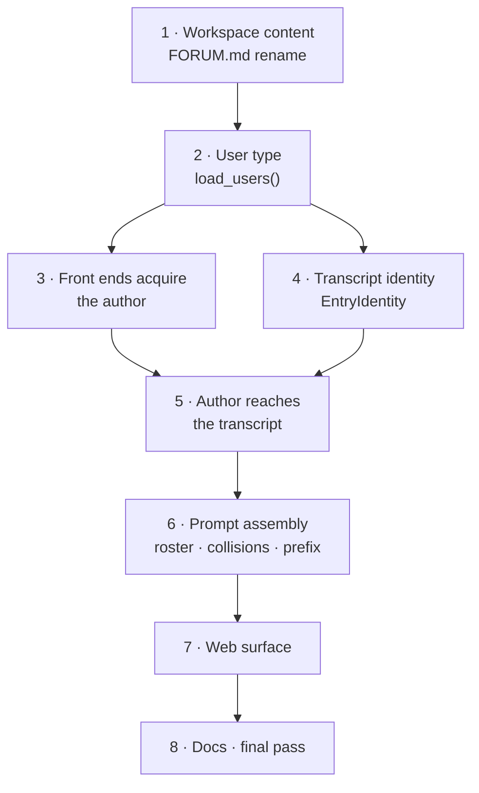

# Implementation plan: users in `cha`, `chacon`, and `chaweb`

Execution plan for [`user-design.md`](user-design.md). The design states the end
state; this states the order, and why that order and not another.

## How to use this

Eight blocks, strictly sequential. **Each block leaves the tree building and the
full suite green**, so every block is a commit and a stopping point. A block is
sized for one session: bounded file set, one idea, one verification step.

Read the design section linked from each block before starting it. The design is
authoritative on *what*; this document is authoritative on *when*, and on the
handful of temporary states that exist only between blocks.

### Commands

```bash
make build                     # cmake --preset ninja && cmake --build --preset ninja
make test                      # ctest --test-dir build/ninja --output-on-failure
ctest --test-dir build/ninja --output-on-failure -R <regex>   # one block's tests
make itest                     # integration binary, from workspace/
```

Warnings are errors (`cha_enable_warnings`). An unused parameter will fail the
build — relevant in blocks 3 and 5, where a value is introduced before its
consumer.

### Ground rules

- **No backward compatibility.** No migration paths, no legacy formats, no
  deprecation shims. Delete and replace.
- **Green at every block boundary.** If a block cannot end green, it is drawn
  wrong — re-cut it rather than carrying a broken tree forward.
- **Two deliberate temporary states exist**, both created and removed within
  this plan: the author value carried but unused after block 3, and the literal
  `{"human", "You"}` at one call site after block 4. Both are called out where
  they appear. There are no others.

### Order



The shape of the sequence: rename first (pure mechanics), then build the value
(`UserRoster`), then let each layer acquire it without using it, then flip the
consumers on. The two heavy blocks — 4 (volume) and 6 (semantics) — are
deliberately separated so neither lands in a session already full.

---

## Block 1 — Workspace content and the `FORUM.md` rename

**Goal.** The forum's `USER.md` becomes `FORUM.md` and changes meaning.
Workspace data is migrated. No new C++ concepts.

**Why first.** It is a pure rename with one code line behind it, it touches
seven test files that later blocks also touch, and doing it first means every
later block reads a workspace that already has the final shape. Nothing here
depends on anything else in the plan.

Design: [`USER.md` is fixed text](user-design.md#usermd-is-fixed-text),
[Workspace content](user-design.md#workspace-content).

**Files**

| File | Change |
| --- | --- |
| `src/agents/agent.cpp:91,95` | `forum_directory / "USER.md"` → `"FORUM.md"`, and the error message with it |
| `workspace/forums/{hall,lobby,stoics}/USER.md` | → `FORUM.md` |
| `workspace/users/` | New; created here so later blocks find it |
| `workspace/forums/*/sessions/*.sqlite3` | Deleted (11 files) |
| `tests/support/test_workspace.cpp` | Fixture writes `FORUM.md` |
| `tests/session/unit_workspace.cpp` | ditto |
| `tests/session/unit_concurrent_controllers.cpp` | ditto |
| `tests/session/unit_session_catalog.cpp` | ditto |
| `tests/agents/unit_agent_definition_loader.cpp` | ditto |
| `tests/ui/console/unit_console_startup.cpp` | ditto |
| `tests/integration/console_process_test.cpp` | ditto |

**Steps**

1. `git mv` each forum's `USER.md` to `FORUM.md`.
2. Change the read in `agent.cpp` and its error text.
3. Split `workspace/forums/stoics/FORUM.md`: the reader background, familiarity
   with the material, and preference for candid corrections move out to
   `workspace/users/<id>/USER.md`; the conversational-relationship paragraph
   stays. Fix "You addresses the user" → "You address the user" rather than
   carrying the slip across.
4. `hall` and `lobby` are rename-only — their text is already entirely
   conversation settings.
5. Create `workspace/users/<id>/user.toml` with `display_name` for the user the
   stoics text implies. Nothing reads it until block 6; it is placed now so the
   data migration is one commit.
6. Delete the 11 stored sessions. `participant_id = 'human'` matches no user
   directory, so they are not reinterpretable.
7. Rename in the seven test fixtures. Most are a single string literal.
8. Update `USER.md` mentions in `src/README.md`, `src/agents/README.md`,
   `src/session/README.md` that refer to the *forum* file.

**Verify.** `make build && make test` — the full suite, unchanged in behavior.

**Hazard.** Do not touch `src/transcript/README.md` or anything describing a
*user* `USER.md`; only the forum-level file is renamed.

---

## Block 2 — `User`, `UserRoster`, and `load_users()`

**Goal.** The roster exists and validates. Nothing consumes it yet.

**Why here.** Every later block needs the type and the loader. Because no
caller exists, the block is self-contained and its tests are pure unit tests.

Design: [Workspace layout](user-design.md#workspace-layout),
[Names](user-design.md#names), [The `User` value](user-design.md#the-user-value).

**Files**

| File | Change |
| --- | --- |
| `src/agents/user.h` | New. `User { id, display_name, prompt }`, `using UserRoster = std::vector<User>` |
| `src/agents/agent.h` | Add `reserved_participant_names[]` |
| `src/session/workspace.h/.cpp` | `load_users()` |
| `tests/support/test_workspace.h/.cpp` | `users/` scaffolding, `add_user()` helper |
| `tests/session/unit_user_loader.cpp` | New |
| `CMakeLists.txt` | Register the new test source near line 326 |

**Steps**

1. `src/agents/user.h`. Header-only — no `CMakeLists` source entry needed.
2. `reserved_participant_names` in `agents/agent.h`:
   `{"user", "system", "error", "human", "assistant", "agent", "you"}`.
   **Add it only.** `human_speaker_name` and `validate_persona_name()` are
   retargeted in block 6, where the JSONL speaker changes at the same time.
3. `Workspace::load_users()`, and nothing else — no `users()`, no
   `load_user(id)`. Four rules, no exceptions:
   - every direct subdirectory of `users/` is a user;
   - the directory name is the ID, matching `[A-Za-z_][A-Za-z0-9_]*`;
   - `user.toml` is required, `display_name` required, unknown fields rejected;
   - `USER.md` is optional, absent means empty.
4. The loader raises on a missing `users/`, an empty one, and any malformed
   entry. Nothing is skipped. `Workspace` construction is **unchanged** — the
   `forums/` check stays, no `users/` check is added.
5. Display-name rules: non-empty, no leading/trailing whitespace, no leading
   `@` or `/`, no control characters or line breaks, not a reserved word
   (case-folded), and unique across the workspace under ASCII case-insensitive
   comparison.
6. Return in lexicographic ID order.
7. `tests/session/unit_user_loader.cpp`, mirroring `unit_config_loader.cpp`:
   field validation, `USER.md` present and absent, ID rules, display-name rules,
   uniqueness.
8. Extend `tests/session/unit_workspace.cpp`: missing and empty `users/` both
   raising, a subdirectory without `user.toml` raising rather than being
   skipped, ordering, duplicate display names.

**Verify.** `ctest ... -R "user_loader|workspace"`, then `make test`.

**Hazard.** `user` is overloaded three ways in this tree — the new `User`,
`run_user()` in `ui/tui/user.h`, and `UserSession` in `ui/tui/user_session.h`.
Grep results will mix all three. The TUI names are not renamed.

---

## Block 3 — Front ends acquire the author

**Goal.** Each front end obtains a user ID and holds it. Nothing passes it
downward yet.

**Why here.** Splitting acquisition from consumption is what keeps block 5 to
one session. Each front end's selection path is independent work with its own
tests, and none of it needs the transcript or controller changes.

**This block ends with a value held but unused.** That is intentional and
lasts exactly one block. Store it in a member or a struct field — an unused
*parameter* will fail the warnings-as-errors build.

Design: [`cha` (TUI)](user-design.md#cha-tui),
[`chacon` (console)](user-design.md#chacon-console),
[Web front end](user-design.md#web-front-end).

**Files**

| File | Change |
| --- | --- |
| `src/ui/tui/startup_selector.h/.cpp` | `select_user(const UserRoster&)`, reusing the private `select()` helper |
| `src/apps/tui_main.cpp` | `load_users()` → user screen first, then forum, then session; retain the `User` |
| `src/ui/tui/user.h/.cpp`, `user_session.h/.cpp` | Carry the selected `User` to the submission point |
| `src/ui/console/console_startup.h/.cpp` | `ConsoleOptions::user`, `--user <id>` |
| `src/apps/console_main.cpp` | Resolve `--user` against `load_users()` |
| `src/ui/web/json.h/.cpp`, `protocol.h` | `parse_input_command()` parses `user` into `RawCommand` |
| `tests/ui/tui/unit_startup_selector.cpp` | New; register in `CMakeLists.txt` near line 340 |
| `tests/ui/console/unit_console_startup.cpp` | `--user` parsing and rejection |
| `tests/ui/web/unit_session_routes.cpp`, `unit_protocol.cpp` | 400 on omitted and empty `user` |

**Steps**

1. `select_user()` is symmetric with `select_forum()`: takes the roster,
   displays `display_name`, cancellation is an error, and the selector never
   reads user storage itself.
2. `tui_main` orders the screens user → forum → session.
3. Thread the `User` through `run_user()` into `UserSession` as a member. It is
   unused this block.
4. `--user` is a hard error when omitted for anything that starts a chat:
   `--user is required`, exit 2, matching `--forum is required`. It is not
   accepted with `--list-forums`, `--list-sessions`, or `--check`. There is no
   `--list-users`.
5. `console_main` resolves the ID by lookup in `load_users()`; an unknown ID
   reports the bad value and exits 2, like any other rejected flag value.
6. `parse_input_command()` rejects `user` when omitted or empty (400). It does
   **not** validate membership — that is the controller's job, in block 5.
   `session_routes.cpp` itself is untouched: no roster, no `Workspace`.

**Verify.** `ctest ... -R "startup_selector|console_startup|session_routes|protocol"`,
then `make test`.

**Hazard.** Resist adding roster validation to the route. The design's argument
for keeping the route a pass-through is in
[The route does not know what a user is](user-design.md#the-route-does-not-know-what-a-user-is).

---

## Block 4 — Transcript identity

**Goal.** `EntryIdentity` exists, `make_human_entry()` takes author and
addressee as structs, and the human label renders from the entry.

**Why here.** It is the highest-volume block in the plan and almost entirely
mechanical, so it gets a session to itself. It is independent of block 3.

**This block ends with one temporary literal.** `session_controller.cpp:353`
passes `{"human", "You"}` — exactly today's behavior, preserved for one block.
Block 5 replaces it with `run.author`. Mark it with a comment naming block 5.

Design: [Transcript and persistence](user-design.md#transcript-and-persistence),
[Rendering](user-design.md#rendering).

**Files**

| File | Change |
| --- | --- |
| `src/transcript/transcript.h/.cpp` | `EntryIdentity`; delete `human_participant_id` and `human_display_name`; new `make_human_entry()` |
| `src/session/session_controller.cpp:353` | Temporary `{"human", "You"}` |
| `src/ui/render/transcript_writer.cpp:26` | `[You]` → `entry.display_name` |
| 10 test files | ~50 call sites |

**Steps**

1. Add to `transcript.h`:

   ```cpp
   struct EntryIdentity {
       ParticipantId id;
       std::string display_name;
   };

   TranscriptEntry make_human_entry(
       EntryId id,
       EntryIdentity author,
       EntryIdentity addressed_to,
       std::string text,
       std::optional<RequestId> request_id = std::nullopt);
   ```

2. Delete both hardcoded constants (`transcript.h:17-18`) and the two lines in
   `transcript.cpp:17-18` that consumed them.
3. `transcript_writer.cpp:26` becomes `entry.display_name`, making the human
   branch structurally identical to the agent branch. `show_addressing()` is
   unchanged.
4. Update every call site. The mechanical transformation is **insert an author
   before the existing addressee pair, and brace both pairs**:

   ```cpp
   make_human_entry(1, "guide", "Guide", "Question", 1)
   // becomes
   make_human_entry(1, {"engineer", "Engineer"}, {"guide", "Guide"}, "Question", 1)
   ```

   Call sites, heaviest first:

   | File | Approx. sites |
   | --- | --- |
   | `tests/agents/unit_agent_context.cpp` | 35 |
   | `tests/transcript/unit_transcript.cpp` | 7 |
   | `tests/ui/render/unit_transcript_writer.cpp` | 4 |
   | `tests/ui/console/unit_transcript_emitter.cpp` | 4 |
   | `tests/session/unit_session_controller.cpp` | 3 |
   | `tests/agents/unit_completion_client.cpp` | 2 |
   | `tests/session/unit_session_catalog.cpp` | 2 |
   | `tests/ui/console/unit_console_session.cpp` | 2 |
   | `tests/agents/unit_agent_registry.cpp` | 1 |
   | `tests/ui/tui/unit_render_plan.cpp` | 1 |

   Several files already have a local factory helper — prefer widening the
   helper to threading a new argument through every call.
5. `tests/ui/render/unit_transcript_writer.cpp` expectations change from `[You]`
   to the author's display name.
6. Add to `tests/transcript/unit_transcript.cpp`: the author lands on
   `participant_id`/`display_name` and the addressee stays separate — the guard
   against a silent transposition.

**Verify.** `make test`. Rendering and emitter tests are the ones that catch a
swapped pair.

**Hazard.** A transposed author/addressee still compiles today only because
this block introduces the structs that make it a type error tomorrow. Check the
rendering expectations rather than trusting the build.

---

## Block 5 — The author reaches the transcript

**Goal.** A prompt's author travels from the front end to the stored entry, and
an unknown ID is refused in one place.

**Why here.** Both halves it joins — the value (block 3) and the destination
(block 4) — now exist, so this block is wiring plus one new rule, with no
mechanical bulk.

Design: [One identity source](user-design.md#one-identity-source),
[The turn being answered](user-design.md#the-turn-being-answered).

**Files**

| File | Change |
| --- | --- |
| `src/agents/agent.h` | `EntryIdentity author` on `RunSpec`, beside `target` |
| `src/session/session_controller.h/.cpp` | Roster member; author on 3 public and 3 private entry points; resolution in `start_batch()` |
| `src/session/workspace.cpp` | `open_session()` calls `load_users()` and hands the roster to the controller |
| `src/ui/text/text_input.h/.cpp` | `author_id` parameter |
| `src/ui/tui/user_session.cpp:156` | Pass the held `User`'s ID |
| `src/ui/console/console_session.cpp:144` | Pass `ConsoleOptions::user` |
| `src/ui/web/web_session_runtime.h:43`, `.cpp:153` | `handle_raw_input(author, input)` forwards to `handle_text_input()` |
| `tests/session/unit_session_controller.cpp`, `tests/ui/text/unit_text_input.cpp`, `tests/ui/web/unit_web_session_runtime.cpp` | New cases |

**Steps**

1. `RunSpec` gains `EntryIdentity author`. `agents/agent.h` already includes
   `transcript/transcript.h`, so this adds no dependency. Keep `prompt_text`
   clean — the prefix is never stored.
2. `handle_text_input(SessionController&, std::string_view author_id, std::string input)`.
   Forward the author only to the three batch-starting calls: `submit_prompt()`,
   `start_multicast()`, `start_multicast_by_ids()`. Commands that start no
   batch (`/clear`, `/hide*`, `/info`, `/agents`, `/stop`, `/exit`, `/@Name`)
   are untouched.
3. The controller holds the roster it opened with. `start_batch()` — the one
   function both `submit_prompt()` (`:291`) and `start_resolved_multicast()`
   (`:636`) funnel through — resolves `author_id` against it. This is the single
   authorization point for all three front ends.
4. An unknown ID starts no batch and returns `Unknown user ID '<id>'` as a
   `SessionUpdate::notice`, the same shape as `"Unknown multicast target ID"`.
5. On success, store the resolved `EntryIdentity` on **every** `RunSpec` of the
   batch. It cannot be a local: `activate_current_run()` runs again for each
   later multicast run, reached from `receive_events()` → `finish_batch_run()`
   → `start_next_batch_run()`, long after the submitting call returned.
6. Replace block 4's `{"human", "You"}` literal with `run.author`. The addressee
   is converted at the call site: `{run.target.id, run.target.name}`.
7. Tests: each batch-starting call stamps the author; an unknown author yields a
   notice and starts no batch, on both the ordinary and the multicast path; a
   multicast attributes all N entries across deferred activations; stored text
   carries no prefix; the author reaches all three controller calls from
   `handle_text_input()` and no other command is affected.

**Verify.** `ctest ... -R "session_controller|text_input|web_session_runtime"`,
then `make test`.

**Hazards.**
- `start_multicast_by_ids()` has no caller today. It still takes the author —
  it starts a batch, and leaving it out makes a hole the moment the HTTP API
  uses it.
- A batch never spans two authors, because `submit_prompt()` refuses while
  `busy()` (`:259`). Do not add per-run author bookkeeping on top of that.
- No user parameter on `open_session()` or `create_session()`, and
  `SessionRegistry::from_workspace()` stays untouched.

---

## Block 6 — Prompt assembly: roster, collisions, speaker prefix

**Goal.** The roster reaches the system prompt, collisions are refused, and
human messages carry `from <Name>:`.

**Why here.** This is the semantic heart, and it is the only block that changes
what the model sees. Everything it needs is in place, so it lands in a session
with no plumbing to do.

Design: [System prompt composition](user-design.md#system-prompt-composition),
[Speaker prefix](user-design.md#speaker-prefix),
[Name collisions](user-design.md#name-collisions).

**Files**

| File | Change |
| --- | --- |
| `src/agents/agent.h/.cpp` | Roster parameter, section 3, collision check, both prefix sites, JSONL speaker, reserved-name retarget |
| `src/session/workspace.cpp:42` | `load_definitions()` passes the roster |
| `tests/agents/unit_agent_definition_loader.cpp`, `unit_agent_context.cpp`, `tests/session/unit_workspace.cpp`, `tests/integration/integration_test.cpp:273` | Signature and new cases |

**Steps**

1. `load_agent_definitions()` gains `const UserRoster& users` before the
   optional `base_config_path`.
2. Section 3 of the system prompt: `## Participants`, then each user in ID order
   under `### <display_name>` with their `USER.md` **verbatim** — no template
   expansion. Order is persona character, `FORUM.md`, roster, forum context.
3. Add one sentence to the generated forum context documenting the
   `from <Name>:` convention. It names no current user — it cannot, because the
   prompt is shared.
4. The collision check goes in `load_agent_definitions()`, not `check_forum()`:
   any `user.id` against any persona ID (exact), any `user.display_name` against
   any persona display name (ASCII case-insensitive). Throw a plain
   `std::runtime_error` naming both sides. **No new exception type.**
5. Apply the prefix at **both** sites, producing identical bytes:
   `agent.cpp:263` (a replayed human entry addressed to this agent) and
   `agent.cpp:283` (the live prompt, from `RunSpec::author`). A mismatch breaks
   prefix caching one turn later.
6. Shared-history JSONL entries keep unprefixed `text`; the `speaker` field
   becomes `entry.display_name` instead of the constant.
7. Delete `human_speaker_name` (`agent.cpp:23`) and retarget
   `validate_persona_name()` (`:208`) at `reserved_participant_names` from
   block 2 — a deliberate broadening from `User` alone.
8. `workspace.cpp` calls `load_users()` and passes the roster on both paths that
   reach `load_definitions()`.
9. Tests: four-section order; roster assembly and ordering; `USER.md` verbatim
   including text that would otherwise expand; **the assembled prompt is
   byte-identical regardless of which user later submits**; the prefix on
   replayed and live prompts is byte-identical across turns N and N+1; JSONL
   `text` unprefixed and `speaker` labelled; two users in one transcript;
   interaction with addressing and the off-record span; both collision forms
   through `open_session()`, not only `check_forum()`.

**Verify.** `ctest ... -R "agent_definition_loader|agent_context|workspace"`,
then `make test` and `make itest`.

**Hazards.**
- `project_agent_context()`'s predicate is **unchanged**. If you find yourself
  adding an author clause, the prefix is in the wrong place.
- `CompletionClient::prepare()` (`completion_client.cpp:545`) returns
  `prompt_text` verbatim in test mode, bypassing projection. Leave it — that is
  why existing byte assertions still hold.
- Collision tests must go through `open_session()`. `check_forum()` alone would
  miss the reopen path, which is the common case.

---

## Block 7 — Web surface

**Goal.** The lobby can list users and offer the screen.

**Why here.** Everything behind it works; this is presentation plus one
endpoint.

Design: [Web front end](user-design.md#web-front-end).

**Files**

| File | Change |
| --- | --- |
| `src/ui/web/lobby_routes.cpp`, `protocol.*` | `GET /api/v1/users` → `[{"id", "display_name"}, …]` |
| `src/ui/web/asset_handler.cpp` | Lobby placeholder gains the user screen |
| `tests/ui/web/unit_lobby_routes.cpp`, `unit_session_routes.cpp`, `process_web_server.cpp` | Endpoint and end-to-end attribution |

**Steps**

1. `GET /api/v1/users` does a fresh `load_users()` read — it serves the lobby,
   where the choice is made before a session exists, and the session page's
   switcher, which is a convenience rather than an authority.
2. `SessionSnapshot` does **not** gain a roster, and `WebSessionRuntime` does
   **not** hold one. Transcript labels need nothing: `web::TranscriptEntry`
   (`protocol.h:48`) already carries `participant_id` and `display_name`.
3. Lobby screen order matches the TUI: user, then forum, then session; the
   choice lives in browser state.
4. Tests: the endpoint; `user` accepted with attribution reaching the
   transcript; omitted and empty rejected with 400; **an out-of-roster ID is
   not rejected by the route** — it reaches the controller and returns a notice.

**Verify.** `ctest ... -R "lobby_routes|session_routes|web_server"`, then
`make test`.

**Hazard.** `session_registry.cpp` is untouched in its entirety. If a change
there seems necessary, the roster has been put on the runtime by mistake.

---

## Block 8 — Documentation and final pass

**Goal.** Prose matches the code; the whole thing is verified together.

**Files.** `README.md`, `src/README.md`, `src/agents/README.md`,
`src/session/README.md`, `src/transcript/README.md`, `src/ui/text/README.md`,
`src/ui/console/README.md`, `src/ui/web/README.md`.

**Steps**

1. Workspace layout with `users/`; the four directory rules.
2. Prompt composition: the four sections and their order.
3. Name rules, including the user ID being stricter than both existing ID rules
   and the shared reserved-word set.
4. The `from <Name>:` convention and where it is applied.
5. `--user` in the console documentation; no `--list-users`.
6. One line recording that pre-existing sessions were deleted rather than
   migrated.
7. `src/session/README.md` sequence diagrams mention `load_agent_definitions` —
   update for the roster parameter.

**Verify.**

```bash
make build && make test && make itest
make run-console      # a real prompt, attributed
make run-web          # lobby → user → forum → session
```

Then re-read [Accepted limitations](user-design.md#accepted-limitations) and
confirm each is still a limitation rather than a bug that crept in.

---

## Deliberate non-goals

Carried from the design so they are not rediscovered mid-implementation.

- **No concurrent browsers.** One live session serves one person at a time. The
  transport limits are `SseMailbox::active_stream_` and
  `BrowserConnectionState::active_connection_id_`; neither is touched.
- **No authentication.** The `user` field is an attribution, not a credential,
  which is the only reason checking it in the controller is correct.
- **No new exception types.** Not for collisions, not for an unknown user.
- **No `users()` or `load_user(id)`.** One loader.
- **No `--list-users`.**
- **No renaming of `run_user()` or `UserSession`**, despite the collision with
  the new `User`.
