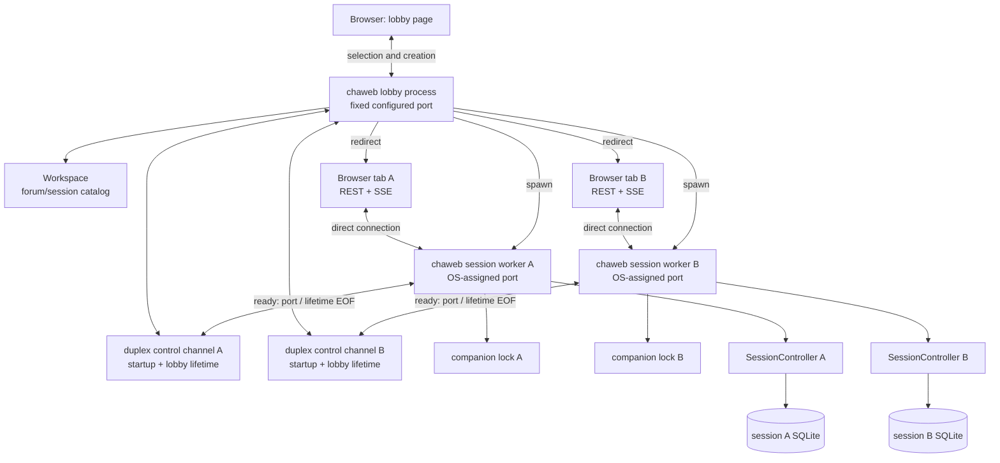
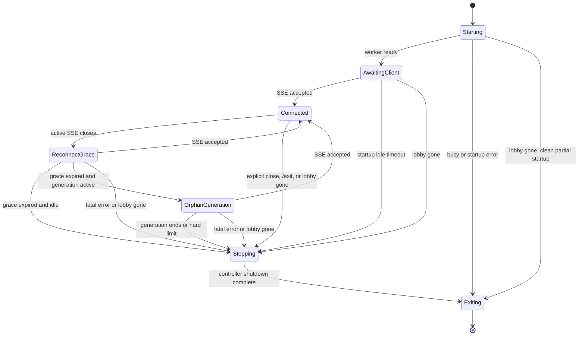

# chaweb detailed design

Status: proposed design, ready to guide implementation.

Last updated: 2026-07-30.

This document defines the process, ownership, HTTP, streaming, locking, and
lifecycle design for `chaweb`. It follows the architecture and dependency rules
in [`src/README.md`](../src/README.md). The process-per-session composition is
an explicit `chaweb` design choice, not a constraint imposed by the domain
layer.

The browser implementation technology, component model, styling system, and
visual design are intentionally out of scope. They require a separate decision.

## 1. Decision summary

`chaweb` uses a process-per-session architecture:

- The initial `chaweb` process is the **lobby process**. It serves the title
  page, lists forums and sessions, creates stored sessions, and launches session
  workers. It never constructs a `SessionController`.
- Each active chat is served by a separate **session worker process**. A worker
  owns exactly one `SessionController`, its `Transcript`, its `SessionJournal`,
  its event loop, and its agent workers.
- A session worker listens on an operating-system-assigned available port. It
  reports that port to the lobby over a dedicated duplex worker-control
  channel.
- Once the worker reports readiness, the lobby redirects the browser to the
  worker's port and forgets the worker's session identity and port. It retains
  only generic process and control-channel handles needed for supervision,
  reaping, and shutdown.
- The worker-control channel remains open after startup. If the lobby stops or
  crashes, the operating system closes the lobby endpoint; the worker observes
  EOF and performs orderly session shutdown. Session workers therefore do not
  outlive the lobby that created them.
- A companion file next to the session database carries an operating-system
  lock for the complete lifetime of the live session. The lock, not the file's
  existence, means that the session is in use.
- A stored session is exclusive across processes. A second process cannot open
  the same forum/session while its worker holds the lock.
- A session worker supports one interactive browser page. It permits one active
  SSE stream and rejects another while that stream is active. This is a
  lightweight usage guard, not a security boundary or a strict browser-tab
  ownership protocol.
- A reloading or reconnecting page may retry briefly while the worker notices
  the previous SSE connection closing. The design intentionally does not add
  attachment identities, epochs, browser-storage coordination, or multi-page
  synchronization.
- Commands use ordinary HTTP requests. Live transcript and generation updates
  use Server-Sent Events (SSE).
- The chat input accepts the shared text grammar, including slash commands and
  leading `@` addressing. The HTTP interface may additionally expose typed
  operations for controls such as Stop and Clear.
- The service is an unauthenticated, trusted-network application. Any device
  able to reach the configured listener can use it.

This design deliberately does not provide a permanent chat shell containing a
sidebar of all forums and sessions. Session selection belongs to the lobby.
After selection, the browser is redirected to a focused chat page served by the
session worker. Switching sessions means returning to the lobby.

## 2. Goals

The design has the following goals:

1. Use a simple one-live-session-per-process composition.
2. Keep `SessionController`, `Transcript`, and `SessionJournal` single-owner
   objects without making them generally thread-safe.
3. Keep the lobby free of session-to-process and session-to-port routing state
   after redirect; retain only generic worker-supervision handles.
4. Make clean lobby shutdown and unexpected lobby loss stop all session
   workers created by that lobby.
5. Enforce exclusive access to each stored session across all application
   frontends and processes.
6. Support several active sessions at once by running several independent
   worker processes.
7. Allow different browser tabs to use different sessions concurrently.
8. Support one browser page per session worker with a lightweight active-SSE
   guard, clear conflict reporting, and practical reload/reconnect behavior.
9. Preserve the existing slash-command, multicast, and `@mention` behavior in
   the web input box.
10. Stream model output to the browser while continuing to drain and persist
   agent events during temporary browser disconnection.
11. Work when the lobby is reached from another trusted device on the local
    network.
12. Keep transport objects and browser presentation concerns outside
    `session/`, `agents/`, and `transcript/`.

## 3. Non-goals

The first design does not include:

- User accounts, authentication, or per-user authorization.
- Multiple simultaneous viewers or writers for one session, including
  multi-page event fan-out, synchronization, and command coordination.
- Strict proof or enforcement that only one physical browser tab exists.
- Session sharing or collaborative chat.
- A session/process registry that lets a restarted lobby rediscover and
  redirect to an already running worker.
- Session workers that intentionally survive shutdown or failure of the lobby
  that created them.
- An integrated chat page that switches among projects, forums, or sessions.
- A reverse proxy from the lobby to workers.
- A single public port for every active worker.
- Internet-facing hardening or built-in TLS termination.
- A stable public API for third-party clients.
- Selection of browser implementation technologies.
- Exact visual layout, styling, accessibility treatment, or mobile interaction
  details.
- A global maximum live-worker count, per-client launch quota, or worker-launch
  rate limit. The initial trusted-LAN application relies on the operator to
  avoid unbounded session launches.

## 4. Terminology

| Term | Meaning |
| --- | --- |
| Stored session | A persistent chat represented by one SQLite database inside a forum. |
| Lobby process | The initial `chaweb` process listening on the configured `host` and `port`. |
| Session worker | A child `chaweb` process serving exactly one stored session. |
| Session lease | The operating-system lock held on the session's companion lock file. |
| Worker-control channel | A per-worker duplex libuv pipe stream. The worker reports `ready`, `busy`, or `error` on it; after `ready`, its continued existence represents the lifetime of the lobby. |
| Worker supervision record | The lobby's generic process handle and control-channel endpoint for one worker. It contains no session identity, port, or browser routing information after redirect. |
| Active browser stream | The single SSE connection currently accepted by a session worker. It is lightweight connection bookkeeping, not a browser identity or authorization credential. |
| Owner thread | The worker thread that exclusively accesses the live `SessionController` and all borrowed session state. |
| HTTP worker | A cpp-httplib request-processing thread. It does not own domain state. |

## 5. System architecture



Browser traffic goes directly to each worker; the lobby is not an HTTP proxy
and retains no session routing after redirect. The duplex control channel is
the only lobby-to-worker runtime connection. It carries no chat traffic and
normally carries no messages after readiness. Its open/closed state supervises
worker lifetime: lobby endpoint closure causes that worker to shut down.

## 6. Executable modes

The same `chaweb` executable supports two modes.

### 6.1 Lobby mode

Lobby mode is the normal user-facing invocation:

```text
chaweb
```

It:

1. Loads environment and application configuration.
2. Initializes lobby diagnostic logging.
3. Constructs `Workspace`.
4. Constructs the lobby HTTP server.
5. Binds the configured lobby address and port.
6. Serves browser assets and lobby endpoints.
7. Launches workers on demand.
8. On a process shutdown signal, stops accepting requests, shuts down all
   supervised workers, and exits.

Lobby mode never opens a live session and never constructs a
`SessionController`.

### 6.2 Session-worker mode

Session-worker mode is an internal invocation used only by the lobby:

```text
chaweb --session-worker <forum-id> <session-id> <control-channel>
```

The actual representation of the inherited control channel is internal to the
launcher and libuv spawn setup. It must not be a user-facing command-line
feature.

The worker:

1. Loads environment and application configuration.
2. Initializes worker-specific diagnostic logging.
3. Constructs the event loop/notifier.
4. Asks `Workspace` to open the requested forum and stored session.
   `Workspace` validates the identifiers, acquires the companion-file lock
   without waiting, restores database state, and constructs the session's
   `SessionController` in that order.
5. Binds an available worker port on the configured network interface.
6. Reports readiness and the bound port through the control channel.
7. Starts serving the chat page, REST operations, and SSE events.
8. Watches the control channel for lobby EOF while serving.
9. Owns the session until explicit close, idle termination, fatal failure, or
   lobby loss.
10. Shuts down the controller, releases the lease, and exits.

All failures before readiness are reported through the control channel when
possible. A worker reporting `busy` or `error` closes its endpoint and exits.
A worker reporting `ready` keeps its endpoint open for its complete lifetime.

## 7. Session exclusivity

### 7.1 Companion lock

Each session database has a deterministic companion path. For example:

```text
2026-07-30-12-00-00-session.sqlite3
2026-07-30-12-00-00-session.sqlite3.cha-lock
```

The companion file may remain on disk permanently. Its presence is not an
indication that the session is active. Activity is represented only by an
exclusive operating-system lock held on an open handle.

The lease operation is:

- Exclusive.
- Non-blocking.
- Automatically released by the operating system if the process exits or
  crashes.
- Held from before session restore until after controller shutdown.
- Supported through one project abstraction with platform-specific
  implementations.

The workspace is expected to be on a local filesystem with reliable locking.
Concurrent use from filesystems whose locking behavior is absent or unreliable
is out of scope.

### 7.2 Why the database itself is not locked by cha

SQLite applies its own locking protocol to the database and its companion
journal files. An application-level lock on the same database file could
interact differently with SQLite across platforms, VFS implementations, and
journal modes. A separate file keeps the application lease independent of
SQLite's storage protocol.

### 7.3 Scope of exclusivity

The lease is a session-layer concern, not a web-only convention. `cha`,
`chacon`, and a session worker must all fail clearly if another process already
holds the session lease.

This is an intentional behavior change for the existing terminal frontends.
They do not currently acquire an application-level session lease. After this
change, they fail immediately with a clear “session already in use” result
rather than relying on eventual SQLite contention or other storage behavior.

The lock must be acquired before loading restorable session state. Otherwise
two processes could both restore the same request and entry counters before
one discovers the conflict.

A session-layer `SessionLease` object should therefore be acquired by
`Workspace` and moved into the resulting `SessionController`. Its lifetime must
outlast `SessionJournal`.

### 7.4 Creating without opening

The current `Workspace::create_session()` both creates a database and returns a
live controller. The lobby must create a stored session without opening it.

The session layer should add a create-only operation that:

1. Validates and loads the forum metadata needed for creation.
2. Creates the session database atomically through `SessionCatalog`.
3. Returns its `SessionSummary`.
4. Does not initialize providers or construct a controller.

The existing create-and-open operation can remain as a convenience for the
terminal frontends. The lobby uses the create-only operation and then launches
a worker to acquire the lease and open the new session.

With this create-only-then-spawn sequence, there is an interval between
publishing the new database and the worker acquiring its lease. Another
frontend may open the new session during that interval. If so, creation remains
successful and is not rolled back, but the worker reports `busy`. The lobby
response must identify the created session, explain that it was created but
could not be opened, and must not automatically retry creation because that
would create another session.

## 8. Worker control and startup protocol

### 8.1 Launching

The lobby initializes a dedicated duplex `uv_pipe_t` and uses `uv_spawn()` to
launch a fresh executable image. The control stream is created with both the
child-readable and child-writable pipe flags. Libuv implements this as an
appropriate local stream on each supported platform, including Unix socket
pairs and Windows named pipes. The launcher must not duplicate the already
multithreaded lobby address space and continue it as a worker.

The child inherits only its endpoint of its control channel and the process
resources explicitly required for startup. The lobby retains its endpoint and
the `uv_process_t` until the worker exits. Neither process inherits unrelated
worker channels, and a later worker must not inherit an endpoint belonging to
an earlier worker. Otherwise an unintended duplicate handle could delay EOF
and prevent parent-loss detection.

For each spawn, the child stdio/handle specification contains only the
standard streams intentionally retained and that child's control endpoint.
All other lobby descriptors and handles are non-inheritable or close-on-exec,
and each process closes the control-channel end it does not own immediately
after the spawn completes.

The worker acquires the companion lock itself, through the session-opening
operation in `Workspace`. The lobby does not acquire and transfer a lock,
avoiding a platform-specific lock-handoff protocol. Two racing open requests
may briefly create two workers, but only one can acquire the lease. The loser
reports `busy` and exits.

### 8.2 Startup messages

The worker writes exactly one bounded, machine-readable message:

```json
{"status":"ready","port":49152}
```

or:

```json
{"status":"busy"}
```

or:

```json
{"status":"error","message":"Session could not be opened"}
```

The startup record protocol must:

- Use the dedicated control channel rather than standard output.
- Have a strict maximum message size.
- Use UTF-8.
- Contain exactly one startup record.
- Treat EOF before a complete record as worker startup failure.

For `busy` and `error`, the record is terminal: the worker closes its endpoint
and exits. For `ready`, the record completes only the startup phase. The
channel remains open, the lobby stops expecting startup data, and the worker
starts or continues an asynchronous read for lobby-lifetime EOF. No heartbeat
or periodic liveness message is required.

The lobby applies a startup timeout. On timeout it closes its endpoint and
returns an error to the browser. A worker that cannot report readiness, or
observes control-channel EOF during startup, releases any partially acquired
resources and exits.

After readiness, EOF has a different meaning: the lobby has shut down or
disappeared. The worker enters the ordinary orderly-shutdown path immediately.
The worker does not wait for browser disconnect grace or orphan-generation
timeouts.

### 8.3 Redirect URL

The worker reports only its bound port. The lobby constructs the browser URL
using a network hostname or address that the requesting browser can reach.

For example, a request to:

```text
http://desktop.local:8080
```

may be redirected to:

```text
http://desktop.local:49152
```

The worker binds the same configured interface as the lobby, including a
wildcard or LAN interface when access from a phone is required. A wildcard
bind address such as `0.0.0.0` is never used literally in the redirect.

The incoming `Host` value must be parsed as an HTTP authority before it is
reused. The lobby accepts a valid hostname, IPv4 address, or bracketed IPv6
literal, removes the incoming lobby port, preserves or restores IPv6 brackets,
and appends the worker port. It rejects user information, paths, whitespace,
control characters, malformed brackets, and ambiguous unbracketed IPv6. An
explicit advertised hostname can be added to configuration if deployments
cannot derive a usable address from the request.

### 8.4 Forgetting routing while supervising workers

After reading `ready` and sending the redirect, the lobby removes the session
identity, worker port, and browser request from the launch state. It retains a
generic supervision record containing only the process handle, control-channel
endpoint, and shutdown/reaping state. Consequences:

- A running worker belongs to the lobby that created it and begins shutdown
  when that lobby's control endpoint closes.
- A restarted lobby does not rediscover workers from its predecessor; those
  workers are already exiting because their control channels reached EOF.
- Selecting a locked session again produces a busy error; it does not redirect
  to the existing worker. A brief busy interval may remain while an old worker
  completes shutdown and releases its lease.
- Losing the worker URL means waiting for that worker to terminate before the
  session can be reopened, or stopping the lobby to terminate all of its
  workers.

The process exit callback reaps the worker, closes the process and control
handles, and removes the supervision record. This is process hygiene and
lifetime supervision, not worker routing: no session identity, port, or
browser map is retained after redirect.

### 8.5 Lobby supervisor ownership

One lobby supervisor loop/thread owns every lobby-side `uv_process_t`,
`uv_pipe_t`, startup timer, and supervision record. cpp-httplib request threads
do not create, read, close, or reap these handles directly.

An HTTP open/create handler sends a typed launch request to the supervisor and
waits for the bounded startup result. The supervisor performs `uv_spawn()`,
reads the startup record, enforces the timeout, and returns the ready port or
error. After the handler sends its redirect, the supervisor discards the
launch routing metadata and retains only the generic supervision record.

Lobby shutdown is also submitted to this loop so closing control endpoints,
receiving exit callbacks, applying the forced-stop deadline, and destroying
libuv handles have one serialized owner.

## 9. Session worker ownership and threading

### 9.1 Ownership invariant

The worker has one permanent owner thread for live session state. Only this
thread may:

- Call `SessionController` commands.
- Call `SessionController::receive()`.
- Read `TranscriptView`.
- Read personas, default-agent state, or generation state.
- Construct transport snapshots or events from borrowed session values.
- Call `SessionController::shutdown()`.

The controller already owns its `Transcript`, `SessionJournal`,
`AgentRegistry`, and session-scoped agent thread pool. The worker does not
create additional copies of these objects.

### 9.2 HTTP threads

cpp-httplib request threads are pooled and have no affinity with a browser or
session. Even one browser uses a long-lived SSE request and separate command
requests, which may execute on different HTTP threads.

An HTTP handler therefore:

1. Parses and bounds the HTTP request.
2. Constructs a typed web command.
3. Enqueues it for the owner thread.
4. Wakes the owner event loop.
5. Waits for the owner thread to claim the command within a bounded queue
   deadline, then waits for the short synchronous domain result.
6. Serializes the owning result after the owner thread has released it.

An HTTP handler never retains `TranscriptView`, `std::span`, pointers, or
references into the controller.

Each command envelope has an atomic `pending`, `claimed`, `completed`, or
`cancelled` state. If the queue deadline expires while the command is still
pending, the handler atomically cancels it and returns `503 Service
Unavailable` with code `owner_queue_timeout`; the owner thread must skip that
command, so it cannot apply later. If the owner claims the command first, the
handler returns its actual outcome rather than reporting a timeout. Controller
commands do not synchronously wait for model completion; they start or modify
session work and return promptly.

There is no separate post-claim HTTP timeout that reports the command as
unapplied. Once claimed, mutation may already have begun and such a response
would be ambiguous. A worker failure or lost client connection after that point
is handled as an unknown transport outcome followed by snapshot
resynchronization.

A client connection can still disappear after the owner claims a mutation. In
that ordinary HTTP failure case the command may have applied even though the
client did not receive its response. The browser resynchronizes from the
authoritative snapshot and must not automatically retry a non-idempotent
command.

SSE connect/disconnect notifications that affect worker lifetime are
serialized through the owner loop as well. The HTTP server may use a
server-local stream identifier to ensure a duplicate or late close callback
cannot detach a newer stream. This identifier never leaves the worker and is
not a browser attachment credential.

The cpp-httplib task pool must leave capacity for the one long-lived SSE
request plus ordinary command, snapshot, health, and asset requests. Its worker
count and pending-request queue are bounded explicitly; they are not left as
unlimited resource policy.

### 9.3 Owning transport values

The owner thread converts borrowed domain state into owning web values. Such a
value contains its own strings, vectors, identifiers, and scalar status fields.
It remains valid after the transcript changes.

Socket writes do not run on the owner thread. The owner publishes owning events
to a bounded output queue, and the SSE request thread writes them to the
network. A slow or disconnected browser therefore cannot block controller
event processing or persistence.

### 9.4 Agent notifications

Agent executions continue to use `WakeNotifier`. When notified, the owner
thread drains `SessionController::receive()` and publishes any resulting
transcript, generation, or notice changes.

Draining is independent of browser connection state. If the browser
disconnects during generation, the worker continues to call `receive()` so
terminal outcomes reach `SessionJournal`.

### 9.5 Lobby-lifetime notification

The worker opens its inherited control endpoint as a libuv pipe on the owner
event loop and starts an asynchronous read. The lobby normally sends no data
after startup; EOF is the notification.

Control-channel EOF is converted into a semantic `LobbyGone` event and handled
on the owner thread. It is not handled by calling `SessionController` from a
pipe callback on an unrelated thread. Once ordered, `LobbyGone` has the same
effect as a process-level shutdown request: new web work is rejected and the
worker enters orderly shutdown. Browser reconnect grace and model
orphan-generation grace do not delay it.

No PID polling, control-channel heartbeat, Linux parent-death signal, or
browser ping is required for lobby-lifetime detection.

## 10. Lobby HTTP interface

The following route shape defines responsibilities; minor naming changes do
not alter the architecture. The bundled browser client and server are released
together, so this is not initially a third-party compatibility contract.

| Method and path | Purpose |
| --- | --- |
| `GET /health` | Report lobby process liveness. |
| `GET /api/v1/forums` | List available forums and display metadata. |
| `GET /api/v1/forums/{forum}/sessions` | List stored sessions in one forum. |
| `POST /api/v1/forums/{forum}/sessions` | Create a stored session, launch its worker, and redirect on success. |
| `POST /api/v1/forums/{forum}/sessions/{session}/open` | Launch a worker for an existing session and redirect on success. |

The lobby validates forum and session identifiers through `Workspace`; route
text is never treated as a filesystem path.

Opening returns:

- A redirect after the worker reports `ready`.
- `409 Conflict` if the worker reports `busy`.
- A validation-oriented client error for invalid forum/session input.
- A server error if launching, startup communication, controller
  initialization, or listener binding fails.

The lobby must not report success before the worker has acquired the session
lease, constructed its controller, and bound its listener.

For the create route, `busy` after successful creation is the create-then-open
race described in Section 7.4. The lobby returns `409 Conflict` with code
`session_created_but_busy` and includes the owning `SessionSummary`. The stored
session remains in the catalog. The bundled page reports that distinction and
does not repeat the create request automatically.

## 11. Session-worker HTTP interface

| Method and path | Purpose |
| --- | --- |
| `GET /health` | Report worker liveness and readiness. |
| `GET /api/v1/session` | Return a full owning session snapshot. |
| `POST /api/v1/input` | Submit one raw line through the shared text grammar. |
| `POST /api/v1/actions/stop` | Request cancellation of active generation. |
| `POST /api/v1/actions/clear` | Clear the transcript. |
| `POST /api/v1/actions/offrecord/open` | Open an off-record span. |
| `POST /api/v1/actions/offrecord/extend` | Extend/close the current off-record span. |
| `POST /api/v1/actions/offrecord/restore` | Restore the off-record span. |
| `POST /api/v1/actions/default-agent` | Change the run-local default agent. |
| `GET /api/v1/events` | Open or reconnect the worker's SSE stream. |
| `POST /api/v1/close` | Explicitly end the session worker. |

### 11.1 Raw input

`POST /api/v1/input` passes the submitted string to
`handle_text_input()`. The web input therefore supports the same grammar as
the terminal frontends:

- Ordinary prompts for the default agent.
- Leading `@Name` addressing.
- Escaped leading `@@`.
- `/mcast`.
- `/clear`, off-record commands, `/info`, `/agents`, `/stop`, and `/exit`.
- `/@Name` default-agent selection.

`/exit` is a frontend operation. When `handle_text_input()` returns
`end_session`, the worker atomically marks itself stopping so later commands
are rejected, but completes the HTTP command response before teardown begins.
It then publishes `session-ended` on a best-effort basis subject to the bounded
final-SSE drain described in Section 19.2. The browser must also treat EOF after
a successful `/exit` response as normal completion; delivery of the final SSE
event is not guaranteed.

### 11.2 Typed operations

Typed endpoints exist so browser controls do not need to manufacture command
strings. They invoke the same `SessionController` operations used by the text
grammar. They do not introduce a second implementation of session semantics.

Additional typed operations, including ID-based multicast, may be added when a
browser interaction needs them.

### 11.3 Command results

HTTP transport errors and domain command outcomes are distinct:

- Malformed JSON, excessive bodies, and invalid route identifiers are HTTP
  client errors.
- A syntactically valid command may produce an ordinary domain result such as
  a notice, an empty prompt warning, or generation-in-progress refusal.
- Expiration before the owner claims a queued command is a web-runtime
  availability failure, reported as `owner_queue_timeout`; it is not a domain
  refusal and guarantees that the command will not execute.
- Persistence failures and violated controller invariants are fatal worker
  errors.

A web command result is an owning structure derived from `SessionUpdate`. It
may contain:

- Whether the command was applied.
- Whether the input should be cleared.
- Whether the worker should end.
- An optional notice.
- The current presentation revision needed by the browser.

HTTP behavior must not depend on parsing the English text of a notice.
Structured outcome codes may be added at the web boundary or, where necessary,
to the session command contract.

### 11.4 Lightweight single-page policy

One browser page per session worker is the supported usage model. The worker
uses the active SSE connection as a lightweight guard:

- The first SSE connection is accepted.
- Another SSE connection is rejected while the first is active.
- The bundled page enables interactive controls only after its SSE connection
  is accepted and its initial snapshot arrives.
- A rejected page disables its controls and displays “This session is already
  open in another browser page.”

REST requests do not carry attachment IDs, page IDs, or epochs. The guard is
not an authorization mechanism and does not attempt to stop a deliberately
constructed client from calling REST endpoints. This is appropriate for the
personal, trusted-network application.

If an unusual browser race allows two requests to reach the command queue,
owner-thread serialization and `SessionController` invariants preserve domain
correctness. This is a safety net, not support for multiple interactive pages.

## 12. Session snapshot

A session snapshot is an owning, presentation-neutral web value. At minimum it
contains:

- Forum identity and display name.
- Session identity and label.
- Persona identities and display names.
- Current default persona.
- Transcript entries with semantic kind, participant identity, addressing,
  text, status, and request/entry identifiers as appropriate.
- Generation state: inactive or active, agent, phase, and any presentation-safe
  ephemeral status.
- A monotonically increasing worker-local presentation revision.

The web layer defines explicit JSON mappings. Persistence structures and
SQLite-specific types are not serialized as the API merely because they
already exist in C++.

## 13. SSE update model

### 13.1 Connection behavior

The worker permits one active interactive SSE stream. If no stream is active,
the request is accepted and receives a full snapshot. If one is already
active, the worker rejects the new request with `409 Conflict` and the stable
code `browser_stream_in_use`.

Because browser SSE APIs do not always expose an HTTP error body conveniently,
the bundled page may check `/health` after an initial connection failure. If
the worker reports an active stream and this page has never received its
initial snapshot, the page can translate that condition into the standard
conflict message. This check is only for presentation; the SSE endpoint remains
the authoritative guard.

On reload, the replacement request may arrive before cpp-httplib observes the
old connection closing. The page retries for a short bounded interval. SSE
heartbeats help the worker notice dead connections. If the old stream remains
active through the retry interval, the page displays the same “already open”
message and lets the user retry manually. Avoiding every such edge case is not
worth a browser identity or lease protocol for this personal application.

After an initial connection error, the page closes that SSE object and performs
the bounded retries itself; it must not leave the browser's automatic
reconnection running indefinitely in parallel with those attempts.

The worker assigns each accepted stream an internal connection identifier.
Only a close notification matching the active identifier clears the slot. The
identifier is ordinary server-side connection bookkeeping and is never sent to
the browser or attached to REST commands.

Every new or resumed SSE connection begins with a full current snapshot.
Therefore the worker does not keep an event replay log and does not implement
resume-from-event semantics.

The stream must not emit SSE protocol `id:` fields. Consequently the browser
has no meaningful `Last-Event-ID` to present, and the worker does not interpret
that header as a replay request.

Instead, the snapshot and every state-bearing incremental payload contain
chaweb's worker-local presentation `revision`. Revisions are consecutive for
the state updates published by the worker. A browser applies the next expected
revision normally, may ignore an exact duplicate, and obtains a full snapshot
if it observes a skipped or regressive revision. Only state-bearing payloads
participate in this sequence; heartbeats and control events that do not change
browser state do not advance it. The revision is application data used for
state consistency; it is not an SSE event ID and does not identify persisted
journal records.

The stream may use events such as:

| Event | Meaning |
| --- | --- |
| `snapshot` | Complete replacement state and its current revision, sent on connection or resynchronization. |
| `entry-added` | A transcript entry was appended. |
| `entry-appended` | Text was appended to the currently streaming entry. |
| `entry-finished` | A streaming entry became complete or cancelled. |
| `transcript-reset` | The transcript was cleared; the browser must replace local transcript state. |
| `generation` | Agent or generation phase changed. |
| `notice` | A session command or agent event produced a notice. |
| `session-ended` | The worker is ending the interactive session. |
| `resync` | The client fell behind and must obtain a new snapshot. |

The exact payload schema is a transport-level decision inside `ui/web`.

### 13.2 Backpressure

The owner-to-SSE queue is bounded. If the browser cannot consume events:

1. The owner continues draining and persisting agent events.
2. Fine-grained queued presentation events may be discarded.
3. The stream receives `resync`, or is closed.
4. Reconnection starts with a new full snapshot.

Session correctness must never depend on retaining every presentation event.

### 13.3 Coalescing

Provider deltas may arrive more frequently than useful browser updates.
The worker may coalesce consecutive append or generation events for a short
interval. Coalescing affects presentation latency only; every controller event
is still applied on the owner thread in order. Coalescing occurs before the
presentation revision is assigned, so one coalesced state update consumes one
revision and the published sequence remains consecutive.

### 13.4 Heartbeats

SSE comment heartbeats may be sent while otherwise idle. They keep
intermediaries from silently discarding the stream and help the worker detect a
dead browser connection. Heartbeats carry no session state.

## 14. Supported browser usage and worker lifetime

### 14.1 One-page usage model

A session worker is designed for one interactive browser page. The application
does not provide multi-page viewing, event fan-out, synchronization, or
collaborative command semantics.

The server makes only a modest effort to enforce this assumption: one active
SSE stream is permitted. A second stream receives `409 Conflict` with code
`browser_stream_in_use`. The corresponding page must disable commands and show
“This session is already open in another browser page.”

There is deliberately no attempt to prove that requests originate from one
physical tab. There are no attachment IDs, page-instance IDs, attachment
epochs, browser-storage tokens, or cross-tab ownership probes. The restriction
is not a security boundary. A custom client could call REST endpoints without
owning the SSE stream, which is acceptable under the trusted personal-use
model.

### 14.2 Reload and reconnect

Normally, reloading closes the old SSE stream and the replacement connection is
accepted. Because server-side close observation may lag behind the browser,
the replacement page retries a conflict for a short bounded interval before
displaying the “already open” message.

Automatic SSE reconnection uses the same rule. Heartbeats and failed socket
writes help clear stale streams. The worker does not implement takeover,
browser identity comparison, or stale-page command fencing merely to make
every reload race invisible. A user who encounters the rare unresolved case
can retry after the old connection is released.

A successful connection always begins with a full snapshot, so reload and
reconnect do not require an event replay log or browser-persisted protocol
state.

### 14.3 Lifetime states



A rejected additional SSE connection does not change the worker's lifetime
state.

### 14.4 Disconnect during generation

A network disconnect does not stop controller event draining. The worker
continues through a reconnect grace period and accepts the next SSE connection
if the active stream slot is clear.

If generation remains active when the ordinary grace period expires, the
worker continues through a separate bounded orphan-generation period. This
allows normal completion when possible. At the hard limit it performs
`SessionController::shutdown()`, which cancels and joins work according to
existing session policy.

The worker continues accepting an SSE connection throughout the
orphan-generation period. A successful reconnect cancels the orphan timer,
sends a snapshot showing the active generation, and restores `/stop` and the
typed Stop action. If generation completes while still unattended, the worker
persists the terminal result and begins orderly shutdown without waiting for
the hard limit.

Concrete timeout values belong in configuration or implementation constants
and should be chosen after testing phone sleep/reconnect behavior. These
browser-disconnection timers apply only while the lobby control channel
remains open; lobby EOF preempts them.

### 14.5 Lobby lifetime ends

Control-channel EOF means the application instance that owns the worker no
longer exists or is shutting down. It is stronger than browser disconnection:

1. The worker enters `Stopping` without waiting for reconnect grace.
2. It rejects new commands and SSE connections.
3. It publishes `session-ended` with a lobby-shutdown reason when the SSE
   stream is still writable.
4. It runs the ordinary controller shutdown path, releases the session lease,
   closes the control endpoint, and exits.

If EOF occurs before the worker reports readiness, it cleans up any partially
constructed controller, listener, and acquired lease and exits without
starting service.

### 14.6 Explicit close

An accepted explicit close or `/exit`:

1. Atomically marks the worker stopping and rejects new session commands.
2. Completes the successful response to the initiating HTTP request.
3. Publishes `session-ended` if a stream is connected and gives the SSE writer
   a bounded opportunity to flush it.
4. Stops the worker HTTP listener.
5. Calls `SessionController::shutdown()` on the owner thread.
6. Destroys the controller and releases the companion lock.
7. Exits the process.

Failure to deliver `session-ended` does not prevent or fail the close
operation.

## 15. Network and trust model

### 15.1 Listener addresses

The lobby uses `ApplicationConfig.host` and `ApplicationConfig.port`.
Workers use the same bind interface and an operating-system-assigned port, or a
configured worker-port range if firewall policy requires one.

To use the application from a phone, the bind address must be a LAN address or
wildcard rather than loopback-only. The desktop firewall must permit the lobby
port and worker ports.

### 15.2 Origins

The redirect changes the browser origin because the port changes. This is
expected. Each worker serves both its chat assets and its API from the same
worker port, so ordinary session requests remain same-origin and require no
CORS access to the lobby.

The session page may contain a normal link back to the lobby URL supplied at
worker launch. It does not call the lobby API while chatting.

### 15.3 No authentication

No login, account, or authorization layer is required. Anyone who can reach a
listener can list sessions, launch workers, read the selected session, and
submit commands.

Basic browser-request checks remain useful even without authentication:

- Do not emit permissive CORS headers.
- Require expected content types on mutating endpoints.
- Validate `Host` before using it in redirects.
- Reject cross-origin browser mutations when their `Origin` does not match the
  page served by that process.
- Apply body-size, prompt-size, header-size, connection, and timeout limits.

These checks reduce accidental browser cross-site access; they do not establish
an identity or protect against another device directly calling the API.

### 15.4 Untrusted text

Transcript, reasoning, notices, labels, and provider errors are untrusted text.
The eventual browser implementation must not interpret them as executable
markup without an explicit sanitization boundary. JSON and SSE serialization
alone do not make text safe for insertion as browser markup.

## 16. Error handling

| Failure | Required behavior |
| --- | --- |
| Invalid forum or session | Lobby returns a client-facing validation error; no worker remains. |
| Session already leased | Worker reports `busy`, exits, and lobby returns `409 Conflict`. |
| Newly created session is leased before its worker opens it | Lobby returns `409 Conflict` with `session_created_but_busy` and the created session summary; creation is not rolled back or automatically retried. |
| Child cannot start | Lobby returns a server error. |
| Control channel closes before a complete startup record | Lobby treats startup as failed; worker cleans up and exits if it is still running. |
| Startup timeout | Lobby closes its control endpoint and returns an error; the unready worker observes EOF or a failed readiness write and exits. |
| Controller initialization fails | Worker reports a bounded error and exits, releasing the lease. |
| Worker cannot bind | Worker reports an error and exits; an implementation may retry a small bounded number of times. |
| Redirect/browser never arrives | Worker's awaiting-client timeout expires and it exits. |
| Another SSE stream is already active | Worker returns `409 Conflict` with `browser_stream_in_use`; the page disables commands and explains that the session is open elsewhere. |
| Reload arrives before the old SSE close is observed | The page retries for a short bounded interval, then shows the ordinary stream-in-use message if the old stream remains active. |
| Owner queue deadline expires before a command is claimed | Worker atomically cancels the command and returns `503 Service Unavailable` with `owner_queue_timeout`; the command cannot execute later. |
| Client disconnects after a command is claimed | The command may complete; on reconnect the browser resynchronizes and does not automatically repeat the mutation. |
| An active SSE handler closes | Worker clears the stream slot, enters reconnect grace, and continues draining controller events. |
| A duplicate or late SSE close callback arrives | Its server-local connection ID does not match the active stream, so it cannot clear a newer connection. |
| Browser falls behind | Presentation queue resynchronizes; controller operation is unaffected. |
| Provider fails | Existing controller behavior creates an error entry and session remains available. |
| Persistence fails | Worker treats it as fatal, shuts down, and exits. |
| Worker crashes | OS releases the companion lock; browser loses the connection and the lobby can later launch a replacement. |
| Lobby exits or crashes | OS closes every lobby control endpoint; each worker observes EOF, performs orderly shutdown, releases its lease, and exits. |
| Final `session-ended` cannot be flushed | The bounded final-SSE drain expires and shutdown continues; final-event delivery is best effort. |
| Worker misses the clean-shutdown deadline | During clean lobby shutdown, the supervisor force-terminates that worker and reaps it. |

Error responses sent to browsers contain a stable error code and a
presentation-safe message. Internal paths, secrets, provider credentials, and
exception internals are not exposed.

## 17. Logging and observability

The lobby and workers are independent processes. Logging must not assume that
several unsynchronized file sinks can safely own one output file.

The implementation must choose one of:

- A distinct log file per process, derived from the configured base path.
- A logging sink explicitly designed for concurrent processes.
- An operating-system logging facility.

Separate lobby and worker files are the simplest initial policy. Every worker
re-reads the same workspace `app.toml` as the lobby and treats
`ApplicationConfig.log_file` as the configured base path. Before initializing
logging, each chaweb process derives a role/process-specific filename from that
base; the path does not need to be passed through the control channel. Every
worker record should include its process ID, forum ID, and session ID. Logs
should record:

- Worker launch request.
- Control-channel startup result, EOF, and shutdown reason.
- Lease acquisition or busy result.
- Listener readiness and port.
- Browser SSE connect, disconnect, reconnect, and conflict.
- Generation start/terminal status without prompt or answer bodies by default.
- Grace-period and idle shutdown.
- Fatal persistence or provider errors.
- Orderly shutdown and lease release.

Both modes expose `/health`. The lobby endpoint reports only lobby readiness.
The worker endpoint reports worker readiness and whether it is starting,
awaiting a client, connected, in reconnect grace, draining orphan generation,
or stopping; it must not expose transcript content.

## 18. Code organization

Web implementation code belongs in `src/ui/web/`, while
`src/apps/web_main.cpp` remains the composition root.

A likely responsibility split is:

| Component | Responsibility |
| --- | --- |
| `web_main.cpp` | Parse lobby/worker mode, top-level error handling, and wire concrete components. |
| `LobbyServer` | Lobby routes, assets, and launch responses; uses `Workspace` for forum/session navigation and the session layer's create-only operation, and never constructs a `SessionController`. |
| `SessionProcessLauncher` | `uv_spawn()` child creation, duplex control-channel setup, and explicit handle inheritance. |
| Worker supervisor | Lobby-owned generic process/control records, startup deadlines, exit callbacks, clean-stop coordination, and forced-stop deadline; it retains no routing information after redirect. |
| `SessionWorkerServer` | Session routes, lightweight single-stream policy, SSE connection, and process lifetime. |
| Parent-lifetime watcher | Worker-side control-channel read that converts EOF into an owner-loop `LobbyGone` event; it may be part of `WebSessionRuntime`. |
| Browser connection state | Current server-local SSE connection ID, reconnect grace, orphan-generation, and idle timers; it may be part of `WebSessionRuntime`. |
| `WebSessionRuntime` | Owner-thread command queue, notifier integration, controller access, state snapshots, and event publication. |
| `SessionLease` | Cross-platform companion-file locking; belongs in `session/` because all frontends use it. |
| Web protocol types | Owning request, response, snapshot, error, and SSE payload types. |
| Asset handler | Serve the browser artifacts selected in the separate UI design. |

`cha_web` should be a separate static library linked by `chaweb_app`. It links
`cha_core` and cpp-httplib. This keeps web transport dependencies out of the
terminal executables and makes the lobby, worker runtime, routes, serializers,
and launcher testable without `main()`.

No web source belongs in `cha_core`, and reusable policy must not accumulate in
`web_main.cpp`.

## 19. Shutdown behavior

### 19.1 Lobby shutdown

The lobby:

1. Marks the supervisor stopping and rejects new worker launches.
2. Stops accepting new HTTP requests and causes launch requests already waiting
   for startup to fail with a bounded shutdown response.
3. Closes the lobby endpoint of every starting and ready worker-control
   channel. EOF is the graceful shutdown request; no separate message is
   required.
4. Keeps the libuv process handles alive and waits for worker exit callbacks
   until a bounded clean-shutdown deadline.
5. Force-terminates any worker that has not exited by the deadline.
6. Reaps every completed child and closes its process/control handles.
7. Stops the remaining lobby event-loop and logging resources and exits.

The generic supervision records are sufficient for this procedure. The lobby
does not need to recover session identities or ports in order to stop workers.
Closing a control endpoint is also safe during startup: an unready worker
observes EOF or fails its readiness write and cleans up.

### 19.2 Worker shutdown

Worker shutdown may be initiated by explicit browser close, `/exit`, idle or
orphan timeout, fatal failure, a process shutdown signal, or lobby-control EOF.
Every trigger converges on one idempotent sequence:

1. Atomically marks itself stopping and rejects new commands and SSE
   connections.
2. For an accepted browser `/exit` or close, completes the initiating HTTP
   response before starting transport teardown.
3. Publishes `session-ended` with a presentation-safe reason when possible,
   gives the SSE writer its permitted drain opportunity, then ends or closes
   SSE output.
4. Stops its HTTP listener.
5. Wakes the owner loop.
6. Calls `SessionController::shutdown()` on the owner thread.
7. Joins its HTTP and owner threads in a defined order.
8. Destroys the controller.
9. Releases the session lease.
10. Closes its worker-control endpoint and remaining libuv handles.
11. Flushes logging and exits.

The notifier must outlive the controller and all agent workers that may call
it. The session lease must outlive the journal.

The shutdown coordinator, not the owner thread, may wait up to a small
final-SSE drain deadline for `session-ended` to flush. A successful write,
stream failure, or expiration ends that wait; shutdown never waits
indefinitely for a slow browser. Fatal failures and lobby loss may skip the
drain wait when prompt teardown is required.

Lobby-control EOF never waits for browser reconnect grace or for an active
model response to finish normally. `SessionController::shutdown()` applies the
existing cancellation and join policy so persisted state reaches a defined
terminal condition before the lease is released. The lobby's forced-stop
deadline is a last resort for a worker that cannot complete this cooperative
path. Forced termination may lose uncommitted model/session updates and final
diagnostic records, but the operating system releases the companion lock and
SQLite applies its ordinary crash-recovery guarantees.

## 20. Testing strategy

### 20.1 Session lease tests

- One process can acquire an unused companion lock.
- A second process cannot acquire it.
- Releasing or crashing the owner makes it acquirable.
- Lock-file existence without a held lock does not report busy.
- Invalid session paths cannot escape the session directory.
- TUI, console, and web opening paths all use the lease.
- Existing TUI and console frontends fail immediately and clearly when another
  process holds the lease.

### 20.2 Launcher tests

- Ready, busy, and error startup records.
- EOF before a record.
- Ready leaves the duplex control channel open for lifetime supervision.
- `busy` and `error` close the channel and terminate the worker.
- Oversized or malformed record.
- Startup timeout.
- Worker port propagation.
- Only the intended child endpoint is inherited; sibling workers do not inherit
  one another's endpoints.
- Unrelated lobby descriptors/handles are non-inheritable or close-on-exec, and
  both processes close the control-channel end they do not own.
- Concurrent HTTP launch requests perform all libuv process/control operations
  on the single supervisor loop.
- Closing the lobby endpoint before and after readiness produces worker EOF.
- Lobby shutdown racing with startup closes the channel, fails the launch
  request, and leaves no worker or supervision handle behind.
- Completed children are reaped and removed from the generic supervisor
  without retaining session or port routing.
- Clean supervisor shutdown waits for cooperative exits and force-terminates a
  deliberately unresponsive test child after the deadline.

### 20.3 Worker runtime tests

- Commands and `receive()` run only on the owner thread.
- Borrowed transcript values never escape into HTTP/SSE state.
- Raw input preserves slash-command and `@mention` behavior.
- Typed actions call the expected controller operations.
- Agent events drain without a connected SSE client.
- Persistence completes after mid-generation disconnect.
- Slow SSE output does not block controller draining.
- Queue overflow triggers resynchronization.
- Only one SSE stream is accepted at a time.
- A duplicate or late close notification cannot clear a newer stream because
  server-local connection IDs differ.
- Commands that race unexpectedly are still serialized on the owner thread and
  preserve `SessionController` invariants.
- A pending command cancelled at its owner-queue deadline never executes.
- If the owner wins the claim/cancel race, the handler receives the actual
  command result rather than a timeout.
- Concurrent process-signal and `LobbyGone` notifications enter the same
  idempotent worker-shutdown sequence.

### 20.4 Process integration tests

- Lobby creates a session and redirects to a ready worker.
- A frontend that opens a newly created session before its worker acquires the
  lease produces `session_created_but_busy`; the created session remains and no
  second session is created automatically.
- Lobby opens an existing session and redirects.
- Two different sessions run simultaneously on different ports.
- A second worker for the same session receives busy.
- A second simultaneous SSE connection to one worker receives
  `browser_stream_in_use`.
- Every starting and ready worker exits after clean lobby shutdown.
- Simulated unexpected lobby loss closes control endpoints and causes workers
  to shut down and release their session leases.
- A restarted lobby can open the session after the predecessor's worker
  finishes its parent-loss shutdown.
- Worker exits if no browser arrives.
- Worker permits a new SSE connection during reconnect grace.
- Worker also permits reconnect during orphan generation; the new snapshot
  reports active generation and Stop remains effective.
- Reload succeeds after the prior SSE handler closes.
- A reload that briefly races the old handler succeeds through bounded retry.
- Worker releases the lock after explicit close, idle exit, and fatal failure.
- Phone-like pause/reconnect behavior is covered with simulated connection
  loss.
- Lobby and worker processes derive distinct log filenames from the same
  configured `ApplicationConfig.log_file` base.

### 20.5 HTTP/SSE contract tests

- Route validation and response codes.
- Redirect authority parsing removes the lobby port, correctly brackets IPv6,
  appends the worker port, and rejects malformed or unsafe `Host` values.
- Snapshot serialization.
- Incremental append and terminal events.
- Clear/reset and resynchronization.
- SSE heartbeat and disconnect.
- First-stream acceptance and second-stream `browser_stream_in_use` response.
- Pending owner-queue timeout returns `503` with `owner_queue_timeout` and
  guarantees cancellation.
- Every accepted or resumed stream begins with a full snapshot.
- Snapshots and state-bearing incremental payloads carry consecutive
  presentation revisions.
- SSE output contains no protocol `id:` fields; reconnect does not request or
  perform event replay.
- Explicit close completes its HTTP response first; final `session-ended`
  delivery either flushes within the deadline or shutdown proceeds without it.
- Body and prompt limits.
- Same-origin mutation policy.
- Untrusted transcript text remains data in serialized responses.

### 20.6 Browser lifecycle tests

These tests exercise browser platform behavior without depending on the
eventual UI framework:

- An ordinary reload retries briefly if the old SSE handler has not closed,
  then resumes from a full snapshot.
- A skipped or out-of-order presentation revision causes the page to replace
  its state from a full snapshot rather than request event replay.
- A page whose SSE connection is rejected disables interactive controls and
  displays “This session is already open in another browser page.”
- An unresolved stale-stream conflict permits a manual retry; it does not
  require browser storage or cross-tab coordination.

## 21. Delivery sequence

1. **Global session lease.** Add the companion-file lock abstraction, acquire
   it before restore, hold it through controller lifetime, and cover all
   frontends with process-level tests.
2. **Create-only workspace operation.** Allow the lobby to create a stored
   session without constructing a controller.
3. **Dual executable modes and worker supervision.** Add lobby and worker
   composition roots inside `web_main.cpp`, duplex libuv control channels,
   the lobby supervisor loop, startup records, explicit handle inheritance,
   generic supervision records, control-EOF shutdown, exit callbacks, and the
   bounded forced-stop fallback.
4. **Lobby service.** Add forum/session listing, create/open, supervised worker
   launch, and redirect behavior.
5. **Worker runtime.** Add the owner loop, command queue, one controller, full
   snapshot, raw input, typed actions, and orderly shutdown.
6. **SSE.** Add owning events, a bounded output queue, resynchronization,
   heartbeats, and disconnect-independent draining.
7. **Browser connection and lifetime policy.** Add the lightweight one-stream
   guard, server-local stream bookkeeping, bounded reload retry, reconnect
   grace, startup idle timeout, orphan-generation limit, and explicit close.
8. **Network and process hardening.** Add limits, validated redirect host,
   worker-port/firewall documentation, logging isolation, handle-inheritance
   tests, and forced-stop behavior.
9. **Browser implementation.** Select and implement the browser technology in
   a separate design and delivery effort.

## 22. Deferred parameters

The architecture does not depend on selecting these values now:

- Worker startup timeout.
- Owner command-queue deadline.
- Clean lobby-shutdown deadline before a worker is force-terminated.
- Final SSE drain deadline during browser-initiated shutdown.
- Time allowed for the first browser connection.
- Browser reconnect grace period.
- Reload conflict retry interval.
- Maximum disconnected generation lifetime.
- SSE heartbeat interval.
- SSE output-queue capacity and coalescing interval.
- Maximum request and prompt sizes.
- Unrestricted OS-assigned ports versus a configured worker port range.
- Explicit advertised hostname versus validated request-host derivation.
- Per-process logging filename convention.

They should be configuration values only where operators genuinely need to
change them; otherwise they can begin as documented implementation constants.

## 23. Alternatives considered

### 23.1 Several live sessions in one chaweb process

A single server process could own a registry of controllers and give each one
an owner thread. This would keep one public port and make an integrated
multi-session browser shell natural.

It was rejected for the initial design because it changes the selected
one-session-per-process composition, introduces a multi-controller registry and
lifecycle manager, and increases the amount of concurrency policy implemented
inside `chaweb`. Those capabilities can be reconsidered if the integrated
multi-session experience becomes more important than the present simplicity
goal.

### 23.2 One controller per HTTP worker

cpp-httplib workers are pooled and are not assigned to browser tabs or
sessions. One browser's SSE stream, input submission, and Stop request can run
on different HTTP workers. Controller instances attached to HTTP workers would
therefore duplicate and diverge the live state of one stored session.

The selected design has one controller per session worker process and one owner
thread inside that process.

### 23.3 Lobby reverse proxy

The lobby could keep the browser on one public origin and forward REST and SSE
traffic to workers over private ports or local IPC. This would make worker
ports invisible and make later integrated navigation easier.

It was rejected because the lobby would have to retain worker routing state,
proxy long-lived streaming responses, handle worker failure, and remain in the
data path after selection. Direct redirect lets the lobby forget session and
port routing while retaining only the generic handles needed to supervise the
worker's lifetime.

### 23.4 Lobby worker registry and rediscovery

The lobby could retain process, port, and browser-routing information for every
worker, or workers could publish descriptor files that a restarted lobby
discovers.

It was rejected for the initial design. A locked session is simply unavailable
from the lobby until its worker exits. The generic supervision set is not a
registry: it has no session identity, port, or redirect capability. A restarted
lobby does not rediscover a predecessor's workers because loss of their
original lobby causes them to shut down.

### 23.5 Application lock on the SQLite database

The application could place its exclusive marker lock on the database file
itself.

It was rejected because SQLite also locks the main database as part of its own
storage protocol. A companion file cleanly separates the lifetime lease from
SQLite locking and journal behavior.

### 23.6 Browser polling or a bidirectional streaming transport

Polling is simpler at the socket level but makes streaming output less
responsive and creates repeated requests. A bidirectional stream combines
commands and updates but adds connection-level command framing and retry
semantics that are unnecessary for discrete user operations.

REST commands plus one-way SSE updates match the existing split between
frontend commands and controller event reception.

### 23.7 Multiple browser pages per session

The worker could keep a subscriber registry, give each SSE connection an
independent bounded queue, broadcast state to all pages, and define shared
command and shutdown behavior.

This is domain-safe when commands are serialized on the owner thread, but it
has no use case in this personal application. It would create browser behavior,
tests, and resource policies that chaweb does not need. Multiple pages are
therefore unsupported rather than designed as peer views.

### 23.8 Strict browser attachment ownership

The worker could distinguish reloads from other pages with attachment IDs,
page-instance IDs, epochs, browser storage, stale-command fencing, and
cooperative cross-tab coordination.

This could make reload takeover more deterministic and reject more duplicate
page cases, but it would turn a personal-use assumption into a substantial
protocol. Browser suspension also prevents cooperative tab detection from
being absolute. The selected design uses only a one-active-SSE guard and
bounded retry. Rare ambiguous reload cases are acceptable, and domain
serialization remains the correctness backstop.

### 23.9 Workers survive lobby shutdown

Workers could close the startup channel after reporting readiness and continue
independently if the lobby exits. This would let an existing browser continue
chatting through a lobby restart and would minimize the lobby's retained
handles.

It was rejected because the user-visible application would not actually stop
when its lobby process stops. Orphaned workers would keep session leases and
network listeners alive, and a restarted lobby could only report those
sessions busy because it deliberately has no rediscovery registry. The
selected design couples each worker to its creating lobby through the retained
control channel while still keeping browser traffic direct.

### 23.10 Other parent-death mechanisms

A one-way worker-to-lobby startup pipe could be kept open and tested with
periodic worker writes. This adds heartbeat traffic and detects lobby loss only
at the next write. Polling the parent PID has the same delayed-detection
problem and requires different platform behavior.

Linux `PR_SET_PDEATHSIG`, macOS process notification APIs, Windows parent
process handles, and Windows Job Objects can also detect or enforce parent
death. They were rejected as the primary design because they require
platform-specific policy, and hard-kill mechanisms can bypass orderly
controller and journal shutdown. A duplex libuv control channel already
provides the required clean-exit and crash-EOF semantics on all supported
platforms. Platform-specific hard termination remains confined to the
supervisor's bounded forced-stop fallback.
