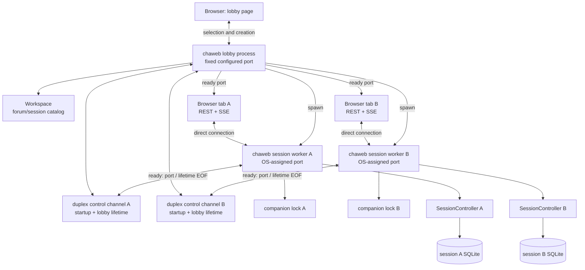

# chaweb detailed design

Status: proposed design, ready to guide implementation.

Last updated: 2026-07-31.

This document defines the process, ownership, HTTP, streaming, locking, and
lifecycle design for `chaweb`. It follows the architecture and dependency rules
in [`src/README.md`](../src/README.md). The process-per-session composition is
an explicit `chaweb` design choice, not a constraint imposed by the domain
layer.

The browser implementation technology, component model, styling system, and
visual design are intentionally out of scope. They require a separate decision.

## 1. Decision summary

`chaweb` uses a process-per-session architecture:

- The initial `chaweb` process is the **lobby process**. It serves the title
  page, lists forums and sessions, creates stored sessions, and launches session
  workers. It never constructs a `SessionController`.
- Each active chat is served by a separate **session worker process**. A worker
  owns exactly one `SessionController`, its `Transcript`, its `SessionJournal`,
  its event loop, and its agent workers.
- A session worker listens on an operating-system-assigned available port. It
  reports that port to the lobby over a dedicated duplex worker-control
  channel.
- Once the worker reports readiness, the lobby returns the worker's port as
  JSON. The lobby page replaces the port in its own URL with that value and
  navigates to the worker. The lobby forgets the worker's session identity and
  port, retaining only its control-channel endpoint, which it passively watches
  for EOF.
- Session workers are fire-and-forget processes. On POSIX, the lobby enables
  automatic child reaping with `SA_NOCLDWAIT` and launches workers with
  `posix_spawn()`. On Windows, it launches with `CreateProcessW()` and
  `CREATE_NO_WINDOW`, then closes the returned process and thread handles
  immediately. Session workers never create or display console windows; lobby
  mode may use its normal console. The lobby retains no worker PID or process
  handle, receives no exit status, and never waits for, reaps, or
  force-terminates a worker.
- The worker-control channel remains open after startup. If the lobby stops or
  crashes, the operating system closes the lobby endpoint; the worker observes
  EOF and is responsible for performing orderly session shutdown and exiting.
- A companion file next to the session database carries an operating-system
  lock for the complete lifetime of the live session. The lock, not the file's
  existence, means that the session is in use.
- A stored session is exclusive across processes. A second process cannot open
  the same forum/session while its worker holds the lock.
- A session worker supports one interactive browser page. It permits one active
  SSE stream and rejects another while that stream is active. This is a
  lightweight usage guard, not a security boundary or a strict browser-tab
  ownership protocol.
- A reloading or reconnecting page may retry briefly while the worker notices
  the previous SSE connection closing. The design intentionally does not add
  attachment identities, epochs, browser-storage coordination, or multi-page
  synchronization.
- Commands use ordinary HTTP requests. Live transcript and generation updates
  use Server-Sent Events (SSE).
- The chat input accepts the shared text grammar, including slash commands and
  leading `@` addressing. The HTTP interface additionally exposes typed Stop
  and stable-ID default-agent controls.
- The service is an unauthenticated, trusted-network application. Any device
  able to reach the configured listener can use it.

This design deliberately does not provide a permanent chat shell containing a
sidebar of all forums and sessions. Session selection belongs to the lobby.
After selection, the lobby page navigates to a focused chat page served by the
session worker. Switching sessions means returning to the lobby.

## 2. Goals

The design has the following goals:

1. Use a simple one-live-session-per-process composition.
2. Keep `SessionController`, `Transcript`, and `SessionJournal` single-owner
   objects without making them generally thread-safe.
3. Keep the lobby free of session-to-process and session-to-port routing state
   after a ready response; retain only generic worker-control endpoints.
4. Make clean lobby shutdown and unexpected lobby loss cause each session
   worker to shut itself down through control-channel EOF.
5. Enforce exclusive access to each stored session across all application
   frontends and processes.
6. Support several active sessions at once by running several independent
   worker processes.
7. Allow different browser tabs to use different sessions concurrently.
8. Support one browser page per session worker with a lightweight active-SSE
   guard, clear conflict reporting, and practical reload/reconnect behavior.
9. Preserve the supported slash-command, multicast, and `@mention` behavior in
   the web input box.
10. Stream model output to the browser while continuing to drain and persist
   agent events during temporary browser disconnection.
11. Work when the lobby is reached from another trusted device on the local
    network.
12. Keep transport objects and browser presentation concerns outside
    `session/`, `agents/`, and `transcript/`.

## 3. Non-goals

The first design does not include:

- User accounts, authentication, or per-user authorization.
- Multiple simultaneous viewers or writers for one session, including
  multi-page event fan-out, synchronization, and command coordination.
- Strict proof or enforcement that only one physical browser tab exists.
- Session sharing or collaborative chat.
- A session/process registry that lets a restarted lobby rediscover and route
  a browser to an already running worker.
- Session workers that intentionally survive shutdown or failure of the lobby
  that created them.
- Lobby-side worker exit-status collection, waiting, reaping, or forced
  termination.
- A web close command, close button, or `POST /api/v1/close`.
- An integrated chat page that switches among projects, forums, or sessions.
- A reverse proxy from the lobby to workers.
- A single public port for every active worker.
- Internet-facing hardening or built-in TLS termination.
- A stable public API for third-party clients.
- Selection of browser implementation technologies.
- Exact visual layout, styling, accessibility treatment, or mobile interaction
  details.
- A global maximum live-worker count, per-client launch quota, or worker-launch
  rate limit. The initial trusted-LAN application relies on the operator to
  avoid unbounded session launches.

## 4. Terminology

| Term | Meaning |
| --- | --- |
| Stored session | A persistent chat represented by one SQLite database inside a forum. |
| Lobby process | The initial `chaweb` process listening on the configured `host` and `port`. |
| Session worker | A child `chaweb` process serving exactly one stored session. |
| Session lease | The operating-system lock held on the session's companion lock file. |
| Worker-control channel | A per-worker duplex libuv pipe stream. The worker reports `ready`, `busy`, or `error` on it; after `ready`, its continued existence represents the lifetime of the lobby. |
| Worker control record | The lobby's control-channel endpoint for one worker. It contains no PID, process handle, session identity, port, or browser routing information after the ready response. |
| Active browser stream | The single SSE connection currently accepted by a session worker. It is lightweight connection bookkeeping, not a browser identity or authorization credential. |
| Owner thread | The worker thread that exclusively accesses the live `SessionController` and all borrowed session state. |
| HTTP worker | A cpp-httplib request-processing thread. It does not own domain state. |

## 5. System architecture



Browser traffic goes directly to each worker; the lobby is not an HTTP proxy
and retains no session routing after the ready response. The duplex control channel is
the only lobby-to-worker runtime connection. It carries no chat traffic and
normally carries no messages after readiness. Its open/closed state couples the
worker lifetime to the lobby: lobby endpoint closure causes that worker to shut
itself down.

## 6. Executable modes

The same `chaweb` executable supports two modes.

### 6.1 Lobby mode

Lobby mode is the normal user-facing invocation:

```text
chaweb
```

It:

1. Loads environment and application configuration.
2. Initializes lobby diagnostic logging.
3. Constructs `Workspace`.
4. Constructs the lobby HTTP server.
5. Binds the configured lobby address and port.
6. Serves browser assets and lobby endpoints.
7. Launches workers on demand.
8. On a process shutdown signal, stops accepting requests, closes all retained
   worker-control endpoints, and exits. Each worker is responsible for
   detecting EOF and cleaning itself up.

Lobby mode never opens a live session and never constructs a
`SessionController`.

### 6.2 Session-worker mode

Session-worker mode is an internal invocation used only by the lobby:

```text
chaweb --session-worker <workspace-root> <forum-id> <session-id> <control-channel>
```

The actual representation of the inherited control channel is internal to the
launcher and platform process-spawn setup. It must not be a user-facing
command-line feature.

The worker:

1. Loads environment and application configuration from the supplied
   workspace root.
2. Initializes worker-specific diagnostic logging.
3. Constructs the event loop/notifier.
4. Asks `Workspace` to open the requested forum and stored session.
   `Workspace` validates the identifiers, acquires the companion-file lock
   without waiting, restores database state, and constructs the session's
   `SessionController` in that order.
5. Binds an available worker port on the configured network interface.
6. Reports readiness and the bound port through the control channel.
7. Starts serving the chat page, REST operations, and SSE events.
8. Watches the control channel for lobby EOF while serving.
9. Owns the session until the browser-disconnection deadline, fatal failure, a
   process signal, or lobby loss ends it.
10. Shuts down the controller, releases the lease, and exits.

All failures before readiness are reported through the control channel when
possible. A worker reporting `busy` or `error` closes its endpoint and exits.
A worker reporting `ready` keeps its endpoint open for its complete lifetime.

## 7. Session exclusivity

### 7.1 Companion lock

Each session database has a deterministic companion path. For example:

```text
2026-07-30-12-00-00-session.sqlite3
2026-07-30-12-00-00-session.sqlite3.cha-lock
```

The companion file may remain on disk permanently. Its presence is not an
indication that the session is active. Activity is represented only by an
exclusive operating-system lock held on an open handle.

The lease operation is:

- Exclusive.
- Non-blocking.
- Automatically released by the operating system if the process exits or
  crashes.
- Held from before session restore until after controller shutdown.
- Supported through one project abstraction with platform-specific
  implementations.

The workspace is expected to be on a local filesystem with reliable locking.
Concurrent use from filesystems whose locking behavior is absent or unreliable
is out of scope.

### 7.2 Why the database itself is not locked by cha

SQLite applies its own locking protocol to the database and its companion
journal files. An application-level lock on the same database file could
interact differently with SQLite across platforms, VFS implementations, and
journal modes. A separate file keeps the application lease independent of
SQLite's storage protocol.

### 7.3 Scope of exclusivity

The lease is a session-layer concern, not a web-only convention. `cha`,
`chacon`, and a session worker must all fail clearly if another process already
holds the session lease.

This is an intentional behavior change for the existing terminal frontends.
They do not currently acquire an application-level session lease. After this
change, they fail immediately with a clear “session already in use” result
rather than relying on eventual SQLite contention or other storage behavior.

The lock must be acquired before loading restorable session state. Otherwise
two processes could both restore the same request and entry counters before
one discovers the conflict.

A session-layer `SessionLease` object should therefore be acquired by
`Workspace` and moved into the resulting `SessionController`. Its lifetime must
outlast `SessionJournal`.

### 7.4 Creating without opening

The current `Workspace::create_session()` both creates a database and returns a
live controller. The lobby must create a stored session without opening it.

The session layer should add a create-only operation that:

1. Validates and loads the forum metadata needed for creation.
2. Creates the session database atomically through `SessionCatalog`.
3. Returns its `SessionSummary`.
4. Does not initialize providers or construct a controller.

The existing create-and-open operation can remain as a convenience for the
terminal frontends. The lobby uses the create-only operation and then launches
a worker to acquire the lease and open the new session.

With this create-only-then-spawn sequence, there is an interval between
publishing the new database and the worker acquiring its lease. Another
frontend may open the new session during that interval. If so, creation remains
successful and is not rolled back, but the worker reports `busy`. The lobby
response must identify the created session, explain that it was created but
could not be opened, and must not automatically retry creation because that
would create another session.

## 8. Worker control and startup protocol

### 8.1 Launching

Before it creates any worker, the POSIX lobby installs `SA_NOCLDWAIT` for
`SIGCHLD` with the default signal disposition. Terminated workers therefore do
not become zombies, and their exit status is unavailable to `wait()` or
`waitpid()`. This is a permanent process-wide policy: lobby code must not
launch any child whose exit status it needs. The design adds no worker-side
`SIGCHLD` setup because session workers do not launch child processes.

The lobby initializes a dedicated duplex control stream and uses a small
utility-layer `FireAndForgetProcessSpawner` to launch a fresh executable image.
The POSIX backend uses `posix_spawn()` rather than duplicating the already
multithreaded lobby with application-level `fork()` logic. The Windows backend
uses `CreateProcessW()` with `CREATE_NO_WINDOW`, an extended startup-info
structure, and an explicit inherited-handle list. It must not combine
`CREATE_NO_WINDOW` with `CREATE_NEW_CONSOLE` or `DETACHED_PROCESS`, and worker
mode must not call `AllocConsole()`. The backend closes the returned process
and primary-thread handles as soon as process creation succeeds. Neither
backend returns or retains a PID or process handle after launch. These rules
apply only to session-worker launches; the lobby may keep its normal console.

The child inherits only its endpoint of its control channel and the resources
explicitly required for startup. The lobby retains only its endpoint. Neither
process inherits unrelated worker channels, and a later worker must not
inherit an endpoint belonging to an earlier worker. Otherwise an unintended
duplicate handle could delay EOF and prevent lobby-loss or worker-exit
detection.

For each spawn, the child descriptor/handle specification contains only the
resources intentionally retained and that child's control endpoint. A Windows
worker does not inherit the lobby's console input, output, or error handles;
unused standard streams are directed to `NUL`, and any intentionally retained
diagnostic stream must be a non-console file or pipe. All other lobby
descriptors and handles are non-inheritable or close-on-exec, and each process
closes the control-channel end it does not own immediately after the spawn
completes.

`FireAndForgetProcessSpawner` belongs in `src/util/` and is responsible only for
creating a process with an explicit argument vector and explicit inherited
descriptor/handle set. Session identifiers, startup records, ports, timeouts,
and control-channel policy remain in the web layer.

The worker acquires the companion lock itself, through the session-opening
operation in `Workspace`. The lobby does not acquire and transfer a lock,
avoiding a platform-specific lock-handoff protocol. Two racing open requests
may briefly create two workers, but only one can acquire the lease. The loser
reports `busy` and exits.

### 8.2 Startup messages

The worker writes exactly one bounded, machine-readable message:

```json
{"status":"ready","port":49152}
```

or:

```json
{"status":"busy"}
```

or:

```json
{"status":"error","message":"Session could not be opened"}
```

The startup record protocol must:

- Use the dedicated control channel rather than standard output.
- Have a strict maximum message size.
- Use UTF-8.
- Contain exactly one startup record.
- Treat EOF before a complete record as worker startup failure.

For `busy` and `error`, the record is terminal: the worker closes its endpoint
and exits. For `ready`, the record completes only the startup phase. The
channel remains open, neither side sends further messages, and both sides keep
an asynchronous read active solely to detect peer EOF. The worker watches for
lobby-lifetime EOF. The lobby watches for worker EOF so it can close its local
endpoint and remove the control record. No heartbeat or periodic liveness
message is required, and EOF conveys no process exit status.

The lobby applies a startup timeout. On timeout it closes its endpoint and
returns an error to the browser. A worker that cannot report readiness, or
observes control-channel EOF during startup, releases any partially acquired
resources and exits.

After readiness, EOF has a different meaning: the lobby has shut down or
disappeared. The worker enters the ordinary orderly-shutdown path immediately.
The worker does not wait for the browser-disconnection deadline.

### 8.3 Ready response and browser navigation

The worker reports only its bound port. After readiness, the lobby returns a
successful JSON response:

```json
{"port":49152}
```

The browser already knows the network hostname or address by which it reached
the lobby. It constructs the worker URL from its current URL with the standard
URL API, replaces only the port, clears lobby-specific path/query/fragment
state, and performs a top-level navigation. It must not assemble the URL by
string concatenation; URL parsing and serialization preserve hostname, IPv4,
and bracketed IPv6 syntax correctly.

For example, a page at `http://desktop.local:8080/` navigates to
`http://desktop.local:49152/`. The worker binds the same configured interface
as the lobby, including a wildcard or LAN interface when access from a phone
is required. The wildcard bind value is never exposed as a destination host;
the browser continues using the hostname through which it reached the lobby.

This contract deliberately does not return `Location` or an externally
advertised hostname. It supports a JavaScript `fetch()` followed by
`location.assign()` without relying on form-post navigation or access to a
cross-origin redirect response. Deployments that map the lobby and worker to
different external hostnames, ports, or schemes are outside the direct-LAN
design.

### 8.4 Forgetting the worker process after readiness

After reading `ready` and completing the launch request, the lobby removes the
session identity, worker port, browser request, PID, and any temporary native
process resources from the launch state. It retains a generic control record
containing only its control-channel endpoint and EOF/close state. Consequences:

- A running worker belongs to the lobby that created it and begins shutdown
  when that lobby's control endpoint closes.
- A restarted lobby does not rediscover workers from its predecessor; those
  workers are already exiting because their control channels reached EOF.
- Selecting a locked session again produces a busy error; it does not route
  to the existing worker. A brief busy interval may remain while an old worker
  completes shutdown and releases its lease.
- Losing the worker URL means waiting for that worker to terminate before the
  session can be reopened, or stopping the lobby to make all of its workers
  observe EOF and shut themselves down.

Worker EOF causes the lobby to close its endpoint and remove the control
record. The kernel automatically discards POSIX child exit status; on Windows
the lobby already closed the native process handles after creation. This is
control-channel cleanup, not process supervision or worker routing.

### 8.5 Lobby control-loop ownership

One lobby control loop/thread owns every lobby-side control stream, startup
timer, launch record, and ready-worker control record. cpp-httplib request
threads do not create, read, or close these resources directly.

An HTTP open/create handler sends a typed launch request to the control loop
and waits for the bounded startup result. The control loop invokes the platform
spawn utility, reads the startup record, enforces the timeout, and returns the
ready port or error. After the handler obtains the result, the control loop
discards the launch routing metadata and retains only the generic control
record.

Lobby shutdown is also submitted to this loop so closing control endpoints,
observing EOF, and destroying channel handles have one serialized owner.

## 9. Session worker ownership and threading

### 9.1 Ownership invariant

The worker has one permanent owner thread for live session state. Only this
thread may:

- Call `SessionController` commands.
- Call `SessionController::receive()`.
- Read `TranscriptView`.
- Read personas, default-agent state, or generation state.
- Construct transport snapshots or events from borrowed session values.
- Call `SessionController::shutdown()`.

The controller already owns its `Transcript`, `SessionJournal`,
`AgentRegistry`, and session-scoped agent thread pool. The worker does not
create additional copies of these objects.

### 9.2 HTTP threads

cpp-httplib request threads are pooled and have no affinity with a browser or
session. Even one browser uses a long-lived SSE request and separate command
requests, which may execute on different HTTP threads.

An HTTP handler therefore:

1. Parses and bounds the HTTP request.
2. Constructs a typed web command.
3. Enqueues it for the owner thread.
4. Wakes the owner event loop.
5. Waits for the short synchronous domain result within one generous command
   completion deadline.
6. Serializes the owning result after the owner thread has released it.

An HTTP handler never retains `TranscriptView`, `std::span`, pointers, or
references into the controller.

After successful enqueue, the handler and queue share an owning completion
object whose lifetime does not depend on the HTTP request. The handler waits
through one generous deadline covering queue delay and command execution. A
deadline expiry is evidence that the worker is unresponsive: the handler
returns `503 Service Unavailable` with code `worker_unresponsive` when the
connection remains writable and invokes the idempotent shutdown coordinator.
It does not cancel or remove the command. The command may already have applied
or may still execute before shutdown reaches the owner thread, so its outcome
is unknown and the browser must not retry it automatically. A late completion
is harmless after the handler releases its reference.

Failure to enqueue because the worker is already stopping or the bounded queue
cannot accept the command is different: the command was not accepted and
cannot execute. Controller commands do not synchronously wait for model
completion; they start or modify session work and return promptly.

A client connection can disappear any time after enqueue. The command may
still complete even though the client did not receive its response. On
reconnect or replacement-worker startup, the browser resynchronizes from the
authoritative snapshot and does not automatically repeat a non-idempotent
command.

The owner loop services commands and agent notifications fairly. It uses
bounded batches or equivalent interleaving so a sustained agent-event stream
cannot starve a queued command and create a false unresponsive timeout.

SSE connect/disconnect notifications that affect worker lifetime are
serialized through the owner loop as well. The HTTP server may use a
server-local stream identifier to ensure a duplicate or late close callback
cannot detach a newer stream. This identifier never leaves the worker and is
not a browser attachment credential.

The cpp-httplib task pool must leave capacity for the one long-lived SSE
request plus ordinary command, snapshot, health, and asset requests. Its worker
count and pending-request queue are bounded explicitly; they are not left as
unlimited resource policy.

### 9.3 Owning transport values

The owner thread converts borrowed domain state into owning web values. Such a
value contains its own strings, vectors, identifiers, and scalar status fields.
It remains valid after the transcript changes.

Socket writes do not run on the owner thread. The owner publishes owning
payloads through the latest-state mailbox described in Section 13.2, and the
SSE request thread writes them to the network. A slow or disconnected browser
therefore cannot block controller event processing or persistence.

### 9.4 Agent notifications

Agent executions continue to use `WakeNotifier`. When notified, the owner
thread drains `SessionController::receive()` and publishes any resulting
transcript, generation, or notice changes.

Draining is independent of browser connection state. If the browser
disconnects during generation, the worker continues to call `receive()` so
terminal outcomes reach `SessionJournal`.

### 9.5 Lobby-lifetime notification

The worker opens its inherited control endpoint as a libuv pipe on the owner
event loop and starts an asynchronous read. The lobby normally sends no data
after startup; EOF is the notification.

Control-channel EOF is converted into a semantic `LobbyGone` event and handled
on the owner thread. It is not handled by calling `SessionController` from a
pipe callback on an unrelated thread. Once ordered, `LobbyGone` has the same
effect as a process-level shutdown request: new web work is rejected and the
worker enters orderly shutdown. The browser-disconnection deadline does not
delay it.

No PID polling, control-channel heartbeat, Linux parent-death signal, or
browser ping is required for lobby-lifetime detection.

## 10. Lobby HTTP interface

The following route shape defines responsibilities; minor naming changes do
not alter the architecture. The bundled browser client and server are released
together, so this is not initially a third-party compatibility contract.

| Method and path | Purpose |
| --- | --- |
| `GET /health` | Report lobby process liveness. |
| `GET /api/v1/forums` | List available forums and display metadata. |
| `GET /api/v1/forums/{forum}/sessions` | List stored sessions in one forum. |
| `POST /api/v1/forums/{forum}/sessions` | Create a stored session, launch its worker, and return its ready port. |
| `POST /api/v1/forums/{forum}/sessions/{session}/open` | Launch a worker for an existing session and return its ready port. |

The lobby validates forum and session identifiers through `Workspace`; route
text is never treated as a filesystem path.

Opening returns:

- `200 OK` with `{"port":<worker-port>}` after the worker reports `ready`.
- `409 Conflict` if the worker reports `busy`.
- A validation-oriented client error for invalid forum/session input.
- A server error if launching, startup communication, controller
  initialization, or listener binding fails.

The lobby must not report success before the worker has acquired the session
lease, constructed its controller, and bound its listener.

For the create route, `busy` after successful creation is the create-then-open
race described in Section 7.4. The lobby returns `409 Conflict` with code
`session_created_but_busy` and includes the owning `SessionSummary`. The stored
session remains in the catalog. The bundled page reports that distinction and
does not repeat the create request automatically.

## 11. Session-worker HTTP interface

| Method and path | Purpose |
| --- | --- |
| `GET /health` | Report worker liveness and readiness. |
| `GET /api/v1/session` | Return a full owning session snapshot. |
| `POST /api/v1/input` | Submit one raw line through the shared text grammar. |
| `POST /api/v1/actions/stop` | Request cancellation of active generation. |
| `POST /api/v1/actions/default-agent` | Change the run-local default agent. |
| `GET /api/v1/events` | Open or reconnect the worker's SSE stream. |

### 11.1 Raw input

`POST /api/v1/input` uses the shared text-input handling for the supported web
grammar:

- Ordinary prompts for the default agent.
- Leading `@Name` addressing.
- Escaped leading `@@`.
- `/mcast`.
- `/clear`, `/hide-on`, `/hide`, `/hide-off`, `/info`, `/agents`, and
  `/stop`.
- `/@Name` default-agent selection.

### 11.2 Browser controls and typed operations

Clear and off-record browser controls submit the exact shared-grammar strings
`/clear`, `/hide-on`, `/hide`, and `/hide-off` through
`POST /api/v1/input`. The page is bundled with the server, so keeping those
small mappings synchronized does not justify duplicate routes, schemas, and
runtime commands.

Stop remains a typed action because it is an out-of-band generation control:
using it must not replace or clear a draft in the prompt editor. The
default-agent action also remains typed and accepts a stable persona ID.
Persona display names are unique case-insensitively but are not necessarily
lossless command tokens: internal whitespace is valid, while `/@Name` parses
only one whitespace-delimited handle. Both typed actions delegate to the same
authoritative session semantics used by the text grammar.

Add another typed action only when its value cannot be represented losslessly
by the shared input grammar or it must remain independent of editor input.

### 11.3 Command results

HTTP transport errors and domain command outcomes are distinct:

- Malformed JSON, excessive bodies, and invalid route identifiers are HTTP
  client errors.
- A syntactically valid command may produce an ordinary domain result such as
  a notice, an empty prompt warning, or generation-in-progress refusal.
- Expiration of the generous command-completion deadline is a fatal worker
  availability failure, reported as `worker_unresponsive`. The command outcome
  is unknown, and the worker begins orderly shutdown.
- Persistence failures and violated controller invariants are fatal worker
  errors.

A web command result is an owning structure derived from `SessionUpdate`. It
may contain:

- Whether the input should be cleared.
- An optional notice.

It has no `applied`, accepted, or refusal field. `SessionUpdate` does not
provide that domain concept, and the web boundary must not infer it from
`clear_input`, `render_needed`, or notice text.

`clear_input` applies to the value submitted by that request. A Clear or
off-record button sends its synthetic command without replacing the prompt
editor's existing draft, so the response does not clear that draft.

The snapshot stream is authoritative for the page's current notice. The
runtime applies a command's notice to its owned notice state before completing
the command and treats the change as structural, causing a snapshot. A browser
may show the HTTP response notice as request-scoped feedback, but a delayed
response must not overwrite the current notice from a later snapshot. No other
snapshot state is updated from an HTTP command response.

HTTP behavior must not depend on parsing the English text of a notice.
Structured outcome codes may be added at the web boundary or, where necessary,
to the session command contract, but only with an explicit definition rather
than inference from existing `SessionUpdate` fields.

### 11.4 Lightweight single-page policy

One browser page per session worker is the supported usage model. The worker
uses the active SSE connection as a lightweight guard:

- The first SSE connection is accepted.
- Another SSE connection is rejected while the first is active.
- The bundled page enables interactive controls only after its SSE connection
  is accepted and its initial snapshot arrives.
- A rejected page disables its controls and displays “This session is already
  open in another browser page.”

REST requests do not carry attachment IDs, page IDs, or epochs. The guard is
not an authorization mechanism and does not attempt to stop a deliberately
constructed client from calling REST endpoints. This is appropriate for the
personal, trusted-network application.

If an unusual browser race allows two requests to reach the command queue,
owner-thread serialization and `SessionController` invariants preserve domain
correctness. This is a safety net, not support for multiple interactive pages.

## 12. Session snapshot

A session snapshot is an owning, presentation-neutral web value. At minimum it
contains:

- Forum identity and display name.
- Session identity and label.
- Persona identities and display names.
- Current default persona.
- Transcript entries with semantic kind, participant identity, addressing,
  text, status, and request/entry identifiers as appropriate.
- Generation state: inactive or active, an optional stable request ID while a
  foreground run is active, agent, phase, streamed reasoning text, and any
  other presentation-safe ephemeral status.
- The current presentation notice.
- Coarse worker lifecycle phase and a presentation-safe shutdown reason when
  stopping.
- `lobby_port`, the configured lobby port for constructing a normal
  return-to-lobby link from the worker page's current hostname and scheme.

The web layer defines explicit JSON mappings. Persistence structures and
SQLite-specific types are not serialized as the API merely because they
already exist in C++.

The web runtime owns the current presentation notice. It applies
`SessionUpdate.notice` exactly as defined by the session contract: absent leaves
the notice unchanged, an empty value clears it, and a non-empty value replaces
it. This makes reconnect snapshots complete without moving browser concerns
into `SessionController`.

## 13. SSE update model

### 13.1 Connection behavior

The worker permits one active interactive SSE stream. If no stream is active,
the request is accepted and receives a full snapshot. If one is already
active, the worker rejects the new request with `409 Conflict` and the stable
code `browser_stream_in_use`.

Because browser SSE APIs do not always expose an HTTP error body conveniently,
the bundled page may check `/health` after an initial connection failure. If
the worker reports an active stream and this page has never received its
initial snapshot, the page can translate that condition into the standard
conflict message. This check is only for presentation; the SSE endpoint remains
the authoritative guard.

On reload, the replacement request may arrive before cpp-httplib observes the
old connection closing. The page retries for a short bounded interval. SSE
heartbeats help the worker notice dead connections. If the old stream remains
active through the retry interval, the page displays the same “already open”
message and lets the user retry manually. Avoiding every such edge case is not
worth a browser identity or lease protocol for this personal application.

After an initial connection error, the page closes that SSE object and performs
the bounded retries itself; it must not leave the browser's automatic
reconnection running indefinitely in parallel with those attempts.

The worker assigns each accepted stream an internal connection identifier.
Only a close notification matching the active identifier clears the slot. The
identifier is ordinary server-side connection bookkeeping and is never sent to
the browser or attached to REST commands.

Every new or resumed SSE connection begins with a full current snapshot.
Therefore the worker does not keep an event replay log and does not implement
resume-from-event semantics.

The stream must not emit SSE protocol `id:` fields. Consequently the browser
has no meaningful `Last-Event-ID` to present, and the worker does not interpret
that header as a replay request.

The stream has exactly two state-bearing event types:

| Event | Meaning |
| --- | --- |
| `snapshot` | Complete replacement state, sent on connection and after every structural change. |
| `append` | Text appended to an already-established streaming answer entry or reasoning stream. |

An `append` identifies its target as either an answer `entry_id` or an active
generation `request_id`. It contains `text` and `length_before`. Lengths are
UTF-8 byte counts, matching the server's strings; browser code must track or
compute UTF-8 byte length rather than use JavaScript UTF-16 code-unit length.

For example:

```json
{"target":{"kind":"entry","entry_id":42},"text":"more","length_before":128}
```

or:

```json
{"target":{"kind":"reasoning","request_id":17},"text":"more","length_before":64}
```

Starting, finishing, cancelling, failing, or discarding an entry is structural.
So are transcript reset, default-agent change, notice change, generation
activation/target/phase change, and worker lifecycle change. The first answer
delta that creates a streaming entry and the first reasoning delta that changes
the generation phase therefore publish a snapshot containing the text already
received. Later text for the same established target may use `append`. If a
safe append cannot be proved, the worker publishes a snapshot.

The browser applies an append only when its current target matches and its
UTF-8 byte length equals `length_before`. On mismatch it closes and discards
the current SSE stream and uses the ordinary bounded reconnect path; the first
payload on the replacement stream is an authoritative snapshot. It does not
issue a concurrent `GET /api/v1/session` and then race that response against
continued events from the old stream.

There is no web presentation revision. `TranscriptView::revision` remains an
internal transcript/rendering aid and may help avoid unnecessary snapshot
work, but it is not serialized: it does not cover notice, default-agent,
generation-only, or lifecycle changes.

### 13.2 Latest-state mailbox

The SSE writer may own one immutable payload currently being written. Behind
it, the owner-to-writer mailbox holds at most one replaceable pending owning
payload. The owner never waits for the network writer. When no stream is
connected, no presentation backlog is retained; reconnect builds a fresh
snapshot from authoritative owner state.

Pending updates collapse as follows:

1. With no pending payload, store the new snapshot or append.
2. If a snapshot is pending, any later state change rebuilds that pending
   snapshot from current owner state.
3. Compatible appends for the same target merge by concatenating their text;
   the merged append retains the first `length_before`.
4. A structural change, an incompatible append target, or a discontinuous
   append replaces a pending append with a fresh snapshot.

The in-flight payload is never mutated. These rules bound queued presentation
state while ensuring the next pending payload brings the browser to the latest
owner state. Snapshot size is still proportional to session state, and payload
allocation or network failure remains an ordinary fatal/stream failure; the
mailbox prevents an unbounded count of queued updates rather than making I/O
failure impossible.

### 13.3 Heartbeats

SSE comment heartbeats may be sent while otherwise idle. They keep
intermediaries from silently discarding the stream and help the worker detect a
dead browser connection. Heartbeats carry no session state.

## 14. Supported browser usage and worker lifetime

### 14.1 One-page usage model

A session worker is designed for one interactive browser page. The application
does not provide multi-page viewing, event fan-out, synchronization, or
collaborative command semantics.

The server makes only a modest effort to enforce this assumption: one active
SSE stream is permitted. A second stream receives `409 Conflict` with code
`browser_stream_in_use`. The corresponding page must disable commands and show
“This session is already open in another browser page.”

There is deliberately no attempt to prove that requests originate from one
physical tab. There are no attachment IDs, page-instance IDs, attachment
epochs, browser-storage tokens, or cross-tab ownership probes. The restriction
is not a security boundary. A custom client could call REST endpoints without
owning the SSE stream, which is acceptable under the trusted personal-use
model.

### 14.2 Reload and reconnect

Normally, reloading closes the old SSE stream and the replacement connection is
accepted. Because server-side close observation may lag behind the browser,
the replacement page retries a conflict for a short bounded interval before
displaying the “already open” message.

Automatic SSE reconnection uses the same rule. Heartbeats and failed socket
writes help clear stale streams. The worker does not implement takeover,
browser identity comparison, or stale-page command fencing merely to make
every reload race invisible. A user who encounters the rare unresolved case
can retry after the old connection is released.

A successful connection always begins with a full snapshot, so reload and
reconnect do not require an event replay log or browser-persisted protocol
state.

### 14.3 Disconnect lifetime rule

Browser absence is not represented by separate lifecycle states. A running
worker owns only:

- The current server-local SSE connection ID, if any; its presence defines
  `stream_active`.
- An optional `disconnected_since` timestamp.
- One rearmable disconnect timer.

When the worker becomes ready, it has no active stream and sets
`disconnected_since` to the readiness time. Accepting an SSE stream sets
the active connection ID, clears the timestamp, and cancels the timer. Closure
of the matching active stream clears the ID, records the current time, and arms
the timer. A duplicate or stale close callback has no effect, and a rejected
additional stream changes none of these values.

While no stream is active, the shutdown rule is:

```text
deadline = is_generating() ? orphan_limit : idle_grace
if now - disconnected_since >= deadline: begin_shutdown()
```

The same `idle_grace` covers both initial browser arrival and later reconnects.
`orphan_limit` is the absolute maximum time since disconnection, not a second
period added after `idle_grace`, and must be at least `idle_grace`. The owner
loop reevaluates and rearms the timer at readiness, matching stream close,
successful connection, every generation-state change, and timer expiry. If
generation finishes after `idle_grace` has already elapsed, shutdown begins
promptly; if it finishes earlier, the remaining idle grace still applies.

The process retains only coarse startup, running, and stopping lifecycle
phases needed for readiness, rejecting new work, final status, and ordered
teardown. Startup failure, lobby loss, fatal failure, command-completion
timeout, and process signals bypass the disconnect rule and enter the
idempotent shutdown path immediately.

### 14.4 Disconnect during generation

A network disconnect does not stop controller event draining. While generation
is active, the worker continues receiving and persisting events until the
absolute `orphan_limit` measured from `disconnected_since`. Reaching that
deadline invokes `SessionController::shutdown()`, which cancels and joins work
according to existing session policy.

The worker accepts a new SSE stream at any point before shutdown begins. A
successful reconnect cancels the disconnect timer, sends a snapshot showing
the active generation, and restores `/stop` and the typed Stop action. A
generation-state transition immediately reevaluates the single rule rather
than entering another browser-lifetime state.

Concrete durations belong in configuration or implementation constants and
should be chosen after testing phone sleep/reconnect behavior. The disconnect
rule applies only while the lobby control channel remains open; lobby EOF
preempts it.

### 14.5 Lobby lifetime ends

Control-channel EOF means the application instance that owns the worker no
longer exists or is shutting down. It is stronger than browser disconnection:

1. The worker begins shutdown without waiting for the disconnect deadline.
2. It rejects new commands and SSE connections.
3. It publishes a final snapshot with lifecycle `stopping` and a
   lobby-shutdown reason when the SSE stream is still writable.
4. It runs the ordinary controller shutdown path, releases the session lease,
   closes the control endpoint, and exits.

If EOF occurs before the worker reports readiness, it cleans up any partially
constructed controller, listener, and acquired lease and exits without
starting service.

### 14.6 No explicit web close operation

The web interface has no close endpoint or Close control. Closing a tab,
navigating away, reloading, browser termination, network loss, and device
suspension all appear to the worker as SSE disconnection; the server cannot
reliably distinguish the user's reason.

The browser does not use `unload`, `beforeunload`, `pagehide`, `sendBeacon()`,
or a keepalive request as an authoritative close signal. The worker relies on
the disconnect lifetime rule in Section 14.3. If no page reconnects, it shuts
down after the applicable deadline and releases the session lease. Closing a
tab therefore does not promise immediate release, and a return to the lobby may
briefly find that session busy.

## 15. Network and trust model

### 15.1 Listener addresses

The lobby uses `ApplicationConfig.host` and `ApplicationConfig.port`.
Workers use the same bind interface and an operating-system-assigned port, or a
configured worker-port range if firewall policy requires one.

To use the application from a phone, the bind address must be a LAN address or
wildcard rather than loopback-only. The desktop firewall must permit the lobby
port and worker ports.

### 15.2 Origins

Navigation to the returned worker port changes the browser origin because the
port changes. This is expected. Each worker serves both its chat assets and its
API from the same worker port, so ordinary session requests remain same-origin
and require no CORS access to the lobby.

The session snapshot contains `lobby_port`. The page constructs a normal link
back to the lobby by taking its own URL, replacing the worker port with that
value through the URL API, and clearing worker-specific path/query/fragment
state. The worker does not need a validated or advertised lobby URL at launch,
and the session page does not call the lobby API while chatting.

### 15.3 No authentication

No login, account, or authorization layer is required. Anyone who can reach a
listener can list sessions, launch workers, read the selected session, and
submit commands.

Basic browser-request checks remain useful even without authentication:

- Do not emit permissive CORS headers.
- Require expected content types on mutating endpoints.
- Validate the request `Host` and optional `Origin` used by the same-origin
  mutation check; malformed values or a non-matching browser origin are
  rejected. These values are never used to construct a navigation URL.
- Apply body-size, prompt-size, header-size, connection, and timeout limits.

These checks reduce accidental browser cross-site access; they do not establish
an identity or protect against another device directly calling the API.

### 15.4 Untrusted text

Transcript, reasoning, notices, labels, and provider errors are untrusted text.
The eventual browser implementation must not interpret them as executable
markup without an explicit sanitization boundary. JSON and SSE serialization
alone do not make text safe for insertion as browser markup.

## 16. Error handling

| Failure | Required behavior |
| --- | --- |
| Invalid forum or session | Lobby returns a client-facing validation error; no worker remains. |
| Session already leased | Worker reports `busy`, exits, and lobby returns `409 Conflict`. |
| Newly created session is leased before its worker opens it | Lobby returns `409 Conflict` with `session_created_but_busy` and the created session summary; creation is not rolled back or automatically retried. |
| Child cannot start | Lobby returns a server error. |
| Control channel closes before a complete startup record | Lobby treats startup as failed; worker cleans up and exits if it is still running. |
| Startup timeout | Lobby closes its control endpoint and returns an error; the unready worker observes EOF or a failed readiness write and exits. |
| Controller initialization fails | Worker reports a bounded error and exits, releasing the lease. |
| Worker cannot bind | Worker reports an error and exits; an implementation may retry a small bounded number of times. |
| Browser receives the port but never navigates | The idle deadline measured from worker readiness expires and the worker exits. |
| Another SSE stream is already active | Worker returns `409 Conflict` with `browser_stream_in_use`; the page disables commands and explains that the session is open elsewhere. |
| Reload arrives before the old SSE close is observed | The page retries for a short bounded interval, then shows the ordinary stream-in-use message if the old stream remains active. |
| An accepted command misses its generous completion deadline | Worker returns `503 Service Unavailable` with `worker_unresponsive` when possible and begins idempotent shutdown; the command outcome is unknown and the browser does not automatically retry it. |
| Client disconnects after a command is enqueued | The command may complete; on reconnect the browser resynchronizes and does not automatically repeat the mutation. |
| An active SSE handler closes | Worker clears the stream slot, records `disconnected_since`, arms the single deadline, and continues draining controller events. |
| A duplicate or late SSE close callback arrives | Its server-local connection ID does not match the active stream, so it cannot clear a newer connection. |
| Browser falls behind | The pending mailbox collapses toward the latest state; an append mismatch closes and reconnects for a fresh snapshot. Controller operation is unaffected. |
| Provider fails | Existing controller behavior creates an error entry and session remains available. |
| Persistence fails | Worker treats it as fatal, shuts down, and exits. |
| Worker crashes | OS releases the companion lock; browser loses the connection and the lobby can later launch a replacement. |
| Lobby exits or crashes | OS closes every lobby control endpoint; each worker observes EOF, performs orderly shutdown, releases its lease, and exits. |
| Final lifecycle snapshot cannot be flushed | The bounded final-SSE drain expires and shutdown continues; final-state delivery is best effort. |
| Worker does not react to lobby EOF | The lobby cannot safely force-terminate a fire-and-forget worker and exits without waiting for it. A defective live worker may retain its listener and session lease until it exits or is stopped externally. |

Error responses sent to browsers contain a stable error code and a
presentation-safe message. Internal paths, secrets, provider credentials, and
exception internals are not exposed.

## 17. Logging and observability

The lobby and workers are independent processes. Logging must not assume that
several unsynchronized file sinks can safely own one output file.

The implementation must choose one of:

- A distinct log file per process, derived from the configured base path.
- A logging sink explicitly designed for concurrent processes.
- An operating-system logging facility.

Separate lobby and worker files are the simplest initial policy. Every worker
re-reads the same workspace `app.toml` as the lobby and treats
`ApplicationConfig.log_file` as the configured base path. Before initializing
logging, each chaweb process derives a role/process-specific filename from that
base; the path does not need to be passed through the control channel. Every
worker record should include its process ID, forum ID, and session ID. Logs
should record:

- Worker launch request.
- Control-channel startup result, EOF, and shutdown reason.
- Lease acquisition or busy result.
- Listener readiness and port.
- Browser SSE connect, disconnect, reconnect, and conflict.
- Generation start/terminal status without prompt or answer bodies by default.
- Browser-disconnection deadline and shutdown.
- Fatal persistence or provider errors.
- Orderly shutdown and lease release.

Both modes expose `/health`. The lobby endpoint reports only lobby readiness.
The worker endpoint reports readiness, coarse lifecycle phase, and whether an
SSE stream is active; it must not expose transcript content.

## 18. Code organization

Web implementation code belongs in `src/ui/web/`, while
`src/apps/web_main.cpp` remains the composition root.

A likely responsibility split is:

| Component | Responsibility |
| --- | --- |
| `web_main.cpp` | Parse lobby/worker mode, top-level error handling, and wire concrete components. |
| `LobbyServer` | Lobby routes, assets, and launch responses; uses `Workspace` for forum/session navigation and the session layer's create-only operation, and never constructs a `SessionController`. |
| `FireAndForgetProcessSpawner` | Utility-layer `posix_spawn()`/`CreateProcessW()` wrapper that creates a process with an explicit inherited descriptor/handle set, uses `CREATE_NO_WINDOW` for Windows workers, and retains no PID or process handle. |
| `SessionProcessLauncher` | Worker arguments, duplex control-channel setup, startup protocol, and startup deadline; it delegates process creation to the platform spawner. |
| Worker control registry | Lobby-owned generic control endpoints and EOF/close state; it retains no process, session, port, or browser-routing information after the ready response. |
| `SessionWorkerServer` | Session routes, lightweight single-stream policy, SSE connection, and process lifetime. |
| Parent-lifetime watcher | Worker-side control-channel read that converts EOF into an owner-loop `LobbyGone` event; it may be part of `WebSessionRuntime`. |
| Browser connection state | Optional server-local SSE connection ID (whose presence means active), optional `disconnected_since`, and one rearmable timer; it may be part of `WebSessionRuntime`. |
| `WebSessionRuntime` | Owner-thread command queue, notifier integration, controller access, state snapshots, and event publication. |
| `SessionLease` | Cross-platform companion-file locking; belongs in `session/` because all frontends use it. |
| Web protocol types | Owning request, response, snapshot, error, and SSE payload types. |
| Asset handler | Serve the browser artifacts selected in the separate UI design. |

`cha_web` should be a separate static library linked by `chaweb_app`. It links
`cha_core` and cpp-httplib. This keeps web transport dependencies out of the
terminal executables and makes the lobby, worker runtime, routes, serializers,
and launcher testable without `main()`.

No web source belongs in `cha_core`, and reusable policy must not accumulate in
`web_main.cpp`.

## 19. Shutdown behavior

### 19.1 Lobby shutdown

The lobby:

1. Marks the control loop stopping and rejects new worker launches.
2. Stops accepting new HTTP requests and causes launch requests already waiting
   for startup to fail with a bounded shutdown response.
3. Closes the lobby endpoint of every starting and ready worker-control
   channel. EOF is the graceful shutdown request; no separate message is
   required.
4. Closes its remaining control-loop, HTTP, and logging resources and exits
   without waiting for worker process termination.

The worker-control records are sufficient for this procedure. The lobby does
not retain process identities, inspect exit status, wait, reap, or
force-terminate. Closing a control endpoint is also safe during startup: an
unready worker observes EOF or fails its readiness write and cleans itself up.
The operating system also closes all lobby endpoints if the lobby crashes.

### 19.2 Worker shutdown

Worker shutdown may be initiated by the browser-disconnection deadline,
command-completion deadline expiry, fatal failure, a process shutdown signal,
or lobby-control EOF.
Every trigger converges on one idempotent sequence:

1. Atomically marks itself stopping and rejects new commands and SSE
   connections.
2. Publishes a final snapshot with lifecycle `stopping` and a
   presentation-safe reason when possible, gives the SSE writer its permitted
   drain opportunity, then ends or closes SSE output.
3. Stops its HTTP listener.
4. Wakes the owner loop.
5. Calls `SessionController::shutdown()` on the owner thread.
6. Joins its HTTP and owner threads in a defined order.
7. Destroys the controller.
8. Releases the session lease.
9. Closes its worker-control endpoint and remaining libuv handles.
10. Flushes logging and exits.

The notifier must outlive the controller and all agent workers that may call
it. The session lease must outlive the journal.

The shutdown coordinator, not the owner thread, may wait up to a small
final-SSE drain deadline for the lifecycle snapshot to flush. A successful
write, stream failure, or expiration ends that wait; shutdown never waits
indefinitely for a slow browser. Fatal failures and lobby loss may skip the
drain wait when prompt teardown is required.

Lobby-control EOF never waits for the browser-disconnection deadline or for an
active model response to finish normally. `SessionController::shutdown()`
applies the existing cancellation and join policy so persisted state reaches a
defined terminal condition before the lease is released. Cleanup is entirely
the worker's responsibility. The lobby has no forced-stop fallback if a
defective worker does not react to EOF.

## 20. Testing strategy

### 20.1 Session lease tests

- One process can acquire an unused companion lock.
- A second process cannot acquire it.
- Releasing or crashing the owner makes it acquirable.
- Lock-file existence without a held lock does not report busy.
- Invalid session paths cannot escape the session directory.
- TUI, console, and web opening paths all use the lease.
- Existing TUI and console frontends fail immediately and clearly when another
  process holds the lease.

### 20.2 Launcher tests

- Ready, busy, and error startup records.
- EOF before a record.
- Ready leaves the duplex control channel open for lifetime coupling and EOF
  detection on both sides.
- `busy` and `error` close the channel and terminate the worker.
- Oversized or malformed record.
- Startup timeout.
- Worker port propagation.
- Only the intended child endpoint is inherited; sibling workers do not inherit
  one another's endpoints.
- Unrelated lobby descriptors/handles are non-inheritable or close-on-exec, and
  both processes close the control-channel end they do not own.
- POSIX lobby startup enables `SA_NOCLDWAIT`; terminated workers leave no
  zombies and have no waitable exit status.
- The platform spawn utility retains no PID or native process handle after a
  successful launch. The Windows backend closes both handles returned by
  `CreateProcessW()` immediately.
- A Windows session worker is created with `CREATE_NO_WINDOW`, is not created
  with `CREATE_NEW_CONSOLE` or `DETACHED_PROCESS`, inherits no console standard
  handles, and reports that it has no attached console. Lobby mode may retain
  and use its own console.
- Concurrent HTTP launch requests perform all control-channel operations on
  the single control loop.
- Closing the lobby endpoint before and after readiness produces worker EOF.
- Lobby shutdown racing with startup closes the channel, fails the launch
  request, and leaves no lobby-side control handle behind.
- Worker exit before or after readiness produces lobby EOF; the lobby closes
  its endpoint and removes the generic control record.
- Sibling workers never inherit one another's control endpoints, so a peer
  cannot delay EOF detection.

### 20.3 Worker runtime tests

- Commands and `receive()` run only on the owner thread.
- Borrowed transcript values never escape into HTTP/SSE state.
- Raw input preserves the documented slash-command and `@mention` behavior.
- Clear and off-record browser controls submit `/clear`, `/hide-on`, `/hide`,
  and `/hide-off` through raw input and reach the expected controller
  operations.
- Typed Stop and stable-ID default-agent actions reach the expected controller
  operations without depending on editor contents or display-name parsing.
- Agent events drain without a connected SSE client.
- Persistence completes after mid-generation disconnect.
- Slow SSE output does not block controller draining.
- The writer has at most one immutable in-flight payload and one replaceable
  pending payload.
- Compatible pending appends merge; structural, incompatible, or discontinuous
  changes replace the pending append with a current snapshot.
- Only one SSE stream is accepted at a time.
- A duplicate or late close notification cannot clear a newer stream because
  server-local connection IDs differ.
- Commands that race unexpectedly are still serialized on the owner thread and
  preserve `SessionController` invariants.
- An accepted command that misses its completion deadline reports
  `worker_unresponsive`, has unknown outcome, and initiates shutdown exactly
  once; completion after the HTTP waiter leaves is safe.
- Immediate enqueue rejection does not execute the command, and sustained
  agent events do not starve accepted commands.
- Concurrent process-signal and `LobbyGone` notifications enter the same
  idempotent worker-shutdown sequence.

### 20.4 Process integration tests

- Lobby creates a session and returns the ready worker port as JSON.
- A frontend that opens a newly created session before its worker acquires the
  lease produces `session_created_but_busy`; the created session remains and no
  second session is created automatically.
- Lobby opens an existing session and returns the ready worker port as JSON.
- Two different sessions run simultaneously on different ports.
- A second worker for the same session receives busy.
- A second simultaneous SSE connection to one worker receives
  `browser_stream_in_use`.
- Every starting and ready worker exits after clean lobby shutdown.
- Simulated unexpected lobby loss closes control endpoints and causes workers
  to shut down and release their session leases.
- A restarted lobby can open the session after the predecessor's worker
  finishes its parent-loss shutdown.
- Worker exits if no browser arrives.
- Worker permits a new SSE connection before either disconnect deadline; a
  generating snapshot reports active generation and Stop remains effective.
- Reload succeeds after the prior SSE handler closes.
- A reload that briefly races the old handler succeeds through bounded retry.
- Worker releases the lock after either disconnect deadline and fatal failure.
- Phone-like pause/reconnect behavior is covered with simulated connection
  loss.
- Lobby and worker processes derive distinct log filenames from the same
  configured `ApplicationConfig.log_file` base.

### 20.5 HTTP/SSE contract tests

- Route validation and response codes.
- Ready responses contain only a validated port in the range 1–65535.
- Same-origin mutation checks reject malformed `Host`/`Origin` values and a
  non-matching browser origin without using either value for navigation.
- Snapshot serialization.
- `snapshot` and target-aware `append` are the only state-bearing SSE events.
- Answer and reasoning appends use UTF-8 byte `length_before`; multibyte text
  and compatible-append merging preserve exact offsets.
- Entry start/finish, clear, generation phase, notice, default-agent, and
  lifecycle changes publish snapshots.
- SSE heartbeat and disconnect.
- First-stream acceptance and second-stream `browser_stream_in_use` response.
- An accepted command timeout returns `503` with `worker_unresponsive`, reports
  unknown outcome, and initiates orderly shutdown without automatic retry.
- Every accepted or resumed stream begins with a full snapshot.
- SSE output contains no protocol `id:` fields; reconnect does not request or
  perform event replay.
- No payload contains a presentation revision or `resync` instruction.
- `/api/v1/close` is absent.
- Body and prompt limits.
- Same-origin mutation policy.
- Untrusted transcript text remains data in serialized responses.

### 20.6 Browser lifecycle tests

These tests exercise browser platform behavior without depending on the
eventual UI framework:

- Worker and return-to-lobby URLs are constructed through the URL API for
  hostname, IPv4, and bracketed IPv6 page URLs.
- Closing the tab is represented as SSE disconnection; no explicit close,
  unload, page-lifecycle, beacon, or keepalive request is required.
- A disconnected worker uses `idle_grace` while idle and the absolute
  `orphan_limit` while generating, both measured from `disconnected_since`.
- An ordinary reload retries briefly if the old SSE handler has not closed,
  then resumes from a full snapshot.
- An append target or UTF-8 length mismatch closes the old SSE stream and uses
  bounded reconnect to obtain a fresh snapshot; it does not race a REST
  snapshot against the old stream.
- A page whose SSE connection is rejected disables interactive controls and
  displays “This session is already open in another browser page.”
- An unresolved stale-stream conflict permits a manual retry; it does not
  require browser storage or cross-tab coordination.

## 21. Delivery sequence

1. **Global session lease.** Add the companion-file lock abstraction, acquire
   it before restore, hold it through controller lifetime, and cover all
   frontends with process-level tests.
2. **Create-only workspace operation.** Allow the lobby to create a stored
   session without constructing a controller.
3. **Dual executable modes and worker launch.** Add lobby and worker
   composition roots inside `web_main.cpp`, the utility-layer fire-and-forget
   process spawner, duplex control channels, the lobby control loop, startup
   records, explicit handle inheritance, automatic POSIX child reaping,
   generic control records, and control-EOF shutdown.
4. **Lobby service.** Add forum/session listing, create/open, worker launch,
   and ready-port responses.
5. **Worker runtime.** Add the owner loop, command queue, one controller, full
   snapshot, raw input, typed Stop and default-agent actions, and orderly
   shutdown.
6. **SSE.** Add snapshot/append payloads, the one-pending latest-state mailbox,
   UTF-8 append checks, heartbeats, and disconnect-independent draining.
7. **Browser connection and lifetime policy.** Add the lightweight one-stream
   guard, server-local stream bookkeeping, bounded reload retry, the single
   disconnect deadline rule, and disconnect-driven shutdown.
8. **Network and process hardening.** Add limits, same-origin mutation checks,
   worker-port/firewall documentation, logging isolation, handle-inheritance
   tests, hidden Windows-worker console tests, and automatic-reaping tests.
9. **Browser implementation.** Select and implement the browser technology in
   a separate design and delivery effort.

## 22. Deferred parameters

The architecture does not depend on selecting these values now:

- Worker startup timeout.
- Owner command-completion deadline.
- Final SSE drain deadline during worker shutdown while a stream is writable.
- Idle browser-disconnection grace, used for both initial arrival and
  reconnect.
- Reload conflict retry interval.
- Maximum disconnected generation lifetime, measured from
  `disconnected_since` and not shorter than idle grace.
- SSE heartbeat interval.
- Maximum request and prompt sizes.
- Unrestricted OS-assigned ports versus a configured worker port range.
- Per-process logging filename convention.

They should be configuration values only where operators genuinely need to
change them; otherwise they can begin as documented implementation constants.

## 23. Alternatives considered

### 23.1 Several live sessions in one chaweb process

A single server process could own a registry of controllers and give each one
an owner thread. This would keep one public port and make an integrated
multi-session browser shell natural.

It was rejected for the initial design because it changes the selected
one-session-per-process composition, introduces a multi-controller registry and
lifecycle manager, and increases the amount of concurrency policy implemented
inside `chaweb`. Those capabilities can be reconsidered if the integrated
multi-session experience becomes more important than the present simplicity
goal.

### 23.2 One controller per HTTP worker

cpp-httplib workers are pooled and are not assigned to browser tabs or
sessions. One browser's SSE stream, input submission, and Stop request can run
on different HTTP workers. Controller instances attached to HTTP workers would
therefore duplicate and diverge the live state of one stored session.

The selected design has one controller per session worker process and one owner
thread inside that process.

### 23.3 Lobby reverse proxy

The lobby could keep the browser on one public origin and forward REST and SSE
traffic to workers over private ports or local IPC. This would make worker
ports invisible and make later integrated navigation easier.

It was rejected because the lobby would have to retain worker routing state,
proxy long-lived streaming responses, handle worker failure, and remain in the
data path after selection. Returning the ready port and navigating directly
lets the lobby forget session and port routing while retaining only a generic
control endpoint that couples the worker's lifetime to the lobby.

### 23.4 Lobby worker registry and rediscovery

The lobby could retain process, port, and browser-routing information for every
worker, or workers could publish descriptor files that a restarted lobby
discovers.

It was rejected for the initial design. A locked session is simply unavailable
from the lobby until its worker exits. The generic control set is not a
registry: it has no process handle, session identity, port, or browser-routing
capability. A restarted lobby does not rediscover a predecessor's workers
because loss of their original lobby causes them to shut down.

### 23.5 Application lock on the SQLite database

The application could place its exclusive marker lock on the database file
itself.

It was rejected because SQLite also locks the main database as part of its own
storage protocol. A companion file cleanly separates the lifetime lease from
SQLite locking and journal behavior.

### 23.6 Browser polling or a bidirectional streaming transport

Polling is simpler at the socket level but makes streaming output less
responsive and creates repeated requests. A bidirectional stream combines
commands and updates but adds connection-level command framing and retry
semantics that are unnecessary for discrete user operations.

REST commands plus one-way SSE updates match the existing split between
frontend commands and controller event reception.

### 23.7 Multiple browser pages per session

The worker could keep a subscriber registry, give each SSE connection an
independent bounded queue, broadcast state to all pages, and define shared
command and shutdown behavior.

This is domain-safe when commands are serialized on the owner thread, but it
has no use case in this personal application. It would create browser behavior,
tests, and resource policies that chaweb does not need. Multiple pages are
therefore unsupported rather than designed as peer views.

### 23.8 Strict browser attachment ownership

The worker could distinguish reloads from other pages with attachment IDs,
page-instance IDs, epochs, browser storage, stale-command fencing, and
cooperative cross-tab coordination.

This could make reload takeover more deterministic and reject more duplicate
page cases, but it would turn a personal-use assumption into a substantial
protocol. Browser suspension also prevents cooperative tab detection from
being absolute. The selected design uses only a one-active-SSE guard and
bounded retry. Rare ambiguous reload cases are acceptable, and domain
serialization remains the correctness backstop.

### 23.9 Workers survive lobby shutdown

Workers could close the startup channel after reporting readiness and continue
independently if the lobby exits. This would let an existing browser continue
chatting through a lobby restart and would minimize the lobby's retained
handles.

It was rejected because the user-visible application would not actually stop
when its lobby process stops. Orphaned workers would keep session leases and
network listeners alive, and a restarted lobby could only report those
sessions busy because it deliberately has no rediscovery registry. The
selected design couples each worker to its creating lobby through the retained
control channel while still keeping browser traffic direct.

### 23.10 Other parent-death mechanisms

A one-way worker-to-lobby startup pipe could be kept open and tested with
periodic worker writes. This adds heartbeat traffic and detects lobby loss only
at the next write. Polling the parent PID has the same delayed-detection
problem and requires different platform behavior.

Linux `PR_SET_PDEATHSIG`, macOS process notification APIs, Windows parent
process handles, and Windows Job Objects can also detect or enforce parent
death. They were rejected as the primary design because they require
platform-specific policy, and hard-kill mechanisms can bypass orderly
controller and journal shutdown. A duplex control channel already provides the
required clean-exit and crash-EOF semantics on all supported platforms. The
lobby deliberately retains no platform-specific forced-termination facility.
