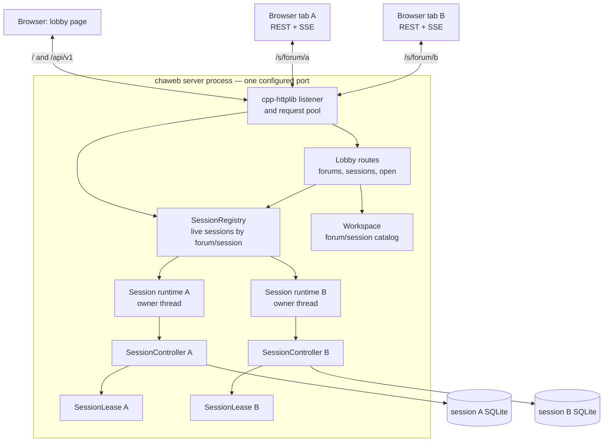

# chaweb detailed design

Status: proposed design, ready to guide implementation.

Last updated: 2026-07-31.

This document defines the composition, ownership, HTTP, streaming, locking, and
lifecycle design for `chaweb`. It follows the architecture and dependency rules
in [`src/README.md`](../src/README.md). The thread-per-session composition is an
explicit `chaweb` design choice, not a constraint imposed by the domain layer.

The browser implementation technology, component model, styling system, and
visual design are intentionally out of scope. They require a separate decision.

## 1. Decision summary

`chaweb` is a single server process that runs each live session on its own
dedicated thread:

- One `chaweb` process listens on the configured `host` and `port`. It serves
  every page, asset, REST route, and SSE stream from that one origin.
- The **lobby** is the root of that server, not a separate process. It serves
  the title page, lists forums and sessions, creates stored sessions, and opens
  them. Lobby routes never touch a live `SessionController`.
- Each live session is owned by one **session runtime** with one permanent
  **owner thread**. That thread exclusively owns the session's
  `SessionController`, its `Transcript`, its `SessionJournal`, its wake
  notifier, and its browser connection state. The controller owns its own agent
  worker threads as it already does.
- A **session registry** maps `forum/session` to the live session runtime. It
  is the authority on which sessions are live inside this process and it
  serializes opening, lookup, and unloading.
- Sessions are addressed by path: the chat page is `/s/{forum}/{session}/` and
  its API is under `/s/{forum}/{session}/api/v1/`. Opening a session returns
  that path, and the browser performs a same-origin navigation. No port
  changes, no redirect, and no `Host` reconstruction are involved.
- Opening a session that is already live routes the browser to it. The
  registry is authoritative, so a live session is never unreachable merely
  because its URL was lost.
- A companion file next to the session database carries an operating-system
  lock for the complete lifetime of the live session. The lock, not the file's
  existence, means that the session is in use. It makes a stored session
  exclusive across `cha`, `chacon`, and `chaweb` processes; the registry makes
  it exclusive within this process.
- A fatal session error is contained to its own session. That session tears
  down, releases its lease, and reports a terminal state to its browser; every
  other live session keeps running. Containment covers errors a session reports
  or throws. A thread that stops responding altogether cannot be recovered in
  process and is answered by restarting the server, as Section 9.2 explains.
- A live session supports one interactive browser page. It permits one active
  SSE stream and rejects another while that stream is active. This is a
  lightweight usage guard, not a security boundary or a strict browser-tab
  ownership protocol.
- A reloading or reconnecting page may retry briefly while the runtime notices
  the previous SSE connection closing. The design intentionally does not add
  attachment identities, epochs, browser-storage coordination, or multi-page
  synchronization.
- Commands use ordinary HTTP requests. Live transcript and generation updates
  use Server-Sent Events (SSE).
- The chat input accepts the shared text grammar, including slash commands and
  leading `@` addressing. The HTTP interface additionally exposes typed Stop
  and stable-ID default-agent controls.
- The service is an unauthenticated, trusted-network application. Any device
  able to reach the configured listener can use it.

This design deliberately does not provide a permanent chat shell containing a
sidebar of all forums and sessions. Session selection belongs to the lobby.
After selection, the browser navigates to a focused chat page for that session.
Switching sessions means returning to the lobby.

## 2. Goals

The design has the following goals:

1. Use one server process, one listener, and one origin.
2. Keep `SessionController`, `Transcript`, and `SessionJournal` single-owner
   objects without making them generally thread-safe, by giving each live
   session its own permanent owner thread.
3. Keep several live sessions completely independent of one another inside one
   process: no shared domain state, no shared queues, no shared locks on the
   command path.
4. Contain a fatal session error to its own session.
5. Enforce exclusive access to each stored session both across processes and
   within this process.
6. Allow different browser tabs to use different sessions concurrently.
7. Let a browser reach an already live session instead of being locked out of
   it.
8. Support one browser page per live session with a lightweight active-SSE
   guard, clear conflict reporting, and practical reload/reconnect behavior.
9. Preserve the supported slash-command, multicast, and `@mention` behavior in
   the web input box.
10. Stream model output to the browser while continuing to drain and persist
    agent events during temporary browser disconnection.
11. Work when the server is reached from another trusted device on the local
    network through one host and one port.
12. Keep transport objects and browser presentation concerns outside
    `session/`, `agents/`, and `transcript/`.

## 3. Non-goals

The first design does not include:

- User accounts, authentication, or per-user authorization.
- Multiple simultaneous viewers or writers for one session, including
  multi-page event fan-out, synchronization, and command coordination.
- Strict proof or enforcement that only one physical browser tab exists.
- Session sharing or collaborative chat.
- An integrated chat page that switches among projects, forums, or sessions
  without returning to the lobby.
- Opening a stored session as a side effect of navigating directly to its URL.
- Surviving a process crash, or resuming live sessions after a restart.
- A web close command, close button, or `POST /api/v1/close`.
- Internet-facing hardening or built-in TLS termination.
- A stable public API for third-party clients.
- Selection of browser implementation technologies.
- Exact visual layout, styling, accessibility treatment, or mobile interaction
  details.
- Per-client open quotas or open-rate limiting. The server bounds the number of
  concurrently live sessions, but the initial trusted-LAN application otherwise
  relies on the operator.

## 4. Terminology

| Term | Meaning |
| --- | --- |
| Stored session | A persistent chat represented by one SQLite database inside a forum. |
| Server process | The single `chaweb` process listening on the configured `host` and `port`. |
| Lobby | The root pages and routes of that server: forum and session listing, creation, and opening. It is not a process. |
| Live session | A stored session currently open inside the server process, represented by a session runtime. |
| Session runtime | The object owning one live session: its owner thread, `SessionController`, wake notifier, browser connection state, and SSE mailbox. |
| Owner thread | The one thread that exclusively accesses a live session's `SessionController` and all borrowed session state. |
| Session registry | The process-wide map from `forum/session` to live session runtimes; the authority on liveness and the serialization point for open and unload. |
| Session lease | The operating-system lock held on the session's companion lock file. |
| Session handle | An owning reference to a session runtime, held for the duration of one HTTP request so the runtime cannot be destroyed underneath it. |
| Active browser stream | The single SSE connection currently accepted by one live session. It is lightweight connection bookkeeping, not a browser identity or authorization credential. |
| HTTP worker | A cpp-httplib request-processing thread. It does not own domain state. |

## 5. System architecture



Every arrow from a browser terminates at the same listener and the same origin.
The registry is the only object that knows which sessions are live, and it is
the only place where an HTTP worker can obtain access to a session runtime.
Session runtimes never reference one another and share no domain state.

## 6. Server composition and startup

There is one invocation:

```text
chaweb
```

There is no internal mode flag, no child process, and no argument that names a
forum, session, or communication endpoint.

Startup:

1. Loads environment and application configuration.
2. Initializes diagnostic logging.
3. Constructs `Workspace`.
4. Constructs the `SessionRegistry`, bounded by the configured maximum live
   session count.
5. Installs process-level shutdown signal handling.
6. Constructs the HTTP server, registers lobby and session routes, and bounds
   the request pool as required by Section 8.6.
7. Binds the configured address and port and begins serving.
8. On a shutdown signal, performs the orderly shutdown in Section 19.

The composition root constructs no `SessionController`. Controllers exist only
inside session runtimes and are created by their own owner threads.

The web layer needs no libuv loop, handle, or signal watcher of its own. The
terminal frontends continue to use `UvEventLoop`; the session runtime's wake
notifier and deadline behavior are described in Section 9.6.

## 7. Session exclusivity

Exclusivity has two layers, and both are required:

- The **session registry** guarantees that this process opens each stored
  session at most once. It is the fast, authoritative, in-process answer.
- The **session lease** guarantees that at most one process holds a stored
  session. It protects against `cha`, `chacon`, and a second `chaweb`.

### 7.1 Companion lock

Each session database has a deterministic companion path. For example:

```text
2026-07-30-12-00-00-session.sqlite3
2026-07-30-12-00-00-session.sqlite3.cha-lock
```

The companion file may remain on disk permanently. Its presence is not an
indication that the session is active. Activity is represented only by an
exclusive operating-system lock held on an open handle.

The lease operation is:

- Exclusive.
- Non-blocking.
- Automatically released by the operating system if the process exits or
  crashes.
- Held from before session restore until after controller shutdown.
- Supported through one project abstraction with platform-specific
  implementations.

The workspace is expected to be on a local filesystem with reliable locking.
Concurrent use from filesystems whose locking behavior is absent or unreliable
is out of scope.

### 7.2 Why the database itself is not locked by cha

SQLite applies its own locking protocol to the database and its companion
journal files. An application-level lock on the same database file could
interact differently with SQLite across platforms, VFS implementations, and
journal modes. A separate file keeps the application lease independent of
SQLite's storage protocol.

### 7.3 Scope of exclusivity

The lease is a session-layer concern, not a web-only convention. `cha`,
`chacon`, and a `chaweb` session runtime must all fail clearly if another
process already holds the session lease.

This is an intentional behavior change for the existing terminal frontends.
They do not currently acquire an application-level session lease. After this
change, they fail immediately with a clear “session already in use” result
rather than relying on eventual SQLite contention or other storage behavior.

The lock must be acquired before loading restorable session state. Otherwise
two processes could both restore the same request and entry counters before
one discovers the conflict.

A session-layer `SessionLease` object should therefore be acquired by
`Workspace` and moved into the resulting `SessionController`. Its lifetime must
outlast `SessionJournal`.

Because one process now holds many leases at once, each lease must be an
independently owned handle. No global or per-process lock table, shared
descriptor, or cross-session lock ordering is introduced. A session's lease is
acquired and released only by that session's owner thread.

### 7.4 In-process exclusivity

Two browser requests that open the same session cannot both create a runtime.
The registry inserts a placeholder entry under its mutex before any slow work
begins, so the second request observes the first and either waits for it or is
routed to the resulting live session. The lease is therefore not the mechanism
that resolves in-process contention; it is the backstop against other
processes.

### 7.5 Creating without opening

The current `Workspace::create_session()` both creates a database and returns a
live controller, and it requires a `WakeNotifier` the lobby does not own.

The session layer should add a create-only operation that:

1. Validates and loads the forum metadata needed for creation.
2. Creates the session database atomically through `SessionCatalog`.
3. Returns its `SessionSummary`.
4. Does not initialize providers, acquire a lease, or construct a controller.

Step 2 must keep the existing publish-or-retry behavior rather than reduce to
testing whether a name is free and then creating it. Two lobby requests
creating in the same forum within the same timestamp second derive the same
candidate name, and the collision is resolved by the publish failing for the
loser, which then takes the next name. A create-only operation written as a
check followed by a create would instead lose one of the two sessions. Section
9.8 states this requirement in its general form.

The existing create-and-open operation remains a convenience for the terminal
frontends. The web lobby does not use it. Creating and opening are two separate
lobby operations, described in Section 10, and the page performs them in
sequence.

Keeping them separate is what makes the failures well behaved. Creation
publishes a database and nothing more, so it either succeeded, in which case
the response names the session, or it failed, in which case nothing exists. No
outcome leaves a session the caller was not told about, and there is no state
in which repeating a create is the wrong response to an error.

Opening the result then runs the ordinary path in Section 8.2, so a new session
and an existing session are opened by exactly the same code and reported by
exactly the same responses. A session that was created a moment ago and cannot
be opened is indistinguishable from any other stored session that cannot be
opened, which is the point: it needs no distinct code, and the page needs no
branch for it.

That covers the race where another *process* opens the new session between
creation and the owner thread acquiring its lease. Another request in this
process cannot, because it takes the same registry path. An external frontend
that wins the race causes an ordinary `session_busy` open, against a session
the page already holds the identity of, and the stored session remains in the
catalog either way.

A session left created but never opened, whether because the open failed or
because the browser went away between the two requests, is simply a stored
session. It appears in the listing and can be opened later. Nothing needs to
roll it back.

## 8. Session registry and lifecycle

### 8.1 Registry state

The registry owns a map keyed by validated `forum/session` identity. Each entry
holds:

- Its lifecycle state: `starting`, `running`, or `stopping`.
- An owning reference to the session runtime, once one exists.
- The `std::thread` for that session's owner thread.
- A shared, owning startup result used only during `starting`.
- A `finished` flag, written by the owner thread under the registry mutex as its
  last action and read only under that mutex.

Beside the map, the registry holds one **stopping flag** for the registry as a
whole, set once when process shutdown begins and never cleared. It is not per
entry. It is read under the registry mutex by the open path in Section 8.2 and
by every owner thread at the moment it would publish a runtime, and it is the
single fact that decides whether a session that finished opening is allowed to
become live.

The registry has one mutex. It is held only for map operations, state
transitions, and reads of the stopping flag, never while opening a session,
running a command, writing to a socket, or shutting a controller down. No
domain object is reachable while the mutex is held; the mutex protects the map,
not the sessions.

A lookup returns an owning **session handle** rather than a raw pointer. An
HTTP worker holds that handle for the duration of its request, so a runtime
cannot be destroyed while a request is using it. Lookup succeeds only for a
`running` entry; `starting` and `stopping` entries are never handed to a
browser request.

The owner thread must never hold an owning handle to its own runtime. Otherwise
the last reference could drop on that thread and a runtime would try to join
itself.

### 8.2 Opening a session

An open request carries a forum and a session identifier, both validated
through `Workspace`. Route text is never treated as a filesystem path.

Under the registry mutex:

1. Sweep finished entries as described in Section 8.4.
2. Look up the key.
   - `running`: return its route immediately. This is the reattach case.
   - `starting`: attach to the existing shared startup result and wait on it.
   - `stopping`: fail with `409 Conflict` and code `session_stopping`. The
     lease is still held while that session tears down; the page may retry.
   - Absent: if the registry is at the configured maximum, fail with
     `503 Service Unavailable` and code `session_limit_reached`. Otherwise
     insert a `starting` entry with a fresh startup result and start its owner
     thread.

The capacity test in that last bullet counts **entries in the map, in every
state**, not `running` entries. A slot is taken by inserting the entry and
released by erasing it, so the map is the accounting and there is no separate
reservation to keep in step with it. Section 8.6 says which resources this
protects.

Counting only `running` entries would defeat the bound entirely: any number of
concurrent opens for distinct sessions would each observe no live session, all
admit, and start an unbounded number of owner threads. The check and the
insertion happen under one acquisition of the registry mutex, so concurrent
opens cannot both pass it. Step 1's sweep runs first in that same acquisition,
which is what keeps a finished-but-unreclaimed entry from holding a slot it no
longer needs.

Outside the mutex, the requesting HTTP worker waits on the startup result for
at most one bounded open deadline. Each waiting request has its own deadline of
that same duration, measured from when *that request* began waiting rather than
from when the open started. A request that attaches to an open already in
progress therefore gets a full wait, not the remainder of an earlier requester's.

The deadline bounds a request, never the open. Waiters may attach and give up
independently; the owner thread continues and resolves the startup result for
whoever is still waiting and for the entry itself. An open that never completes
because the owner thread wedges leaves the entry `starting` permanently, which
is the terminal state of Section 9.2 with the same remedy, and which Section
19.1 already keeps from blocking process exit.

The owner thread performs the open itself:

1. Calls `Workspace::open_session()`, which validates the identifiers, acquires
   the companion lease without waiting, restores database state, and constructs
   the `SessionController` in that order.
2. On success, takes the registry mutex once and commits the outcome under it,
   as described below.
3. On a held lease, completes the startup result with `busy`, marks itself
   finished, and exits.
4. On any other failure, completes the startup result with `error` and a
   presentation-safe message, marks itself finished, and exits.
5. After `ready`, enters the owner loop of Section 9 and begins serving.

The controller is therefore constructed, used, and destroyed entirely on one
thread. Nothing hands a live controller across a thread boundary.

Step 2 is the commit point, and it is one indivisible decision under the
registry mutex. Holding that mutex, the owner thread reads the registry's
stopping flag and takes exactly one of two paths:

- The flag is clear: it publishes the runtime into the entry, transitions it to
  `running`, and completes the startup result with `ready`.
- The flag is set: it publishes nothing, leaves the entry unpublished, and
  completes the startup result with `shutting_down`. It then releases the mutex
  and tears the newly constructed controller down through the ordinary sequence
  of Section 19.2, which releases the lease it just acquired.

A session that finished opening therefore either becomes live or never existed
as far as any request can tell. There is no interval in which an entry is
`running` while the process is shutting down, and no request can be handed a
path to a session that is already being destroyed.

The startup result has exactly one writer. Only the owner thread ever completes
it, and it does so exactly once, with `ready`, `busy`, `error`, or
`shutting_down`. Nothing else in the design — including process shutdown —
resolves a startup result. Section 19.1 fails waiting requests by waking them,
not by writing an outcome they did not produce.

An open already constructing when shutdown begins runs to completion and is
then immediately torn down. That waste is accepted deliberately. Aborting
earlier would mean several places that must each get the race right instead of
one; the work is bounded by the rule in Section 9.1 against unbounded blocking
calls, and Section 19.1's grace period covers it.

The waiting request maps the result to:

- `200 OK` with `{"path":"/s/{forum}/{session}/"}` on `ready`.
- `409 Conflict` with code `session_busy` on `busy`.
- `500 Internal Server Error` with a stable code on `error`.
- `503 Service Unavailable` with code `server_stopping` on `shutting_down`, or
  when a waiter is woken by shutdown before any outcome exists.
- `503 Service Unavailable` with code `session_open_timeout` if the deadline
  expires first.

An expired deadline fails only the *request*. The entry is left alone: its
owner thread is still opening the session and will resolve it. The registry
must not start a second owner thread for the same key, and the browser must not
treat the timeout as evidence that the session is unavailable — a later open
request may find it `running`.

### 8.3 Routing an in-flight request

Every session route resolves its runtime the same way: validate the path
identifiers, ask the registry for a session handle, and proceed only if one is
returned.

If the registry has no `running` entry for that key:

- Page routes return the “session is not open” page, which links to the lobby.
- API and SSE routes return `409 Conflict` with code `session_not_live`.

Navigating directly to a session path never opens a session. Opening is an
explicit lobby operation, so lease acquisition and controller construction have
exactly one entry point and never happen inside asset or page handling.

### 8.4 Unloading and sweeping

Unloading always begins on the owner thread, from the idempotent shutdown
sequence in Section 19.2. Its first action is to take the registry mutex and
transition its entry to `stopping`. From that moment:

- Lookups no longer return a handle for that key, so no new request can reach
  the session.
- A new open request for that key fails with `session_stopping` rather than
  resurrecting the entry or racing it for the lease.

The owner thread then completes teardown and releases the lease. Its last action
is to take the registry mutex, set `finished`, and release the mutex, after
which it returns. It does not erase its own entry and does not join its own
thread.

Setting `finished` under the registry mutex is what makes it safe to read. The
flag is ordinary registry state rather than a lock-free channel, and the mutex
supplies the ordering between the owner thread's final writes and a sweeper's
read of them. This is deliberately a mutex rather than a documented
release-store and acquire-load pair: it costs one uncontended acquisition per
session lifetime, and it needs no memory-order reasoning to review or to keep
correct later.

The registry erases and joins lazily. Every registry operation — open, lookup,
and shutdown — first sweeps entries whose `finished` flag is set, in two phases:

1. Under the registry mutex, move every finished entry out of the map into a
   local list, taking its `std::thread` and the registry's reference to its
   runtime with it.
2. After releasing the mutex, join each thread and drop each runtime reference.

The split is required, not stylistic. `finished` is set just before the owner
thread returns rather than after it exits, so joining it can still block
briefly; and when no in-flight request holds a handle — the ordinary case — the
registry's reference is the last one, so dropping it runs the runtime's
destructor. Doing either under the registry mutex would stall every other
session's requests behind one session's reclamation and would break the rule in
Section 8.1 that no domain object is reachable while the mutex is held.

Because in-flight requests may still hold handles, the runtime object is
destroyed when the last handle drops rather than necessarily during the sweep;
by then the owner thread has already stopped the controller and released the
lease, so a late handle observes only a stopping session that refuses work.

Between phase 1 and phase 2 the key is absent from the map, so a concurrent open
may insert a fresh entry and start a new owner thread for that same session
while the old thread is still being joined. That is safe: the old thread
released its lease before it set `finished`, so the new owner thread can acquire
it, and the two threads share nothing else.

Sweeping is bounded work proportional to the number of finished entries, and it
happens on a thread that is already performing a registry operation. No reaper
thread is introduced.

### 8.5 Serialization rules

- All map mutation, state transitions, and reads and writes of `finished` happen
  under the registry mutex.
- No slow or blocking operation runs under that mutex: not lease acquisition,
  not controller construction, not controller shutdown, not socket I/O, not any
  thread join, and not the destruction of a runtime. The two-phase sweep of
  Section 8.4 is what lets this be stated without exceptions.
- The mutex is never acquired by an owner thread while it holds any session
  lock or is inside a controller call, so there is no lock-ordering
  relationship between the registry and any session's internal state.
- The startup result is an owning shared object with its own synchronization.
  It outlives both the requesting HTTP worker and a failed owner thread.

### 8.6 Bounded live sessions and pool sizing

The number of concurrently live sessions is bounded explicitly. This is a
requirement rather than a preference, because each live session holds one
long-lived SSE request that occupies a cpp-httplib pool thread for as long as
its browser is connected.

The request pool must therefore be sized to at least the maximum live session
count plus headroom for concurrent command, snapshot, lobby, and asset
requests. If it is not, connected SSE streams starve every other request in the
process. Both values are configured or documented together and must not be left
as independent defaults.

This bound holds only because SSE writes are themselves bounded. A live session
occupies one request thread rather than an unpredictable number of them because
a browser that stops reading cannot block its writer indefinitely, which
Section 13.1 requires.

Each live session also owns one owner thread plus the controller's own agent
worker pool, which has one worker per forum persona. The live-session bound is
the only limit on that growth, so it must be chosen with the workspace's forum
sizes in mind.

Those costs are why the bound counts registry entries in every state rather
than only `running` ones, as Section 8.2 requires. A `starting` entry already
owns an owner thread and is in the act of acquiring a lease and building a
controller. A `stopping` entry still owns its thread and still holds its lease
until teardown finishes. Only the SSE pool thread is exclusive to `running`, so
sizing against `running` alone would bound the smallest of the three resources
and none of the others.

An entry removed from the map but whose thread has not yet been joined holds no
lease, no controller, and no request thread, so it is not a resource this bound
needs to cover. Section 8.4 describes that window.

Reaching the bound is an ordinary, reportable condition: `503` with code
`session_limit_reached` and a presentation-safe message. It is not a fatal
error and does not affect any live session.

## 9. Session runtime ownership and threading

### 9.1 Ownership invariant

Each live session has one permanent owner thread. Only that thread may:

- Call `SessionController` commands.
- Call `SessionController::receive()`.
- Read `TranscriptView`.
- Read personas, default-agent state, or generation state.
- Construct transport snapshots or events from borrowed session values.
- Call `SessionController::shutdown()`.

The controller already owns its `Transcript`, `SessionJournal`,
`AgentRegistry`, session-scoped agent thread pool, and now its `SessionLease`.
The runtime does not create additional copies of these objects.

The invariant is per session, not per process. Two owner threads running two
controllers concurrently are independent by construction, because no domain
object is shared between them.

Owner-thread work must not make an unbounded blocking call. Every blocking
operation a session performs — network, filesystem, or synchronization — needs
a bound, because an owner thread that stops responding cannot be recovered from
outside. Section 9.2 states that limit and its remedy.

### 9.2 HTTP threads

cpp-httplib request threads are pooled and have no affinity with a browser or a
session. Even one browser uses a long-lived SSE request and separate command
requests, which may execute on different HTTP threads, and one HTTP thread
serves different sessions over its lifetime.

An HTTP handler therefore:

1. Parses and bounds the HTTP request.
2. Resolves the session handle from the path through the registry.
3. Constructs a typed web command.
4. Enqueues it for that session's owner thread.
5. Wakes that session's owner loop.
6. Waits for the short synchronous domain result within one generous command
   completion deadline.
7. Serializes the owning result after the owner thread has released it.

An HTTP handler never retains `TranscriptView`, `std::span`, pointers, or
references into a controller, and it never touches a controller belonging to a
session other than the one it resolved.

After successful enqueue, the handler and queue share an owning completion
object whose lifetime does not depend on the HTTP request. The handler waits
through one generous deadline covering queue delay and command execution. On
expiry it returns `503 Service Unavailable` with code `command_timeout`
when the connection remains writable, logs the session's identity, and stops
there. It does not cancel the command, does not remove it from the queue, and
does not shut the session down. The command may already have applied or may
still execute afterwards, so its outcome is unknown and the browser must not
retry it automatically. A late completion is harmless after the handler
releases its reference.

That deadline bounds the *request*, not the session. It cannot distinguish a
thread that is slow from one that is stuck, and a slow session normally
recovers, so tearing one down over a single late response would destroy working
state to no benefit.

A session whose owner thread genuinely stops responding cannot be recovered
from another thread. The shutdown sequence of Section 19.2 runs *on* the owner
thread, so asking a stuck thread to shut down accomplishes nothing, and a C++
thread cannot be safely killed. Such a session stays live in the registry, keeps
its lease, and fails every later command on the same deadline until `chaweb` is
restarted. Restarting clears the condition completely: the operating system
releases the companion lock and nothing is resumed. For a personal or
small-group deployment that is an acceptable remedy, and it is the same remedy
an uncontainable crash already requires. Section 19.1 keeps process shutdown
itself bounded so that restarting is always possible, Section 9.1 states the
rule that keeps this rare, and Section 23.1 records what a process-per-session
design would have offered instead.

Such a session keeps whatever registry state it already had — `running`, or
`starting` if it never finished opening. There is deliberately no fourth state
marking it unresponsive. Nothing could set one honestly: the command deadline is
the only available signal, and it cannot tell a stuck thread from a slow one, so
a session condemned on that evidence would often be a healthy session that
answered late. A state that would be assigned wrongly is worse than no state,
and the log record of the expiry already tells an operator what a state would
have.

Failure to enqueue because the session is already stopping or the bounded queue
cannot accept the command is different: the command was not accepted and cannot
execute. Nothing was applied, which is what separates these failures from a
deadline expiry. Section 11.3 gives their codes and retry rules. Controller
commands do not synchronously wait for model completion; they start or modify
session work and return promptly.

A command arriving for a session that is already `stopping` in the registry does
not reach the enqueue step at all: Section 8.1 hands out handles only for
`running` entries, so Section 8.3 rejects it during handle resolution. The
enqueue-time stopping failure covers only the narrow case where a handle was
resolved while the session was `running` and the runtime marked itself stopping
before the command landed.

A client connection can disappear any time after enqueue. The command may still
complete even though the client did not receive its response. On reconnect the
browser resynchronizes from the authoritative snapshot and does not
automatically repeat a non-idempotent command.

The owner loop services commands and agent notifications fairly. It uses
bounded batches or equivalent interleaving so a sustained agent-event stream
cannot starve a queued command and time it out spuriously.

SSE connect/disconnect notifications that affect session lifetime are
serialized through the owner loop as well. The HTTP server may use a
session-local stream identifier to ensure a duplicate or late close callback
cannot detach a newer stream. This identifier never leaves the process and is
not a browser attachment credential.

### 9.3 Owning transport values

The owner thread converts borrowed domain state into owning web values. Such a
value contains its own strings, vectors, identifiers, and scalar status fields.
It remains valid after the transcript changes.

Socket writes do not run on the owner thread. The owner publishes owning
payloads through the latest-state mailbox described in Section 13.2, and the
SSE request thread writes them to the network. A slow or disconnected browser
therefore cannot block controller event processing or persistence, and it
cannot affect any other session.

### 9.4 Agent notifications

Agent executions continue to use `WakeNotifier`. Each session runtime owns its
own notifier and passes it to its controller, so an agent thread wakes only its
own session's owner loop. When notified, the owner thread drains
`SessionController::receive()` and publishes any resulting transcript,
generation, or notice changes.

Draining is independent of browser connection state. If the browser disconnects
during generation, the runtime continues to call `receive()` so terminal
outcomes reach `SessionJournal`.

### 9.5 Fatal-error containment

`src/README.md` states that persistence failures are fatal to the *session*.
This design honors that literally: a fatal session error ends that session and
nothing else.

The owner thread runs its loop body inside a containment boundary. On a thrown
fatal error — a failed journal write, a violated controller invariant, or any
other exception escaping session work — it:

1. Logs the failure with the session's forum and session identity.
2. Enters the idempotent shutdown sequence of Section 19.2 with reason
   `session_failed`.
3. Publishes a final snapshot carrying lifecycle `stopping` and a
   presentation-safe reason while the SSE stream is still writable.
4. Runs `SessionController::shutdown()` so agent work is cancelled and joined
   under existing session policy, then destroys the controller and releases the
   lease.

Teardown steps that may themselves fail are individually guarded so one failure
cannot prevent lease release or thread joining.

The browser sees a terminal error state rather than a dropped connection, and
the lobby lists that session as available again once the lease is released.
Every other live session is untouched, and the process keeps serving.

Containment covers thrown C++ exceptions. It does not and cannot cover
undefined behavior, `std::terminate` from a `noexcept` path, `std::abort`, or
heap exhaustion that cannot be unwound. Those remain fatal to the whole
process and take every live session with them. That is the accepted cost of the
single-process composition; it is bounded by the same failure policy the
terminal frontends already rely on, and by session leases being released
automatically by the operating system when the process dies.

### 9.6 The owner loop

Each session runtime owns a wake notifier that supports two operations: wake
from another thread, and wait until either woken or a deadline expires. Agent
threads and HTTP threads use the wake; the disconnect rule of Section 14.3 uses
the deadline.

A condition variable satisfies both, and that is the expected implementation.
The session runtime owns no descriptors, sockets, or signal handles of its own —
cpp-httplib owns the sockets and the process owns signal handling — so a libuv
loop per session would add a loop, an async handle, and a timer handle per
live session without adding capability. Section 23.6 records that alternative.

### 9.7 Concurrent controllers and process-global state

Running N controllers in one process makes “the domain layer contains no
process-global mutable state” a load-bearing invariant. It holds today, and the
current code was reviewed for it:

- `agents/completion_client.cpp` initializes libcurl once through a
  function-local static, which is thread-safe to initialize. Each backend keeps
  its own easy handle and is touched only by the runner holding its exclusive
  lease, so concurrent controllers need no additional serialization.
- `session/session_catalog.cpp` already serializes `std::localtime` behind a
  static mutex, and its comment anticipates catalogs creating sessions on
  multiple threads.
- SQLite is compiled with `SQLITE_THREADSAFE=1`, and connections open with
  `SQLITE_OPEN_NOMUTEX`. Each session opens its own connection to its own
  database file and touches it only from its owner thread. No connection or
  statement is ever shared.
- The spdlog logger is thread-safe and is the one intentionally shared sink.
- Signal handling is installed once, at process level, by the composition root.

This invariant should be stated in `src/README.md` alongside the existing
ownership rules, and covered by a test that runs two live controllers
concurrently. Any future process-global mutable state introduced in `session/`,
`agents/`, or `transcript/` is a defect against this design, not a local
concern.

### 9.8 Shared workspace access

Section 9.7 covers state that is global to the process. `Workspace` is the one
domain object the design deliberately *shares*: the composition root constructs
a single instance, lobby HTTP threads call `forums()`, `sessions()`, and the
create-only operation on it, and every owner thread calls `open_session()` on
the same instance while those lobby calls are in flight. That is intended, and
it is safe for a specific reason worth writing down.

`Workspace` is immutable after construction. It holds a root path and the
application configuration, every method is `const`, and none of them caches. A
forum's metadata is re-read from disk on each call, and each call that needs a
catalog constructs its own. Any thread may therefore call any method at any
time, and no method needs a mutex, because there is no shared mutable state for
one to protect.

The serialization that concurrent sessions actually depend on lives in the
filesystem rather than in the object. Creating a session database writes a
uniquely named temporary file, commits it in full, and only then publishes it
into place under its final name with an operation that fails if that name is
taken. A caller that loses the race is told so and picks the next name. This
makes creation atomic against other *processes*, so threads within one process
are the easy case, and it means a concurrent listing either sees a finished
session or does not see it at all — never a half-built one.

Two consequences bind future work. Adding a cache to `Workspace` — for forum
metadata, for persona definitions, for anything — is the change most likely to
be proposed, because opening a session re-parses persona files that rarely
change. Such a cache is allowed only if it is populated during construction and
never mutated afterward. A lazily filled cache ends the shared-instance
arrangement, and whoever adds one must also give each thread its own
`Workspace`. Separately, any new operation on shared session state must inherit
the publish-atomically-or-report-the-collision shape above rather than testing
for absence and then creating. Both rules carry the same weight as Section
9.7's prohibition on process-global mutable state.

## 10. Lobby HTTP interface

The following route shape defines responsibilities; minor naming changes do not
alter the architecture. The bundled browser client and server are released
together, so this is not initially a third-party compatibility contract.

| Method and path | Purpose |
| --- | --- |
| `GET /` | Serve the lobby page. |
| `GET /health` | Report server liveness and the live-session count. |
| `GET /api/v1/forums` | List available forums and display metadata. |
| `GET /api/v1/forums/{forum}/sessions` | List stored sessions in one forum, marking which are live. |
| `POST /api/v1/forums/{forum}/sessions` | Create a stored session and return its identity. It does not open it. |
| `POST /api/v1/forums/{forum}/sessions/{session}/open` | Open a stored session, or route to it if it is already live, and return its path. |

The lobby validates forum and session identifiers through `Workspace`; route
text is never treated as a filesystem path. Both stable IDs contain only RFC
3986 unreserved ASCII characters (letters, digits, `-`, `.`, `_`, and `~`),
excluding the complete names `.` and `..`. Display names and session labels are
presentation text and do not inherit that restriction.

Creating and opening are deliberately separate operations rather than one
route that does both. Creation returns `201 Created` with the new session's
identity and reaches the catalog only on success, so its outcome is never
partial. The page then issues an ordinary open against the identity it just
received. Section 7.5 gives the reasoning; the short form is that a composite
route would have to describe a database that exists behind an open that
failed, and there is no honest way to report that as a single result.

The open route is the only one that opens anything, and it does not care
whether the session was created a second ago or a month ago.

Opening returns:

- `200 OK` with `{"path":"/s/{forum}/{session}/"}` when the session is live,
  whether this request opened it or found it already running.
- `409 Conflict` with code `session_busy` when another process holds the lease.
- `409 Conflict` with code `session_stopping` when a previous runtime for that
  session has not finished tearing down.
- `503 Service Unavailable` with code `session_limit_reached`,
  `session_open_timeout`, or `server_stopping`.
- `404 Not Found` with code `not_found` for a forum or session identifier that
  is invalid or names nothing.
- `500 Internal Server Error` with code `internal_error` if lease acquisition,
  restore, or controller initialization fails.

Every response above uses the body shapes of Section 16.1 and Section 16.2.

The lobby must not report success before the owner thread has acquired the
session lease, constructed its controller, and been published as `running`.

The returned value is a path, not an absolute URL. The browser navigates with
its existing origin, so the design needs no advertised hostname, no authority
parsing for navigation, no IPv6 bracket handling, and no cross-origin
navigation. Section 15.3 describes the one place a request header is inspected,
which is a mutation check rather than a navigation input.

Session listing marks live sessions so the lobby page can distinguish “open
this” from “return to this.” That marking is advisory: it is read from the
registry outside the open operation and may be stale by the time the user
clicks. The open route is authoritative.

Creation fails only on invalid input, an unwritable workspace, or the live
listing's own errors, and it has no lifecycle codes of its own because it
starts no lifecycle. It never returns `session_busy`, `session_limit_reached`,
or `session_open_timeout`; those describe opening, and the page sees them from
the open request that follows.

When that open fails, the page has already been told what was created. It
reports the failure using the same handling it uses for opening any stored
session, and it must not repeat the create request, which would produce a
second session. Because the identity is already in hand, retrying the *open* is
always the correct response, and the created session is visible in the listing
whether or not the page retries at all.

## 11. Session HTTP interface

All session routes are scoped by path. `{forum}` and `{session}` are validated
URL-safe identifiers, and the pair is the registry key.

| Method and path | Purpose |
| --- | --- |
| `GET /s/{forum}/{session}/` | Serve the chat page for that session. |
| `GET /s/{forum}/{session}/api/v1/session` | Return a full owning session snapshot. |
| `POST /s/{forum}/{session}/api/v1/input` | Submit one raw line through the shared text grammar. |
| `POST /s/{forum}/{session}/api/v1/actions/stop` | Request cancellation of active generation. |
| `POST /s/{forum}/{session}/api/v1/actions/default-agent` | Change the run-local default agent. |
| `GET /s/{forum}/{session}/api/v1/events` | Open or reconnect the session's SSE stream. |

Every route in this table first resolves a session handle as described in
Section 8.3. Page routes for a session that is not live serve the “session is
not open” page; API and SSE routes return `409 Conflict` with code
`session_not_live`.

There is no per-session status route. An earlier draft carried one so that a
page could discover why its SSE connection had been refused, which was necessary
only because `EventSource` hides HTTP error bodies. Section 13.1 consumes the
stream with `fetch` instead, so the refusal reason arrives in the response
itself. Process-level observability stays at `/health`, and per-session state is
visible in the session-tagged logging of Section 17.

### 11.1 Raw input

`POST .../api/v1/input` uses the shared text-input handling for the supported
web grammar:

- Ordinary prompts for the default agent.
- Leading `@Name` addressing.
- Escaped leading `@@`.
- `/mcast`.
- `/clear`, `/hide-on`, `/hide`, `/hide-off`, `/info`, `/agents`, and `/stop`.
- `/@Name` default-agent selection.

### 11.2 Browser controls and typed operations

Clear and off-record browser controls submit the exact shared-grammar strings
`/clear`, `/hide-on`, `/hide`, and `/hide-off` through
`POST .../api/v1/input`. The page is bundled with the server, so keeping those
small mappings synchronized does not justify duplicate routes, schemas, and
runtime commands.

Stop remains a typed action because it is an out-of-band generation control:
using it must not replace or clear a draft in the prompt editor. The
default-agent action also remains typed and accepts a stable persona ID.
Persona display names are unique case-insensitively but are not necessarily
lossless command tokens: internal whitespace is valid, while `/@Name` parses
only one whitespace-delimited handle. Both typed actions delegate to the same
authoritative session semantics used by the text grammar.

Add another typed action only when its value cannot be represented losslessly
by the shared input grammar or it must remain independent of editor input.

### 11.3 Command results

HTTP transport errors and domain command outcomes are distinct:

- Malformed JSON and unexpected content types are `bad_request`, excessive
  bodies are `body_too_large`, and invalid route identifiers are `not_found`,
  all as Section 16.1 defines them.
- A session that is not live is a routing failure, reported as
  `session_not_live`.
- A syntactically valid command may produce an ordinary domain result such as a
  notice, an empty prompt warning, or generation-in-progress refusal.
- Expiration of the generous command-completion deadline is a failure of that
  *request*, reported as `command_timeout`. The command outcome is
  unknown. The session is not shut down and may still be serving.
- Persistence failures and violated controller invariants are fatal session
  errors, contained as described in Section 9.5.

A command that never runs is a different kind of failure from one whose result
never arrives, and the page must be able to tell them apart. Every command route
therefore resolves to one of these:

| Situation | Status | Code | Was anything applied? |
| --- | --- | --- | --- |
| The bounded command queue cannot accept it | `503` | `command_queue_full` | No. Retrying is safe. |
| The runtime marked itself stopping before the enqueue landed, or session teardown drained it before it started | `409` | `session_not_live` | No. Retrying this session is pointless; the page returns to the lobby. |
| Process shutdown drained it before it started | `503` | `server_stopping` | No, and there is nothing to retry against. |
| The completion deadline expired | `503` | `command_timeout` | **Unknown.** Never retried automatically. |

The last row is the only one that leaves the outcome undetermined, and that
distinction matters more than the individual codes. In the first three the
command provably never executed, so a retry cannot duplicate an effect. After
`command_timeout` it may have executed, may still execute, and the browser
resynchronizes from the next snapshot rather than resending.

The stopping case deliberately reuses `session_not_live` rather than
introducing a code of its own. The page's required action is identical to any
other request against a session that is no longer live, and a distinct code
would add a branch with no distinct behavior behind it.

A web command result is an owning structure derived from `SessionUpdate`. It
may contain:

- Whether the input should be cleared.
- An optional notice.

It has no `applied`, accepted, or refusal field. `SessionUpdate` does not
provide that domain concept, and the web boundary must not infer it from
`clear_input`, `render_needed`, or notice text.

`clear_input` applies to the value submitted by that request. A Clear or
off-record button sends its synthetic command without replacing the prompt
editor's existing draft, so the response does not clear that draft.

The snapshot stream is the only source of the page's notice. The runtime applies
a command's notice to its owned notice state before completing the command and
treats the change as structural, causing a snapshot, so the notice reaches the
page over the stream like every other piece of state.

A command response may carry that notice too, but the page must never write it
into its notice state. It may only render it as transient, request-scoped
feedback somewhere the notice does not live, such as beside the input that
produced it. This is a separation rather than an ordering rule: because the two
never touch the same state, a delayed response cannot overwrite a newer
snapshot, and the page needs no bookkeeping about which arrived first.

No snapshot state at all is updated from an HTTP command response.

HTTP behavior must not depend on parsing the English text of a notice.
Structured outcome codes may be added at the web boundary or, where necessary,
to the session command contract, but only with an explicit definition rather
than inference from existing `SessionUpdate` fields.

### 11.4 Lightweight single-page policy

One browser page per live session is the supported usage model. The runtime
uses the active SSE connection as a lightweight guard:

- The first SSE connection is accepted.
- Another SSE connection is rejected while the first is active.
- The bundled page enables interactive controls only after its SSE connection
  is accepted and its initial snapshot arrives.
- A rejected page disables its controls and displays “This session is already
  open in another browser page.”

The guard is per session. Different sessions are wholly independent, so two
tabs on two different sessions never interact.

REST requests do not carry attachment IDs, page IDs, or epochs. The guard is
not an authorization mechanism and does not attempt to stop a deliberately
constructed client from calling REST endpoints. This is appropriate for the
personal, trusted-network application.

If an unusual browser race allows two requests to reach one session's command
queue, owner-thread serialization and `SessionController` invariants preserve
domain correctness. This is a safety net, not support for multiple interactive
pages.

## 12. Session snapshot

A session snapshot is an owning, presentation-neutral web value. At minimum it
contains:

- Forum identity and display name.
- Session identity and label.
- Persona identities and display names.
- Current default persona.
- Transcript entries with semantic kind, participant identity, addressing,
  text, status, and request/entry identifiers as appropriate.
- Generation state: inactive or active, an optional stable request ID while a
  foreground run is active, agent, phase, streamed reasoning text, and any
  other presentation-safe ephemeral status.
- The current presentation notice.
- Coarse session lifecycle phase and a presentation-safe shutdown reason when
  stopping.

It carries no port, host, or lobby address. The return-to-lobby link is the
same-origin path `/`.

The web layer defines explicit JSON mappings. Persistence structures and
SQLite-specific types are not serialized as the API merely because they already
exist in C++.

The web runtime owns the current presentation notice. It applies
`SessionUpdate.notice` exactly as defined by the session contract: absent leaves
the notice unchanged, an empty value clears it, and a non-empty value replaces
it. This makes reconnect snapshots complete without moving browser concerns into
`SessionController`.

A snapshot carries the whole transcript, and it is sent on every connect and
every structural change. One ordinary turn crosses several structural changes —
generation activation, phase transitions, the first reasoning delta, the first
answer delta, entry completion — so the bytes a session sends grow with the
square of its length. The per-token path stays incremental: `append` carries
only new text, so the high-frequency case is proportional to the delta, not to
the transcript. Snapshots are per structural event, not per token.

The cost that matters is not bandwidth on a local network. Snapshot
construction runs on the owner thread, as Section 9.3 requires, so it is CPU on
the same thread that services commands, and it is one of the things the
fairness rule of Section 9.2 has to keep bounded.

This design accepts that growth. For a personal or small-group application on a
local network, with sessions of realistic length, whole-transcript snapshots are
the simplest correct thing and are what make the “no replay log, no revision, no
divergence resync” properties of Section 13 possible. Section 23.12 records the
escape hatch if a session ever becomes long enough for it to matter.

## 13. SSE update model

### 13.1 Connection behavior

A live session permits one active interactive SSE stream. If no stream is
active, the request is accepted and receives a full snapshot. If one is already
active, the runtime rejects the new request with `409 Conflict` and the stable
code `browser_stream_in_use`.

The bundled page consumes the stream with `fetch` and a streaming response
reader rather than `EventSource`. That choice is load-bearing rather than
stylistic: the page reads the `409` status and its `browser_stream_in_use` code
directly from the refused response, and it owns reconnection outright. With
`EventSource` neither is true — the error body is hidden, which would force a
second route to ask why the connection failed, and the browser's own
reconnection would run in parallel with any the page attempts.

Consuming the stream this way means the page parses SSE framing itself, so the
framing is a contract rather than a library's concern:

- A record is one or more lines terminated by a blank line.
- A state-bearing record has an `event:` line naming `snapshot` or `append`, and
  a single `data:` line holding that event's JSON on one line.
- A line beginning with `:` is a comment. Heartbeats use this form and carry no
  state.
- No other line types are emitted, and in particular no `id:` fields, so a
  reader needs no event-ID or replay handling.

On reload, the replacement request may arrive before cpp-httplib observes the
old connection closing. The page retries for a short bounded interval. SSE
heartbeats help the runtime notice dead connections. If the old stream remains
active through the retry interval, the page displays the same “already open”
message and lets the user retry manually. Avoiding every such edge case is not
worth a browser identity or lease protocol for this personal application.

The runtime assigns each accepted stream an internal connection identifier.
Only a close notification matching the active identifier clears the slot. The
identifier is ordinary server-side connection bookkeeping and is never sent to
the browser or attached to REST commands.

SSE responses must run under a bounded socket write timeout, set deliberately
rather than inherited from a library default. A browser that stops reading
without closing — a suspended tab, a paused debugger, a stalled link — leaves
its receive window full, and an unbounded write would block that request thread
for as long as the condition lasts. Two things depend on this bound: the pool
sizing of Section 8.6, which assumes a live session pins at most one request
thread, and reachability of the session itself, because the stream slot stays
occupied while the writer is stuck and the browser's reconnect is refused with
`browser_stream_in_use`.

The timeout bounds lack of *progress*, not total transfer time. Writability is
checked before each write, so a browser that drains slowly is never
disconnected for being slow, and a large snapshot on a slow link does not trip
it. The timeout therefore does not need to scale with transcript size.

Expiry is an ordinary stream failure and needs no separate handling: the runtime
clears the stream slot, records `disconnected_since`, and the disconnect rule of
Section 14.3 takes over. The owner thread is unaffected, because Section 9.3
keeps socket writes off it and the mailbox means it never waits for the writer.
Generation and persistence continue regardless.

Every new or resumed SSE connection begins with a full current snapshot.
Therefore the runtime does not keep an event replay log and does not implement
resume-from-event semantics.

The stream must not emit SSE protocol `id:` fields. Consequently the browser has
no meaningful `Last-Event-ID` to present, and the runtime does not interpret
that header as a replay request.

The stream has exactly two state-bearing event types:

| Event | Meaning |
| --- | --- |
| `snapshot` | Complete replacement state, sent on connection and after every structural change. |
| `append` | Text appended to an already-established streaming answer entry or reasoning stream. |

An `append` identifies its target as either an answer `entry_id` or an active
generation `request_id`. It contains `text` and `seq`.

`seq` is a per-target counter over the payloads the browser actually receives,
not over the changes the owner thread observes. Three rules define it:

- Every snapshot resets the counter for its streaming target to 0, on both the
  runtime and the browser.
- An append that the owner thread stores as a *new* pending payload takes the
  current value and advances the counter by one.
- An append merged into an already-pending append consumes no value, so a
  collapsed run reaches the browser as one event bearing one number.

The browser applies an append only when the target matches and `seq` equals the
value it expects: 0 immediately after a snapshot, then one more than the last
append it applied.

The counter is deliberately not a length, an offset, or a byte count. Any
length-based check would require the browser to track the UTF-8 byte length of
accumulated text while JavaScript strings are UTF-16, which agrees for ASCII and
diverges silently on the first multibyte character. A counter has no encoding
dimension at all.

For example:

```json
{"target":{"kind":"entry","entry_id":42},"text":"more","seq":7}
```

or:

```json
{"target":{"kind":"reasoning","request_id":17},"text":"more","seq":3}
```

Starting, finishing, cancelling, failing, or discarding an entry is structural.
So are transcript reset, default-agent change, notice change, generation
activation/target/phase change, and session lifecycle change. The first answer
delta that creates a streaming entry and the first reasoning delta that changes
the generation phase therefore publish a snapshot containing the text already
received. Later text for the same established target may use `append`. If a safe
append cannot be proved, the runtime publishes a snapshot.

A mismatched target or an unexpected `seq` should be unreachable. The stream is
ordered, the mailbox has one producer and one consumer, and its collapse rules
already replace a discontinuous pending append with a snapshot. The check exists
so that a defect in those rules is detected rather than silently corrupting the
text the user reads.

On mismatch the browser closes and discards the current SSE stream and uses the
ordinary bounded reconnect path; the first payload on the replacement stream is
an authoritative snapshot. It does not issue a concurrent snapshot request and
then race that response against continued events from the old stream. This adds
no mechanism of its own — it is the same reconnect that Section 14.2 already
requires for reload.

There is no web presentation revision. `TranscriptView::revision` remains an
internal transcript/rendering aid and may help avoid unnecessary snapshot work,
but it is not serialized: it does not cover notice, default-agent,
generation-only, or lifecycle changes.

### 13.2 Latest-state mailbox

The SSE writer may own one immutable payload currently being written. Behind it,
the owner-to-writer mailbox holds at most one replaceable pending owning
payload. The owner never waits for the network writer. When no stream is
connected, no presentation backlog is retained; reconnect builds a fresh
snapshot from authoritative owner state.

The mailbox is per session. It is written only by that session's owner thread
and read only by the HTTP worker currently serving that session's stream.

Pending updates collapse as follows:

1. With no pending payload, store the new snapshot or append.
2. If a snapshot is pending, any later state change rebuilds that pending
   snapshot from current owner state.
3. Compatible appends for the same target merge by concatenating their text.
   The merged append keeps the pending payload's `seq` and consumes no new one,
   so a collapsed run is indistinguishable to the browser from a single larger
   append.
4. A structural change, an incompatible append target, or a discontinuous
   append replaces a pending append with a fresh snapshot.

The in-flight payload is never mutated. These rules bound queued presentation
state while ensuring the next pending payload brings the browser to the latest
owner state. Snapshot size is still proportional to session state, as Section 12
describes, and payload allocation or network failure remains an ordinary
fatal/stream failure; the mailbox prevents an unbounded count of queued updates
rather than making any one of them small or making I/O failure impossible.

### 13.3 Heartbeats

SSE comment heartbeats may be sent while otherwise idle. They keep intermediaries
from silently discarding the stream and give the runtime a reason to write to an
otherwise quiet connection. Heartbeats carry no session state.

Heartbeats and write timeouts cover different failures, and neither substitutes
for the other. A peer that has gone away fails the write immediately, so a
heartbeat is what surfaces it on an idle stream. A peer that is still connected
but has stopped reading does not fail any write; it blocks one, which only the
write timeout of Section 13.1 bounds.

## 14. Supported browser usage and session lifetime

### 14.1 One-page usage model

A live session is designed for one interactive browser page. The application
does not provide multi-page viewing, event fan-out, synchronization, or
collaborative command semantics.

The server makes only a modest effort to enforce this assumption: one active SSE
stream per session is permitted. A second stream receives `409 Conflict` with
code `browser_stream_in_use`. The corresponding page must disable commands and
show “This session is already open in another browser page.”

There is deliberately no attempt to prove that requests originate from one
physical tab. There are no attachment IDs, page-instance IDs, attachment epochs,
browser-storage tokens, or cross-tab ownership probes. The restriction is not a
security boundary. A custom client could call REST endpoints without owning the
SSE stream, which is acceptable under the trusted personal-use model.

### 14.2 Reload and reconnect

Normally, reloading closes the old SSE stream and the replacement connection is
accepted. Because server-side close observation may lag behind the browser, the
replacement page retries a conflict for a short bounded interval before
displaying the “already open” message.

Reconnection after an interrupted stream uses the same rule. It is always
driven by the page, since Section 13.1 consumes the stream with `fetch` and no
browser-managed reconnection runs alongside it. Heartbeats and failed socket
writes help clear stale streams. The runtime does not implement takeover,
browser identity comparison, or stale-page command fencing merely to make every
reload race invisible. A user who encounters the rare unresolved case can retry
after the old connection is released.

A successful connection always begins with a full snapshot, so reload and
reconnect do not require an event replay log or browser-persisted protocol
state.

Because sessions are addressed by a stable path, a reload is an ordinary request
to the same URL. A reload that arrives after the session has unloaded receives
the “session is not open” page, and the user reopens it from the lobby.

### 14.3 Disconnect lifetime rule

Browser absence is not represented by separate lifecycle states. The whole rule
is one absolute limit on how long a session may stay live with no browser
attached, measured from the moment the browser went away and larger while
generation is in flight.

That limit is a pure function of two inputs — `disconnected_since` and
`is_generating()` — so the runtime stores one timestamp and arms one deadline.
`idle_grace` and `orphan_limit` are constants, not state, and there is no second
timer, no second timestamp, and no browser-lifetime state machine.

A running session runtime owns only:

- The current session-local SSE connection ID, if any; its presence defines
  `stream_active`.
- An optional `disconnected_since` timestamp.
- One rearmable disconnect deadline.

When a session becomes `running`, it has no active stream and sets
`disconnected_since` to that moment. Accepting an SSE stream sets the active
connection ID, clears the timestamp, and cancels the deadline. Closure of the
matching active stream clears the ID, records the current time, and rearms the
deadline. A duplicate or stale close callback has no effect, and a rejected
additional stream changes none of these values.

While no stream is active, the unload rule is:

```text
deadline = is_generating() ? orphan_limit : idle_grace
if now - disconnected_since >= deadline: begin_shutdown()
```

The same `idle_grace` covers both initial browser arrival and later reconnects.
`orphan_limit` is the absolute maximum time since disconnection, not a second
period added after `idle_grace`, and must be at least `idle_grace`.

The owner loop rearms whenever an input to that function changes. Enumerated,
that is: when the session becomes running, on matching stream close, and on
successful connection, which are the three moments `disconnected_since` changes;
on every generation-state change, which is the one moment `is_generating()`
changes; and on deadline expiry. The list is derived rather than chosen, so an
implementation can be checked against it — anything that moves either input and
does not rearm is a defect.

If generation finishes after `idle_grace` has already elapsed, shutdown begins
promptly; if it finishes earlier, the remaining idle grace still applies.

Unloading is now inexpensive for the user, because the registry can route a
browser back into a live session and reopening a stored session is an ordinary
lobby action. The rule exists to release threads, memory, and the session lease,
not to protect a scarce port.

Two constants rather than one is what that goal costs. An idle session should be
released quickly, since it holds an owner thread against the bound of Section
8.6 and a lease that blocks `cha` and `chacon` from opening it at all. A
generating session should be protected for much longer, because Section 14.4
deliberately lets a generation run to completion and reach the journal after the
browser is gone. A single constant would have to serve both and would sacrifice
one of them.

Each runtime retains only coarse startup, running, and stopping lifecycle
phases, needed for readiness, rejecting new work, final status, and ordered
teardown. Startup failure, fatal session failure, command-completion timeout,
and process shutdown bypass the disconnect rule and enter the idempotent
shutdown path immediately.

### 14.4 Disconnect during generation

A network disconnect does not stop controller event draining. While generation
is active, the runtime continues receiving and persisting events until the
absolute `orphan_limit` measured from `disconnected_since`. Reaching that
deadline invokes `SessionController::shutdown()`, which cancels and joins work
according to existing session policy.

The runtime accepts a new SSE stream at any point before shutdown begins. A
successful reconnect cancels the disconnect deadline, sends a snapshot showing
the active generation, and restores `/stop` and the typed Stop action. A
generation-state transition immediately reevaluates the single rule rather than
entering another browser-lifetime state.

Concrete durations belong in configuration or implementation constants and
should be chosen after testing phone sleep/reconnect behavior.

### 14.5 Process shutdown

Process shutdown ends every live session. It is stronger than browser
disconnection and preempts every disconnect deadline. Section 19.1 defines the
sequence.

### 14.6 No explicit web close operation

The web interface has no close endpoint or Close control. Closing a tab,
navigating away, reloading, browser termination, network loss, and device
suspension all appear to the runtime as SSE disconnection; the server cannot
reliably distinguish the user's reason.

The browser does not use `unload`, `beforeunload`, `pagehide`, `sendBeacon()`,
or a keepalive request as an authoritative close signal. The runtime relies on
the disconnect lifetime rule in Section 14.3. If no page reconnects, the session
unloads after the applicable deadline and releases its lease. Closing a tab
therefore does not promise immediate release, and a return to the lobby may
briefly find that session stopping.

## 15. Network and trust model

### 15.1 Listener address

The server uses `ApplicationConfig.host` and `ApplicationConfig.port`. That is
the only listener. There are no additional ports to configure, open in a
firewall, or discover.

To use the application from a phone, the bind address must be a LAN address or
wildcard rather than loopback-only, and the desktop firewall must permit that
one port.

### 15.2 Origins

Everything the browser touches — the lobby page, session pages, assets, REST
routes, and SSE streams — is served from one scheme, host, and port. All
requests are same-origin, no navigation changes origin, and no CORS
configuration is required.

Return-to-lobby is the same-origin path `/`. The page never needs to reconstruct
a URL from a `Host` header, an advertised hostname, or a port value, and the
server never needs to parse or validate an authority for navigation purposes.

The server has no canonical name and does not need one. Whatever authority the
browser used to reach the listener is the origin for every subsequent request,
so loopback, LAN-address, and mDNS-name access are all equally correct. Section
15.3 keeps its one header check consistent with that: it compares a request's
`Origin` to that same request's `Host` rather than to any name the server
believes it has.

### 15.3 No authentication

No login, account, or authorization layer is required. Anyone who can reach the
listener can list sessions, open sessions, read them, and submit commands.

Basic browser-request checks remain useful even without authentication:

- Do not emit permissive CORS headers.
- Require expected content types on mutating endpoints.
- On mutating requests that carry an `Origin` header, reject the request unless
  that origin matches the request's own `Host`, with `403 Forbidden` and code
  `forbidden_origin`. Neither value is used to construct a navigation URL.
- Apply body-size, prompt-size, header-size, connection, and timeout limits.

The first two bullets do most of the work. An HTML form can only send
urlencoded, multipart, or plain-text bodies, all of which the content-type
check rejects, and a cross-origin JSON request triggers a preflight that fails
without permissive CORS headers. The origin check is a cheap second layer, not
the primary defense.

The check is deliberately scoped to `Origin` and requires no knowledge of the
server's own name. `Origin` and `Host` are produced by the same browser and
formatted identically, so the comparison strips the `scheme://` prefix and
compares the remainder literally. There is no canonicalization, no IPv6 bracket
handling, and no configured list of acceptable names.

The request `Host` is **not** validated against an allowlist, because there is
nothing to validate it against. `ApplicationConfig.host` is a bind address, not
an advertised name, and Section 15.1 expects a wildcard or LAN bind so a phone
can connect. The same server is legitimately reached as `localhost`, as a
loopback or LAN address, and possibly as an mDNS name, all of which are correct.

The accepted consequence is that this design does not resist DNS rebinding: an
attacker-controlled name that re-resolves to the listener produces an `Origin`
and a `Host` that agree, so the check passes. That is consistent with the trust
model already stated here — the service grants full read and write access to
anyone who can reach the listener, with no authentication — and rebinding buys
an outside attacker what any device on the network already has. If it ever
needs to be closed, the cheap form is to require that `Host` be an IP literal,
`localhost`, or a `.local` name, none of which can be rebound; that is a
deliberate later change and not a configuration value, because a wrong
allowlist would break exactly the phone access Section 15.1 exists to support.

These checks reduce accidental browser cross-site access; they do not establish
an identity or protect against another device directly calling the API.

### 15.4 Untrusted text

Transcript, reasoning, notices, labels, and provider errors are untrusted text.
The eventual browser implementation must not interpret them as executable markup
without an explicit sanitization boundary. JSON and SSE serialization alone do
not make text safe for insertion as browser markup.

## 16. Error handling and response shapes

| Failure | Required behavior |
| --- | --- |
| Invalid forum or session | Lobby returns `404 Not Found` with `not_found`; no registry entry is created. |
| Session already leased by another process | Owner thread reports `busy` and exits; lobby returns `409 Conflict` with `session_busy`. |
| A newly created session cannot be opened, for any reason including an external process leasing it first | Creation already returned the session's identity, so the open reports its ordinary code; the stored session is not rolled back, and the page retries the open rather than the create. |
| Open requested for a session that is already live | Lobby returns its path; the browser navigates to the running session. |
| Open requested while a previous runtime for that session is stopping | Lobby returns `409 Conflict` with `session_stopping`; the page may retry. |
| Concurrent opens of the same session | The registry admits one `starting` entry; the other request waits on the same startup result and receives the same outcome. |
| Live-session limit reached | Lobby returns `503` with `session_limit_reached`; live sessions are unaffected. |
| An open request exceeds its deadline | Lobby returns `503` with `session_open_timeout`; the entry is left to its owner thread and a later open may find it running. Other requests waiting on the same open are unaffected. |
| Process shutdown begins while a session is opening | The open resolves `shutting_down` at its commit point, never publishes `running`, and tears down the controller it just built; waiters return `503` with `server_stopping`. Shutdown does not resolve startup results itself. |
| Lease acquisition, restore, or controller initialization fails | Owner thread reports a bounded error, removes nothing else, and exits; the registry sweeps the entry. |
| Request for a session that is not live | Page routes serve the “session is not open” page; API and SSE routes return `409 Conflict` with `session_not_live`. |
| Another SSE stream is already active for that session | Runtime returns `409 Conflict` with `browser_stream_in_use`; the page disables commands and explains that the session is open elsewhere. |
| Reload arrives before the old SSE close is observed | The page retries for a short bounded interval, then shows the ordinary stream-in-use message if the old stream remains active. |
| An accepted command misses its generous completion deadline | Runtime returns `503` with `command_timeout` when possible and logs it; the command is neither cancelled nor removed, its outcome is unknown, the browser does not automatically retry, and the session is left running. |
| A command cannot be enqueued because the bounded queue is full | Runtime returns `503` with `command_queue_full`; the command never executed and may be retried. |
| A command cannot be enqueued or run because the session is tearing down | Runtime returns `409` with `session_not_live`; the command never executed and the page returns to the lobby rather than retrying. |
| A queued command is drained unstarted by process shutdown | Runtime returns `503` with `server_stopping`; the command never executed. |
| An owner thread stops responding entirely | Not recoverable in process. That session stays live, keeps its lease, and fails later commands on the deadline; other sessions are unaffected. The remedy is restarting `chaweb`, which the bounded shutdown of Section 19.1 keeps available. |
| Client disconnects after a command is enqueued | The command may complete; on reconnect the browser resynchronizes and does not automatically repeat the mutation. |
| An active SSE handler closes | Runtime clears the stream slot, records `disconnected_since`, rearms the single deadline, and continues draining controller events. |
| A browser stops reading its SSE stream without closing | The bounded write timeout ends that stream, which is then handled exactly as an ordinary close; the request thread is released and the session accepts a new stream. |
| A duplicate or late SSE close callback arrives | Its session-local connection ID does not match the active stream, so it cannot clear a newer connection. |
| Browser falls behind | The pending mailbox collapses toward the latest state; an append mismatch closes and reconnects for a fresh snapshot. Controller operation is unaffected. |
| Provider fails | Existing controller behavior creates an error entry and the session remains available. |
| Persistence fails | Fatal to that session only: it publishes a stopping snapshot, shuts down its controller, releases its lease, and unloads. The process and every other live session continue. |
| An exception escapes session work | Contained by the owner thread's boundary and handled as a fatal session error. |
| Process crashes, or an error the containment boundary cannot catch | Every live session ends; the operating system releases every companion lock. Nothing is resumed on restart. |
| Final lifecycle snapshot cannot be flushed | The bounded final-SSE drain expires and shutdown continues; final-state delivery is best effort. |

Error responses sent to browsers contain a stable error code and a
presentation-safe message. Internal paths, secrets, provider credentials, and
exception internals are not exposed.

### 16.1 Error envelope

The server and the bundled page are written twice, in C++ and in browser
JavaScript, and Section 20.5 tests the boundary between them. They need one
body shape rather than a per-route convention, so every JSON route uses the
same one. That covers the lobby API, the session API, and an SSE request
rejected before its stream opens. Page routes serve HTML and are outside it, and
events inside an established stream use the format in Section 13.1.

The HTTP status is the discriminator. A status of 400 or above carries an error
body; a 2xx response never does. Nothing has to inspect a body to learn whether
it succeeded.

An error body is:

```json
{"error":{"code":"session_busy","message":"That session is open in another program."}}
```

The `error` object holds exactly `code` and `message`, both always present and
both strings. `code` is one of the stable codes in this section. `message` is
presentation-safe under the rule above and is written for a person; no behavior
may depend on its text, as Section 11.3 also requires of notices. Nothing else
is ever placed inside `error`.

No error response currently carries structured data alongside the failure. If
one ever must, it goes beside `error` and never within it, so that the error
shape stays identical on routes that carry data and routes that do not.

Nesting `code` and `message` under `error`, rather than placing them at the top
level, keeps the top level free for fields that mean something else. Section
11.3 already contemplates adding structured outcome codes to command results,
which would put a `code` field in successful bodies carrying an entirely
different vocabulary from the error codes here. Nesting makes that collision
impossible instead of leaving one field name with two meanings distinguished
only by status.

Section 16's table gives the codes for session lifecycle failures. The
remaining codes are transport-level and apply to every route:

| Situation | Status | Code |
| --- | --- | --- |
| Unknown route, or a forum or session identifier that is invalid or names nothing | `404 Not Found` | `not_found` |
| Malformed JSON, a missing or unexpected content type, or a well-formed body with invalid field values | `400 Bad Request` | `bad_request` |
| Body or prompt exceeds a configured limit | `413 Content Too Large` | `body_too_large` |
| Mutating request whose `Origin` does not match its `Host`, per Section 15.3 | `403 Forbidden` | `forbidden_origin` |
| Unhandled server-side failure | `500 Internal Server Error` | `internal_error` |

An identifier that fails validation and one that simply does not exist share a
status and a code deliberately. They are indistinguishable to a browser that
only follows identifiers the lobby listed, where either means the listing is
stale and should be refreshed, and merging them declines to tell a prober which
names are structurally valid. Section 15.3 already accepts that anyone who can
reach the listener has full access, so this is tidiness rather than defense, but
it costs nothing and removes a branch from the page.

### 16.2 Success bodies

Creating a session returns `201 Created` with the new session's identity and
nothing more, because creation opens nothing:

```json
{"id":"2026-07-31-14-02-11-session","label":"Notes"}
```

The page keeps that identity before issuing any open, which is what makes every
subsequent failure recoverable without a second create.

Opening a session returns the path to navigate to:

```json
{"path":"/s/{forum}/{session}/"}
```

Section 10 requires this to be a path rather than an absolute URL. The response
carries nothing else; the page navigates, and the session's own snapshot is the
source of its state.

The command routes of Section 11.2 return the web command result of Section
11.3:

```json
{"clear_input":true,"notice":"…"}
```

`clear_input` is always present. `notice` is omitted entirely when the command
produced none, which is distinct from an empty string: absent means the notice
is unchanged and empty means it was cleared, matching the `SessionUpdate`
semantics Section 12 applies to the runtime's own notice state. The result has
no `applied` or refusal field, for the reason Section 11.3 gives. A page
receiving `notice` may render it only as transient request-scoped feedback and
must never write it into its notice state.

The forum and session listings of Section 10, the snapshot of Section 12, and
`/health` define their own bodies. Section 12 deliberately leaves the snapshot's
JSON mapping to the web layer rather than fixing it here. Their error responses
still use the envelope above, which is what keeps the two implementations from
diverging route by route.

## 17. Logging and observability

There is one process and therefore one log file. `ApplicationConfig.log_file` is
used directly, with no role or process-specific filename derivation and no
multi-writer sink problem.

Because records from several live sessions interleave, every session-scoped
record must carry its forum ID and session ID. Records that belong to the server
rather than to a session must be identifiable as such.

Logs should record:

- Server startup, bound address, and configured limits.
- Open request, its outcome, and the resolved lifecycle transition.
- Registry transitions: `starting`, `running`, `stopping`, and sweep/join.
- Lease acquisition, busy result, and release.
- Reattach to an already live session.
- Browser SSE connect, disconnect, reconnect, and conflict. The disconnect
  record carries how many payloads that stream's mailbox collapsed, which is
  what separates a slow browser from a slow server when the page feels laggy.
  It is one counter reported once at close, not a sampled rate.
- Generation start and terminal status, without prompt or answer bodies by
  default. An active-to-active request-ID change records the old request's
  terminal event before the new request's start event.
- Disconnect-deadline expiry and the resulting unload.
- Fatal session errors, including the containment outcome.
- Command-deadline expiry, which is the only signal that a session may be
  stuck.
- Live-session limit rejections.
- Orderly shutdown of each session and of the process.
- Any owner thread that did not finish within the shutdown grace period.

`GET /health` reports process readiness and the live-session count. It must not
expose forum names, session labels, or transcript content. It is the only
observability route. Per-session state — liveness, lifecycle phase, and whether
a browser is attached — is answered by the records above rather than by a route,
which is why Section 11 has no per-session status endpoint.

## 18. Code organization

Web implementation code belongs in `src/ui/web/`, while `src/apps/web_main.cpp`
remains the composition root.

A likely responsibility split is:

| Component | Responsibility |
| --- | --- |
| `web_main.cpp` | Load configuration and logging, construct `Workspace`, `SessionRegistry`, and the HTTP server, install signal handling, and perform top-level error handling. |
| `LobbyRoutes` | Lobby page, assets, forum/session listing, create, and open responses; uses `Workspace` and the session layer's create-only operation, and never constructs a `SessionController`. |
| `SessionRegistry` | Live-session map, lifecycle states, startup results, session handles, live-session bound, finished-entry sweeping, and process-shutdown fan-out. |
| `SessionRoutes` | Path-scoped session routes, handle resolution, single-stream policy, and SSE connection handling. |
| `WebSessionRuntime` | Owner thread and loop, wake notifier, command queue, controller ownership, snapshot construction, SSE mailbox publication, containment boundary, and idempotent shutdown. |
| Browser connection state | Optional session-local SSE connection ID (whose presence means active), optional `disconnected_since`, and one rearmable deadline; it may be part of `WebSessionRuntime`. |
| `SessionLease` | Cross-platform companion-file locking; belongs in `session/` because all frontends use it. |
| Web protocol types | Owning request, response, snapshot, error, and SSE payload types. |
| Asset handler | Serve the browser artifacts selected in the separate UI design. |

`cha_web` should be a separate static library linked by `chaweb_app`. It links
`cha_core` and cpp-httplib. This keeps web transport dependencies out of the
terminal executables and makes the registry, runtime, routes, and serializers
testable without `main()`.

No web source belongs in `cha_core`, and reusable policy must not accumulate in
`web_main.cpp`.

## 19. Shutdown behavior

### 19.1 Process shutdown

The server:

1. Sets the registry's stopping flag under the registry mutex and rejects new
   open requests.
2. Stops accepting new HTTP requests and wakes every request already waiting on
   a startup result. A woken waiter observes the stopping flag and returns
   `503 Service Unavailable` with code `server_stopping` without waiting for an
   outcome. Shutdown wakes waiters; it never completes a startup result itself,
   because the owner thread is that result's only writer.
3. Requests shutdown of every live session by invoking each runtime's idempotent
   shutdown coordinator. Sessions still `starting` need no separate mark: the
   flag from step 1 is the same one their owner threads read at the commit point
   of Section 8.2, so an open that has not yet committed resolves
   `shutting_down` and tears itself down instead of becoming live.
4. Waits for owner threads to finish and joins them, under a single bounded
   shutdown grace period covering the whole set. Ordinary teardown follows
   Section 19.2 and completes well inside that bound.
5. If the grace period expires, logs the forum and session identity of every
   thread that did not finish, then exits immediately without joining those
   threads and without running static destructors.
6. Otherwise stops the HTTP listener and joins its request pool.
7. Destroys the registry, `Workspace`, and logging resources, then exits.

Unlike a multi-process composition, the server waits for its own sessions
rather than orphaning them, and no state survives the process. The grace period
is the one concession, and it exists for a specific reason: a stuck owner
thread would otherwise make the server unkillable by ordinary means, and
restarting is the only remedy for a stuck session (Section 9.2). Step 5
guarantees `Ctrl-C` always ends the server.

If the process dies without completing this sequence — through step 5, a crash,
or a signal — the operating system releases every companion lock, so no session
is left permanently unavailable. Nothing is resumed on restart.

### 19.2 Session shutdown

Session shutdown may be initiated by the browser-disconnection deadline, a
fatal session error, or process shutdown. Every trigger converges on one
idempotent sequence, executed by that session's owner thread. Because the
sequence runs on that thread, it can only be requested, never imposed from
outside:

1. Atomically marks the runtime stopping so new commands and SSE connections are
   rejected, and transitions its registry entry to `stopping` so no new request
   can resolve a handle to it.
2. Publishes a final snapshot with lifecycle `stopping` and a presentation-safe
   reason when possible, gives the SSE writer its permitted drain opportunity,
   then ends or closes SSE output.
3. Drains accepted commands. One already executing runs to completion and
   returns its ordinary result. One still queued and not yet started is failed
   without being executed, with `server_stopping` under process shutdown and
   `session_not_live` otherwise, per the table in Section 11.3. No command is
   ever abandoned midway, so a failed one provably applied nothing.
4. Calls `SessionController::shutdown()`.
5. Destroys the controller, which releases the session lease.
6. Sets its `finished` flag and returns from the owner thread.

The wake notifier must outlive the controller and all agent workers that may
call it. The session lease must outlive the journal. Both follow from the
runtime owning the notifier and the controller owning the lease.

The registry joins the finished thread and erases the entry during its next
sweep, or during process shutdown. The runtime object is destroyed when the last
outstanding session handle drops.

A session's shutdown never blocks another session. It holds the registry mutex
only for its two state transitions, and `SessionController::shutdown()` cancels
and joins only that session's own agent work.

The shutdown coordinator may wait up to a small final-SSE drain deadline for the
lifecycle snapshot to flush. A successful write, stream failure, or expiration
ends that wait; shutdown never waits indefinitely for a slow browser. Fatal
session failures and process shutdown may skip the drain wait when prompt
teardown is required.

## 20. Testing strategy

### 20.1 Session lease tests

- One process can acquire an unused companion lock.
- A second process cannot acquire it.
- Releasing or crashing the owner makes it acquirable.
- Lock-file existence without a held lock does not report busy.
- Invalid session paths cannot escape the session directory.
- TUI, console, and web opening paths all use the lease.
- Existing TUI and console frontends fail immediately and clearly when another
  process holds the lease.
- One process holds several independent leases at once, and releasing one does
  not affect the others.

### 20.2 Session registry tests

- Opening an absent session inserts `starting`, then publishes `running`.
- Opening a `running` session returns its route without constructing a second
  controller or acquiring a second lease.
- Concurrent opens of the same key admit exactly one owner thread; both
  requesters receive the same outcome.
- Concurrent opens of different keys proceed independently.
- A `busy` result leaves no entry after the next sweep.
- An open error leaves no entry after the next sweep and releases anything
  partially acquired.
- Open deadline expiry fails the request but does not remove the entry, start a
  second owner thread, or prevent a later open from finding the session running.
- A second open that attaches to a `starting` entry waits its own full deadline
  rather than the remainder of the first requester's, and one requester's
  timeout does not fail the other.
- Lookups never return a handle for a `starting` or `stopping` entry.
- An open request against a `stopping` entry reports `session_stopping` and does
  not resurrect it or race it for the lease.
- The owner thread transitions its own entry to `stopping` and never erases or
  joins itself.
- Sweeping joins finished threads exactly once and is idempotent.
- A session handle held by an in-flight request keeps the runtime alive past
  registry erasure, and that request observes a stopping session.
- The live-session bound rejects further opens with `session_limit_reached` and
  admits a new open after one session unloads.
- Concurrent opens of distinct sessions issued simultaneously against a registry
  at its limit are all rejected, and the number of owner threads never exceeds
  the bound.
- `starting` and `stopping` entries each consume a slot: an open for a new
  session is rejected while another session is still opening, and again while a
  previous session is tearing down but not yet swept.
- A finished entry's slot becomes available in the same registry operation that
  sweeps it, so an open that sweeps one finished entry may admit immediately.
- Sweeping moves finished entries out of the map before joining, so no thread
  join and no runtime destruction happens while the registry mutex is held.
- A new open for a key whose previous thread is still being joined succeeds and
  acquires the lease the previous owner released.
- The registry mutex is not held across lease acquisition, controller
  construction, controller shutdown, socket I/O, any thread join, or runtime
  destruction.

### 20.3 Session runtime tests

- Commands and `receive()` run only on the owning thread.
- Borrowed transcript values never escape into HTTP/SSE state.
- Raw input preserves the documented slash-command and `@mention` behavior.
- Clear and off-record browser controls submit `/clear`, `/hide-on`, `/hide`,
  and `/hide-off` through raw input and reach the expected controller
  operations.
- Typed Stop and stable-ID default-agent actions reach the expected controller
  operations without depending on editor contents or display-name parsing.
- Agent events drain without a connected SSE client.
- Persistence completes after mid-generation disconnect.
- Slow SSE output does not block controller draining.
- The writer has at most one immutable in-flight payload and one replaceable
  pending payload.
- Compatible pending appends merge; structural, incompatible, or discontinuous
  changes replace the pending append with a current snapshot.
- Only one SSE stream is accepted at a time per session.
- A duplicate or late close notification cannot clear a newer stream because
  session-local connection IDs differ.
- Commands that race unexpectedly are still serialized on the owner thread and
  preserve `SessionController` invariants.
- An accepted command that misses its completion deadline reports
  `command_timeout` and has unknown outcome; the command stays queued, the
  session stays live, and completion after the HTTP waiter leaves is safe.
- Immediate enqueue rejection does not execute the command, and sustained agent
  events do not starve accepted commands.
- Concurrent shutdown triggers enter the same idempotent sequence exactly once.

### 20.4 Concurrency and containment tests

- Two live sessions run concurrently and produce independent transcripts,
  journals, and generation state.
- Two live controllers construct their completion clients concurrently without
  data races, covering the one-time libcurl initialization.
- Concurrent session creation in one forum, with the clock held inside a single
  timestamp second so every request derives the same candidate name, produces
  distinct session databases and loses none of them.
- Lobby listing runs concurrently with session creation and never observes a
  partially written database, reporting each session either as complete or not
  at all.
- An injected persistence failure in one session tears down only that session,
  releases only its lease, and leaves other live sessions serving and
  generating.
- The failing session publishes a stopping snapshot with a presentation-safe
  reason and then unloads.
- After containment, the lobby lists that session as available and it can be
  reopened.
- An injected fatal error during startup, during generation, and during
  shutdown all converge on the same idempotent sequence.
- A session whose owner thread is artificially blocked reports
  `command_timeout`, is not torn down, and does not affect other sessions;
  it resumes serving when the block is released.
- Sanitizer builds cover concurrent sessions under load, including concurrent
  open, command, generation, and unload.

### 20.5 HTTP/SSE contract tests

- Route validation and response codes for both lobby and session routes.
- Every error response from every lobby and session route parses as the Section
  16.1 envelope, with `error.code` and `error.message` present and no other
  field inside `error`.
- Invalid identifiers and identifiers that name nothing produce the same `404`
  and the same `not_found` code, so the two cannot be told apart.
- Successful responses carry no `error` field, so status alone decides how a
  body is read.
- Creating a session returns `201` with its identity, opens nothing, and leaves
  no registry entry. The created session appears in the forum's listing before
  any open request is made.
- The create route never returns `session_busy`, `session_limit_reached`, or
  `session_open_timeout`, since it starts no lifecycle.
- With the live-session limit already reached, with an external process holding
  the new session's lease, and with controller initialization failing, creating
  and then opening reports the ordinary open code for each case, and in all
  three the created session survives in the listing and is openable once the
  cause is removed.
- Open responses contain a same-origin path and no host, port, or absolute URL.
- A command result always carries `clear_input`, and omits `notice` entirely
  when there is none rather than sending an empty string.
- Session paths with invalid, traversing, or percent-encoded-traversal
  identifiers are rejected before any registry lookup.
- Requests for a session that is not live return the not-open page for page
  routes and `session_not_live` for API and SSE routes.
- A mutating request whose `Origin` does not match its `Host` is rejected; one
  carrying no `Origin` is not rejected on that basis; neither header is used for
  navigation. No `Host` allowlist is consulted, so loopback, LAN-address, and
  mDNS-name access all succeed.
- Snapshot serialization, including that it carries no port or lobby address.
- `snapshot` and target-aware `append` are the only state-bearing SSE events.
- Answer and reasoning appends carry a per-target `seq` that starts at 0 on the
  establishing snapshot and increments by one; an out-of-order or skipped `seq`
  triggers reconnect rather than being applied.
- Collapsed appends advance `seq` by one in total, not by the number of merged
  payloads, and multibyte text survives merging byte-for-byte.
- Entry start/finish, clear, generation phase, notice, default-agent, and
  lifecycle changes publish snapshots.
- SSE heartbeat and disconnect.
- First-stream acceptance and second-stream `browser_stream_in_use` response,
  with the refusal readable as an ordinary `409` status and body.
- The stream's framing matches Section 13.1: blank-line-terminated records,
  `event:` plus a single-line `data:`, `:` comment heartbeats, and no other line
  types.
- Streams on two different sessions are accepted simultaneously and do not
  interact.
- An accepted command that misses its deadline returns `503` with
  `command_timeout` and reports unknown outcome without shutting the session
  down.
- A command submitted against a full command queue returns `503` with
  `command_queue_full`, leaves the session state unchanged, and succeeds when
  resubmitted after the queue drains.
- A command whose handle was resolved while the session was `running` but which
  lands after the runtime marked itself stopping returns `409` with
  `session_not_live` and applies nothing.
- A queued command drained unstarted by process shutdown returns `503` with
  `server_stopping` and applies nothing, while a command already executing when
  shutdown begins runs to completion and returns its ordinary result.
- Every accepted or resumed stream begins with a full snapshot.
- SSE output contains no protocol `id:` fields; reconnect does not request or
  perform event replay.
- No payload contains a presentation revision or `resync` instruction.
- `/api/v1/close` is absent.
- Body and prompt limits.
- Untrusted transcript text remains data in serialized responses.
- The request pool serves ordinary requests while the maximum number of SSE
  streams is connected.
- A peer that accepts its connection and then stops reading releases its request
  thread within the write timeout, after which the session accepts a new stream.
- A peer that reads slowly but steadily is not disconnected, including while a
  large snapshot is written.

### 20.6 Server lifecycle tests

- Clean shutdown stops every live session, joins every owner thread, and
  releases every lease.
- Shutdown with an owner thread artificially blocked still exits within the
  shutdown grace period and logs which session did not stop.
- Shutdown racing an in-progress open fails that open with `server_stopping`
  and leaves no live entry or held lease.
- An open whose controller finishes construction after the stopping flag is set
  never transitions its entry to `running` and never resolves `ready`, so no
  request observes that session as live at any point.
- Only the owner thread completes a startup result, and it completes it once:
  shutdown running concurrently with every stage of an open produces exactly one
  outcome per open, never a lost or duplicated resolution.
- A waiter blocked on an open whose owner thread is artificially wedged still
  returns `server_stopping` promptly when shutdown begins, rather than waiting
  out its open deadline.
- Shutdown while a session is generating cancels and joins that work through
  the ordinary controller shutdown policy.
- A session unloads after `idle_grace` when idle and after the absolute
  `orphan_limit` while generating, both measured from `disconnected_since`.
- A session that is opened but never visited unloads after `idle_grace`.
- A restarted server can open a session that a previous run held.
- Log records from concurrent sessions carry distinguishing forum and session
  identity, and server-scoped records are identifiable as such.

### 20.7 Browser lifecycle tests

These tests exercise browser platform behavior without depending on the eventual
UI framework:

- Opening from the lobby navigates to the returned same-origin path.
- Closing the tab is represented as SSE disconnection; no explicit close,
  unload, page-lifecycle, beacon, or keepalive request is required.
- An ordinary reload retries briefly if the old SSE handler has not closed, then
  resumes from a full snapshot.
- A reload after the session unloaded shows the not-open page and leads back to
  the lobby.
- An append target or `seq` mismatch closes the old SSE stream and uses bounded
  reconnect to obtain a fresh snapshot; it does not race a REST snapshot against
  the old stream.
- A command response that arrives after a newer snapshot does not change the
  displayed notice, because the response notice is never written into notice
  state at all.
- A page whose SSE connection is rejected reads the reason from the refused
  response itself, without a follow-up request, then disables interactive
  controls and displays “This session is already open in another browser page.”
- An unresolved stale-stream conflict permits a manual retry; it does not
  require browser storage or cross-tab coordination.
- Two tabs on two different sessions operate concurrently without interference.

## 21. Delivery sequence

1. **Global session lease.** Add the companion-file lock abstraction, acquire it
   before restore, hold it through controller lifetime, and cover all frontends
   with process-level tests.
2. **Concurrent-controller invariant.** State the “N independent controllers on
   N threads” rule in `src/README.md` and add the concurrency tests of
   Section 20.4 for controller construction, generation, and shutdown.
3. **Create-only workspace operation.** Allow the lobby to create a stored
   session without constructing a controller.
4. **Web library and protocol foundation.** Add `cha_web`, the owning protocol
   types, error codes, and the single-mode composition root.
5. **Session runtime.** Add the owner thread and loop, wake notifier, command
   queue, one controller, full snapshot, raw input, typed Stop and default-agent
   actions, the containment boundary, and the idempotent shutdown sequence.
6. **Session registry.** Add lifecycle states, the open protocol and its
   deadline, reattach, session handles, sweeping, the live-session bound, and
   process-shutdown fan-out with its bounded join grace period.
7. **Lobby and session routes.** Add forum/session listing with liveness
   marking, create returning an identity, open returning a path, path-scoped
   session routes, handle resolution, and the not-open page.
8. **SSE.** Add snapshot/append payloads, the one-pending latest-state mailbox,
   per-target append sequencing, heartbeats, and disconnect-independent
   draining.
9. **Browser connection and lifetime policy.** Add the lightweight one-stream
   guard, session-local stream bookkeeping, bounded reload retry, the single
   disconnect deadline rule, and disconnect-driven unload.
10. **Resource and network hardening.** Add request-pool sizing against the
    live-session bound, body and prompt limits, same-origin mutation checks,
    session-tagged logging, and sanitizer coverage of concurrent sessions.
11. **Browser implementation.** Select and implement the browser technology in a
    separate design and delivery effort.

## 22. Deferred parameters

The architecture does not depend on selecting these values now:

- Maximum concurrently live sessions.
- cpp-httplib request-pool size and pending-request bound, chosen together with
  the live-session maximum.
- Session open deadline.
- Bounded per-session command queue capacity.
- Command-completion deadline.
- Final SSE drain deadline during session shutdown while a stream is writable.
- SSE socket write timeout, bounding a single stalled write.
- Process shutdown grace period for joining owner threads.
- Idle browser-disconnection grace, used for both initial arrival and
  reconnect.
- Reload conflict retry interval.
- Maximum disconnected generation lifetime, measured from `disconnected_since`
  and not shorter than idle grace.
- SSE heartbeat interval.
- Maximum request and prompt sizes.

They should be configuration values only where operators genuinely need to
change them; otherwise they can begin as documented implementation constants.
The live-session maximum and the request-pool size are the exception: they are
coupled, and Section 8.6 requires them to be decided together rather than left
to independent defaults.

## 23. Alternatives considered

### 23.1 A separate process per live session

The lobby could be one process that spawns a child process per session, each
owning one controller and listening on its own port, coupled to the lobby by a
duplex control channel whose EOF signals lobby loss.

This gives true fault isolation: a session that crashes, corrupts its heap, or
calls `std::abort` cannot affect any other session, and the operating system
enforces the boundary rather than a `catch` block.

It was rejected because the isolation is bought with a large amount of
incidental machinery that the chat application does not otherwise need:

- Cross-platform fire-and-forget process spawning with exact control over
  inherited descriptors and handles, `SA_NOCLDWAIT` reaping on POSIX, and
  `CREATE_NO_WINDOW` with an explicit handle list on Windows.
- A duplex control channel per worker, a bounded startup-record protocol, a
  startup deadline, and a dedicated lobby control loop to own all of it.
- A port per live session, which forces either firewall rules for a port range
  or the reverse proxy of Section 23.2, and which changes the browser origin on
  every session open.
- Per-process log files and a rule that no sink may be shared.
- A lobby that must forget its workers, so a session whose URL is lost is
  unreachable until it times out, and a restarted lobby can only report live
  sessions busy.
- No safe way to stop a defective worker that ignores control-channel EOF.

The thread-per-session composition removes all of it and gains one port, one
origin, one log, reattach to a live session, and a shutdown that waits for its
sessions. Section 9.5 defines the containment boundary that recovers most of
the isolation benefit for the failure modes that are actually recoverable, and
Section 9.7 records the process-global state review that makes concurrent
controllers safe.

One benefit does not transfer. A wedged worker *process* can be killed by the
operating system, freeing its session without disturbing anything else. A
wedged owner *thread* cannot be, so that session stays unavailable until
`chaweb` restarts, as Section 9.2 describes. Restarting one small server is an
acceptable remedy at this scale, and it is already the remedy for an
uncontainable crash; paying for the alternative with the machinery listed above
is not.

### 23.2 A reverse proxy in front of per-session processes

Given per-session processes, the lobby could keep the browser on one origin and
forward REST and SSE traffic to workers over private ports or local IPC.

This recovers the single origin but puts the lobby permanently in the data path:
it must proxy long-lived streaming responses, retain worker routing state,
handle worker failure mid-stream, and remain available for the life of every
session. The thread-per-session design obtains the same single origin without a
proxy, without routing state, and without a second network hop.

### 23.3 One controller per HTTP worker

cpp-httplib workers are pooled and are not assigned to browser tabs or sessions.
One browser's SSE stream, input submission, and Stop request can run on
different HTTP workers. Controller instances attached to HTTP workers would
therefore duplicate and diverge the live state of one stored session.

The selected design has one controller per live session and one permanent owner
thread for it, resolved through the registry rather than through request
affinity.

### 23.4 A fatal session error ends the process

The server could preserve the multi-process blast radius by treating any fatal
session error as fatal to the process.

This is simpler to specify, and it matches what per-session processes did
incidentally. It was rejected because `src/README.md` already scopes persistence
failure to the *session*, and because one unreadable session database would
otherwise disconnect every other active chat. Section 9.5 contains the error
instead, and is explicit about the failure classes that remain process-fatal.

### 23.5 Opaque runtime session handles in URLs

The registry could mint an opaque handle at open time and route
`/s/{handle}/...`, hiding forum and session identity from the URL.

It was rejected because the handle would not survive an unload, so no session
URL would be durable: a reload after unload would be meaningless rather than
producing an actionable “session is not open” page, and nothing would be
bookmarkable. Forum and session identifiers are already validated route text and
carry no secret, so hiding them buys nothing under the trusted-network model.

### 23.6 A libuv event loop per session

Each session runtime could own a `UvEventLoop` with an async handle and a timer,
reusing the mechanism the terminal frontends already use.

It was rejected because a web session runtime owns no descriptors, sockets, or
signal handles: cpp-httplib owns the sockets and the composition root owns
signal handling. A condition variable with a timed wait provides the two
operations the owner loop actually needs — cross-thread wake and deadline — with
no per-session loop, handle, or file descriptor. The `WakeNotifier` interface is
unchanged, so `AgentRegistry` is indifferent to the choice and it can be
revisited without touching the domain layer.

### 23.7 Application lock on the SQLite database

The application could place its exclusive marker lock on the database file
itself.

It was rejected because SQLite also locks the main database as part of its own
storage protocol. A companion file cleanly separates the lifetime lease from
SQLite locking and journal behavior.

### 23.8 Browser polling or a bidirectional streaming transport

Polling is simpler at the socket level but makes streaming output less
responsive and creates repeated requests. A bidirectional stream combines
commands and updates but adds connection-level command framing and retry
semantics that are unnecessary for discrete user operations.

REST commands plus one-way SSE updates match the existing split between frontend
commands and controller event reception.

### 23.9 Multiple browser pages per session

A runtime could keep a subscriber registry, give each SSE connection an
independent bounded mailbox, broadcast state to all pages, and define shared
command and shutdown behavior.

This is domain-safe when commands are serialized on the owner thread, but it has
no use case in this personal application. It would create browser behavior,
tests, and resource policies that chaweb does not need. Multiple pages are
therefore unsupported rather than designed as peer views.

### 23.10 Strict browser attachment ownership

A runtime could distinguish reloads from other pages with attachment IDs,
page-instance IDs, epochs, browser storage, stale-command fencing, and
cooperative cross-tab coordination.

This could make reload takeover more deterministic and reject more duplicate
page cases, but it would turn a personal-use assumption into a substantial
protocol. Browser suspension also prevents cooperative tab detection from being
absolute. The selected design uses only a one-active-SSE guard and bounded
retry. Rare ambiguous reload cases are acceptable, and domain serialization
remains the correctness backstop.

### 23.11 An integrated multi-session chat shell

One page could hold a permanent sidebar of forums and sessions and switch among
them without returning to the lobby.

Single-origin path routing makes this straightforward to add later: every
session is already reachable at a stable same-origin path, the registry already
supports several live sessions, and reattach already works. It remains a
non-goal for the first design only because it adds multi-session client state
and per-session SSE lifecycle inside one page, which is browser work rather
than server work. Nothing in this design forecloses it.

### 23.12 Windowed snapshots with transcript paging

Section 12 accepts whole-transcript snapshots and their growth. If a session
ever becomes long enough for that to matter, the smallest fix is not incremental
structural updates but a bounded snapshot window: the snapshot carries the most
recent entries plus a total entry count, and a session-scoped paging route
serves older entries on request.

That change is contained. The snapshot is already a presentation-neutral owning
value, the transcript remains authoritative on the server, and `append`,
targeting, the latest-state mailbox, and the reconnect path all work unchanged
on a windowed snapshot. Only the browser gains a “load older” path.

It is deferred rather than adopted because it is not free where it looks free.
The window size is a user-visible decision about what a reconnecting page shows,
not a tuning constant, and paging introduces a second way for the browser to
hold transcript state that the snapshot did not put there.

Incremental structural updates — sending patches instead of complete state — are
the alternative that is genuinely rejected, not merely deferred. They would
require diffing, patch ordering, patch application, and a divergence resync
protocol, which is exactly the machinery Section 13 avoids by making every
structural change a complete replacement.

### 23.13 Full-text replacement instead of append

Streaming text could use the same replacement principle as snapshots: each
event carries the entire text received so far for its target. Merging becomes
latest-wins, there are no sequence numbers, and a missed event self-heals on the
next one, which would remove the mismatch path and its tests entirely.

It was rejected on cost, which is quadratic in the length of a single stream.
At roughly four bytes per token, a 300-token answer sends about 180 KB, a
2,000-token answer about 8 MB, and a 10,000-token reasoning stream about 200 MB.
The snapshot contract carries generation phase and streamed reasoning text as
first-class state, so long reasoning streams are an expected case here rather
than a hypothetical.

Bandwidth is not the binding cost. Serialization runs on the owner thread, per
Section 9.3, and the mailbox collapses payloads only under back-pressure — on
the fast local network this design targets, nearly every delta becomes its own
event. The result is hundreds of megabytes of JSON escaping on the one thread
that must stay responsive to commands under Section 9.2, during exactly the
generations when a user is most likely to press Stop.

The per-target sequence number of Section 13.1 keeps most of the simplification.
It removes the byte offsets and the UTF-8 versus UTF-16 trap, which were the
genuinely hazardous part, while leaving streaming linear. What it keeps is a
reconnect path that Section 14.2 requires for reload anyway.
