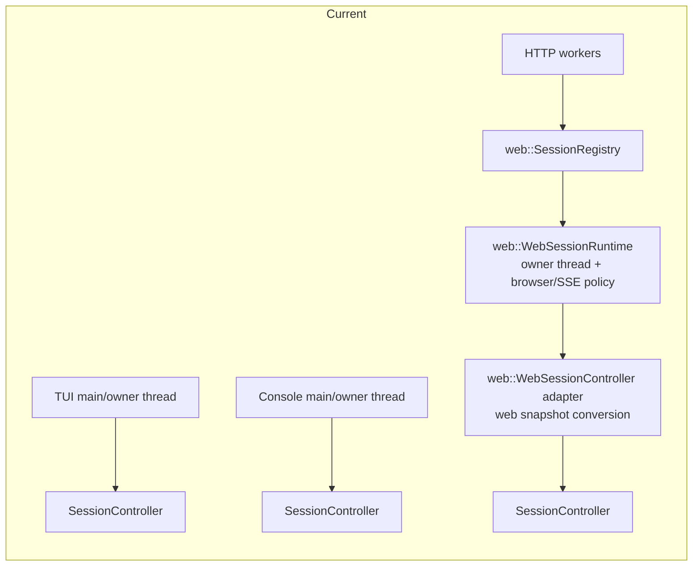
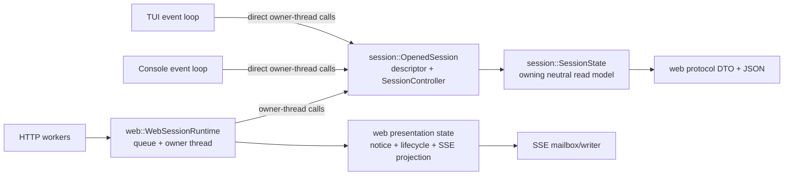

# Web/core boundary correction: design

Status: proposed design, 2026-08-03. Revised the same day after review; the
revisions are marked in Sections 4.2, 4.5, 6.3, 7.1, 7.2, 7.3, 8.1, 8.2, 11.1,
13, 14, 15.3, and 16.

This document records the architectural issues found after the first web
frontend implementation and defines how to correct them without forcing the
web server's threading and transport model onto the terminal frontends. It is a
design contract, not an implementation plan: the phases near the end describe
the required order and completion conditions, while exact commits may divide
the work further.

The central conclusion is deliberately narrower than "move the web runtime into
core":

> `SessionController` is already the common live-chat core. What is missing is a
> first-class live-session identity and a transport-neutral owning read model.
> The web owner thread is an adapter that serializes access from unrelated HTTP
> workers; it is not the definition of a session and must not become mandatory
> for the TUI or console.

## 1. Goals

The correction must:

1. Make the same core live-session abstraction visible to the TUI, console, and
   web frontend.
2. Make forum/session identity and display metadata part of the value returned
   when a session is opened, instead of reconstructing them in each frontend.
3. Provide one owning, presentation-neutral view of controller state for
   asynchronous consumers without duplicating transcript and generation domain
   types in `ui/web/`.
4. Keep the controller owner-thread-only. No change should make
   `SessionController` generally thread-safe.
5. Keep HTTP, JSON, SSE, browser connection, reconnect, and orphan-lifetime
   policy in the web frontend.
6. Make build targets enforce the documented source boundaries.
7. Preserve the efficient borrowed-view paths used by the TUI and console; they
   must not copy the entire transcript after every delta merely to conform to
   the web transport.
8. Keep behavior unchanged while the structure is migrated in small,
   independently testable phases.

## 2. Non-goals

This work does not:

- replace `SessionController` with a second session engine;
- make the TUI or console use a dedicated session thread;
- make every frontend use the web command queue or command deadlines;
- make the TUI or console use `SessionRegistry`;
- move JSON field names or HTTP error codes into core;
- turn the browser protocol into the internal domain model;
- add authentication, multiple simultaneous browser writers, or a new web API;
- change session persistence, transcript semantics, cancellation, multicast, or
  agent execution;
- remove the cross-process `SessionLease`, which is already correctly shared by
  all controller-opening paths.

## 3. Current architecture

The current implementation already has the most important reusable component.
[`SessionController`](../src/session/session_controller.h) owns one live chat:
the lease, transcript, journal, agents, default character, generation state,
and in-flight response batch. The TUI and console call it directly from the
thread that owns their event loop.

The web server has an additional concurrency problem. HTTP requests may run on
any request-pool thread, while a controller and its borrowed transcript state
must remain owned by one thread. The web implementation therefore adds:

- `WebSessionRuntime`, with a permanent owner loop and a bounded command queue;
- `SessionRegistry`, with one runtime and owner thread per live stored session;
- owning web protocol snapshots;
- an SSE mailbox and writer;
- single-browser-stream bookkeeping and disconnect-driven unloading.

That owner-thread design is sound for the server. The issue is that reusable
application concepts and web transport concepts were implemented together in
the same large classes.



## 4. Findings

### 4.1 Core stops short of a first-class opened session

`SessionController` represents the mutable live chat state but does not carry
the stable identity and display metadata of the session it controls.

The asymmetry is visible in [`workspace.h`](../src/session/workspace.h):

- `create_session()` returns `CreatedSession`, containing a controller and the
  generated session ID;
- `open_session()` returns only `std::unique_ptr<SessionController>`;
- neither result carries a complete forum/session descriptor.

The frontends compensate independently:

- the TUI keeps the selected forum and session values in its composition root;
- the console defines `ConsoleSelection` to retain the resolved session ID;
- the web layer defines `SessionKey` and `WebSessionMetadata`, loads forum and
  session metadata separately, and then opens the controller.

This is the strongest evidence that a core abstraction is missing. The fix is
not to move `WebSessionRuntime` into core; it is to make opening a session return
an owning live-session value whose identity is complete.

### 4.2 The web protocol duplicates core session state

[`ui/web/protocol.h`](../src/ui/web/protocol.h) defines web-specific versions of:

- transcript kind and status;
- transcript entry;
- generation phase and state;
- character summary;
- the controller portion of a session snapshot.

[`SessionControllerAdapter`](../src/ui/web/web_session_runtime.cpp) manually maps
every core enum and field into those values. It also contains knowledge of
transcript revisions, open entries, generation phases, reasoning continuity,
and which mutations can be represented as a text-only append.

Keeping a public web DTO is reasonable: API compatibility and JSON names should
not freeze internal classes. The problem is not that a DTO exists. The problem
is that the owning controller read model and the rules for observing changes
exist only inside the web adapter.

Consequences include:

- the tests for the owning read model live under `tests/ui/web/` even though the
  invariants belong to the live session;
- append continuity rules are expressed over web types, so they cannot be tested
  against the transcript invariants they actually depend on;
- any future asynchronous frontend would need to repeat the same snapshot and
  append reasoning.

Two further consequences are visible today but are deliberately *not* removed by
this correction: a new core transcript or generation field still requires a
second manual change in the web mapping, and omitting it there still compiles.
Section 7.2 keeps the web enums and structs separate on purpose, so the mapping
stays hand-written. What changes is the blast radius and the detection point. An
omission then affects only the web DTO instead of the application's sole owning
read model, and the dedicated mapping test required by Section 7.2 is what fails.
Nothing in this design makes field omission a compile error; do not claim it
does.

### 4.3 `WebSessionRuntime` combines two layers

The runtime contains a reusable idea: one owner repeatedly drains serialized
commands and agent events, applies controller results, and exposes only owning
data to other threads.

It also contains policy that is explicitly browser-specific:

- `SseConnectCommand` and exclusive stream acquisition;
- `BrowserConnectionState`;
- `idle_grace` and `orphan_limit` measured from browser disconnection;
- snapshot/append publication to an SSE sink;
- final SSE drain and close;
- browser-specific shutdown reasons and logging events.

These concerns should not be represented as one reusable core class. A terminal
frontend already has a valid owner thread and does not need an actor queue,
command timeout, owning snapshot on every structural change, or browser orphan
timer.

The general ownership rule is common:

> One thread owns a `SessionController`; other threads communicate with that
> owner instead of touching the controller.

The mechanism used to satisfy the rule is application-specific. The TUI and
console use their foreground event-loop thread. The web server uses a permanent
per-session thread and queue.

### 4.4 `SessionRegistry` is a web host registry, not a core session catalog

The registry's starting/running/stopping state machine and capacity accounting
could be useful to another long-running multi-session server. Its present API,
however, is coupled to the web frontend:

- `SessionKey` is declared in `ui/web/`;
- open results contain the HTTP path `/s/{forum}/{session}/`;
- errors are `web::ErrorCode` values;
- configuration is the mixed `WebSettings` structure;
- `owner_main()` constructs `SseMailbox` and `WebSessionRuntime` directly;
- shutdown reasons include browser disconnection and server stopping.

The TUI and console each open one controller and exit when that run ends. They
do not need a map of live sessions, a process capacity limit, reattachment, or
thread sweeping. Cross-process protection is already provided by
`SessionLease`.

Therefore the registry must not be moved wholesale into core or imposed on the
terminal frontends. It may be split into a generic hosting registry only after a
second non-web multi-session consumer exists. Until then, leaving the registry
under `ui/web/` is less harmful than generalizing its web contract prematurely.

### 4.5 The build target does not enforce the documented boundary

The static library named `cha_core` currently compiles:

- `src/util/`;
- `src/transcript/`;
- `src/agents/`;
- `src/session/`;
- shared text and render code;
- the complete concrete console frontend.

As a result, both `cha_web` and `cha_tui` link to a target that conceptually
contains another frontend. Static archive behavior may keep unused console
objects out of an executable, but it does not provide an architectural boundary
and it cannot detect an accidental console-to-core dependency.

The source documentation uses "core" to mean the reusable domain and session
layers, while CMake uses the name for almost everything except `main()` and
ncurses/web sources. The build graph must be corrected or the target must be
renamed. Because strict frontend separation is a project goal, splitting the
target is the preferred correction.

The violation is confined to the build graph. No file under `ui/tui/`,
`ui/console/`, or `ui/web/` includes another frontend's header today, and no file
under `session/`, `agents/`, `transcript/`, or `util/` includes `ui/`. Splitting
the target is therefore a CMake-only change that moves no source and alters no
behavior, which is why Phase 1 is both first and cheap: it installs the
enforcement mechanism before any abstraction can drift across it.

### 4.6 UI interaction policy leaks into the session layer

[`SessionUpdate`](../src/session/session_update.h) is documented as controller
effects for the frontend, but it includes:

- `render_needed`;
- `clear_input`;
- `end_session`;
- a presentation notice.

`clear_input` is editor policy. `/exit` is parsed by `ui/text/` and should remain
an interaction decision rather than a session-domain command. `render_needed`
really means that observable session state changed, not that every frontend
must render immediately.

This is the inverse of the original concern: instead of reusable code being
trapped in web, UI policy is present in core. Correcting only the web directory
would leave the overall boundary inconsistent.

### 4.7 Existing shared behavior is correctly placed

The following code should not be reimplemented during this correction:

- `Workspace` discovery, validation, creation, and opening;
- `SessionController` turn semantics and event application;
- `SessionLease` cross-process exclusion;
- persistence and restore;
- `ForumCharacters` and stable-ID target selection;
- the reusable textual grammar in `ui/text/`;
- transcript and generation domain values;
- the shared transcript writer in `ui/render/`.

The web implementation already caused several genuinely shared requirements to
be added in the correct place, including leasing, bounded event drains, and
concurrent-controller safety. The correction must preserve those improvements.

## 5. Target architecture

The target separates the domain live session from scheduling and presentation:



There is one core live-session abstraction and three scheduling strategies:

- TUI: direct access on its libuv/curses owner thread;
- console: direct access on its libuv owner thread;
- web: indirect access through a serialized owner-thread runtime.

## 6. Core session identity and open result

### 6.1 Stable identity

Add a small session-layer value that identifies one stored session without
exposing a filesystem path:

```cpp
struct SessionIdentity {
    std::string forum_id;
    std::string session_id;

    bool operator==(const SessionIdentity&) const = default;
    bool operator<(const SessionIdentity& other) const noexcept;
};
```

The value belongs in `session/`, not `ui/web/`, because it identifies the same
stored object for all applications. Validation continues to be performed by
`Workspace`/`SessionCatalog`; constructing a plain value does not authorize a
filesystem operation.

Replace `web::SessionKey` with this value. Web path parsing still validates the
components before invoking `Workspace` or the registry.

### 6.2 Display descriptor

Add an owning descriptor for information valid for the lifetime of an open
controller:

```cpp
struct SessionDescriptor {
    SessionIdentity identity;
    std::string forum_display_name;
    std::string session_label;

    bool operator==(const SessionDescriptor&) const = default;
};
```

Do not place `Forum::directory`, database paths, provider settings, prompts, or
credentials in this descriptor. It is safe for logs and presentation, subject
to the existing rule that labels are not logged unless explicitly intended.

### 6.3 Opened session

Represent the running object returned by `Workspace`:

```cpp
struct OpenedSession {
    SessionDescriptor descriptor;
    std::unique_ptr<SessionController> controller;
};
```

Both controller-creating paths return this type:

```cpp
OpenedSession Workspace::create_session(
    const std::string& forum_id,
    std::string label,
    WakeNotifier& notifier) const;

OpenedSession Workspace::open_session(
    const SessionIdentity& identity,
    WakeNotifier& notifier) const;
```

`create_stored_session()` remains create-only and continues to return a stored
session summary without a lease or controller.

The descriptor must be derived from the same validated `Forum` and stored
session metadata used during open. The web registry must no longer perform a
separate metadata-factory read followed by a controller-factory open.

This moves one metadata read rather than eliminating it. `open_session()` today
loads the `Forum`, so `forum_display_name` is already available, but it never
reads the session label; that value lives in the catalog. The label must be read
through the `SessionCatalog` instance `open_session()` already constructs for
`open_database_path()`, not by calling `session_summary()`, which builds a second
catalog for the same forum. The TUI and console consequently gain one metadata
read on the open path and the web registry loses a whole redundant factory pass.

### 6.4 Ownership

`OpenedSession` is owner-thread-only because its controller is owner-thread-only.
Moving it into the web owner thread is valid. Passing or sharing the descriptor
alone is valid because it is immutable and owning.

The wrapper does not need to forward every controller method. It expresses
lifetime and identity; `SessionController` remains the command/state engine.

## 7. Transport-neutral owning state

### 7.1 Core state shape

Add an owning read model under `session/`, tentatively named `SessionState`:

```cpp
struct SessionState {
    std::vector<CharacterInfo> characters;
    ParticipantId default_agent_id;
    std::vector<TranscriptEntry> transcript;
    // Continuity fields copied from TranscriptView. Section 7.3 proves a
    // text-only append against them, so a consumer holding one cached state can
    // decide without reaching back into the controller.
    std::size_t revision{};
    std::optional<EntryId> open_entry_id;
    std::size_t history_epoch{};
    GenerationStatus generation;

    bool operator==(const SessionState&) const = default;
};
```

The three continuity fields are load-bearing, not diagnostics. `TranscriptView`
carries `revision`, `open_entry_id`, and `history_epoch`; an owning state that
drops them cannot serve as the base for the Section 7.3 append proof, because the
asynchronous consumer caches the previous state and must compare against it on
the owner thread without a second controller read. `history_epoch` is what
distinguishes a cleared transcript from an unrelated structural change.

This value contains only controller state. It deliberately excludes:

- forum/session identity, which comes from `SessionDescriptor`;
- current UI notice, which the TUI, console, and web treat differently;
- browser/session-host lifecycle;
- web shutdown reasons;
- SSE sequence numbers and stream tokens.

`SessionController` should provide an owner-thread-only operation that constructs
this owning value. The existing borrowed accessors remain available:

- TUI rendering continues to use `TranscriptView` and may copy
  `GenerationStatus` only when needed;
- console append-only emission continues to use `TranscriptView` and its own
  watermark;
- web uses `SessionState` when an owning cross-thread value is required.

### 7.2 Web DTO mapping

The web protocol remains a separate API contract. Refactor it into a thin
mapping layer:

```text
SessionDescriptor + SessionState + WebPresentationState
    -> web::SessionSnapshot DTO
    -> JSON or SSE
```

Web-specific enum/string conversions may remain in `protocol.cpp`. The mapping
must be a pure operation with no controller access and no transcript borrowing.
Tests should separately verify:

- construction of `SessionState` from a real/fake controller in session tests;
- mapping of core values to the web DTO;
- JSON field names and omission rules in web protocol tests.

This keeps API evolution independent while preventing web code from becoming
the sole owner of the application's read model.

The added layer must not add a transcript copy. Today the adapter copies once,
straight from the borrowed `TranscriptView` into the web DTO. Naively inserting
`SessionState` between them would copy every entry's text twice on every
structural change, on the owner thread, in the hot generation path. The mapping
therefore consumes its input:

```cpp
[[nodiscard]] SessionSnapshot to_snapshot(
    const SessionDescriptor& descriptor,
    session::SessionState&& state,
    const WebPresentationState& presentation);
```

Entry text and reasoning text are moved out of the state value, not copied. The
runtime caches the resulting DTO as its append base, as it does now, so no second
owning copy of the transcript is retained. A benchmark is not required, but a
reviewer must be able to point at the move; if an implementation finds it needs
both the core state and the DTO alive afterwards, that is a design question to
raise rather than a copy to absorb silently.

### 7.3 Append optimization

The current adapter recognizes two high-frequency append-only cases:

- text appended to the one open transcript entry;
- reasoning text appended to the active request.

The underlying continuity rules are session/transcript invariants, while target
encoding and sequence assignment are web transport policy. Separate them:

```cpp
struct EntryTextTarget { EntryId entry_id; };
struct ReasoningTextTarget { RequestId request_id; };
using SessionTextTarget =
    std::variant<EntryTextTarget, ReasoningTextTarget>;

struct SessionTextAppend {
    SessionTextTarget target;
    std::string text;
};
```

The session layer may expose a cursor/projector that proves a text-only append
using transcript revision, open-entry identity, request identity, phase, and
metadata shape. It must not know about SSE sequence numbers, mailbox collapse,
or JSON target names.

The cursor holds only the scalar continuity fields listed in Section 7.1 plus the
text lengths it has already published. That is what lets Section 7.2 move
transcript strings into the DTO: an asynchronous consumer keeps a cheap cursor
next to its published snapshot, and never a second owning copy of the transcript
purely to compare against. A cursor whose revision does not match the controller
proves nothing and must fall back to a full state.

The web layer maps `SessionTextAppend` to `web::AppendEvent` and assigns sequence
numbers only when the mailbox stores an event.

If implementing a core append projector would make the first migration too
large, an acceptable intermediate state is to keep append detection in web but
rewrite it against `session::SessionState` and core enums. The duplicated web
transcript model must not remain the source of truth.

## 8. Session command results and shared text interaction

### 8.1 Separate state changes from widget actions

Replace the overloaded meaning of `SessionUpdate` with two levels. Names may
change during implementation, but the boundary must be preserved.

Session/controller result:

```cpp
struct SessionChange {
    bool state_changed{};
    // Whether the command accepted the submitted text. The controller reports
    // acceptance; what a widget does about it is the frontend's decision.
    bool input_consumed{};
    bool controller_ended{};
    std::optional<std::string> notice;
};
```

Shared text-interaction result:

```cpp
struct TextInputResult {
    SessionChange session;
    bool clear_input{};
    bool exit_requested{};
};
```

Both fields survive on purpose. `session.input_consumed` reports what the
controller did with the text; `clear_input` is `ui/text/`'s decision, which also
covers cases the controller never sees — an unknown slash command, a command
given a disallowed argument, and `/exit` itself all consume the line without a
controller call.

Rules:

- controller methods never decide whether an editor is cleared;
- `/exit` is interpreted by `ui/text/` and becomes `exit_requested`;
- controller shutdown or an unrecoverable controller-local terminal condition
  may become `controller_ended`;
- `state_changed` describes observable session state, not a mandatory repaint;
- `input_consumed` describes whether the submitted text was accepted, not what
  happens to a widget;
- notices remain presentation-safe command feedback, but frontends decide
  whether to retain, print, replace, or clear them.

#### 8.1.1 `state_changed` is a redefinition, not a rename

`render_needed` does not currently mean "observable session state changed", so
this is a behavior correction and must be planned as one.

`set_default_agent()` and `set_default_agent_by_id()` mutate `default_agent_id_`
and return `render_needed = false`. The browser observes the new default only
because `WebSessionRuntime` also publishes when a command produced a notice, and
both commands happen to produce one. That coupling is incidental: a future
mutation that changes state without a notice would silently fail to publish.

Under the new definition those commands set `state_changed = true`, and the web
publication condition becomes:

```text
publish when state_changed || presentation notice changed
```

where the notice term covers only the retained presentation notice, not
state discovery. Phase 5 therefore preserves *observable frontend output* — what
the TUI draws, what the console prints, what JSON the browser ends up with — and
not the exact set of publication triggers. The browser may receive a snapshot at
a point where it previously received one only as a side effect of a notice.

Tests that assert the old coupling are updated, and each such update records why
in its commit message. An implementation that keeps `state_changed` numerically
equal to today's `render_needed` has not done this work; it has renamed a field
and left the misnomer in place.

#### 8.1.2 `input_consumed` is not derivable from `state_changed`

`clear_input` is set in roughly ten controller paths and encodes "the draft was
consumed". It is independent of state change in both directions, so it needs its
own field rather than a rule inferred at the `ui/text/` boundary:

| Case | `state_changed` | `input_consumed` |
| --- | --- | --- |
| `submit_prompt` accepted | true | true |
| `submit_prompt` with an unknown author ID | false | false |
| batch staging fails before any transcript change | false | false |
| `/clear`, `/info`, `/agents`, off-record commands | varies | true |
| `set_default_agent()` with an empty or unresolved handle | false | true |
| `set_default_agent_by_id()` succeeding | true | false |

The last two rows are the ones that matter. A handle command reports a usage
error, changes nothing, and still consumes the line the persona typed. The typed
route changes the default agent while submitting no editor text at all, and its
existing comment already says so. Any attempt to reconstruct `input_consumed`
from `state_changed`, from the presence of a notice, or from command kind alone
gets at least one of these wrong.

Phase 5 must not be closed by having `ui/text/` set `clear_input` for every
recognized command. That satisfies the stated completion condition while
regressing the two deliberate retain-draft failures — an unknown author ID and an
undispatchable request both leave the persona's text in the editor today, and
must continue to.

### 8.2 Frontend behavior remains intentionally different

- TUI applies `TextInputResult::clear_input` to its editor, retains the latest
  notice, and requests a redraw for session changes or local editor changes.
- Console queues ordinary lines, prints non-empty notices, and ignores input
  consumption entirely because it has no retained editor.
- Web forwards `TextInputResult::clear_input` on its raw-input route and reports
  `input_consumed` directly on its typed routes, which bypass text parsing; it
  separately retains the current presentation notice for its snapshot stream.

The JSON field stays spelled `clear_input`: it is an existing browser API name,
and Section 15.1 keeps API spelling independent of internal naming. Only the
internal field is renamed.

Sharing the result types must not erase these differences.

### 8.3 Shared textual grammar remains outside core

Slash-command and `@mention` parsing belongs in `ui/text/`. Both terminal
frontends and the browser raw-input route already reuse it. Typed web endpoints
may continue to call stable-ID controller commands without passing through text
syntax.

If a future non-UI client needs the same grammar, rename the directory to an
application-level `interaction/text/`; do not move string parsing into
`SessionController` merely to call it core.

## 9. Web runtime after the correction

### 9.1 Responsibilities that stay in `ui/web/`

`WebSessionRuntime` continues to own:

- the bounded HTTP-to-owner command queue;
- command completion deadlines and unknown-outcome semantics;
- its condition-variable wake notifier;
- the permanent owner loop used by the server;
- browser stream acquisition and stale-close filtering;
- browser disconnect/orphan deadlines;
- current web presentation notice and lifecycle;
- snapshot/append publication to `WebSnapshotSink`;
- final SSE drain and browser/server-specific shutdown reasons;
- containment of a thrown controller failure to one live web session.

It owns an `OpenedSession`, not a `WebSessionController` that recreates the core
state model.

### 9.2 Remove or narrow `WebSessionController`

The current virtual interface exists mainly as a test seam. After
`SessionController` exposes the neutral owning state, choose one of these
approaches:

1. Prefer a small generic owner-thread session port in the session/application
   layer if the TUI, console, and web tests can all use it without introducing
   UI or transport types.
2. Otherwise keep a web-local fake seam, but limit it to invoking controller
   commands and returning core `SessionChange`/`SessionState` values. It must not
   define a second transcript/generation model.

Do not add a virtual interface merely to make every frontend look identical.
The value of the seam is independent tests and one state model, not polymorphism
by itself.

### 9.3 Optional generic serialized host

The queue, completion, and owner-loop machinery should be extracted to a
transport-neutral `SerializedSessionHost` only if another threaded consumer is
being implemented or immediately planned. The extracted host would:

- own one `OpenedSession`;
- serialize owning typed commands;
- drain controller events fairly;
- publish core state changes through a generic callback/sink;
- provide bounded shutdown hooks.

It would not know about browsers, SSE, HTTP paths, web error codes, reconnects,
or orphan timers. The web runtime would compose it with those policies.

TUI and console would still call the same opened session directly. "Reusable"
does not mean that every consumer must use every adapter.

## 10. Registry boundary

### 10.1 Immediate correction

Keep `SessionRegistry` in `cha::web` for the first correction, but reduce its
unnecessary coupling:

- key it by `session::SessionIdentity`;
- have its owner factory return `OpenedSession`;
- remove `RegistryMetadataFactory`;
- return a transport-neutral registry outcome such as ready/starting/stopping,
  not a URL;
- build `/s/{forum}/{session}/` in `LobbyRoutes`;
- map registry/open failures to `web::ErrorCode` in the route boundary;
- keep construction of `SseMailbox` and web runtime in a web runtime factory,
  not mixed with workspace metadata loading.

### 10.2 Later extraction criterion

Move the state machine into a generic hosting layer only when there is a second
consumer that needs all of the following:

- several live sessions in one process;
- open deduplication and reattachment;
- a process-wide live-session bound;
- independent owner threads;
- bounded process shutdown and thread reaping.

TUI and console are not such consumers. Without a second consumer, extraction
would mostly rename web policy and make future changes harder.

## 11. Build-target correction

### 11.1 Target graph

Split the current umbrella library into targets that correspond to source
boundaries:

| Target | Sources | Depends on |
| --- | --- | --- |
| `cha_core` | `util/`, `transcript/`, `agents/`, `session/` | external runtime/storage libraries |
| `cha_ui_text` | `ui/text/` | `cha_core` |
| `cha_ui_render` | `ui/render/` | `cha_core` |
| `cha_console` | `ui/console/` | `cha_core`, `cha_ui_text`, `cha_ui_render` |
| `cha_tui` | `ui/tui/` | `cha_core`, `cha_ui_text`, `cha_ui_render`, ncurses |
| `cha_web` | `ui/web/` | `cha_core`, `cha_ui_text`, cpp-httplib, JSON |

`uv_event_loop.*` may remain in a utility target used by core and frontends if
splitting `util/` further is not worthwhile. The important rule is that no
concrete frontend source is compiled into `cha_core`.

Executables link only their frontend target:

- `cha` -> `cha_tui`;
- `chacon` -> `cha_console`;
- `chaweb` -> `cha_web`.

Test binaries are a different case and the rule must not be stated as though it
already applies to them. `cha_tests` is a single executable whose sources span
`tests/session/`, `tests/ui/text/`, `tests/ui/render/`, `tests/ui/console/`, and
conditionally `tests/ui/tui/`, so it necessarily links every target those tests
cover. Linkage inside one binary cannot enforce a boundary.

Choose one and record it:

1. Split `cha_tests` along the same target boundaries, so each binary links only
   its layer. This extends enforcement to tests at the cost of more binaries and
   a slower link step.
2. Keep one general test binary and treat it as explicitly exempt, with the
   executables in this section carrying the whole enforcement burden.

Option 2 is sufficient for the goals in this document; the existing separate
`cha_web_tests`, `cha_web_stress_tests`, and `cha_web_process_tests` binaries
already keep the web boundary honest where it matters most. What is not
acceptable is claiming enforcement that a single mixed binary does not provide.

### 11.2 Dependency enforcement

The source rules become mechanically checkable:

- no file under `session/`, `agents/`, `transcript/`, or domain `util/` includes
  `ui/`;
- `ui/tui/`, `ui/console/`, and `ui/web/` never include each other;
- shared text/render targets contain no concrete terminal, HTTP, or browser
  dependency;
- web protocol types do not appear in a public header of `cha_core`.

All four rules hold in the source tree today (Section 4.5), so this is
regression prevention rather than remediation. That is precisely why it is worth
installing before the later phases start moving types between layers.

Add a lightweight include-boundary check to CI if CMake target separation alone
cannot catch textual violations.

## 12. Required file-level changes

The exact filenames may vary, but the completed change is expected to touch the
following areas.

| Area | Required work |
| --- | --- |
| `src/session/` | Add identity, descriptor, opened-session, and owning-state values; split controller result semantics. |
| `workspace.*` | Return the same `OpenedSession` shape from create-and-open and open-existing paths. |
| `session_controller.*` | Construct neutral owning state; report `state_changed`/`input_consumed` without editor policy, including the Section 8.1.1 default-agent correction. |
| `session_update.h` | Replace or split `SessionUpdate` as described in Section 8. |
| `ui/text/` | Translate `input_consumed` into `clear_input` and own the `/exit` interaction result. |
| `ui/tui/` | Consume `OpenedSession` and the split result without changing scheduling or rendering. |
| `ui/console/` | Consume `OpenedSession`; remove `ConsoleSelection` metadata duplication where possible. |
| `ui/web/protocol.*` | Narrow types to API DTOs and pure mapping/serialization. |
| `ui/web/web_session_runtime.*` | Own `OpenedSession`; remove core-model construction from the adapter. |
| `ui/web/session_registry.*` | Use core identity/open result and stop returning HTTP paths from the registry. |
| `ui/web/lobby_routes.*` | Build URLs and map errors at the HTTP boundary. |
| `CMakeLists.txt` | Introduce the frontend/shared targets from Section 11. |
| tests | Move core-state tests out of `tests/ui/web/`; preserve web concurrency and protocol tests. |
| architecture READMEs | Update layer map, runtime diagrams, target descriptions, and ownership rules. |

## 13. Migration sequence

### Phase 0: establish the baseline

Configure, build, and run the ordinary suite before structural changes. Record
pre-existing failures. Run web process/stress tests when later phases touch
threading, registry lifetime, or SSE behavior.

### Phase 1: split build targets

Change only CMake ownership and test linkage. Do not move source files or change
runtime behavior. Because the source-level boundaries already hold (Section 4.5),
no `#include` should need editing in this phase; if one does, that is an
undocumented dependency and should be reported before it is worked around. This
creates the enforcement mechanism before introducing new abstractions.

Completion condition: web and TUI no longer link a target containing console
implementation sources, the Section 11.1 decision about test binaries is recorded,
and all existing tests pass.

### Phase 2: introduce core session identity

Add `SessionIdentity`, `SessionDescriptor`, and `OpenedSession`. Make both
controller-creating `Workspace` operations return `OpenedSession`. Update TUI
and console first, then update web registry startup.

Completion condition: `WebSessionMetadata`, `RegistryMetadataFactory`,
`ConsoleSelection`, and other duplicate wrappers are removed or reduced to
frontend-only selection options.

### Phase 3: introduce the owning core read model

Add `SessionState`, construct it from `SessionController`, and test it in
`tests/session/`. Rewrite the web adapter and protocol mapping against the core
state. Keep SSE payloads and JSON unchanged.

Completion condition: `ui/web/` no longer owns the authoritative transcript and
generation state shapes, the browser sees byte-for-byte equivalent JSON for the
same state, and snapshot construction still copies transcript text once
(Section 7.2).

### Phase 4: separate append proof from SSE sequencing

Introduce or migrate toward the transport-neutral append candidate. Keep
mailbox sequencing, pending-payload collapse, and fallback snapshots in web.

Completion condition: continuity is proved from core state/revisions, while SSE
target encoding and sequence assignment remain web-only.

### Phase 5: split session and text-interaction results

Move editor clearing and exit requests into `ui/text/`. Update the three
frontends and all command/controller tests. Frontend output is unchanged; the web
publication trigger changes as described in Section 8.1.1, which is an intended
correction and not a behavior regression.

This is the phase most likely to be closed prematurely. Both parts of Section 8.1
must land together: renaming `render_needed` to `state_changed` without applying
the default-agent correction leaves a misnomer, and moving `clear_input` to
`ui/text/` without `input_consumed` silently regresses the retain-draft failures.

Completion conditions:

- `session/` contains no field whose meaning is "clear the input widget," and
  `/exit` remains frontend interaction policy;
- `state_changed` is true for every controller mutation that changes what a
  snapshot would contain, including the default-agent commands;
- the six rows of the Section 8.1.2 table each have a test, with the unknown
  author and undispatchable request cases asserting that the draft survives.

### Phase 6: narrow the registry/runtime boundary

Remove HTTP path creation and web error mapping from the registry. Simplify
runtime startup around `OpenedSession`. Decide whether a generic serialized host
has a real second consumer; otherwise keep the owner queue in web.

Completion condition: the registry's lifecycle state can be reasoned about
without HTTP response shapes, and web routes remain the transport boundary.

### Phase 7: documentation and stale-path sweep

Update all source-tree READMEs and diagrams. Search for removed type names,
stale claims about `cha_core`, duplicated session-key structures, and direct
web-domain conversion logic.

## 14. Testing requirements

### 14.1 Session-layer tests

Add tests proving that:

- create-and-open and open-existing return the same descriptor shape;
- descriptors contain validated stable IDs and display metadata but no paths;
- the descriptor and controller refer to the same stored session;
- an opened session holds its lease through controller shutdown;
- `SessionState` faithfully owns characters, default character, transcript,
  generation state, and the Section 7.1 continuity fields;
- the owning state remains valid after a later controller mutation;
- append candidates are emitted only for proven append-only transitions;
- a cursor whose revision no longer matches the controller refuses to prove an
  append;
- a cleared transcript is distinguished from an unrelated structural change by
  `history_epoch`;
- structural changes, phase changes, request changes, clears, and entry changes
  force a full state replacement;
- `state_changed` and `input_consumed` match the Section 8.1.2 table for every
  controller command.

### 14.2 Frontend tests

Preserve tests proving that:

- TUI remains direct and owner-thread-only, with no mandatory transcript copy;
- console FIFO/backpressure/EOF behavior is unchanged;
- text commands clear or retain input exactly as before, including the two
  retain-draft failures;
- `/exit`, stop, and typed default-agent behavior remain frontend-appropriate;
- the typed default-agent route still reports `clear_input` false in its JSON
  while the browser's next snapshot carries the new default;
- web commands execute only on the permanent owner thread;
- a timed-out web mutation retains unknown-outcome semantics;
- web continues draining model events while disconnected;
- one SSE stream, stale-close handling, orphan deadlines, and final drain are
  unchanged;
- registry open deduplication, capacity, reattachment, sweeping, and bounded
  shutdown are unchanged.

### 14.3 Protocol tests

Keep explicit tests for:

- every JSON field and enum spelling;
- omitted optional fields;
- initial snapshot and reconnect snapshot behavior;
- append target and sequence behavior;
- fallback from incompatible appends to snapshots;
- HTTP status and error-code mapping at route boundaries.

These tests validate the web contract, not the internal state model.

### 14.4 Build and dependency tests

- Build each executable from its narrow frontend target.
- Build with `CHA_BUILD_TUI=OFF` on every supported platform.
- Run the ordinary unit suite.
- Run web process and stress labels after runtime/registry changes.
- Run address/undefined and thread sanitizers where supported.
- Verify that `chaweb` does not gain an ncurses dependency and that `cha`/TUI
  does not gain cpp-httplib.

## 15. Risks and mitigations

### 15.1 Freezing the web API to internal types

Risk: serializing `SessionState` directly would make internal refactors into API
changes.

Mitigation: retain explicit web DTOs and a pure mapping layer. Share the state
semantics, not necessarily the exact public representation.

### 15.2 Making terminal rendering more expensive

Risk: a common owning snapshot could cause full transcript copies on every
streamed token.

Mitigation: retain borrowed controller views and frontend-specific rendering
watermarks. The owning state is an additional boundary for asynchronous
consumers, not the only read API.

### 15.3 Making web snapshots more expensive

Risk: this is the near-miss version of 15.2 and it applies to the frontend that
does use the owning state. Inserting `SessionState` between the controller and
the web DTO turns one transcript copy into two, on the owner thread, in the hot
path — the same regression 15.2 avoids for terminals, arriving through the
layering the design asks for.

Mitigation: the mapping consumes `SessionState&&` and moves entry text
(Section 7.2), and append continuity is carried by a scalar cursor rather than a
retained second state (Section 7.3). Phase 3's completion condition names this
explicitly so it is checked rather than assumed.

### 15.4 A lowest-common-denominator session interface

Risk: one large virtual interface could accumulate TUI editor actions, console
queue controls, HTTP timeouts, and SSE operations.

Mitigation: share identity, controller commands, session changes, and neutral
state. Keep scheduling and presentation in adapters. Introduce a generic host
only for a demonstrated second consumer.

### 15.5 Thread ownership regressions

Risk: moving values out of web could be misread as permission for HTTP workers
to read the controller directly.

Mitigation: document every snapshot/state operation as owner-thread-only and
keep all controller access inside the web owner loop. Only owning immutable
values cross to HTTP/SSE threads.

### 15.6 Large simultaneous refactor

Risk: changing build targets, open results, snapshots, command results, and the
registry at once would make failures hard to isolate.

Mitigation: follow the phases in Section 13 and preserve behavior/test coverage
at every boundary.

## 16. Completion criteria

The correction is complete only when all of the following are true:

1. TUI, console, and web obtain a live controller through the same
   `OpenedSession` result.
2. Forum/session identity is defined in `session/`; `ui/web/` does not define a
   competing key type.
3. An owning controller state model is defined and tested outside `ui/web/`.
4. The web protocol is a pure DTO/mapping/serialization boundary rather than the
   sole definition of owning session state.
5. Browser connection, SSE, HTTP, reconnect, orphan, and web shutdown policy
   remain under `ui/web/`.
6. TUI and console still call the controller directly on their owner thread and
   do not use the web runtime or registry.
7. `SessionUpdate` no longer places editor clearing or text-command exit policy
   in the session layer, and `input_consumed` carries draft acceptance without a
   frontend having to infer it.
8. `state_changed` is true for every mutation that changes snapshot content, and
   web publication no longer depends on a notice to discover a state change.
9. Web snapshot construction copies transcript text once.
10. `cha_core` compiles no concrete frontend source.
11. Each executable links only its own frontend plus shared/core targets, and the
    test-binary decision from Section 11.1 is recorded.
12. Existing behavior and web API payloads remain compatible unless a separate
    API change is explicitly designed. The Section 8.1.1 publication-trigger
    change is the one sanctioned exception; it alters when a payload is sent,
    never its contents.
13. Unit, integration, web process, stress, and applicable sanitizer suites pass.

## 17. Final boundary decision

The original concern is valid: meaningful application-level code was placed in
the web area, most notably complete session identity and the owning controller
read model. Those concepts should be promoted and reused.

The concern does not justify treating the whole web runtime as core. Its
dedicated thread, command deadlines, registry lifecycle, browser connection
state, SSE mailbox, and orphan policy solve problems created by an asynchronous
multi-session HTTP server. Terminal applications should share the same live
session while retaining their simpler direct-owner execution model.

The durable design is therefore:

> one core live session, several frontend schedulers, and transport-specific
> presentation adapters.
