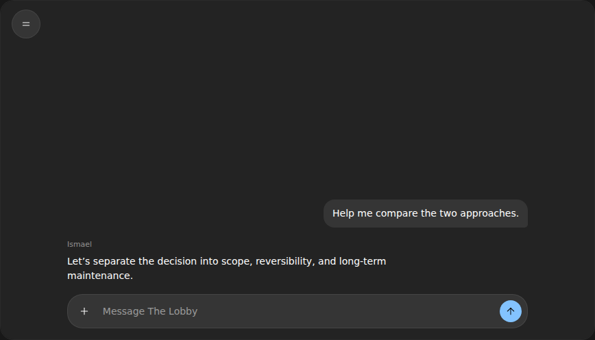
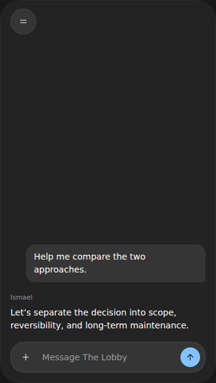
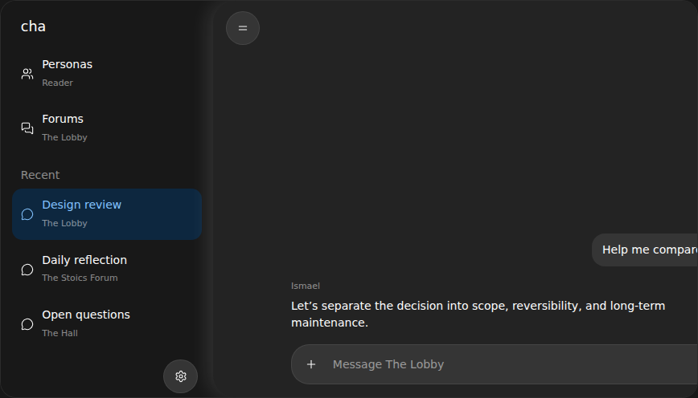
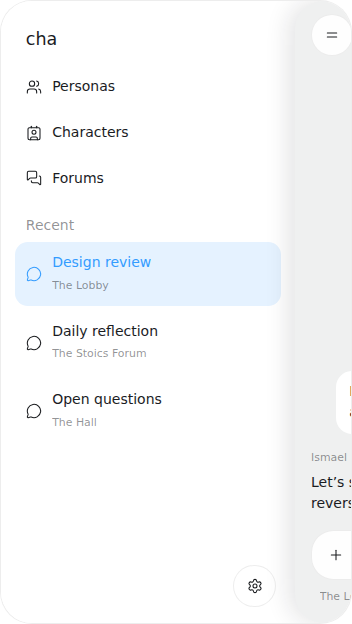
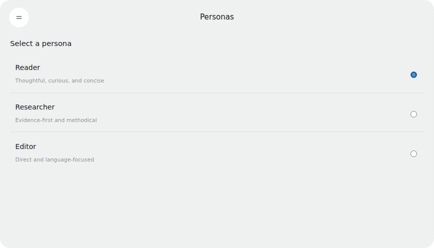
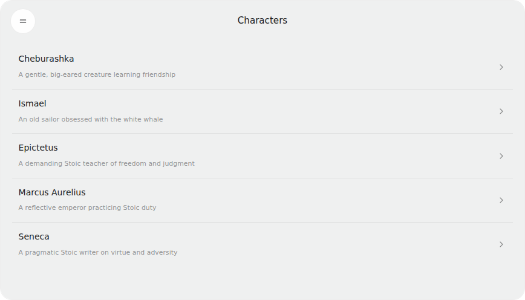
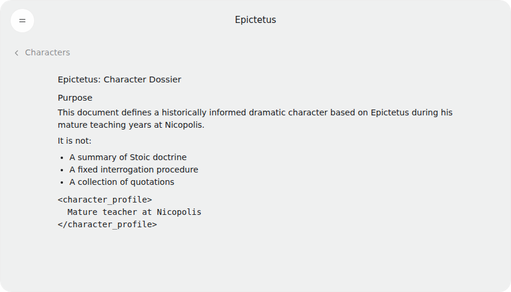
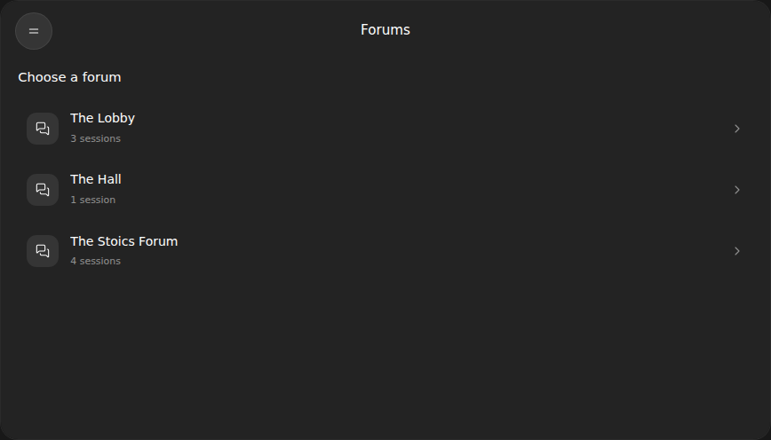
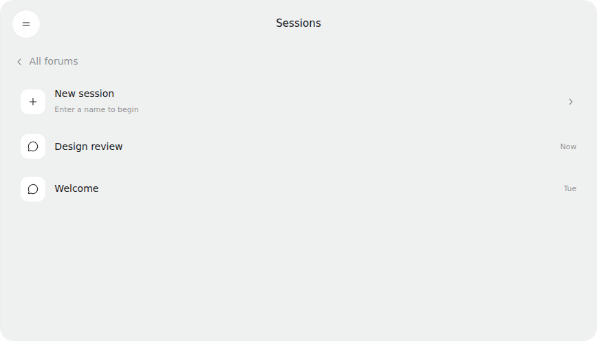
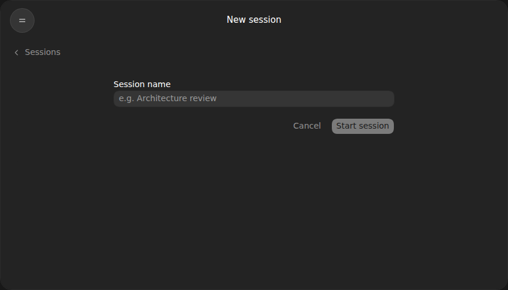

# cha web UI design

Status: working visual specification, agreed on 2026-08-02 and updated on 2026-08-03.

This directory is the design contract for the browser UI. It documents the visual hierarchy, navigation states, and expected behavior before implementation begins.

Open [mockup.html](mockup.html) in a browser to exercise the design. Its controls switch between desktop and iPhone widths, open or close the sidebar, and select each main-area state.

## Design principles

- Desktop and iPhone browsers use the same component hierarchy, interaction model, and visual language.
- Opening the sidebar pushes the main surface sideways; it does not overlay the main surface.
- The round two-line button is the only control that changes whether the sidebar is open.
- Sidebar references change the main-area state without closing or opening the sidebar.
- The main surface displays either Chat or one Navigation state, never both.
- The sidebar contains Personas, Characters, Forums, Recent session references, and the Settings gear. It does not show the current persona or forum.
- The browser starts in the shared Welcome session in Entrance, with Guest selected and Assistant as the current target.
- Personas are application-wide authors, never forum or session members. The server resolves the selected persona on each submission; switching personas never requires reopening a session.
- Chat has no title or context header. A compact line below the composer shows `<Forum>   From: <Persona>   To: <current default character>`.
- Characters is informational. It lists workspace characters and opens a read-only rendering of a character's `CHARACTER.md`.
- Forums list member character names beneath each forum title. Forum descriptions do not exist, and member names are not links.
- Sessions show names and compact time metadata, never descriptions.
- Recent contains cross-forum session references. The active session is highlighted.
- There is no Chat shortcut or global New session shortcut in the sidebar.
- Users cannot create forums, personas, or characters in this version.
- The round gear button at the bottom-right of the sidebar opens Settings.

## Screen catalogue

### Chat

| Desktop | iPhone |
| --- | --- |
|  |  |

### Sidebar

| Desktop | iPhone |
| --- | --- |
|  |  |

### Workspace navigation

| Personas | Characters |
| --- | --- |
|  |  |

| Character detail | Forums |
| --- | --- |
|  |  |

### Forum navigation

| Sessions | New session |
| --- | --- |
|  |  |

## Navigation titles

Chat has no title. Navigation screens use one centered title without a subtitle:

- Personas
- Characters
- The inspected character's display name on Character detail
- Forums
- Sessions
- New session
- Settings

The Sessions title does not repeat the selected forum. Session rows do not contain descriptive excerpts.

## Supporting specifications

- [Behavior and state rules](behavior.md)
- [Navigation flows](flows.md)
- [Web API implications](api-requirements.md)

## Out of scope

- Settings content beyond its entry point.
- Invalid application state has no separate browser presentation contract.
