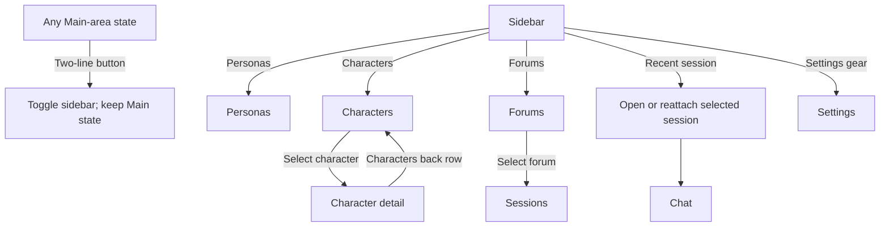
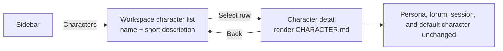
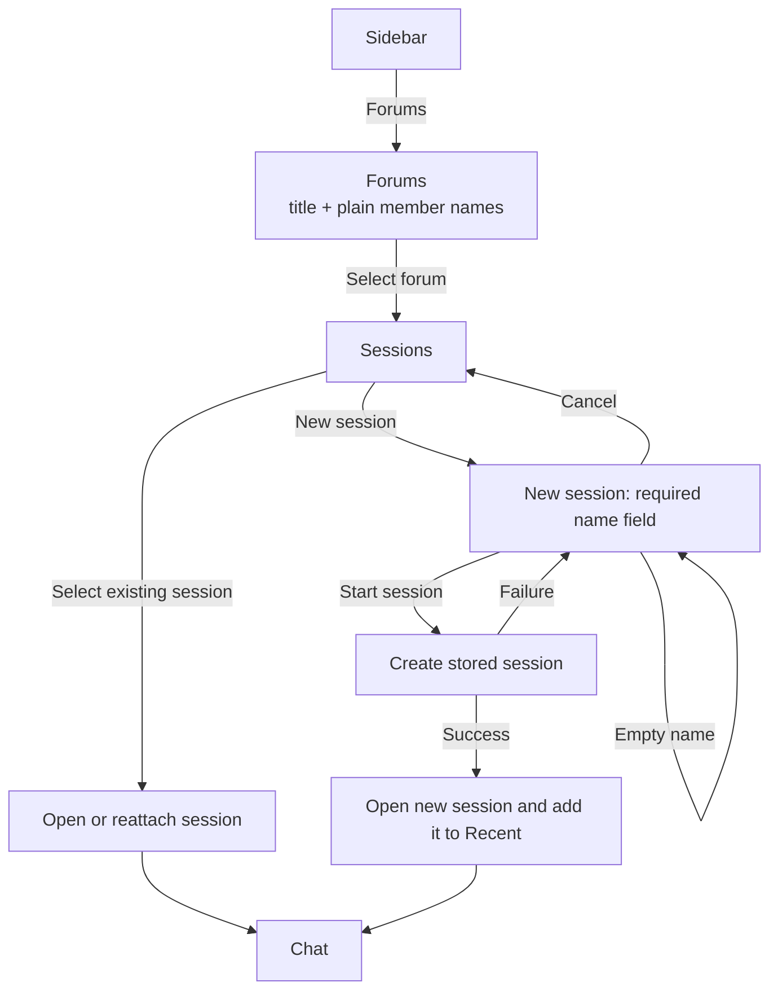
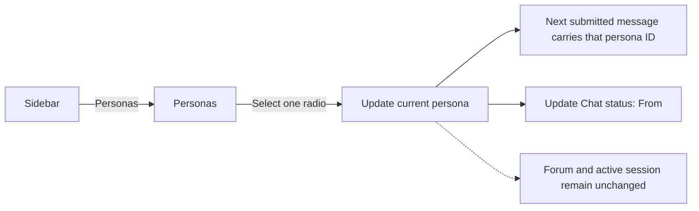
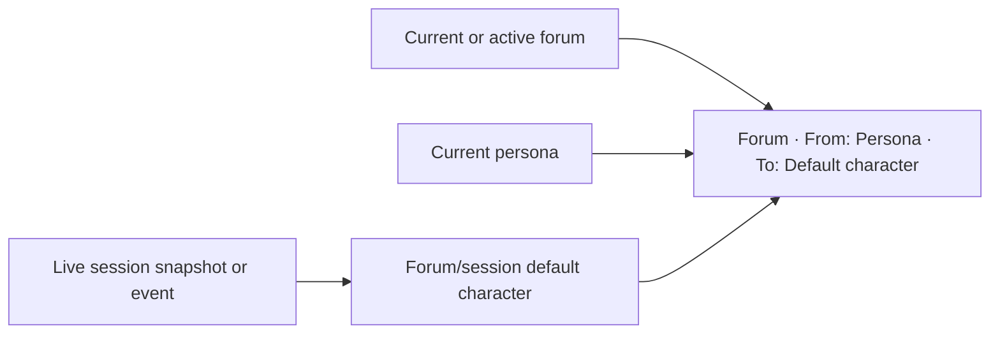

# Navigation flows

## Main navigation

Sidebar navigation changes the Main area but preserves the sidebar's current open/closed state. The two-line button is the only sidebar visibility control.

## Character browsing

Character detail is informational. It contains no forum list and does not change chat routing.

## Forum and session navigation

Stored-session rows contain a name and compact time metadata only. They do not contain descriptions.

## Persona selection

## Chat routing status

The status line is read-only and appears below the prompt composer. It is the only persistent display of the current persona, forum, and target character in Chat.

