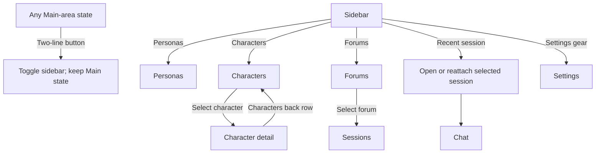
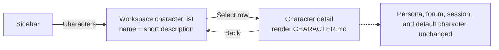
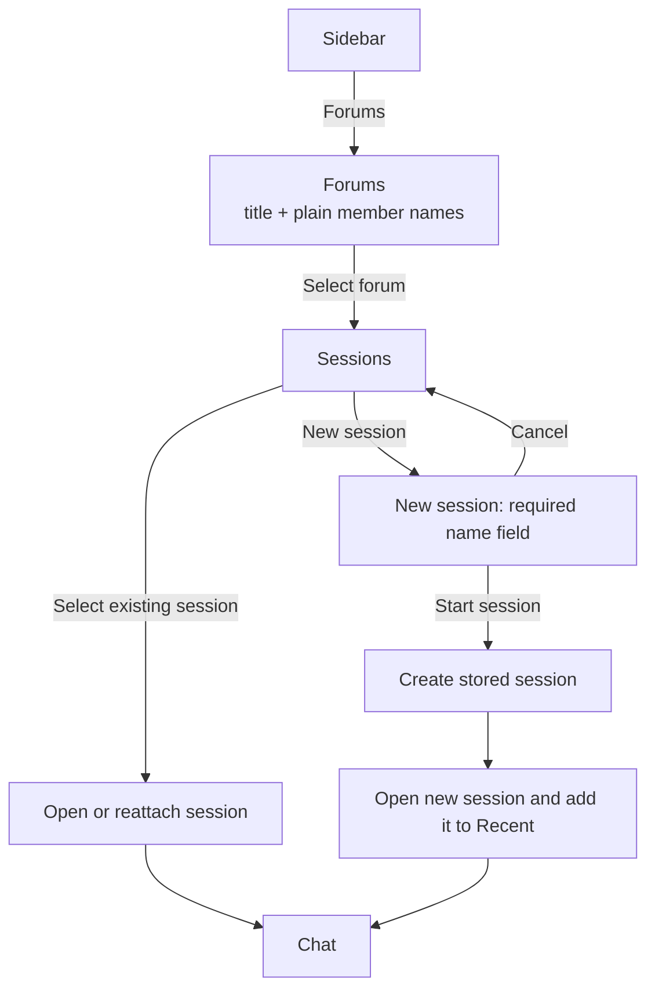
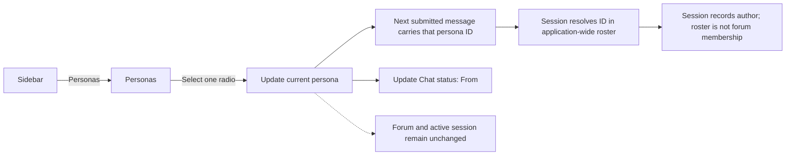
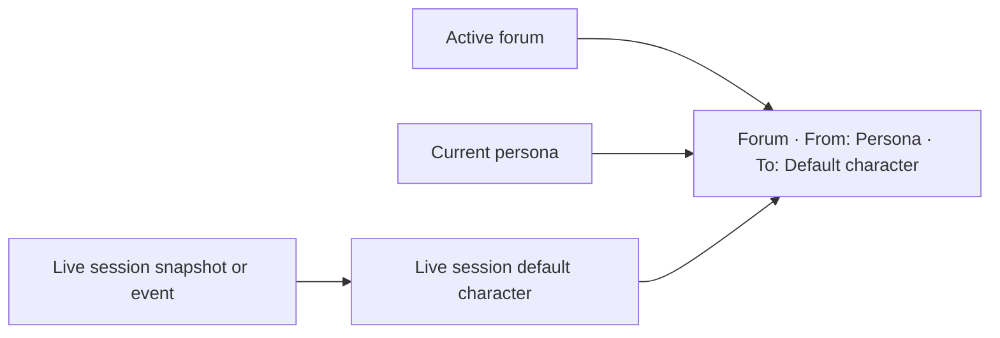
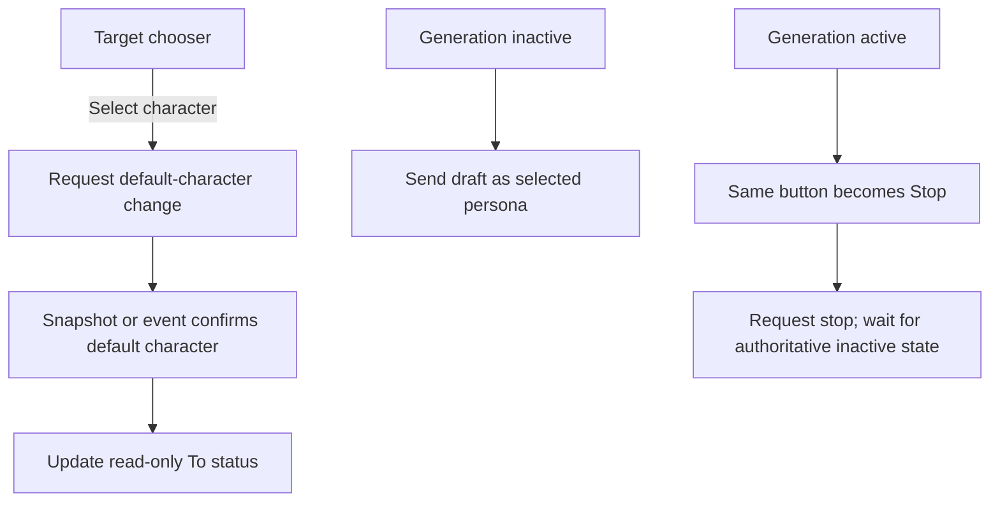

# Navigation flows

## Main navigation

Sidebar navigation changes the Main area but preserves the sidebar's current open/closed state. The two-line button is the only sidebar visibility control.

## Character browsing

Character detail is informational. It contains no forum list and does not change chat routing.

## Forum and session navigation

Stored-session rows contain a name and compact time metadata only. They do not contain descriptions.

## Persona selection

Resolution happens for every submission against the effective Guest-plus-
workspace roster captured when the session opened. Guest can write in an
ordinary workspace forum because that roster is application-wide, not forum
membership. The browser never supplies the display name that is persisted with
the message.

## Chat routing status

The status line is read-only and appears below the prompt composer. It is the only persistent display of the current persona, forum, and target character in Chat.

## Chat controls

The target chooser replaces the unsupported attachment action in the original
mockup. Send and Stop share one composer location; they are never shown at the
same time.
