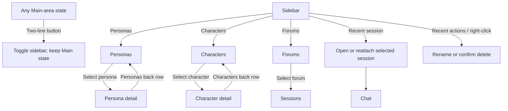
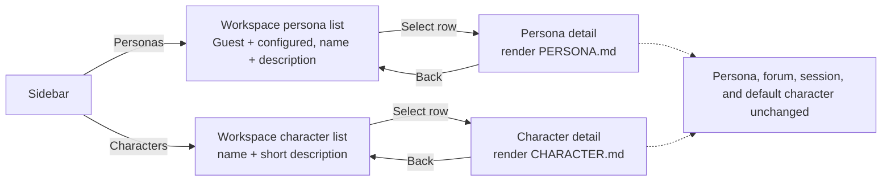
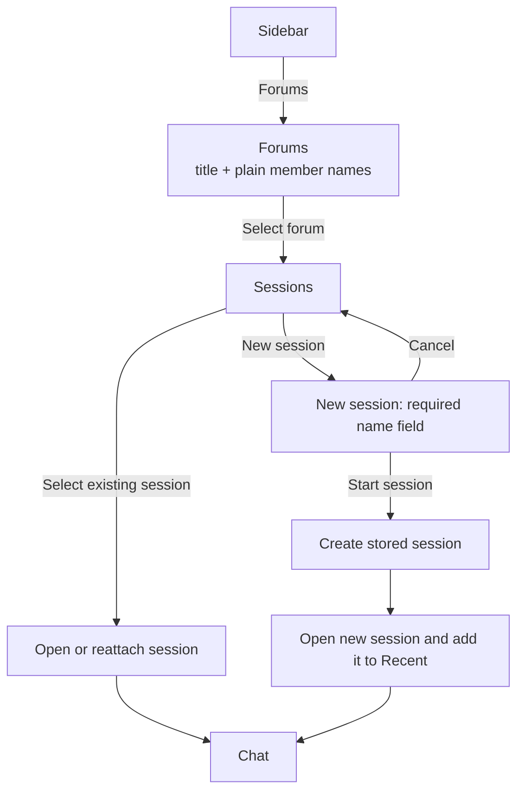
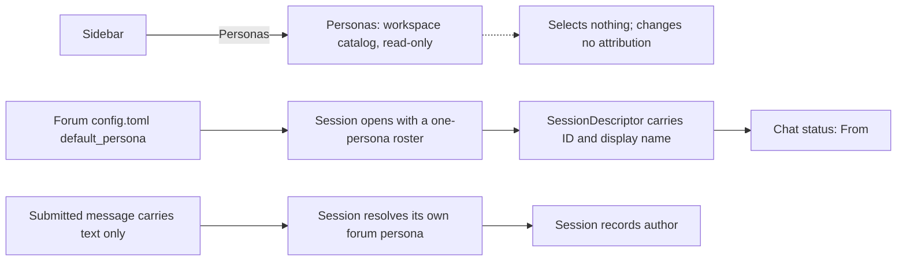
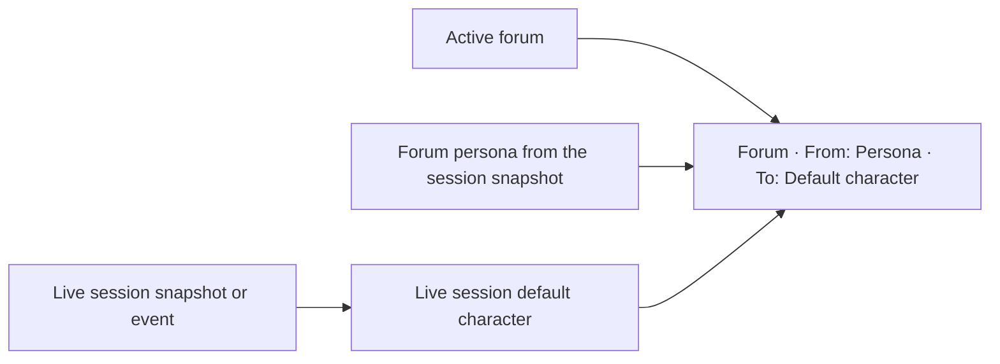
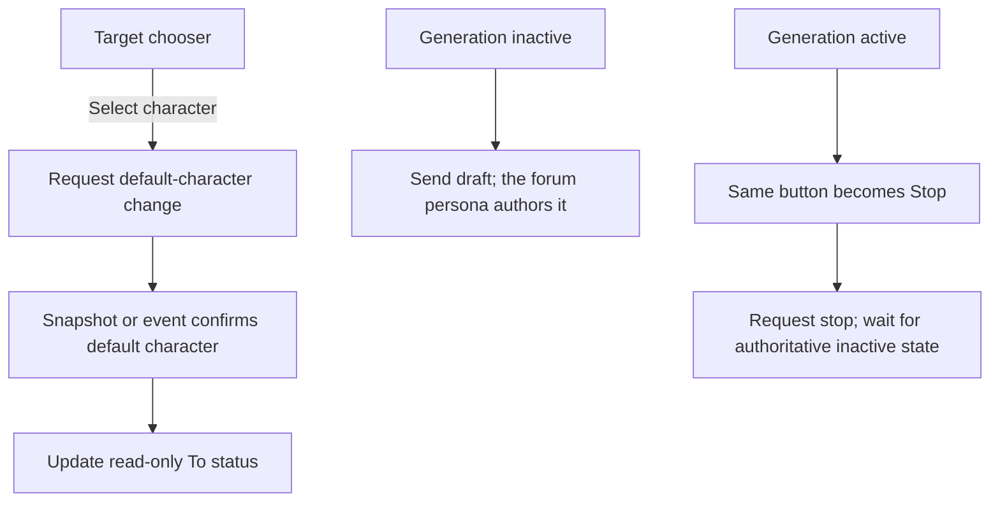

# Navigation flows

## Main navigation

Sidebar navigation changes the Main area but preserves the sidebar's current open/closed state. The two-line button is the only sidebar visibility control.

## Persona and character browsing

Both rosters browse the same way: a workspace-wide list whose rows open one
read-only Markdown description.

Both details are informational. Neither contains a forum list, and neither
changes chat routing or who a submission is attributed to.

## Forum and session navigation

Stored-session rows contain a name and compact time metadata only. They do not contain descriptions.
Recent rows additionally expose Rename and Delete. Delete returns an active
conversation to Welcome after its runtime has stopped. Copy is a Chat top-bar
icon action paired with the sidebar control and never calls the server.

## Persona attribution

Attribution is settled when the session opens, not per submission: the roster it
captured holds one persona, so every message in that session has the same
author. Moving to a forum with a different `default_persona` changes the author
by opening a session there. The browser supplies neither the ID nor the display
name that is persisted with the message, and browsing the persona catalog
changes nothing: the chat status line is the only place the browser reports who
the active conversation speaks as.

## Chat routing status

The status line is read-only and appears below the prompt composer. It is the only persistent display of the forum, its persona, and the target character in Chat.

## Chat controls

The target chooser replaces the unsupported attachment action in the original
mockup. Send and Stop share one composer location; they are never shown at the
same time.
