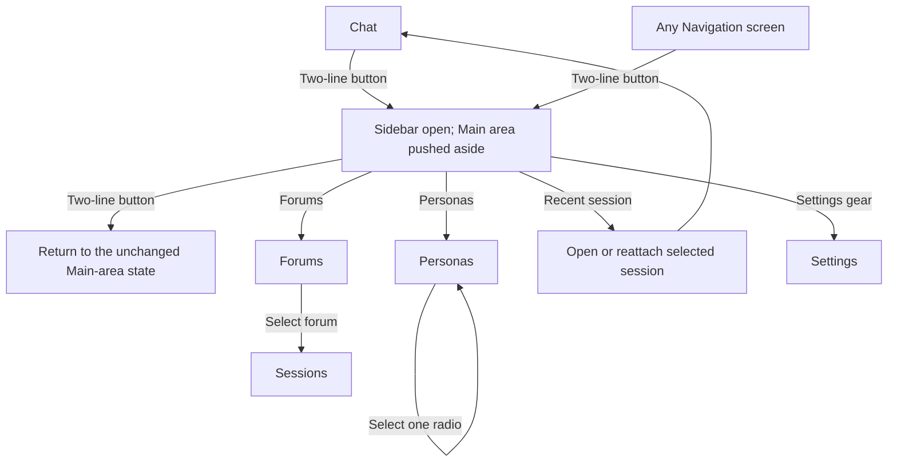
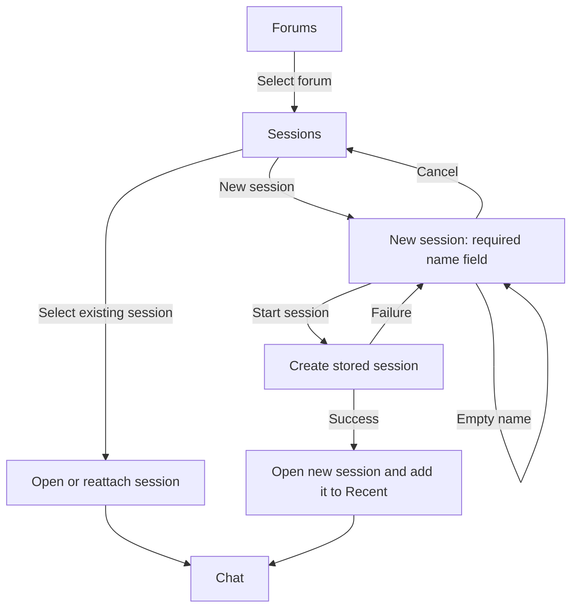
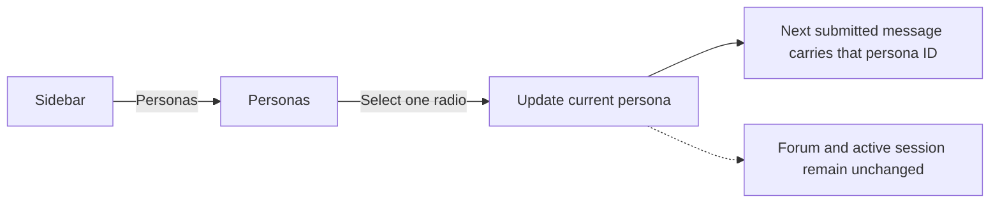

# Navigation flows

## Main navigation

```mermaid
flowchart TD
    Chat["Chat"] -->|"Two-line button"| Sidebar["Sidebar open; Main area pushed aside"]
    Navigation["Any Navigation screen"] -->|"Two-line button"| Sidebar
    Sidebar -->|"Two-line button"| Previous["Return to the unchanged Main-area state"]
    Sidebar -->|"Personas"| Personas["Personas"]
    Sidebar -->|"Forums"| Forums["Forums"]
    Sidebar -->|"Recent session"| Open["Open or reattach selected session"]
    Sidebar -->|"Settings gear"| Settings["Settings"]
    Open --> Chat
    Personas -->|"Select one radio"| Personas
    Forums -->|"Select forum"| Sessions["Sessions"]
```

## Session creation

```mermaid
flowchart TD
    Forums["Forums"] -->|"Select forum"| Sessions["Sessions"]
    Sessions -->|"Select existing session"| OpenExisting["Open or reattach session"]
    OpenExisting --> Chat["Chat"]
    Sessions -->|"New session"| Name["New session: required name field"]
    Name -->|"Cancel"| Sessions
    Name -->|"Empty name"| Name
    Name -->|"Start session"| Create["Create stored session"]
    Create -->|"Failure"| Name
    Create -->|"Success"| OpenNew["Open new session and add it to Recent"]
    OpenNew --> Chat
```

## Persona selection

```mermaid
flowchart LR
    Sidebar["Sidebar"] -->|"Personas"| Personas["Personas"]
    Personas -->|"Select one radio"| Current["Update current persona"]
    Current --> Next["Next submitted message carries that persona ID"]
    Current -.-> Unchanged["Forum and active session remain unchanged"]
```

