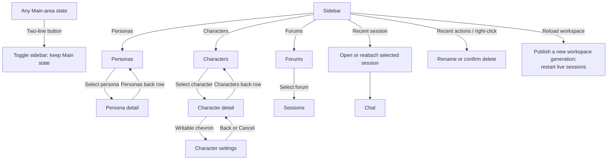
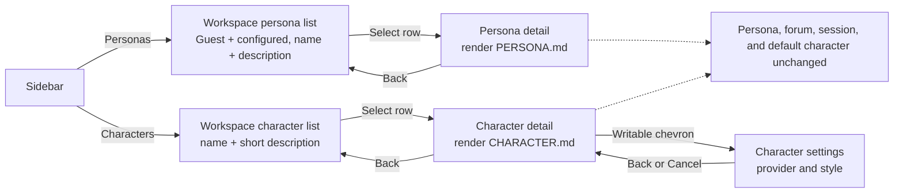
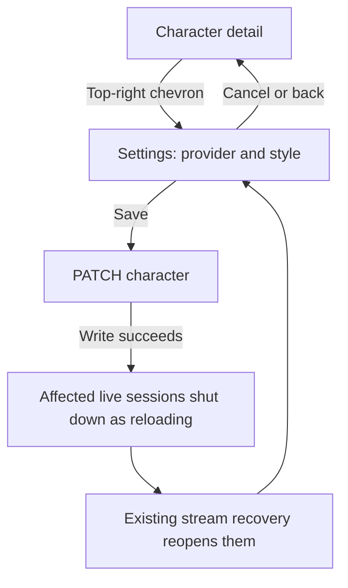
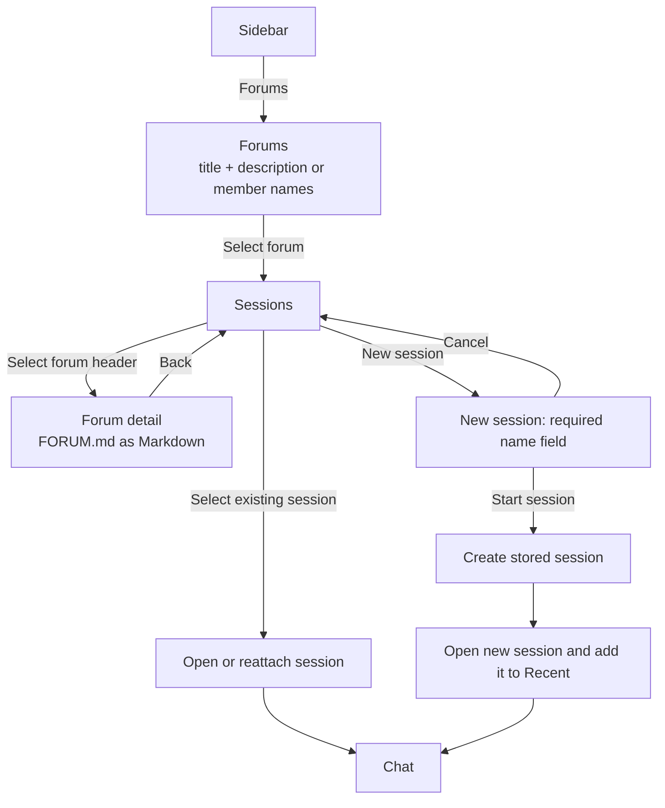
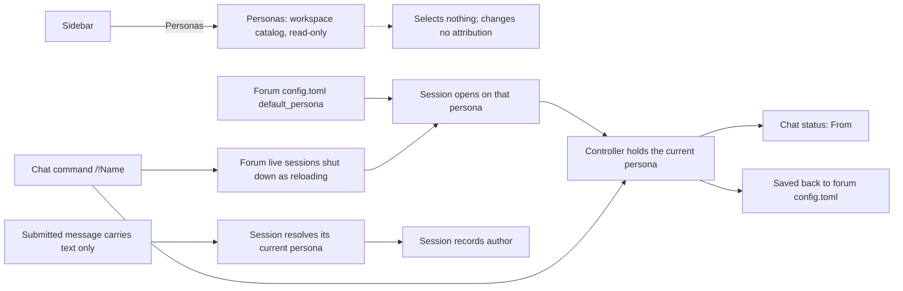
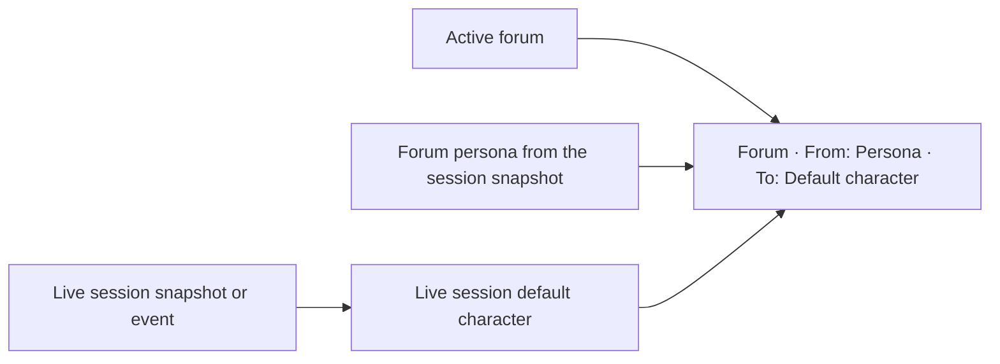

# Navigation flows

## Main navigation

Sidebar navigation changes the Main area but preserves the sidebar's current open/closed state. The two-line button is the only sidebar visibility control.

## Persona and character browsing

Both rosters browse the same way: a workspace-wide list whose rows open one
read-only Markdown description.

Persona detail is informational. Character detail is too, except for the
chevron into Settings. Neither contains a forum list, and neither changes chat
routing or who a submission is attributed to.

## Character settings

Save stays on Settings. Recovery reports `session-snapshot`, so it does not
force Chat. A provider-only save skips forums that override the provider.

## Forum and session navigation

Stored-session rows contain a name and compact time metadata only. They do not contain descriptions.
Recent rows additionally expose Rename and Delete. Delete returns an active
conversation to Welcome after its runtime has stopped. Copy is a Chat top-bar
icon action paired with the sidebar control and never calls the server.

## Persona attribution

Attribution is server-side, never per submission: a session opens on its forum's
`default_persona` and keeps that author until `/!Name` selects another, which
also saves the choice for the next session in that forum. The browser supplies
neither the ID nor the display name that is persisted with the message, and
browsing the persona catalog changes nothing: the chat status line is the only
place the browser reports who the active conversation speaks as.

## Chat routing status

The status line is read-only and appears below the prompt composer. It is the only persistent display of the forum, its persona, and the target character in Chat.

## Chat controls

The target chooser replaces the unsupported attachment action in the original
mockup. Send and Stop share one composer location; they are never shown at the
same time.
