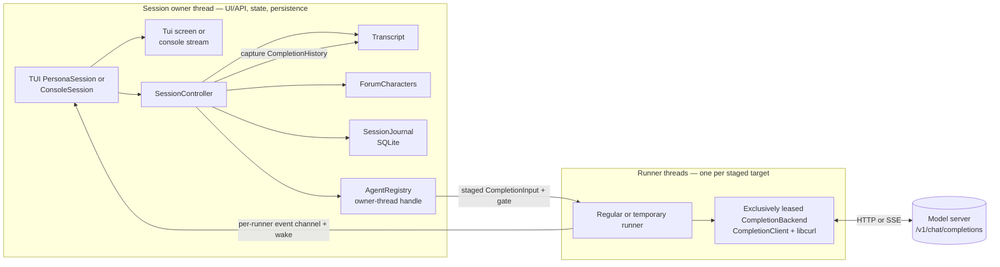
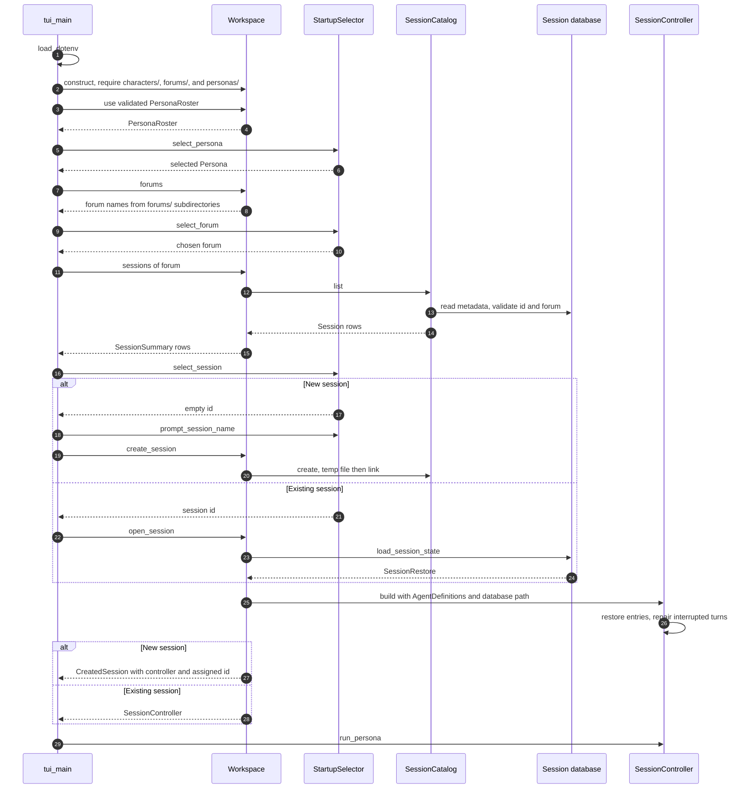
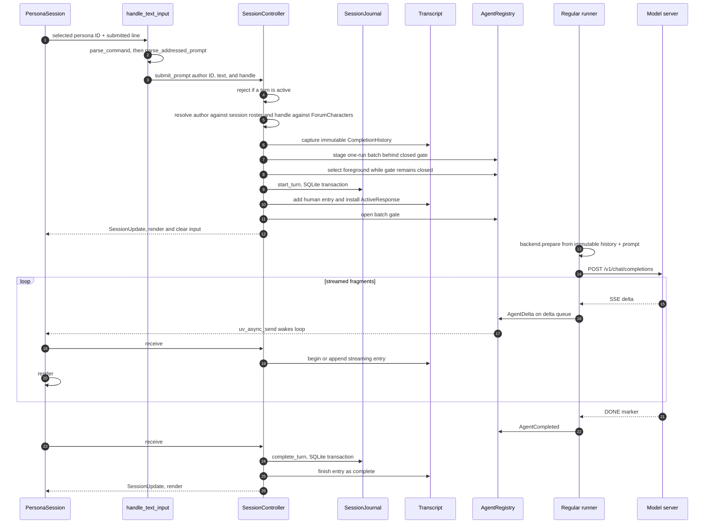
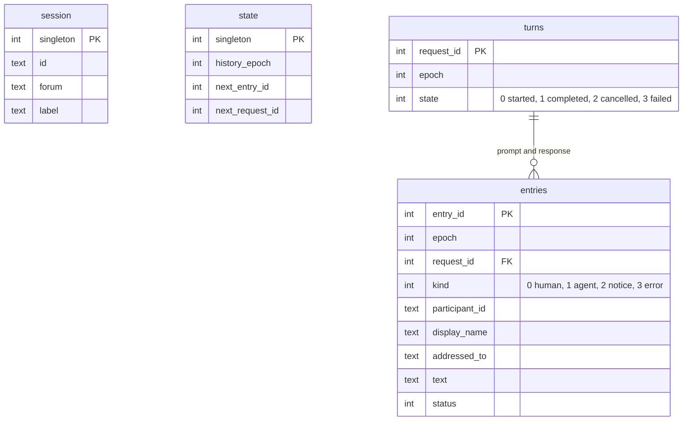

# Source tree — architecture

This document explains how `cha` is built: what the layers are, what each one
owns, how a message travels from a keystroke to a model and back, and which
rules must hold as the code grows. Read it before changing anything structural.

Per-directory `README.md` files are the detailed reference for each layer; the
persona-facing manual is the [top-level `README.md`](../README.md).

## System overview

`cha` is a terminal chat client for OpenAI-compatible chat-completion servers.
It runs inside a workspace containing `app.toml`, a persona roster, workspace-level
character definitions, and forums. Each definition lives at
`characters/<id>/` with `character.toml` and `CHARACTER.md`. A forum explicitly
selects its ordered roster through `forums/<forum>/members/<id>/`; its optional
`members/character_defaults.toml` and optional member `character.toml` overlay
the definition per key. A member `CHARACTER.md` replaces the definition prompt.
When loaded, the expanded character prompt is followed by expanded `FORUM.md`,
the complete static persona roster, and generated forum context. Includes from
a definition stay within workspace `characters/`; member and forum includes
stay within the forum.

During a run, the participating characters are represented as agents. Each agent
has its own identity, effective system prompt, and model connection, while all
agents use the session's shared chat transcript. A forum's optional validated
`default_agent` ID selects the default without changing the lexicographic agent
list; otherwise its first member ID is the default. A prompt beginning with
`@Name` is sent to another agent.
Each submitted prompt carries a validated roster persona as its author. That author
is stored on the human entry; projection prefixes ordinary human `persona` messages
with `from <Name>:` without changing stored or rendered text.

A session is a persistent chat within a forum, stored in a single SQLite
database. For each turn, `cha` records the persona's prompt before sending it to
the chosen agent on a worker thread. Model output is streamed into the chat
transcript, and the outcome of the turn—completion, cancellation, or failure—is
recorded in the database.

## Layer map

The tree is organized by responsibility. CMake gives the reusable domain and
each presentation layer its own static-library target: `cha_core` contains no
`ui/` sources; `cha_ui_text` and `cha_ui_render` are shared support libraries;
and `cha_console`, `cha_tui`, and `cha_web` are sibling concrete frontends.
Each entry point links only its frontend target.

| Directory | Owns | Must not know about |
| --- | --- | --- |
| `apps/` | Executable composition roots and process-level error handling. | Reusable policy — it only wires. |
| `ui/tui/` | Curses lifecycle, startup selection, input editing, layout, redraw planning, and its event loop. | Console code, workspace files, catalogs, backends. |
| `ui/console/` | CLI selection, line input, submission queue, signals, append-only emission, and stream sanitizing. | TUI code, workspace files, catalogs, backends. |
| `ui/web/` | HTTP/SSE transport, owning web protocol values, and session-runtime coordination. | Web types in `cha_core`, storage internals, and controller access from HTTP workers. |
| `ui/render/` | Shared transcript labels, attributes, and surface-writing operations. | Frontend layout, descriptors, curses. |
| `ui/text/` | The textual grammar: slash commands and `@mention` addressing. | Frontend widgets, storage, backends. |
| `session/` | Workspace and session operations, `ForumCharacters`, SQLite persistence, and live chat coordination. | Frontends, command syntax, transports. |
| `agents/` | Character config, agent runtime metadata, model-context projection, staged runners, and HTTP transport. | Workspace layout, sessions, frontends. |
| `transcript/` | The transcript model: entry types, validation, and the owner-thread-owned live `Transcript`. | Storage, providers, frontends. |
| `util/` | Leaf helpers: text and path rules, `.env`, a portable concurrent queue, and the libuv wake loop. | Anything above it. |

## Dependency direction

Dependencies run one way, from the top of this table to the bottom. A directory
may include headers only from those listed beside it.

| Directory | May include |
| --- | --- |
| `apps/` | `ui/tui/`, `ui/console/`, `ui/web/`, `ui/render/`, `session/`, `transcript/`, `util/` |
| `ui/tui/` | `ui/render/`, `ui/text/`, `session/`, `transcript/`, `util/` |
| `ui/console/` | `ui/render/`, `ui/text/`, `session/`, `transcript/`, `util/` |
| `ui/web/` | `ui/text/`, `session/`, `transcript/`, `util/`, and its HTTP transport dependency |
| `ui/render/` | `session/`, `transcript/` |
| `ui/text/` | `session/`, `util/` |
| `session/` | `agents/`, `transcript/`, `util/` |
| `agents/` | `transcript/`, `util/` |
| `transcript/` | Nothing in the project. |
| `util/` | Nothing in the project. |

Three rules keep this direction honest:

1. **`ui/` calls `SessionController` and `Workspace`, never storage or
   transport.** A front end may render `TranscriptEntry` values and call
   `SessionController`, but it must not open a session catalog, read
   workspace files, or call a completion backend. If a front end needs something
   new, add an operation to `session/`.
2. **`transcript/` depends on nothing.** It may not import SQLite, provider
   protocol, or terminal concepts. Everything else may depend on it.
3. **`agents/` owns character loading but not workspace discovery.** Once
   `session/` has resolved which directories a forum uses, `agents/` loads
   `Config` and `AgentDefinition` from them.
4. **Frontends are siblings.** `ui/tui/` and `ui/console/` may share
   `ui/render/` and `ui/text/`, but neither may include the other.

## Runtime structure

A process may host one or more session owner threads plus registry-owned worker
threads. Each session's owner thread exclusively owns its live transcript and
database mutation; `cha` and `chacon` use the process main thread as their one
session owner. The registry keeps one persistent regular runner and creates
one-shot runners only for the additional targets in a multicast batch. Abort
cleanup is driven by owner-thread polling; it creates no thread and never waits
for an unfinished worker.

Ownership is a strict tree, and destruction order matters:

- Each entry point owns a `Workspace` and selected `SessionController`. The TUI
  additionally owns its process-wide `Terminal`; the console owns a
  `SystemConsole` and `TranscriptEmitter`.
- `run_persona()` owns the TUI chat state. `ConsoleSession::run()` owns the
  console queue and EOF lifecycle.
- `SessionController` owns the cross-process `SessionLease`, `Transcript`,
  `ForumCharacters`, the `SessionJournal`, the `AgentRegistry`, the current
  default agent, and the state of the in-flight response batch. It captures
  immutable completion history before activating any run.
- `AgentRegistry` owns runtime information and a backend for each forum character,
  one reusable regular runner, temporary multicast runners, and one optional
  live batch whose fixed run slots follow input order. It also owns per-runner
  event channels and cancellation flags and backend leases. It has no
  reference to the live transcript.

### How runner threads communicate

Each staged execution owns a `ConcurrentQueue<AgentEvent>` (see
[`util/`](util/README.md)). A runner pushes deltas normally, then publishes its
exactly-one terminal event with the queue's allocation-free `close_with()`
operation. The injected `WakeNotifier` follows each successful publication.
Foreground reads drain queued deltas before consuming the reserved closing
event, preserving event order even if allocating more deque storage is no
longer possible.

The regular runner has one persistent worker waiting for staged executions.
Concurrent multicast adds one-shot temporary runners. All runners park behind
a shared start gate. The controller first selects child 0 as foreground while
the gate is still closed, then durably activates its turn; only after those
steps succeed does opening the gate admit every backend call. The registry
exposes only the selected foreground runner's event channel, so background
output remains buffered and cannot mutate the transcript.

This foreground boundary is also the deliberate durability boundary. Later
multicast children can run or finish before they have durable turn records, so
a process crash may lose their prompts and buffered answers. That behavior has
been reviewed and accepted: concurrent execution and ordered foreground commits
are retained, while batch manifests, background-result persistence, and their
recovery state machines are omitted. For in-flight multicast work, simpler
code and storage semantics take priority over additional crash durability.

The terminal frontends own a `UvEventLoop`. Agent threads wake it through
`uv_async_send()`; frontend-owned libuv input and signal handles share the same
loop. The frontend then drains the foreground channel. Wakeups from background
runners may coalesce or find no foreground event; foreground advance therefore
drains the newly selected channel immediately without waiting for another
wake.

## Lifecycle: startup

Character loading happens synchronously on the caller. During session
construction that caller is the session's owner thread (the process main thread
in `cha` and `chacon`); a forum check uses its composition or lobby thread. Each
`CompletionClient` is constructed — including optional `/v1/models` discovery
when `model` is unset — *before* completion runners start. After that point a
backend is touched only by the runner holding its exclusive lease, which is why
the clients need no internal locking.

## Lifecycle: one turn

This is the path every prompt takes.

Two ordering rules are load-bearing:

- **Select before durable activation.** A staged child becomes foreground while
  every runner is still gated. If selection fails, no journal turn, transcript
  prompt, or active response exists to abandon.
- **Durable before visible.** After foreground selection, the prompt is written
  to the journal before it is added to the in-memory transcript, and a response
  is committed before its entry is finalized. A crash can therefore lose a
  turn, but can never show one that was not recorded.
- **One owner.** Every live transcript read and mutation happens on the main
  thread. Agent runners receive only the immutable history captured before
  staging.

## Turn states

There are two kinds of state, with different purposes:

- The database records the durable state of a turn. A turn is first recorded as
  `started` and then receives exactly one final outcome: `completed`,
  `cancelled`, or `failed`.
- While a response is in progress, the application also tracks a live
  `ResponsePhase`: `waiting`, `reasoning`, `answering`, or the abort-cleanup
  overlay `stopping`. This phase drives `GenerationStatus` and the status-line
  text (`generating`, `reasoning`, `responding`, or `stopping`). It is not
  stored as part of the turn.

The response phase changes as output arrives. A new request begins in
`waiting`. The first reasoning fragment changes the phase to `reasoning`, but
reasoning is temporary UI state: it is not added to the chat transcript or
saved in the database. The first answer text changes the phase to `answering`
and opens a streaming answer entry in the transcript. Later reasoning does not
move the phase back from `answering`.

The final outcome is handled as follows:

| Event | Transcript result | Durable turn outcome |
| --- | --- | --- |
| The agent completes after producing answer text | The answer entry is finalized | `completed` |
| The agent reports completion without producing answer text | An error entry is added | `failed` |
| The persona cancels before answer text arrives | No response entry is added | `cancelled` |
| The persona cancels after some answer text arrives | The partial answer is retained and marked as cancelled | `cancelled` |
| The agent fails | Any partial answer is removed and an error entry is added | `failed` |
| The process stops before recording a final outcome | On the next open, an interruption error is added | Repaired from `started` to `failed` |

Error entries and cancelled partial answers remain visible, but are excluded
from the context sent to agents on later turns. The prompt from a failed turn
is also excluded; the prompt from a cancelled turn remains part of the chat
context.

## What the model sees

The transcript is not sent verbatim. `project_agent_context()` in `agents/`
rebuilds a per-agent view of it for each request:

- the agent's effective system prompt comes first; its generated forum-context
  section identifies the current agent and other current characters and explains
  the shared-history encoding;
- notices, errors, and any still-open streaming entry are dropped;
- entries inside a closed off-record span are dropped without a placeholder;
- human prompts belonging to a failed turn are dropped with it;
- only `complete` agent entries with non-empty text survive; cancelled and
  failed answers stay on screen but never become history;
- human prompts addressed to the requesting agent become ordinary `persona`
  messages prefixed `from <display name>:` on their own line, and that agent's
  own answers become `assistant` messages; the live `RunSpec` prompt appended
  after history uses the same prefix;
- contiguous entries involving another agent become a separate `persona` message
  headed `Shared chat history (JSONL):`; every following line is an escaped
  JSON object carrying `kind`, `speaker`, `text`, and, for human entries,
  `addressed_to`;
- a prompt addressed to the requesting agent is never merged into the preceding
  shared-history block.

Reasoning text is never projected and never stored. It exists only in the
active response while its turn is running and never enters the transcript.

## What is stored

One session is one self-contained SQLite file under
`forums/<forum>/sessions/<id>.sqlite3`, carrying its own identity so it can be
validated before use, and a `history_epoch` so `/clear` can start a fresh
visible history without deleting anything.

Schema `CHECK` constraints re-state the entry-model rules in SQL, a partial
unique index allows only one `started` turn at a time, and another allows only
one prompt per turn. Streaming entries are rejected by construction; reasoning
never enters a transcript entry. See [`session/README.md`](session/README.md) for the full
persistence contract.

## Invariants

These hold across the whole tree. Breaking one is a design change, not a bug fix.

| Invariant | Enforced by |
| --- | --- |
| `ForumCharacters` is non-empty, with unique IDs and unique case-folded names. | `ForumCharacters` constructor |
| At most one persona operation and one foreground turn are active, while one multicast may run distinct backends concurrently. | `SessionController::busy`, batch reservation, backend leases |
| Every launched run, including one cancelled at an unopened gate, yields exactly one terminal `AgentEvent` through its queue's reserved closing slot. | Per-runner execution and shutdown order |
| Only the session's owner thread accesses its live `Transcript` or mutates its journal. Presentation views are call-scoped; only completion histories own copied entries. | `SessionController`, `TranscriptView`, `CompletionHistory` |
| At most one streaming entry is open at a time. | `Transcript` |
| Entry and request IDs are positive and strictly increasing. | `Transcript::require_next_id`, `state` table |
| Durable writes precede visible ones. | `SessionController` |
| Reasoning exists only while a response is active; it never enters the transcript, persistence, or projection. | `ActiveResponse`, `GenerationStatus`, `TranscriptEntry` shape |
| A session's roster and system prompt are fixed when it opens; changes under `personas/` take effect on its next open. | `Workspace::load_personas`, `SessionController` |
| Every prompt author is resolved against that session's roster at one authorization point. | `SessionController::start_batch` |
| Front ends never open storage or call backends. | Include rules above |
| N controllers may run on N owner threads when no domain object is shared between them. `Workspace` is the deliberate exception: it is immutable, cache-free, and safe to share for concurrent `const` calls. | Session ownership, `Workspace` construction, session-local SQLite and completion clients |
| A web runtime has one permanent owner thread; HTTP threads exchange only owning commands and results with it. | `ui/web/WebSessionRuntime` |

The process-wide logger is the only intentionally shared domain-adjacent sink
and is thread-safe. Signal state belongs to composition roots, never to a
controller. libcurl initialization is one-time and thread-safe; each completion
client owns its own easy handle. SQLite connections and statements remain on
their session owner thread. Session timestamp generation serializes cha's calls
to `std::localtime` and copies the `std::tm` while holding that mutex; it cannot
serialize another library's concurrent `localtime` or `gmtime` call against the
shared C time buffer, so such a caller can still race with catalog conversion.
Session catalog creation publishes complete databases atomically and retries
collisions, so concurrent listing sees a complete database or no database,
never a partially written one.

## Failure policy

- **Persistence failures are fatal to the session.** A failed journal write is
  rethrown with context; the session ends rather than continuing with a
  transcript the database does not agree with.
- **Provider failures are ordinary events.** A transport or protocol error
  becomes `AgentFailed`, an error entry, and a notice; the session continues.
- **Startup failures abort.** A malformed workspace, forum, character, or session
  database throws before any chat UI is drawn.
- **Terminal restoration wins.** `run_persona()` restores the terminal before
  rethrowing, so a stack trace never lands on a screen still in curses mode.
- **Error messages never carry model output.** Streaming protocol errors report
  sanitized status, content type, and byte counts only.

## Extending the system

| Goal | Where the work goes |
| --- | --- |
| New provider or protocol | A new `CompletionBackend` in `agents/`; nothing above it changes. |
| New slash command | `ui/text/command.*` for the grammar, plus an operation on `SessionController` if it touches session state. |
| New front end, e.g. HTTP | A new `ui/http/` front end plus a new `apps/` entry point, reusing `Workspace` and `SessionController` unchanged. |
| New persisted field | `transcript/` entry model, its validators, the SQLite schema and its `CHECK` constraints, and the restore path — in that order. |
| Shared transcript labels or styling | `ui/render/transcript_writer.*`, testable through `TranscriptSurface`. |
| TUI layout or redraw behavior | `ui/tui/render_plan.*` or `ui/tui/screen_layout.*`. |
| Console stream behavior | `ui/console/`, preserving its append-only output contract. |

## Build and test map

| Target | Contents |
| --- | --- |
| `cha_core` | Static reusable domain and session code: `util/`, `transcript/`, `agents/`, and `session/`; no `ui/` sources. |
| `cha_ui_text` | Shared textual grammar support, linked to `cha_core`. |
| `cha_ui_render` | Shared transcript rendering support, linked to `cha_core`. |
| `cha_console` | Line-oriented frontend implementation, linked to `cha_core`, `cha_ui_text`, and `cha_ui_render`. |
| `cha_tui` | Static curses frontend library, linked to `cha_core`, the shared UI libraries, and ncurses; built only with `CHA_BUILD_TUI=ON`. |
| `cha_web` | HTTP/SSE frontend, linked to `cha_core`, `cha_ui_text`, cpp-httplib, and JSON. |
| `cha` | Full-screen application entry point linked to `cha_tui`. |
| `chacon` | Line-oriented application entry point linked to `cha_console`. |
| `chaweb` | Web application entry point linked to `cha_web`. |
| `cha_tests` | Mixed unit/component test binary. It deliberately links the production libraries covered by its sources and is exempt from production-boundary enforcement. Run with `make test`. |
| `console_tests` | Registered fork/exec tests for pipes, signals, output failures, and link dependencies. |
| `itest` | Live integration tests driving the real stack against the checked-in `workspace/`. Run with `make itest`; not part of `make test`. |

Third-party dependencies are libcurl, libuv, nlohmann/json, toml++, spdlog,
SQLite (amalgamation), and GoogleTest, plus wide ncurses when the TUI is enabled.
Dependencies are vendored through CMake `FetchContent` when not already
installed.

## Source conventions

- Project headers are included from the `src/` include root, for example
  `"session/session_controller.h"`.
- Headers include what their own declarations need; no reliance on transitive
  includes.
- Every class and struct carries a comment saying why it exists, what it does,
  and which project types it collaborates with.
- Public data types live with the behavior that owns their meaning: agent
  protocol and runtime types in `agents/`, forum-character and journal types in
  `session/`, transcript semantics in `transcript/`.
- Tests mirror this tree under `tests/`; cross-layer scenarios go in
  `tests/integration/`.

## Where to read next

| Layer | Document |
| --- | --- |
| Transcript model | [`transcript/README.md`](transcript/README.md) |
| Agent runtime and transport | [`agents/README.md`](agents/README.md) |
| Operations and persistence | [`session/README.md`](session/README.md) |
| UI contract | [`ui/README.md`](ui/README.md) |
| Command and mention grammar | [`ui/text/README.md`](ui/text/README.md) |
| Shared transcript rendering | [`ui/render/README.md`](ui/render/README.md) |
| TUI frontend | [`ui/tui/README.md`](ui/tui/README.md) |
| Console frontend | [`ui/console/README.md`](ui/console/README.md) |
| Entry points | [`apps/README.md`](apps/README.md) |
| Shared helpers | [`util/README.md`](util/README.md) |
