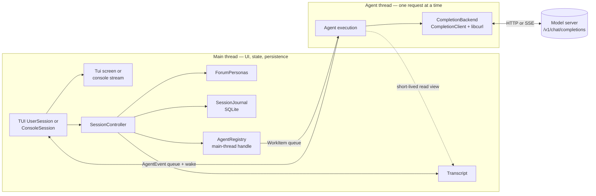
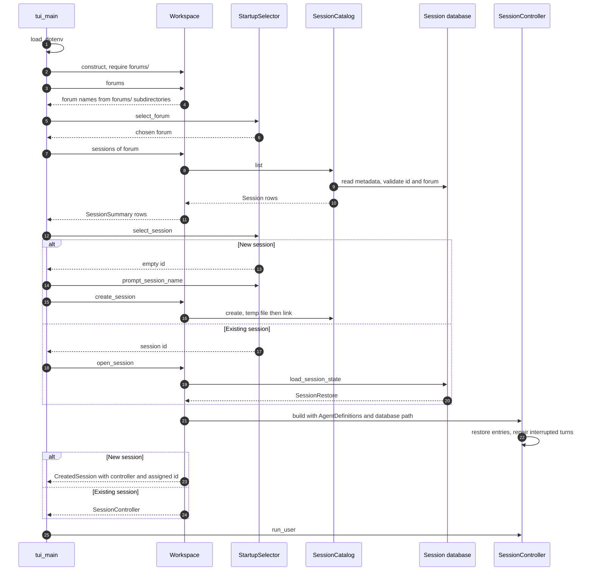
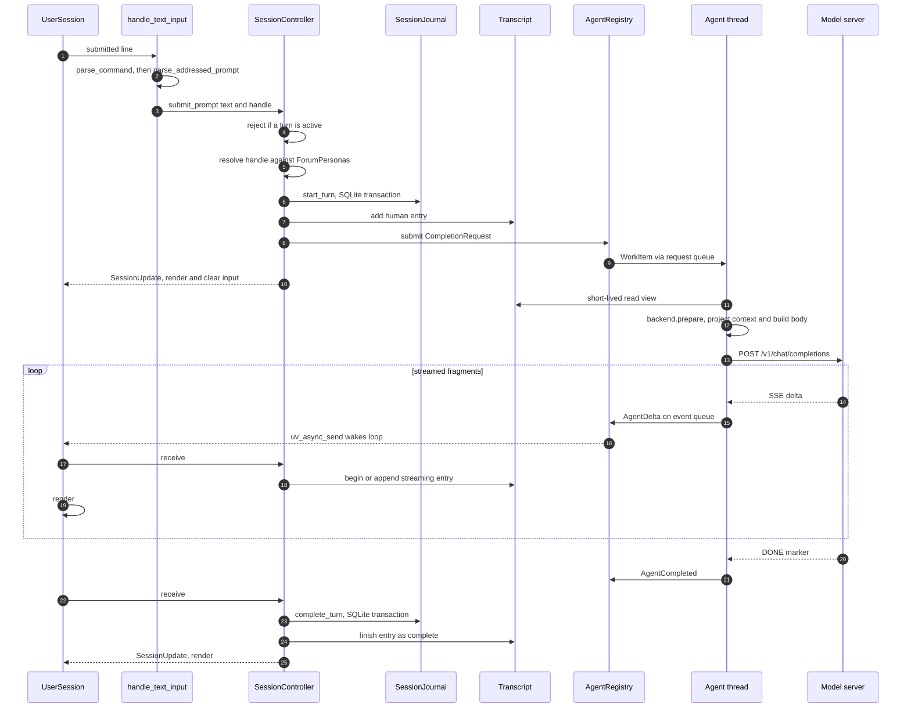
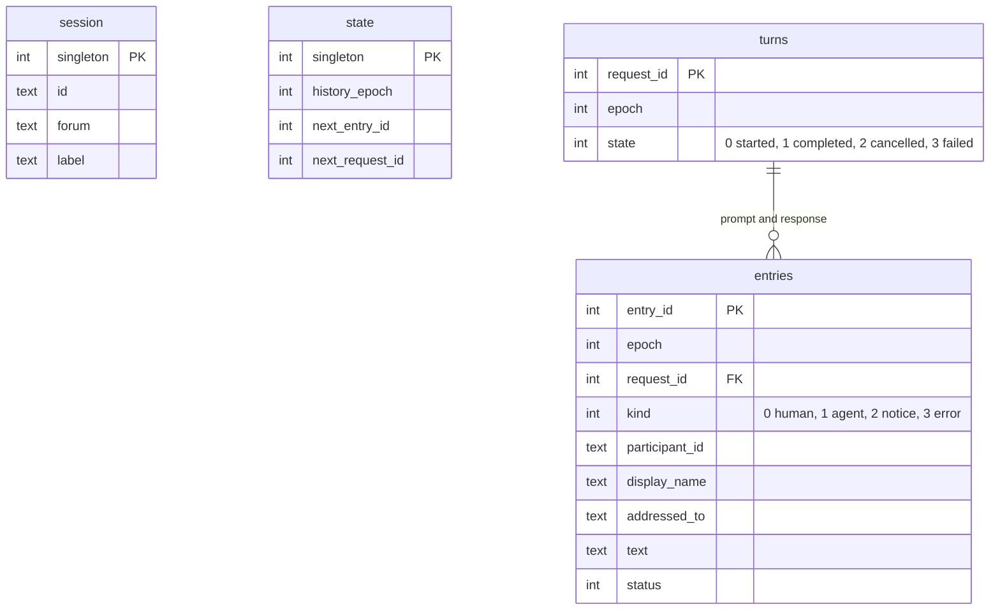

# Source tree — architecture

This document explains how `cha` is built: what the layers are, what each one
owns, how a message travels from a keystroke to a model and back, and which
rules must hold as the code grows. Read it before changing anything structural.

Per-directory `README.md` files describe each layer in detail; the exhaustive
rule-by-rule reference lives in [`docs/cha.md`](../docs/cha.md); the user-facing
manual is the [top-level `README.md`](../README.md).

## System overview

`cha` is a terminal chat client for OpenAI-compatible chat-completion servers.
It runs inside a workspace containing persona definitions and forums. A persona
definition contains an identity, effective model configuration, and base
system prompt. Its model configuration may inherit shared values from the
selected forum's optional `personas/base_config.toml`; persona-specific values
override them. A forum contains an ordered list of the personas participating in
chats in that forum, together with a forum-specific system-prompt extension.
When the forum is loaded, that extension is appended to each participating
persona's base system prompt, followed by generated forum context identifying
the current agent, the forum's other personas, and the shared-history encoding.

During a run, the participating personas are represented as agents. Each agent
has its own identity, effective system prompt, and model connection, while all
agents use the session's shared chat transcript. The first agent in the forum's
list is the default; a prompt beginning with `@Name` is sent to another agent.

A session is a persistent chat within a forum, stored in a single SQLite
database. For each turn, `cha` records the user's prompt before sending it to
the chosen agent on a worker thread. Model output is streamed into the chat
transcript, and the outcome of the turn—completion, cancellation, or failure—is
recorded in the database.

## Layer map

The tree is organized by responsibility. CMake keeps curses behind a real
library boundary: reusable and console code is in static `cha_core`, while the
ncurses frontend is in static `cha_tui`. Entry points link only the libraries
they need.

| Directory | Owns | Must not know about |
| --- | --- | --- |
| `apps/` | Executable composition roots and process-level error handling. | Reusable policy — it only wires. |
| `ui/tui/` | Curses lifecycle, startup selection, input editing, layout, redraw planning, and its event loop. | Console code, workspace files, catalogs, backends. |
| `ui/console/` | CLI selection, line input, submission queue, signals, append-only emission, and stream sanitizing. | TUI code, workspace files, catalogs, backends. |
| `ui/render/` | Shared transcript labels, attributes, and surface-writing operations. | Frontend layout, descriptors, curses. |
| `ui/text/` | The textual grammar: slash commands and `@mention` addressing. | Frontend widgets, storage, backends. |
| `session/` | Workspace and session operations, `ForumPersonas`, SQLite persistence, and live chat coordination. | Frontends, command syntax, transports. |
| `agents/` | Persona config, agent runtime metadata, model-context projection, the execution thread, and HTTP transport. | Workspace layout, sessions, frontends. |
| `transcript/` | The transcript model: entry types, validation, and the thread-safe live `Transcript`. | Storage, providers, frontends. |
| `util/` | Leaf helpers: text and path rules, `.env`, a portable concurrent queue, and the libuv wake loop. | Anything above it. |

## Dependency direction

Dependencies run one way, from the top of this table to the bottom. A directory
may include headers only from those listed beside it.

| Directory | May include |
| --- | --- |
| `apps/` | `ui/tui/`, `ui/console/`, `ui/render/`, `session/`, `transcript/`, `util/` |
| `ui/tui/` | `ui/render/`, `ui/text/`, `session/`, `transcript/`, `util/` |
| `ui/console/` | `ui/render/`, `ui/text/`, `session/`, `transcript/`, `util/` |
| `ui/render/` | `session/`, `transcript/` |
| `ui/text/` | `session/`, `util/` |
| `session/` | `agents/`, `transcript/`, `util/` |
| `agents/` | `transcript/`, `util/` |
| `transcript/` | Nothing in the project. |
| `util/` | Nothing in the project. |

Three rules keep this direction honest:

1. **`ui/` calls `SessionController` and `Workspace`, never storage or
   transport.** A front end may render `TranscriptEntry` values and call
   `SessionController`, but it must not open a session catalog, read
   workspace files, or call a completion backend. If a front end needs something
   new, add an operation to `session/`.
2. **`transcript/` depends on nothing.** It may not import SQLite, provider
   protocol, or terminal concepts. Everything else may depend on it.
3. **`agents/` owns persona loading but not workspace discovery.** Once
   `session/` has resolved which directories a forum uses, `agents/` loads
   `Config` and `AgentDefinition` from them.
4. **Frontends are siblings.** `ui/tui/` and `ui/console/` may share
   `ui/render/` and `ui/text/`, but neither may include the other.

## Runtime structure

One process, two long-lived threads. The main thread owns all transcript and
database mutation; the agent thread performs one blocking completion at a time
and reports back through a channel.

Ownership is a strict tree, and destruction order matters:

- Each entry point owns a `Workspace` and selected `SessionController`. The TUI
  additionally owns its process-wide `Terminal`; the console owns a
  `SystemConsole` and `TranscriptEmitter`.
- `run_user()` owns the TUI chat state. `ConsoleSession::run()` owns the
  console queue and EOF lifecycle.
- `SessionController` owns the `Transcript`, `ForumPersonas`, the
  `SessionJournal`, the `AgentRegistry`, the current default agent, and the
  state of the in-flight turn. The transcript is declared *before* the registry
  so it outlives the thread that reads it.
- `AgentRegistry` owns runtime information and a backend for each forum persona,
  the request queue, the event queue, the worker thread, and the
  cancellation and outstanding-request atomics.

### How the two threads talk

`ConcurrentQueue<T>` (see [`util/`](util/README.md)) carries traffic in both
directions:

- a private `ConcurrentQueue<WorkItem>` carries routed requests **to** the
  agent thread, which blocks directly in `get()`;
- a shared `ConcurrentQueue<AgentEvent>` carries events **back**. After each
  successful push, the registry calls an injected `WakeNotifier`.

The terminal frontends own a `UvEventLoop`. Agent threads wake it through
`uv_async_send()`; frontend-owned libuv input and signal handles share the same
loop. The frontend then drains the event queue. This keeps platform handle
details out of the agent and session layers.

Submission claims a single atomic gate, so at most one request is outstanding
across all agents; a second submission is refused even for a different agent.
The agent thread clears the gate immediately *before* publishing a
terminal event, so the main thread can start the next turn as soon as it sees
one. Cancellation is a shared atomic flag checked before `prepare()`, and by the
libcurl progress callback during transfer.

## Lifecycle: startup

Persona loading happens here, on the main thread: each `CompletionClient` is
constructed — including optional `/v1/models` discovery when `model` is unset —
*before* the agent thread starts. After that point only the agent thread touches
a backend, which is why the clients need no internal locking.

## Lifecycle: one turn

This is the path every prompt takes.

Two ordering rules are load-bearing:

- **Durable before visible.** The prompt is written to the journal before it is
  added to the in-memory transcript, and a response is committed before its
  entry is finalized. A crash can therefore lose a turn, but can never show one
  that was not recorded.
- **One writer.** Every mutation above happens on the main thread. The agent
  thread only reads the transcript, and only through a short-lived locked
  view taken before any network I/O.

## Turn states

There are two kinds of state, with different purposes:

- The database records the durable state of a turn. A turn is first recorded as
  `started` and then receives exactly one final outcome: `completed`,
  `cancelled`, or `failed`.
- While a response is in progress, the application also tracks a live
  `ResponsePhase`: `waiting`, `reasoning`, or `answering`. This phase drives
  `GenerationStatus` and the status-line text (`generating`, `reasoning`, or
  `responding`). It is not stored as part of the turn.

The response phase changes as output arrives. A new request begins in
`waiting`. The first reasoning fragment changes the phase to `reasoning`, but
reasoning is temporary UI state: it is not added to the chat transcript or
saved in the database. The first answer text changes the phase to `answering`
and opens a streaming answer entry in the transcript. Later reasoning does not
move the phase back from `answering`.

The final outcome is handled as follows:

| Event | Transcript result | Durable turn outcome |
| --- | --- | --- |
| The agent completes after producing answer text | The answer entry is finalized | `completed` |
| The agent reports completion without producing answer text | An error entry is added | `failed` |
| The user cancels before answer text arrives | No response entry is added | `cancelled` |
| The user cancels after some answer text arrives | The partial answer is retained and marked as cancelled | `cancelled` |
| The agent fails | Any partial answer is removed and an error entry is added | `failed` |
| The process stops before recording a final outcome | On the next open, an interruption error is added | Repaired from `started` to `failed` |

Error entries and cancelled partial answers remain visible, but are excluded
from the context sent to agents on later turns. The prompt from a failed turn
is also excluded; the prompt from a cancelled turn remains part of the chat
context.

## What the model sees

The transcript is not sent verbatim. `project_agent_context()` in `agents/`
rebuilds a per-agent view of it for each request:

- the agent's effective system prompt comes first; its generated forum-context
  section identifies the current agent and other current personas and explains
  the shared-history encoding;
- notices, errors, and any still-open streaming entry are dropped;
- human prompts belonging to a failed turn are dropped with it;
- only `complete` agent entries with non-empty text survive; cancelled and
  failed answers stay on screen but never become history;
- human prompts addressed to the requesting agent become ordinary `user`
  messages, and that agent's own answers become `assistant` messages;
- contiguous entries involving another agent become a separate `user` message
  headed `Shared chat history (JSONL):`; every following line is an escaped
  JSON object carrying `kind`, `speaker`, `text`, and, for human entries,
  `addressed_to`;
- a prompt addressed to the requesting agent is never merged into the preceding
  shared-history block.

Reasoning text is never projected and never stored. It exists only in the
active response while its turn is running and never enters the transcript.

## What is stored

One session is one self-contained SQLite file under
`forums/<forum>/sessions/<id>.sqlite3`, carrying its own identity so it can be
validated before use, and a `history_epoch` so `/clear` can start a fresh
visible history without deleting anything.

Schema `CHECK` constraints re-state the entry-model rules in SQL, a partial
unique index allows only one `started` turn at a time, and another allows only
one prompt per turn. Streaming entries are rejected by construction; reasoning
never enters a transcript entry. See [`session/README.md`](session/README.md) for the full
persistence contract.

## Invariants

These hold across the whole tree. Breaking one is a design change, not a bug fix.

| Invariant | Enforced by |
| --- | --- |
| `ForumPersonas` is non-empty, with unique IDs and unique case-folded names. | `ForumPersonas` constructor |
| At most one turn is in flight, process-wide. | `AgentRegistry` outstanding-request gate |
| Every accepted request yields exactly one terminal `AgentEvent`. | `AgentRegistry::dialog` and shutdown order |
| Only the main thread mutates `Transcript` or the journal. | `SessionController` |
| At most one streaming entry is open at a time. | `Transcript` |
| Entry and request IDs are positive and strictly increasing. | `Transcript::require_next_id`, `state` table |
| Durable writes precede visible ones. | `SessionController` |
| Reasoning exists only while a response is active; it never enters the transcript, persistence, or projection. | `ActiveResponse`, `GenerationStatus`, `TranscriptEntry` shape |
| Front ends never open storage or call backends. | Include rules above |

## Failure policy

- **Persistence failures are fatal to the session.** A failed journal write is
  rethrown with context; the session ends rather than continuing with a
  transcript the database does not agree with.
- **Provider failures are ordinary events.** A transport or protocol error
  becomes `AgentFailed`, an error entry, and a notice; the session continues.
- **Startup failures abort.** A malformed workspace, forum, persona, or session
  database throws before any chat UI is drawn.
- **Terminal restoration wins.** `run_user()` restores the terminal before
  rethrowing, so a stack trace never lands on a screen still in curses mode.
- **Error messages never carry model output.** Streaming protocol errors report
  sanitized status, content type, and byte counts only.

## Extending the system

| Goal | Where the work goes |
| --- | --- |
| New provider or protocol | A new `CompletionBackend` in `agents/`; nothing above it changes. |
| New slash command | `ui/text/command.*` for the grammar, plus an operation on `SessionController` if it touches session state. |
| New front end, e.g. HTTP | A new `ui/http/` front end plus a new `apps/` entry point, reusing `Workspace` and `SessionController` unchanged. |
| New persisted field | `transcript/` entry model, its validators, the SQLite schema and its `CHECK` constraints, and the restore path — in that order. |
| Shared transcript labels or styling | `ui/render/transcript_writer.*`, testable through `TranscriptSurface`. |
| TUI layout or redraw behavior | `ui/tui/render_plan.*` or `ui/tui/screen_layout.*`. |
| Console stream behavior | `ui/console/`, preserving its append-only output contract. |

## Build and test map

| Target | Contents |
| --- | --- |
| `cha_core` | Static reusable core, shared rendering, and console implementation; no curses dependency. |
| `cha_tui` | Static curses frontend library, built only with `CHA_BUILD_TUI=ON`. |
| `cha` | Full-screen application: `cha_core`, `cha_tui`, and `apps/tui_main.cpp`. |
| `chacon` | Line-oriented application: `cha_core` and `apps/console_main.cpp`. |
| `cha_tests` | Unit and component tests under `tests/`, mirroring this tree. Run with `make test`. |
| `console_tests` | Registered fork/exec tests for pipes, signals, output failures, and link dependencies. |
| `itest` | Live integration tests driving the real stack against the checked-in `workspace/`. Run with `make itest`; not part of `make test`. |

Third-party dependencies are libcurl, libuv, nlohmann/json, toml++, SQLite
(amalgamation), and GoogleTest, plus wide ncurses when the TUI is enabled.
Dependencies are vendored through CMake `FetchContent` when not already
installed.

## Source conventions

- Project headers are included from the `src/` include root, for example
  `"session/session_controller.h"`.
- Headers include what their own declarations need; no reliance on transitive
  includes.
- Every class and struct carries a comment saying why it exists, what it does,
  and which project types it collaborates with.
- Public data types live with the behavior that owns their meaning: agent
  protocol and runtime types in `agents/`, forum-persona and journal types in
  `session/`, transcript semantics in `transcript/`.
- Tests mirror this tree under `tests/`; cross-layer scenarios go in
  `tests/integration/`.

## Where to read next

| Layer | Document |
| --- | --- |
| Transcript model | [`transcript/README.md`](transcript/README.md) |
| Agent runtime and transport | [`agents/README.md`](agents/README.md) |
| Operations and persistence | [`session/README.md`](session/README.md) |
| UI contract | [`ui/README.md`](ui/README.md) |
| Command and mention grammar | [`ui/text/README.md`](ui/text/README.md) |
| Shared transcript rendering | [`ui/render/README.md`](ui/render/README.md) |
| TUI frontend | [`ui/tui/README.md`](ui/tui/README.md) |
| Console frontend | [`ui/console/README.md`](ui/console/README.md) |
| Entry points | [`apps/README.md`](apps/README.md) |
| Shared helpers | [`util/README.md`](util/README.md) |
| Exhaustive design rules | [`../docs/cha.md`](../docs/cha.md) |
