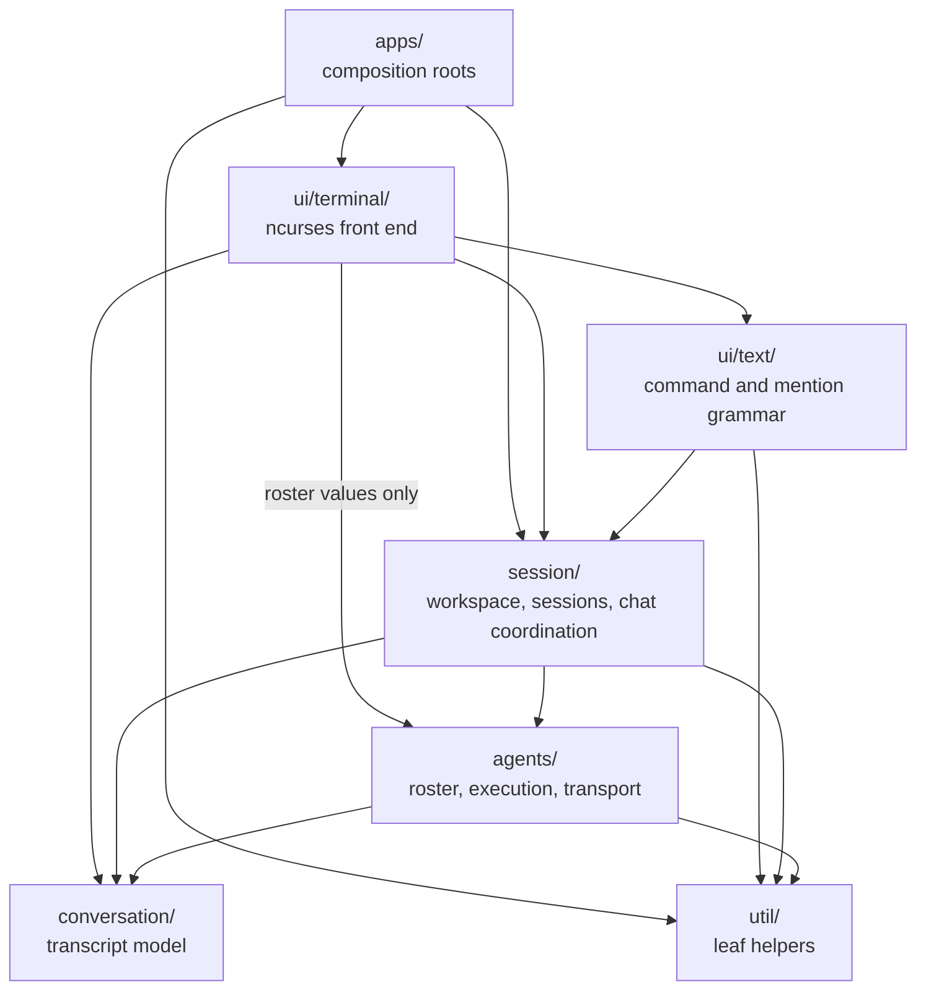
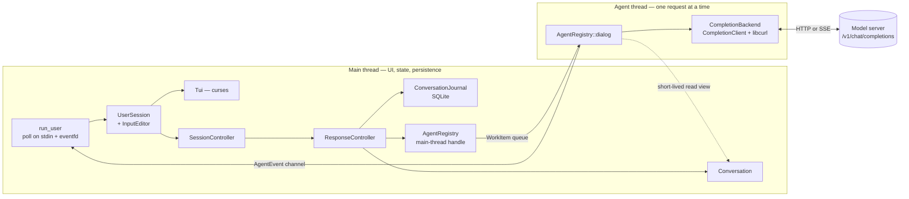
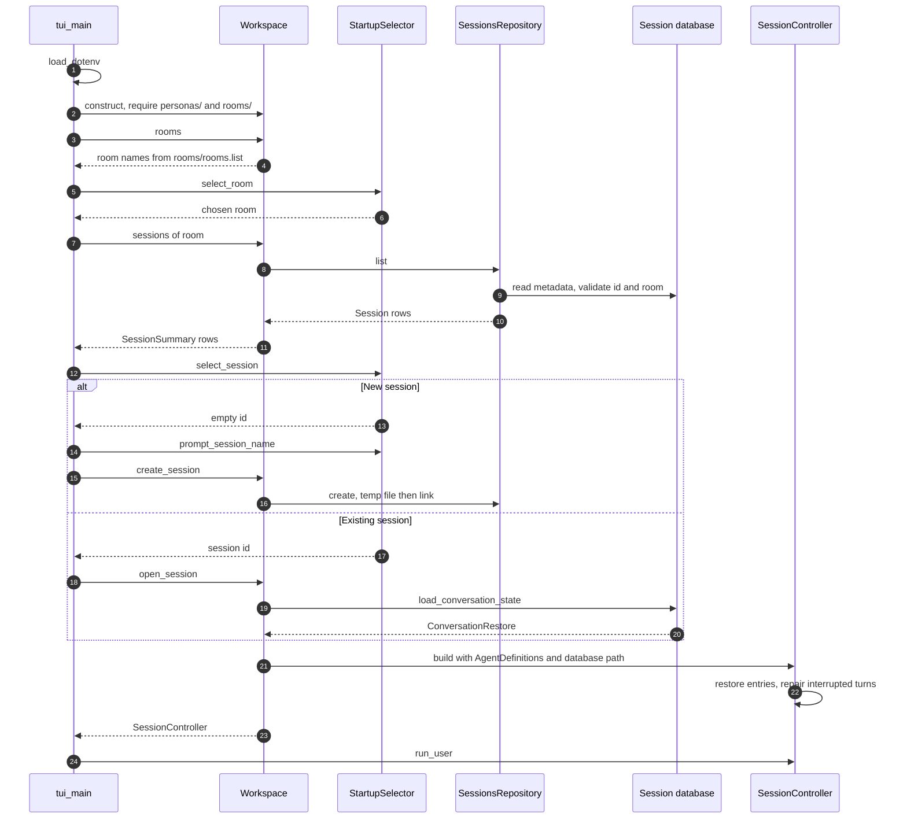
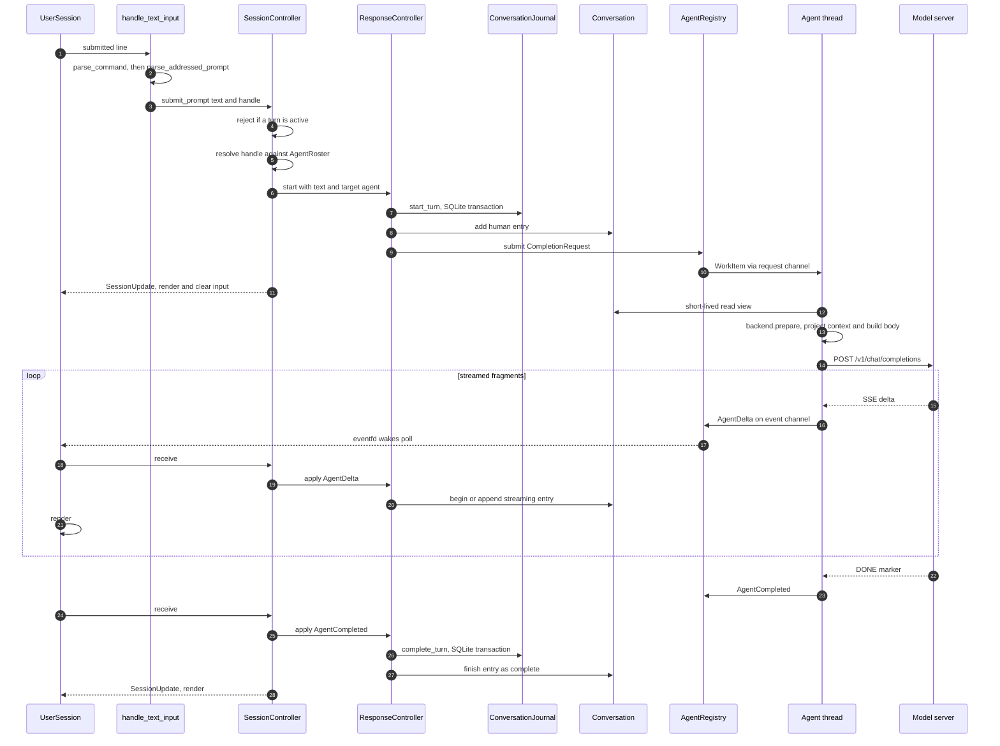
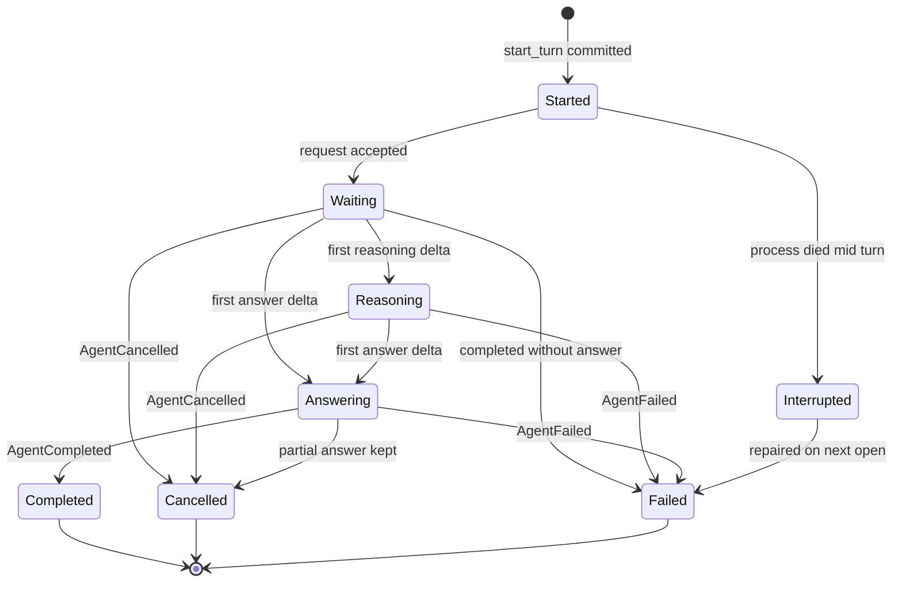

# Source tree — architecture

This document explains how `cha` is built: what the layers are, what each one
owns, how a message travels from a keystroke to a model and back, and which
rules must hold as the code grows. Read it before changing anything structural.

Per-directory `README.md` files describe each layer in detail; the exhaustive
rule-by-rule reference lives in [`docs/cha.md`](../docs/cha.md); the user-facing
manual is the [top-level `README.md`](../README.md).

## The system in one paragraph

`cha` is a terminal chat client for OpenAI-compatible chat-completion servers.
It runs from a *workspace* directory of personas and rooms. A room names an
ordered roster of personas, each with its own model connection and system
prompt, and all of them share one conversation. A *session* is one
self-contained SQLite file holding that conversation. At runtime the user types
into the terminal UI, the text is parsed into a command or an addressed prompt,
the session layer makes the prompt durable and hands it to an agent thread, and
that thread streams the model's answer back as typed events that are
applied to the live transcript and committed to the database at terminal
transitions.

## Layer map

The tree is organized by responsibility. The directories are *not* separate
libraries: CMake compiles every production translation unit except
`apps/tui_main.cpp` into one `cha_core` target, so the boundaries are
architectural, enforced by review and by the include rules below.

| Directory | Owns | Must not know about |
| --- | --- | --- |
| `util/` | Leaf helpers: text and path rules, `.env` loading, the pollable `EventChannel`. | Anything above it. |
| `conversation/` | The transcript model: entry types, validation, and the thread-safe live `Conversation`. | Storage, providers, terminals. |
| `agents/` | Persona config, the room roster, model-context projection, the execution thread, and HTTP transport. | Workspace layout, sessions, front ends. |
| `session/` | Workspace and session operations, SQLite persistence, and live chat coordination. | Terminals, command syntax, transports. |
| `ui/text/` | The textual grammar: slash commands and `@mention` addressing. | Curses, storage, backends. |
| `ui/terminal/` | Terminal lifecycle, startup selection, input editing, rendering, and the event loop. | Workspace files, session repositories, backends. |
| `apps/` | Executable composition roots and process-level error handling. | Reusable policy — it only wires. |

## Dependency direction

An arrow means "may include headers from".

Three rules keep this graph honest:

1. **`ui/` calls `SessionController` and `Workspace`, never storage or
   transport.** A front end may render `ConversationEntry` values and call
   `SessionController`, but it must not open a session repository, read
   workspace files, or call a completion backend. If a front end needs something
   new, add an operation to `session/`.
2. **`conversation/` depends on nothing.** It may not import SQLite, provider
   protocol, or terminal concepts. Everything else may depend on it.
3. **`agents/` owns persona loading but not workspace discovery.** Once
   `session/` has resolved which directories a room uses, `agents/` loads
   `Config` and `AgentDefinition` from them.

## Runtime structure

One process, two long-lived threads. The main thread owns all transcript and
database mutation; the agent thread performs one blocking completion at a time
and reports back through a channel.

Ownership is a strict tree, and destruction order matters:

- `main()` owns the `Workspace`, the process-wide `Terminal`, and the selected
  `SessionController`.
- `run_user()` owns the `Tui` and the `UserSession` for the chat loop.
- `SessionController` owns the `Conversation`, the `ConversationJournal`, the
  `AgentRegistry`, the `ResponseController`, and the current default agent. The
  conversation is declared *before* the registry so it outlives the thread that
  reads it.
- `AgentRegistry` owns the roster, every backend, the request channel, the event
  channel, the worker thread, and the cancellation and outstanding-request
  atomics.

### How the two threads talk

`EventChannel<T>` (see [`util/`](util/README.md)) is a mutex-protected queue
paired with a Linux `eventfd`. There are two channels:

- a private `EventChannel<WorkItem>` carrying routed requests **to** the agent
  thread;
- the shared `AgentEventChannel` carrying `AgentEvent` values **back**. Its
  descriptor is what `run_user()` polls next to stdin, so streamed output and
  keystrokes wake the same loop with no timers and no busy-waiting.

Submission claims a single atomic gate, so at most one request is outstanding
across the whole roster; a second submission is refused even for a different
agent. The agent thread clears the gate immediately *before* publishing a
terminal event, so the main thread can start the next turn as soon as it sees
one. Cancellation is a shared atomic flag checked before `prepare()`, and by the
libcurl progress callback during transfer.

## Lifecycle: startup

Persona loading happens here, on the main thread: each `CompletionClient` is
constructed — including optional `/v1/models` discovery when `model` is unset —
*before* the agent thread starts. After that point only the agent thread touches
a backend, which is why the clients need no internal locking.

## Lifecycle: one turn

This is the path every prompt takes.

Two ordering rules are load-bearing:

- **Durable before visible.** The prompt is written to the journal before it is
  added to the in-memory conversation, and a response is committed before its
  entry is finalized. A crash can therefore lose a turn, but can never show one
  that was not recorded.
- **One writer.** Every mutation above happens on the main thread. The agent
  thread only reads the conversation, and only through a short-lived locked
  view taken before any network I/O.

## Turn states

Exactly one terminal transition is recorded for every started turn.

`Waiting`, `Reasoning`, and `Answering` are the live `ResponsePhase` values
surfaced as `GenerationStatus` and shown in the status line as `generating`,
`reasoning`, and `responding`. A completion that never produced answer text is
treated as a failure, not a success.

## What the model sees

The transcript is not sent verbatim. `project_agent_context()` in `agents/`
rebuilds a per-agent view of it for each request:

- the agent's own effective system prompt comes first;
- notices, errors, and any still-open streaming entry are dropped;
- human prompts belonging to a failed turn are dropped with it;
- only `complete` agent entries with non-empty text survive; cancelled and
  failed answers stay on screen but never become history;
- the requesting agent's own answers become `assistant` messages; another
  agent's answers become `user` messages prefixed with that agent's name;
- when the transcript involves more than the requesting agent, human turns are
  prefixed `User:` and marked `[to Name]` when they were addressed elsewhere;
- consecutive `user` messages produced by this attribution are coalesced.

Reasoning text is never projected and never stored — it exists only in the live
transcript of the process that streamed it.

## What is stored

One session is one self-contained SQLite file under
`rooms/<room>/sessions/<id>.sqlite3`, carrying its own identity so it can be
validated before use, and a `history_epoch` so `/clear` can start a fresh
visible history without deleting anything.

Schema `CHECK` constraints re-state the entry-model rules in SQL, a partial
unique index allows only one `started` turn at a time, and another allows only
one prompt per turn. Streaming status and reasoning text are rejected by
construction. See [`session/README.md`](session/README.md) for the full
persistence contract.

## Invariants

These hold across the whole tree. Breaking one is a design change, not a bug fix.

| Invariant | Enforced by |
| --- | --- |
| A roster is non-empty, with unique IDs and unique case-folded names. | `AgentRoster` constructor |
| At most one turn is in flight, process-wide. | `AgentRegistry` outstanding-request gate |
| Every accepted request yields exactly one terminal `AgentEvent`. | `AgentRegistry::dialog` and shutdown order |
| Only the main thread mutates `Conversation` or the journal. | `SessionController` / `ResponseController` |
| At most one streaming entry is open at a time. | `Conversation` |
| Entry and request IDs are positive and strictly increasing. | `Conversation::require_next_id`, `state` table |
| Durable writes precede visible ones. | `ResponseController` |
| Reasoning text is never persisted or projected. | `require_storable_conversation_entry`, projection |
| Front ends never open storage or call backends. | Include rules above |

## Failure policy

- **Persistence failures are fatal to the session.** A failed journal write is
  rethrown with context; the session ends rather than continuing with a
  transcript the database does not agree with.
- **Provider failures are ordinary events.** A transport or protocol error
  becomes `AgentFailed`, an error entry, and a notice; the session continues.
- **Startup failures abort.** A malformed workspace, room, persona, or session
  database throws before any chat UI is drawn.
- **Terminal restoration wins.** `run_user()` restores the terminal before
  rethrowing, so a stack trace never lands on a screen still in curses mode.
- **Error messages never carry model output.** Streaming protocol errors report
  sanitized status, content type, and byte counts only.

## Extending the system

| Goal | Where the work goes |
| --- | --- |
| New provider or protocol | A new `CompletionBackend` in `agents/`; nothing above it changes. |
| New slash command | `ui/text/command.*` for the grammar, plus an operation on `SessionController` if it touches session state. |
| New front end, e.g. HTTP | A new `ui/http/` front end plus a new `apps/` entry point, reusing `Workspace` and `SessionController` unchanged. |
| New persisted field | `conversation/` entry model, its validators, the SQLite schema and its `CHECK` constraints, and the restore path — in that order. |
| New rendering behavior | `ui/terminal/transcript_renderer.*`, testable through `TranscriptSurface` without curses. |

## Build and test map

| Target | Contents |
| --- | --- |
| `cha_core` | Every production source except `apps/tui_main.cpp`. |
| `cha` | The terminal application: `cha_core` plus `apps/tui_main.cpp`. |
| `cha_tests` | Unit and component tests under `tests/`, mirroring this tree. Run with `make test`. |
| `itest` | Live integration tests driving the real stack against the checked-in `workspace/`. Run with `make itest`; not part of `make test`. |

Third-party dependencies are libcurl, nlohmann/json, toml++, SQLite
(amalgamation), wide ncurses, and GoogleTest — vendored through CMake
`FetchContent` when not already installed.

## Source conventions

- Project headers are included from the `src/` include root, for example
  `"session/session_controller.h"`.
- Headers include what their own declarations need; no reliance on transitive
  includes.
- Every class and struct carries a comment saying why it exists, what it does,
  and which project types it collaborates with.
- Public data types live with the behavior that owns their meaning: agent
  protocol and roster types in `agents/`, session and journal types in
  `session/`, transcript semantics in `conversation/`.
- Tests mirror this tree under `tests/`; cross-layer scenarios go in
  `tests/integration/`.

## Where to read next

| Layer | Document |
| --- | --- |
| Transcript model | [`conversation/README.md`](conversation/README.md) |
| Agent runtime and transport | [`agents/README.md`](agents/README.md) |
| Operations and persistence | [`session/README.md`](session/README.md) |
| UI contract | [`ui/README.md`](ui/README.md) |
| Command and mention grammar | [`ui/text/README.md`](ui/text/README.md) |
| Terminal front end | [`ui/terminal/README.md`](ui/terminal/README.md) |
| Entry points | [`apps/README.md`](apps/README.md) |
| Shared helpers | [`util/README.md`](util/README.md) |
| Exhaustive design rules | [`../docs/cha.md`](../docs/cha.md) |
