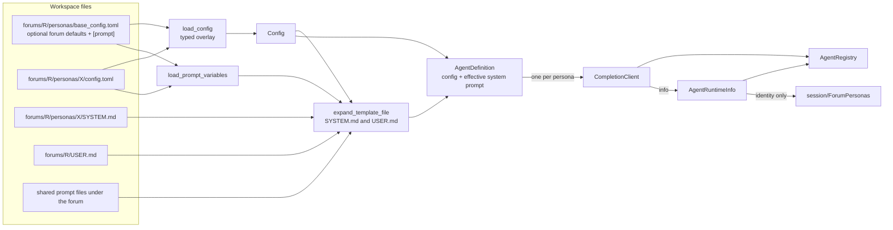
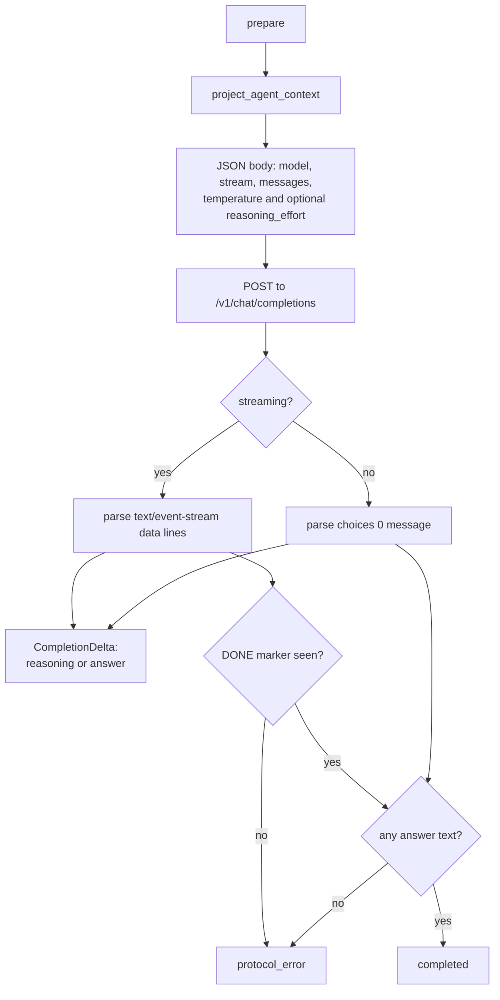
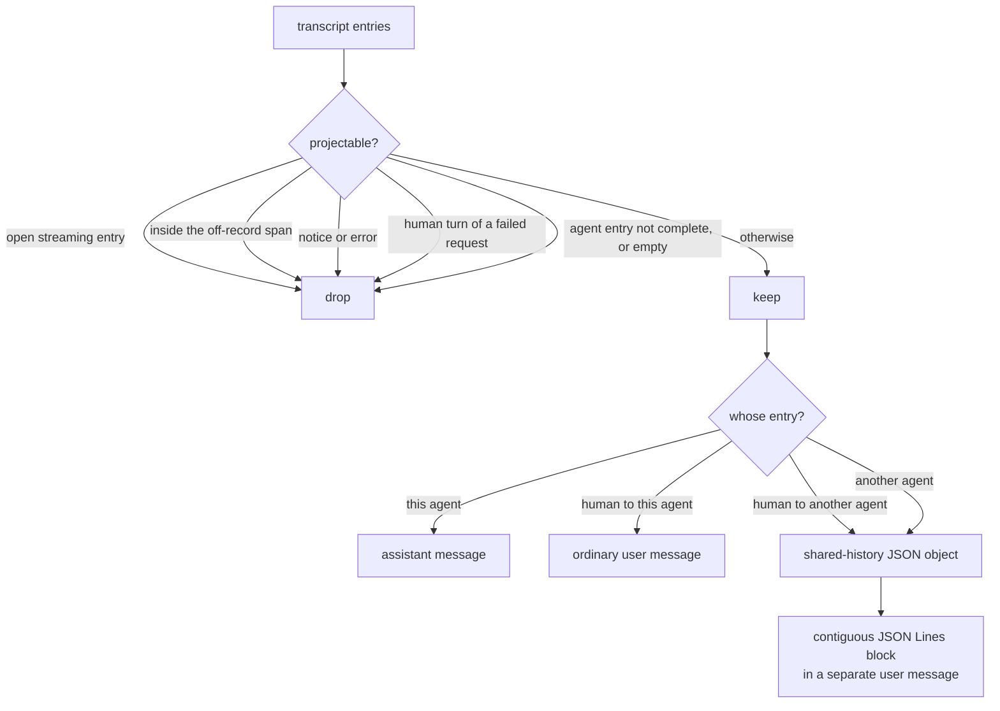

# Agent runtime

`agents/` owns everything about configured chat agents: loading a persona,
projecting the transcript into model context, running completions on
registry-owned threads, and speaking the provider's HTTP protocol. The ordered
personas in a forum and `@handle` resolution belong to `session/`.

It is the only layer that talks to a model server, and the only one that owns
completion runner threads.

## Contents

| Source | Responsibility |
| --- | --- |
| `config.*` | `Config` — identity, connection, model, streaming, auth, and reasoning settings — plus typed TOML overlays, field validation, and `load_prompt_variables()`. |
| `agent.*` | `AgentDefinition`, `PersonaInfo`, `AgentRuntimeInfo`, identity validation, definition loading with template expansion, the request and event protocol types, and `project_agent_context()`. |
| `json_serialization.h` | JSON dumping with consistent, context-specific invalid-UTF-8 errors. |
| `agent_registry.*` | Runtime metadata, backend leases, staged regular/temporary runners, foreground event routing, cancellation, and abort cleanup. |
| `completion_backend.h` | The `CompletionBackend` seam and its prepared-request and result types. |
| `completion_client.*` | The HTTP backend: request bodies, SSE and non-streaming parsing, model discovery, and protocol diagnostics. |

## From persona directory to running agent



The effective system prompt is the expanded persona `SYSTEM.md`, followed by the
expanded forum `USER.md`, followed by generated forum context. Expansion is
implemented in `util/text_template.*`; this layer supplies the policy: forum
directory as containment root, reserved `persona.*` / `forum.*` names, and the
base-then-persona `[prompt]` initial scope. An adjacent `config.toml` overlays
that inherited scope for its template directory and descendants; reserved
loader values always win. The generated section names the current agent, lists
the other current personas, and defines how quoted shared history is encoded.
It is added even for a single-agent forum, because restored history can still
mention a persona that has left. Loading happens on the main thread during
session construction or a forum check: `session/` decides *which* directories
to load, `agents/` decides *how*.

Configuration is a one-level overlay, not general inheritance. Built-in
defaults are applied first, then the optional forum
`personas/base_config.toml`, then the persona's own `config.toml`. An omitted
field inherits the value below it. The persona directory name provides the ID,
and each persona file must define `display_name`; the base file must not. Parsing and
validation errors identify the file that supplied the invalid value.

Legacy persona files may use `name` as a fallback for `display_name` and may
override the directory-derived ID with `id`. The base file rejects all three
identity fields. New definitions should use only the directory ID and
`display_name`.

Identity rules, enforced by `validate_persona_id` and `validate_persona_name`:

- an **ID** is ASCII letters, digits, underscores, and hyphens. It is stable and
  is what transcript entries record — never change it when renaming a persona.
- a **name** is the visible `@handle`. It may not be empty, start or end with
  whitespace, start with `@` or `/`, or be `User` in any casing. Internal
  whitespace is allowed for multi-word handles.
- within one forum, IDs are unique and names are unique case-insensitively.

`AgentRegistry` validates these rules when it accepts backend metadata.
`ForumPersonas` in `session/` separately owns the ordered identity-only view used
for lookup and handle resolution.

## Execution: staged runners and foreground routing

`AgentRegistry` exists so slow providers never block the UI. It owns one
backend per forum persona, one persistent regular runner, and temporary
one-shot runners used only by concurrent multicast batches. Every runner has
its own cancellation flag and event queue. The queue buffers deltas in its
deque and reserves separate storage for one final event supplied when it closes.

```mermaid
sequenceDiagram
    autonumber
    participant M as Main thread
    participant R as AgentRegistry
    participant W0 as Regular runner
    participant WN as Temporary runners
    participant B as Backends

    M->>R: stage_batch(CompletionInput[])
    R->>R: acquire one lease per distinct backend
    R->>W0: stage child 0 behind closed gate
    R->>WN: stage remaining children behind closed gate
    W0-->>R: parked
    WN-->>R: all parked
    R-->>M: BatchId; positions match input order
    M->>R: set_foreground(BatchId, position 0)
    M->>R: open_batch_gate
    par every runner
        W0->>B: prepare then perform
    and
        WN->>B: prepare then perform
    end
    B-->>W0: deltas and terminal
    B-->>WN: deltas and terminal
    W0-->>M: foreground channel through try_receive
    Note over WN: background channels remain buffered
    M->>R: retire position 0, select position 1
    WN-->>M: drain child 1 channel
```

Rules that fall out of this design:

- **One operation, several backends.** The controller still admits one user
  operation, while a multicast may lease several distinct backends at once.
- **One explicit batch.** The registry stores at most one `BatchRecord`, not a
  collection keyed by batch ID. Its fixed vector of run slots follows input
  order; retirement or cleanup empties a slot without shifting later
  positions. The returned `BatchId` is only a generation guard against stale
  controller calls.
- **Lease exclusivity.** A backend lease lasts from staging until its run is
  retired. Input validation precedes acquisition; staging rollback releases
  every acquired lease. Normal retirement and abort cleanup release a lease
  only after the worker is joined or the regular runner is reset.
- **Failure-atomic staging.** `stage_batch()` returns only after every runner is
  parked. A construction failure cancels the unopened gate, joins temporary
  workers, resets the regular runner, and releases every lease.
- **One start decision.** Opening or cancelling the shared gate is idempotent;
  the first transition wins. Parked workers wait on a condition variable and a
  cancelled unopened gate produces `AgentCancelled` without calling the
  backend.
- **Foreground-only consumption.** `try_receive()` exposes only the selected
  runner. A temporary runner is retained until its terminal event is consumed
  and committed.
- **Guaranteed terminal delivery.** Allocating delta storage may fail and
  becomes an execution failure, but every launched execution—including one
  cancelled before `perform()`—publishes exactly one terminal event through
  the queue's allocation-free `close_with()` operation.
- **Batch reservation.** Child 0 uses the regular runner. After it retires the
  worker may be execution-idle, but admission of another batch remains refused
  until the entire batch retires.
- **Cancellation is per execution.** It is checked before preparation and by
  the transport. `/stop` cancels every live batch runner; unactivated channels
  are discarded only by abort cleanup.
- **Abort cleanup is event-loop driven.** `/stop` only cancels the executions
  and marks the batch aborting. Each execution wakes the main loop after
  becoming fully done; `poll_abort_cleanup()` then resets or joins only those
  finished runners and releases their leases. No cleanup thread is created,
  and polling never waits for an unfinished backend.
- **Background buffering is lossless and unbounded.** There is no artificial
  queue cap or silent dropping in this version. Memory use is proportional to
  the total delta data and queue overhead buffered by children that have not
  yet become foreground.
- **Background multicast work is intentionally volatile.** Only the selected
  foreground child has a durable turn. A process crash may lose queued output
  or a completed answer from a later child. This reviewed tradeoff preserves
  concurrent backends and ordered commits without adding batch persistence or
  result-spooling machinery; simplicity is preferred over crash durability for
  this in-flight work.
- **Exceptions become events.** Anything thrown on the worker is converted to
  `AgentFailed`, so an accepted request always has an observable outcome.
- **Shutdown is ordered.** `stop()` reconciles abort cleanup, joins every
  runner, retains and drains the foreground event channel, and only then makes
  the registry receive source report `closed`.

The abort and shutdown ownership states are:

| State | UI | Foreground channel | Cleanup/reaping | Regular runner |
| --- | --- | --- | --- | --- |
| Batch executing | Busy | Registry-selected foreground | None | Batch-owned; may run child 0 |
| Stopping, foreground not terminal | `stopping` with agent name | Retained and drained through terminal commit | Main-loop polls and reaps finished non-foreground runs | Live or done if it owns the foreground |
| Stopping, foreground committed | Still busy | Released for reaping | Main-loop finishes reaping as workers report done | Reset after it reports done if it owned child 0 |
| Abort complete | Idle | None | Batch retired | Idle and reusable |
| Shutdown during a batch | Ending | Retained until its execution finishes, then drained | `stop()` synchronously joins non-foreground runners | Joined by registry shutdown |

The regular worker can become execution-idle after child 0 retires, but it
remains structurally batch-owned: the live batch record prevents admission of a
new batch until every child retires. Reuse receives a new `Execution`, so
cancellation state and the prior backend lease cannot carry into a later
request.

## The backend seam

`CompletionBackend` is deliberately two-phase:

| Step | Runs | Purpose |
| --- | --- | --- |
| `prepare(input)` | Agent worker | Project owned `CompletionHistory`, append the run prompt once, and build a `RequestPayload`. Must be fast and local. |
| `perform(payload, sink, cancellation)` | Agent worker | One synchronous completion, streaming fragments to the sink. |
| `info()` | Any time | Persona identity and public runtime details for the registry. |

The controller captures immutable completion history before activating a turn,
so neither the registry nor a backend reads the live transcript. Splitting
preparation from performance keeps request construction separate from slow
provider I/O. Tests supply their own backend and never touch the network;
`tests/support/test_backends.h` has the helpers.

## HTTP transport

`CompletionClient` implements the seam for OpenAI-compatible servers.



Details worth knowing before changing this file:

- **Model discovery.** When `model` is unset, the constructor GETs `/v1/models`
  and takes `data[0].id`. That request has a 10-second timeout; the chat request
  deliberately has none, because generations are long. Both use a 10-second
  connect timeout.
- **Cancellation** is wired through libcurl's progress callback, so an in-flight
  transfer aborts promptly and is reported as `cancelled` rather than an error.
- **Reasoning formats.** `auto` accepts `reasoning_content` or `reasoning`
  (preferring the former), `none` disables extraction, and the two named formats
  select exactly one field. Reasoning inside ordinary `content`, such as
  `<think>` tags, is *not* parsed — it has no structured boundary, so it is
  treated as answer text.
- **Outcome taxonomy.** `completed`, `cancelled`, `protocol_error` (bad HTTP
  status, malformed JSON or SSE, missing terminator, no answer content), and
  `transport_error` (libcurl failure). Only the error outcomes carry a message,
  and streaming protocol errors report sanitized status, content type, and byte
  counts — never model output.
- **Test mode.** `mode = "test"` skips HTTP entirely: `prepare` returns the
  prompt text and `perform` echoes it back as a single answer delta. This is
  what makes the checked-in workspace runnable without a server.

## Context projection

`project_agent_context()` decides what one agent sees of a shared chat transcript.
It is pure, and it is tested directly.



The generated system section explains that shared-history objects are quoted
statements whose first-person claims belong to their named speakers. JSON
escaping prevents embedded newlines, quotes, or label-like text from creating
false entry boundaries. A human prompt addressed to the requesting agent is
always emitted outside the preceding shared-history block. Plain single-agent
history retains its ordinary user/assistant wire shape, and reasoning text is
never included.

The predicate is a conjunction, so the off-record rule needs no ordering against
the others. The span is passed in as one `OffrecordSpan` value taken from the
same owned `CompletionHistory` as the entries, and it is global: every persona
in the forum sees the same exclusion, so the shared history they quote stays
consistent between them. Excluded turns are spliced out silently — no
placeholder marks the gap, since a note saying material was withheld is itself
the influence the span exists to remove. Because the bounds only ever land on
turn boundaries the span holds whole turns, so a splice can merge the runs on
either side of it into one shared-history block but can never separate a prompt
from its answer.

## Dependencies

- **Depends on:** `transcript/` for entries, completion histories, and IDs; `util/` for
  text helpers, `ConcurrentQueue`, and `WakeNotifier`; nlohmann/json for shared-history and HTTP
  JSON; libcurl in the HTTP client; toml++ in the config loader.
- **Must not depend on:** `session/` or `ui/`. Workspace discovery
  stays above; once the persona and forum directories are known, this layer owns
  the loading.

## Tests

| Test | Covers |
| --- | --- |
| `tests/agents/unit_config_loader.cpp` | TOML fields, defaults, and rejection of malformed values. |
| `tests/agents/unit_agent_definition_loader.cpp` | Persona and forum prompt expansion, composition, scopes, and load errors. |
| `tests/session/unit_forum_personas.cpp` | Forum-persona validation and every handle-resolution branch. |
| `tests/agents/unit_agent_registry.cpp` | Batch gating, terminal delivery, staging rollback, backend leases, cancellation, foreground routing, and shutdown ordering. |
| `tests/agents/unit_agent_context.cpp` | Projection rules, JSONL attribution, escaping, and message boundaries. |
| `tests/agents/unit_json_serialization.cpp` | Context-specific invalid-UTF-8 diagnostics for JSON serialization. |
| `tests/agents/unit_completion_client.cpp` | Request bodies, SSE and JSON parsing, reasoning formats, and the error taxonomy, driven by `tests/support/mock_http_server.h`. |
