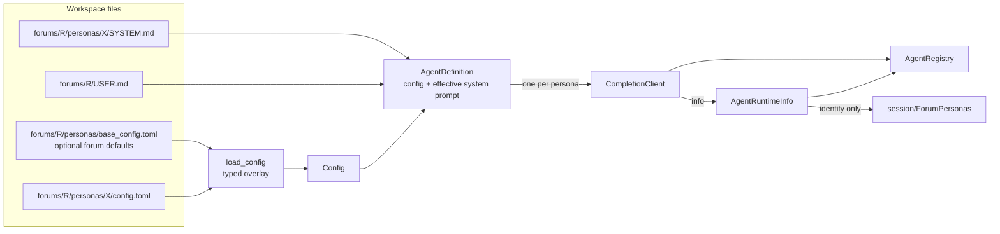
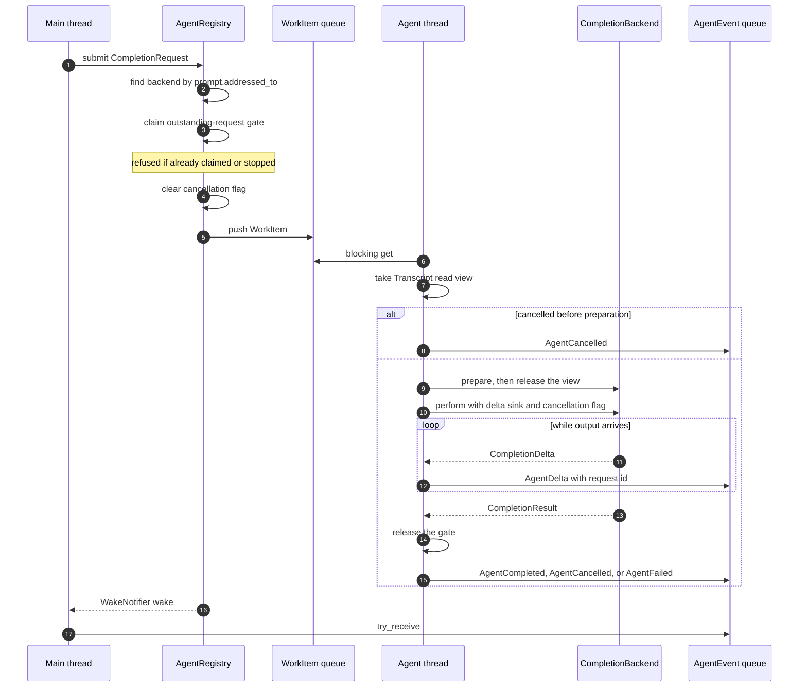
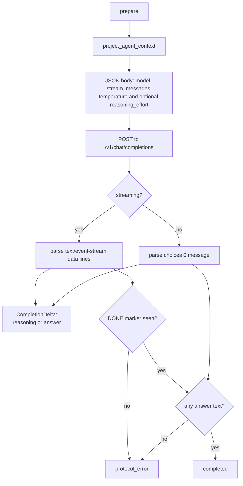
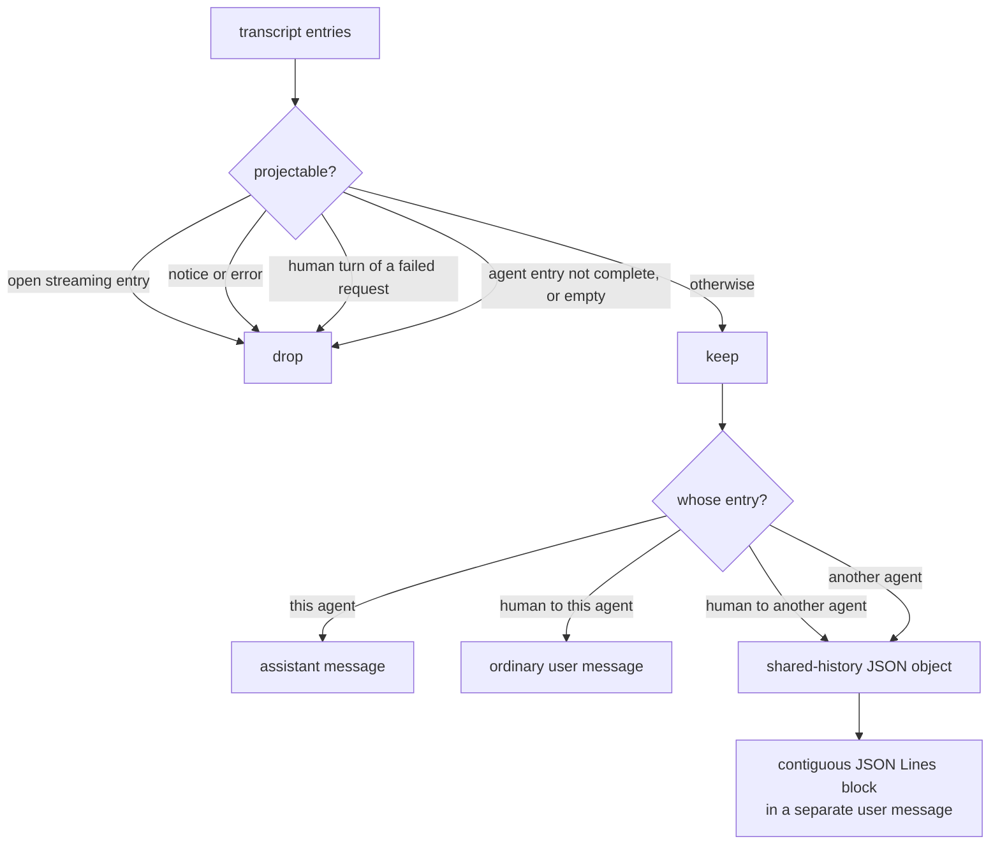

# Agent runtime

`agents/` owns everything about configured chat agents: loading a persona,
projecting the transcript into model context, running completions on a
dedicated thread, and speaking the provider's HTTP protocol. The ordered
personas in a forum and `@handle` resolution belong to `session/`.

It is the only layer that talks to a model server, and the only one that owns a
thread.

## Contents

| Source | Responsibility |
| --- | --- |
| `config.*` | `Config` — identity, connection, model, streaming, auth, and reasoning settings — plus typed TOML overlays and field validation. |
| `agent.*` | `AgentDefinition`, `PersonaInfo`, `AgentRuntimeInfo`, identity validation, the request and event protocol types, and `project_agent_context()`. |
| `json_serialization.h` | JSON dumping with consistent, context-specific invalid-UTF-8 errors. |
| `agent_registry.*` | Runtime metadata, the execution thread, request routing, cancellation, and channels. |
| `completion_backend.h` | The `CompletionBackend` seam and its prepared-request and result types. |
| `completion_client.*` | The HTTP backend: request bodies, SSE and non-streaming parsing, model discovery, and protocol diagnostics. |

## From persona directory to running agent

The effective system prompt is the persona's `SYSTEM.md`, followed by the
forum's `USER.md`, followed by generated forum context. The generated section
names the current agent, lists the other current personas, and defines how
quoted shared history is encoded. It is added even for a single-agent forum,
because restored history can still mention a persona that has left. Loading
happens on the main thread during session construction: `session/` decides
*which* directories to load, `agents/` decides *how*.

Configuration is a one-level overlay, not general inheritance. Built-in
defaults are applied first, then the optional forum
`personas/base_config.toml`, then the persona's own `config.toml`. An omitted
field inherits the value below it. The persona directory name provides the ID,
and each persona file must define `display_name`; the base file must not. Parsing and
validation errors identify the file that supplied the invalid value.

Identity rules, enforced by `validate_persona_id` and `validate_persona_name`:

- an **ID** is ASCII letters, digits, underscores, and hyphens. It is stable and
  is what transcript entries record — never change it when renaming a persona.
- a **name** is the visible `@handle`. It may not be empty, contain whitespace,
  start with `@` or `/`, or be `User` in any casing.
- within one forum, IDs are unique and names are unique case-insensitively.

`AgentRegistry` validates these rules when it accepts backend metadata.
`ForumPersonas` in `session/` separately owns the ordered identity-only view used
for lookup and handle resolution.

## Execution: one thread, one request

`AgentRegistry` exists so a slow provider can never block the UI. It owns
one worker thread, one backend per forum persona, and two queues.

Rules that fall out of this design:

- **Single flight.** The gate is process-wide, not per agent: a second submit is
  refused while any request is outstanding.
- **The gate opens before the terminal event.** By the time the main thread sees
  a terminal event, the next request can already be submitted.
- **Cancellation is cooperative.** `cancel()` only sets an atomic flag. It is
  checked before preparation and continuously by the transport, so a request
  that has not started yet is cancelled without ever reaching the provider.
- **Exceptions become events.** Anything thrown on the worker is converted to
  `AgentFailed`, so an accepted request always has an observable outcome.
- **Shutdown is ordered.** `stop()` sets cancellation, closes the request side,
  joins the worker, and only then closes the event side — so events already
  published stay readable, and a closed event queue during execution is a bug
  that throws rather than a silent loss.

## The backend seam

`CompletionBackend` is deliberately two-phase:

| Step | Runs | Purpose |
| --- | --- | --- |
| `prepare(request, view)` | Under the transcript lock | Read the transcript and build a `RequestPayload`. Must be fast. |
| `perform(payload, sink, cancellation)` | Without the lock | One synchronous completion, streaming fragments to the sink. |
| `info()` | Any time | Persona identity and public runtime details for the registry. |

Splitting them is what lets the main thread keep writing to the transcript
while a generation runs. Tests supply their own backend and never touch the
network; `tests/support/test_backends.h` has the helpers.

## HTTP transport

`CompletionClient` implements the seam for OpenAI-compatible servers.

Details worth knowing before changing this file:

- **Model discovery.** When `model` is unset, the constructor GETs `/v1/models`
  and takes `data[0].id`. That request has a 10-second timeout; the chat request
  deliberately has none, because generations are long. Both use a 10-second
  connect timeout.
- **Cancellation** is wired through libcurl's progress callback, so an in-flight
  transfer aborts promptly and is reported as `cancelled` rather than an error.
- **Reasoning formats.** `auto` accepts `reasoning_content` or `reasoning`
  (preferring the former), `none` disables extraction, and the two named formats
  select exactly one field. Reasoning inside ordinary `content`, such as
  `<think>` tags, is *not* parsed — it has no structured boundary, so it is
  treated as answer text.
- **Outcome taxonomy.** `completed`, `cancelled`, `protocol_error` (bad HTTP
  status, malformed JSON or SSE, missing terminator, no answer content), and
  `transport_error` (libcurl failure). Only the error outcomes carry a message,
  and streaming protocol errors report sanitized status, content type, and byte
  counts — never model output.
- **Test mode.** `mode = "test"` skips HTTP entirely: `prepare` returns the
  prompt text and `perform` echoes it back as a single answer delta. This is
  what makes the checked-in workspace runnable without a server.

## Context projection

`project_agent_context()` decides what one agent sees of a shared chat transcript.
It is pure, and it is tested directly.

The generated system section explains that shared-history objects are quoted
statements whose first-person claims belong to their named speakers. JSON
escaping prevents embedded newlines, quotes, or label-like text from creating
false entry boundaries. A human prompt addressed to the requesting agent is
always emitted outside the preceding shared-history block. Plain single-agent
history retains its ordinary user/assistant wire shape, and reasoning text is
never included.

## Dependencies

- **Depends on:** `transcript/` for entries, read views, and IDs; `util/` for
  text helpers, `ConcurrentQueue`, and `WakeNotifier`; nlohmann/json for shared-history and HTTP
  JSON; libcurl in the HTTP client; toml++ in the config loader.
- **Must not depend on:** `session/` or `ui/`. Workspace discovery
  stays above; once the persona and forum directories are known, this layer owns
  the loading.

## Tests

| Test | Covers |
| --- | --- |
| `tests/agents/unit_config_loader.cpp` | TOML fields, defaults, and rejection of malformed values. |
| `tests/agents/unit_agent_definition_loader.cpp` | Persona and forum prompt composition, and load errors. |
| `tests/session/unit_forum_personas.cpp` | Forum-persona validation and every handle-resolution branch. |
| `tests/agents/unit_agent_registry.cpp` | Single-flight gating, event correlation, cancellation, shutdown ordering. |
| `tests/agents/unit_agent_context.cpp` | Projection rules, JSONL attribution, escaping, and message boundaries. |
| `tests/agents/unit_json_serialization.cpp` | Context-specific invalid-UTF-8 diagnostics for JSON serialization. |
| `tests/agents/unit_completion_client.cpp` | Request bodies, SSE and JSON parsing, reasoning formats, and the error taxonomy, driven by `tests/support/mock_http_server.h`. |
