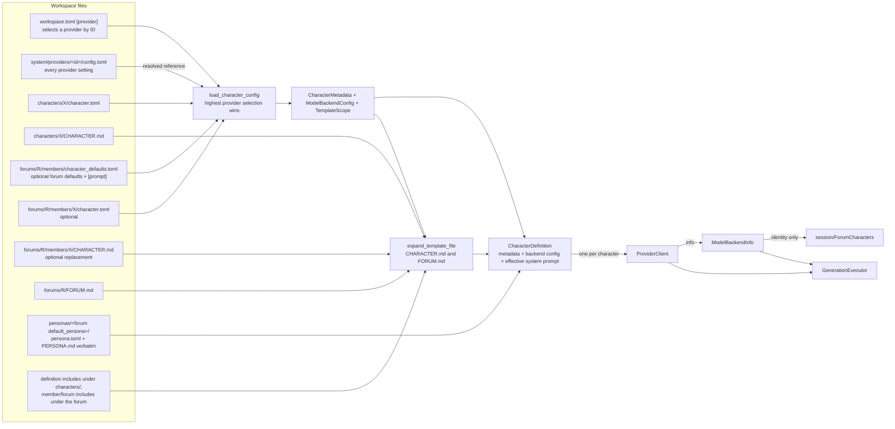
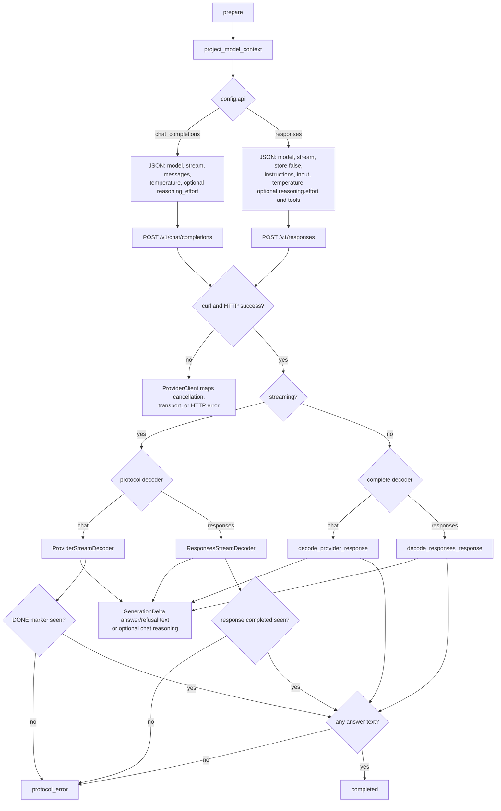
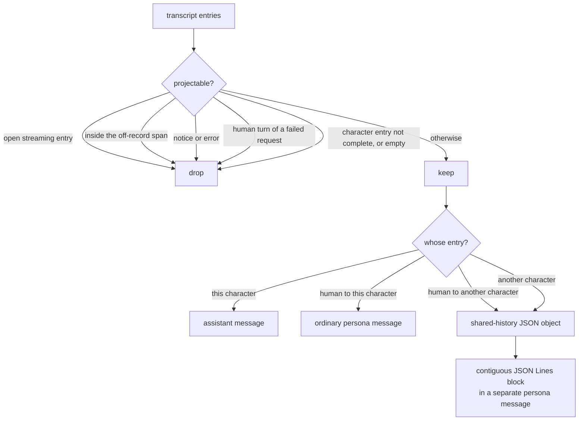

# Generation runtime

`agents/` owns generation execution for configured characters: loading a character,
projecting the transcript into model context, running generations as
batch-owned pool tasks, and speaking the provider's HTTP protocol. The ordered
characters in a forum and `@handle` resolution belong to `session/`.

It is the only layer that talks to a model server, and the only one that owns
generation pool tasks.

## Contents

| Source | Responsibility |
| --- | --- |
| `character_config.*` | Private `ModelBackendConfig` and `LoadedCharacterConfig` values assembled from the selected provider config with field validation. |
| `character.*` | Effective `CharacterDefinition` loading, identity validation, template expansion, and standard prompt assembly. |
| `model_context.*` | Immutable run input and projection from transcript entries to model-visible messages. |
| `generation_event.h` | Semantic output deltas and request-correlated progress and terminal events. |
| `generation_executor.*` | Backend ownership, runtime metadata validation, target resolution, and failure-atomic staging of a new batch. |
| `generation_batch.*` | One in-flight operation: its execution slots, shared start gate, foreground position, cancellation, event queues, and wait state. |
| `model_backend.h` | The `ModelBackend` seam, discovery-safe runtime diagnostics, and prepared-request/result types. |
| `provider_client.*` | Shared HTTP transport for Chat Completions and Responses: curl execution, cancellation, model discovery, HTTP outcome mapping, and transport diagnostics. |
| `provider_response.*` | Chat Completions response interpretation: incremental SSE framing, streaming/non-streaming JSON decoding, reasoning fields, and answer validation. |
| `responses_api.*` | Responses API request body builder plus streaming and non-streaming decoding for answer/refusal text. |

## From character directory to running model backend



The effective system prompt has four sections in this exact order: expanded
character `CHARACTER.md`, expanded forum `FORUM.md`, the persona roster (each
`PERSONA.md` verbatim under its display-name heading), and generated forum context.
The roster a forum's characters receive is that forum's configured default
persona only. `/!Name` persists the choice and reloads the forum's live
sessions, so the assembled prompts always match the session's persona.
It is model reference context only, not forum/session membership and not an
authorization list. Persona authorship is resolved independently at the
frontend/application input boundary.
Expansion is implemented in `util/text_template.*`; this layer supplies the
policy: a definition prompt is contained to workspace `characters/`, while a
member prompt and `FORUM.md` are contained to the forum directory. It also
supplies reserved `character.*` / `forum.*` names and the three-layer `[prompt]`
initial scope. An adjacent template `config.toml` overlays
that inherited scope for its template directory and descendants; reserved
loader values always win. The generated section names the current character, lists
the other current characters, and defines how quoted shared history is encoded.
It is added even for a single-character forum, because restored history can still
mention a character that has left. During session construction, loading happens
on the session's owner thread; a forum check loads synchronously on its
calling thread. `session/` decides
*which* directories to load, `agents/` decides *how*.

Configuration selects complete provider configs; it does not overlay provider
fields. The application `[provider]`, the character definition, the optional
forum `members/character_defaults.toml`, and the optional per-member override
are read in that order, and the highest layer naming a `provider` supplies the
whole backend. A layer that names none inherits the one below it. Each
reference is read from `system/providers/<id>/config.toml`; a missing config
stops startup, as does any provider setting written into a layer instead of a
provider config. Only the `[prompt]` scope still merges across layers.

The character definition directory name provides the ID, and its
file must define `display_name`; it may also carry an optional one-line
`description`. Both forum-local layers must not define either field or
`tags`. `tags` are definition-only optional free-form strings: each is trimmed,
non-empty, free of controls and line breaks, and unique under ASCII case
folding while retaining authored casing. The removed `id` and `name` fields are
rejected. Parsing and validation errors identify the file that supplied the
invalid value.

Appearance is definition-only. A character definition selects
`style = "<id>"`, resolved from `system/styles/<id>/config.toml`. The style
config may contain `font`, `style`, `weight`, and `size`; omitted fields use
the standard appearance defaults. A missing or invalid style stops startup.
`load_named_provider()` and `load_named_style()` are the one-name loaders
behind that resolution; they are also how the workspace lists only options
that actually parse.

Provider protocol and search fields belong in the provider config:

| TOML field | Values | Default | Notes |
| --- | --- | --- | --- |
| `api` | `chat_completions`, `responses` | `responses` | Selects `/v1/chat/completions` or `/v1/responses`. |
| `web_search` | `off`, `auto`, `required` | `required` | Hosted OpenAI web search; non-`off` requires `api = "responses"`. |
| `base_path` | URL path prefix | empty | Prepended before the API's `/v1` path; for example, OpenRouter uses `/api`. |

The effective defaults are `api = "responses"` and
`web_search = "required"`, so a provider that selects Chat Completions also
requires an explicit `web_search = "off"`.

`web_search = "auto"` sends `tools: [{type: web_search}]` with `tool_choice: "auto"`.
`required` uses the same tool with `tool_choice: "required"`. Every provider
value is validated where it is written, so the error names the provider config
rather than the character that referenced it. A provider config requires `host`
and `port`, leaves `ModelBackendConfig` defaults in place for anything it
omits, and rejects `api_key` in favour of `api_key_env`.

Identity rules, enforced by `validate_character_id` and `validate_character_display_name`:

- an **ID** is ASCII letters, digits, underscores, and hyphens. It is stable and
  is what transcript entries record — never change it when renaming a character.
- a **name** is the visible `@handle`. It may not be empty, start or end with
  whitespace, start with `@` or `/`, or be a reserved participant name in any casing. Internal
  whitespace is allowed for multi-word handles.
- within one forum, IDs are unique and names are unique case-insensitively.

Workspace construction rejects persona/character ID collisions and
case-insensitive display-name collisions across all definitions. Tags organize
definitions only; they never imply membership in a forum.

`GenerationExecutor` validates these rules when it accepts backend metadata.
`ForumCharacters` in `session/` separately owns the ordered identity-only view used
for lookup and handle resolution.

The generated context documents the shared-history JSONL encoding and the
`from <Name>:` convention. Context projection adds that prefix to ordinary
human `persona` messages, for both replayed entries and the live `RunSpec` prompt.
It never mutates stored text; shared-history JSONL retains its own `speaker`
field and unprefixed text.

## Execution: staged pool tasks and foreground routing

This split exists so slow providers never block the UI, and so that two
different lifetimes stay in two different types. `GenerationExecutor` lives as
long as the session: it owns one backend per forum character and borrows the
session's fixed-size `ThreadPool`. A slot can be rebuilt while idle — a
runtime provider override (`/provider`) replaces one character's backend from
its retained definition without touching the others. `GenerationBatch` lives
as long as one submitted operation: it owns that operation's ordered execution
slots, their shared start gate, the foreground position, and cancellation
state.

Each slot owns the one `GenerationRequest` its backend uses — including its
`RunSpec` — plus its own cancellation flag and event queue. The queue buffers
deltas and reserves separate storage for one final event supplied when it closes.

```mermaid
sequenceDiagram
    autonumber
    participant M as Session owner thread
    participant X as GenerationExecutor
    participant C as GenerationBatch
    participant P as ThreadPool
    participant W as Pool workers
    participant B as Backends

    M->>X: stage_batch(GenerationRequest[])
    X->>P: submit one gated task per child
    X-->>M: GenerationBatch by value; slots follow input order
    M->>C: open after the foreground turn is durable
    par available workers
        P->>W: run child 0
        W->>B: prepare then perform
    and
        P->>W: run other children
        W->>B: prepare then perform
    end
    W-->>M: foreground channel through try_receive_foreground
    Note over W: background channels remain buffered
    M->>C: advance_foreground, then destroy after the final terminal
```

Rules that fall out of this design:

- **One operation, several backends.** The controller still admits one persona
  operation, while a multicast may target several distinct backends at once.
- **One batch object.** The batch *is* the operation; there is no registry of
  batches, no batch ID, and no current-batch record in the executor. The
  controller's `optional<GenerationBatch>` is what makes at most one live.
- **Backend exclusivity.** One live batch and distinct validated targets ensure
  a backend is never called concurrently with itself.
- **Failure-atomic staging.** Target resolution, slot construction, and task
  submission all complete before the batch is returned. A partial submission
  cancels the unopened gate, waits only for the accepted tasks to finish, and
  returns no batch.
- **One start decision.** Opening or cancelling the shared gate is idempotent;
  the first transition wins. Queued tasks observe an already-open or cancelled
  gate when they receive a worker; cancellation produces `GenerationCancelled`
  without calling the backend.
- **Foreground-only consumption.** `foreground_run()` and
  `try_receive_foreground()` read the same slot, so no caller passes an index
  between objects. `advance_foreground()` is rejected until that slot's terminal
  event has been delivered, and executions stay owned by the batch until it is
  destroyed.
- **Guaranteed terminal delivery.** Allocating delta storage may fail and
  becomes an execution failure, but every launched execution—including one
  cancelled before `perform()`—publishes exactly one terminal event through
  the queue's allocation-free `close_with()` operation.
- **Cancellation is per execution.** It is checked before preparation and by
  the transport. `/stop` cancels every live execution and returns immediately.
- **Abort cleanup is event-loop driven.** `/stop` only calls `cancel()`, which
  is the batch's single cancellation transition. Each execution wakes the main
  loop after becoming done; the controller releases the batch only after its
  foreground terminal was committed and all executions are done.
- **Background buffering is lossless and unbounded.** There is no artificial
  queue cap or silent dropping in this version. Memory use is proportional to
  the total delta data and queue overhead buffered by children that have not
  yet become foreground.
- **Background multicast work is intentionally volatile.** Only the selected
  foreground child has a durable turn. A process crash may lose queued output
  or a completed answer from a later child. This reviewed tradeoff preserves
  concurrent backends and ordered commits without adding batch persistence or
  result-spooling machinery; simplicity is preferred over crash durability for
  this in-flight work.
- **Exceptions become events.** Anything thrown on the worker is converted to
  `GenerationFailed`, so an accepted request always has an observable outcome.
- **Shutdown is ordered.** The controller cancels the batch and waits until no
  execution can reach a backend, drains the foreground terminal event while the
  queues are still alive, releases the batch, and only then stops and joins the
  pool. Waiting is also the batch destructor's safety fallback, so an
  exceptional path cannot leave an execution running against a released
  backend. Because a worker can issue its final notifier wake after that wait
  returns, the pool must be joined before the executor and notifier die.

## The backend seam

`ModelBackend` is deliberately two-phase:

| Step | Runs | Purpose |
| --- | --- | --- |
| `prepare(input)` | Generation worker | Project owned `ModelHistory`, append the run prompt once, and build a `RequestPayload`. Must be fast and local. |
| `perform(payload, sink, cancellation)` | Generation worker | One synchronous generation, streaming fragments to the sink. |
| `info()` | Any time | Character identity and public runtime details for the executor. |

The controller captures immutable model history before activating a turn,
so neither the generation runtime nor a backend reads the live transcript. Splitting
preparation from performance keeps request construction separate from slow
provider I/O. Tests supply their own backend and never touch the network;
`tests/support/test_backends.h` has the helpers.

## HTTP transport and response decoding

`ProviderClient` is the single curl transport for both Chat Completions and the
Responses API. It owns authentication, discovery, cancellation, byte limits,
HTTP outcome mapping, and sanitized logging. Protocol-specific request builders
and decoders are selected from `config.api`. Call-scoped
`StreamingResponseDecoder` implementations and complete-body decoders interpret
successful provider bytes without knowing about curl, HTTP status, content type,
cancellation, or logging.



Responses web-search lifecycle events, reasoning items, queries, annotations,
and tool-call metadata are private model context and are discarded. The
Responses decoders emit only final answer or refusal text through
`GenerationDelta`. Requests always send `store: false`; CHA remains the owner
of conversation history.

The boundary is deliberately narrow: the curl callback counts and retains
response bytes, forwards streaming bytes to the decoder, and captures exceptions
without unwinding through C. `ProviderClient::perform()` remains authoritative
for curl results, cancellation, HTTP status, logging, and attaching sanitized
HTTP metadata to streaming decoder errors.

Details worth knowing before changing these files:

- **Model discovery.** When `model` is unset, the constructor GETs `/v1/models`
  and takes `data[0].id`. That request has a 10-second timeout; generation
  requests deliberately have none, because they are long. Both use a 10-second
  connect timeout. Discovery is shared by both protocols.
- **Cancellation** is wired through libcurl's progress callback, so an in-flight
  transfer aborts promptly and is reported as `cancelled` rather than an error.
  Cancellation wins over a decoder's missing-terminal-event error.
- **Reasoning formats.** `reasoning_format` applies to Chat Completions decoding
  only. `auto` accepts `reasoning_content` or `reasoning` (preferring the
  former), `none` disables extraction, and the two named formats select exactly
  one field. Reasoning inside ordinary `content`, such as `<think>` tags, is
  *not* parsed. The Responses path maps non-empty `reasoning_effort` to
  `reasoning.effort` and ignores reasoning/summary stream events.
- **Outcome taxonomy.** `completed`, `cancelled`, `protocol_error` (bad HTTP
  status, malformed JSON or SSE, missing terminator, no answer content), and
  `transport_error` (libcurl failure). Only the error outcomes carry a message,
  and streaming protocol errors report sanitized status, content type, and byte
  counts — never model output, search queries, or source URLs.
- **Test mode.** `mode = "test"` skips HTTP entirely: `prepare` returns the
  prompt text and `perform` echoes it back as a single answer delta. This is
  what makes the checked-in workspace runnable without a server.

## Context projection

`project_model_context()` decides what one character's backend sees of a shared chat transcript.
It is pure, and it is tested directly.



The generated system section explains that shared-history objects are quoted
statements whose first-person claims belong to their named speakers. JSON
escaping prevents embedded newlines, quotes, or label-like text from creating
false entry boundaries. A human prompt addressed to the requesting character is
always emitted outside the preceding shared-history block. Plain single-character
history retains its ordinary persona/assistant wire shape. When a run has a
submission timestamp, the request also gives the model a UTC reference time and
includes UTC timestamps on historical and current messages; reasoning text is
never included.

The predicate is a conjunction, so the off-record rule needs no ordering against
the others. The span is passed in as one `OffrecordSpan` value taken from the
same owned `ModelHistory` as the entries, and it is global: every character
in the forum sees the same exclusion, so the shared history they quote stays
consistent between them. Excluded turns are spliced out silently — no
placeholder marks the gap, since a note saying material was withheld is itself
the influence the span exists to remove. Because the bounds only ever land on
turn boundaries the span holds whole turns, so a splice can merge the runs on
either side of it into one shared-history block but can never separate a prompt
from its answer.

## Dependencies

- **Depends on:** `chat/` for stable IDs, entries, and model histories; `util/` for
  text helpers, `ConcurrentQueue`, and `WakeNotifier`; nlohmann/json for shared-history and HTTP
  JSON; libcurl in the HTTP client; toml++ in the config loader.
- **Must not depend on:** `session/` or `web/`. Workspace discovery
  stays above; once the character and forum directories are known, this layer owns
  the loading.

## Tests

| Test | Covers |
| --- | --- |
| `tests/agents/unit_config_loader.cpp` | TOML fields, defaults, and rejection of malformed values. |
| `tests/agents/unit_character_definition_loader.cpp` | Character and forum prompt expansion, composition, scopes, and load errors. |
| `tests/session/unit_forum_characters.cpp` | Forum-character validation and every handle-resolution branch. |
| `tests/agents/unit_generation_executor.cpp` | Backend construction and metadata validation, pool-width validation, target resolution, input validation, and failure-atomic submission. |
| `tests/agents/unit_generation_batch.cpp` | Gate behavior, full-width fan-out, foreground routing and advancement rules, event buffering, cancellation, exactly-one terminal delivery, explicit waiting, and destructor cleanup. |
| `tests/agents/unit_model_context.cpp` | Projection rules, JSONL attribution, escaping, and message boundaries. |
| `tests/agents/unit_provider_response.cpp` | Socket-free SSE chunking and completion rules, streaming/non-streaming JSON interpretation, reasoning formats, delta order, and answer requirements. |
| `tests/agents/unit_responses_api.cpp` | Socket-free Responses request mapping, SSE framing, typed event handling, and non-streaming output decoding. |
| `tests/agents/unit_provider_client.cpp` | Request bodies and headers for both protocols, successful response integration, HTTP/transport errors, cancellation, logging, and model discovery, driven by `tests/support/mock_http_server.h`. |
