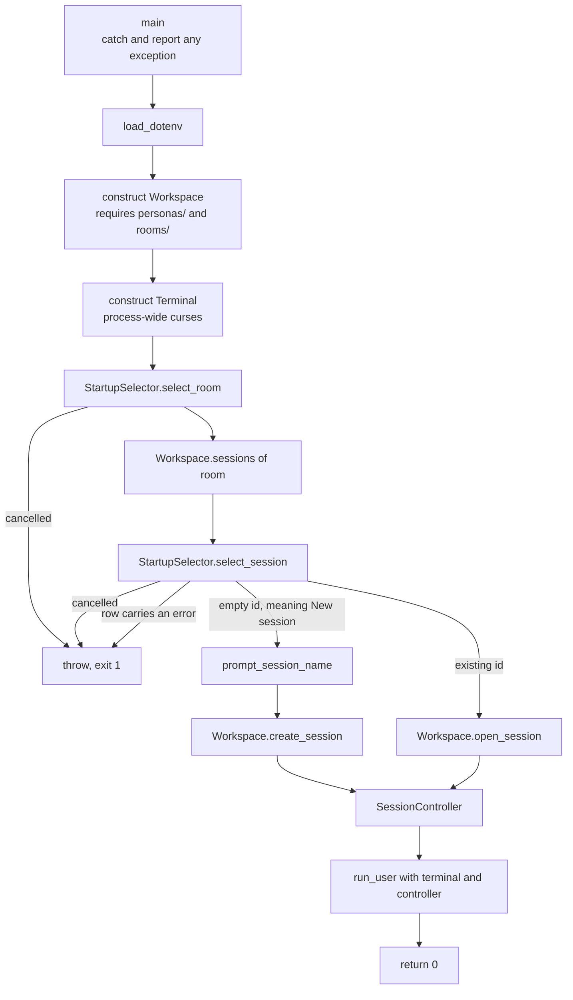

# Entry points

`apps/` holds composition roots: the files that assemble concrete components
into a runnable program, decide top-level object lifetime, and define
process-level error handling. They contain wiring and workflow — never reusable
policy.

Only files in this directory are excluded from the `cha_core` library, which is
what keeps every other layer testable and linkable without a `main()`.

## `tui_main.cpp`

The terminal application. It owns four things — the workspace, the terminal, the
selector, and the chosen controller — in that order, and hands the last one to
the chat loop.

Two properties matter more than the sequence:

- **Everything file-related goes through `Workspace`.** The entry point never
  constructs a `SessionsRepository`, never reads a persona directory, and never
  opens a database. That is what lets a second front end reuse the same startup
  without copying logic.
- **Failures are reported after the terminal is restored.** `Terminal`'s
  destructor leaves curses mode during unwinding, and `run_user()` restores it
  explicitly before rethrowing, so the message printed by `main()` reaches a
  normal screen.

Cancelling either selector is an error, not a silent exit: the process reports
why it stopped.

## Dependencies

A composition root may depend on any concrete component it needs to assemble a
program. `tui_main.cpp` currently uses `session/` for the workspace and chat
operations, `ui/terminal/` for selection, terminal ownership, and the
chat loop, and `util/` for `.env` loading.

Nothing depends on `apps/`.

## Adding an entry point

A second executable — an HTTP server, a scripted client, a benchmark — gets its
own source file here and its own `add_executable` in `CMakeLists.txt`, linking
`cha_core`. Its protocol code belongs in a matching `ui/` directory, not
in this file; this file should stay short enough to read in one sitting.
