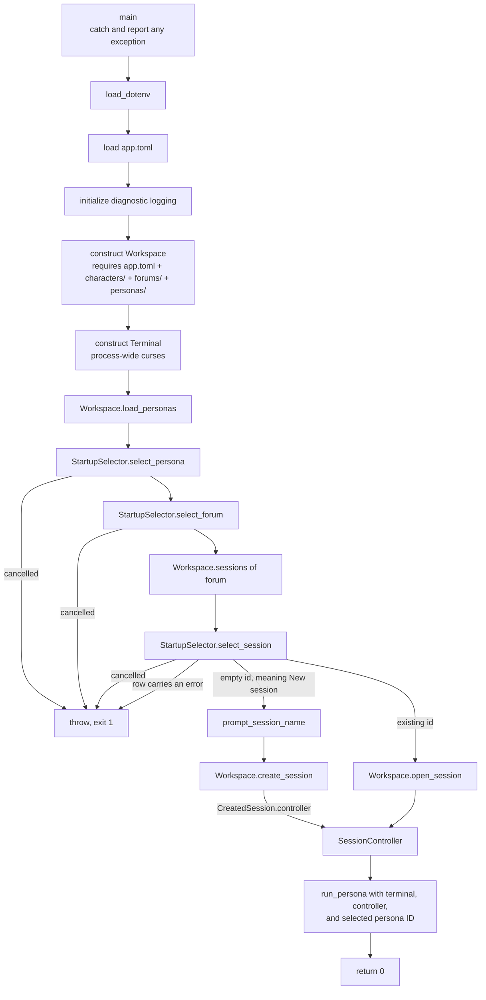

# Entry points

`apps/` holds composition roots: the files that assemble concrete components
into a runnable program, decide top-level object lifetime, and define
process-level error handling. They contain wiring and workflow — never reusable
policy.

Only files in this directory are excluded from the `cha_core` library, which is
what keeps every other layer testable and linkable without a `main()`.

## `tui_main.cpp`

The terminal application. It owns four things — the workspace, the terminal, the
selector, and the chosen controller — in that order, and hands the last one to
the chat loop.

Two properties matter more than the sequence:

- **Everything file-related goes through `Workspace`.** The entry point never
  constructs a `SessionCatalog`, never reads a character directory, and never
  opens a database. That is what lets a second front end reuse the same startup
  without copying logic.
- **Failures are reported after the terminal is restored.** `Terminal`'s
  destructor leaves curses mode during unwinding, and `run_persona()` restores it
  explicitly before rethrowing, so the message printed by `main()` reaches a
  normal screen.

Cancelling either selector is an error, not a silent exit: the process reports
why it stopped.

## `console_main.cpp`

The line-oriented application parses forum/session selection and handles
forum/session listings or `--forum ID --check` before constructing any console
or session object. A chat run requires `--persona ID`, which it resolves against
`Workspace::load_personas()`; listings and `--check` reject that flag. A forum
check loads and validates the static definitions through `Workspace`, then exits
without provider initialization.

For a chat run, the entry point constructs a `SystemConsole` whose libuv loop
handles SIGINT and stdin, opens the controller through `Workspace`, and
assembles `TranscriptEmitter` and `ConsoleSession`. It also decides
TTY-dependent behavior: the named `@DefaultAgentName> ` prompt and ready banner
appear only for interactive stdin, pipe input receives queue backpressure, and
automatic attributes are enabled independently for terminal stdout and stderr.
`Workspace::create_session()` returns the generated session ID with the
controller; the ready banner prints that resolved ID rather than a placeholder
for newly created sessions.

The libuv signal watcher is started before the controller creates its registry
runner threads. On POSIX, SIGPIPE is ignored so `ConsoleSession` can turn a
closed stdout into exit code 1 with an error on stderr.

Listings and checks return before any session or console object is constructed.
`--list-forums` takes global precedence; `--list-sessions` takes precedence over
session-selection validation but conflicts with `--check`. Usage errors return
2, runtime and validation errors return 1, and a successful listing/check,
orderly EOF, `/exit`, or idle Ctrl-C returns 0. Before a successful chat return,
the console explicitly finalizes sanitizer state and checks the last stdout
flush; destruction does not perform hidden output.

## `web_main.cpp`

`chaweb` is the one-process web composition root. It loads configuration and
logging, assembles one immutable `Workspace`, `SessionRegistry`, route set, and
HTTP listener, then bridges process signals into normal bounded shutdown. It
never constructs a `SessionController`: those live only on registry owner
threads. A shutdown signal stops new HTTP acceptance, wakes open waiters,
requests every live owner to stop, and waits for one configured grace period.
If an owner remains stuck, the process logs its identity and exits without
destructors so operating-system lease cleanup can proceed.

## Dependencies

A composition root may depend on any concrete component it needs to assemble a
program. `tui_main.cpp` uses `session/`, `ui/tui/`, and `util/`.
`console_main.cpp` uses `session/`, `ui/console/`, `ui/render/`, and `util/`.
`web_main.cpp` links `cha_web`; HTTP/SSE policy remains in `ui/web/`.

Nothing depends on `apps/`.

## Adding an entry point

A second executable — an HTTP server, a scripted client, a benchmark — gets its
own source file here and its own `add_executable` in `CMakeLists.txt`, linking
`cha_core`. Its protocol code belongs in a matching `ui/` directory, not
in this file; this file should stay short enough to read in one sitting.
