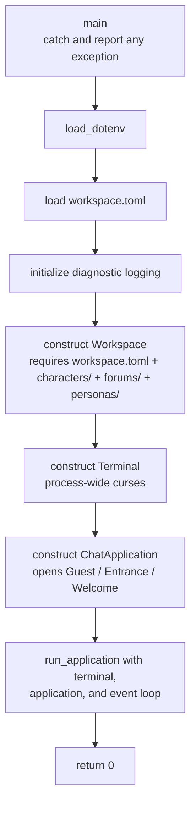

# Entry points

`apps/` holds composition roots: the files that assemble concrete components
into a runnable program, decide top-level object lifetime, and define
process-level error handling. They contain wiring and workflow — never reusable
policy.

`apps/` contains no library sources. Each executable links its own frontend
target plus the shared/core graph; `cha_core` contains no `ui/` or `apps/`
sources.

## `tui_main.cpp`

The terminal application constructs a workspace, terminal, event loop, and
`ChatApplication`, then enters chat immediately in `Guest` / `Entrance` /
`Welcome`.

Two properties matter more than the sequence:

- **Everything file-related goes through `Workspace`.** The entry point never
  constructs a `SessionCatalog`, never reads a character directory, and never
  opens a database. That is what lets a second front end reuse the same startup
  without copying logic.
- **Failures are reported after the terminal is restored.** `Terminal`'s
  destructor leaves curses mode during unwinding, and `run_application()` restores it
  explicitly before rethrowing, so the message printed by `main()` reaches a
  normal screen.

There is no startup-selection cancellation path. Workspace, temporary-storage,
and provider initialization failures are reported after terminal restoration.

## `console_main.cpp`

The line-oriented application accepts only `--color` for an interactive run or
argument-free `--check`. `--check` constructs and structurally validates the
whole workspace, including every forum, before returning without a provider or
session. An interactive run constructs `SystemConsole` and `ChatApplication`,
which opens Guest in Entrance / Welcome before stdin is read. The console owns
no entity-selection flow: persona and session navigation are shared slash
commands handled through `ChatApplication`.

TTY-dependent behavior remains in the composition root: `Entrance / Welcome
ready` and the named `@DefaultAgentName> ` prompt appear only for interactive
stdin, pipe input receives queue backpressure, and automatic attributes are
enabled independently for terminal stdout and stderr.

The libuv signal watcher is started before the controller creates its registry
runner threads. On POSIX, SIGPIPE is ignored so `ConsoleSession` can turn a
closed stdout into exit code 1 with an error on stderr.

`--check` returns before any console, built-in environment, or session object
is constructed. Usage errors return 2, runtime and validation errors return 1,
and a successful check, orderly EOF, `/exit`, or idle Ctrl-C returns 0. Before a successful chat return,
the console explicitly finalizes sanitizer state and checks the last stdout
flush; destruction does not perform hidden output.

## `web_main.cpp`

`chaweb` is the one-process web composition root. It resolves its executable
directory, reads listener and workspace settings from application `app.toml`
plus command-line overrides, then loads provider and logging settings from the
selected workspace's `workspace.toml`. It assembles one immutable `Workspace`,
`SessionRegistry`, static browser asset handler, route set, and HTTP listener,
then bridges process signals into normal bounded shutdown. It
never constructs a `SessionController`: those live only on registry owner
threads. A shutdown signal stops new HTTP acceptance, wakes open waiters,
requests every live owner to stop, and waits for one configured grace period.
If an owner remains stuck, the process logs its identity and exits without
destructors so operating-system lease cleanup can proceed.

## Dependencies

A composition root may depend on any concrete component it needs to assemble a
program. `tui_main.cpp` uses `session/`, `ui/tui/`, and `util/`.
`console_main.cpp` uses `application/`, `session/`, `ui/console/`, and `util/`.
`web_main.cpp` links `cha_web`; HTTP/SSE policy remains in `ui/web/`.

Nothing depends on `apps/`.

## Adding an entry point

A second executable — an HTTP server, a scripted client, a benchmark — gets its
own source file here and its own `add_executable` in `CMakeLists.txt`, linking
its own frontend target and any shared/core targets it needs. Its protocol code belongs in a matching `ui/` directory, not
in this file; this file should stay short enough to read in one sitting.
