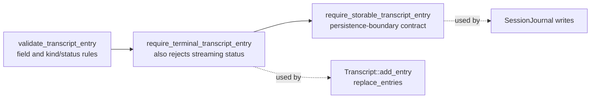
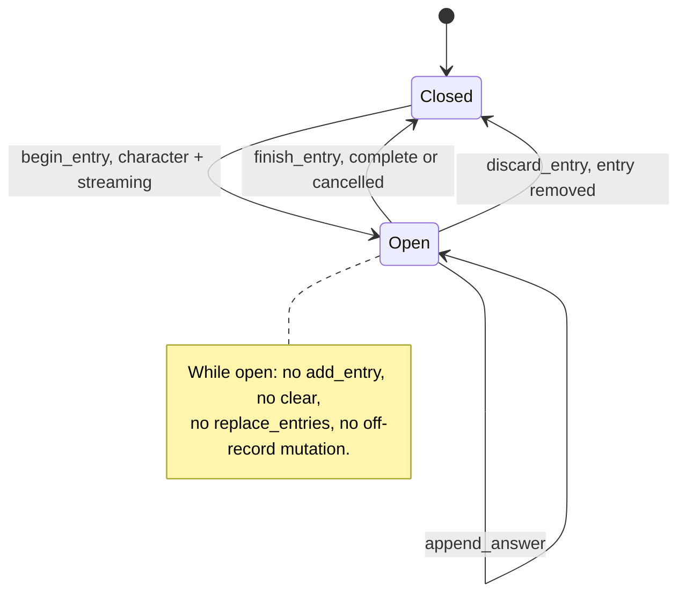
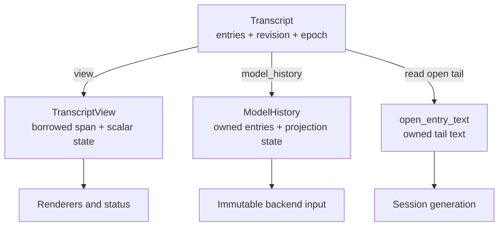

# Shared chat model

`chat/` owns the dependency-free vocabulary shared across the native system:
stable forum, character, and session IDs, discovery-safe participant metadata,
plus the presentation-neutral transcript model and its live-state mutations.
It knows nothing about how entries are stored or sent to a provider.

This is a leaf. Everything else may depend on it; it depends on nothing in the
project.

## Contents

| Source | Responsibility |
| --- | --- |
| `ids.h` | `ForumId`, `CharacterId`, and `SessionId` aliases used across workspace, generation, session, and web boundaries. |
| `character.*` | Discovery-safe `CharacterMetadata`, including the closed appearance vocabulary used by frontends. |
| `persona.h` | `Persona` and the immutable/shared roster forms used for human authorship and prompt context. |
| `transcript.h` | Entry and request IDs, `EntryKind`, `EntryStatus`, `TranscriptEntry`, `OffrecordSpan`, factories, validators, the non-owning `TranscriptView`, `ModelHistory`, and the `Transcript` container. |
| `transcript.cpp` | Factory construction, validation rules, and live-state mutation and read operations. |

## The entry model

`TranscriptEntry` is the one record every layer agrees on. It deliberately
separates four things that are easy to conflate:

| Field group | Purpose |
| --- | --- |
| `id`, `request_id` | Position in the transcript, and the turn the entry belongs to. |
| `kind`, `status` | What the entry *is* and how its content ended. |
| `participant_id`, `display_name` | Who produced it — stable identity versus the label shown. |
| `addressed_to`, `addressed_to_name` | Who a human prompt was sent to. Only human entries carry this. |
| `text` | Persona text, character answer text, or system/error text. |

Four kinds and four statuses combine only in these ways:

| Kind | Allowed status | Notes |
| --- | --- | --- |
| `human` | `complete` | Must name the character it addresses. |
| `character` | `streaming`, `complete`, `cancelled` | Never `failed` — a failed turn produces an `error` entry instead. Terminal character entries require non-empty answer `text`. |
| `notice` | `complete` | Session messages; no participant identity. Ordinary notices are labelled `"System"`; the off-record markers are the only notices with another display name. |
| `error` | `failed` | May carry the participant it concerns and the request it ends. |

Provider reasoning is not transcript content. The session layer holds it only
while a response is active and clears it when the turn ends.

Entries are built through factories — `make_human_entry`, `make_character_entry`,
`make_notice_entry`, `make_error_entry`. `make_notice_entry` and
`make_error_entry` keep their fixed `"System"` and `"Error"` display names
out of callers.
`make_human_entry` takes one `HumanEntrySpec`; designated `author` and
`addressed_to` fields preserve the human's stored identity separately from the
character they addressed without relying on positional arguments of the same type.
The author is a workspace persona ID and trusted display name resolved before
the entry reaches the chat layer; the clean `text` is stored and
rendered unchanged. The transcript performs no session-membership lookup.
Model-context projection, outside this layer,
adds `from <display name>:` only when it makes an ordinary `persona` message.
`make_hide_on_marker`, `make_hide_marker`, and `make_hide_off_marker` build the
off-record markers the same way: notices with empty text whose display names
are `"hide-on"`, `"hide"`, and `"hide-off"`.

## Validation levels

The same rules apply at three increasing strengths, so each boundary can demand
exactly what it needs:

The named storage guard keeps persistence policy explicit even though every
terminal transcript entry is currently storable.

## The live transcript

`Transcript` is the live mutable transcript state. It has a
single-thread-owned design: the registry-owned session thread exclusively reads
and mutates it. The class is not thread-safe, and callers must not share a live
instance across threads.
Generation workers never read it; the controller captures an immutable
`ModelHistory` before staging a batch.

| Operation | Rule |
| --- | --- |
| `add_entry` | Terminal entries only; refused while an entry is streaming. |
| `begin_entry` | Opens the one streaming entry; must be a character entry with `streaming` status. |
| `append_answer` | Appends answer text to the open entry only. |
| `finish_entry` | Closes it as `complete` or `cancelled`, re-checking the content rules. |
| `discard_entry` | Drops the open entry entirely — used when a turn fails mid-stream. |
| `clear` | Empties the visible history, resets the off-record span, and bumps `history_epoch`. |
| `replace_entries` | Installs a restored transcript, validating order and terminality; resets the off-record span and bumps `history_epoch`. |
| `open_offrecord` | Opens the span at the current boundary and appends `[hide-on]`. |
| `extend_offrecord` | Sets or moves the span's end to the current boundary and appends `[hide]`. |
| `restore_offrecord` | Clears both bounds and appends `[hide-off]`. |

Every presentation-changing mutation bumps `revision`, and every entry ID must
be strictly greater than the last. Renderers use `revision` to detect change
and `history_epoch` to detect that everything they had drawn is now invalid.
The marker-producing off-record mutations bump `revision` for their marker
like any other insertion, but leave `history_epoch` alone: nothing already
drawn becomes invalid.

### The off-record span

`OffrecordSpan` is a half-open range of entry IDs excluded from model context
while remaining fully visible on screen. It lives in `Transcript` because that
is the one place that owns both the bounds and the entries they describe.
`model_history()` copies both together in one operation for immutable
backend input. `TranscriptView` has no span field—renderers never need the
bounds, only the marker entries already in `entries`.

Bounds are **boundary values, not entry references**: `begin` and `end` are
numeric cuts one past the transcript tail, which stay meaningful across the
gaps entry IDs are allowed to have. `contains()` requires both bounds, so a
span with only `begin` set hides nothing.

The three marker-producing mutations each take the ID of the marker to append
and return whether the command precondition held. On success, checking the precondition, capturing
the boundary, assigning the one bound, and appending the marker all happen in
one method without external interleaving; a `false` result changes neither
bounds nor entries, so the caller can allocate the entry ID only once the
command has actually applied. The boundary is captured *before* the marker is
appended, which is why `[hide-on]` falls inside the span it opens and `[hide]`
falls outside the span it closes. Both are notices, and notices never reach
model context in any case.

Neither the bounds nor the markers are persisted, and `clear()` and
`replace_entries()` reset the bounds so no caller has to remember to.

### Streaming entry lifecycle

### Reading transcript state

Use a **view** for synchronous presentation and a **model history** for
model-context projection. A `TranscriptView` is call-scoped: it borrows the
entry vector through `std::span`, and any transcript mutation may invalidate
the span, its entries, and their strings. Renderers therefore consume it before
returning and retain only scalar positions such as an entry ID, entry count, or
text length. `ModelHistory` is the sole owning point-in-time copy because
workers genuinely need immutable state after the session owner thread
continues.

The only narrow read outside those two projections is `open_entry_text()`. It
returns an owned copy of the active character entry's text so session teardown
can persist a terminal result without exposing transcript internals.

## Dependencies

- **Depends on:** nothing in the project.
- **Depended on by:** `agents/` (projection and request preparation),
  `session/` (coordination and persistence), `web/` (rendering).

Persistence and presentation choices stay outside this directory. The model may
expose what those consumers need, but it must never import SQLite, provider
protocol, or terminal concepts.

## Tests

`tests/chat/unit_transcript.cpp` covers the factories, every
validation rule, the streaming lifecycle, ID ordering, the off-record bound
states and their markers, immutable model-history capture, and
view borrowing and open-entry reads.

The same file also tests `SessionJournal` and the session database, on
purpose: the SQL `CHECK` constraints are a second encoding of the rules above,
and the tests assert both encodings agree.
