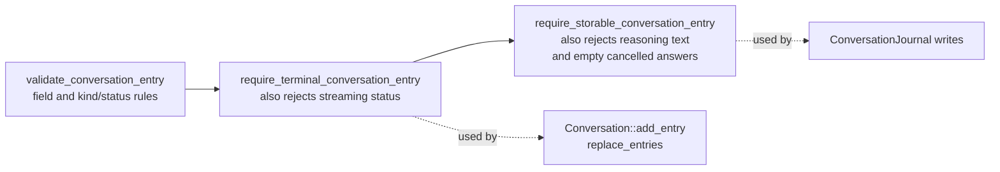
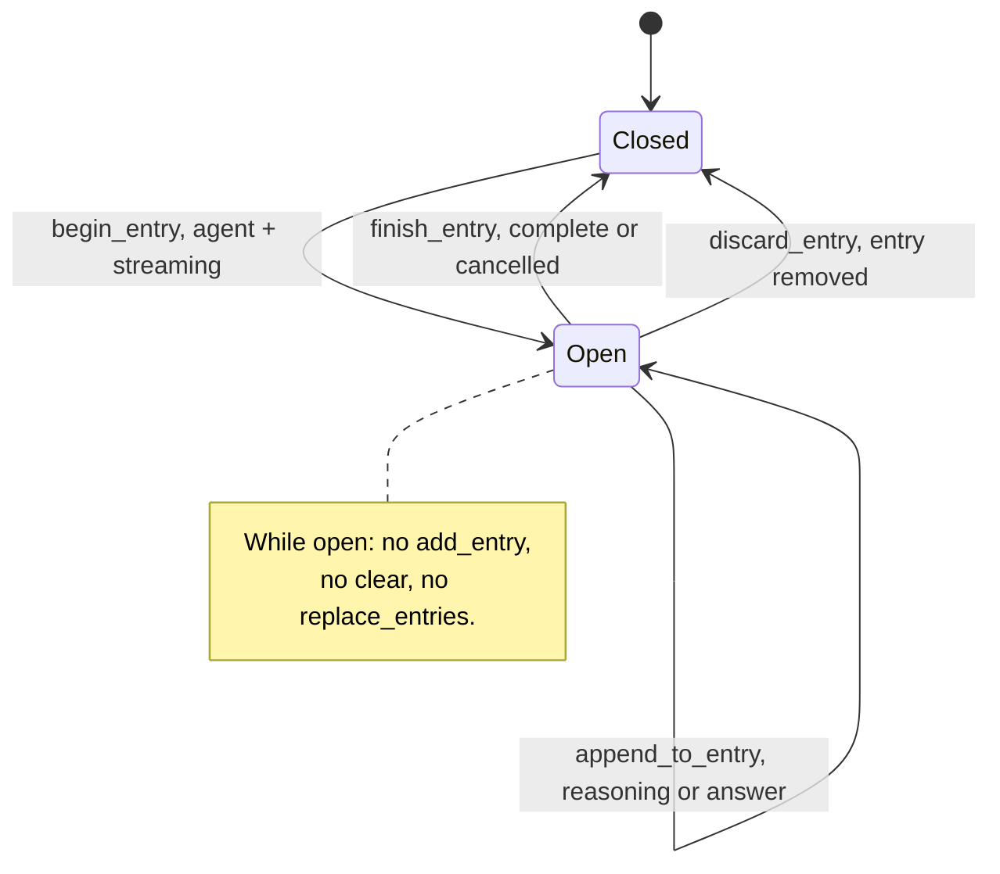
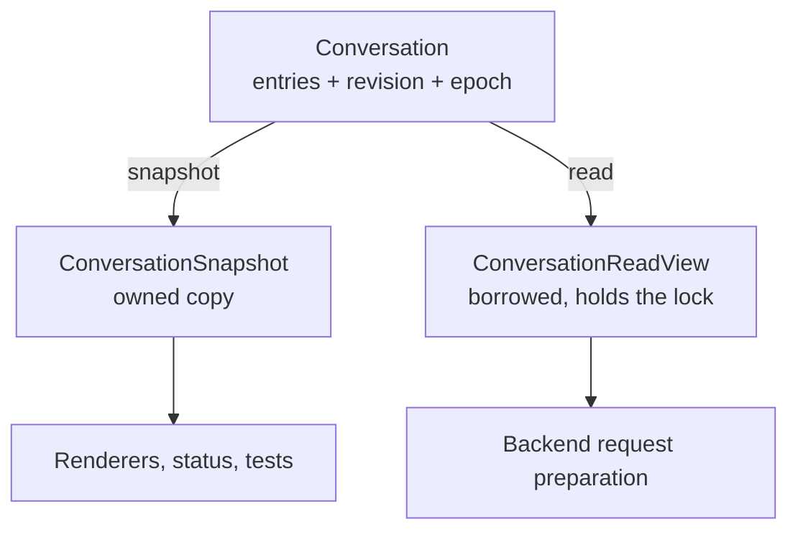

# Conversation model

`conversation/` owns the presentation-neutral transcript model: what a
conversation entry means, and how live transcript state changes. It is the
vocabulary the rest of the system shares, and it knows nothing about how entries
are rendered, stored, or sent to a provider.

This is a leaf. Everything else may depend on it; it depends on nothing in the
project.

## Contents

| Source | Responsibility |
| --- | --- |
| `conversation.h` | IDs, entry kinds and status, `CompletionDelta`, `ConversationEntry`, factories, validators, `ConversationSnapshot`, `ConversationReadView`, and the `Conversation` container. |
| `conversation.cpp` | Factory construction, the validation rules, and the synchronized mutation and read operations. |

## The entry model

`ConversationEntry` is the one record every layer agrees on. It deliberately
separates four things that are easy to conflate:

| Field group | Purpose |
| --- | --- |
| `id`, `request_id` | Position in the transcript, and the turn the entry belongs to. |
| `kind`, `status` | What the entry *is* and how its content ended. |
| `participant_id`, `display_name` | Who produced it — stable identity versus the label shown. |
| `addressed_to`, `addressed_to_name` | Who a human prompt was sent to. Only human entries carry this. |
| `reasoning_text`, `text` | Ephemeral reasoning versus durable answer content. |

Four kinds and four statuses combine only in these ways:

| Kind | Allowed status | Notes |
| --- | --- | --- |
| `human` | `complete` | Must name the agent it addresses. |
| `agent` | `streaming`, `complete`, `cancelled` | Never `failed` — a failed turn produces an `error` entry instead. `complete` requires non-empty `text`; `cancelled` requires reasoning or answer text. |
| `notice` | `complete` | Session messages; no participant identity. |
| `error` | `failed` | May carry the participant it concerns and the request it ends. |

Only agent entries may carry `reasoning_text`.

Entries are built through factories — `make_human_entry`, `make_agent_entry`,
`make_notice_entry`, `make_error_entry` — so the fixed fields of each kind
(`participant_id` `"human"`, display names `"You"`, `"System"`, `"Error"`) are
never spelled out by callers.

## Validation levels

The same rules apply at three increasing strengths, so each boundary can demand
exactly what it needs:

The third level is why reopening a session never shows reasoning: it cannot
reach the database in the first place.

## The live transcript

`Conversation` is the only mutable conversation state shared between threads.
It has a single-writer design: the main thread mutates, any thread may read
under the lock.

| Operation | Rule |
| --- | --- |
| `add_entry` | Terminal entries only; refused while an entry is streaming. |
| `begin_entry` | Opens the one streaming entry; must be an agent entry with `streaming` status. |
| `append_to_entry` | Appends reasoning or answer text to the open entry only. |
| `finish_entry` | Closes it as `complete` or `cancelled`, re-checking the content rules. |
| `discard_entry` | Drops the open entry entirely — used when a turn fails mid-stream. |
| `clear` | Empties the visible history and bumps `history_epoch`. |
| `replace_entries` | Installs a restored transcript, validating order and terminality; bumps `history_epoch`. |

Every mutation bumps `revision`, and every entry ID must be strictly greater
than the last. Renderers use `revision` to detect change and `history_epoch` to
detect that everything they had drawn is now invalid.

### Streaming entry lifecycle

### Two ways to read

Use a **snapshot** when the reader will hold the data across work of its own —
that is what the terminal renderer does. Use a **read view** when the reader
needs the entries without copying them and can finish quickly: the agent thread
takes one to project the model context, then releases it before any network I/O.
A read view holds the conversation mutex for its whole lifetime, so blocking
inside one blocks the writer.

## Dependencies

- **Depends on:** nothing in the project.
- **Depended on by:** `agents/` (projection and request preparation),
  `session/` (coordination and persistence), `ui/` (rendering).

Persistence and presentation choices stay outside this directory. The model may
expose what those consumers need, but it must never import SQLite, provider
protocol, or terminal concepts.

## Tests

`tests/conversation/unit_conversation.cpp` covers the factories, every
validation rule, the streaming lifecycle, ID ordering, and snapshot/read-view
consistency — including that a read view really does block the writer.

The same file also tests `ConversationJournal` and the session database, on
purpose: the SQL `CHECK` constraints are a second encoding of the rules above,
and the tests assert both encodings agree.
