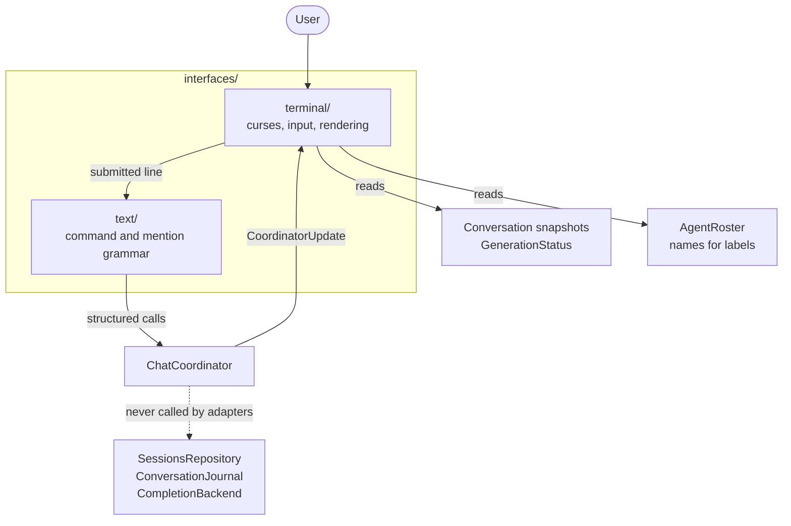

# Interfaces

`interfaces/` holds the adapters between an external interaction protocol and
the structured application API. An adapter may interpret input, keep
transport-specific state, and render application values — but chat policy, agent
execution, and persistence stay in `application/` and below.

The test for whether code belongs here: could a different front end need the
same behavior? If yes, it belongs below `interfaces/`.

## Current adapters

| Directory | Responsibility |
| --- | --- |
| `text/` | The reusable textual protocol: slash commands and `@mention` addressing, dispatched to `ChatCoordinator`. |
| `terminal/` | The ncurses front end: terminal lifecycle, startup selection, input editing, transcript rendering, event loop. |

`text/` is separate from `terminal/` because the command language is not a
terminal concept. Any input box — a TUI, a web form, a chat bridge — can reuse
it, while an API with structured routes can skip it entirely.

## Where an adapter sits

The dashed edge is the rule: an adapter never opens a session repository, reads
workspace layout files, or calls a completion backend. If an adapter needs
something it cannot express through `ChatCoordinator` or `Workspace`, the fix is
a new operation there — not a shortcut here.

## Dependency contract

An interface may depend on:

- `application/` for use cases, coordinator commands, generation status, and
  interface-safe summaries such as `SessionSummary`;
- `conversation/` for presentation-ready transcript values;
- a lower-level adapter, as `terminal/` uses `text/`;
- narrowly scoped `util/` helpers where protocol parsing needs them;
- roster values from `agents/` when a presentation needs agent names — for
  example deciding whether to label who a message was addressed to.

It may not depend on `apps/`, on another sibling adapter's widgets, or on
anything the two lists above exclude.

## Adding another interface

A future `http/` adapter would translate routes, authentication, request bodies,
and response framing around the same application operations:

| Concern | Where it goes |
| --- | --- |
| Route table, auth, JSON DTOs | The new adapter. |
| Streaming response framing, e.g. SSE to browsers | The new adapter, fed by `ChatCoordinator::receive()`. |
| Session listing and opening | `Workspace`, unchanged. |
| Turn semantics, persistence, cancellation | `ChatCoordinator`, unchanged. |
| Command grammar | Reuse `text/`, or skip it if routes already say what to do. |
| Process wiring and lifetime | A new file in `apps/`. |

`ConversationEntry` and `GenerationStatus` may be serialized directly when their
shape already suits the transport. Session-persistence and agent-runtime types
must not become transport contracts — they are internal, and freezing them into
a public API would pin down layers that need to stay free to change.

## Documents

- [`text/README.md`](text/README.md) — the grammar and dispatch rules.
- [`terminal/README.md`](terminal/README.md) — the terminal front end.
