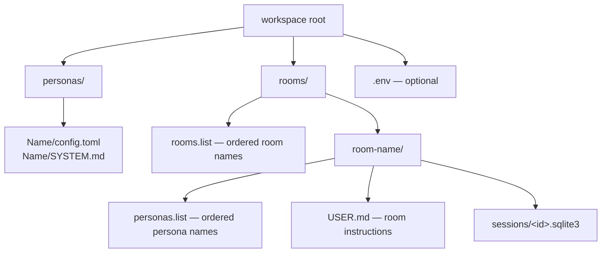
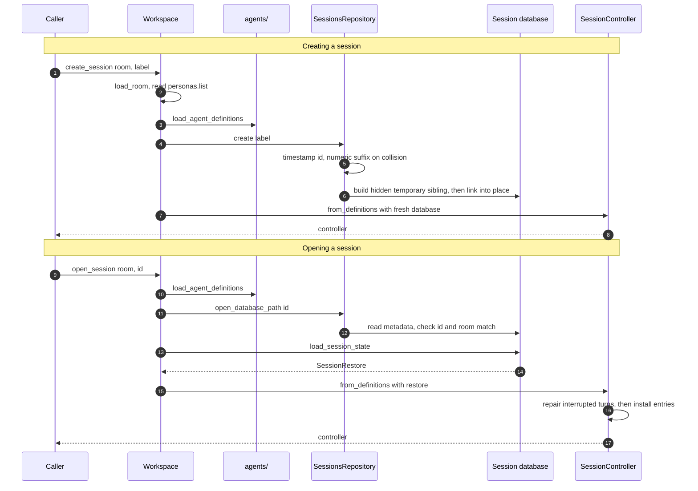
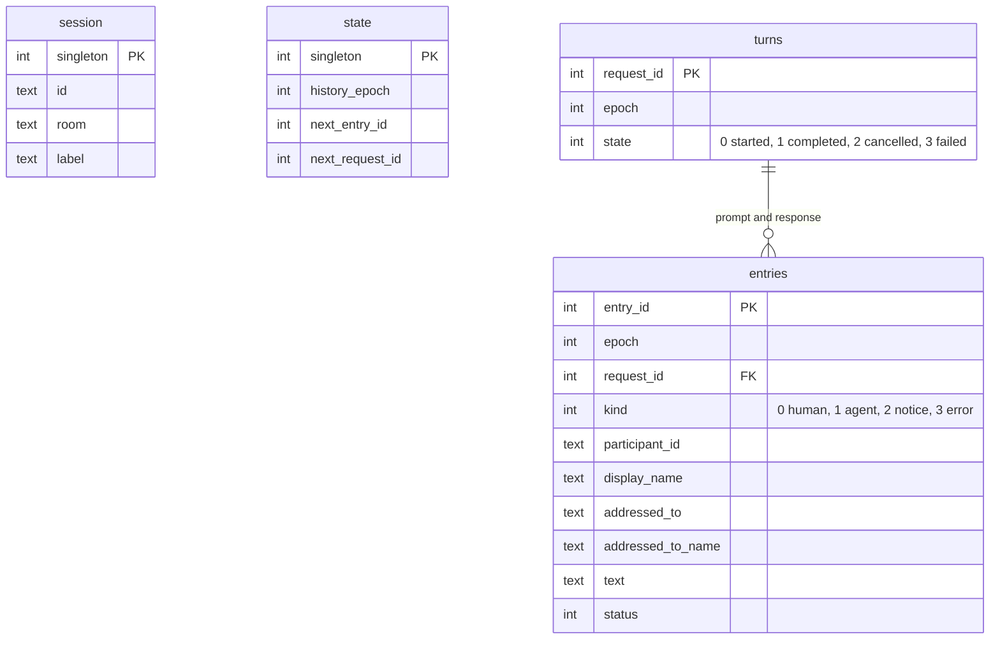
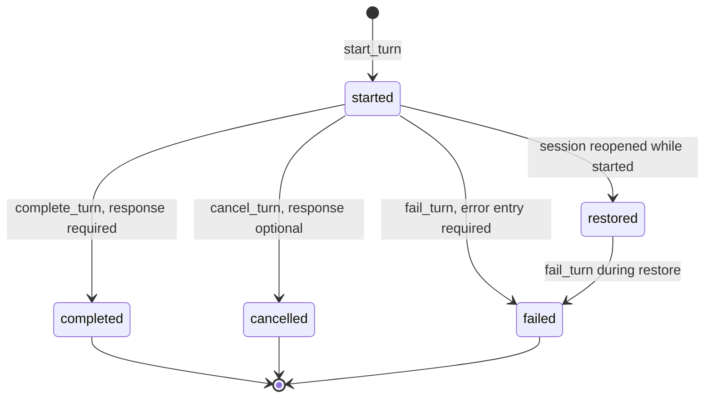

# Session layer

`session/` owns the reusable operations: it finds the workspace, manages session
files, persists the transcript, and coordinates one live chat. Every operation
it exposes is a typed C++ call — no command syntax, no widgets, no HTTP — so the
terminal front end, a future HTTP front end, and the tests all drive the same
code.

## Contents

| Source | Responsibility |
| --- | --- |
| `workspace.*` | Resolve the workspace layout, list rooms and sessions, load a room's agent definitions, and build a `SessionController`. |
| `sessions_repository.*` | List, create, and safely resolve the SQLite session files of one room. |
| `session_database.*` | Create and validate a session database, restore a transcript, and journal turn transitions through `SessionJournal`. |
| `session_controller.*` | Own one live session: commands, agent events, default agent, notices, and shutdown. |
| `response_controller.*` | Own the single in-flight turn: start it, apply agent events, keep transcript and journal in step. |
| `generation_status.h` | `GenerationStatus`, `ResponsePhase`, and the shared generation-in-progress notice. |

## Workspace layout

`Workspace` refuses to construct unless `personas/` and `rooms/` both exist.
List files ignore blank lines and `#` comments, must name at least one entry,
and every name is checked with `require_path_component()` before it becomes a
path — so a workspace file can never reach outside its directory. A room's
persona list additionally rejects duplicates.

## Session operations

Creation publishes with `link(2)`, which fails rather than overwriting, so a
half-written database is never visible under a real session name and a collision
simply retries with the next numeric suffix. Listing is tolerant: a file that
fails validation still appears, with its error attached, so the selector can
show it instead of hiding a broken session.

## Persistence

One session is one self-contained SQLite file. Its `application_id` and
`user_version` are checked before anything else is read.

What the schema enforces on its own, independently of the C++ code:

- `session` and `state` are single-row tables, guarded by a `CHECK` on the
  primary key.
- A partial unique index on `turns` allows **one** `started` turn at a time.
- A partial unique index on `entries` allows **one** prompt per turn.
- `CHECK` constraints restate the entry model: participant identity where it is
  required, addressing only on human entries, `failed` status only for error
  entries, `complete` status only for human and notice entries, non-empty text
  for completed agent entries, and `streaming` status excluded entirely.
- `entries.request_id` references `turns.request_id`, with foreign keys on.

### Epochs

`/clear` does not delete anything. It increments `state.history_epoch`, and
restore only reads entries of the current epoch. Older rows stay in the file.

### Transactions

Each of `start_turn`, `complete_turn`, `cancel_turn`, `fail_turn`, `append`, and
`clear` is one transaction. `start_turn` writes the turn row, the prompt entry,
and the advanced `next_request_id` together; a terminal call writes the state
change and the response or error entry together. So the durable turn state and
the entry that explains it can never disagree.

### Turn states and recovery

A turn still in `started` when a session is opened is reported as an
`InterruptedTurn`. `ResponseController::restore()` must finish every one of them
through `fail_turn()` before any other journal write; only then does the
transcript become live. That is why `SessionRestore` documents the
requirement as part of its contract.

### What is never stored

Streaming status never reaches SQL: `require_storable_transcript_entry()` and
the schema constraints reject it. Reasoning is even further outside
persistence—it lives only in the active response and never enters a
`TranscriptEntry`. A cancelled agent response is stored only if it has answer
text.

## Session control

`SessionController` is the whole session behind one object. It has two halves:
read-only state, and commands that return `SessionUpdate` side effects.

| Command | Behavior | Update |
| --- | --- | --- |
| `submit_prompt(text, handle)` | Resolves the handle, or falls back to the default agent, and starts a turn. | On success `clear_input` + `render_needed`; on an unknown or ambiguous handle, or an empty prompt, only a notice — the draft text is left in the editor. |
| `clear_transcript()` | Bumps the durable epoch, then clears the live transcript. | `render_needed`, `clear_input`, notice. |
| `session_information()` | Entry count plus the roster. | `render_needed`, `clear_input`, notice. |
| `agent_information()` | The roster, marking the default. | `render_needed`, `clear_input`, notice. |
| `set_default_agent(handle)` | Changes the default for this run only. | `clear_input`, notice. |
| `request_stop()` | Cancels the active turn, or says there is none. | Notice. |
| `receive()` | Drains the event channel, applying each event through `handle_agent_event()`. | Merged updates; `end_session` when the channel is closed. |
| `shutdown()` | Stops the registry and drains what remains. | — |

Every command except `request_stop()` and `receive()` is refused while a turn is
active, with the shared in-progress notice. The controller formats session
notices itself — handle errors, roster text, `/info` — because their wording
belongs to the session, not to a UI.

The controller does **not** parse `/commands`, mentions, HTTP routes, or JSON.
Front ends translate those into these calls.

## The in-flight turn

`ResponseController` holds the mechanics of one turn so `SessionController` can
stay declarative.

Starting a turn, in order: allocate a request ID and entry ID, build the human
entry, `start_turn()` it to disk, add it to the transcript, reserve the
response entry ID, then submit. If the transcript refuses the prompt, the turn
is failed on disk before the exception propagates. If the registry refuses the
request, the turn is failed immediately and the caller is told it could not be
dispatched.

Applying events:

| Event | Effect |
| --- | --- |
| Reasoning `AgentDelta` | Appends to ephemeral active-response state; the first sets phase to `reasoning`. |
| Answer `AgentDelta`, first one | Opens the streaming transcript entry, appends the answer, and sets phase to `answering`. |
| Answer `AgentDelta`, later | Appends answer text to the open transcript entry. |
| `AgentCompleted` while answering | `complete_turn()`, then finish the entry as `complete`. |
| `AgentCompleted` before any answer | Treated as failure: "completed without answer content". |
| `AgentCancelled` while answering | `cancel_turn()` with the partial answer, entry finished as `cancelled`. |
| `AgentCancelled` earlier | `cancel_turn()` with no response; ephemeral reasoning is cleared. |
| `AgentFailed` | `fail_turn()` with an error entry, the open streaming entry is discarded, the error is added to the transcript. |

Events whose request ID does not match the active turn are ignored, which is
what makes a cancelled turn's late fragments harmless.

## Failure policy

Persistence failures are not recoverable at this level. Every journal call is
wrapped with the operation it was attempting — "Failed to persist completion of
request 7 for @Name" — and rethrown. The session ends rather than continuing
with a transcript the database does not agree with. Provider failures, by
contrast, are ordinary events: they become error entries and notices, and the
session continues.

## Dependencies

- **Depends on:** `transcript/` for transcript values, `agents/` for
  definitions, rosters, execution, and events, `util/` for path and text
  helpers, and SQLite for storage.
- **Must not depend on:** `ui/` or `apps/`.

## Tests

| Test | Covers |
| --- | --- |
| `tests/session/unit_workspace.cpp` | Layout resolution, list-file rules, room loading, session create/open. |
| `tests/session/unit_sessions_repository.cpp` | Listing, identity validation, collision handling, publish semantics. |
| `tests/session/unit_session_controller.cpp` | Command behavior, event application, persistence ordering, restore and repair. |
| `tests/transcript/unit_transcript.cpp` | `SessionJournal` and the session database, checked against the in-memory model they mirror: turn transitions, rollback, constraint violations, interrupted-turn recovery, and version rejection. |

Those database tests link `cha_sqlite3` directly, so they can assert on the
stored schema and rows rather than only on what the C++ API reports.
