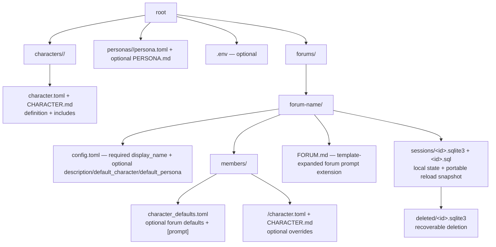
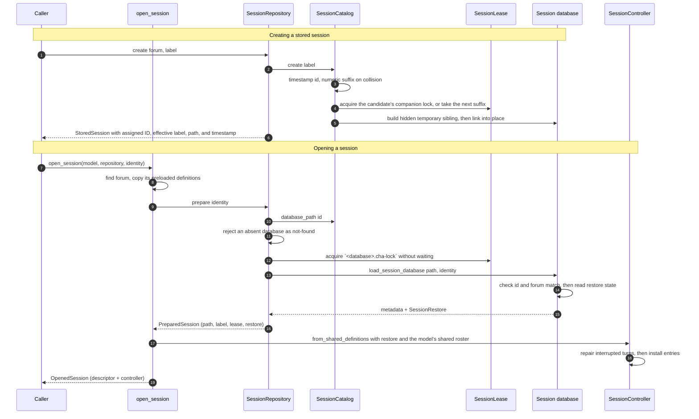
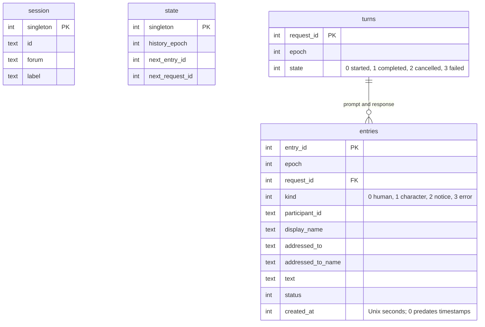
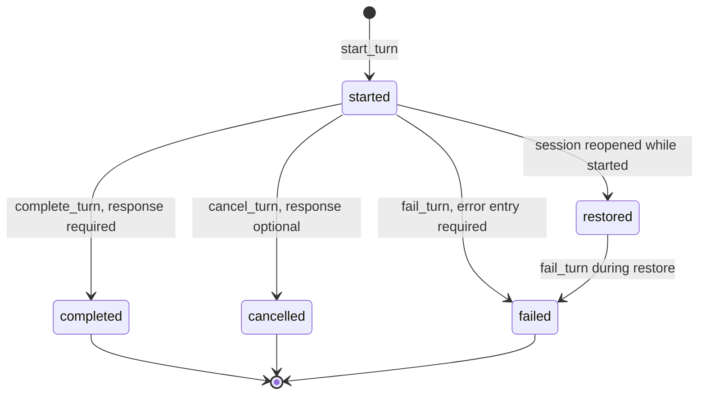

# Session layer

`session/` owns the reusable operations: it finds the workspace, manages session
files, persists the transcript, and coordinates one live chat. Every operation
it exposes is a typed C++ call — no command syntax, no widgets, no HTTP — so the
web frontend and tests drive the same code.

## Contents

| Source | Responsibility |
| --- | --- |
| `session_repository.*` | Own every session-storage operation: list, strictly validate, create, rename, recoverably delete, and prepare the persistent per-forum databases, plus the one process-local temporary session it creates and removes. |
| `session_catalog.*` | List, create, and safely resolve active and deleted SQLite session paths for one forum. |
| `session_label.*` | Enforce the shared single-line, trimmed, 200-code-point session-label policy. |
| `session_archive.*` | Move one session file into `deleted/` without ever replacing what is already there, including the hard-link fallback for mounts that reject a no-replace rename. |
| `stored_session.h` | `StoredSession`: one unleased observation of a stored database — identity, label, path, timestamp, and validation error. |
| `session_lease.*` | Acquire and own the cross-process companion-file lock for one live session. |
| `session_database.*` | Create and validate a session database, restore a transcript, and journal turn transitions through `SessionJournal`, including the turn-less `record_entry` used for null-target monologues. |
| `forum_characters.*` | The ordered character identities in a forum, including validation, lookup, handle resolution, and the wording of every session notice built from them. |
| `session_identity.h` / `opened_session.h` | Stable `SessionIdentity`, presentation-safe `SessionDescriptor`, and the owner-thread-only `OpenedSession` result. |
| `controller_update.h/.cpp` | The transport-neutral outcome of one controller operation: the `ControllerStateUpdate` variant, its text targets and owning append, `ControllerUpdate`, the bounded event-drain result, and the one merge rule. |
| `controller_view.h` | The borrowed, owner-thread-only read model used to build a full frontend snapshot. |
| `session_controller.*` | Own one live session: commands, the one in-flight `GenerationBatch`, generation events, default character, notices, and shutdown. |
| `generation_status.h` | `GenerationStatus`, `ResponsePhase`, and the shared generation-in-progress notice. |

## Workspace layout

`WorkspaceDefinition` refuses to load unless `forums/`, `characters/`, and a valid
`personas/` directory exist. The directory may contain no custom personas; the
model adds the built-in Guest to the effective browser roster.
Each forum may set `default_persona` in `config.toml`; it must name a workspace
persona and defaults to Guest. A session in that forum starts as that persona;
`/!Name` selects another and saves it back to the same key. A forum
`config.toml` carries no keys beyond the ones above, so a
misspelled optional key is a load error rather than a silent default.
The `forums/` directory may be temporarily empty; its valid forum names are
sorted before presentation. Forum IDs and session database stems may contain
only RFC 3986 unreserved ASCII characters, excluding the complete names `.` and
`..`; invalid entries are ignored during discovery and rejected on direct use.
Each forum's `members/` directory must contain at least one member subdirectory,
also sorted before loading. Member and definition directory names are character
IDs and are validated with `validate_character_id()`.
Each forum's `config.toml` must provide a non-empty string `display_name` and
may provide an optional single-line `description` for application inventory.
persona-facing selection and listings; its directory name remains the stable ID.
Each definition directory likewise supplies its stable ID, while its
`character.toml` provides the required persona-facing `display_name`. The loader
rejects the removed character-level `id` and `name` fields. `display_name` and
optional tags are definition-only: they are errors in forum defaults and member
overrides. Tags are trimmed, non-empty, control-free, and unique under ASCII
case folding; they are metadata only and never determine membership. Definitions
with no member directory in any forum are valid.

Model loading validates the whole directory graph before it serves a forum:
every member resolves to one definition, each configured `default_character` names a
member, and character/persona IDs and case-folded display names do not collide.
It also resolves every configured forum's prompts and definitions, so an invalid
unused forum fails startup rather than one later open. An invalid workspace
fails as a whole. `default_character` leaves member
and character-definition ordering unchanged; when it is absent, the first
lexicographic member ID is used.
The legacy `default_agent` key remains accepted for compatibility, but a forum
must not define both spellings.

Template containment follows the file's layer: a definition `CHARACTER.md` is
contained to workspace `characters/`; a member `CHARACTER.md` and `FORUM.md`
are contained to their forum directory.

`WorkspaceDefinition` supplies validated metadata and forum definitions.
Each controller receives the workspace persona roster and starts on its forum's
configured persona, resolving submitted stable author IDs against that roster so
an unknown author is refused rather than attributed. The roster also contributes
static model context, but it is not forum or session membership. The generation layer applies the shared provider
layer, definition, forum-default, and member override policy,
deriving the definition containment root from the definition directory's parent
and otherwise receiving resolved workspace paths explicitly.

`SessionRepository::validate()` reads one selected stored session's identity,
label, and metadata directly, without scanning the other session databases or
acquiring its lease. It distinguishes an absent session from invalid or
unreadable storage so front ends can map only absence to not-found. Web lobby
routes skip this disk validation when their separate live-session registry can
reattach directly, and otherwise use it before asking the registry to open a
session.

The repository receives plain forum IDs and `sessions/` paths, never a
`WorkspaceDefinition`, so the session layer never depends on application types. It
keeps only that immutable map plus the temporary session it owns, and builds a
short-lived `SessionCatalog` per operation, so one constructed repository serves
concurrent const calls; the only exclusion is `SessionLease`.

Listing, inspection, and creation all return `StoredSession`: the identity,
label, path, modification time, and validation error observed at that moment.
It is a reading, not a cache and not a handle — it holds no lease, and the file
it describes may be leased, rewritten, or removed immediately afterwards. Only
`PreparedSession`, which owns the lease, proves anything about the session it
names, which is why the two types stay separate and why a `StoredSession` is
never handed to a live controller as evidence.

## Forum characters

`ForumCharacters` is the identity-only view of the characters participating in one
forum. It is ordered, non-empty, and rejects duplicate IDs and
ASCII-case-insensitive names. The workspace passes the validated initial default
character ID separately: it is `config.toml`'s `default_character` when supplied,
otherwise the first lexicographic member ID. It never reorders this view.

`resolve_handle()` tries an exact case-insensitive name, retries after removing
trailing `,.;:!?`, then accepts an exact case-insensitive character ID, and
finally a unique case-insensitive prefix. It returns resolved, unknown, or
ambiguous. Exact matches come first, so an exact display name beats an ID and an
exact ID beats a loose match on another character's name. IDs are accepted
because a display name may be spelled differently from the ID or written in a
non-ASCII script, leaving that character otherwise unaddressable.

`forum_characters.*` also owns the wording of the notices built from those
results, so all of it sits in one place: handle errors, duplicate multicast
targets, the `/characters` character listing, and the `/info` line. Model, API, and
streaming details are not `ForumCharacters` state — `GenerationExecutor` exposes
those separately as `ModelBackendInfo`, which the formatters take as a
parameter, and `SessionController` supplies to them only for `/characters` and
`/info`. The `/info` formatter takes an entry count rather than a `Transcript`
for the same reason.

## Session operations

`SessionRepository::create()` is the creation primitive; it delegates
publication to `SessionCatalog`. Forum definitions were already validated when
`WorkspaceDefinition` loaded, so creation performs no prompt or provider work.

There is no directory-wide creation lock. Uniqueness comes from two mechanisms
only: each candidate stem is claimed with a `SessionLease` before the expensive
initialization, and publication uses `link(2)`, which fails rather than
overwriting. So a half-written database is never visible under a real session
name, and either kind of collision simply retries with the next numeric suffix.
Concurrent creators in one forum therefore never wait on each other and never
report a busy failure of their own; which of them receives the unsuffixed ID is
unspecified, and tests must not assume it. Labels need not be unique — the
generated ID, not the label, is what identifies a session. The existence check
before each candidate is a fast path only; `create_session_database()` remains
the authority that decides whether the destination was free.

The operation returns a `StoredSession`: it neither retains a session lease nor
constructs a controller or provider. Web callers create and open in separate
operations, so an open failure leaves the successfully stored session available
for a later ordinary open.

Listing is tolerant: a file that fails validation still appears, with its error
attached, so the selector can show it instead of hiding a broken session. It
records the path and modification time of the entry it inspected, so no caller
rebuilds them afterwards. A sessions directory that cannot be read, or a
timestamp that cannot be taken, fails the whole listing rather than becoming one
row's error. Anything that is not a `.sqlite3` file with a URL-safe stem —
companion locks, hidden temporary siblings, a `catalog.cha-lock` left by an
older release — is simply not a catalog entry.

Workspace reload also treats `<id>.sql` beside each active database as its
portable snapshot. Every active `<id>.sqlite3` is dumped over `<id>.sql`; when
only the SQL file exists, reload builds and validates a temporary database
before publishing `<id>.sqlite3`. If `deleted/<id>.sqlite3` exists, the SQL file
is not imported, so recoverable local deletion remains authoritative. Both
directions use temporary siblings, leaving the previous SQL or no active
database at all when an operation fails. SQL snapshots are intentionally not
catalog entries and are tracked by Git; `.sqlite3` remains machine-local.

Session paths are resolved only by `SessionCatalog`. Its `database_path()`
requires the session ID to be one safe path component before appending
`.sqlite3` beneath the forum's `sessions/` directory, so an absolute path, `..`,
or an ID containing a directory separator cannot escape that directory.

Every live controller holds a `SessionLease` on `<database>.cha-lock`. The
companion file may remain after a run; only its non-blocking exclusive operating
system lock means the session is active. `SessionRepository::prepare()` settles
absence first — so asking for a session that was never stored leaves no
companion file behind — then acquires the lease, and only then performs the one
authoritative read: `load_session_database()` checks the embedded ID and forum
and builds `SessionRestore` through a single read-only connection. Nothing
observed before the lease is reused as proof, which is why a database that is
already leased reports `SessionBusyError` even when it would also have proved
invalid; the route-level preflight `validate()` is what still separates missing
from corrupt for callers. `open_session()` moves the lease into
`SessionController`.
The controller keeps it through explicit shutdown and journal destruction, so
`chaweb` fails immediately with `SessionBusyError` when another process owns
that stored session. Test-only controller factories
use an explicitly inactive lease instead of locking fixture databases.
On Windows, the companion handle intentionally omits `FILE_SHARE_DELETE`, so
the lock file cannot be deleted or renamed while its controller is alive.

## Persistence

One session is one self-contained SQLite file. Its `application_id` and
`user_version` are checked before anything else is read. Read-only paths —
catalog listing, inspect, and route-level validation — accept the current
version and the immediately previous one; `SessionRepository::prepare()`
migrates a previous-version database behind the session lease before the
restore read, so that read always sees the current schema. The version-3
migration adds `entries.created_at`, the Unix-seconds wall-clock creation
time of each entry; rows stored before it honestly read `0`, which front
ends render as no timestamp at all. Every entry creation time is stamped by
the `chat/` factories, and a character response carries the stamp its live
streaming entry opened with, because the journal record is built separately
from it at completion or cancellation.

Opening a database initializes the SQLite library once, under `std::call_once`,
before the first connection is created. SQLite performs that setup lazily on
first use and writes its configuration globals and the unix VFS's process-id
record without full synchronization, so concurrent first opens from several
session owner threads would otherwise race on them.

What the schema enforces on its own, independently of the C++ code:

- `session` and `state` are single-row tables, guarded by a `CHECK` on the
  primary key.
- A partial unique index on `turns` allows **one** `started` turn at a time.
- A partial unique index on `entries` allows **one** prompt per turn.
- `CHECK` constraints restate the entry model: participant identity where it is
  required, addressing only on human entries, `failed` status only for error
  entries, `complete` status only for human and notice entries, non-empty text
  for completed character entries, and `streaming` status excluded entirely.
- `entries.request_id` references `turns.request_id`, with foreign keys on.

### Epochs

`/clear` does not delete anything. It increments `state.history_epoch`, and
restore only reads entries of the current epoch. Older rows stay in the file.

### Transactions

Each of `start_turn`, `complete_turn`, `cancel_turn`, `fail_turn`, and `clear`
is one transaction. `start_turn` writes the turn row, the prompt entry, and the
advanced `next_request_id` together; a terminal call writes the state change
and the response or error entry together. So the durable turn state and the
entry that explains it can never disagree.

### Turn states and recovery

A turn still in `started` when a session is opened is reported as an
`InterruptedTurn`. `SessionController::initialize()` must finish every one of
them through `fail_turn()` before any other journal write; only then does the
transcript become live. That is why `SessionRestore` documents the requirement
as part of its contract.

### What is never stored

Streaming status never reaches SQL: `require_storable_transcript_entry()` and
the schema constraints reject it. Reasoning is even further outside
persistence—it lives only in the active response and never enters a
`TranscriptEntry`. A cancelled character response is stored only if it has answer
text. The off-record span and its marker entries are also run-time only:
reopening a session presents the complete durable conversation with no span and
no markers.

### Reviewed multicast durability tradeoff

Concurrent multicast deliberately has a narrower durability boundary than its
execution boundary. The database continues to permit one `started` turn: the
initial foreground child is journaled before the shared gate opens, while later
children may already be running or finished in memory before they become
foreground and receive their own durable turn records.

Consequently, a process crash can discard background child turn records,
addressed prompts, output, and completed answers that have not yet become
foreground. Recovery reports only the durably started foreground turn as
interrupted. This is a reviewed and accepted tradeoff. Multicast concurrency
and ordered transcript commits are requirements, but crash recovery of
background work is not.

The design therefore does not add a durable batch manifest, background-result
spooling, or out-of-order turn persistence solely to recover that work. When
choosing between additional crash durability and a simpler persistence and
controller model for multicast, simplicity wins. This decision concerns
process-crash recovery; normal event handling still commits every foreground
terminal outcome before making it visible.

## Session control

`SessionController` is the owner-thread-only engine behind one live session. It
offers `view()` as a borrowed transport-neutral read model, and commands that
return `ControllerUpdate`.
`ControllerUpdate` reports the exact observable effect of the mutation it just
made, accepted input, session termination, and a presentation-safe notice; it
never tells a widget to clear itself or to navigate away.

| Command | Behavior | Semantic result |
| --- | --- | --- |
| `submit_prompt(author_id, text, handle)` | Resolves the stable author ID against the controller's application-wide roster, then resolves the character handle or falls back to the default character and starts a turn. | On success, state changes and submitted input is consumed. Unknown authors or character handles and an empty prompt retain the draft; the roster is not forum membership. |
| `clear_transcript()` | Bumps the durable epoch, then clears the live transcript. | State changes; the text layer decides how a submitted command affects an editor. |
| `open_offrecord()` | Opens an off-record span at the current turn boundary. | On success state changes with no notice — the appended marker is the acknowledgement; on a precondition failure only a notice. |
| `extend_offrecord()` | Sets or moves the span's end to the current turn boundary. | As above. |
| `restore_offrecord()` | Cancels the span, returning its entries to model context. | As above. |
| `start_multicast(author_id, text, handles)` | Resolves the stable author ID and textual character handles once, then captures one immutable pre-multicast history, stages every distinct target concurrently, and commits foreground turns in target order. | Author or target validation failures start no batch; terminal notices are retained until multicast finalization or abort cleanup. |
| `session_information()` | Entry count plus the forum characters and their runtime details. | A notice and consumed submitted input; state is unchanged. |
| `character_information()` | Forum characters and runtime details, marking the default. | A notice and consumed submitted input; state is unchanged. |
| `set_default_character(handle)` | Changes the default for this run only. | A successful change is observable state; a text command may consume its submitted input. |
| `request_stop()` | Calls `GenerationBatch::cancel()` and starts non-blocking cleanup while retaining the foreground event channel, or says there is no active generation. It never waits for an execution. | Immediate stopping notice, followed by the final stop notice after cleanup. |
| `receive_events(max_events)` | Boundedly drains the foreground channel, advances to already-buffered children in the same controller turn, and polls abort cleanup. | Merged semantic changes; after shutdown drains its batch, `session_ended` is true. |
| `shutdown()` | Cancels the batch and waits until no execution can reach a backend, commits the retained foreground terminal state, releases the batch, then joins the session pool — including on the persistence-exception path. | — |

The reserved null target `-` is not a forum character: `submit_prompt` with
handle `-`, or any plain prompt while `default_character_id_` is `-`, records a
human entry with no turn through `SessionJournal::record_entry` and starts no
generation, and `set_default_character("-")` switches to that recording mode
session-scoped only (like `/provider`), so the web layer never persists `-` as
the forum default. A recorded entry later projects into another character's
model context as shared history.

Every command except `request_stop()` and `receive_events()` is refused while a turn or
multicast is active, with the shared in-progress notice. Session notices —
handle errors, forum-character text, `/info` — are worded in
`forum_characters.*` rather than by a front end, because that wording belongs
to the session.
For read-only activity checks, `is_generating()` avoids reading the rest of the
controller. Frontends receive the full status through `view()`.

### Update classification

The controller is the only component that classifies its own mutations, at the
moment it makes them. Every operation reports exactly one state effect:

| Effect | Meaning |
| --- | --- |
| `NoStateUpdate` | No externally visible core state changed. A repeated or ignored event may still carry a notice or a lifecycle flag. |
| `TextAppend` | All visible change is the non-empty suffix in `text`, appended to exactly the value named by `target` — an `EntryTextTarget` for answer text in one transcript entry, or a `ReasoningTextTarget` for one request's reasoning. |
| `SnapshotRequired` | At least one structural or non-append-only value changed, so an incremental text event cannot represent the transition. |

Classification is conservative: an operation reports `TextAppend` only when no
other snapshot-visible value changed in the same operation. Starting a
generation, inserting a transcript entry, changing the default character, the
first reasoning chunk that establishes visible request state, the first answer
chunk that opens the response entry, and every successful finish, cancellation,
failure, and session end all request a snapshot even when they also grow text.
Only a later chunk extending the same open value is a pure append.

Reasoning that arrives after answering began is still a pure append to that
request's reasoning target. A frontend whose transport has a different current
target resolves that switch itself; the controller does not downgrade the
classification for it.

Missing an update is a correctness failure while an extra full snapshot is only
a performance cost, so anything ambiguous requests a snapshot. Classification is
therefore part of the controller's public behavioral contract and is asserted
directly in controller tests.

`merge()` combines the effects of a bounded event drain: `NoStateUpdate` is the
identity, `SnapshotRequired` dominates, two appends to one target concatenate in
event order, appends to different targets become `SnapshotRequired`, lifecycle
flags combine with logical OR, and the last supplied notice wins including an
empty clearing one. Generation events never manufacture input consumption. The
drain's `full` flag stays outside `ControllerUpdate` because it is queue
scheduling information, not an observable session effect.

### The borrowed controller view

`view()` returns a `ControllerView` that borrows the live characters, default
participant ID, `TranscriptView`, and active-generation facts. It allocates
nothing. The view is valid **only** on the controller's owner thread and **only**
until the next controller mutation, so a caller must consume it synchronously.
It must never be stored in a runtime field, moved into a transport queue, or
captured by work that can outlive the call. A frontend copies whatever it needs
into its own owning value inside that call.

`ControllerUpdate`, its targets, and `ControllerView` contain no HTTP, JSON,
SSE, or mailbox concepts. The web frontend serializes the append target
directly, while transport sequence numbers, event names, and mailbox coalescing
remain frontend policy.

The three off-record commands are the only ones that add a transcript entry
without a journal write. Each passes the current `next_entry_id_` to the
matching `Transcript` mutation *without* incrementing it and advances the
counter only after a `true` result, so a refused command burns no ID. The
marker entries are never journaled; a later durable write simply leaves their
IDs as gaps, which entry IDs already permit.

The controller does **not** parse `/commands`, mentions, HTTP routes, or JSON.
Front ends translate those into these calls.

## The in-flight turn

`SessionController` owns at most one `optional<GenerationBatch>`, and that
batch is the single authority for the operation's runs, foreground selection,
cancellation, and execution finalization. The generation layer owns the execution
mechanics; the controller owns durability and presentation. An ordinary prompt
is represented as a one-child batch.

Starting a batch, in order:

1. Resolve and deduplicate every target, then capture one immutable pre-batch
   history and build every complete `GenerationRequest`, including its run
   specification. There is no separate controller-owned run vector.
2. `GenerationExecutor::stage_batch()` returns the batch with all pool tasks
   accepted behind a closed gate. A staging failure opens no gate, calls no
   backend, waits for any already-submitted task, and creates no durable turn.
   Expected runtime refusals are reported as
   `Request could not be dispatched` and preserve the persona's draft; invalid
   inputs are controller bugs and propagate.
3. Persist `start_turn()` for `batch_->foreground_run()`, add the human entry,
   and install the active response. If in-memory activation fails after the
   journal write, the controller compensates with `fail_turn()` and releases the
   still-unopened batch, whose destruction cancels the gate and waits without
   calling a backend.
4. Call `open()` once. Every staged backend may now begin concurrently, while
   only the foreground child's events are applied to the transcript. The
   background work remains intentionally volatile until each child becomes
   foreground, as described in the reviewed durability tradeoff above.

After a foreground terminal event is committed, the controller calls
`advance_foreground()`, activates the new `foreground_run()`, and drains its
already-buffered events in the same controller turn. Because the run and the
event queue come from the same execution slot, no index travels between two
objects. One release helper waits for execution safety, destroys the batch, and
clears the controller's notice accumulation; every normal, aborted, activation-
failure, and shutdown path goes through it.

Applying events:

| Event | Effect |
| --- | --- |
| Reasoning `GenerationEventDelta` | Appends to ephemeral active-response state; the first sets phase to `reasoning`. |
| Answer `GenerationEventDelta`, first one | Opens the streaming transcript entry, appends the answer, and sets phase to `answering`. |
| Answer `GenerationEventDelta`, later | Appends answer text to the open transcript entry. |
| `GenerationCompleted` while answering | `complete_turn()`, then finish the entry as `complete`. |
| `GenerationCompleted` before any answer | Treated as failure: "completed without answer content". |
| `GenerationCancelled` while answering | `cancel_turn()` with the partial answer, entry finished as `cancelled`. |
| `GenerationCancelled` earlier | `cancel_turn()` with no response; ephemeral reasoning is cleared. |
| `GenerationFailed` | `fail_turn()` with an error entry, the open streaming entry is discarded, the error is added to the transcript. |

Events whose request ID does not match the active turn are ignored, which is
what makes a cancelled turn's late fragments harmless.

`ResponsePhase` is monotonic during normal generation:
`waiting` → `reasoning` → `answering`. The separate `stopping` phase is an
abort-cleanup overlay. It keeps the foreground character display name visible while the
controller commits that child's terminal event and the batch's remaining
executions finish. A foreground terminal event already queued when `/stop` is processed wins
the race and is committed normally.

## Failure policy

Persistence failures are not recoverable at this level. Every journal call is
wrapped with the operation it was attempting — "Failed to persist generation result for
request 7 for @Name" — and rethrown. The session ends rather than continuing
with a transcript the database does not agree with. Provider failures, by
contrast, are ordinary events: they become error entries and notices, and the
session continues.

## Dependencies

- **Depends on:** `chat/` for stable IDs and transcript values, `agents/` for
  definitions, runtime information, execution, and events, `util/` for path and text
  helpers, and SQLite for storage.
- **Must not depend on:** `web/` or executable wiring.

## Tests

| Test | Covers |
| --- | --- |
| `tests/session/unit_workspace.cpp` | Layout resolution, forum loading and checking, session create/open. |
| `tests/session/unit_session_catalog.cpp` | Listing, identity validation, collision handling, publish semantics, and the cross-process creation race in which every creator derives the same base ID. |
| `tests/session/unit_session_repository.cpp` | Forum routing, tolerant listing against strict validation, the temporary session, and the lease boundary in `prepare()`. |
| `tests/session/unit_session_archive.cpp` | Recoverable-delete moves that never replace a destination, driving the hard-link fallback directly — including its rollback when the source cannot be unlinked — because production reaches it only on mounts a test host rarely offers. |
| `tests/session/unit_session_controller.cpp` | Command behavior, exact update classification for every important transition, borrowed views, concurrent staging, ordered foreground drain, per-slot pairing under reversed generation order, persistence ordering, stop races, activation-failure teardown, large buffered background output, restore, and repair. |
| `tests/session/unit_concurrent_controllers.cpp` | Independent owner-thread controllers, concurrent workspace/catalog access, and atomic catalog publication while listing. |
| `tests/session/unit_controller_update.cpp` | The merge contract driven directly: every pair of state effects, append concatenation and target promotion, lifecycle OR, and notice ordering. |
| `tests/chat/unit_transcript.cpp` | `SessionJournal` and the session database, checked against the in-memory model they mirror: turn transitions, rollback, constraint violations, interrupted-turn recovery, and version rejection. |

Those database tests link `cha_sqlite3` directly, so they can assert on the
stored schema and rows rather than only on what the C++ API reports.
