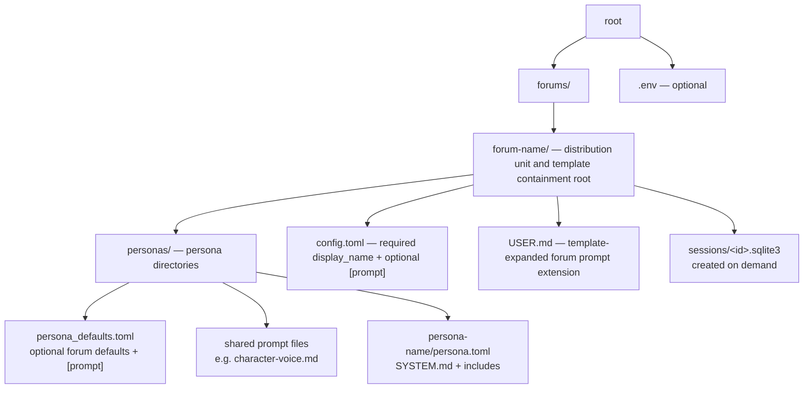
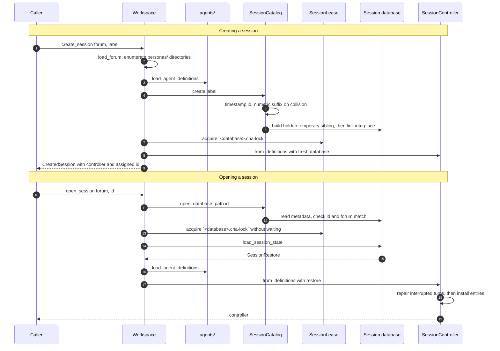
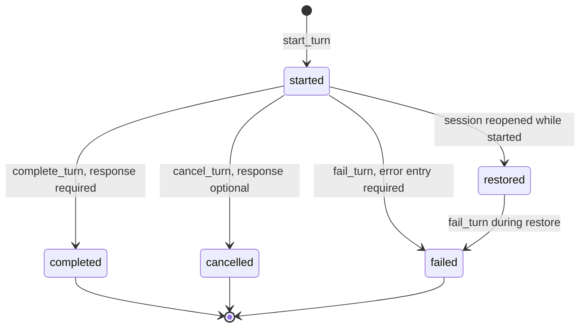

# Session layer

`session/` owns the reusable operations: it finds the workspace, manages session
files, persists the transcript, and coordinates one live chat. Every operation
it exposes is a typed C++ call — no command syntax, no widgets, no HTTP — so the
terminal front end, a future HTTP front end, and the tests all drive the same
code.

## Contents

| Source | Responsibility |
| --- | --- |
| `workspace.*` | Resolve the workspace layout, list and validate forums and sessions, load a forum's agent definitions, and build a controller; creation also returns the assigned session ID. |
| `session_catalog.*` | List, create, and safely resolve the SQLite session files of one forum. |
| `session_lease.*` | Acquire and own the cross-process companion-file lock for one live session. |
| `session_database.*` | Create and validate a session database, restore a transcript, and journal turn transitions through `SessionJournal`. |
| `forum_personas.*` | The ordered persona identities in a forum, including validation, lookup, and handle resolution. |
| `session_controller.*` | Own one live session: commands, the in-flight response batch, agent events, default agent, notices, and shutdown. |
| `generation_status.h` | `GenerationStatus`, `ResponsePhase`, and the shared generation-in-progress notice. |

## Workspace layout

`Workspace` refuses to construct unless `forums/` exists.
The `forums/` directory must contain at least one forum subdirectory; its names
are sorted before presentation. Each forum's `personas/` directory must contain
at least one persona subdirectory, also sorted before loading. Every directory
name is checked with `require_path_component()` before it becomes a path.
Each forum's `config.toml` must provide a non-empty string `display_name` for
user-facing selection and listings; its directory name remains the stable ID.
Each persona directory likewise supplies its stable ID, while its
`config.toml` provides the required user-facing `display_name`. The loader
rejects the removed persona-level `id` and `name` fields.

The forum directory is both the distribution unit and the prompt-template
containment root: includes in `SYSTEM.md` / `USER.md` cannot leave it, so a
zipped forum stays self-contained when unpacked elsewhere.

When a session is created or opened, `Workspace` checks for
`personas/persona_defaults.toml` within the selected forum and explicitly passes that optional path, the
forum directory, and the forum display name to the agent loaders along with each
persona directory. The agent layer therefore applies shared configuration and
template policy without knowing or inferring the workspace layout.

`Workspace::check_forum()` follows the same loading path without creating or
opening a session. It also constructs `ForumPersonas` to validate persona IDs,
display names, and uniqueness, giving the console's `--check` mode the same
static validation a real session receives before provider initialization. It
does not inspect the optional `sessions/` directory or resolve provider
credentials and models.

## Forum personas

`ForumPersonas` is the identity-only view of the personas participating in one
forum. It is ordered, non-empty, and rejects duplicate IDs and
ASCII-case-insensitive names. The first persona supplies the initial default
agent.

`resolve_handle()` tries an exact case-insensitive name, retries after removing
trailing `,.;:!?`, and finally accepts a unique case-insensitive prefix. It
returns resolved, unknown, or ambiguous; `SessionController` owns the wording
of the corresponding user notices.

Model, API, and streaming details do not belong to `ForumPersonas`.
`AgentRegistry` exposes those separately as `AgentRuntimeInfo`, and
`SessionController` combines the two only for `/agents` and `/info`.

## Session operations

Creation publishes with `link(2)`, which fails rather than overwriting, so a
half-written database is never visible under a real session name and a collision
simply retries with the next numeric suffix. Listing is tolerant: a file that
fails validation still appears, with its error attached, so the selector can
show it instead of hiding a broken session. `Workspace::create_session()`
returns a `CreatedSession` containing both the ready controller and the exact ID
that won publication; front ends can therefore report or retain the ID without
rescanning the catalog.

Session paths are resolved only by `SessionCatalog`. Its `database_path()` and
`open_database_path()` require the session ID to be one safe path component
before appending `.sqlite3` beneath the forum's `sessions/` directory, so an
absolute path, `..`, or an ID containing a directory separator cannot escape
that directory.

Every live controller holds a `SessionLease` on `<database>.cha-lock`. The
companion file may remain after a run; only its non-blocking exclusive operating
system lock means the session is active. `Workspace` acquires the lease after
resolving a database but before restore, then moves it into `SessionController`.
The controller keeps it through explicit shutdown and journal destruction, so
`cha`, `chacon`, and future frontends fail immediately with `SessionBusyError`
when another process owns that stored session. Test-only controller factories
use an explicitly inactive lease instead of locking fixture databases.
On Windows, the companion handle intentionally omits `FILE_SHARE_DELETE`, so
the lock file cannot be deleted or renamed while its controller is alive.

## Persistence

One session is one self-contained SQLite file. Its `application_id` and
`user_version` are checked before anything else is read.

What the schema enforces on its own, independently of the C++ code:

- `session` and `state` are single-row tables, guarded by a `CHECK` on the
  primary key.
- A partial unique index on `turns` allows **one** `started` turn at a time.
- A partial unique index on `entries` allows **one** prompt per turn.
- `CHECK` constraints restate the entry model: participant identity where it is
  required, addressing only on human entries, `failed` status only for error
  entries, `complete` status only for human and notice entries, non-empty text
  for completed agent entries, and `streaming` status excluded entirely.
- `entries.request_id` references `turns.request_id`, with foreign keys on.

### Epochs

`/clear` does not delete anything. It increments `state.history_epoch`, and
restore only reads entries of the current epoch. Older rows stay in the file.

### Transactions

Each of `start_turn`, `complete_turn`, `cancel_turn`, `fail_turn`, and `clear`
is one transaction. `start_turn` writes the turn row, the prompt entry, and the
advanced `next_request_id` together; a terminal call writes the state change
and the response or error entry together. So the durable turn state and the
entry that explains it can never disagree.

### Turn states and recovery

A turn still in `started` when a session is opened is reported as an
`InterruptedTurn`. `SessionController::initialize()` must finish every one of
them through `fail_turn()` before any other journal write; only then does the
transcript become live. That is why `SessionRestore` documents the requirement
as part of its contract.

### What is never stored

Streaming status never reaches SQL: `require_storable_transcript_entry()` and
the schema constraints reject it. Reasoning is even further outside
persistence—it lives only in the active response and never enters a
`TranscriptEntry`. A cancelled agent response is stored only if it has answer
text. The off-record span and its marker entries are also run-time only:
reopening a session presents the complete durable conversation with no span and
no markers.

### Reviewed multicast durability tradeoff

Concurrent multicast deliberately has a narrower durability boundary than its
execution boundary. The database continues to permit one `started` turn: the
initial foreground child is journaled before the shared gate opens, while later
children may already be running or finished in memory before they become
foreground and receive their own durable turn records.

Consequently, a process crash can discard background child turn records,
addressed prompts, output, and completed answers that have not yet become
foreground. Recovery reports only the durably started foreground turn as
interrupted. This is a reviewed and accepted tradeoff. Multicast concurrency
and ordered transcript commits are requirements, but crash recovery of
background work is not.

The design therefore does not add a durable batch manifest, background-result
spooling, or out-of-order turn persistence solely to recover that work. When
choosing between additional crash durability and a simpler persistence and
controller model for multicast, simplicity wins. This decision concerns
process-crash recovery; normal event handling still commits every foreground
terminal outcome before making it visible.

## Session control

`SessionController` is the whole session behind one object. It has two halves:
read-only state, and commands that return `SessionUpdate` side effects.

| Command | Behavior | Update |
| --- | --- | --- |
| `submit_prompt(text, handle)` | Resolves the handle, or falls back to the default agent, and starts a turn. | On success `clear_input` + `render_needed`; on an unknown or ambiguous handle, or an empty prompt, only a notice — the draft text is left in the editor. |
| `clear_transcript()` | Bumps the durable epoch, then clears the live transcript. | `render_needed`, `clear_input`, notice. |
| `open_offrecord()` | Opens an off-record span at the current turn boundary. | On success `render_needed` + `clear_input` and no notice — the appended marker is the acknowledgement; on a precondition failure only a notice. |
| `extend_offrecord()` | Sets or moves the span's end to the current turn boundary. | As above. |
| `restore_offrecord()` | Cancels the span, returning its entries to model context. | As above. |
| `start_multicast(text, handles)` / `start_multicast_by_ids(text, ids)` | Resolves textual handles or stable IDs once, then captures one immutable pre-multicast history, stages every distinct target concurrently, and commits foreground turns in target order. | Starts the staged batch; terminal notices are retained until multicast completion or abort cleanup. |
| `session_information()` | Entry count plus the forum personas and their runtime details. | `render_needed`, `clear_input`, notice. |
| `agent_information()` | Forum personas and runtime details, marking the default. | `render_needed`, `clear_input`, notice. |
| `set_default_agent(handle)` | Changes the default for this run only. | `clear_input`, notice. |
| `request_stop()` | Cancels every live execution and starts non-blocking cleanup while retaining the foreground event channel, or says there is no active generation. | Immediate stopping notice, followed by the final stop notice after cleanup. |
| `receive()` | Drains the foreground channel, advances to already-buffered children in the same controller turn, and polls abort cleanup. | Merged updates; after shutdown drains its batch, `end_session` is true. |
| `shutdown()` | Cancels executions, commits the retained foreground terminal state, and joins the session pool. | — |

Every command except `request_stop()` and `receive()` is refused while a turn or
multicast is active, with the shared in-progress notice. The controller and its
forum-persona helpers format session notices — handle errors, forum-persona
text, `/info` — because their wording belongs to the session, not to a UI.
For read-only activity checks, `is_generating()` avoids constructing a
`GenerationStatus` and copying its potentially growing reasoning text.
Frontends request the full status only when they are about to render it.

The three off-record commands are the only ones that add a transcript entry
without a journal write. Each passes the current `next_entry_id_` to the
matching `Transcript` mutation *without* incrementing it and advances the
counter only after a `true` result, so a refused command burns no ID. The
marker entries are never journaled; a later durable write simply leaves their
IDs as gaps, which entry IDs already permit.

The controller does **not** parse `/commands`, mentions, HTTP routes, or JSON.
Front ends translate those into these calls.

## The in-flight turn

`SessionController` holds the mechanics and state of one in-flight response
batch. An ordinary prompt is represented as a one-child batch.

Starting a batch, in order:

1. Resolve and deduplicate every target, then capture one immutable pre-batch
   history and build every complete `CompletionInput`, including its moved run
   specification.
2. Stage all pool tasks behind a closed gate. A staging failure opens no gate,
   calls no backend, waits for any already-submitted task, and creates no
   durable turn.
   Expected runtime refusals are reported as
   `Request could not be dispatched` and preserve the user's draft; invalid
   inputs are controller bugs and propagate. The one live registry batch keeps
   each run at its stable controller index.
3. Persist `start_turn()`, add the human entry, and install the active response.
   If in-memory activation fails after the journal write, the controller
   compensates with `fail_turn()` and discards the gated batch.
4. Open the gate once. Every staged backend may now begin concurrently, while
   only the foreground child's events are applied to the transcript. The
   background work remains intentionally volatile until each child becomes
   foreground, as described in the reviewed durability tradeoff above.

After a foreground terminal event is committed, the controller selects the next
child, activates its turn, and drains its already-buffered events in the same
controller turn. It clears the whole batch after its final terminal event.

Applying events:

| Event | Effect |
| --- | --- |
| Reasoning `AgentDelta` | Appends to ephemeral active-response state; the first sets phase to `reasoning`. |
| Answer `AgentDelta`, first one | Opens the streaming transcript entry, appends the answer, and sets phase to `answering`. |
| Answer `AgentDelta`, later | Appends answer text to the open transcript entry. |
| `AgentCompleted` while answering | `complete_turn()`, then finish the entry as `complete`. |
| `AgentCompleted` before any answer | Treated as failure: "completed without answer content". |
| `AgentCancelled` while answering | `cancel_turn()` with the partial answer, entry finished as `cancelled`. |
| `AgentCancelled` earlier | `cancel_turn()` with no response; ephemeral reasoning is cleared. |
| `AgentFailed` | `fail_turn()` with an error entry, the open streaming entry is discarded, the error is added to the transcript. |

Events whose request ID does not match the active turn are ignored, which is
what makes a cancelled turn's late fragments harmless.

`ResponsePhase` is monotonic during normal generation:
`waiting` → `reasoning` → `answering`. The separate `stopping` phase is an
abort-cleanup overlay. It keeps the foreground agent name visible while the
registry commits that child's terminal event and waits for all remaining
executions. A foreground completion already queued when `/stop` is processed wins
the race and is committed normally.

## Failure policy

Persistence failures are not recoverable at this level. Every journal call is
wrapped with the operation it was attempting — "Failed to persist completion of
request 7 for @Name" — and rethrown. The session ends rather than continuing
with a transcript the database does not agree with. Provider failures, by
contrast, are ordinary events: they become error entries and notices, and the
session continues.

## Dependencies

- **Depends on:** `transcript/` for transcript values, `agents/` for
  definitions, runtime information, execution, and events, `util/` for path and text
  helpers, and SQLite for storage.
- **Must not depend on:** `ui/` or `apps/`.

## Tests

| Test | Covers |
| --- | --- |
| `tests/session/unit_workspace.cpp` | Layout resolution, forum loading and checking, session create/open. |
| `tests/session/unit_session_catalog.cpp` | Listing, identity validation, collision handling, publish semantics. |
| `tests/session/unit_session_controller.cpp` | Command behavior, concurrent staging, ordered foreground drain, persistence ordering, stop races, activation-failure teardown, large buffered background output, restore, and repair. |
| `tests/transcript/unit_transcript.cpp` | `SessionJournal` and the session database, checked against the in-memory model they mirror: turn transitions, rollback, constraint violations, interrupted-turn recovery, and version rejection. |

Those database tests link `cha_sqlite3` directly, so they can assert on the
stored schema and rows rather than only on what the C++ API reports.
