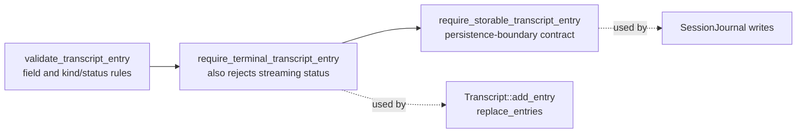
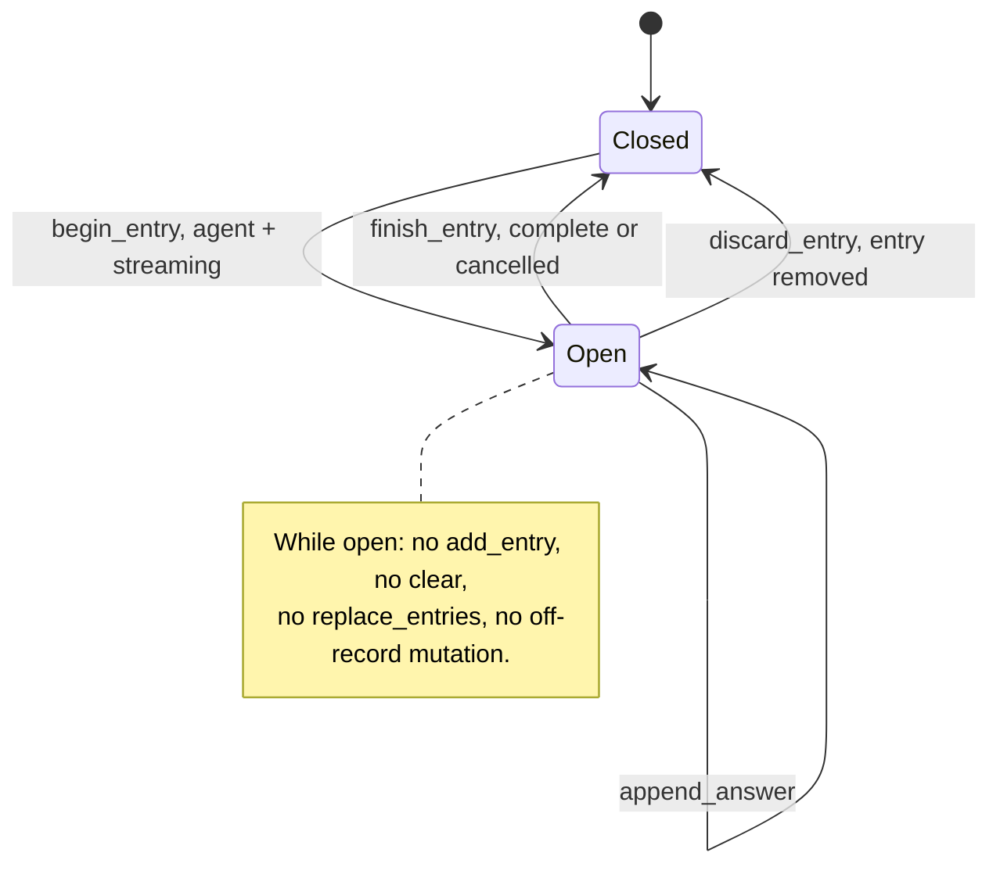
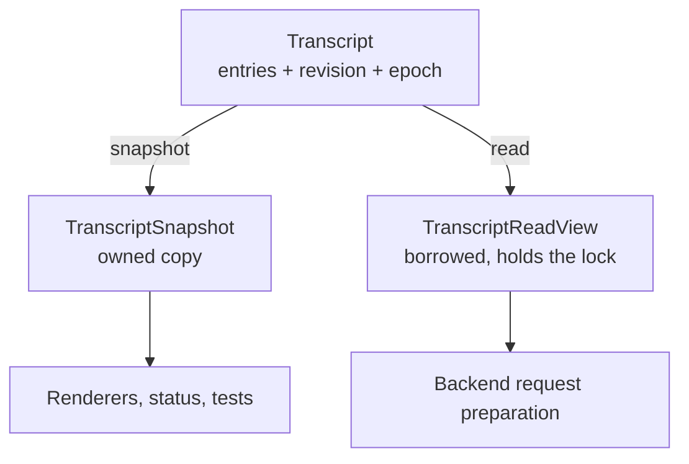

# Transcript model

`transcript/` owns the presentation-neutral transcript model: what a
transcript entry means, and how live transcript state changes. It is the
vocabulary the rest of the system shares, and it knows nothing about how entries
are rendered, stored, or sent to a provider.

This is a leaf. Everything else may depend on it; it depends on nothing in the
project.

## Contents

| Source | Responsibility |
| --- | --- |
| `transcript.h` | IDs, `EntryKind`, `EntryStatus`, `TranscriptEntry`, `OffrecordSpan`, factories, validators, `TranscriptSnapshot`, `TranscriptReadView`, and the `Transcript` container. |
| `transcript.cpp` | Factory construction, the validation rules, and the synchronized mutation and read operations. |

## The entry model

`TranscriptEntry` is the one record every layer agrees on. It deliberately
separates four things that are easy to conflate:

| Field group | Purpose |
| --- | --- |
| `id`, `request_id` | Position in the transcript, and the turn the entry belongs to. |
| `kind`, `status` | What the entry *is* and how its content ended. |
| `participant_id`, `display_name` | Who produced it — stable identity versus the label shown. |
| `addressed_to`, `addressed_to_name` | Who a human prompt was sent to. Only human entries carry this. |
| `text` | User text, agent answer text, or system/error text. |

Four kinds and four statuses combine only in these ways:

| Kind | Allowed status | Notes |
| --- | --- | --- |
| `human` | `complete` | Must name the agent it addresses. |
| `agent` | `streaming`, `complete`, `cancelled` | Never `failed` — a failed turn produces an `error` entry instead. Terminal agent entries require non-empty answer `text`. |
| `notice` | `complete` | Session messages; no participant identity. Ordinary notices are labelled `"System"`; the off-record markers are the only notices with another display name. |
| `error` | `failed` | May carry the participant it concerns and the request it ends. |

Provider reasoning is not transcript content. The session layer holds it only
while a response is active and clears it when the turn ends.

Entries are built through factories — `make_human_entry`, `make_agent_entry`,
`make_notice_entry`, `make_error_entry` — so the fixed fields of each kind
(`participant_id` `"human"`, display names `"You"`, `"System"`, `"Error"`) are
never spelled out by callers. `make_hide_on_marker`, `make_hide_marker`, and
`make_hide_off_marker` build the off-record markers the same way: notices with
empty text whose display names are `"hide-on"`, `"hide"`, and `"hide-off"`.

## Validation levels

The same rules apply at three increasing strengths, so each boundary can demand
exactly what it needs:

The named storage guard keeps persistence policy explicit even though every
terminal transcript entry is currently storable.

## The live transcript

`Transcript` is the only mutable transcript state shared between threads.
It has a single-writer design: the main thread mutates, any thread may read
under the lock.

| Operation | Rule |
| --- | --- |
| `add_entry` | Terminal entries only; refused while an entry is streaming. |
| `begin_entry` | Opens the one streaming entry; must be an agent entry with `streaming` status. |
| `append_answer` | Appends answer text to the open entry only. |
| `finish_entry` | Closes it as `complete` or `cancelled`, re-checking the content rules. |
| `discard_entry` | Drops the open entry entirely — used when a turn fails mid-stream. |
| `clear` | Empties the visible history, resets the off-record span, and bumps `history_epoch`. |
| `replace_entries` | Installs a restored transcript, validating order and terminality; resets the off-record span and bumps `history_epoch`. |
| `open_offrecord` | Opens the span at the current boundary and appends `[hide-on]`. |
| `extend_offrecord` | Sets or moves the span's end to the current boundary and appends `[hide]`. |
| `restore_offrecord` | Clears both bounds and appends `[hide-off]`. |
| `open_silent_offrecord` | Opens the same span without a marker, ID, revision, or epoch change; internal misuse throws. |
| `extend_silent_offrecord` | Advances that silent span's end without a presentation change; internal misuse throws. |
| `restore_silent_offrecord` | Clears a silent span without a presentation change; internal misuse throws. |

Every presentation-changing mutation bumps `revision`, and every entry ID must
be strictly greater than the last. The silent off-record mutations deliberately
change neither: they have no visible effect. Renderers use `revision` to detect
change and `history_epoch` to detect that everything they had drawn is now
invalid. The marker-producing off-record mutations bump `revision` for their
marker like any other insertion, but leave `history_epoch` alone: nothing
already drawn becomes invalid.

### The off-record span

`OffrecordSpan` is a half-open range of entry IDs excluded from model context
while remaining fully visible on screen. It lives in `Transcript` because that
is the one place a reader can take the bounds and the entries they describe
under a single lock; `TranscriptReadView::offrecord_span()` is how the agent
thread gets it. `TranscriptSnapshot` has no span field — renderers never need
the bounds, only the marker entries already in `entries`.

Bounds are **boundary values, not entry references**: `begin` and `end` are
numeric cuts one past the transcript tail, which stay meaningful across the
gaps entry IDs are allowed to have. `contains()` requires both bounds, so a
span with only `begin` set hides nothing.

The three marker-producing mutations each take the ID of the marker to append
and return whether the command precondition held. On success, checking the precondition, capturing
the boundary, assigning the one bound, and appending the marker all happen under
one lock; a `false` result changes neither bounds nor entries, so the caller can
allocate the entry ID only once the command has actually applied. The boundary
is captured *before* the marker is appended, which is why `[hide-on]` falls
inside the span it opens and `[hide]` falls outside the span it closes. Both are
notices, and notices never reach model context in any case.

Neither the bounds nor the markers are persisted, and `clear()` and
`replace_entries()` reset the bounds so no caller has to remember to.

### Streaming entry lifecycle

### Two ways to read

Use a **snapshot** when the reader will hold the data across work of its own —
that is what the terminal renderer does. Use a **read view** when the reader
needs the entries without copying them and can finish quickly: the agent thread
takes one to project the model context, then releases it before any network I/O.
A read view holds the transcript mutex for its whole lifetime, so blocking
inside one blocks the writer.

## Dependencies

- **Depends on:** nothing in the project.
- **Depended on by:** `agents/` (projection and request preparation),
  `session/` (coordination and persistence), `ui/` (rendering).

Persistence and presentation choices stay outside this directory. The model may
expose what those consumers need, but it must never import SQLite, provider
protocol, or terminal concepts.

## Tests

`tests/transcript/unit_transcript.cpp` covers the factories, every
validation rule, the streaming lifecycle, ID ordering, the off-record bound
states and their markers, and snapshot/read-view consistency — including that a
read view really does block the writer.

The same file also tests `SessionJournal` and the session database, on
purpose: the SQL `CHECK` constraints are a second encoding of the rules above,
and the tests assert both encodings agree.
