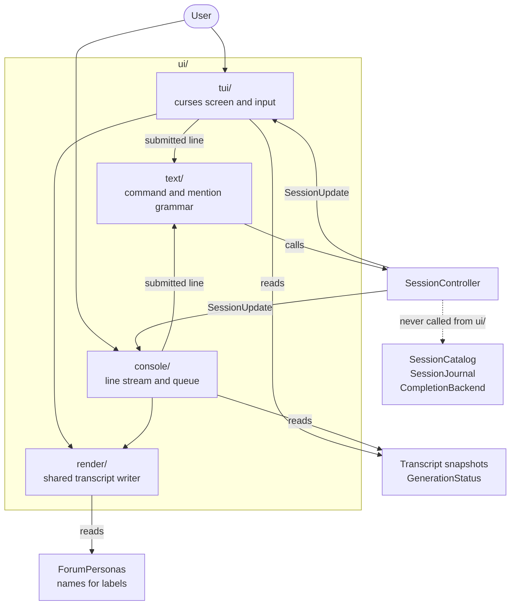

# UI

`ui/` holds everything the user touches: the front ends, and the input grammar
they share. A front end may interpret input, keep protocol-specific state, and
render session-layer values — but chat policy, agent execution, and persistence
stay in `session/` and below.

The test for whether code belongs here: could a different front end need the
same behavior? If yes, it belongs below `ui/`.

## Contents

| Directory | Responsibility |
| --- | --- |
| `text/` | The reusable textual grammar: slash commands and `@mention` addressing, dispatched to `SessionController`. |
| `render/` | Shared transcript labels, attributes, and writing operations. |
| `tui/` | The ncurses front end: terminal lifecycle, startup selection, input editing, screen layout, and redraw planning. |
| `console/` | The line-oriented frontend: CLI selection, non-blocking input, queued dispatch, signals, and append-only output. |

`text/` and `render/` are separate from the frontends because neither the
command language nor transcript labels are curses concepts. A new input box or
streaming protocol can reuse them while retaining its own event and layout
policy.

## Where a front end sits

The dashed edge is the rule: a front end never opens a session catalog, reads
workspace layout files, or calls a completion backend. If a front end needs
something it cannot express through `SessionController` or `Workspace`, the fix
is a new operation there — not a shortcut here.

## Dependency contract

Code under `ui/` may depend on:

- `session/` for controller operations, generation status, and presentation-safe
  summaries such as `SessionSummary`;
- `transcript/` for presentation-ready transcript values;
- the shared grammar and transcript writer;
- narrowly scoped `util/` helpers where protocol parsing needs them;
- `ForumPersonas` from `session/` when a presentation needs persona names — for
  example deciding whether to label who a message was addressed to or naming
  the console's current-default-agent prompt.

It may not depend on `apps/`, on another front end's widgets, or on anything the
two lists above exclude. In particular, `ui/tui/` and `ui/console/` must never
include one another.

## Adding another front end

A future `http/` front end would translate routes, authentication, request
bodies, and response framing around the same session-layer operations:

| Concern | Where it goes |
| --- | --- |
| Route table, auth, JSON request and response types | The new front end. |
| Streaming response framing, e.g. SSE to browsers | The new front end, fed by `SessionController::receive()`. |
| Session listing and opening | `Workspace`, unchanged. |
| Turn semantics, persistence, cancellation | `SessionController`, unchanged. |
| Command grammar | Reuse `text/`, or skip it if routes already say what to do. |
| Process wiring and lifetime | A new file in `apps/`. |

`TranscriptEntry` and `GenerationStatus` may be serialized directly when their
shape already suits the transport. Session-persistence and agent-runtime types
must not become transport contracts — they are internal, and freezing them into
a public API would pin down layers that need to stay free to change.

## Documents

- [`text/README.md`](text/README.md) — the grammar and dispatch rules.
- [`render/README.md`](render/README.md) — shared transcript writing.
- [`tui/README.md`](tui/README.md) — the ncurses frontend.
- [`console/README.md`](console/README.md) — the line-oriented frontend.
