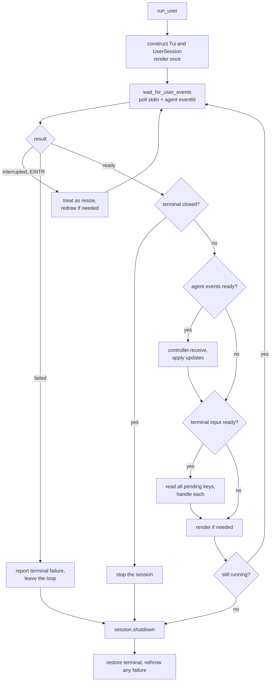
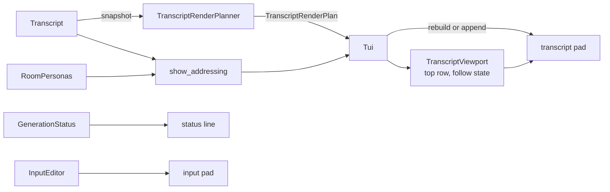

# Terminal front end

`ui/terminal/` is the ncurses front end: it owns the terminal itself,
the screens shown before a chat starts, the input editor, the transcript
rendering, and the event loop that ties keyboard input and streamed agent output
together.

Everything that decides *what* a session does lives in `session/`. This
directory decides only how it looks and how input reaches it.

## Structure

### Terminal lifecycle and startup

| Source | Responsibility |
| --- | --- |
| `terminal.*` | The process-wide ncurses lifecycle: setup, mode switching between selection and chat, resize, restoration. |
| `startup_selector.*` | The room and session pickers, plus the new-session name prompt, drawn from presentation-safe values. |

### Session input and control

| Source | Responsibility |
| --- | --- |
| `input_editor.*` | Wide-character multiline draft text: cursor movement, editing, continuation lines, UTF-8 on submit. |
| `session_view.h` | `SessionInput` and the `SessionView` seam that isolates session logic from curses. |
| `user_session.*` | The session state machine: input to actions, `SessionUpdate` to screen. |
| `user.*` | `UserEvents` plus `run_user()` — the poll loop and orderly shutdown. |

### Rendering

| Source | Responsibility |
| --- | --- |
| `transcript_renderer.*` | Entry styling and labels, incremental render planning, scrolling, and row layout estimation. |
| `tui.*` | The curses `SessionView`: pads for transcript and input, the status line, key decoding. |

## The event loop

The whole chat runs on one thread, blocked in a single `poll(2)` over stdin and
the agent event descriptor. There are no timers and no polling intervals.

Agent events are applied **before** keyboard input when both are ready, so the
screen reflects the newest model output before it reacts to a keystroke.
Rendering happens once per loop iteration, not once per event: `UserSession`
only sets a flag, and `render_if_needed()` collapses a burst of deltas into a
single repaint.

## Session state machine

`UserSession` is the testable core — it touches the screen only through
`SessionView`.

| Input | While idle | While generating |
| --- | --- | --- |
| Printable key | Insert into the editor, clear the notice | Same — typing during generation is allowed |
| `Enter` | Submit, unless the line ends with `\`, which starts a continuation line | Submit is refused by `text/` with a notice |
| `Esc` | Clear the editor and the notice | Cancel the turn |
| `Ctrl-C` | Exit the session | Cancel the turn |
| `Page Up` / `Page Down` | Scroll the transcript | Same |
| Arrows, `Home`, `End`, `Backspace`, `Delete` | Edit the draft | Same |
| Resize | Re-lay out through `Terminal` | Same |

Submitted text goes to `handle_text_input()` in [`../text/`](../text/README.md);
the resulting `SessionUpdate` is applied uniformly — clear the editor, set
the notice, request a repaint, end the session — whichever fields it sets.

## Rendering pipeline

The screen is three regions: a scrollable transcript pad, a reverse-video status
line, and a boxed multiline input pad. Below a minimum size the UI draws
only "Terminal is too small".

- **`TranscriptRenderPlanner`** compares the newest snapshot with what was last
  drawn and returns *none*, *append*, or *rebuild*. Streaming answer text becomes
  an append; a width change, a history reset, a shrunk transcript, or any edit
  that is not pure appended text forces a rebuild. This is what keeps a long
  transcript cheap to update while a response streams in.
- **`TranscriptViewport`** owns the scroll offset and whether the view is still
  following new output, so a user who has scrolled back is not dragged forward.
- **`TranscriptSurface`** is the styling sink. `write_transcript_entry()` writes
  a bold label — `[You]`, `[You → Name]`, `[Agent: Name]`, `[System]`,
  `[Error]`. While a turn is active, `write_active_response()` adds the
  ephemeral dim `[Reasoning]` block above any streamed answer. Tests implement
  this interface and assert on recorded output instead of driving curses.
- **`show_addressing()`** decides whether labels name the addressee at all: it is
  true in any multi-agent room, and also in a single-agent room whose transcript
  contains entries from or to somebody else — which is what a session reopened
  after the personas in a room change.

The status line shows `[Idle]`, or `[Name generating|reasoning|responding]` with
the cancel hint, and appends the current notice when there is one.

## Terminal ownership

`Terminal` is constructed once in `main()` and shared. It sets the locale,
enters curses, and switches modes: blocking input with a hidden cursor for the
startup selectors, non-blocking input with a visible cursor for the chat. Both
`StartupSelector` and `Tui` borrow it rather than configuring the screen
themselves, and `restore()` is idempotent so unwinding is safe from anywhere.

`run_user()` restores the terminal *before* rethrowing a failure, so an error
message never lands on a screen still in curses mode.

## Dependencies

- **Depends on:** `session/` for controller operations, generation status,
  and session summaries; `transcript/` for snapshots and entries;
  `ui/text/` for command dispatch; `session/` for room-persona values used in
  labels; wide ncurses and POSIX polling.
- **Must not:** load workspace files, open session catalogs, or call
  completion backends.

## Tests

| Test | Covers |
| --- | --- |
| `tests/ui/terminal/unit_user_session.cpp` | The state machine against a fake `SessionView`: input handling, update application, cancel-versus-exit, notices. |
| `tests/ui/terminal/unit_transcript_renderer.cpp` | Render plans, labels and styling through a recording `TranscriptSurface`, viewport scrolling, row layout. |
| `tests/ui/terminal/unit_user.cpp` | Event-loop readiness decoding and shutdown ordering. |

Curses itself is never required by the unit tests — that is the point of
`SessionView` and `TranscriptSurface`.
