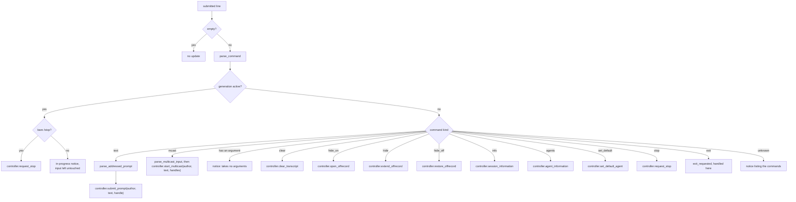

# Text input grammar

`ui/text/` owns the textual grammar a chat input box accepts: slash commands and
optional leading `@mentions`. It parses a line, applies the rules about what may
be typed when, and calls `SessionController` operations. It knows nothing about
curses, storage, or providers.

## Contents

| Source | Responsibility |
| --- | --- |
| `command.*` | `parse_command()` — recognizes `/clear`, `/hide-on`, `/hide`, `/hide-off`, `/mcast`, `/info`, `/agents`, `/stop`, `/exit`, and `/@Name`, splitting off any argument. |
| `mcast.*` | `parse_multicast_input()` — parses recipient lists and prompts for `/mcast`. |
| `mention.*` | `parse_addressed_prompt()` — splits a leading `@Name` from the prompt text, with `@@` as the escape for a literal at-sign. |
| `text_input.*` | `handle_text_input()` — the policy layer that turns a parsed line and its author ID into controller calls. |

## The grammar

| Input | Meaning |
| --- | --- |
| `hello` | Prompt for the default agent. |
| `@Ada hello` | Prompt addressed to `@Ada`. The handle may be any unambiguous case-insensitive prefix. |
| `@@channel hi` | Literal text `@channel hi` — no addressing. |
| `@` alone, or `@ ` | Not a mention; sent as ordinary text. |
| `/clear`, `/hide-on`, `/hide`, `/hide-off`, `/info`, `/agents`, `/stop`, `/exit` | Commands. They take no arguments. |
| `/mcast prompt` | Sends `prompt` to every forum character in order. |
| `/mcast @Ada, @Grace. prompt` | Sends `prompt` to the named characters in that order. `@@` starts a literal `@` prompt. |
| `/@Ada` | Set the default agent for this run. |
| `/anything-else` | Unknown command; produces a notice. |

Mentions are recognized only at the start of a line, after leading whitespace.
Trailing punctuation on a handle (`@Ada, hello`) is tolerated during resolution
in `ForumCharacters`, not here.

The parser never resolves a handle. `handle_text_input()` receives the selected
author's stable persona ID and hands it with text and multicast handles through
to `SessionController`. The controller resolves the author against the
session's captured persona roster and the handles against `ForumCharacters`, so the
grammar cannot go stale when the characters in a forum change.

## Dispatch

Two policies live in this file and nowhere else:

- **While a turn is running, only a bare `/stop` is dispatched.** Everything else
  returns the shared in-progress notice *without* clearing the editor, so a
  message typed during generation survives and can be sent afterwards.
- **`/exit` never reaches the session layer.** Ending a session is a front-end
  decision, expressed as `exit_requested` in `TextInputResult`.
- **Editor clearing is text policy.** `TextInputResult` combines a semantic
  `SessionChange` with `clear_input` and `exit_requested`; the controller only
  reports whether submitted input was consumed.

## Dependencies

- **Depends on:** `session/` for `SessionController`, `SessionChange`, and
  the shared generation-in-progress notice; `util/` for byte-oriented whitespace
  handling.
- **Must not depend on:** terminal widgets, curses, session catalogs, or
  agent backends.

## Tests

| Test | Covers |
| --- | --- |
| `tests/ui/text/unit_command.cpp` | Command recognition, argument splitting, `/@Name`. |
| `tests/ui/text/unit_mention.cpp` | Mention splitting, `@@` escaping, whitespace and degenerate cases. |
| `tests/ui/text/unit_text_input.cpp` | Dispatch policy, including the active-generation rules and `/exit`. |
# Application commands

`application_command.*` owns the fixed-arity terminal navigation grammar for
`/iam`, `/open`, `/create`, `/forums`, `/sessions`, `/members`, `/personas`,
and `/help`.
It parses public names (including double-quoted names) only; resolution and
session switching remain in `application/`. The existing `text_input.*` entry
point remains controller-scoped for the web frontend. The terminal command set
is `/iam`, `/open`, `/create`, `/forums`, `/sessions`, `/members`, `/personas`,
and `/help`; names use ASCII-folded lookup and double quotes preserve
whitespace.
