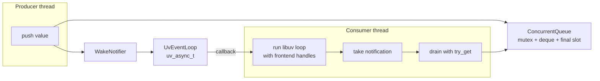

# Utilities

`util/` holds small, broadly reusable helpers that belong to no single domain.
It is a leaf: nothing here may know about transcripts, agents, sessions, or
front ends. If a helper starts encoding policy from one of those areas, it
belongs in that directory instead.

## Contents

| Source | Responsibility |
| --- | --- |
| `text.*` | Byte-oriented whitespace tests, trimming, and ASCII case folding. |
| `text_template.*` | Prompt template expansion: `$$(path)` includes, `$${name}` variables, and `[prompt]` scope loading. |
| `path_name.*` | `require_path_component()` — a configured name must be one safe path component. |
| `utf8_path.*` | Converts between UTF-8 application text and native filesystem paths. |
| `environment.*` | `load_dotenv()` — optional `.env` loading that never overrides the real environment. |
| `logging.*` | File-only spdlog initialization from workspace application settings. |
| `concurrent_queue.h` | `ConcurrentQueue<T>` — a portable typed thread-safe queue. |
| `thread_pool.*` | `ThreadPool` — a fixed-size executor for session-scoped blocking work. |
| `wake_notifier.h` | `WakeNotifier` — the event-loop wake interface used by producers. |
| `uv_event_loop.*` | `UvEventLoop` — the portable libuv loop and cross-thread wake adapter used by the terminal frontends. |

## Text helpers

These centralize the ASCII rules used by command parsing, agent-handle matching,
list-file reading, and environment loading. They are deliberately byte-oriented:
no locale, no Unicode normalization. Handle matching is case-insensitive only in
the ASCII range, which is exactly what the agent-name rules allow.

## Path safety

`require_path_component()` rejects empty names, absolute paths, anything with a
separator, and `.` / `..`. Every workspace-controlled name — a forum directory,
a persona directory, a session ID derived from a
filename — passes through it before it is joined onto a path. That chokepoint
keeps configured names from addressing anything outside the workspace.

Prompt-template includes need a second rule. An include path is resolved relative
to the including file and may leave a persona directory to reach shared forum
text, so component checking cannot apply. Instead `expand_template_file()`
canonicalizes every template and scope file it reads and requires it to lie
under a caller-supplied containment root (the forum directory). The comparison
is path-component-wise, not a string-prefix test.

## Prompt templates

`expand_template_file()` recognizes `$$(relative/path)` includes and
`$${variable}` substitutions. Macro bodies are trimmed. Includes are expanded
in place without adding whitespace, may repeat, and must resolve to regular
files. `$$$` emits a literal `$$`, allowing macro-looking text to pass through.

The caller supplies an initial scope and unshadowable reserved values. For each
file, the engine overlays the named table (normally `[prompt]`) from the named
adjacent scope file (normally `config.toml`) onto the inherited scope, then
passes the result into included files. Scope values may be TOML strings,
integers, floating-point numbers, or booleans. Unknown variables and
non-scalar values are errors.

Expansion reports file, line, column, and include-chain context. It rejects
malformed macros, missing or non-regular includes, cycles, containment escapes,
and symlink escapes. Default resource limits are 16 active files, 256 include
expansions, and 1 MiB of combined output for one root expansion.

## UTF-8 paths

`utf8_path()` formats native filesystem paths as UTF-8 for diagnostics and
libraries such as SQLite. `path_from_utf8()` constructs native paths from
UTF-8 workspace names and command-line text, avoiding Windows code-page
conversion. Windows console startup uses the same UTF-8 boundary for its
UTF-16 command line.

## Dotenv loading

`load_dotenv()` reads `NAME=value` lines, ignoring blanks and `#` comments and
accepting simple quoting. A missing file is fine; a malformed entry or an
unreadable existing file is an error. Variables already present in the process
environment always win, so a shell export beats the file — which is what makes
`api_key_env` usable in both development and deployment.

## Diagnostic logging

`initialize_diagnostic_logging()` is called by each composition root after it
loads the workspace's `app.toml` and before any worker starts. The configured
level `off` leaves logging disabled; supported levels are `trace`, `debug`,
`info`, `warn`, `error`, and `critical`. Every enabled level creates any missing
parent directories and opens the named, synchronous, thread-safe spdlog file
logger used by worker instrumentation. Every diagnostic event is flushed so a
timing investigation can inspect the file while a request is still active. The
logger has no console sink and rotates at 10 MiB, retaining three files.

## Queue and event-loop notification

Queue storage and event-loop notification are separate. `ConcurrentQueue<T>`
contains no descriptor or operating-system dependency. Producers that also need
to wake a frontend call its injected `WakeNotifier` after a successful push.
`close()` preserves already queued values. `close_with(value)` additionally
stores one final value in a reserved optional slot, so readers drain the deque,
then that value, then observe closure without terminal delivery allocating
deque storage. The first close operation wins.

Semantics worth knowing:

| Operation | Behavior |
| --- | --- |
| `push` | Enqueues a value. Returns `false` if the queue is closed. |
| `get` | Blocks until a value arrives. After close, drains queued values, then the reserved closing value when present, and then returns `nullopt` forever. |
| `try_get` | Never blocks; drains queued values and then the reserved closing value before distinguishing *empty* from *closed*. |
| `close` | Stops new writes and wakes blocked readers. Already queued values are still delivered. |
| `close_with(value)` | Reserves one final value without allocating deque storage, stops new writes, and wakes blocked readers. The first close operation wins. |

`UvEventLoop` uses libuv's coalescing, thread-safe `uv_async_send()`. The
frontend observes the async callback before draining the producer's queue.
Notification is intentionally separate from storage: not every queue consumer
needs an event-loop wake.

`ThreadPool` builds a fixed number of workers around `ConcurrentQueue<Task>`.
`submit()` is thread-safe, `stop()` closes admission, drains accepted tasks, and
joins workers. Tasks that escape their exception boundary terminate the process;
agent executions convert backend failures to `AgentFailed` before returning.
The pool remains domain-neutral: cancellation is owned by its caller.

## Event-loop ownership

`UvEventLoop` owns only the loop and its async wake handle. Each frontend owns
the input and signal handles it adds to that loop. This keeps queue producers
independent of frontend policy and keeps native handle details out of the
session layer.

## Dependencies

- **Depends on:** the standard library, the process environment, libuv,
  spdlog, and toml++ (for `text_template.*` scope tables).
- **Must not depend on:** `transcript/`, `agents/`, `session/`, or
  `ui/`.
- **Used by:** agent code, workspace and session code, the text grammar, and
  the composition root.

## Tests

`tests/util/unit_text.cpp`, `tests/util/unit_text_template.cpp`,
`tests/util/unit_environment.cpp`, `tests/util/unit_concurrent_queue.cpp`, and
`tests/util/unit_uv_event_loop.cpp`.
