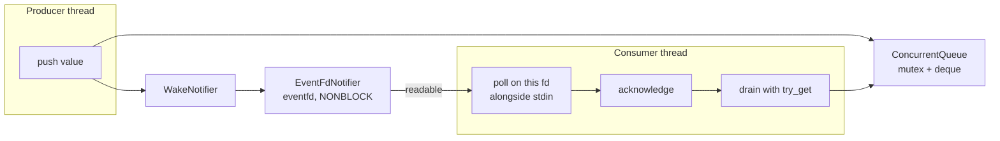

# Utilities

`util/` holds small, broadly reusable helpers that belong to no single domain.
It is a leaf: nothing here may know about transcripts, agents, sessions, or
front ends. If a helper starts encoding policy from one of those areas, it
belongs in that directory instead.

## Contents

| Source | Responsibility |
| --- | --- |
| `text.*` | Byte-oriented whitespace tests, trimming, and ASCII case folding. |
| `path_name.*` | `require_path_component()` — a configured name must be one safe path component. |
| `environment.*` | `load_dotenv()` — optional `.env` loading that never overrides the real environment. |
| `concurrent_queue.h` | `ConcurrentQueue<T>` — a portable typed thread-safe queue. |
| `wake_notifier.h` | `WakeNotifier` — the event-loop wake interface used by producers. |
| `event_fd_notifier.*` | `EventFdNotifier` — the Linux `eventfd` adapter used by the terminal frontends. |
| `input_wait.*` | `InputEvents` and `wait_for_input_events()` — semantic readiness for stdin, agent notification, and an optional signal descriptor. |

## Text helpers

These centralize the ASCII rules used by command parsing, agent-handle matching,
list-file reading, and environment loading. They are deliberately byte-oriented:
no locale, no Unicode normalization. Handle matching is case-insensitive only in
the ASCII range, which is exactly what the agent-name rules allow.

## Path safety

`require_path_component()` rejects empty names, absolute paths, anything with a
separator, and `.` / `..`. Every workspace-controlled name — a room from
`rooms.list`, a persona from `personas.list`, a session ID derived from a
filename — passes through it before it is joined onto a path. This is the single
chokepoint that keeps workspace files from addressing anything outside the
workspace.

## Dotenv loading

`load_dotenv()` reads `NAME=value` lines, ignoring blanks and `#` comments and
accepting simple quoting. A missing file is fine; a malformed entry or an
unreadable existing file is an error. Variables already present in the process
environment always win, so a shell export beats the file — which is what makes
`api_key_env` usable in both development and deployment.

## Queue and event-loop notification

Queue storage and event-loop notification are separate. `ConcurrentQueue<T>`
contains no descriptor or operating-system dependency. Producers that also need
to wake a frontend call its injected `WakeNotifier` after a successful push.

Semantics worth knowing:

| Operation | Behavior |
| --- | --- |
| `push` | Enqueues a value. Returns `false` if the queue is closed. |
| `get` | Blocks until a value arrives. After close, drains what is queued and then returns `nullopt` forever. |
| `try_get` | Never blocks; distinguishes *empty* from *closed* so a caller can tell "nothing yet" from "no more". |
| `close` | Stops new writes and wakes blocked readers. Already queued values are still delivered. |

`EventFdNotifier` uses a coalescing non-blocking `eventfd`. The terminal loop
acknowledges the wake before draining the event queue, which avoids losing a
wake that races with the drain. The request queue needs no notifier because the
agent thread blocks directly in `get()`.

## Input waiting

`wait_for_input_events()` wraps `poll(2)` and returns semantic flags rather than
leaking descriptor bits into either frontend. It reports readable or closed
stdin, pending agent notification, pending signal, interruption, and failure.
The console may temporarily omit stdin to apply pipe backpressure while still
waiting for agent and signal events. The TUI uses the same helper without a
signal descriptor.

## Dependencies

- **Depends on:** the standard library and the process environment. Linux-only
  adapters use `eventfd` and `poll`.
- **Must not depend on:** `transcript/`, `agents/`, `session/`, or
  `ui/`.
- **Used by:** agent code, workspace and session code, the text grammar, and
  the composition root.

## Tests

`tests/util/unit_text.cpp`, `tests/util/unit_environment.cpp`,
`tests/util/unit_input_wait.cpp`, `tests/util/unit_concurrent_queue.cpp`, and
`tests/util/unit_event_fd_notifier.cpp`.
