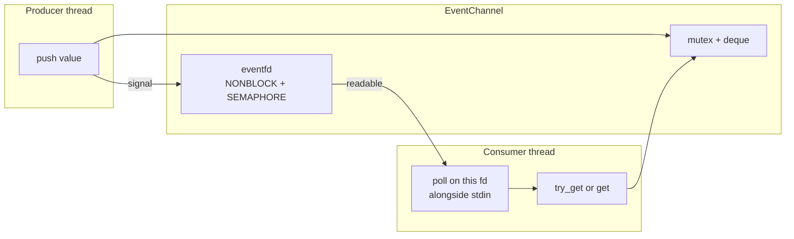

# Utilities

`util/` holds small, broadly reusable helpers that belong to no single domain.
It is a leaf: nothing here may know about transcripts, agents, sessions, or
front ends. If a helper starts encoding policy from one of those areas, it
belongs in that directory instead.

## Contents

| Source | Responsibility |
| --- | --- |
| `text.*` | Byte-oriented whitespace tests, trimming, and ASCII case folding. |
| `path_name.*` | `require_path_component()` — a configured name must be one safe path component. |
| `environment.*` | `load_dotenv()` — optional `.env` loading that never overrides the real environment. |
| `event_channel.h` | `EventChannel<T>` — a typed thread-safe queue with a pollable notification descriptor. |

## Text helpers

These centralize the ASCII rules used by command parsing, agent-handle matching,
list-file reading, and environment loading. They are deliberately byte-oriented:
no locale, no Unicode normalization. Handle matching is case-insensitive only in
the ASCII range, which is exactly what the agent-name rules allow.

## Path safety

`require_path_component()` rejects empty names, absolute paths, anything with a
separator, and `.` / `..`. Every workspace-controlled name — a room from
`rooms.list`, a persona from `personas.list`, a session ID derived from a
filename — passes through it before it is joined onto a path. This is the single
chokepoint that keeps workspace files from addressing anything outside the
workspace.

## Dotenv loading

`load_dotenv()` reads `NAME=value` lines, ignoring blanks and `#` comments and
accepting simple quoting. A missing file is fine; a malformed entry or an
unreadable existing file is an error. Variables already present in the process
environment always win, so a shell export beats the file — which is what makes
`api_key_env` usable in both development and deployment.

## EventChannel

This is the one non-obvious type here, and the reason the terminal loop can wait
on two unrelated things at once.

Semantics worth knowing:

| Operation | Behavior |
| --- | --- |
| `push` | Enqueues and signals. Returns `false` if the channel is closed; rolls back the value if signalling throws. |
| `get` | Blocks until a value arrives. After close, drains what is queued and then returns `nullopt` forever. |
| `try_get` | Never blocks; distinguishes *empty* from *closed* so a caller can tell "nothing yet" from "no more". |
| `close` | Stops new writes and wakes blocked readers. Already queued values are still delivered. |
| `notification_fd` | The descriptor to hand to `poll(2)`. |

The descriptor is opened with `EFD_SEMAPHORE`, so one read consumes one
notification and the counter tracks pending values. A saturated counter is
treated as "already signalled" rather than an error, because the reader is
guaranteed to wake anyway.

Two channels of this type carry all cross-thread traffic in `cha`: work items to
the agent thread, and `AgentEvent` values back to the UI.

## Dependencies

- **Depends on:** the standard library, the process environment, and POSIX
  primitives (`eventfd`, `poll`) in `event_channel.h`.
- **Must not depend on:** `transcript/`, `agents/`, `session/`, or
  `ui/`.
- **Used by:** agent code, workspace and session code, the text grammar, and
  the composition root.

## Tests

`tests/util/unit_text.cpp`, `tests/util/unit_environment.cpp`, and
`tests/util/unit_event_channel.cpp` — the last one covers blocking and
non-blocking reads, close semantics, and the descriptor's wake behavior under
concurrency.
